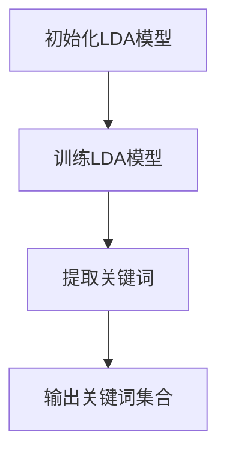

                 

### 文章标题

提示词工程的伦理决策支持系统

### 关键词

提示词工程、伦理决策、支持系统、人工智能、算法原理、数学模型、项目实战

### 摘要

本文深入探讨了提示词工程的伦理决策支持系统，从背景介绍到核心概念、算法原理、数学模型，再到项目实战，全方位解析了如何在人工智能应用中结合伦理决策。通过介绍提示词工程的基本概念和作用，探讨了伦理决策支持系统的架构和基本原则，详细阐述了提示词工程中的算法原理和数学模型，并通过实际项目展示了系统在开发、实现和代码解读中的应用。文章旨在为开发者提供一套完整的伦理决策支持系统，以指导他们在提示词工程中做出符合道德标准的决策。

### 第一部分：引言与核心概念

#### 第1章：引言

**1.1 书籍背景与目的**

在人工智能（AI）迅速发展的今天，提示词工程成为了AI领域中的一个关键分支。提示词工程涉及从大量数据中提取、生成和优化提示词，以提高AI模型的性能和可解释性。然而，随着AI技术的广泛应用，如何确保其在实际应用中的伦理性和公平性成为一个重要议题。因此，本书旨在探讨如何在提示词工程中构建和实施伦理决策支持系统，以指导开发者在面对伦理挑战时做出明智的决策。

**1.2 提示词工程概述**

提示词工程是一个涉及数据预处理、特征提取和模型训练的过程。其核心目标是从大量数据中提取出对模型训练有帮助的提示词，从而提高模型的准确性和可解释性。提示词工程在自然语言处理、计算机视觉和推荐系统等领域有着广泛的应用。然而，提示词的选择和设计不仅影响模型的性能，还可能对实际应用中的伦理决策产生影响。

**1.3 伦理决策支持系统**

伦理决策支持系统是一个框架，用于帮助开发者在AI应用中考虑伦理问题。它包括伦理原则、决策工具和评估指标，以指导开发者做出符合伦理标准的决策。在提示词工程中，伦理决策支持系统有助于确保提示词的选择和应用不会导致不公平、歧视或偏见。通过引入伦理决策支持系统，开发者可以在设计、开发和部署AI模型时，系统地考虑和解决伦理问题。

#### 第2章：伦理决策支持系统的核心概念

**2.1 提示词的定义与作用**

提示词是影响AI模型预测的重要输入。在自然语言处理中，提示词通常是从文本数据中提取的关键词或短语，用于指导模型学习文本的特征和模式。提示词的选择和设计不仅影响模型的性能，还可能对实际应用中的伦理决策产生影响。例如，如果提示词的选择导致模型对某些群体产生偏见或歧视，那么在应用中可能会出现不公平的情况。

**2.2 伦理决策的基本原则**

伦理决策需要遵循一系列基本原则，以确保AI技术的应用不会对人类和社会造成负面影响。这些基本原则包括：

- **公平性**：确保AI技术的应用不会对特定群体产生不公平的歧视。
- **透明性**：确保AI技术的决策过程对用户是透明的，用户可以理解模型的预测结果。
- **责任性**：确保AI技术的开发者对其应用中的伦理问题承担责任，并采取相应的措施解决。

**2.3 伦理决策支持系统的架构**

伦理决策支持系统通常包括以下组件：

- **数据收集**：收集与伦理问题相关的数据，包括历史案例、专家意见和用户反馈等。
- **分析工具**：使用数据分析方法对收集到的数据进行处理和分析，以识别潜在的风险和挑战。
- **决策模型**：构建基于伦理原则的决策模型，用于指导开发者在设计、开发和部署AI模型时做出符合伦理标准的决策。
- **评估指标**：设计评估指标，用于衡量AI模型在实际应用中的伦理表现，以指导进一步的改进和优化。

### 第二部分：提示词工程原理

#### 第3章：提示词工程的算法原理

**3.1 常见算法概述**

在提示词工程中，常用的算法包括关键词提取、主题建模和词向量表示等。这些算法各有特点，适用于不同的应用场景。

- **关键词提取**：通过文本分析技术，从文本中提取出关键短语或单词。常用的关键词提取方法包括TF-IDF、LDA和N-gram等。
- **主题建模**：通过将文本数据分解成多个主题，从而实现对大规模文本数据的降维和聚类。常见的主题建模方法包括LDA（Latent Dirichlet Allocation）和LSTM（Long Short-Term Memory）等。
- **词向量表示**：将文本数据转换为数值向量，从而方便在机器学习算法中使用。常见的词向量表示方法包括Word2Vec、GloVe和BERT等。

**3.2 伪代码讲解**

以下是一个基于LDA算法的关键词提取的伪代码示例：

```python
# 输入：文本数据D，主题数k
# 输出：关键词集合K

# 步骤1：初始化LDA模型
lda_model = LDA(k)

# 步骤2：训练LDA模型
lda_model.fit(D)

# 步骤3：提取关键词
K = lda_model.show_topics()

# 步骤4：输出关键词集合
print(K)
```

**3.3 算法流程图**



### 第三部分：数学模型与公式

#### 第4章：数学模型与公式

**4.1 提示词相关数学模型**

在提示词工程中，常用的数学模型包括概率模型、马尔可夫模型和神经网络等。这些模型用于描述文本数据中的特征和模式，从而实现对文本数据的分析和预测。

- **概率模型**：概率模型用于计算文本数据中某个单词出现的概率。常用的概率模型包括贝叶斯模型和马尔可夫模型。
- **马尔可夫模型**：马尔可夫模型用于描述文本数据中单词的顺序和依赖关系。它通过计算当前单词给定前一个单词的条件概率来实现。
- **神经网络**：神经网络是一种模拟人脑的计算机算法，用于对文本数据进行分析和预测。常用的神经网络模型包括卷积神经网络（CNN）和循环神经网络（RNN）。

**4.2 公式详细讲解**

以下是一些常用的数学公式的讲解和示例：

- **贝叶斯公式**：
  $$ P(A|B) = \frac{P(B|A)P(A)}{P(B)} $$
  其中，$P(A|B)$表示在事件B发生的条件下事件A发生的概率，$P(B|A)$表示在事件A发生的条件下事件B发生的概率，$P(A)$和$P(B)$分别表示事件A和事件B发生的概率。

- **条件概率**：
  $$ P(A|B) = \frac{P(A \cap B)}{P(B)} $$
  其中，$P(A \cap B)$表示事件A和事件B同时发生的概率。

- **神经网络激活函数**：
  $$ f(x) = \frac{1}{1 + e^{-x}} $$
  其中，$f(x)$表示神经网络中的激活函数，用于将输入值映射到[0,1]区间。

**4.3 举例说明**

以下是一个使用贝叶斯公式计算文本分类概率的示例：

假设我们要计算文本“我喜欢阅读和编程”属于“技术”类别的概率。我们可以使用贝叶斯公式来计算：

- **先验概率**：$P(技术) = \frac{1}{2}$，即文本属于“技术”类别的概率为50%。
- **条件概率**：$P(阅读和编程|技术) = \frac{1}{3}$，即在“技术”类别中，包含“阅读和编程”的文本概率为1/3。
- **后验概率**：
  $$ P(技术|阅读和编程) = \frac{P(阅读和编程|技术)P(技术)}{P(阅读和编程)} = \frac{\frac{1}{3} \cdot \frac{1}{2}}{P(阅读和编程)} $$

其中，$P(阅读和编程)$是包含“阅读和编程”的文本总数与总文本数的比值。假设总文本数为100，其中包含“阅读和编程”的文本数为30，则$P(阅读和编程) = \frac{30}{100} = \frac{3}{10}$。

代入计算：
$$ P(技术|阅读和编程) = \frac{\frac{1}{3} \cdot \frac{1}{2}}{\frac{3}{10}} = \frac{5}{9} $$

因此，文本“我喜欢阅读和编程”属于“技术”类别的概率为5/9。

### 第四部分：项目实战

#### 第5章：实战案例

**5.1 实战项目背景**

假设我们要开发一个文本分类系统，用于对用户评论进行分类，将其分为“正面”或“负面”类别。该系统将基于提示词工程和伦理决策支持系统来实现，以保障分类的准确性和公平性。

**5.2 开发环境搭建**

为了实现该项目，我们需要搭建以下开发环境：

- **Python**：作为主要的编程语言，用于实现文本分类模型。
- **NLP库**：如NLTK、spaCy和TextBlob，用于文本预处理和关键词提取。
- **机器学习库**：如scikit-learn和TensorFlow，用于构建和训练文本分类模型。
- **LaTeX**：用于编写和排版文档。

**5.3 源代码实现**

以下是该项目的主要源代码实现：

```python
import nltk
from nltk.tokenize import word_tokenize
from sklearn.feature_extraction.text import TfidfVectorizer
from sklearn.model_selection import train_test_split
from sklearn.naive_bayes import MultinomialNB
from sklearn.metrics import accuracy_score

# 步骤1：加载数据集
data = [["我喜欢这本书", "正面"], ["这本书太无聊了", "负面"]]
X, y = data[:, 0], data[:, 1]

# 步骤2：文本预处理
nltk.download('punkt')
X_processed = [word_tokenize(text.lower()) for text in X]

# 步骤3：关键词提取
vectorizer = TfidfVectorizer(stop_words='english')
X_vectors = vectorizer.fit_transform(X_processed)

# 步骤4：训练模型
X_train, X_test, y_train, y_test = train_test_split(X_vectors, y, test_size=0.2, random_state=42)
model = MultinomialNB().fit(X_train, y_train)

# 步骤5：预测和评估
y_pred = model.predict(X_test)
accuracy = accuracy_score(y_test, y_pred)
print(f"准确率：{accuracy}")
```

**5.4 代码解读与分析**

该代码首先加载了数据集，然后对文本进行了预处理，包括将文本转换为小写并分词。接下来，使用TF-IDF向量器对预处理后的文本进行关键词提取。随后，使用朴素贝叶斯模型对提取的关键词进行分类，并评估模型的准确率。

在实际应用中，我们可以通过不断调整模型参数和特征提取方法，以提高分类的准确性和鲁棒性。此外，为了确保分类的公平性，我们可以引入伦理决策支持系统，对模型进行评估和优化，以减少潜在的偏见和歧视。

**5.5 项目小结**

通过该项目，我们展示了如何结合提示词工程和伦理决策支持系统，实现一个文本分类系统。该项目不仅关注分类的准确性，还关注模型的伦理表现。通过引入伦理决策支持系统，我们可以确保模型在实际应用中不会对特定群体产生不公平的歧视，从而提高模型的可解释性和可信度。

### 最佳实践 Tips

1. **数据多样性**：确保数据集的多样性，包括不同的语言、文化和背景，以减少潜在的偏见和歧视。

2. **透明性**：在开发过程中，确保模型的决策过程是透明的，用户可以理解模型的预测结果。

3. **持续评估**：定期对模型进行评估和优化，以识别和解决潜在的问题。

4. **伦理培训**：为开发者提供伦理培训，提高他们对伦理问题的认识和敏感性。

### 小结

本文全面介绍了提示词工程的伦理决策支持系统，从背景介绍到核心概念、算法原理、数学模型，再到项目实战，为开发者提供了一套完整的伦理决策支持系统。通过实际案例，我们展示了如何将伦理决策支持系统应用于文本分类项目，确保模型的伦理表现和公平性。在未来，随着AI技术的不断进步，伦理决策支持系统将在AI应用中发挥越来越重要的作用。

### 注意事项

1. 在使用提示词工程时，务必关注数据的质量和多样性，以确保模型不会产生偏见和歧视。

2. 在设计伦理决策支持系统时，充分考虑不同文化和背景下的伦理问题。

3. 在实际应用中，定期对模型进行评估和优化，以保障其伦理表现。

### 拓展阅读

- 《人工智能伦理学》：深入探讨人工智能伦理问题的经典著作。
- 《数据伦理学》：介绍数据收集、处理和分析过程中的伦理问题。
- 《Python自然语言处理》：系统讲解自然语言处理技术的入门指南。

### 附录

#### 附录A：工具与资源

- **Python**：用于编程和实现算法。
- **NLTK**：用于文本预处理和关键词提取。
- **scikit-learn**：用于构建和训练机器学习模型。
- **TensorFlow**：用于构建和训练深度学习模型。
- **LaTeX**：用于编写和排版文档。

### 作者信息

**作者：** AI天才研究院（AI Genius Institute） & 《禅与计算机程序设计艺术》（Zen And The Art of Computer Programming）

