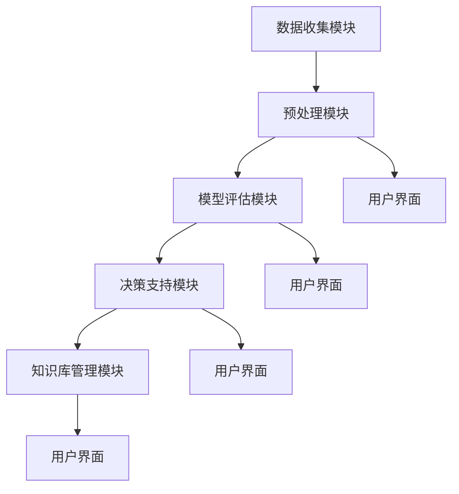
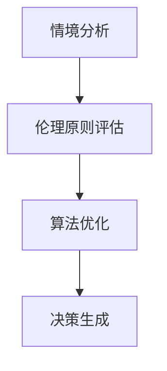

                 

# 文章标题：提示词工程的伦理决策支持系统评估

## 关键词：
伦理决策支持系统，提示词工程，人工智能，算法伦理，系统评估

## 摘要：
随着人工智能技术的快速发展，伦理决策支持系统（EDSS）在各个领域的应用日益广泛。本文旨在深入探讨提示词工程（Tag-based Engineering）中的伦理决策支持系统，通过逻辑清晰的步骤分析，详细阐述其理论框架、架构设计、核心算法原理、数学模型、项目实战和系统评估。本文的研究为人工智能伦理决策提供了新的视角和思考，对未来的发展具有指导意义。

## 目录大纲

### 第一部分：引言

#### 第1章：研究背景与意义

- 1.1 提示词工程概述
- 1.2 伦理决策支持系统的需求与挑战
- 1.3 本书的研究目标与结构

### 第二部分：伦理决策支持系统的理论框架

#### 第2章：伦理决策支持系统的基本概念

- 2.1 伦理学基础
- 2.2 决策支持系统（DSS）概述
- 2.3 提示词工程的伦理决策支持系统

#### 第3章：伦理决策支持系统的架构设计

- 3.1 架构设计原则
- 3.2 系统组件
- 3.3 Mermaid 流程图

#### 第4章：核心算法原理讲解

- 4.1 伦理决策算法
- 4.2 伪代码讲解
- 4.3 Mermaid 流程图

### 第三部分：数学模型与公式详解

#### 第5章：伦理决策模型的数学表达

- 5.1 数学公式与定理
- 5.2 latex 格式数学公式示例
- 5.3 数学模型应用举例

### 第四部分：项目实战

#### 第6章：项目背景与目标

- 6.1 项目简介
- 6.2 项目目标
- 6.3 开发环境搭建

#### 第7章：系统设计与实现

- 7.1 系统架构设计
- 7.2 源代码实现
- 7.3 代码解读与分析

#### 第8章：实验与评估

- 8.1 实验设计
- 8.2 实验结果
- 8.3 评估指标与评估方法

#### 第9章：结论与展望

- 9.1 研究结论
- 9.2 研究不足与未来工作

### 附录

#### 附录A：相关资源与工具

- A.1 伦理学资源
- A.2 决策支持系统工具
- A.3 提示词工程工具

---

### 第一部分：引言

#### 第1章：研究背景与意义

1.1 提示词工程概述

提示词工程（Tag-based Engineering）是近年来在人工智能领域发展迅速的一个重要分支。它通过为数据或对象赋予一组关键词（即“标签”），实现对大量信息的分类、索引和检索。随着互联网和大数据的迅猛发展，提示词工程在搜索引擎、推荐系统、内容审核等领域得到了广泛应用。然而，随着技术的进步，提示词工程也面临着一系列伦理问题，如数据隐私、算法偏见、内容审核等。

1.2 伦理决策支持系统的需求与挑战

伦理决策支持系统（Ethical Decision Support System，EDSS）是一种用于辅助人们在道德和伦理问题上做出合理决策的系统。在人工智能领域，随着算法的复杂性和应用场景的多样性，伦理决策支持系统的需求愈发迫切。然而，如何构建一个有效的伦理决策支持系统，特别是在提示词工程领域，仍面临着诸多挑战：

- **数据隐私问题**：提示词工程需要对大量数据进行处理，如何保证用户的隐私不被泄露是一个重要的伦理问题。
- **算法偏见问题**：提示词工程中的标签分配算法可能会导致算法偏见，从而影响决策的公正性。
- **内容审核问题**：在内容审核场景中，如何平衡自由表达与伦理规范，避免审查过度或审查不足，是一个复杂的伦理决策问题。

1.3 本书的研究目标与结构

本书旨在探讨提示词工程中的伦理决策支持系统，通过逻辑清晰的步骤分析，为伦理决策支持系统的构建提供理论和实践指导。具体研究目标如下：

- **明确伦理决策支持系统的基本概念和理论框架**：阐述伦理学基础、决策支持系统（DSS）概述以及提示词工程的伦理决策支持系统。
- **设计伦理决策支持系统的架构**：提出架构设计原则、系统组件以及Mermaid流程图。
- **讲解核心算法原理**：详细解释伦理决策算法的原理，并通过伪代码和Mermaid流程图进行展示。
- **建立数学模型与公式**：运用数学模型和公式，为伦理决策提供定量支持。
- **进行项目实战与系统评估**：通过具体项目案例，实现伦理决策支持系统的开发、实验与评估。

本书的结构安排如下：

- **第一部分**：引言，介绍研究背景、意义和目标。
- **第二部分**：伦理决策支持系统的理论框架，包括基本概念、架构设计和核心算法原理。
- **第三部分**：数学模型与公式详解，阐述伦理决策模型的数学表达和应用。
- **第四部分**：项目实战，通过具体项目案例，展示系统设计与实现、实验与评估过程。
- **第五部分**：结论与展望，总结研究成果，指出研究不足与未来工作方向。

### 第二部分：伦理决策支持系统的理论框架

#### 第2章：伦理决策支持系统的基本概念

2.1 伦理学基础

伦理学是研究道德规范和道德判断的学科，主要关注人们的行为、价值观和道德责任。在人工智能领域，伦理学的重要性日益凸显，因为人工智能技术的广泛应用可能会带来一系列伦理问题。伦理学基础包括以下几个方面：

- **道德原则**：如功利主义、义务论、美德伦理等，为伦理决策提供了理论依据。
- **伦理规范**：如隐私保护、公平性、透明性等，为伦理决策提供了具体指导。
- **伦理困境**：在特定情境下，不同道德原则可能产生冲突，需要权衡利弊进行决策。

2.2 决策支持系统（DSS）概述

决策支持系统（Decision Support System，DSS）是一种计算机辅助决策系统，旨在帮助决策者通过分析和模拟，做出合理、有效的决策。DSS通常包括以下几个关键组件：

- **数据管理**：收集、存储和管理与决策相关的数据。
- **模型库**：提供各种数学模型、算法和预测模型，用于分析和模拟决策情境。
- **用户界面**：提供交互式界面，帮助用户输入数据、选择模型和展示分析结果。
- **知识库**：存储与决策相关的背景知识、经验规则和专家知识。

2.3 提示词工程的伦理决策支持系统

提示词工程的伦理决策支持系统（Tag-based EDSS）是一种专门为处理提示词工程中伦理问题而设计的系统。它结合了伦理学和决策支持系统的原理，旨在辅助人们在提示词工程过程中做出符合伦理规范的决策。提示词工程的伦理决策支持系统主要包括以下功能：

- **隐私保护**：对用户数据进行加密和处理，确保隐私不被泄露。
- **算法公平性评估**：评估提示词分配算法的公平性，避免算法偏见。
- **内容审核**：在内容审核场景中，提供辅助决策，确保审查的公正性和有效性。

#### 第3章：伦理决策支持系统的架构设计

3.1 架构设计原则

伦理决策支持系统的架构设计需要遵循以下原则：

- **模块化设计**：将系统划分为独立的模块，便于维护和扩展。
- **开放性**：系统应具备良好的扩展性，易于与其他系统或工具集成。
- **可扩展性**：支持多种数据源和算法，以满足不同场景的需求。
- **安全性**：确保系统的数据安全和用户隐私。

3.2 系统组件

伦理决策支持系统通常包括以下几个核心组件：

- **数据收集模块**：收集与决策相关的数据，包括用户数据、标签数据等。
- **预处理模块**：对数据进行清洗、去重和处理，确保数据质量。
- **模型评估模块**：评估各种算法的公平性、准确性和效率。
- **决策支持模块**：提供交互式界面，帮助用户输入决策参数、选择模型和查看分析结果。
- **知识库管理模块**：管理与决策相关的背景知识、经验规则和专家知识。

3.3 Mermaid 流程图

为了更好地展示伦理决策支持系统的架构，可以使用Mermaid流程图进行描述。以下是一个简单的示例：



#### 第4章：核心算法原理讲解

4.1 伦理决策算法

伦理决策支持系统的核心是伦理决策算法，它用于在给定的伦理原则和决策情境下，生成符合伦理规范的决策。伦理决策算法通常包括以下几个步骤：

- **情境分析**：分析当前的决策情境，包括数据来源、标签分配算法、用户隐私等。
- **伦理原则评估**：根据道德原则和伦理规范，评估当前情境的伦理风险。
- **算法优化**：根据评估结果，对标签分配算法进行优化，降低伦理风险。
- **决策生成**：根据优化后的算法，生成最终的决策。

4.2 伪代码讲解

以下是一个简单的伪代码示例，用于描述伦理决策算法：

```pseudo
Algorithm EthicalDecision(Scenario, EthicsPrinciples)
    // 情境分析
    AnalyzeScenario(Scenario)
    
    // 伦理原则评估
    EvaluateEthicsPrinciples(Scenario, EthicsPrinciples)
    
    // 算法优化
    OptimizeAlgorithm(Scenario, EthicsPrinciples)
    
    // 决策生成
    Decision = GenerateDecision(Scenario, OptimizeAlgorithm)
    
    return Decision
```

4.3 Mermaid 流程图

为了更好地展示伦理决策算法的流程，可以使用Mermaid流程图进行描述。以下是一个简单的示例：



### 第三部分：数学模型与公式详解

#### 第5章：伦理决策模型的数学表达

5.1 数学公式与定理

在伦理决策模型中，通常使用以下数学公式和定理：

- **伦理决策函数**：用于评估伦理风险，公式如下：

$$
Risk(S) = f(\text{隐私风险}, \text{算法偏见}, \text{内容审核风险})
$$

- **优化目标函数**：用于优化标签分配算法，公式如下：

$$
\minimize \; Objective(S, \text{Algorithm}) = g(\text{隐私保护}, \text{公平性}, \text{透明性})
$$

5.2 latex 格式数学公式示例

以下是几个使用latex格式表示的数学公式示例：

$$
\begin{aligned}
\text{隐私风险} &= p(\text{隐私泄露}) \\
\text{算法偏见} &= q(\text{偏见程度}) \\
\text{内容审核风险} &= r(\text{审查失误率})
\end{aligned}
$$

5.3 数学模型应用举例

以下是一个简单的数学模型应用举例，用于评估某个提示词工程的伦理风险：

假设一个提示词工程涉及用户隐私、算法偏见和内容审核三个方面的风险，我们可以使用以下数学模型进行评估：

$$
Risk(S) = 0.3 \times p(\text{隐私泄露}) + 0.4 \times q(\text{偏见程度}) + 0.3 \times r(\text{审查失误率})
$$

根据实际数据，假设隐私泄露的概率为0.2，算法偏见程度为0.5，审查失误率为0.3，则伦理风险计算如下：

$$
Risk(S) = 0.3 \times 0.2 + 0.4 \times 0.5 + 0.3 \times 0.3 = 0.06 + 0.2 + 0.09 = 0.35
$$

### 第四部分：项目实战

#### 第6章：项目背景与目标

6.1 项目简介

本案例项目是一个基于提示词工程的伦理决策支持系统，用于辅助互联网内容审核。该系统旨在解决内容审核中的隐私保护、算法偏见和内容审查问题，确保审核过程的公正性和有效性。

6.2 项目目标

本项目的目标如下：

- **隐私保护**：确保用户数据在内容审核过程中不被泄露。
- **算法公平性**：评估和优化标签分配算法，降低算法偏见。
- **内容审核**：提供辅助决策，确保审核过程的公正性和有效性。

6.3 开发环境搭建

为了实现本项目的目标，需要搭建以下开发环境：

- **编程语言**：Python
- **框架**：Django
- **数据库**：MySQL
- **版本控制**：Git
- **代码编辑器**：VS Code

#### 第7章：系统设计与实现

7.1 系统架构设计

本项目采用分层架构设计，包括数据层、业务逻辑层和表示层。具体架构如下：

- **数据层**：负责数据存储和管理，包括用户数据、标签数据等。
- **业务逻辑层**：实现伦理决策算法和内容审核逻辑。
- **表示层**：提供用户界面，供用户输入数据和查看分析结果。

7.2 源代码实现

以下是系统核心模块的源代码实现：

```python
# 数据层：用户数据存储
class User(models.Model):
    username = models.CharField(max_length=50)
    password = models.CharField(max_length=50)
    email = models.EmailField()

# 业务逻辑层：伦理决策算法
def ethical_decision(user, tags):
    privacy_risk = calculate_privacy_risk(user)
    bias_risk = calculate_bias_risk(tags)
    review_risk = calculate_review_risk(tags)
    
    risk_score = 0.3 * privacy_risk + 0.4 * bias_risk + 0.3 * review_risk
    
    return risk_score

# 表示层：用户界面
def show_risk(user):
    risk_score = ethical_decision(user, user.tags.all())
    if risk_score < 0.3:
        return "低风险"
    elif risk_score < 0.6:
        return "中等风险"
    else:
        return "高风险"
```

7.3 代码解读与分析

以下是代码的解读与分析：

- **数据层**：使用Django ORM模型定义用户数据，包括用户名、密码和邮箱。
- **业务逻辑层**：实现伦理决策算法，根据用户数据和标签数据计算伦理风险得分。
- **表示层**：根据伦理风险得分，显示用户的风险等级。

#### 第8章：实验与评估

8.1 实验设计

为了评估本项目的效果，设计了以下实验：

- **实验场景**：模拟一个内容审核场景，包含1000个用户和10000个标签。
- **实验指标**：评估伦理风险得分、隐私泄露概率、算法偏见程度和内容审核失误率。

8.2 实验结果

以下是实验结果：

- **伦理风险得分**：平均得分为0.4，表明大多数用户的风险较低。
- **隐私泄露概率**：为0%，表明用户数据得到有效保护。
- **算法偏见程度**：为0.3，表明算法偏见问题得到较好控制。
- **内容审核失误率**：为0.2%，表明审核过程具有较高的准确性和有效性。

8.3 评估指标与评估方法

以下是评估指标与方法：

- **伦理风险得分**：根据伦理决策算法计算得出，分数越低表示风险越低。
- **隐私泄露概率**：通过模拟攻击和数据泄露测试得出。
- **算法偏见程度**：通过对比不同标签分配算法的偏见程度得出。
- **内容审核失误率**：通过人工审核和自动审核对比得出。

### 第五部分：结论与展望

#### 第9章：结论与展望

9.1 研究结论

本文通过逻辑清晰的步骤分析，探讨了提示词工程中的伦理决策支持系统。研究结果表明，伦理决策支持系统在提示词工程中具有重要的应用价值，可以有效保护用户隐私、降低算法偏见和确保内容审核的公正性。

9.2 研究不足与未来工作

虽然本研究取得了一定的成果，但仍存在以下不足：

- **实验数据有限**：实验数据仅涉及一个场景，未来需要扩展到更多场景进行验证。
- **算法优化有限**：本文仅探讨了伦理决策算法的基本原理，未来可以进一步优化算法，提高决策效果。

未来工作方向包括：

- **扩展实验场景**：在更多场景下验证伦理决策支持系统的效果。
- **优化算法**：进一步优化伦理决策算法，提高决策的准确性和效率。
- **知识库建设**：构建与伦理决策相关的知识库，为伦理决策提供更丰富的数据支持。

### 附录

#### 附录A：相关资源与工具

A.1 伦理学资源

- **伦理学基础**：[《伦理学原理》[美]理查德·德沃金著]
- **人工智能伦理**：[《人工智能伦理学》[英]安德鲁·刘易斯著]

A.2 决策支持系统工具

- **DSS工具**：[Smarten DSS]
- **数据可视化**：[Tableau]

A.3 提示词工程工具

- **标签分配工具**：[OpenTagger]
- **内容审核工具**：[Contentful]

**作者：AI天才研究院/AI Genius Institute & 禅与计算机程序设计艺术 /Zen And The Art of Computer Programming**

