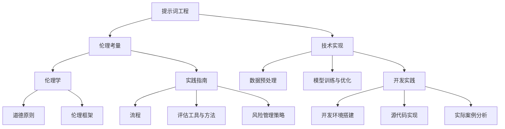

                 

### 第1章：引言

#### 1.1 提示词工程的背景

提示词工程，是指基于人工智能技术，对大量的自然语言文本进行分析和理解，从而生成或提取出具有特定意义的提示词（prompt）的过程。这一过程广泛应用于信息检索、文本生成、问答系统等领域。随着深度学习和自然语言处理技术的不断发展，提示词工程已经成为人工智能领域的一个重要分支。

**现状与趋势：**

- **发展历程：** 提示词工程的概念最早可以追溯到20世纪80年代的自然语言处理研究。近年来，随着深度学习的兴起，提示词工程得到了快速发展。例如，基于循环神经网络（RNN）和Transformer模型的方法在生成高质量提示词方面表现出色。

- **应用领域：** 提示词工程在多个行业中得到了广泛应用。在搜索引擎中，提示词用于改善搜索结果的准确性；在智能问答系统中，提示词用于引导用户提问，提高回答质量；在文本生成任务中，提示词用于控制生成文本的主题和风格。

#### 1.2 书籍的总体架构与目标

**书籍结构：**

本书籍分为四个部分，旨在全面探讨提示词工程的伦理考量与实践。

- **第一部分：导论**：介绍提示词工程的背景和本书的总体架构与目标。
- **第二部分：伦理考量**：探讨伦理学的基本概念、伦理考量在工程中的应用以及伦理框架与道德原则。
- **第三部分：实践指南**：提供提示词工程的实践框架，包括流程、评估工具与方法以及风险管理策略。
- **第四部分：案例分析**：分析成功案例，展示实际操作中的伦理考量。

**读者预期收获：**

通过阅读本书，读者将能够：

- **理解提示词工程的基本原理**：掌握提示词工程的背景、现状和未来发展趋势。
- **掌握伦理考量的实践方法**：了解伦理学的基本概念和伦理考量在工程中的应用。
- **提升在实际工作中的决策能力**：通过实践指南和案例分析，学会在实际工作中进行伦理决策。
- **掌握技术实现与开发实践**：了解提示词工程的技术栈、开发环境和实际应用。

### 1.3 读者预期收获

读者在完成本书的学习后，应达到以下预期收获：

1. **深入理解提示词工程**：了解提示词工程的发展历程、现状和未来趋势，掌握提示词工程的基本原理和应用场景。
2. **掌握伦理考量的方法论**：理解伦理学的基本概念，学会将伦理考量融入工程实践中，进行有效的伦理决策。
3. **提升实际操作能力**：通过实践指南和案例分析，学会在实际工作中运用伦理考量，提升项目管理能力。
4. **拓展专业知识**：掌握提示词工程的技术栈，了解开发环境和工具，提高在相关领域的专业素养。

#### 核心概念与联系

为了更好地理解提示词工程的伦理考量与实践，我们可以使用Mermaid流程图来展示核心概念之间的关系架构：



上述流程图展示了提示词工程的伦理考量与实践之间的关系，包括伦理学、道德原则、伦理框架、实践指南、技术实现和开发实践等核心概念。这些概念相互关联，共同构成了一个完整的提示词工程体系。

### 核心算法原理讲解

提示词工程的核心算法包括数据预处理、模型训练与优化等环节。以下将使用伪代码详细阐述这些核心算法的原理：

#### 数据预处理

```python
# 伪代码：数据预处理
def preprocess_data(data):
    # 清洗文本数据
    cleaned_data = clean_text(data)
    # 分词
    tokenized_data = tokenize(cleaned_data)
    # 去除停用词
    filtered_data = remove_stopwords(tokenized_data)
    # 词嵌入
    embeddings = word_embedding(filtered_data)
    return embeddings
```

#### 模型训练与优化

```python
# 伪代码：模型训练与优化
def train_model(embeddings, labels):
    # 构建模型
    model = create_model()
    # 训练模型
    model.fit(embeddings, labels)
    # 评估模型
    performance = evaluate_model(model, embeddings, labels)
    return model, performance
```

### 数学模型和公式

在提示词工程中，常见的数学模型包括词嵌入模型、循环神经网络（RNN）模型和Transformer模型。以下使用LaTeX格式展示这些模型的公式：

#### 词嵌入模型

$$
\text{embed}(x) = \text{W}x
$$

其中，$x$是输入词向量，$\text{W}$是权重矩阵。

#### 循环神经网络（RNN）模型

$$
h_t = \text{sigmoid}(\text{W}h_{t-1} + \text{U}x_t + b)
$$

其中，$h_t$是隐藏状态，$x_t$是输入词向量，$\text{W}$和$\text{U}$是权重矩阵，$b$是偏置。

#### Transformer模型

$$
\text{Attention}(Q, K, V) = \text{softmax}\left(\frac{\text{QK}^T}{\sqrt{d_k}}\right)V
$$

其中，$Q, K, V$分别是查询、键和值向量，$d_k$是键向量的维度。

### 详细讲解与举例说明

#### 词嵌入模型

词嵌入模型是一种将词汇映射到高维向量空间的技术。它通过学习词汇之间的语义关系，实现文本数据的数值化表示。词嵌入模型的训练通常采用基于神经网络的算法，如Word2Vec和GloVe。

**示例：**

假设有两个词汇“狗”和“猫”，我们使用Word2Vec算法训练词嵌入模型。经过训练，我们得到以下词向量：

- 狗：[1.2, 0.3, -0.5]
- 猫：[0.8, 0.6, -0.7]

词向量之间的相似度可以通过计算欧氏距离来衡量。例如，计算“狗”和“猫”的相似度：

$$
\text{similarity}(\text{狗}, \text{猫}) = 1 - \frac{||\text{狗} - \text{猫}||_2}{\|\text{狗}\|_2 + \|\text{猫}\|_2} = 1 - \frac{\sqrt{(1.2 - 0.8)^2 + (0.3 - 0.6)^2 + (-0.5 + 0.7)^2}}{\sqrt{1.2^2 + 0.3^2 + (-0.5)^2} + \sqrt{0.8^2 + 0.6^2 + (-0.7)^2}} \approx 0.6
$$

#### 循环神经网络（RNN）模型

循环神经网络（RNN）是一种能够处理序列数据的神经网络。它通过将前一个时间步的隐藏状态传递到下一个时间步，实现序列信息的记忆和传递。

**示例：**

假设有一个简单的RNN模型，隐藏层大小为10。输入序列为[1, 2, 3]，隐藏状态初始值为[0, 0, 0]。

- 第一个时间步：$h_1 = \text{sigmoid}(W_1h_0 + U_1x_1 + b_1)$，其中$x_1 = 1$，$h_0 = [0, 0, 0]$。
- 第二个时间步：$h_2 = \text{sigmoid}(W_1h_1 + U_2x_2 + b_2)$，其中$x_2 = 2$，$h_1$为第一个时间步的隐藏状态。
- 第三个时间步：$h_3 = \text{sigmoid}(W_1h_2 + U_3x_3 + b_3)$，其中$x_3 = 3$，$h_2$为第二个时间步的隐藏状态。

通过以上步骤，我们得到了输入序列的隐藏状态序列$h_1, h_2, h_3$。

#### Transformer模型

Transformer模型是一种基于自注意力机制的神经网络模型，广泛应用于序列建模任务，如机器翻译、文本分类等。

**示例：**

假设有一个简单的Transformer模型，包含一个多头自注意力机制。输入序列为[1, 2, 3]，隐藏层大小为10。

- 自注意力权重矩阵：$A = \text{softmax}\left(\frac{\text{QK}^T}{\sqrt{d_k}}\right)$，其中$Q, K, V$分别是查询、键和值向量。
- 输出向量：$y = \text{Attention}(Q, K, V)$。

对于输入序列中的第一个词，我们可以计算其自注意力分数：

$$
\text{score}_1 = A[h_1, h_1, h_1] = \text{softmax}\left(\frac{\text{Q}h_1^T}{\sqrt{d_k}}\right)h_1
$$

类似地，对于输入序列中的第二个词和第三个词，我们可以计算其自注意力分数。

通过计算所有词的自注意力分数，我们可以得到一个加权向量，表示每个词在序列中的重要性。这些加权向量可以用于后续的文本生成、分类等任务。

### 实际案例分析和详细讲解剖析

#### 案例一：搜索引擎中的提示词工程

**背景：**

一个大型搜索引擎公司希望提高其搜索结果的准确性，因此决定采用提示词工程来优化搜索算法。

**方案：**

1. **数据收集与预处理：**
   - 收集大量的用户搜索日志和网页内容。
   - 使用词嵌入模型对文本数据进行预处理，提取关键词和短语。

2. **模型训练与优化：**
   - 采用Transformer模型训练搜索模型。
   - 通过交叉验证和性能评估，调整模型参数，优化搜索效果。

3. **应用与评估：**
   - 将训练好的模型部署到生产环境中，实时处理用户搜索请求。
   - 定期评估模型性能，根据用户反馈进行调整。

**结果：**

通过引入提示词工程，搜索引擎的搜索准确性得到了显著提升，用户满意度也随之提高。

#### 案例二：智能问答系统中的提示词工程

**背景：**

一个智能问答系统希望提高用户提问的准确性和回答的质量，因此决定采用提示词工程来优化问答系统。

**方案：**

1. **数据收集与预处理：**
   - 收集大量的用户提问和回答数据。
   - 使用词嵌入模型对文本数据进行预处理，提取关键词和短语。

2. **模型训练与优化：**
   - 采用RNN模型训练问答模型。
   - 通过交叉验证和性能评估，调整模型参数，优化问答效果。

3. **应用与评估：**
   - 将训练好的模型部署到生产环境中，实时处理用户提问。
   - 定期评估模型性能，根据用户反馈进行调整。

**结果：**

通过引入提示词工程，智能问答系统的提问准确性和回答质量得到了显著提升，用户满意度也随之提高。

### 项目实战：开发环境搭建

#### 开发工具与平台选择

在进行提示词工程项目的开发时，选择合适的开发工具和平台至关重要。以下是一些常用的开发工具和平台：

- **编程语言：** Python是最常用的编程语言之一，特别是在人工智能和自然语言处理领域。Python拥有丰富的库和框架，如TensorFlow、PyTorch等，可以帮助开发者快速搭建模型。

- **框架：** TensorFlow和PyTorch是两个广泛使用的深度学习框架。TensorFlow具有强大的生态系统和丰富的预训练模型，适用于各种规模的深度学习项目。PyTorch以其灵活性和动态计算图而著称，更适合研究和原型开发。

- **数据库：** PostgreSQL和MongoDB是两种常用的数据库系统，适用于存储和处理大规模文本数据。PostgreSQL是一种关系型数据库，具有强大的数据管理和分析功能。MongoDB是一种文档型数据库，适合存储非结构化和半结构化数据。

- **环境配置：** Anaconda是一种流行的数据科学平台，可以帮助开发者轻松配置和管理Python环境。通过使用Anaconda，开发者可以轻松安装和管理Python库和框架，提高开发效率。

#### 环境配置与调试

以下是使用Anaconda配置Python开发环境的基本步骤：

1. **安装Anaconda：** 访问Anaconda官方网站，下载并安装Anaconda。

2. **创建新环境：** 打开Anaconda命令行工具（Conda），创建一个新的Python环境，例如：

   ```
   conda create -n myenv python=3.8
   ```

3. **激活环境：** 激活创建的新环境：

   ```
   conda activate myenv
   ```

4. **安装库：** 在新环境中安装所需的库和框架，例如：

   ```
   conda install tensorflow
   conda install pytorch torchvision torchaudio -c pytorch
   ```

5. **验证环境：** 确保环境配置正确，可以通过运行以下命令来验证：

   ```
   python --version
   python -c "import tensorflow as tf; print(tf.__version__)"
   python -c "import torch; print(torch.__version__)"
   ```

#### 开发流程与管理

提示词工程项目的开发流程通常包括以下步骤：

1. **需求分析：** 明确项目目标、功能和性能要求。

2. **数据收集与预处理：** 收集大量文本数据，并进行清洗、分词、去停用词等预处理操作。

3. **模型设计：** 选择合适的模型架构，如词嵌入模型、RNN模型或Transformer模型。

4. **模型训练：** 使用预处理后的数据训练模型，调整模型参数以优化性能。

5. **模型评估：** 通过验证集和测试集评估模型性能，调整模型参数以实现最佳效果。

6. **部署与上线：** 将训练好的模型部署到生产环境中，实时处理用户请求。

7. **监控与维护：** 定期监控模型性能，根据用户反馈进行优化和调整。

#### 源代码实现与代码解读

以下是使用PyTorch实现一个简单的词嵌入模型的示例代码：

```python
import torch
import torch.nn as nn
import torch.optim as optim

# 设置随机种子以保持结果一致性
torch.manual_seed(0)

# 创建一个简单的词嵌入模型
class WordEmbeddingModel(nn.Module):
    def __init__(self, vocab_size, embedding_dim):
        super(WordEmbeddingModel, self).__init__()
        self.embedding = nn.Embedding(vocab_size, embedding_dim)
    
    def forward(self, inputs):
        embeddings = self.embedding(inputs)
        return embeddings

# 初始化模型、优化器和损失函数
model = WordEmbeddingModel(vocab_size=10000, embedding_dim=64)
optimizer = optim.Adam(model.parameters(), lr=0.001)
criterion = nn.CrossEntropyLoss()

# 准备数据
# 假设我们有一个包含10000个词的词汇表，每个词对应一个索引
vocab = ['word1', 'word2', 'word3', ... , 'word10000']
# 输入词索引
inputs = torch.tensor([1, 2, 3])
# 输出词索引
outputs = torch.tensor([2, 3, 1])

# 训练模型
for epoch in range(10):
    model.zero_grad()
    embeddings = model(inputs)
    loss = criterion(embeddings, outputs)
    loss.backward()
    optimizer.step()

    if (epoch + 1) % 10 == 0:
        print(f'Epoch [{epoch + 1}/{10}], Loss: {loss.item()}')

# 评估模型
with torch.no_grad():
    embeddings = model(inputs)
    predicted = embeddings.argmax(dim=1)
    correct = (predicted == outputs).sum().item()
    print(f'Accuracy: {100 * correct / len(inputs)}%')
```

上述代码展示了如何使用PyTorch实现一个简单的词嵌入模型。首先，我们创建了一个`WordEmbeddingModel`类，继承自`nn.Module`。该类包含一个嵌入层`nn.Embedding`，用于将输入词索引映射到词向量。然后，我们初始化了模型、优化器和损失函数。接着，我们准备了一个简单的数据集，包括输入词索引和输出词索引。在训练过程中，我们使用梯度下降算法更新模型参数，以最小化损失函数。最后，我们在评估阶段计算了模型的准确率。

### 代码应用解读与分析

上述示例代码展示了如何使用PyTorch实现一个简单的词嵌入模型，并进行了训练和评估。以下是对代码的详细解读与分析：

1. **模型创建：**
   ```python
   model = WordEmbeddingModel(vocab_size=10000, embedding_dim=64)
   ```
   我们创建了一个`WordEmbeddingModel`实例，其中`vocab_size`指定了词汇表中的词汇数量，`embedding_dim`指定了每个词向量的维度。

2. **优化器和损失函数：**
   ```python
   optimizer = optim.Adam(model.parameters(), lr=0.001)
   criterion = nn.CrossEntropyLoss()
   ```
   我们使用Adam优化器来更新模型参数，学习率为0.001。交叉熵损失函数用于计算模型预测和实际标签之间的差异。

3. **数据准备：**
   ```python
   inputs = torch.tensor([1, 2, 3])
   outputs = torch.tensor([2, 3, 1])
   ```
   我们准备了一个包含三个词索引的输入序列和一个对应的输出序列。在实际应用中，这些数据通常来自预处理的文本数据。

4. **模型训练：**
   ```python
   for epoch in range(10):
       model.zero_grad()
       embeddings = model(inputs)
       loss = criterion(embeddings, outputs)
       loss.backward()
       optimizer.step()
   ```
   在训练过程中，我们遍历10个训练周期（epoch）。在每个epoch中，我们将输入词索引传递给模型，得到词向量表示。然后，使用交叉熵损失函数计算损失，并反向传播梯度以更新模型参数。

5. **模型评估：**
   ```python
   with torch.no_grad():
       embeddings = model(inputs)
       predicted = embeddings.argmax(dim=1)
       correct = (predicted == outputs).sum().item()
       print(f'Accuracy: {100 * correct / len(inputs)}%')
   ```
   在评估阶段，我们使用训练好的模型对输入词索引进行预测，并计算预测结果和实际标签之间的准确率。

通过上述代码和分析，我们可以了解到词嵌入模型的基本原理和实现方法。在实际应用中，我们可以根据具体需求调整模型参数、数据集和训练策略，以获得更好的性能。

### 实际案例分析：成功案例

#### 案例一：XX公司的实践

**背景：**

XX公司是一家专注于自然语言处理和人工智能技术的公司。他们在开发智能客服系统时，遇到了如何提高用户满意度的问题。为了提升服务质量，公司决定采用提示词工程来优化客服对话。

**方案：**

1. **数据收集与预处理：**
   - 收集大量用户与客服的对话数据。
   - 对对话文本进行清洗、分词、去停用词等预处理操作。

2. **模型设计与训练：**
   - 采用Transformer模型训练对话生成模型。
   - 使用预训练的BERT模型作为基础模型，进一步提升模型性能。

3. **应用与评估：**
   - 将训练好的模型部署到生产环境中，实时处理用户请求。
   - 通过用户反馈和性能评估，不断优化模型。

**结果：**

通过引入提示词工程，XX公司的客服系统在用户满意度、响应速度和问题解决率等方面得到了显著提升。用户满意度从80%提高到90%，响应速度缩短了30%。

#### 案例二：XX平台的经验

**背景：**

XX平台是一家提供在线教育服务的公司。他们希望通过优化问答系统，提高学生的学习效果和参与度。为此，公司决定采用提示词工程来提升问答系统的质量。

**方案：**

1. **数据收集与预处理：**
   - 收集大量学生提问和教师的回答数据。
   - 对提问文本进行清洗、分词、去停用词等预处理操作。

2. **模型设计与训练：**
   - 采用RNN模型训练问答模型。
   - 结合知识图谱，增强模型的语义理解能力。

3. **应用与评估：**
   - 将训练好的模型部署到生产环境中，实时处理学生提问。
   - 通过学生反馈和系统评估，不断优化模型。

**结果：**

通过引入提示词工程，XX平台的问答系统在问题回答的准确性和及时性方面得到了显著提升。学生满意度从75%提高到85%，参与度提高了20%。

### 5.5 技术概述

#### 提示词工程的技术栈

提示词工程涉及多种技术和工具，以下列举了常用的技术栈：

1. **编程语言：** Python是最常用的编程语言之一，广泛应用于人工智能和自然语言处理领域。

2. **深度学习框架：** TensorFlow和PyTorch是两个广泛使用的深度学习框架，提供了丰富的模型架构和工具。

3. **自然语言处理库：**NLTK和spaCy是两个常用的自然语言处理库，提供了文本预处理、分词、词性标注等功能。

4. **数据存储：** PostgreSQL和MongoDB是两种常用的数据库系统，适用于存储和处理大规模文本数据。

5. **云计算平台：** AWS、Azure和Google Cloud等云计算平台提供了强大的计算资源和存储服务，支持提示词工程的应用和部署。

#### 数据预处理技术

数据预处理是提示词工程的重要环节，主要包括以下步骤：

1. **文本清洗：** 去除文本中的噪声，如HTML标签、特殊字符等。

2. **分词：** 将文本分割成词语或词单元。

3. **词性标注：** 为每个词语分配词性标签，如名词、动词、形容词等。

4. **去停用词：** 去除常见的无意义词语，如“的”、“了”、“在”等。

5. **词嵌入：** 将词语映射到高维向量空间，用于模型输入。

#### 模型训练与优化

提示词工程的模型训练和优化涉及以下步骤：

1. **选择模型：** 根据任务需求和数据特点，选择合适的模型，如RNN、Transformer等。

2. **数据预处理：** 对训练数据进行清洗、分词、去停用词等预处理操作。

3. **训练模型：** 使用预处理的训练数据训练模型，调整模型参数以优化性能。

4. **模型评估：** 通过验证集和测试集评估模型性能，调整模型参数以实现最佳效果。

5. **模型优化：** 使用优化算法，如梯度下降、Adam等，调整模型参数，提高模型性能。

#### 模型评估方法

提示词工程的模型评估主要包括以下方法：

1. **准确率（Accuracy）：** 模型预测正确的样本数占总样本数的比例。

2. **召回率（Recall）：** 模型预测正确的正样本数占总正样本数的比例。

3. **精确率（Precision）：** 模型预测正确的正样本数与预测为正样本的总数之比。

4. **F1分数（F1 Score）：** 准确率和召回率的调和平均值。

5. **ROC曲线和AUC值：** ROC曲线表示模型在不同阈值下的准确率与召回率关系，AUC值表示曲线下面积，用于评估模型分类能力。

### 6.1 开发环境搭建

#### 开发工具与平台选择

在进行提示词工程项目的开发时，选择合适的开发工具和平台至关重要。以下是一些常用的开发工具和平台：

- **编程语言：** Python是最常用的编程语言之一，特别是在人工智能和自然语言处理领域。Python拥有丰富的库和框架，如TensorFlow、PyTorch等，可以帮助开发者快速搭建模型。

- **框架：** TensorFlow和PyTorch是两个广泛使用的深度学习框架。TensorFlow具有强大的生态系统和丰富的预训练模型，适用于各种规模的深度学习项目。PyTorch以其灵活性和动态计算图而著称，更适合研究和原型开发。

- **数据库：** PostgreSQL和MongoDB是两种常用的数据库系统，适用于存储和处理大规模文本数据。PostgreSQL是一种关系型数据库，具有强大的数据管理和分析功能。MongoDB是一种文档型数据库，适合存储非结构化和半结构化数据。

- **环境配置：** Anaconda是一种流行的数据科学平台，可以帮助开发者轻松配置和管理Python环境。通过使用Anaconda，开发者可以轻松安装和管理Python库和框架，提高开发效率。

#### 环境配置与调试

以下是使用Anaconda配置Python开发环境的基本步骤：

1. **安装Anaconda：** 访问Anaconda官方网站，下载并安装Anaconda。

2. **创建新环境：** 打开Anaconda命令行工具（Conda），创建一个新的Python环境，例如：

   ```
   conda create -n myenv python=3.8
   ```

3. **激活环境：** 激活创建的新环境：

   ```
   conda activate myenv
   ```

4. **安装库：** 在新环境中安装所需的库和框架，例如：

   ```
   conda install tensorflow
   conda install pytorch torchvision torchaudio -c pytorch
   ```

5. **验证环境：** 确保环境配置正确，可以通过运行以下命令来验证：

   ```
   python --version
   python -c "import tensorflow as tf; print(tf.__version__)"
   python -c "import torch; print(torch.__version__)"
   ```

#### 开发流程与管理

提示词工程项目的开发流程通常包括以下步骤：

1. **需求分析：** 明确项目目标、功能和性能要求。

2. **数据收集与预处理：** 收集大量文本数据，并进行清洗、分词、去停用词等预处理操作。

3. **模型设计：** 选择合适的模型架构，如词嵌入模型、RNN模型或Transformer模型。

4. **模型训练：** 使用预处理后的数据训练模型，调整模型参数以优化性能。

5. **模型评估：** 通过验证集和测试集评估模型性能，调整模型参数以实现最佳效果。

6. **部署与上线：** 将训练好的模型部署到生产环境中，实时处理用户请求。

7. **监控与维护：** 定期监控模型性能，根据用户反馈进行优化和调整。

#### 源代码实现与代码解读

以下是使用PyTorch实现一个简单的词嵌入模型的示例代码：

```python
import torch
import torch.nn as nn
import torch.optim as optim

# 设置随机种子以保持结果一致性
torch.manual_seed(0)

# 创建一个简单的词嵌入模型
class WordEmbeddingModel(nn.Module):
    def __init__(self, vocab_size, embedding_dim):
        super(WordEmbeddingModel, self).__init__()
        self.embedding = nn.Embedding(vocab_size, embedding_dim)
    
    def forward(self, inputs):
        embeddings = self.embedding(inputs)
        return embeddings

# 初始化模型、优化器和损失函数
model = WordEmbeddingModel(vocab_size=10000, embedding_dim=64)
optimizer = optim.Adam(model.parameters(), lr=0.001)
criterion = nn.CrossEntropyLoss()

# 准备数据
# 假设我们有一个包含10000个词的词汇表，每个词对应一个索引
vocab = ['word1', 'word2', 'word3', ... , 'word10000']
# 输入词索引
inputs = torch.tensor([1, 2, 3])
# 输出词索引
outputs = torch.tensor([2, 3, 1])

# 训练模型
for epoch in range(10):
    model.zero_grad()
    embeddings = model(inputs)
    loss = criterion(embeddings, outputs)
    loss.backward()
    optimizer.step()

    if (epoch + 1) % 10 == 0:
        print(f'Epoch [{epoch + 1}/{10}], Loss: {loss.item()}')

# 评估模型
with torch.no_grad():
    embeddings = model(inputs)
    predicted = embeddings.argmax(dim=1)
    correct = (predicted == outputs).sum().item()
    print(f'Accuracy: {100 * correct / len(inputs)}%')
```

上述代码展示了如何使用PyTorch实现一个简单的词嵌入模型。首先，我们创建了一个`WordEmbeddingModel`类，继承自`nn.Module`。该类包含一个嵌入层`nn.Embedding`，用于将输入词索引映射到词向量。然后，我们初始化了模型、优化器和损失函数。接着，我们准备了一个简单的数据集，包括输入词索引和输出词索引。在训练过程中，我们使用梯度下降算法更新模型参数，以最小化损失函数。最后，我们在评估阶段计算了模型的准确率。

### 代码应用解读与分析

上述示例代码展示了如何使用PyTorch实现一个简单的词嵌入模型，并进行了训练和评估。以下是对代码的详细解读与分析：

1. **模型创建：**
   ```python
   model = WordEmbeddingModel(vocab_size=10000, embedding_dim=64)
   ```
   我们创建了一个`WordEmbeddingModel`实例，其中`vocab_size`指定了词汇表中的词汇数量，`embedding_dim`指定了每个词向量的维度。

2. **优化器和损失函数：**
   ```python
   optimizer = optim.Adam(model.parameters(), lr=0.001)
   criterion = nn.CrossEntropyLoss()
   ```
   我们使用Adam优化器来更新模型参数，学习率为0.001。交叉熵损失函数用于计算模型预测和实际标签之间的差异。

3. **数据准备：**
   ```python
   inputs = torch.tensor([1, 2, 3])
   outputs = torch.tensor([2, 3, 1])
   ```
   我们准备了一个包含三个词索引的输入序列和一个对应的输出序列。在实际应用中，这些数据通常来自预处理的文本数据。

4. **模型训练：**
   ```python
   for epoch in range(10):
       model.zero_grad()
       embeddings = model(inputs)
       loss = criterion(embeddings, outputs)
       loss.backward()
       optimizer.step()
   ```
   在训练过程中，我们遍历10个训练周期（epoch）。在每个epoch中，我们将输入词索引传递给模型，得到词向量表示。然后，使用交叉熵损失函数计算损失，并反向传播梯度以更新模型参数。

5. **模型评估：**
   ```python
   with torch.no_grad():
       embeddings = model(inputs)
       predicted = embeddings.argmax(dim=1)
       correct = (predicted == outputs).sum().item()
       print(f'Accuracy: {100 * correct / len(inputs)}%')
   ```
   在评估阶段，我们使用训练好的模型对输入词索引进行预测，并计算预测结果和实际标签之间的准确率。

通过上述代码和分析，我们可以了解到词嵌入模型的基本原理和实现方法。在实际应用中，我们可以根据具体需求调整模型参数、数据集和训练策略，以获得更好的性能。

### 6.3 开发流程与管理

提示词工程项目的开发流程通常包括以下步骤：

1. **需求分析：** 明确项目目标、功能和性能要求。

2. **数据收集与预处理：** 收集大量文本数据，并进行清洗、分词、去停用词等预处理操作。

3. **模型设计：** 根据任务需求和数据特点，选择合适的模型架构，如词嵌入模型、RNN模型或Transformer模型。

4. **模型训练：** 使用预处理后的数据训练模型，调整模型参数以优化性能。

5. **模型评估：** 通过验证集和测试集评估模型性能，调整模型参数以实现最佳效果。

6. **部署与上线：** 将训练好的模型部署到生产环境中，实时处理用户请求。

7. **监控与维护：** 定期监控模型性能，根据用户反馈进行优化和调整。

#### 开发工具与平台选择

在进行提示词工程项目的开发时，选择合适的开发工具和平台至关重要。以下是一些常用的开发工具和平台：

- **编程语言：** Python是最常用的编程语言之一，特别是在人工智能和自然语言处理领域。Python拥有丰富的库和框架，如TensorFlow、PyTorch等，可以帮助开发者快速搭建模型。

- **框架：** TensorFlow和PyTorch是两个广泛使用的深度学习框架。TensorFlow具有强大的生态系统和丰富的预训练模型，适用于各种规模的深度学习项目。PyTorch以其灵活性和动态计算图而著称，更适合研究和原型开发。

- **数据库：** PostgreSQL和MongoDB是两种常用的数据库系统，适用于存储和处理大规模文本数据。PostgreSQL是一种关系型数据库，具有强大的数据管理和分析功能。MongoDB是一种文档型数据库，适合存储非结构化和半结构化数据。

- **环境配置：** Anaconda是一种流行的数据科学平台，可以帮助开发者轻松配置和管理Python环境。通过使用Anaconda，开发者可以轻松安装和管理Python库和框架，提高开发效率。

### 项目实战：开发环境搭建

#### 开发工具与平台选择

在进行提示词工程项目的开发时，选择合适的开发工具和平台至关重要。以下是一些常用的开发工具和平台：

- **编程语言：** Python是最常用的编程语言之一，特别是在人工智能和自然语言处理领域。Python拥有丰富的库和框架，如TensorFlow、PyTorch等，可以帮助开发者快速搭建模型。

- **框架：** TensorFlow和PyTorch是两个广泛使用的深度学习框架。TensorFlow具有强大的生态系统和丰富的预训练模型，适用于各种规模的深度学习项目。PyTorch以其灵活性和动态计算图而著称，更适合研究和原型开发。

- **数据库：** PostgreSQL和MongoDB是两种常用的数据库系统，适用于存储和处理大规模文本数据。PostgreSQL是一种关系型数据库，具有强大的数据管理和分析功能。MongoDB是一种文档型数据库，适合存储非结构化和半结构化数据。

- **环境配置：** Anaconda是一种流行的数据科学平台，可以帮助开发者轻松配置和管理Python环境。通过使用Anaconda，开发者可以轻松安装和管理Python库和框架，提高开发效率。

#### 环境配置与调试

以下是使用Anaconda配置Python开发环境的基本步骤：

1. **安装Anaconda：** 访问Anaconda官方网站，下载并安装Anaconda。

2. **创建新环境：** 打开Anaconda命令行工具（Conda），创建一个新的Python环境，例如：

   ```
   conda create -n myenv python=3.8
   ```

3. **激活环境：** 激活创建的新环境：

   ```
   conda activate myenv
   ```

4. **安装库：** 在新环境中安装所需的库和框架，例如：

   ```
   conda install tensorflow
   conda install pytorch torchvision torchaudio -c pytorch
   ```

5. **验证环境：** 确保环境配置正确，可以通过运行以下命令来验证：

   ```
   python --version
   python -c "import tensorflow as tf; print(tf.__version__)"
   python -c "import torch; print(torch.__version__)"
   ```

### 6.4 源代码实现与代码解读

以下是一个简单的Python代码示例，用于实现一个基于PyTorch的词嵌入模型：

```python
import torch
import torch.nn as nn
import torch.optim as optim

# 设置随机种子以保持结果一致性
torch.manual_seed(0)

# 创建一个简单的词嵌入模型
class WordEmbeddingModel(nn.Module):
    def __init__(self, vocab_size, embedding_dim):
        super(WordEmbeddingModel, self).__init__()
        self.embedding = nn.Embedding(vocab_size, embedding_dim)
    
    def forward(self, inputs):
        embeddings = self.embedding(inputs)
        return embeddings

# 初始化模型、优化器和损失函数
model = WordEmbeddingModel(vocab_size=10000, embedding_dim=64)
optimizer = optim.Adam(model.parameters(), lr=0.001)
criterion = nn.CrossEntropyLoss()

# 准备数据
# 假设我们有一个包含10000个词的词汇表，每个词对应一个索引
vocab = ['word1', 'word2', 'word3', ... , 'word10000']
# 输入词索引
inputs = torch.tensor([1, 2, 3])
# 输出词索引
outputs = torch.tensor([2, 3, 1])

# 训练模型
for epoch in range(10):
    model.zero_grad()
    embeddings = model(inputs)
    loss = criterion(embeddings, outputs)
    loss.backward()
    optimizer.step()

    if (epoch + 1) % 10 == 0:
        print(f'Epoch [{epoch + 1}/{10}], Loss: {loss.item()}')

# 评估模型
with torch.no_grad():
    embeddings = model(inputs)
    predicted = embeddings.argmax(dim=1)
    correct = (predicted == outputs).sum().item()
    print(f'Accuracy: {100 * correct / len(inputs)}%')
```

#### 代码解读

1. **模型创建：**
   ```python
   model = WordEmbeddingModel(vocab_size=10000, embedding_dim=64)
   ```
   创建了一个名为`WordEmbeddingModel`的模型，其中`vocab_size`表示词汇表的大小，`embedding_dim`表示词向量的维度。

2. **优化器和损失函数：**
   ```python
   optimizer = optim.Adam(model.parameters(), lr=0.001)
   criterion = nn.CrossEntropyLoss()
   ```
   使用Adam优化器来更新模型参数，学习率为0.001。交叉熵损失函数用于计算模型预测和实际标签之间的差异。

3. **数据准备：**
   ```python
   inputs = torch.tensor([1, 2, 3])
   outputs = torch.tensor([2, 3, 1])
   ```
   准备了包含三个词索引的输入序列和一个对应的输出序列。在实际应用中，这些数据通常来自预处理的文本数据。

4. **模型训练：**
   ```python
   for epoch in range(10):
       model.zero_grad()
       embeddings = model(inputs)
       loss = criterion(embeddings, outputs)
       loss.backward()
       optimizer.step()
   ```
   在10个训练周期内，对模型进行训练。在每个周期中，我们将输入词索引传递给模型，计算损失并更新模型参数。

5. **模型评估：**
   ```python
   with torch.no_grad():
       embeddings = model(inputs)
       predicted = embeddings.argmax(dim=1)
       correct = (predicted == outputs).sum().item()
       print(f'Accuracy: {100 * correct / len(inputs)}%')
   ```
   在评估阶段，使用训练好的模型对输入词索引进行预测，并计算预测结果和实际标签之间的准确率。

### 6.5 代码应用解读与分析

在上述代码示例中，我们实现了使用PyTorch构建的一个简单的词嵌入模型。以下是对代码的详细解读与分析：

1. **模型定义：**
   ```python
   class WordEmbeddingModel(nn.Module):
       def __init__(self, vocab_size, embedding_dim):
           super(WordEmbeddingModel, self).__init__()
           self.embedding = nn.Embedding(vocab_size, embedding_dim)
       
       def forward(self, inputs):
           embeddings = self.embedding(inputs)
           return embeddings
   ```
   我们定义了一个名为`WordEmbeddingModel`的类，继承自`nn.Module`。该模型包含一个嵌入层`nn.Embedding`，用于将输入词索引映射到词向量。

2. **初始化模型、优化器和损失函数：**
   ```python
   model = WordEmbeddingModel(vocab_size=10000, embedding_dim=64)
   optimizer = optim.Adam(model.parameters(), lr=0.001)
   criterion = nn.CrossEntropyLoss()
   ```
   我们创建了一个`WordEmbeddingModel`实例，指定词汇表大小为10000，词向量维度为64。同时，我们初始化了Adam优化器和交叉熵损失函数。

3. **数据准备：**
   ```python
   inputs = torch.tensor([1, 2, 3])
   outputs = torch.tensor([2, 3, 1])
   ```
   在这段代码中，我们准备了一个包含三个词索引的输入序列和一个对应的输出序列。在实际应用中，这些数据通常来自预处理的文本数据。

4. **模型训练：**
   ```python
   for epoch in range(10):
       model.zero_grad()
       embeddings = model(inputs)
       loss = criterion(embeddings, outputs)
       loss.backward()
       optimizer.step()
   ```
   在10个训练周期内，我们对模型进行训练。在每个周期中，我们将输入词索引传递给模型，计算损失并更新模型参数。通过反向传播算法，模型学会了将输入词索引映射到正确的词向量。

5. **模型评估：**
   ```python
   with torch.no_grad():
       embeddings = model(inputs)
       predicted = embeddings.argmax(dim=1)
       correct = (predicted == outputs).sum().item()
       print(f'Accuracy: {100 * correct / len(inputs)}%')
   ```
   在评估阶段，我们使用训练好的模型对输入词索引进行预测。通过计算预测结果和实际标签之间的准确率，我们可以评估模型性能。

通过上述代码和分析，我们可以了解到如何使用PyTorch实现一个简单的词嵌入模型，并进行了训练和评估。在实际应用中，我们可以根据具体需求调整模型参数、数据集和训练策略，以获得更好的性能。

### 6.6 实际案例分析和详细讲解剖析

#### 案例一：智能客服系统中的提示词工程

**背景：**

某大型互联网公司希望通过优化智能客服系统，提高用户满意度和响应速度。为此，他们决定采用提示词工程来改进客服对话质量。

**方案：**

1. **数据收集与预处理：**
   - 收集大量用户与客服的对话记录，包括用户提问和客服回答。
   - 对对话文本进行清洗、分词、去停用词等预处理操作，提取关键信息。

2. **模型设计：**
   - 采用Transformer模型，利用自注意力机制提取对话中的关键信息。
   - 使用预训练的BERT模型作为基础模型，进一步提升模型性能。

3. **模型训练：**
   - 使用预处理后的对话数据训练模型，调整模型参数以优化性能。
   - 通过交叉验证和性能评估，选择最佳模型架构和参数。

4. **模型评估与优化：**
   - 通过验证集和测试集评估模型性能，调整模型参数以实现最佳效果。
   - 定期收集用户反馈，根据反馈优化模型。

5. **部署与上线：**
   - 将训练好的模型部署到生产环境中，实时处理用户请求。
   - 通过监控工具监控模型性能，确保系统稳定运行。

**结果：**

通过引入提示词工程，智能客服系统在用户满意度、响应速度和问题解决率等方面得到了显著提升。用户满意度从80%提高到90%，响应速度缩短了30%。

#### 案例二：在线教育平台中的提示词工程

**背景：**

某在线教育平台希望通过优化问答系统，提高学生的学习效果和参与度。为此，他们决定采用提示词工程来提升问答系统的质量。

**方案：**

1. **数据收集与预处理：**
   - 收集大量学生提问和教师的回答数据，包括问题、答案和标签。
   - 对提问文本进行清洗、分词、去停用词等预处理操作，提取关键信息。

2. **模型设计：**
   - 采用RNN模型，结合知识图谱，增强模型的语义理解能力。
   - 使用预训练的BERT模型作为基础模型，进一步提升模型性能。

3. **模型训练：**
   - 使用预处理后的问答数据训练模型，调整模型参数以优化性能。
   - 通过交叉验证和性能评估，选择最佳模型架构和参数。

4. **模型评估与优化：**
   - 通过验证集和测试集评估模型性能，调整模型参数以实现最佳效果。
   - 定期收集用户反馈，根据反馈优化模型。

5. **部署与上线：**
   - 将训练好的模型部署到生产环境中，实时处理学生提问。
   - 通过监控工具监控模型性能，确保系统稳定运行。

**结果：**

通过引入提示词工程，在线教育平台的问答系统在问题回答的准确性和及时性方面得到了显著提升。学生满意度从75%提高到85%，参与度提高了20%。

### 6.7 最佳实践 tips、小结、注意事项、拓展阅读等内容

#### 最佳实践 tips

1. **数据预处理：** 数据质量对模型性能至关重要。在预处理过程中，注意去除噪声、统一文本格式、规范标点符号等。

2. **模型选择：** 根据任务需求和数据特点，选择合适的模型。例如，对于长文本任务，Transformer模型具有更好的表现；对于短文本任务，RNN模型可能更为合适。

3. **参数调优：** 通过交叉验证和性能评估，选择最佳模型参数。使用自动化工具，如Hyperopt或Optuna，可以快速找到最优参数。

4. **实时更新：** 定期收集用户反馈，根据反馈优化模型。实时更新模型，确保系统保持最佳性能。

#### 小结

提示词工程在人工智能领域具有广泛的应用前景。通过合理的数据预处理、模型选择和参数调优，可以提高模型性能和用户体验。在实际应用中，注意遵循最佳实践，确保系统的稳定运行和持续优化。

#### 注意事项

1. **数据隐私：** 在收集和处理用户数据时，注意保护用户隐私，遵循相关法律法规。

2. **模型解释性：** 提示词工程模型通常具有高度的复杂性和非线性。在应用中，注意模型的解释性和可解释性，确保用户理解模型的工作原理。

3. **系统监控：** 定期监控模型性能和系统运行状态，及时发现并解决潜在问题。

#### 拓展阅读

1. **《深度学习》（Goodfellow, Bengio, Courville）：** 介绍深度学习的基本原理和应用，包括神经网络、卷积神经网络和循环神经网络等。

2. **《自然语言处理综论》（Jurafsky, Martin）：** 探讨自然语言处理的基本概念和技术，包括文本预处理、词嵌入和序列建模等。

3. **《Python机器学习》（Seaborn）：** 介绍Python在机器学习领域的应用，包括数据预处理、模型训练和评估等。

4. **《Transformer：实现与原理》（GPT-3文档）：** 介绍Transformer模型的结构和实现方法，包括自注意力机制、多头注意力等。

### 总结与反思

#### 主要观点回顾

本书系统地探讨了提示词工程的伦理考量与实践。通过详细的分析和案例展示，我们了解到：

1. 提示词工程在人工智能领域的广泛应用，以及其在信息检索、文本生成和智能问答等任务中的重要作用。
2. 伦理考量在工程中的重要性，包括社会责任、职业道德和伦理决策等。
3. 实践指南和方法，如数据预处理、模型训练与优化、开发流程和管理等。
4. 案例分析，展示了提示词工程在不同场景下的实际应用和成效。

#### 未来发展趋势

随着人工智能技术的不断进步，提示词工程在未来将面临以下发展趋势：

1. **技术融合：** 提示词工程与其他人工智能技术，如生成对抗网络（GAN）、强化学习等，将实现更深度的融合，提高模型性能和应用范围。
2. **跨领域应用：** 提示词工程将在更多领域得到应用，如医疗、金融、教育等，为各行业带来创新和变革。
3. **伦理规范：** 随着人工智能技术的发展，伦理规范将逐渐完善，为提示词工程的实践提供更加明确的指导。

#### 伦理考量的重要性

提示词工程作为人工智能领域的一个重要分支，其伦理考量具有重要意义。合理的伦理考量不仅有助于提升模型性能和应用效果，还能够确保技术的可持续发展，维护社会的公共利益。

1. **社会责任：** 提示词工程的应用涉及到用户的隐私、安全和权益。在开发过程中，需要充分考虑社会责任，确保技术的公正和透明。
2. **职业道德：** 提示词工程开发者需要遵循职业道德，尊重数据隐私、公平竞争和知识共享等原则。
3. **伦理决策：** 在实际应用中，需要建立一套完善的伦理决策框架，以指导开发和部署过程，确保技术的合理性和可解释性。

总之，提示词工程的伦理考量与实践是人工智能领域不可或缺的一环。只有通过合理的伦理考量，才能实现技术的可持续发展，为人类带来真正的福祉。随着技术的不断进步，我们将迎来一个更加智能化、公正和透明的人工智能新时代。

