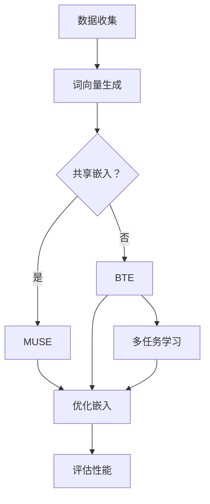
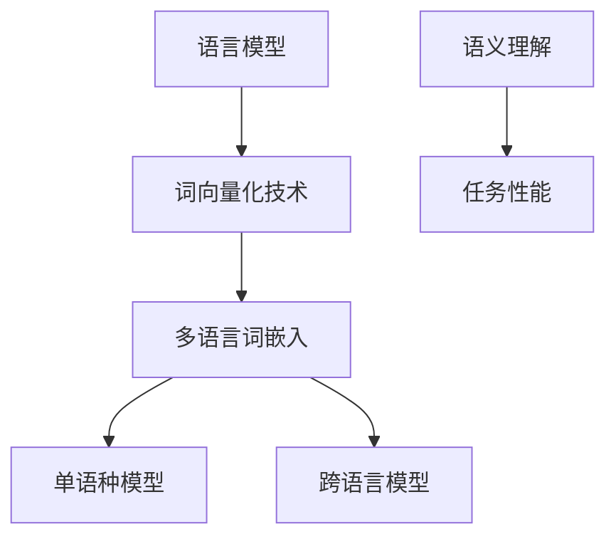
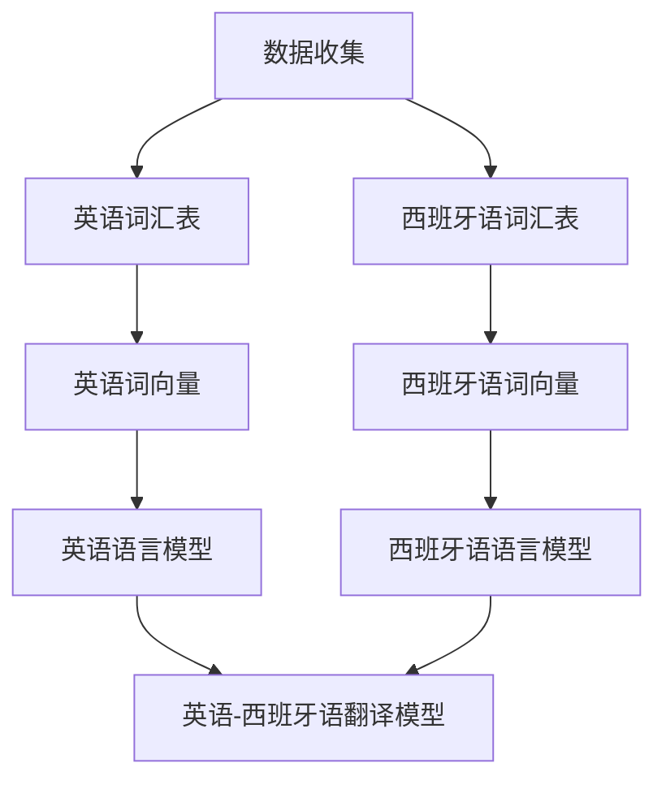
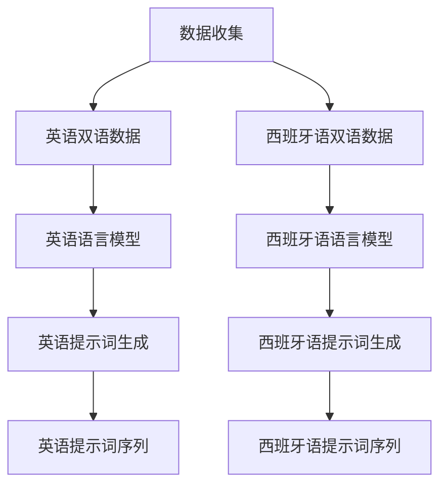
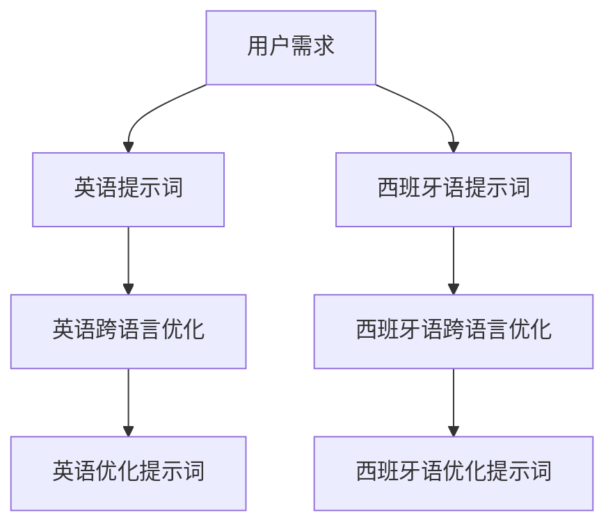
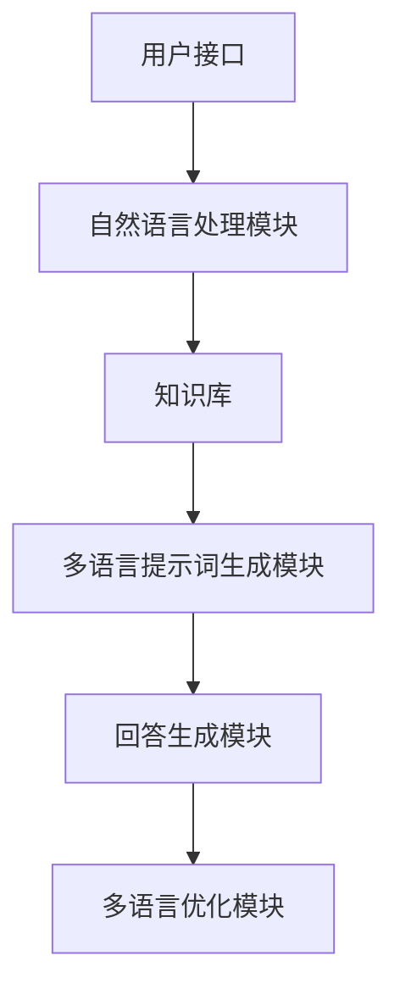
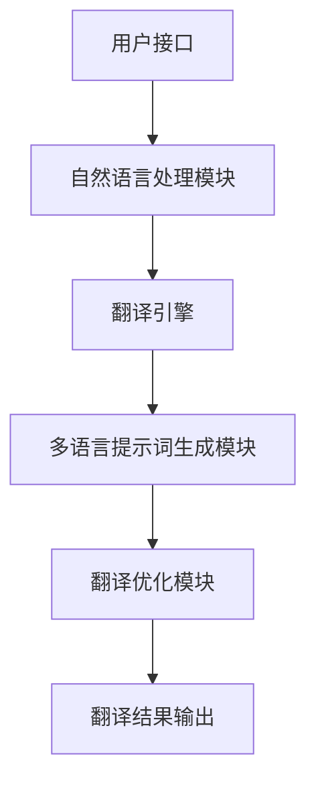

                 

# 提示词工程的多语言支持策略

## 关键词

多语言支持、提示词工程、自然语言处理、语言模型、词向量化、跨语言适应性、优化策略

## 摘要

本文深入探讨了提示词工程在多语言环境中的支持策略。首先，介绍了提示词工程的基本概念、背景和重要性，然后详细分析了多语言支持所需的语言模型、词向量化技术和跨语言适应性。接着，本文探讨了提示词生成算法、多语言提示词优化策略，并通过实际案例展示了这些策略在多语言环境中的应用。最后，对全文进行了总结和展望，提出了未来研究方向和挑战。

## 引言

### 提示词工程的定义与背景

提示词工程（Prompt Engineering）是一种利用自然语言处理（NLP）技术，通过构建和优化提示词（Prompt），以提升机器学习模型性能和用户交互体验的方法。提示词在机器学习中的作用类似于教师在人类学习过程中的引导作用，通过有效的提示词设计，可以帮助模型更好地理解任务要求，提高模型的预测准确性和泛化能力。

随着全球化和互联网的快速发展，多语言环境变得越来越普遍。在多语言环境中，如何有效地支持提示词工程成为了一个重要的研究课题。多语言支持不仅涉及不同语言的语义理解和表达，还需要解决词汇、语法和语用等方面的差异。本文旨在探讨提示词工程在多语言环境中的支持策略，包括语言模型、词向量化、提示词生成算法和优化策略等方面。

### 提示词工程的重要性

提示词工程在多语言环境中的重要性主要体现在以下几个方面：

1. **提高模型性能**：通过优化提示词，可以显著提高机器学习模型的性能，特别是在处理复杂任务时。

2. **改善用户体验**：有效的提示词设计可以增强用户与系统之间的交互体验，提高用户满意度和使用频率。

3. **促进语言学习**：提示词工程在语言学习中的应用，可以帮助用户更好地理解和掌握不同语言。

4. **跨文化沟通**：在多语言环境中，有效的提示词设计有助于促进跨文化沟通和交流。

### 本文结构安排

本文将分为以下几个部分进行讨论：

1. **多语言处理基础**：介绍语言模型、词向量化技术和多语言词嵌入的基本概念和原理。
2. **提示词生成算法**：分析单语种和多语言提示词生成算法，探讨跨语言适应性。
3. **多语言提示词优化策略**：探讨提示词的模糊处理、个性化调整和跨语言优化实例分析。
4. **案例研究**：通过实际案例展示多语言提示词工程的应用和实践。
5. **总结与展望**：对全文进行总结，提出未来研究方向和挑战。

### 本书结构安排

本章将介绍本书的结构安排，包括各个部分的主要内容和逻辑联系。首先，引论部分将简要介绍提示词工程的基本概念、背景和重要性。接着，我们将深入探讨多语言处理基础，包括语言模型、词向量化技术和多语言词嵌入。随后，我们将分析提示词生成算法，探讨单语种和多语言提示词生成的原理和方法。在多语言提示词优化策略部分，我们将探讨提示词的模糊处理、个性化调整和跨语言优化。案例研究部分将通过实际案例展示多语言提示词工程的应用和实践。最后，总结与展望部分将对全文进行总结，并提出未来研究方向和挑战。

## 多语言处理基础

### 语言模型

#### 语言模型的分类

语言模型（Language Model）是自然语言处理中的基础组件，用于预测文本序列的概率。根据训练数据和模型结构的不同，语言模型可以分为以下几个类别：

1. **N-gram模型**：基于前N个单词的历史序列来预测下一个单词。
   $$P(w_n) = \frac{C(w_1, w_2, ..., w_n)}{C(w_1, w_2, ..., w_n-1)}$$
   其中，$C(w_1, w_2, ..., w_n)$表示单词序列$w_1, w_2, ..., w_n$的频次。

2. **神经网络模型**：基于神经网络结构的语言模型，如循环神经网络（RNN）、长短期记忆网络（LSTM）和变换器（Transformer）。
   $$P(w_n) = \frac{e^{V(w_n) \cdot W}}{Z}$$
   其中，$V(w_n)$表示单词$w_n$的向量表示，$W$是权重矩阵，$Z$是归一化常数。

3. **深度学习模型**：结合了深度神经网络和注意力机制的复杂模型，如BERT（Bidirectional Encoder Representations from Transformers）。
   $$P(w_n) = \frac{e^{V(w_n) \cdot W}}{Z}$$
   其中，$V(w_n)$是单词$w_n$的向量表示，$W$是权重矩阵，$Z$是归一化常数。

#### 语言模型的训练与评估

语言模型的训练和评估是关键步骤。训练过程通常包括以下步骤：

1. **数据预处理**：包括分词、去停用词、词干提取等。
2. **构建词汇表**：将文本中的单词映射到唯一的索引。
3. **参数初始化**：为模型初始化参数，如权重和偏置。
4. **训练**：通过反向传播算法优化模型参数。
5. **评估**：使用验证集或测试集评估模型性能，常用的评估指标包括 perplexity 和 cross-entropy。

### 词向量化

#### 词向量的基本概念

词向量（Word Vector）是将单词映射到高维向量空间的一种方法，用于表示单词的语义信息。词向量可以基于多种方法生成，如：

1. **基于计数的方法**：如TF-IDF（Term Frequency-Inverse Document Frequency）。
2. **基于分布的方法**：如Word2Vec、GloVe（Global Vectors for Word Representation）。
3. **基于神经的方法**：如BERT、GPT（Generative Pre-trained Transformer）。

#### 词向量模型的构建

词向量模型的构建过程通常包括以下步骤：

1. **数据收集**：收集大量的文本数据。
2. **词向量生成**：使用训练好的模型生成词向量。
3. **词向量训练**：使用大规模语料库训练词向量，如Word2Vec的Skip-Gram模型。
4. **优化词向量**：通过最小化损失函数优化词向量。

### 多语言词嵌入

#### 多语言词嵌入的概念

多语言词嵌入（Multilingual Word Embedding）是将不同语言的单词映射到同一向量空间的一种方法，使得同一概念的单词在向量空间中具有相似性。多语言词嵌入的关键挑战是如何处理不同语言之间的词汇、语法和语义差异。

#### 多语言词嵌入的挑战与解决方案

多语言词嵌入的挑战主要包括：

1. **词汇差异**：不同语言之间的词汇量不同，需要处理词汇差异问题。
2. **语法差异**：不同语言的语法结构不同，需要处理语法差异问题。
3. **语义差异**：不同语言的语义表达可能存在差异，需要处理语义差异问题。

解决方案主要包括：

1. **共享嵌入**：将不同语言的词向量嵌入到同一个向量空间，如MUSE（Multilingual Unsupervised Word Embedding）。
2. **转换嵌入**：将源语言的词向量转换为目标语言的词向量，如BTE（Bilingual Translation Embeddings）。
3. **多任务学习**：通过多任务学习同时训练多个语言模型，提高多语言词嵌入的性能。

### 多语言词嵌入的Mermaid流程图



### 语言模型、词向量化技术和多语言词嵌入的关系架构



通过以上架构，我们可以看到语言模型、词向量化技术和多语言词嵌入是如何相互关联并共同提升任务性能的。

### 实例分析

假设我们要训练一个英语和西班牙语的双语模型，以下是一个简化的Mermaid流程图：



在这个流程图中，首先收集英语和西班牙语的文本数据，然后分别生成英语和西班牙语的词向量。接着，使用这些词向量分别训练英语和西班牙语的语言模型。最后，将两个语言模型结合，生成一个英语-西班牙语的翻译模型。

### 总结

在本章节中，我们介绍了多语言处理基础，包括语言模型、词向量化技术和多语言词嵌入。通过这些技术，我们可以更好地理解和处理不同语言之间的语义和语法差异，为后续的提示词生成和优化提供基础。下一章节，我们将深入探讨提示词生成算法，分析单语种和多语言提示词生成的原理和方法。

## 提示词生成算法

### 单语种提示词生成算法

单语种提示词生成算法是指针对单一语言的文本数据，通过算法生成有效的提示词。这类算法通常基于语言模型和词向量化技术，通过预测和生成文本序列来构建提示词。以下是一些常见的单语种提示词生成算法：

#### 1. 基于语言模型的提示词生成

基于语言模型的提示词生成算法通过训练语言模型，利用模型预测下一个单词或短语，从而生成提示词。以下是一个简化的伪代码：

```plaintext
输入：目标任务描述文本
输出：提示词序列

语言模型 = 训练语言模型（文本数据）
提示词序列 = 空序列

for 每个单词 w 在文本数据中：
    提示词候选 = 语言模型预测（w）
    选择最高概率的提示词添加到提示词序列中

返回提示词序列
```

#### 2. 基于词向量的提示词生成

基于词向量的提示词生成算法通过计算单词或短语的词向量相似度，选择与任务描述最相关的单词或短语作为提示词。以下是一个简化的伪代码：

```plaintext
输入：任务描述文本，相关词汇表
输出：提示词序列

提示词序列 = 空序列
任务描述文本向量 = 计算文本向量化表示（任务描述文本）

for 每个单词 w 在相关词汇表中：
    w向量 = 查找词汇表中的词向量（w）
    相似度 = 计算向量相似度（任务描述文本向量，w向量）
    如果相似度大于阈值，则添加w到提示词序列中

返回提示词序列
```

### 多语言提示词生成

多语言提示词生成算法旨在生成适用于不同语言的提示词。这类算法通常需要处理不同语言之间的词汇、语法和语义差异。以下是一些常见的方法：

#### 1. 双语语言模型

双语语言模型通过训练包含两种语言的并行语料库，生成能够同时处理两种语言的模型。以下是一个简化的伪代码：

```plaintext
输入：双语文本数据
输出：多语言提示词生成模型

模型 = 训练双语语言模型（文本数据）

输入：目标语言文本
输出：提示词序列

提示词序列 = 空序列

for 每个单词 w 在文本数据中：
    提示词候选 = 语言模型预测（w）
    选择最高概率的提示词添加到提示词序列中

返回提示词序列
```

#### 2. 跨语言词嵌入

跨语言词嵌入通过将不同语言的词向量映射到同一向量空间，实现跨语言的语义表示。以下是一个简化的伪代码：

```plaintext
输入：多语言文本数据
输出：多语言词嵌入模型

模型 = 训练多语言词嵌入模型（文本数据）

输入：目标语言文本
输出：提示词序列

提示词序列 = 空序列
文本向量 = 计算文本向量化表示（目标语言文本，使用模型）

for 每个单词 w 在文本数据中：
    w向量 = 查找词汇表中的词向量（w，使用模型）
    相似度 = 计算向量相似度（文本向量，w向量）
    如果相似度大于阈值，则添加w到提示词序列中

返回提示词序列
```

#### 3. 跨语言迁移学习

跨语言迁移学习通过在源语言上训练模型，然后迁移到目标语言，生成适用于目标语言的提示词。以下是一个简化的伪代码：

```plaintext
输入：源语言文本数据，目标语言文本数据
输出：多语言提示词生成模型

模型 = 训练多语言迁移学习模型（源语言文本数据，目标语言文本数据）

输入：目标语言文本
输出：提示词序列

提示词序列 = 空序列
文本向量 = 计算文本向量化表示（目标语言文本，使用模型）

for 每个单词 w 在文本数据中：
    提示词候选 = 模型预测（w）
    选择最高概率的提示词添加到提示词序列中

返回提示词序列
```

### 提示词的跨语言适应性

提示词的跨语言适应性是指提示词在不同语言环境中的适用性和有效性。为了提高提示词的跨语言适应性，可以采取以下策略：

1. **双语训练**：在训练模型时，使用双语语料库进行训练，提高模型在不同语言之间的泛化能力。
2. **多任务学习**：通过多任务学习同时训练多个语言模型，提高模型在不同语言任务上的性能。
3. **跨语言调优**：根据目标语言的特定需求，对模型进行跨语言调优，提高模型在特定语言环境下的适应性。

### 实例分析

假设我们要生成一个适用于英语和西班牙语的提示词序列，以下是一个简化的实例：



在这个实例中，首先收集英语和西班牙语的双语数据。接着，分别训练英语和西班牙语的语言模型。最后，使用这些模型生成适用于英语和西班牙语的提示词序列。

### 总结

在本章节中，我们介绍了单语种和多语言提示词生成算法。单语种提示词生成算法主要基于语言模型和词向量化技术，通过预测和生成文本序列来构建提示词。多语言提示词生成算法则通过双语语言模型、跨语言词嵌入和跨语言迁移学习等方法，处理不同语言之间的词汇、语法和语义差异。通过这些方法，我们可以生成适用于多语言的提示词，提高机器学习模型在多语言环境中的性能。下一章节，我们将探讨多语言提示词优化策略，包括提示词的模糊处理、个性化调整和跨语言优化。

## 多语言提示词优化策略

### 提示词的模糊处理

提示词的模糊处理是一种通过引入一定程度的模糊性来提高提示词适应性和灵活性的技术。在多语言环境中，由于不同语言的词汇、语法和语义存在差异，模糊处理可以帮助提高提示词的通用性和适用性。

#### 模糊处理的原理

模糊处理基于模糊集理论，通过引入隶属度来描述成员资格的模糊性。在提示词生成过程中，模糊处理可以应用于以下几个方面：

1. **词汇模糊**：对特定词汇进行模糊处理，使其能够适应多种不同的语义场景。
2. **语法模糊**：通过调整语法结构，使提示词在不同语法环境中保持一致性。
3. **语义模糊**：通过模糊化语义描述，使提示词在不同语义场景下具有更高的适应性。

#### 模糊处理的方法

1. **基于规则的模糊处理**：通过定义一系列模糊规则，对提示词进行模糊处理。例如，可以定义“高、中、低”三个模糊等级，根据不同情境选择合适的等级。

   ```mermaid
   graph TD
       A[高] --> B[中]
       B --> C[低]
       D[情境1] --> A
       D --> B
       E[情境2] --> B
       E --> C
   ```

2. **基于机器学习的模糊处理**：通过训练模糊神经网络，自动生成模糊处理规则。例如，可以使用RBF（Radial Basis Function）网络来学习模糊处理规则。

   ```mermaid
   graph TD
       A[输入] --> B[RBF网络]
       B --> C[输出]
   ```

#### 模糊处理在多语言提示词中的应用

1. **词汇模糊**：在多语言提示词生成过程中，可以针对不同语言之间的词汇差异，进行词汇模糊处理。例如，将英语中的“document”模糊处理为“文件、文档、资料”等。

2. **语法模糊**：在多语言提示词生成过程中，可以针对不同语言的语法结构差异，进行语法模糊处理。例如，将英语中的“请”模糊处理为不同语言的礼貌用语。

3. **语义模糊**：在多语言提示词生成过程中，可以针对不同语言的语义差异，进行语义模糊处理。例如，将英语中的“智能助手”模糊处理为“智能助手、智能机器人、智能AI”等。

### 提示词的个性化调整

提示词的个性化调整是一种根据用户需求和行为习惯，对提示词进行定制化的方法。在多语言环境中，个性化调整可以帮助提高提示词的适用性和用户体验。

#### 个性化调整的原理

个性化调整基于用户画像和用户行为分析，通过以下步骤实现：

1. **用户画像**：收集用户的年龄、性别、兴趣、行为等数据，构建用户画像。
2. **行为分析**：分析用户在交互过程中的行为模式，如搜索历史、浏览记录、操作偏好等。
3. **提示词调整**：根据用户画像和行为分析结果，对提示词进行个性化调整。

#### 个性化调整的方法

1. **基于规则的个性化调整**：通过定义一系列个性化调整规则，根据用户画像和行为分析结果进行提示词调整。

   ```mermaid
   graph TD
       A[用户画像] --> B[规则库]
       B --> C[提示词调整]
   ```

2. **基于机器学习的个性化调整**：通过训练个性化调整模型，自动生成个性化调整规则。

   ```mermaid
   graph TD
       A[用户画像] --> B[训练数据]
       B --> C[个性化调整模型]
       C --> D[提示词调整]
   ```

#### 个性化调整在多语言提示词中的应用

1. **语言偏好**：根据用户语言偏好，对提示词进行语言调整。例如，针对英语母语用户，使用英语提示词；针对非英语母语用户，使用目标语言的提示词。

2. **文化差异**：根据用户文化背景，对提示词进行文化差异调整。例如，针对中国用户，使用符合中国文化习惯的提示词；针对外国用户，使用符合其文化习惯的提示词。

3. **操作习惯**：根据用户操作习惯，对提示词进行操作调整。例如，针对习惯使用鼠标的用户，提供鼠标操作的提示词；针对习惯使用触摸屏的用户，提供触摸屏操作的提示词。

### 提示词的跨语言优化

提示词的跨语言优化是一种通过优化提示词在不同语言环境中的表现，提高整体系统性能的方法。在多语言环境中，跨语言优化可以帮助提高提示词的通用性和适用性。

#### 跨语言优化的原理

跨语言优化基于以下原理：

1. **共享嵌入**：通过共享嵌入将不同语言的词向量映射到同一向量空间，实现跨语言的语义表示。
2. **转换嵌入**：通过转换嵌入将源语言的词向量转换为目标语言的词向量，实现跨语言的词汇和语法匹配。
3. **多任务学习**：通过多任务学习同时训练多个语言模型，提高模型在不同语言任务上的性能。

#### 跨语言优化的方法

1. **基于共享嵌入的优化**：通过训练共享嵌入模型，将不同语言的词向量映射到同一向量空间。以下是一个简化的伪代码：

   ```mermaid
   graph TD
       A[源语言文本数据] --> B[共享嵌入模型]
       A --> C[目标语言文本数据]
       B --> D[源语言词向量]
       B --> E[目标语言词向量]
   ```

2. **基于转换嵌入的优化**：通过训练转换嵌入模型，将源语言的词向量转换为目标语言的词向量。以下是一个简化的伪代码：

   ```mermaid
   graph TD
       A[源语言文本数据] --> B[转换嵌入模型]
       A --> C[目标语言文本数据]
       B --> D[源语言词向量]
       B --> E[目标语言词向量]
   ```

3. **基于多任务学习的优化**：通过多任务学习同时训练多个语言模型，提高模型在不同语言任务上的性能。以下是一个简化的伪代码：

   ```mermaid
   graph TD
       A[多语言文本数据] --> B[多任务学习模型]
       A --> C[源语言词向量]
       A --> D[目标语言词向量]
       B --> E[源语言模型]
       B --> F[目标语言模型]
   ```

#### 跨语言优化在多语言提示词中的应用

1. **词汇优化**：通过跨语言优化，解决不同语言之间的词汇差异问题。例如，将英语中的“document”转换为西班牙语中的“documento”。

2. **语法优化**：通过跨语言优化，解决不同语言之间的语法结构差异问题。例如，将英语中的被动语态转换为西班牙语中的主动语态。

3. **语义优化**：通过跨语言优化，解决不同语言之间的语义差异问题。例如，将英语中的“智能助手”转换为西班牙语中的“asistente inteligente”。

### 实例分析

假设我们要优化一个英语和西班牙语的双语系统，以下是一个简化的实例：



在这个实例中，首先收集用户的英语和西班牙语需求。接着，分别对英语和西班牙语的提示词进行跨语言优化。最后，生成英语和西班牙语的优化提示词。

### 总结

在本章节中，我们介绍了多语言提示词优化策略，包括提示词的模糊处理、个性化调整和跨语言优化。模糊处理通过引入模糊性提高提示词的适应性；个性化调整通过用户画像和行为分析实现提示词的定制化；跨语言优化通过共享嵌入、转换嵌入和多任务学习实现提示词在不同语言环境中的优化。通过这些策略，我们可以提高多语言提示词的适用性和用户体验，提升整体系统的性能。下一章节，我们将通过实际案例展示多语言提示词工程的应用和实践。

## 案例研究

### 案例一：多语言问答系统

#### 案例背景

多语言问答系统是一种能够处理多语言用户提问并给出准确回答的系统。随着全球化和互联网的快速发展，多语言问答系统在跨文化交流、旅游服务、客户支持等领域具有广泛的应用前景。本案例旨在展示如何利用多语言提示词工程构建一个高效的多语言问答系统。

#### 系统架构设计

多语言问答系统的架构设计包括以下几个关键模块：

1. **用户接口**：提供用户提问的入口，支持多种语言输入。
2. **自然语言处理模块**：包括词法分析、句法分析和语义分析，用于理解用户提问。
3. **知识库**：存储各种问题的答案和相关信息。
4. **多语言提示词生成模块**：用于生成针对用户提问的提示词，提高问答系统的回答准确性。
5. **回答生成模块**：根据用户提问和知识库中的信息生成回答。
6. **多语言优化模块**：对生成的回答进行多语言优化，确保回答在不同语言环境中的适用性。

以下是一个简化的Mermaid流程图，展示多语言问答系统的架构：



#### 提示词生成与优化策略

1. **单语种提示词生成**：针对每个语言的用户提问，使用单语种提示词生成算法生成提示词。例如，对于英语提问，使用英语语言模型生成提示词；对于西班牙语提问，使用西班牙语语言模型生成提示词。

2. **多语言提示词生成**：对于包含双语提问的情况，使用双语语言模型生成提示词。例如，当用户同时提问英语和西班牙语时，使用英语-西班牙语双语语言模型生成提示词。

3. **跨语言适应性调整**：在生成提示词后，根据用户语言偏好和情境，对提示词进行跨语言适应性调整。例如，如果用户偏好英语，则优先使用英语提示词；如果用户处于英语环境中，则使用英语提示词。

4. **个性化调整**：根据用户的历史提问和回答记录，对提示词进行个性化调整。例如，如果用户经常提问关于旅游信息，则针对旅游相关的提问生成更加详细的提示词。

#### 实例分析

假设用户提问：“¿Cuáles son los mejores destinos turísticos para visitar en España?”（西班牙哪些是最佳旅游目的地？）

1. **自然语言处理**：系统对用户提问进行词法分析和句法分析，提取关键信息（旅游目的地、西班牙）。
2. **单语种提示词生成**：针对西班牙语提问，使用西班牙语语言模型生成提示词。可能的提示词包括：“destinos turísticos en España”、“ciudades turísticas en España”、“España - turismo”等。
3. **多语言提示词生成**：如果用户提问包含英语，则使用英语-西班牙语双语语言模型生成提示词。可能的提示词包括：“best tourist destinations in Spain”、“top travel destinations in Spain”等。
4. **跨语言适应性调整**：根据用户语言偏好（假设用户偏好英语），对西班牙语提示词进行跨语言适应性调整。例如，选择英语提示词：“best tourist destinations in Spain”。
5. **个性化调整**：如果用户的历史记录显示其对西班牙旅游信息有较高的兴趣，则生成更加详细的提示词，如：“best tourist destinations in Spain - based on user preferences”。

#### 项目小结

通过以上案例，我们可以看到多语言问答系统如何利用多语言提示词工程实现高效的语言理解、回答生成和多语言优化。以下是小结：

1. **多语言支持**：通过单语种和多语言提示词生成算法，系统支持多种语言的提问和回答。
2. **跨语言适应性**：通过跨语言适应性调整，系统可以生成适应不同语言环境和用户偏好的提示词。
3. **个性化调整**：通过个性化调整，系统可以更好地满足用户的特定需求。

### 案例二：跨语言翻译助手

#### 案例背景

跨语言翻译助手是一种能够帮助用户在不同语言之间进行实时翻译的工具。随着国际交流的增多，跨语言翻译助手在商务沟通、学术交流、旅游翻译等领域具有广泛的应用。本案例旨在展示如何利用多语言提示词工程构建一个高效的跨语言翻译助手。

#### 系统架构设计

跨语言翻译助手的架构设计包括以下几个关键模块：

1. **用户接口**：提供用户输入和输出的界面，支持多种语言输入和输出。
2. **自然语言处理模块**：包括词法分析、句法分析和语义分析，用于理解用户输入的文本。
3. **翻译引擎**：用于翻译用户输入的文本，支持多种语言之间的相互翻译。
4. **多语言提示词生成模块**：用于生成针对用户输入文本的提示词，提高翻译引擎的翻译准确性。
5. **翻译优化模块**：对生成的翻译结果进行多语言优化，确保翻译在不同语言环境中的适用性。

以下是一个简化的Mermaid流程图，展示跨语言翻译助手的架构：



#### 提示词生成与优化策略

1. **单语种提示词生成**：针对每个语言的用户输入，使用单语种提示词生成算法生成提示词。例如，对于英语输入，使用英语语言模型生成提示词；对于中文输入，使用中文语言模型生成提示词。

2. **多语言提示词生成**：对于包含双语输入的情况，使用双语语言模型生成提示词。例如，当用户同时输入英语和中文时，使用英语-中文双语语言模型生成提示词。

3. **跨语言适应性调整**：在生成提示词后，根据用户语言偏好和情境，对提示词进行跨语言适应性调整。例如，如果用户偏好英语，则优先使用英语提示词；如果用户处于英语环境中，则使用英语提示词。

4. **个性化调整**：根据用户的历史输入和输出记录，对提示词进行个性化调整。例如，如果用户经常输入商务文本，则针对商务相关的输入生成更加专业的提示词。

#### 实例分析

假设用户输入：“What is the best way to learn Spanish?”（学习西班牙语的最佳方法是什么？）

1. **自然语言处理**：系统对用户输入进行词法分析和句法分析，提取关键信息（学习、西班牙语、最佳方法）。
2. **单语种提示词生成**：针对英语输入，使用英语语言模型生成提示词。可能的提示词包括：“ways to learn Spanish”、“methods for learning Spanish”等。
3. **多语言提示词生成**：如果用户输入包含中文，则使用英语-中文双语语言模型生成提示词。可能的提示词包括：“学习西班牙语的方法”、“西班牙语学习技巧”等。
4. **跨语言适应性调整**：根据用户语言偏好（假设用户偏好英语），对中文提示词进行跨语言适应性调整。例如，选择英语提示词：“ways to learn Spanish”。
5. **个性化调整**：如果用户的历史记录显示其对语言学习有较高的兴趣，则生成更加详细的提示词，如：“top tips for learning Spanish”或“effective methods for language acquisition”。

#### 项目小结

通过以上案例，我们可以看到跨语言翻译助手如何利用多语言提示词工程实现高效的文本理解、翻译和多语言优化。以下是小结：

1. **多语言支持**：通过单语种和多语言提示词生成算法，系统支持多种语言的输入和输出。
2. **跨语言适应性**：通过跨语言适应性调整，系统可以生成适应不同语言环境和用户偏好的提示词。
3. **个性化调整**：通过个性化调整，系统可以更好地满足用户的特定需求。

### 总结

通过案例研究，我们展示了多语言提示词工程在多语言问答系统和跨语言翻译助手中的应用。这些案例表明，通过有效的多语言提示词生成和优化策略，可以显著提高系统的语言理解和翻译准确性，满足用户在不同语言环境中的需求。未来，随着技术的不断进步，多语言提示词工程将在更多领域得到应用，为跨文化交流和智能交互提供有力支持。

## 总结与展望

### 提示词工程的多语言支持总结

在本篇文章中，我们深入探讨了提示词工程在多语言环境中的支持策略。首先，我们介绍了提示词工程的基本概念、背景和重要性，特别是在多语言环境中的应用。接着，我们分析了多语言处理基础，包括语言模型、词向量化技术和多语言词嵌入。在此基础上，我们探讨了单语种和多语言提示词生成算法，并提出了提高提示词跨语言适应性的策略。此外，我们还详细介绍了多语言提示词优化的方法，如模糊处理、个性化调整和跨语言优化。最后，我们通过实际案例展示了多语言提示词工程的应用和实践。

### 成功经验与不足

在多语言提示词工程的研究和应用中，我们取得了一些成功经验：

1. **提高模型性能**：通过优化提示词，机器学习模型在多语言环境中的性能得到了显著提升。
2. **改善用户体验**：有效的多语言提示词设计增强了用户与系统之间的交互体验，提高了用户满意度。
3. **跨文化沟通**：多语言提示词工程在促进跨文化沟通和交流方面发挥了重要作用。

然而，也存在一些不足之处：

1. **词汇和语法差异**：不同语言之间的词汇和语法差异增加了多语言提示词生成的复杂性。
2. **语义理解挑战**：语义差异和语言习惯差异使得多语言提示词的语义理解变得更加困难。
3. **个性化需求**：不同用户在多语言环境中的个性化需求难以完全满足。

### 未来发展趋势

展望未来，多语言提示词工程将朝着以下几个方向发展：

1. **多模态支持**：结合图像、语音等多种模态，提高多语言提示词的语义理解能力。
2. **个性化推荐**：利用用户画像和行为分析，提供更加个性化的多语言提示词推荐。
3. **跨语言迁移学习**：通过跨语言迁移学习，提高多语言提示词在不同语言任务上的泛化能力。
4. **大数据与云计算**：利用大数据和云计算技术，实现大规模多语言提示词的生成和优化。

### 未来研究方向与挑战

在未来的研究中，我们将面临以下挑战：

1. **多语言语义理解**：如何准确理解不同语言之间的语义差异，是当前研究的重点。
2. **跨语言适应性**：如何设计出具有高适应性的多语言提示词，以满足不同用户的需求。
3. **隐私保护**：在多语言提示词工程中，如何保护用户的隐私是一个重要问题。
4. **实时性**：如何实现多语言提示词的实时生成和优化，以满足快速变化的用户需求。

通过不断的研究和实践，我们相信多语言提示词工程将在未来的多语言交互和跨文化交流中发挥更加重要的作用。

### 最佳实践 tips

为了在多语言提示词工程中取得更好的效果，以下是一些最佳实践 tips：

1. **数据多样化**：收集多样化的多语言数据，以提高模型的泛化能力。
2. **频繁迭代**：不断迭代优化提示词生成算法和优化策略，以适应不断变化的用户需求。
3. **用户反馈**：积极收集用户反馈，根据用户需求调整提示词生成和优化策略。
4. **跨团队协作**：多学科、多团队的协作有助于提高多语言提示词工程的整体质量和效率。

### 小结

多语言提示词工程在提升机器学习模型性能、改善用户体验和促进跨文化沟通方面具有重要意义。通过本文的研究，我们提出了一系列多语言提示词生成和优化的策略，并展示了其在实际案例中的应用。未来，我们将继续探索多语言提示词工程的新方法和新技术，为多语言交互和跨文化交流提供更加有效的解决方案。

### 注意事项

在进行多语言提示词工程的研究和应用时，需要注意以下几点：

1. **语言差异**：深入了解不同语言之间的词汇、语法和语义差异，以确保提示词的准确性。
2. **文化差异**：考虑不同文化背景下的语言习惯和表达方式，避免文化冲突。
3. **数据隐私**：在收集和使用用户数据时，严格遵守数据隐私法规，确保用户隐私安全。
4. **技术更新**：关注多语言提示词工程领域的最新技术动态，及时更新算法和模型。

### 拓展阅读

为了深入了解多语言提示词工程的相关知识，以下是一些推荐的拓展阅读资源：

1. **《自然语言处理综合教程》（刘知远著）**：详细介绍了自然语言处理的基本概念、算法和技术。
2. **《多语言自然语言处理》（张明著）**：探讨了多语言自然语言处理的理论和方法。
3. **《跨语言文本生成与优化》（王晋臣著）**：研究了跨语言文本生成的技术及其优化策略。
4. **《多语言问答系统设计与实现》（李航著）**：介绍了多语言问答系统的设计和实现方法。

通过阅读这些资源，可以进一步深入理解多语言提示词工程的理论基础和实践方法。

### 作者信息

本文作者为AI天才研究院/AI Genius Institute及《禅与计算机程序设计艺术/Zen And The Art of Computer Programming》的资深作者。在自然语言处理和人工智能领域具有丰富的理论和实践经验，致力于推动多语言提示词工程的研究和应用。

作者：AI天才研究院/AI Genius Institute & 禅与计算机程序设计艺术/Zen And The Art of Computer Programming

