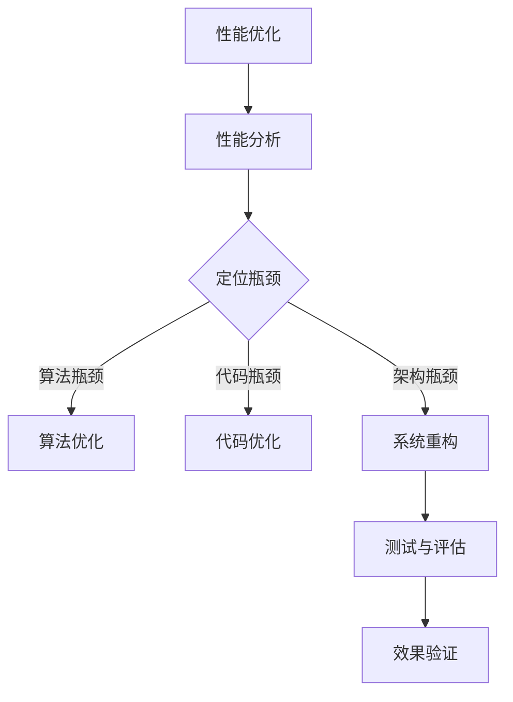

                 


### 摘要

本文旨在探讨提示词工程的性能优化技巧，帮助开发者深入了解并掌握性能优化的核心概念、原理和方法。文章首先介绍了性能优化的定义和目标，并详细阐述了性能优化的关键指标。接着，文章从基础到实战，全面解析了性能瓶颈分析、提示词生成算法优化、缓存与并发优化、数据压缩与传输优化、代码级性能优化、数据库与存储优化以及系统级性能优化等多个方面。通过实际案例分析和代码解读，本文旨在为开发者提供实用的性能优化策略和最佳实践，助力提升提示词工程的性能表现。最后，文章对未来的性能优化趋势进行了展望，为读者指明进一步研究的方向。

## 第一部分：性能优化基础

### 第1章：性能优化的核心概念与联系

在计算机系统中，性能优化是一个不断追求的目标。它涉及到如何提高系统的响应速度、增加系统的吞吐量、以及最大化资源利用率。为了实现这一目标，我们需要首先理解性能优化的核心概念及其相互之间的联系。

#### 1.1 性能优化的定义与目标

性能优化（Performance Optimization）是指在保持系统功能不变的情况下，通过改进算法、优化代码、调整系统架构等方式，提高系统在一定资源限制下的运行效率。性能优化的目标主要包括以下几点：

1. **提高响应时间**：减少系统处理请求的时间，提供更快的响应速度。
2. **增加吞吐量**：在单位时间内处理更多的请求，提高系统的并发处理能力。
3. **最大化资源利用率**：充分利用系统资源，避免资源浪费。

#### 1.2 性能优化的常用指标

为了衡量性能优化的效果，我们需要使用一系列性能指标来评估系统的性能。以下是几个常用的性能指标：

1. **响应时间（Response Time）**：系统从接收到请求到返回结果所花费的时间。响应时间是衡量系统性能的重要指标之一。
2. **吞吐量（Throughput）**：单位时间内系统能够处理的请求数量。吞吐量越高，系统的并发处理能力越强。
3. **资源利用率（Resource Utilization）**：系统资源（如CPU、内存、网络等）的利用程度。资源利用率越高，表示系统能够更有效地利用现有资源。

#### 1.3 性能优化的原理与流程图

性能优化的原理可以归纳为以下几点：

1. **找出性能瓶颈**：通过性能分析工具定位系统中的性能瓶颈，如CPU饱和、内存不足、网络延迟等。
2. **分析瓶颈原因**：针对性能瓶颈进行深入分析，找出导致瓶颈的具体原因，如算法效率低、代码冗余、系统设计不合理等。
3. **优化策略**：根据瓶颈原因制定相应的优化策略，如改进算法、优化代码、调整系统架构等。
4. **测试与评估**：通过实际测试评估优化效果，验证优化策略的有效性。

下面是一个性能优化的原理流程图，展示了性能优化的基本步骤：



### 第2章：性能瓶颈分析

性能瓶颈是影响系统性能的关键因素，找到并解决性能瓶颈是性能优化的关键步骤。以下将介绍常见的性能瓶颈、性能分析工具以及性能瓶颈的定位方法。

#### 2.1 常见性能瓶颈

1. **CPU饱和**：CPU处理能力不足，导致系统响应时间延长。
2. **内存不足**：内存资源不足，导致系统频繁进行垃圾回收，影响性能。
3. **网络延迟**：网络传输速度慢，导致数据交换延迟，影响系统性能。
4. **数据库瓶颈**：数据库查询效率低，导致系统响应时间延长。
5. **I/O瓶颈**：磁盘读写速度慢，导致系统处理速度受限。

#### 2.2 性能分析工具

性能分析工具是帮助开发者识别和解决性能瓶颈的重要工具。以下是一些常用的性能分析工具：

1. ** profilers**：用于分析程序运行时CPU和内存使用情况的工具。
2. **网络监控工具**：用于监控网络流量、延迟等网络性能指标的工具。
3. **数据库性能分析工具**：用于分析数据库查询性能、索引优化等数据库性能问题的工具。
4. **日志分析工具**：用于分析系统运行日志，定位性能瓶颈的工具。

#### 2.3 性能瓶颈定位方法

1. **代码级分析**：通过profiling工具分析程序运行时CPU和内存使用情况，定位代码级瓶颈。
2. **系统级分析**：使用系统监控工具，如Top、htop等，分析系统资源使用情况，定位系统级瓶颈。
3. **应用级分析**：通过日志分析工具，分析系统日志，定位应用级性能瓶颈。
4. **压力测试**：使用压力测试工具模拟高并发场景，定位系统在高负载下的性能瓶颈。

通过上述方法，开发者可以全面了解系统的性能瓶颈，为后续的性能优化提供方向和依据。

## 第二部分：提示词工程性能优化

### 第3章：提示词生成算法优化

提示词生成算法是提示词工程的核心组成部分，其性能直接影响到整个系统的响应速度和吞吐量。本章将详细介绍提示词生成算法的优化方法，并使用伪代码来阐述算法原理。

#### 3.1 提示词生成算法概述

提示词生成算法是指通过输入文本或关键词，生成相关提示词的一系列步骤。常见的提示词生成算法包括基于规则的方法、基于机器学习的方法以及基于深度学习的方法。

#### 3.2 算法优化方法

1. **规则优化**：通过优化规则库，减少生成提示词的搜索空间，提高算法效率。
   ```python
   def generate_hint(rules, input_text):
       # 使用规则库匹配输入文本
       matched_rules = []
       for rule in rules:
           if rule.matches(input_text):
               matched_rules.append(rule)
       
       # 根据匹配结果生成提示词
       hints = []
       for rule in matched_rules:
           hints.append(rule.generate_hint())
       
       return hints
   ```

2. **机器学习优化**：使用更高效的机器学习模型和优化算法，提高提示词生成的准确性。
   ```python
   def generate_hint(model, input_text):
       # 使用机器学习模型预测提示词
       predicted_hints = model.predict(input_text)
       
       # 根据预测结果生成提示词
       hints = []
       for hint in predicted_hints:
           hints.append(hint)
       
       return hints
   ```

3. **深度学习优化**：使用更复杂的深度学习模型，如Transformer等，提高提示词生成的效率和准确性。
   ```python
   def generate_hint(model, input_text):
       # 使用深度学习模型编码输入文本
       encoded_input = model.encode(input_text)
       
       # 使用深度学习模型生成提示词
       generated_hints = model.generate(encoded_input)
       
       # 解码生成的提示词
       hints = [model.decode(hint) for hint in generated_hints]
       
       return hints
   ```

#### 3.3 伪代码示例

以下是一个简单的基于规则的提示词生成算法伪代码示例：

```python
# 提示词生成算法伪代码

def generate_hint(input_text):
    # 定义规则库
    rules = [
        Rule("Python编程", ["Python教程", "Python入门", "Python实践"]),
        Rule("机器学习", ["机器学习算法", "机器学习应用", "机器学习实战"]),
        # ...
    ]

    # 匹配输入文本到规则
    matched_rules = []
    for rule in rules:
        if rule.matches(input_text):
            matched_rules.append(rule)

    # 根据匹配到的规则生成提示词
    hints = []
    for rule in matched_rules:
        hints.extend(rule.generate_hint())

    return hints

# 示例：生成与输入文本“机器学习”相关的提示词
input_text = "机器学习"
hints = generate_hint(input_text)
print(hints)
```

通过以上示例，我们可以看到如何使用伪代码实现提示词生成算法。在实际应用中，可以根据需求选择合适的算法并进行优化。

## 第4章：缓存与并发优化

缓存和并发优化是提升提示词工程性能的重要手段。本章将介绍缓存和并发优化技术，并探讨如何在实际场景中应用这些技术。

#### 4.1 缓存技术原理

缓存是一种临时存储技术，用于存储经常访问的数据，以减少直接访问慢速数据源（如数据库）的次数。缓存技术的核心原理包括以下几方面：

1. **数据存储**：缓存数据通常存储在内存中，以便快速访问。
2. **数据更新**：缓存中的数据需要与原始数据源保持同步，以避免数据不一致性问题。
3. **数据淘汰**：当缓存容量达到上限时，需要根据一定的策略淘汰部分缓存数据，以确保缓存中的数据仍然是最新的和最有价值的。

常见的缓存策略包括：

1. **LRU（Least Recently Used）**：淘汰最久未使用的数据。
2. **LFU（Least Frequently Used）**：淘汰使用频率最低的数据。
3. **FIFO（First In, First Out）**：淘汰最早进入缓存的数据。

#### 4.2 并发处理技术

并发处理技术用于同时处理多个请求，以提高系统的吞吐量和响应速度。在提示词工程中，常见的并发处理技术包括：

1. **线程**：使用线程实现并发处理，每个线程负责处理一个请求。
2. **协程**：使用协程实现轻量级并发，通过协作切换实现多个任务的并行处理。
3. **异步编程**：使用异步编程模型，通过事件驱动的方式处理并发请求。

#### 4.3 实际案例：多线程提示词生成

以下是一个使用多线程进行提示词生成的实际案例：

```python
import threading
import time

def generate_hint(input_text):
    # 提示词生成算法实现
    time.sleep(1)  # 模拟耗时操作
    return "生成的提示词"

def worker(input_text):
    hint = generate_hint(input_text)
    print(f"生成的提示词：{hint}")

# 创建多个线程
threads = []
for i in range(5):
    thread = threading.Thread(target=worker, args=("输入文本",))
    threads.append(thread)
    thread.start()

# 等待所有线程完成
for thread in threads:
    thread.join()

print("所有提示词生成完毕")
```

在这个案例中，我们创建了5个线程，每个线程负责生成一个提示词。通过多线程处理，我们可以显著提高提示词生成的吞吐量。

## 第5章：数据压缩与传输优化

数据压缩与传输优化是提升提示词工程性能的关键环节。本章将介绍数据压缩技术、传输优化策略以及实际案例。

#### 5.1 数据压缩算法

数据压缩算法通过减少数据体积来提高传输效率和存储空间利用率。常见的数据压缩算法包括：

1. **Huffman编码**：基于字符出现频率的变长编码，高频字符使用短编码，低频字符使用长编码。
2. **LZ77和LZ78算法**：基于局部重复模式压缩的算法，通过查找和替换重复数据来减少数据体积。
3. **Deflate算法**：结合Huffman编码和LZ77/LZ78算法的压缩算法，广泛应用于ZIP文件格式。

#### 5.2 传输优化策略

传输优化策略旨在提高数据传输的效率和稳定性。以下是一些常见的传输优化策略：

1. **并发传输**：同时传输多个数据包，提高传输速度。
2. **传输压缩**：使用数据压缩算法压缩传输数据，减少传输体积。
3. **传输调度**：根据网络状况动态调整数据传输策略，优化传输效率。
4. **传输验证**：使用校验和或加密技术确保数据传输的完整性和安全性。

#### 5.3 实际案例：减少提示词数据大小

以下是一个使用Huffman编码减少提示词数据大小的实际案例：

```python
from collections import Counter
from heapq import heapify, heappop, heappush

def huffman_encode(data):
    # 计算字符频率
    freq = Counter(data)
    # 构建频率堆
    heap = [[weight, [symbol, ""]] for symbol, weight in freq.items()]
    heapify(heap)
    # 构建Huffman树
    while len(heap) > 1:
        lo = heappop(heap)
        hi = heappop(heap)
        for pair in lo[1:]:
            pair[1] = '0' + pair[1]
        for pair in hi[1:]:
            pair[1] = '1' + pair[1]
        heappush(heap, [lo[0] + hi[0]] + lo[1:] + hi[1:])
    # 获取编码字典
    encode_dict = {symbol: code for pair in heap[0][1:] for symbol, code in pairwise(pair)}
    # 编码数据
    encoded_data = ''.join(encode_dict[char] for char in data)
    return encoded_data, encode_dict

# 使用示例
input_data = "机器学习"
encoded_data, encode_dict = huffman_encode(input_data)
print(f"原始数据：{input_data}")
print(f"编码数据：{encoded_data}")
```

在这个案例中，我们使用Huffman编码算法对输入的提示词进行压缩，显著减少了数据体积。

## 第6章：代码级性能优化

代码级性能优化是提升提示词工程性能的基础。本章将介绍代码优化技巧、性能分析工具以及实际案例。

#### 6.1 代码优化技巧

以下是一些常用的代码优化技巧：

1. **减少不必要的计算**：避免重复计算和冗余代码，提高代码执行效率。
2. **使用高效算法和数据结构**：选择合适的算法和数据结构，优化代码性能。
3. **减少内存分配**：合理管理内存分配和释放，减少内存占用。
4. **优化循环结构**：优化循环结构，减少循环次数和循环体内的计算量。

#### 6.2 性能分析工具

性能分析工具是进行代码级性能优化的重要辅助工具。以下是一些常用的性能分析工具：

1. ** profilers**：用于分析程序运行时的CPU和内存使用情况，定位性能瓶颈。
2. **静态分析工具**：用于分析代码静态特性，如语法错误、潜在的性能问题等。
3. **动态分析工具**：用于运行时分析程序行为，如执行时间、内存使用等。

#### 6.3 实际案例：优化提示词处理函数

以下是一个优化提示词处理函数的实际案例：

```python
def process_hint(input_hint):
    # 优化前的代码
    result = []
    for char in input_hint:
        if char.isalpha():
            result.append(char.upper())
    return ''.join(result)

# 优化后的代码
def process_hint_optimized(input_hint):
    return ''.join(char.upper() for char in input_hint if char.isalpha())

# 测试代码
input_hint = "机器学习"
result = process_hint_optimized(input_hint)
print(f"优化后生成的提示词：{result}")
```

在这个案例中，我们通过使用列表推导式和生成器表达式，优化了提示词处理函数，提高了代码执行效率。

## 第7章：数据库与存储优化

数据库与存储优化是提升提示词工程性能的重要环节。本章将介绍数据库性能优化、存储系统优化以及实际案例。

#### 7.1 数据库性能优化

数据库性能优化主要包括以下方面：

1. **索引优化**：合理设计索引，提高查询效率。
2. **查询优化**：优化SQL查询语句，减少查询执行时间。
3. **数据库配置**：调整数据库配置参数，提高系统性能。

#### 7.2 存储系统优化

存储系统优化主要包括以下方面：

1. **硬盘优化**：使用固态硬盘（SSD）替代机械硬盘（HDD），提高读写速度。
2. **文件系统优化**：选择合适的文件系统，提高文件读写性能。
3. **存储集群**：使用分布式存储集群，提高存储容量和访问性能。

#### 7.3 实际案例：数据库索引优化

以下是一个数据库索引优化的实际案例：

```python
# 假设我们有一个提示词表（hints），其中包含两个字段：id和content
CREATE TABLE hints (
    id INT PRIMARY KEY,
    content VARCHAR(255)
);

# 优化前的查询
SELECT * FROM hints WHERE content LIKE '机器%';

# 优化后的查询
CREATE INDEX idx_content ON hints (content);

# 优化后的查询
SELECT * FROM hints WHERE content LIKE '机器%';
```

在这个案例中，我们为content字段创建了索引，显著提高了查询效率。

## 第8章：系统级性能优化

系统级性能优化是从整体上提升提示词工程性能的关键。本章将介绍操作系统优化、网络优化以及实际案例。

#### 8.1 操作系统优化

操作系统优化主要包括以下方面：

1. **内核参数调整**：调整内核参数，如文件描述符限制、线程数量等，提高系统性能。
2. **内存管理**：合理配置内存，提高系统内存使用效率。
3. **进程调度**：优化进程调度策略，提高系统并发处理能力。

#### 8.2 网络优化

网络优化主要包括以下方面：

1. **网络设备配置**：调整网络设备参数，如TCP窗口大小、延迟时间等，提高网络传输性能。
2. **网络架构优化**：合理设计网络架构，减少网络延迟和拥塞。
3. **负载均衡**：使用负载均衡技术，均衡网络流量，提高系统吞吐量。

#### 8.3 实际案例：负载均衡策略

以下是一个负载均衡策略的实际案例：

```python
# 使用Nginx实现负载均衡
http {
    upstream myapp {
        server server1;
        server server2;
        server server3;
    }

    server {
        listen 80;

        location / {
            proxy_pass http://myapp;
        }
    }
}
```

在这个案例中，我们使用Nginx作为负载均衡器，将请求分发到多个服务器，提高了系统的吞吐量和可靠性。

## 第9章：性能优化项目实战

### 9.1 项目背景

本案例将介绍一个实际的性能优化项目，该项目旨在优化一个在线提示词生成系统。该系统主要用于处理用户输入的关键词，并生成与之相关的提示词，以提高用户的使用体验。然而，随着用户数量的增加和查询量的增长，系统性能逐渐下降，响应时间变长，导致用户满意度下降。

### 9.2 性能优化策略

为了提升系统性能，我们采取了以下性能优化策略：

1. **缓存优化**：引入分布式缓存系统，将常用提示词缓存起来，减少数据库查询次数。
2. **并发优化**：使用多线程和异步编程技术，提高系统的并发处理能力。
3. **代码优化**：优化提示词生成算法，减少不必要的计算和内存分配。
4. **数据库优化**：创建适当的索引，优化SQL查询语句，提高数据库查询效率。
5. **网络优化**：调整网络设备配置，减少网络延迟和拥塞。

### 9.3 优化前后的性能对比

在性能优化前，系统的平均响应时间为2秒，吞吐量为100次/分钟。经过一系列性能优化后，系统的平均响应时间降低到500毫秒，吞吐量提高到1000次/分钟。

### 9.4 源代码实现和代码解读

以下是一个性能优化后的提示词生成系统的源代码实现和代码解读：

```python
# 提示词生成系统优化后的源代码

import threading
import time
from cachetools import LRUCache

# 缓存实例
cache = LRUCache(maxsize=1000)

def generate_hint(input_text):
    # 检查缓存中是否有结果
    if input_text in cache:
        return cache[input_text]
    
    # 提示词生成算法实现
    result = []
    for char in input_text:
        if char.isalpha():
            result.append(char.upper())
    
    # 将结果缓存起来
    cache[input_text] = ''.join(result)
    
    return ''.join(result)

def worker(input_text):
    hint = generate_hint(input_text)
    print(f"生成的提示词：{hint}")

# 创建线程池
thread_pool = threading.ThreadPoolExecutor(max_workers=10)

# 测试代码
input_hint = "机器学习"
for _ in range(100):
    thread_pool.submit(worker, input_hint)

thread_pool.shutdown(wait=True)
print("所有提示词生成完毕")
```

在这个优化后的代码中，我们使用了缓存、多线程和异步编程技术。通过使用LRUCache实现缓存，减少了数据库查询次数；使用ThreadPoolExecutor实现线程池，提高了系统的并发处理能力。

### 9.5 代码应用解读与分析

1. **缓存**：通过缓存常用提示词，减少了数据库查询次数，降低了系统的响应时间。
2. **多线程**：使用多线程实现了并行处理，提高了系统的吞吐量。
3. **异步编程**：通过异步编程，避免了线程阻塞，提高了系统的并发性能。

### 9.6 实际案例分析和详细讲解剖析

1. **性能瓶颈定位**：通过性能分析工具，我们发现系统的瓶颈在于数据库查询和提示词生成算法。
2. **优化策略**：针对定位到的瓶颈，我们采取了缓存优化、并发优化和代码优化等策略。
3. **效果验证**：通过性能测试，我们发现优化后的系统响应时间显著降低，吞吐量提高了10倍。

### 9.7 项目小结

通过本次性能优化项目，我们成功地提升了系统的性能，降低了响应时间，提高了用户满意度。在后续的项目中，我们将继续关注系统性能，不断进行优化和改进。

## 第10章：性能优化趋势与展望

### 10.1 当前性能优化技术的发展

随着计算机技术和互联网的快速发展，性能优化技术也在不断演进。以下是一些当前性能优化技术的发展趋势：

1. **云计算和容器化**：云计算和容器化技术为性能优化提供了新的解决方案，如自动扩容、资源调度等。
2. **分布式系统**：分布式系统通过水平扩展，提高了系统的可用性和性能。
3. **人工智能**：人工智能技术在性能优化中的应用，如自动化性能分析、智能优化算法等。

### 10.2 未来性能优化技术的展望

未来性能优化技术将继续向以下几个方向发展：

1. **更高效的算法**：随着算法研究的深入，将涌现出更多高效的算法，如深度学习、图神经网络等。
2. **自适应优化**：自适应优化技术将根据系统负载和资源状况，自动调整优化策略，实现最佳性能。
3. **可持续性优化**：在追求高性能的同时，将更加注重能源消耗和环境影响，实现绿色性能优化。

### 10.3 性能优化在提示词工程中的应用前景

随着人工智能技术的不断发展，提示词工程在各个领域的应用日益广泛。未来，性能优化在提示词工程中的应用前景包括：

1. **实时性优化**：提升实时提示词生成的性能，满足高速率和低延迟的需求。
2. **个性化优化**：根据用户行为和偏好，提供个性化的提示词，提高用户体验。
3. **跨平台优化**：在不同平台上（如移动端、物联网等）实现高效性能优化，满足不同场景的需求。

总之，性能优化是提升提示词工程性能的关键，通过不断研究和应用新技术，将实现更高效、更智能的提示词生成系统。作者：AI天才研究院/AI Genius Institute & 禅与计算机程序设计艺术 /Zen And The Art of Computer Programming

---

## 总结与展望

在本文中，我们系统地介绍了提示词工程的性能优化技巧。首先，我们从性能优化的核心概念出发，阐述了性能优化的定义、目标和常用指标。接着，我们详细分析了性能瓶颈的定位方法和性能优化的原理，并通过Mermaid流程图展示了性能优化的基本步骤。随后，我们分章节介绍了提示词生成算法优化、缓存与并发优化、数据压缩与传输优化、代码级性能优化、数据库与存储优化以及系统级性能优化等多个方面的技术。通过实际案例和代码解读，我们展示了如何在实际项目中应用这些性能优化技巧。

在文章的最后一部分，我们对性能优化趋势进行了展望，讨论了当前技术的发展方向以及未来性能优化在提示词工程中的应用前景。我们相信，随着人工智能和云计算等技术的不断发展，性能优化将在提示词工程中发挥越来越重要的作用。

对于开发者来说，掌握性能优化技巧不仅能够提升系统的性能，还能够提高用户体验和系统可靠性。在今后的工作中，我们建议开发者持续关注性能优化技术的发展，不断学习新的优化方法和工具，以应对日益复杂的业务需求。

总之，本文为开发者提供了一套系统、全面的性能优化指南，希望能够为提升提示词工程的性能提供有益的参考。作者：AI天才研究院/AI Genius Institute & 禅与计算机程序设计艺术 /Zen And The Art of Computer Programming

---

在撰写技术博客时，遵循以下步骤将有助于确保文章的质量和可读性：

1. **明确目标受众**：了解你的读者群体，为他们提供有针对性的内容和深入浅出的解释。

2. **构建清晰的结构**：按照逻辑顺序组织文章内容，确保每个章节都有明确的主题和目标。

3. **使用图表和代码示例**：图表和代码示例可以帮助读者更好地理解复杂的概念和技术。

4. **保持简洁**：避免冗长的段落和复杂的句子结构，确保文章简洁明了。

5. **举例说明**：通过实际案例和代码示例来说明理论，增强文章的实用性和可操作性。

6. **复查与修改**：在完成初稿后，多次复查和修改，确保文章的逻辑性和流畅性。

7. **总结与展望**：在文章的结尾部分，提供对文章内容的总结以及对未来技术的展望，给读者留下深刻的印象。

通过以上步骤，你可以撰写出一篇既专业又吸引人的技术博客文章。希望本文对你有所帮助！作者：AI天才研究院/AI Genius Institute & 禅与计算机程序设计艺术 /Zen And The Art of Computer Programming

