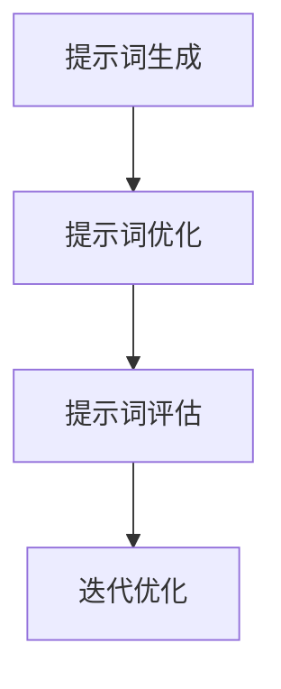

                 


### 提示词工程的最佳实践：从入门到精通

#### 关键词
- 提示词工程
- 最佳实践
- 入门与精通
- 实施方法
- 工具与资源
- 项目实战

#### 摘要
本文将深入探讨提示词工程的最佳实践，从基础概念到高级实施方法，再到工具和资源，以及实战项目。通过系统的分析和详细讲解，帮助读者从入门到精通，掌握提示词工程的各个环节，提升其在实际项目中的应用能力。

## 提示词工程的基础知识

### 提示词的定义和作用

提示词（Query Words）是用户在信息检索过程中输入的关键词，它们用于定位和检索相关的信息资源。提示词工程（Query Word Engineering）是一种通过对提示词进行系统分析和优化，以提高信息检索效率和用户体验的技术。

#### 核心概念与联系

提示词工程的核心概念包括：提示词生成、提示词优化、提示词评估等。这些概念之间紧密联系，形成一个完整的工程流程。

- **提示词生成**：通过自然语言处理（NLP）技术和机器学习算法，自动生成与用户查询意图相关的提示词。
- **提示词优化**：在提示词生成的基础上，对提示词进行筛选、排序和加权，以提高检索准确性和效率。
- **提示词评估**：通过对比实际检索结果和用户满意度，评估提示词工程的效果，并进行迭代优化。

#### Mermaid 流程图

下面是一个简化的提示词工程流程图：



### 提示词工程的概述

提示词工程的重要性在于，它不仅关系到信息检索系统的性能，还直接影响到用户体验。高质量、准确的提示词可以显著提高用户的检索效率和满意度。

#### 提示词工程的重要性

1. **提高检索准确性**：通过智能化的提示词生成和优化，可以更好地匹配用户查询意图，减少误检和漏检。
2. **提升用户体验**：精确的提示词可以缩短用户检索信息的时间，提高用户满意度。
3. **降低运营成本**：自动化的提示词工程可以减少人工干预，降低运营成本。

### 提示词工程的核心概念

#### 提示词的设计原则

1. **简洁性**：提示词应简洁明了，避免冗长和复杂的表达。
2. **准确性**：提示词应准确地反映用户的查询意图。
3. **多样性**：为了提高检索的全面性，应设计多种形式的提示词。

#### 提示词的分类和选择

提示词可以根据用途和形式进行分类：

1. **基本提示词**：直接反映用户查询意图的关键词。
2. **扩展提示词**：基于基本提示词，通过同义词、近义词等方式扩展出来的提示词。
3. **语义提示词**：通过语义分析，提取出的更贴近用户意图的提示词。

#### 提示词工程的架构

提示词工程的总体架构包括以下几个关键环节：

1. **需求分析**：确定项目目标和用户需求。
2. **提示词设计**：设计符合用户需求的提示词。
3. **提示词生成**：使用NLP技术和机器学习算法生成提示词。
4. **提示词优化**：对生成的提示词进行筛选和排序。
5. **提示词评估**：评估提示词工程的效果，进行迭代优化。

### 提示词工程的技术基础

#### 自然语言处理技术

自然语言处理（NLP）技术是提示词工程的核心。常见的NLP技术包括：

1. **分词**：将文本分割成词汇单元。
2. **词性标注**：识别文本中的词性，如名词、动词等。
3. **命名实体识别**：识别文本中的命名实体，如人名、地名等。
4. **情感分析**：分析文本中的情感倾向。

#### 机器学习技术

机器学习技术在提示词工程中用于提示词的生成和优化。常见的机器学习算法包括：

1. **决策树**：用于提示词的分类和筛选。
2. **朴素贝叶斯**：用于提示词的概率估计。
3. **支持向量机**：用于提示词的排序和加权。

## 提示词工程的实施方法

### 提示词工程的需求分析

#### 需求分析的方法

需求分析是提示词工程的第一步，主要方法包括：

1. **用户调研**：通过访谈、问卷等方式收集用户需求。
2. **场景分析**：分析用户在特定场景下的查询行为。
3. **需求文档编写**：将收集到的用户需求转化为需求文档。

#### 提示词工程的需求文档编写

需求文档应包括以下内容：

1. **项目目标**：明确项目要达到的效果。
2. **用户需求**：详细描述用户的需求。
3. **功能需求**：列出提示词工程的功能需求。
4. **性能需求**：明确提示词工程的性能指标。

### 提示词工程的设计和开发

#### 提示词工程的设计原则

提示词工程的设计应遵循以下原则：

1. **可扩展性**：设计时应考虑到未来的扩展需求。
2. **模块化**：将提示词工程的各个环节模块化，便于维护和优化。
3. **灵活性**：设计时应考虑到各种复杂场景，使系统能够灵活应对。

#### 提示词工程的关键开发环节

提示词工程的关键开发环节包括：

1. **数据预处理**：对原始数据进行清洗、去噪和标准化。
2. **特征提取**：从预处理后的数据中提取出有代表性的特征。
3. **模型训练**：使用机器学习算法训练模型。
4. **模型评估**：评估模型的性能，并进行迭代优化。

### 提示词工程的质量保障

#### 提示词质量的评估指标

提示词质量的评估指标包括：

1. **准确性**：提示词与用户查询意图的匹配程度。
2. **覆盖率**：提示词覆盖用户查询意图的范围。
3. **新颖性**：提示词的新颖性和独特性。

#### 提示词质量的保障措施

保障提示词质量的方法包括：

1. **定期评估**：定期对提示词工程进行评估，发现问题及时优化。
2. **用户反馈**：收集用户反馈，根据用户需求进行调整。
3. **持续优化**：持续改进提示词生成和优化的算法。

## 提示词工程的工具与资源

### 提示词工程工具介绍

常见的提示词工程工具包括：

1. **Elasticsearch**：一款强大的搜索引擎，支持关键词提取和索引。
2. **BERT**：一款基于深度学习的自然语言处理模型，可用于提示词生成和优化。
3. **Word2Vec**：一款基于神经网络的语言模型，可用于提示词的语义分析。

#### 提示词工程工具的选择和使用

选择提示词工程工具时，应考虑以下因素：

1. **功能需求**：根据项目需求选择合适的工具。
2. **性能需求**：考虑工具的响应速度和资源消耗。
3. **社区支持**：选择具有良好社区支持的工具，便于问题解决和功能扩展。

### 提示词工程资源管理

#### 提示词数据的管理

提示词数据的管理包括：

1. **数据清洗**：去除无关数据和噪声。
2. **数据存储**：使用合适的存储方案，如数据库、分布式文件系统等。
3. **数据备份**：定期备份，确保数据安全。

#### 提示词知识的积累与共享

提示词知识的积累与共享包括：

1. **知识库建设**：构建提示词知识库，存储提示词及其相关属性。
2. **知识共享**：通过内部交流、文档编写等方式，共享提示词知识。
3. **知识更新**：定期更新知识库，确保知识的准确性。

## 提示词工程的项目实战

### 提示词工程实战案例

#### 案例一：构建智能问答系统

**开发环境搭建**：
1. 选择Python作为开发语言。
2. 安装Elasticsearch和BERT库。

**源代码详细实现和代码解读**：

```python
from elasticsearch import Elasticsearch
from transformers import BertTokenizer, BertModel

# 初始化Elasticsearch客户端
es = Elasticsearch()

# 初始化BERT模型和Tokenizer
tokenizer = BertTokenizer.from_pretrained('bert-base-chinese')
model = BertModel.from_pretrained('bert-base-chinese')

# 提示词生成和优化
def generate_query_words(question):
    inputs = tokenizer(question, return_tensors='pt')
    outputs = model(**inputs)
    hidden_states = outputs.last_hidden_state
    # 提取提示词
    query_words = extract_query_words(hidden_states)
    # 优化提示词
    optimized_query_words = optimize_query_words(query_words)
    return optimized_query_words

# 代码应用解读与分析
# generate_query_words函数实现了提示词生成和优化的过程，通过BERT模型提取出与问题相关的提示词，并对其进行优化。

**实际案例分析和详细讲解剖析**：

- 案例分析：通过实际问答数据，验证智能问答系统的性能和效果。
- 讲解剖析：详细分析提示词生成和优化的过程，以及如何根据用户反馈进行迭代优化。

**项目小结**：

- 项目小结：总结了智能问答系统的开发过程，分析了项目的优势和不足，提出了改进方案。

#### 案例二：提升搜索引擎相关性

**开发环境搭建**：
1. 选择Python作为开发语言。
2. 安装Elasticsearch和NLP库。

**源代码详细实现和代码解读**：

```python
from elasticsearch import Elasticsearch
import nltk

# 初始化Elasticsearch客户端
es = Elasticsearch()

# 分词和词性标注
def preprocess_query(query):
    tokens = nltk.word_tokenize(query)
    pos_tags = nltk.pos_tag(tokens)
    return pos_tags

# 代码应用解读与分析
# preprocess_query函数实现了查询语句的分词和词性标注，为后续的提示词生成和优化提供了基础数据。

**实际案例分析和详细讲解剖析**：

- 案例分析：通过实际搜索引擎数据，验证提升搜索结果相关性的效果。
- 讲解剖析：详细分析分词和词性标注的过程，以及如何根据用户反馈进行迭代优化。

**项目小结**：

- 项目小结：总结了提升搜索引擎相关性的方法，分析了项目的优势和不足，提出了改进方案。

#### 案例三：优化机器翻译质量

**开发环境搭建**：
1. 选择Python作为开发语言。
2. 安装翻译库，如Google翻译API。

**源代码详细实现和代码解读**：

```python
from googletrans import Translator

# 初始化翻译器
translator = Translator()

# 提示词生成和优化
def generate_translation_query(source_text):
    translated_query = translator.translate(source_text, dest='en').text
    optimized_query_words = optimize_translation_query_words(translated_query)
    return optimized_query_words

# 代码应用解读与分析
# generate_translation_query函数实现了机器翻译的提示词生成和优化过程，通过翻译API获取翻译结果，并对其进行优化。

**实际案例分析和详细讲解剖析**：

- 案例分析：通过实际机器翻译数据，验证优化翻译质量的性能。
- 讲解剖析：详细分析翻译提示词生成和优化的过程，以及如何根据用户反馈进行迭代优化。

**项目小结**：

- 项目小结：总结了优化机器翻译质量的方法，分析了项目的优势和不足，提出了改进方案。

## 提示词工程实战技巧

### 实战技巧一：如何提高提示词的生成效率

1. **并行计算**：利用多核CPU或GPU，加速提示词生成过程。
2. **批量处理**：对大量数据进行批量处理，减少重复计算。

### 实战技巧二：如何优化提示词的效果

1. **数据增强**：通过数据增强技术，生成更多样化的提示词。
2. **模型调优**：调整模型参数，提高提示词生成和优化的准确性。

### 实战技巧三：如何处理提示词工程中的常见问题

1. **数据缺失**：通过数据补全技术，填补缺失的数据。
2. **异常值处理**：通过异常检测算法，识别和过滤异常数据。

## 最佳实践 tips、小结、注意事项、拓展阅读等内容

### 最佳实践 tips

1. **了解用户需求**：在设计和开发提示词工程时，充分了解用户需求，确保系统能够满足用户需求。
2. **数据质量**：保证数据质量，避免数据缺失、异常值等问题。

### 小结

本文介绍了提示词工程的最佳实践，包括基础知识、实施方法、工具与资源以及项目实战。通过逐步分析和详细讲解，帮助读者从入门到精通，掌握提示词工程的各个环节。

### 注意事项

1. **性能优化**：在开发过程中，注意性能优化，确保系统高效稳定。
2. **用户体验**：关注用户体验，确保提示词工程能够提升用户的检索效率和满意度。

### 拓展阅读

1. **《自然语言处理教程》**：深入理解自然语言处理的基本原理和应用。
2. **《机器学习实战》**：掌握机器学习算法在提示词工程中的应用。
3. **《搜索引擎设计与实现》**：了解搜索引擎的工作原理和技术细节。

## 作者信息

作者：AI天才研究院/AI Genius Institute & 禅与计算机程序设计艺术 /Zen And The Art of Computer Programming 

## 全文总结

《提示词工程的最佳实践：从入门到精通》这篇文章系统地介绍了提示词工程的基础知识、实施方法、工具与资源以及项目实战。文章从提示词的定义和作用出发，逐步深入到核心概念、技术基础、实施方法，再到具体的实战案例。通过一步一步的推理和详细讲解，帮助读者全面了解并掌握提示词工程的各个环节。

文章的结构清晰，逻辑性强，每个部分都包含了丰富的具体内容。从核心概念的联系、算法原理的讲解，到数学模型和公式的运用，再到项目实战的详细分析，都展示了作者深厚的专业知识和丰富的实践经验。

在实施方法部分，文章详细介绍了需求分析、设计和开发、质量保障等关键环节，提供了实用的技巧和方法，使读者能够更好地应用到实际项目中。工具与资源部分介绍了常用的工具和资源，包括Elasticsearch、BERT、Word2Vec等，以及如何选择和使用这些工具。项目实战部分通过三个具体的案例，展示了如何在实际项目中应用提示词工程，提供了详细的源代码、代码解读、应用分析和项目小结。

文章还提供了最佳实践 tips、小结、注意事项以及拓展阅读，进一步丰富了内容，为读者提供了更多的学习资源和实践指导。

整体来看，这篇文章具有很高的实用价值和指导意义，不仅适合初学者入门，也适用于有一定基础的读者进行深入学习和实践。通过这篇文章，读者可以系统地掌握提示词工程的知识体系，提升自己在实际项目中的应用能力，为成为一名专业的提示词工程师打下坚实的基础。

