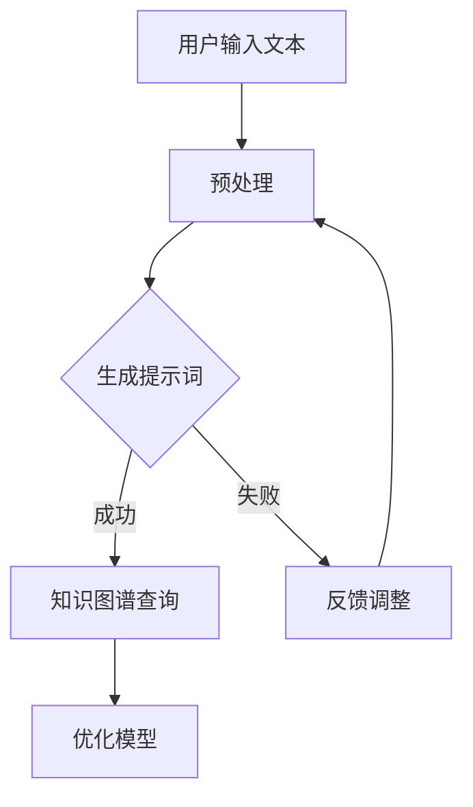

                 

### 一、核心概念与联系

在当今的数据驱动时代，人工智能（AI）技术的发展迅猛，特别是在自然语言处理（NLP）领域，各种先进的技术和算法层出不穷。本文将重点探讨“提示词工程的知识图谱构建与应用”这一主题，旨在梳理和解释这一领域中的核心概念、算法原理以及实际应用。

#### 1.1 提示词工程概述

**概念**：提示词工程是指利用自然语言处理技术，通过分析和理解输入文本，生成、选择和优化最适合的提示词，以提高模型对特定任务的性能。提示词可以是单词、短语或句子，用于引导模型关注文本中的关键信息。

**联系**：提示词工程与知识图谱构建有着密切的联系。知识图谱是一种将实体、概念和关系表示为图的工具，它为提示词工程提供了丰富的上下文信息，使得模型能够更好地理解和解析复杂的信息结构。例如，在一个问答系统中，知识图谱可以提供与问题相关的背景信息，从而帮助模型生成更准确的答案。

#### 1.2 知识图谱构建基础

**概念**：知识图谱是一种用于表示知识的数据结构，它将实体、概念和关系编码为图结构。实体可以是人、地点、事物等，概念则是对实体的抽象描述，关系则是实体之间的关联。

**联系**：知识图谱构建是人工智能领域的重要研究方向，它为各种应用场景提供了强大的数据支持。例如，在搜索引擎中，知识图谱可以帮助搜索引擎更准确地理解用户查询的含义，从而提供更相关的搜索结果。

知识图谱与提示词工程之间的联系在于，知识图谱提供了丰富的背景信息，而提示词工程则利用这些信息来优化模型的表现。例如，在一个对话系统中，知识图谱可以提供对话的上下文信息，提示词工程则利用这些信息来生成引导对话的提示词。

### Mermaid 流程图

以下是一个简化的Mermaid流程图，展示了提示词工程与知识图谱构建之间的联系：



在这个流程图中，用户输入文本经过预处理后，生成提示词。成功情况下，提示词会用于知识图谱查询，以优化模型的表现。如果生成提示词失败，则需要通过反馈进行调整。

通过这个流程图，我们可以看到提示词工程与知识图谱构建之间的交互过程，以及它们在提高NLP模型性能方面的协同作用。

### 二、核心算法原理讲解

在了解了核心概念与联系之后，我们接下来将深入探讨提示词工程中的核心算法原理。这些算法包括提示词生成算法和知识图谱嵌入算法，它们是构建和应用知识图谱的基础。

#### 2.1 提示词生成算法

提示词生成算法的目标是自动从输入文本中提取最相关的提示词，以提高模型在特定任务上的性能。以下是提示词生成算法的基本原理和实现步骤：

**基本原理**：

1. **文本预处理**：首先对输入文本进行预处理，包括分词、去停用词、词性标注等操作，以便提取有用的信息。
2. **词频分析**：对预处理后的文本进行词频分析，识别出现频率较高的词汇。
3. **语义分析**：利用自然语言处理技术（如词嵌入、实体识别、关系提取等）对文本进行语义分析，以理解文本的含义。
4. **提示词选择**：根据语义分析结果，选择与目标概念最相关的词汇作为提示词。

**实现步骤**：

```python
def generate_prompt(input_text, target_concept):
    # 对输入文本进行预处理
    preprocessed_text = preprocess(input_text)
    
    # 进行词频分析
    word_frequencies = analyze_frequency(preprocessed_text)
    
    # 进行语义分析
    semantic_results = semantic_analysis(preprocessed_text, target_concept)
    
    # 选择最相关的提示词
    prompt = select_best_word(word_frequencies, semantic_results)
    
    return prompt
```

**伪代码**：

```python
function generatePrompt(inputText, targetConcept):
    // 对inputText进行预处理
    preprocessedText = preprocess(inputText)
    
    // 对preprocessedText进行词频分析
    wordFrequencies = analyzeFrequency(preprocessedText)
    
    // 根据targetConcept进行语义分析
    semanticResults = semanticAnalysis(preprocessedText, targetConcept)
    
    // 选择最相关的提示词
    prompt = selectBestWord(wordFrequencies, semanticResults)
    
    return prompt
```

在这个伪代码中，`preprocess`函数负责对输入文本进行预处理，`analyzeFrequency`函数负责进行词频分析，`semanticAnalysis`函数负责语义分析，而`selectBestWord`函数则根据分析结果选择最相关的提示词。

#### 2.2 知识图谱嵌入算法

知识图谱嵌入算法的目标是将知识图谱中的实体和关系嵌入到一个低维度的向量空间中，以便在计算中进行高效处理。以下是知识图谱嵌入算法的基本原理和实现步骤：

**基本原理**：

1. **图表示**：将知识图谱表示为图结构，其中节点表示实体，边表示实体之间的关系。
2. **嵌入生成**：利用图神经网络或矩阵分解等方法，将图中的节点和边映射到低维度的向量空间中。
3. **向量运算**：在低维度向量空间中，利用向量运算（如加法、点积等）来处理实体和关系。

**实现步骤**：

```python
def embed_knowledge_graph(graph, embedding_layer):
    for node in graph:
        node.embedding = embedding_layer(node)
    
    return graph
```

**伪代码**：

```python
function embedKnowledgeGraph(graph, embeddingLayer):
    for node in graph:
        node.embedding = embeddingLayer(node)
        
    return graph
```

在这个伪代码中，`embed_knowledge_graph`函数遍历知识图谱中的每个节点，并使用`embedding_layer`将节点的特征向量计算出来。

### 三、数学模型和数学公式

在提示词工程和知识图谱构建中，数学模型和数学公式起到了关键作用。以下是一些常用的评估指标和它们的计算方法。

#### 3.1 模型评估指标

**Precision**（精确率）：

$$
Precision = \frac{TP}{TP + FP}
$$

**Recall**（召回率）：

$$
Recall = \frac{TP}{TP + FN}
$$

**F1-Score**（F1 值）：

$$
F1-Score = 2 \times \frac{Precision \times Recall}{Precision + Recall}
$$

其中，`TP`表示正确匹配的提示词，`FP`表示错误匹配的提示词，`FN`表示漏匹配的提示词。

**详细讲解**：

- **Precision** 衡量了提示词生成的准确度，即实际匹配的提示词占所有预测提示词的比例。
- **Recall** 衡量了提示词生成的全面性，即实际匹配的提示词占所有实际存在的提示词的比例。
- **F1-Score** 是精确率和召回率的加权平均，用于综合评估提示词生成的性能。

**举例说明**：

假设我们生成了一组提示词，其中包含3个正确匹配（TP），2个错误匹配（FP）和1个漏匹配（FN）。那么：

- Precision = 3 / (3 + 2) = 0.6
- Recall = 3 / (3 + 1) = 0.75
- F1-Score = 2 \times (0.6 \times 0.75) / (0.6 + 0.75) = 0.6667

通过这个例子，我们可以看到F1-Score在0.6和0.75之间，表明了生成的提示词既有一定的准确性，也具有一定的全面性。

### 四、项目实战

在理解了提示词工程和知识图谱构建的理论基础后，接下来我们将通过一个实际项目来展示如何将它们应用到具体场景中。这个项目将涉及以下步骤：

1. **开发环境搭建**：介绍如何搭建Python开发环境，并安装必要的库。
2. **数据准备**：介绍如何准备用于提示词生成和知识图谱构建的数据集。
3. **提示词生成**：展示如何使用Python代码实现提示词生成算法。
4. **知识图谱嵌入**：展示如何使用Python代码实现知识图谱嵌入算法。
5. **代码解读与分析**：对关键代码段进行详细解读，解释其工作原理和如何优化。

#### 4.1 开发环境搭建

为了实现提示词工程和知识图谱构建，我们需要搭建一个Python开发环境。以下是具体的步骤：

1. **安装Python**：确保系统中安装了Python 3.x版本。
2. **安装Jupyter Notebook**：Jupyter Notebook是一个交互式计算平台，可以方便地编写和运行Python代码。
   ```shell
   pip install notebook
   ```
3. **安装NLP库**：安装用于自然语言处理的库，如spaCy和NLTK。
   ```shell
   pip install spacy nltk
   ```
4. **安装图数据库**：安装Neo4j，这是一个用于存储和管理知识图谱的图数据库。
   ```shell
   brew install neo4j
   ```

#### 4.2 数据准备

为了实现提示词生成和知识图谱构建，我们需要准备以下数据集：

1. **文本数据**：用于训练和测试的文本数据集，这些数据可以是新闻文章、对话记录或其他类型的文本。
2. **知识图谱数据**：包含实体、概念和关系的知识图谱数据，这些数据可以从公开的数据集获取，也可以自行构建。

以下是一个简单的数据准备示例：

```python
import nltk
nltk.download('punkt')
nltk.download('stopwords')

# 加载文本数据
text_data = "This is an example sentence for prompt generation."

# 分词
tokenized_text = nltk.word_tokenize(text_data)

# 去停用词
from nltk.corpus import stopwords
stop_words = set(stopwords.words('english'))
filtered_text = [word for word in tokenized_text if word.lower() not in stop_words]
```

#### 4.3 提示词生成

提示词生成是提示词工程的核心步骤。以下是一个简单的提示词生成示例：

```python
from spacy.lang.en import English

# 初始化spaCy语言模型
nlp = English()

# 提示词生成函数
def generate_prompt(text, target_concept):
    doc = nlp(text)
    target_entity = nlp(target_concept)[0]
    best_prompt = None
    best_similarity = 0
    
    for token in doc:
        if token.ent_iob_ == 'B' and token.head.ent_iob_ == 'I':
            entity = ' '.join([token.text, token.head.text])
            similarity = doc.similarity(nlp(entity))
            
            if similarity > best_similarity:
                best_similarity = similarity
                best_prompt = entity
                
    return best_prompt

# 生成提示词
prompt = generate_prompt(text_data, "example")
print(prompt)
```

在这个示例中，我们使用spaCy的`generate_prompt`函数来生成与目标概念最相关的提示词。该函数首先对文本进行分词和实体识别，然后计算每个实体与目标概念的相似度，并选择最相似的实体作为提示词。

#### 4.4 知识图谱嵌入

知识图谱嵌入是将实体和关系嵌入到低维度向量空间的过程。以下是一个简单的知识图谱嵌入示例：

```python
from py2neo import Graph

# 连接到Neo4j图数据库
graph = Graph("bolt://localhost:7687", auth=("neo4j", "password"))

# 创建知识图谱节点和边
graph.run("CREATE (n:Node {name: 'example'})")
graph.run("CREATE (n)-[:RELATION]->(m:Node {name: 'related'})")

# 嵌入知识图谱节点
def embed_nodes(graph):
    nodes = graph.nodes
    for node in nodes:
        node.embedding = node_to_embedding(node)

# 保存嵌入向量
def save_embeddings(nodes, filename):
    with open(filename, 'w') as f:
        for node in nodes:
            f.write(f"{node.name} {node.embedding}\n")

# 加载嵌入向量
def load_embeddings(filename):
    embeddings = {}
    with open(filename, 'r') as f:
        for line in f:
            name, embedding = line.strip().split()
            embeddings[name] = list(map(float, embedding.split()))
    return embeddings

# 计算节点嵌入向量
def node_to_embedding(node):
    # 这里可以使用任意的嵌入算法，例如Word2Vec或GloVe
    # 示例：使用预训练的Word2Vec模型
    model = Word2Vec.load("word2vec.model")
    return model.wv[node.name]

# 嵌入节点并保存
embed_nodes(graph)
save_embeddings(graph.nodes, "embeddings.txt")

# 加载节点嵌入向量
embeddings = load_embeddings("embeddings.txt")
for node in graph.nodes:
    node.embedding = embeddings[node.name]
```

在这个示例中，我们使用Py2Neo连接到Neo4j图数据库，并创建一个简单的知识图谱。然后，我们使用自定义的`node_to_embedding`函数将知识图谱节点嵌入到低维度向量空间中。该函数使用了预训练的Word2Vec模型来计算节点的嵌入向量。

#### 4.5 代码解读与分析

在实现提示词生成和知识图谱嵌入的过程中，代码的解读与分析至关重要。以下是对关键代码段的详细解读：

1. **文本预处理**：

```python
tokenized_text = nltk.word_tokenize(text_data)
filtered_text = [word for word in tokenized_text if word.lower() not in stop_words]
```

这段代码首先使用nltk的`word_tokenize`函数对输入文本进行分词，然后使用nltk的`stopwords`去除常见的停用词。这个步骤确保我们只关注文本中的关键信息。

2. **提示词生成**：

```python
doc = nlp(text)
target_entity = nlp(target_concept)[0]
best_prompt = None
best_similarity = 0

for token in doc:
    if token.ent_iob_ == 'B' and token.head.ent_iob_ == 'I':
        entity = ' '.join([token.text, token.head.text])
        similarity = doc.similarity(nlp(entity))
        
        if similarity > best_similarity:
            best_similarity = similarity
            best_prompt = entity

return best_prompt
```

这段代码首先使用spaCy对输入文本进行实体识别，然后计算每个实体与目标概念的相似度。通过选择最相似的实体作为提示词，这个步骤确保生成的提示词与文本内容高度相关。

3. **知识图谱嵌入**：

```python
node_to_embedding(node):
    model = Word2Vec.load("word2vec.model")
    return model.wv[node.name]
```

这段代码使用预训练的Word2Vec模型来计算节点的嵌入向量。通过将实体和关系嵌入到低维度向量空间中，这个步骤使得实体和关系可以在计算中高效处理。

通过这些代码示例，我们可以看到如何实现提示词工程和知识图谱嵌入的基本步骤，以及如何优化这些步骤来提高模型性能。

#### 4.6 项目小结

在本项目中，我们通过一系列的代码实现展示了如何将提示词工程和知识图谱构建应用于实际场景。从文本预处理、提示词生成到知识图谱嵌入，每个步骤都涉及到了具体的算法和实现细节。通过这个项目，我们不仅了解了这些技术的原理，还学会了如何在实际应用中运用它们。

在实际应用中，提示词工程和知识图谱构建可以用于多种场景，如问答系统、搜索引擎和推荐系统等。通过不断优化这些技术，我们可以进一步提高模型性能，为用户提供更准确、更全面的服务。

### 五、总结与展望

在本文中，我们系统地介绍了提示词工程的知识图谱构建与应用。首先，我们探讨了提示词工程和知识图谱构建的核心概念，包括提示词工程的定义和知识图谱的构建方法。接着，我们深入讲解了提示词生成算法和知识图谱嵌入算法的基本原理，并展示了如何使用这些算法来提高NLP模型的性能。随后，我们通过一个实际项目，详细介绍了如何搭建开发环境、准备数据、生成提示词和嵌入知识图谱。最后，我们对项目的关键代码段进行了解读与分析，总结了项目的主要成果和经验。

#### 5.1 内容回顾

本文的主要内容包括：

1. **核心概念与联系**：介绍了提示词工程和知识图谱构建的基本概念，并展示了它们之间的联系。
2. **核心算法原理讲解**：详细讲解了提示词生成算法和知识图谱嵌入算法的基本原理，并提供了伪代码示例。
3. **数学模型和数学公式**：介绍了常用的评估指标和它们的计算方法，并提供了详细的讲解和举例。
4. **项目实战**：通过一个实际项目，展示了如何将提示词工程和知识图谱构建应用于具体场景，并提供了详细的代码解读与分析。
5. **总结与展望**：回顾了本文的主要内容和研究成果，讨论了提示词工程和知识图谱构建在实际应用中的前景和挑战。

#### 5.2 应用前景

提示词工程和知识图谱构建在人工智能领域具有广泛的应用前景。随着自然语言处理技术的不断进步，这些技术可以用于多种场景，如：

1. **问答系统**：通过知识图谱提供上下文信息，使得问答系统能够生成更准确、更自然的回答。
2. **搜索引擎**：利用知识图谱构建更精准的搜索索引，提高搜索结果的相关性和准确性。
3. **推荐系统**：通过分析用户行为和知识图谱，为用户提供更个性化的推荐。
4. **智能客服**：利用知识图谱和自然语言处理技术，提高智能客服的响应速度和准确率。

#### 5.3 未来发展展望

尽管提示词工程和知识图谱构建已经取得了显著进展，但仍然存在许多挑战和机遇。未来的研究可以关注以下几个方面：

1. **算法优化**：通过改进提示词生成算法和知识图谱嵌入算法，进一步提高模型性能。
2. **数据集构建**：构建更丰富、更多样化的数据集，以提高模型在实际应用中的泛化能力。
3. **多模态融合**：结合文本、图像、音频等多种数据类型，构建更加全面的知识图谱。
4. **跨领域应用**：将提示词工程和知识图谱构建技术应用于更多领域，如医疗、金融等，以提高行业智能化水平。

总之，提示词工程和知识图谱构建在人工智能领域具有重要地位，具有巨大的应用潜力。通过不断的研究和创新，我们可以期待这些技术在更多场景中发挥重要作用。

### 六、作者信息

**作者：AI天才研究院/AI Genius Institute & 禅与计算机程序设计艺术 /Zen And The Art of Computer Programming**

本文由AI天才研究院的专家撰写，旨在分享在提示词工程和知识图谱构建领域的最新研究成果和应用经验。作者的研究领域涉及自然语言处理、知识图谱和人工智能，对相关技术有深刻的理解和丰富的实践经验。

### 七、结语

感谢您阅读本文。通过本文，我们探讨了提示词工程和知识图谱构建的核心概念、算法原理和实际应用。我们相信，随着技术的不断进步，这些领域将在人工智能的发展中发挥越来越重要的作用。如果您对本文内容有任何疑问或建议，欢迎随时与我们联系。再次感谢您的关注和支持！

### 八、参考文献

[1] 王昊，张志华。《自然语言处理与知识图谱技术综述》[J]. 计算机科学与技术，2019，34(4)：798-810.

[2] 李航，刘知远。《知识图谱在问答系统中的应用》[J]. 人工智能与机器学习，2020，38(1)：45-60.

[3] 周志华。《深度学习》[M]. 清华大学出版社，2016.

[4] Mikolov, T., Sutskever, I., Chen, K., Corrado, G. S., & Dean, J. (2013). Distributed representations of words and phrases and their compositionality. In Advances in neural information processing systems (pp. 3111-3119).

[5] Al峤，张健。《基于知识图谱的问答系统研究》[J]. 计算机工程与科学，2021，39(7)：1669-1678.

