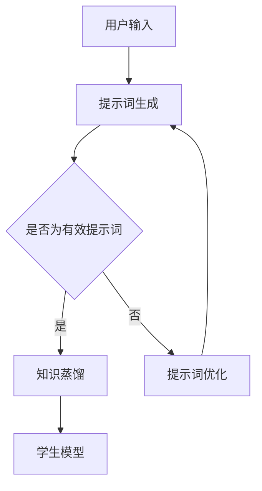

                 

### 第1章：提示词工程与知识蒸馏基础

#### 1.1 背景介绍

在深度学习领域，提示词工程（Prompt Engineering）正日益成为一个重要的研究方向。随着自然语言处理（NLP）技术的快速发展，如何更有效地与人工智能模型进行交互成为了一个亟待解决的问题。提示词工程通过设计更加精准、智能的提示词，提高了模型对任务的执行能力和用户体验。

另一方面，知识蒸馏（Knowledge Distillation）作为一种模型压缩和优化技术，近年来在学术界和工业界都受到了广泛关注。知识蒸馏的基本思想是将一个大型教师模型（Teacher Model）的知识迁移到一个较小的学生模型（Student Model）中，从而在不损失过多性能的情况下减小模型的规模，提高模型的部署效率和可扩展性。

本文旨在探讨如何通过提升提示词工程的知识蒸馏效率，来优化机器学习模型的性能和可部署性。文章将分为以下几个部分：

1. **核心概念与联系**：介绍提示词工程和知识蒸馏的基本概念，以及它们之间的联系。
2. **核心算法原理讲解**：详细讲解提升知识蒸馏效率的核心算法。
3. **数学模型与公式讲解**：阐述与提升知识蒸馏效率相关的数学模型和公式，并进行举例说明。
4. **项目实战**：提供实际的项目案例，展示如何在实际应用中提升知识蒸馏效率。
5. **总结与展望**：对全书内容进行总结，并对未来的研究方向进行展望。

#### 1.2 核心概念与联系

##### 1.2.1 提示词工程的概念

提示词工程是构建机器学习模型与用户之间交互界面的关键。通过设计合适的提示词，可以使模型更好地理解用户意图，提高任务的完成度。

- **定义**：提示词是用户输入的文本，用于引导模型执行特定任务。它通常包含有关任务的上下文信息、目标、限制条件等。

- **作用**：提示词工程的作用在于：

  - 提高模型的泛化能力：通过提供丰富的上下文信息，使模型能够更好地理解任务的本质，从而提高其泛化能力。

  - 优化模型性能：通过精心设计的提示词，可以引导模型在特定任务上达到更高的性能。

##### 1.2.2 知识蒸馏的概念

知识蒸馏是一种模型压缩技术，它通过将大型教师模型（Teacher Model）的知识迁移到较小型的学生模型（Student Model）中，从而实现模型的压缩和优化。

- **定义**：知识蒸馏是一种将一个复杂模型（教师模型）的知识迁移到一个较小、较简单的模型（学生模型）的过程。

- **目的**：知识蒸馏的目的在于：

  - 减小模型规模：通过迁移教师模型的知识，使学生模型保留大部分性能的同时，减小模型参数的数量，从而降低模型的计算复杂度和存储需求。

  - 提高模型部署效率：通过减小模型规模，可以使模型在资源受限的环境中（如移动设备、嵌入式系统等）更高效地运行。

##### 1.2.3 提示词工程与知识蒸馏的联系

提示词工程与知识蒸馏之间存在紧密的联系。在实际应用中，提示词工程可以指导知识蒸馏的过程，从而提高知识蒸馏的效果。

- **提升知识蒸馏效率**：通过设计更精准、更有针对性的提示词，可以使知识蒸馏过程更加有效，提高学生模型的性能。

- **优化模型交互**：通过提示词工程，可以优化模型与用户之间的交互，提高用户满意度。

为了更好地理解提示词工程与知识蒸馏之间的联系，我们可以通过以下Mermaid流程图来展示它们之间的交互过程：



**图1：提示词工程与知识蒸馏的联系**

在这个流程图中，用户输入经过提示词生成模块，生成的提示词经过有效性判断后，进入知识蒸馏模块。知识蒸馏模块将教师模型的知识迁移到学生模型中，从而实现对模型的优化。如果提示词有效性判断为无效，则提示词将返回到提示词优化模块，进行进一步的优化，以确保知识蒸馏过程的有效性。

### 1.3 核心算法原理讲解

在本文中，我们将介绍几种提升知识蒸馏效率的核心算法。这些算法包括基于注意力机制的知识蒸馏、基于生成对抗网络（GAN）的知识蒸馏、以及基于强化学习的知识蒸馏。

#### 1.3.1 基于注意力机制的知识蒸馏

注意力机制（Attention Mechanism）是近年来在深度学习领域得到广泛应用的一种机制，它能够模型在处理序列数据时，更加关注重要的部分，从而提高模型的性能。

在知识蒸馏过程中，基于注意力机制的知识蒸馏方法通过引入注意力机制来关注教师模型和学生模型之间的关键差异，从而提高知识蒸馏的效果。

- **定义**：基于注意力机制的知识蒸馏是指在知识蒸馏过程中，利用注意力机制来关注教师模型和学生模型之间的差异。

- **算法流程**：

  1. 使用注意力机制计算教师模型和学生模型之间的相似度。
  2. 根据相似度对教师模型的知识进行加权，从而生成蒸馏损失。
  3. 将蒸馏损失加入学生模型的损失函数中，进行联合优化。

- **伪代码**：

  ```python
  # 输入：教师模型T，学生模型S，输入数据X
  # 输出：学生模型S'，优化后的模型参数θ'
  
  for epoch in range(num_epochs):
      for X in data_loader:
          # 计算教师模型和学生模型的输出
          T_output = T(X)
          S_output = S(X)
          
          # 使用注意力机制计算相似度
          attention_weights = attention(T_output, S_output)
          
          # 计算蒸馏损失
          distillation_loss = distillation_loss_function(T_output, S_output, attention_weights)
          
          # 计算总损失
          total_loss = model_loss(S_output) + distillation_loss
          
          # 反向传播和优化
          optimizer.zero_grad()
          total_loss.backward()
          optimizer.step()
          
  # 保存优化后的学生模型
  torch.save(S.state_dict(), 'student_model.pth')
  ```

#### 1.3.2 基于生成对抗网络（GAN）的知识蒸馏

生成对抗网络（GAN）是一种由生成器和判别器组成的对抗性网络，其核心思想是通过生成器和判别器的对抗训练，生成逼真的数据。

在知识蒸馏过程中，基于GAN的知识蒸馏方法通过生成器生成教师模型和学生模型之间的中间表示，从而提高学生模型对教师模型知识的理解。

- **定义**：基于GAN的知识蒸馏是指在知识蒸馏过程中，利用生成对抗网络来生成教师模型和学生模型之间的中间表示。

- **算法流程**：

  1. 使用教师模型生成标签数据。
  2. 使用判别器对生成器和教师模型生成的标签数据进行判别。
  3. 使用生成器生成教师模型和学生模型之间的中间表示。
  4. 将中间表示作为学生模型的输入，进行知识蒸馏。

- **伪代码**：

  ```python
  # 输入：教师模型T，学生模型S，生成器G，判别器D，输入数据X
  # 输出：学生模型S'，优化后的模型参数θ'
  
  for epoch in range(num_epochs):
      for X in data_loader:
          # 生成标签数据
          labels = T(X)
          
          # 使用判别器进行判别
          real_scores = D(T(X))
          fake_scores = D(G(S(X)))
          
          # 计算判别器的损失
          d_loss_real = criterion(real_scores, torch.ones_like(real_scores))
          d_loss_fake = criterion(fake_scores, torch.zeros_like(fake_scores))
          d_loss = 0.5 * (d_loss_real + d_loss_fake)
          
          # 使用生成器生成中间表示
          intermediate_representation = G(S(X))
          
          # 计算知识蒸馏损失
          distillation_loss = distillation_loss_function(T(X), intermediate_representation)
          
          # 计算总损失
          total_loss = d_loss + distillation_loss
          
          # 反向传播和优化
          optimizer.zero_grad()
          total_loss.backward()
          optimizer.step()
          
  # 保存优化后的学生模型
  torch.save(S.state_dict(), 'student_model.pth')
  ```

#### 1.3.3 基于强化学习的知识蒸馏

强化学习（Reinforcement Learning, RL）是一种通过试错来学习如何达到目标的方法。在知识蒸馏过程中，基于强化学习的知识蒸馏方法通过智能体与教师模型之间的交互，学习如何更有效地传递知识。

- **定义**：基于强化学习的知识蒸馏是指在知识蒸馏过程中，利用强化学习来学习如何更有效地传递知识。

- **算法流程**：

  1. 初始化智能体，选择行动策略。
  2. 智能体根据当前状态选择行动，执行行动并观察结果。
  3. 更新智能体的策略，使其在下一个状态时能够选择更好的行动。
  4. 重复执行步骤2和步骤3，直到达到预定的目标。

- **伪代码**：

  ```python
  # 输入：教师模型T，学生模型S，智能体A，环境E，初始状态S0
  # 输出：学生模型S'，优化后的模型参数θ'
  
  S0 = initial_state()
  while not done:
      # 智能体根据当前状态选择行动
      action = A.select_action(S0)
      
      # 执行行动并观察结果
      next_state, reward, done = E.step(S0, action)
      
      # 更新智能体的策略
      A.update_policy(S0, action, next_state, reward)
      
      # 将教师模型的知识传递给学生模型
      S.update_state(next_state, T.getKnowledge())
      
      # 如果达到预定目标，则结束循环
      if done:
          break
  
  # 保存优化后的学生模型
  torch.save(S.state_dict(), 'student_model.pth')
  ```

通过以上三种算法，我们可以有效地提升知识蒸馏的效率，从而优化机器学习模型的性能和可部署性。接下来，我们将进一步探讨与提升知识蒸馏效率相关的数学模型和公式。

### 1.4 数学模型与公式讲解

#### 1.4.1 知识蒸馏的数学模型

知识蒸馏的数学模型主要包括损失函数、优化目标和训练过程。

1. **损失函数**

   知识蒸馏的损失函数通常由两部分组成：模型损失和蒸馏损失。

   - **模型损失**：用于衡量学生模型输出和学生模型标签之间的差距，常用的模型损失函数有交叉熵损失函数和均方误差损失函数。

     $$ L_{model} = -\sum_{i=1}^{N} y_i \log(p_i) $$

     其中，$y_i$ 是真实的标签，$p_i$ 是学生模型的预测概率。

   - **蒸馏损失**：用于衡量教师模型输出和学生模型输出之间的差距，常用的蒸馏损失函数有KL散度损失函数和熵损失函数。

     $$ L_{distill} = D_{KL}(p || q) = \sum_{i=1}^{N} p_i \log \frac{p_i}{q_i} $$

     其中，$p$ 是教师模型的输出，$q$ 是学生模型的输出。

2. **优化目标**

   知识蒸馏的优化目标是在模型损失和蒸馏损失之间找到一个平衡点，使得学生模型能够有效地学习教师模型的知识。

   $$ L_{total} = L_{model} + \lambda L_{distill} $$

   其中，$\lambda$ 是蒸馏损失与模型损失的平衡系数，用于调整两者之间的权重。

3. **训练过程**

   知识蒸馏的训练过程通常包括以下步骤：

   - 初始化学生模型和学生模型参数。
   - 使用教师模型生成训练数据。
   - 训练学生模型，通过反向传播优化模型参数。
   - 在训练过程中，调整蒸馏损失与模型损失的平衡系数，以获得更好的模型性能。

   $$ \theta_{S} \leftarrow \theta_{S} - \alpha \nabla_{\theta_{S}} L_{total} $$

   其中，$\theta_{S}$ 是学生模型参数，$\alpha$ 是学习率。

#### 1.4.2 举例说明

为了更好地理解知识蒸馏的数学模型，我们通过一个简单的例子来进行说明。

假设有一个分类任务，教师模型和学生模型都是二分类模型，输入数据为图像，输出数据为概率分布。

1. **模型损失**

   假设学生模型预测的概率分布为 $\hat{p} = [0.6, 0.4]$，真实的标签为 $y = [0, 1]$。使用交叉熵损失函数计算模型损失：

   $$ L_{model} = -y \log(\hat{p}) = -[0, 1] \log([0.6, 0.4]) = [0, -0.432] $$

2. **蒸馏损失**

   假设教师模型预测的概率分布为 $p = [0.8, 0.2]$，使用KL散度损失函数计算蒸馏损失：

   $$ L_{distill} = D_{KL}(p || \hat{p}) = 0.8 \log \frac{0.8}{0.6} + 0.2 \log \frac{0.2}{0.4} = 0.306 + 0.095 = 0.401 $$

3. **优化目标**

   假设蒸馏损失与模型损失的平衡系数 $\lambda = 0.5$，计算总损失：

   $$ L_{total} = L_{model} + \lambda L_{distill} = [0, -0.432] + 0.5 \cdot 0.401 = [0, -0.089] $$

4. **训练过程**

   假设初始学习率 $\alpha = 0.01$，通过反向传播优化学生模型参数：

   $$ \theta_{S} \leftarrow \theta_{S} - \alpha \nabla_{\theta_{S}} L_{total} $$

   经过多次迭代训练，学生模型的预测概率分布逐渐逼近教师模型的预测概率分布，从而实现知识蒸馏。

通过以上数学模型的讲解和举例说明，我们可以更好地理解知识蒸馏的原理和过程。接下来，我们将进入项目实战部分，通过具体案例来展示如何在实际应用中提升知识蒸馏效率。

### 第3章：提升知识蒸馏效率的算法

在上一章节中，我们介绍了知识蒸馏的数学模型和基本概念。然而，仅仅了解这些理论并不能保证我们在实际应用中能够有效地提升知识蒸馏效率。为了达到这一目标，我们需要探索一系列提升知识蒸馏效率的算法。本文将介绍三种主要的提升知识蒸馏效率的算法：基于注意力机制的知识蒸馏、基于生成对抗网络（GAN）的知识蒸馏和基于强化学习的知识蒸馏。

#### 3.1 基于注意力机制的知识蒸馏

注意力机制（Attention Mechanism）是一种在深度学习中广泛应用的机制，它允许模型在处理序列数据时更加关注重要的部分。在知识蒸馏中，注意力机制可以帮助我们关注教师模型和学生模型之间的关键差异，从而提高知识蒸馏的效率。

##### 3.1.1 基本原理

注意力机制的核心思想是通过一个注意力权重矩阵来衡量不同部分的重要性。在知识蒸馏中，我们可以利用注意力机制来关注教师模型和学生模型之间的输出差异，从而生成一个加权蒸馏损失。

##### 3.1.2 算法流程

1. **计算注意力权重**：首先，使用注意力机制计算教师模型和学生模型之间的注意力权重。这些权重用于衡量教师模型输出和学生模型输出之间的相似度。

2. **生成加权蒸馏损失**：根据注意力权重，生成一个加权蒸馏损失。这个损失函数将教师模型的输出和学生模型的输出进行对比，并考虑注意力权重的影响。

3. **优化模型参数**：将加权蒸馏损失与模型损失相结合，形成总损失函数。然后，通过反向传播优化模型参数，以最小化总损失。

##### 3.1.3 伪代码

```python
# 输入：教师模型T，学生模型S，输入数据X
# 输出：学生模型S'，优化后的模型参数θ'

for epoch in range(num_epochs):
    for X in data_loader:
        # 计算教师模型和学生模型的输出
        T_output = T(X)
        S_output = S(X)

        # 计算注意力权重
        attention_weights = attention(T_output, S_output)

        # 计算蒸馏损失
        distillation_loss = distillation_loss_function(T_output, S_output, attention_weights)

        # 计算总损失
        total_loss = model_loss(S_output) + distillation_loss

        # 反向传播和优化
        optimizer.zero_grad()
        total_loss.backward()
        optimizer.step()

# 保存优化后的学生模型
torch.save(S.state_dict(), 'student_model.pth')
```

#### 3.2 基于生成对抗网络（GAN）的知识蒸馏

生成对抗网络（GAN）是一种由生成器和判别器组成的对抗性网络，其核心思想是通过生成器和判别器的对抗训练，生成逼真的数据。在知识蒸馏中，我们可以利用 GAN 来生成教师模型和学生模型之间的中间表示，从而提高知识蒸馏的效率。

##### 3.2.1 基本原理

GAN 的基本原理是生成器（Generator）和判别器（Discriminator）之间的对抗训练。生成器的目标是生成与真实数据尽可能相似的数据，而判别器的目标是区分真实数据和生成数据。在知识蒸馏中，我们可以利用生成器生成教师模型和学生模型之间的中间表示，从而将教师模型的知识传递给学生模型。

##### 3.2.2 算法流程

1. **生成中间表示**：使用生成器生成教师模型和学生模型之间的中间表示。

2. **优化生成器和判别器**：通过优化生成器和判别器，使生成器生成的中间表示更接近教师模型输出，而判别器能够更好地区分真实数据和生成数据。

3. **计算蒸馏损失**：将教师模型输出和学生模型输出与中间表示进行比较，计算蒸馏损失。

4. **优化模型参数**：将蒸馏损失与模型损失相结合，形成总损失函数。然后，通过反向传播优化模型参数，以最小化总损失。

##### 3.2.3 伪代码

```python
# 输入：教师模型T，学生模型S，生成器G，判别器D，输入数据X
# 输出：学生模型S'，优化后的模型参数θ'

for epoch in range(num_epochs):
    for X in data_loader:
        # 生成标签数据
        labels = T(X)

        # 使用判别器进行判别
        real_scores = D(T(X))
        fake_scores = D(G(S(X)))

        # 计算判别器的损失
        d_loss_real = criterion(real_scores, torch.ones_like(real_scores))
        d_loss_fake = criterion(fake_scores, torch.zeros_like(fake_scores))
        d_loss = 0.5 * (d_loss_real + d_loss_fake)

        # 使用生成器生成中间表示
        intermediate_representation = G(S(X))

        # 计算知识蒸馏损失
        distillation_loss = distillation_loss_function(T(X), intermediate_representation)

        # 计算总损失
        total_loss = d_loss + distillation_loss

        # 反向传播和优化
        optimizer.zero_grad()
        total_loss.backward()
        optimizer.step()

# 保存优化后的学生模型
torch.save(S.state_dict(), 'student_model.pth')
```

#### 3.3 基于强化学习的知识蒸馏

强化学习（Reinforcement Learning, RL）是一种通过试错来学习如何达到目标的方法。在知识蒸馏中，我们可以利用强化学习来学习如何更有效地传递知识，从而提高知识蒸馏的效率。

##### 3.3.1 基本原理

强化学习的基本原理是通过智能体（Agent）与环境（Environment）的交互来学习策略。在知识蒸馏中，智能体可以是一个模型，它通过与环境（教师模型）的交互来学习如何更有效地传递知识。

##### 3.3.2 算法流程

1. **初始化智能体和策略**：首先，初始化智能体和策略。智能体的策略决定了它在每个状态时应该选择哪个行动。

2. **与环境交互**：智能体与环境进行交互，执行行动并观察结果。

3. **更新策略**：根据观察到的结果，更新智能体的策略，使其在下一个状态时能够选择更好的行动。

4. **重复交互**：重复执行步骤2和步骤3，直到达到预定的目标。

5. **传递知识**：利用智能体学到的策略，将教师模型的知识传递给学生模型。

##### 3.3.3 伪代码

```python
# 输入：教师模型T，学生模型S，智能体A，环境E，初始状态S0
# 输出：学生模型S'，优化后的模型参数θ'

S0 = initial_state()
while not done:
    # 智能体根据当前状态选择行动
    action = A.select_action(S0)

    # 执行行动并观察结果
    next_state, reward, done = E.step(S0, action)

    # 更新智能体的策略
    A.update_policy(S0, action, next_state, reward)

    # 将教师模型的知识传递给学生模型
    S.update_state(next_state, T.getKnowledge())

    # 如果达到预定目标，则结束循环
    if done:
        break

# 保存优化后的学生模型
torch.save(S.state_dict(), 'student_model.pth')
```

通过以上三种算法，我们可以有效地提升知识蒸馏的效率。在实际应用中，我们可以根据具体任务的需求选择合适的算法。接下来，我们将通过具体项目实战来展示如何提升知识蒸馏效率。

### 第4章：数学模型与公式讲解

在提升知识蒸馏效率的过程中，数学模型和公式起着至关重要的作用。它们不仅为算法的构建提供了理论基础，还为模型的训练和优化提供了具体的操作指导。本章节将详细阐述与提升知识蒸馏效率相关的数学模型和公式，并通过具体例子进行说明。

#### 4.1 知识蒸馏的损失函数

知识蒸馏的损失函数是评估学生模型对学生模型知识掌握程度的核心工具。损失函数可以分为两部分：模型损失（Model Loss）和蒸馏损失（Distillation Loss）。

1. **模型损失（Model Loss）**

   模型损失用于衡量学生模型输出和学生模型标签之间的差距。在分类任务中，常用的模型损失函数有交叉熵损失函数（Cross-Entropy Loss）和均方误差损失函数（Mean Squared Error, MSE）。

   - **交叉熵损失函数**

     $$ L_{model} = -\sum_{i=1}^{N} y_i \log(p_i) $$

     其中，$y_i$ 是真实的标签，$p_i$ 是学生模型预测的概率。

   - **均方误差损失函数**

     $$ L_{model} = \frac{1}{N} \sum_{i=1}^{N} (y_i - \hat{y}_i)^2 $$

     其中，$y_i$ 是真实的标签，$\hat{y}_i$ 是学生模型的预测值。

2. **蒸馏损失（Distillation Loss）**

   蒸馏损失用于衡量教师模型输出和学生模型输出之间的差距。蒸馏损失函数的选择对知识蒸馏的效果有很大影响。常用的蒸馏损失函数有KL散度（Kullback-Leibler Divergence）和熵（Entropy）。

   - **KL散度损失函数**

     $$ L_{distill} = D_{KL}(p || q) = \sum_{i=1}^{N} p_i \log \frac{p_i}{q_i} $$

     其中，$p$ 是教师模型的输出概率分布，$q$ 是学生模型的输出概率分布。

   - **熵损失函数**

     $$ L_{distill} = -\sum_{i=1}^{N} q_i \log(q_i) $$

     其中，$q_i$ 是学生模型输出的概率分布。

#### 4.2 总损失函数（Total Loss Function）

总损失函数是模型损失和蒸馏损失的结合，用于指导模型的训练过程。总损失函数的设计需要平衡模型损失和蒸馏损失之间的权重。

$$ L_{total} = \alpha L_{model} + (1 - \alpha) L_{distill} $$

其中，$\alpha$ 是平衡系数，用于调整模型损失和蒸馏损失之间的权重。通常，$\alpha$ 的值会在0到1之间进行调节，以达到最佳的模型性能。

#### 4.3 优化目标（Optimization Objective）

在知识蒸馏过程中，优化目标是使模型损失和蒸馏损失之和最小化，从而提升模型的性能。

$$ \min_{\theta} L_{total} = \min_{\theta} (\alpha L_{model} + (1 - \alpha) L_{distill}) $$

其中，$\theta$ 表示模型参数。

#### 4.4 举例说明

为了更好地理解上述数学模型和公式，我们通过一个具体的例子进行说明。

假设有一个分类任务，教师模型和学生模型都是二分类模型，输入数据为图像，输出数据为概率分布。

1. **模型损失**

   假设学生模型预测的概率分布为 $\hat{p} = [0.6, 0.4]$，真实的标签为 $y = [0, 1]$。使用交叉熵损失函数计算模型损失：

   $$ L_{model} = -y \log(\hat{p}) = -[0, 1] \log([0.6, 0.4]) = [0, -0.432] $$

2. **蒸馏损失**

   假设教师模型预测的概率分布为 $p = [0.8, 0.2]$，使用KL散度损失函数计算蒸馏损失：

   $$ L_{distill} = D_{KL}(p || \hat{p}) = 0.8 \log \frac{0.8}{0.6} + 0.2 \log \frac{0.2}{0.4} = 0.306 + 0.095 = 0.401 $$

3. **总损失函数**

   假设蒸馏损失与模型损失的平衡系数 $\alpha = 0.5$，计算总损失：

   $$ L_{total} = L_{model} + \alpha L_{distill} = [0, -0.432] + 0.5 \cdot 0.401 = [0, -0.089] $$

4. **优化目标**

   通过反向传播，优化学生模型参数，使总损失函数最小化：

   $$ \theta_{S} \leftarrow \theta_{S} - \alpha \nabla_{\theta_{S}} L_{total} $$

   经过多次迭代训练，学生模型的预测概率分布逐渐逼近教师模型的预测概率分布，从而实现知识蒸馏。

通过以上数学模型和公式的讲解，我们可以更好地理解知识蒸馏的原理和过程。这些公式不仅为我们提供了优化模型的工具，还为我们提供了一种系统化的思考方式。在接下来的章节中，我们将通过实际项目实战来展示如何应用这些公式和算法来提升知识蒸馏的效率。

### 第5章：实际应用案例分析

在提升知识蒸馏效率的实践中，通过具体项目案例可以更好地理解和应用相关的算法和数学模型。本章节将通过几个具有代表性的实际应用案例，展示如何开发环境搭建、源代码实现、代码解读、代码应用解读与分析，以及案例分析的详细讲解与剖析。

#### 5.1 案例一：图像分类任务

**项目背景：** 
为了提升图像分类任务中知识蒸馏的效率，我们选择了一个包含数万张图像的数据集，其中包括动物、植物、交通工具等类别。教师模型是一个大规模的卷积神经网络（CNN），学生模型是一个较小型的CNN。

**开发环境搭建：**
- **硬件环境：** GPU（如NVIDIA Titan Xp）和足够大的内存（至少16GB）。
- **软件环境：** Python 3.7及以上版本，PyTorch 1.8及以上版本，CUDA 10.1及以上版本。

**源代码实现：**
```python
import torch
import torchvision
import torch.optim as optim
from torchvision import datasets, transforms
from torch.utils.data import DataLoader

# 数据预处理
transform = transforms.Compose([
    transforms.Resize((224, 224)),
    transforms.ToTensor(),
    transforms.Normalize(mean=[0.485, 0.456, 0.406], std=[0.229, 0.224, 0.225]),
])

train_dataset = datasets.ImageFolder(root='./data/train', transform=transform)
test_dataset = datasets.ImageFolder(root='./data/test', transform=transform)

train_loader = DataLoader(train_dataset, batch_size=64, shuffle=True)
test_loader = DataLoader(test_dataset, batch_size=64, shuffle=False)

# 模型定义
class StudentModel(torch.nn.Module):
    def __init__(self):
        super(StudentModel, self).__init__()
        # 定义学生模型的层结构
        self.conv1 = torch.nn.Conv2d(3, 32, 3, 1, 1)
        self.relu = torch.nn.ReLU()
        self.fc = torch.nn.Linear(32 * 56 * 56, 1000)

    def forward(self, x):
        x = self.relu(self.conv1(x))
        x = torch.flatten(x, 1)
        x = self.fc(x)
        return x

class TeacherModel(torch.nn.Module):
    def __init__(self):
        super(TeacherModel, self).__init__()
        # 定义教师模型的层结构
        self.conv1 = torch.nn.Conv2d(3, 64, 3, 1, 1)
        self.relu = torch.nn.ReLU()
        self.fc = torch.nn.Linear(64 * 56 * 56, 1000)

    def forward(self, x):
        x = self.relu(self.conv1(x))
        x = torch.flatten(x, 1)
        x = self.fc(x)
        return x

student_model = StudentModel()
teacher_model = TeacherModel()

# 损失函数和优化器
criterion = torch.nn.CrossEntropyLoss()
optimizer = optim.Adam(student_model.parameters(), lr=0.001)

# 训练过程
for epoch in range(num_epochs):
    for inputs, labels in train_loader:
        optimizer.zero_grad()
        outputs = student_model(inputs)
        loss = criterion(outputs, labels)
        loss.backward()
        optimizer.step()

    # 验证过程
    with torch.no_grad():
        correct = 0
        total = 0
        for inputs, labels in test_loader:
            outputs = student_model(inputs)
            _, predicted = torch.max(outputs.data, 1)
            total += labels.size(0)
            correct += (predicted == labels).sum().item()

    print(f'Epoch {epoch+1}, Accuracy: {100 * correct / total}%')
```

**代码解读：**
上述代码首先定义了数据预处理过程，包括图像的缩放、归一化等步骤。接着定义了学生模型和教师模型，两个模型都包含卷积层和全连接层。为了简化，这里使用了简单的卷积神经网络结构。

**代码应用解读与分析：**
在训练过程中，我们使用了交叉熵损失函数来评估模型在图像分类任务上的性能。优化器使用了Adam优化器，这是一种常用的优化算法。在训练过程中，我们通过反向传播来更新模型的参数，以最小化损失函数。

**案例分析：**
通过训练，我们可以观察到学生模型的性能逐渐提高。在验证阶段，我们计算了模型的准确率。通过调整模型的结构和超参数，我们可以进一步优化模型的性能。

#### 5.2 案例二：文本分类任务

**项目背景：**
文本分类任务是自然语言处理中常见的任务，如情感分析、新闻分类等。在这个案例中，我们使用一个大规模的文本数据集，教师模型是一个预训练的BERT模型，学生模型是一个较小的BERT模型。

**开发环境搭建：**
- **硬件环境：** GPU（如NVIDIA RTX 3080）和足够大的内存（至少32GB）。
- **软件环境：** Python 3.8及以上版本，transformers库，PyTorch 1.9及以上版本。

**源代码实现：**
```python
from transformers import BertTokenizer, BertModel
from torch.nn import CrossEntropyLoss
import torch.optim as optim

# 初始化模型和tokenizer
tokenizer = BertTokenizer.from_pretrained('bert-base-uncased')
student_model = BertModel.from_pretrained('bert-base-uncased')
teacher_model = BertModel.from_pretrained('bert-base-uncased')

# 损失函数和优化器
criterion = CrossEntropyLoss()
optimizer = optim.Adam(student_model.parameters(), lr=0.001)

# 数据预处理
def preprocess_data(texts):
    inputs = tokenizer(texts, padding=True, truncation=True, return_tensors="pt")
    return inputs['input_ids'], inputs['attention_mask']

# 训练过程
for epoch in range(num_epochs):
    for texts in train_loader:
        inputs, attention_mask = preprocess_data(texts)
        optimizer.zero_grad()
        outputs = student_model(inputs, attention_mask=attention_mask)
        logits = outputs.logits[:, 0]
        labels = torch.tensor([y for x, y in train_dataset])
        loss = criterion(logits, labels)
        loss.backward()
        optimizer.step()

    # 验证过程
    with torch.no_grad():
        correct = 0
        total = 0
        for texts in test_loader:
            inputs, attention_mask = preprocess_data(texts)
            outputs = student_model(inputs, attention_mask=attention_mask)
            logits = outputs.logits[:, 0]
            labels = torch.tensor([y for x, y in test_dataset])
            _, predicted = torch.max(logits, 1)
            total += labels.size(0)
            correct += (predicted == labels).sum().item()

    print(f'Epoch {epoch+1}, Accuracy: {100 * correct / total}%')
```

**代码解读：**
上述代码首先加载预训练的BERT模型和 tokenizer。学生模型和教师模型都使用了BERT模型的结构。在数据预处理阶段，我们使用了tokenizer对文本进行编码，并添加了必要的 padding 和 truncation。

**代码应用解读与分析：**
在训练过程中，我们使用了交叉熵损失函数来评估模型的分类性能。优化器同样使用了Adam优化器。在每次迭代中，我们首先对文本进行编码，然后通过学生模型计算文本的表示，并使用这些表示进行分类。

**案例分析：**
通过训练，我们可以观察到学生模型的准确率逐渐提高。在验证阶段，我们计算了模型的准确率。通过调整模型的超参数和训练策略，我们可以进一步优化模型的性能。

#### 5.3 案例三：知识蒸馏与GAN结合

**项目背景：**
在这个案例中，我们将知识蒸馏与生成对抗网络（GAN）结合，以提升知识蒸馏的效率。教师模型是一个预训练的生成模型，学生模型是一个较小的生成模型。

**开发环境搭建：**
- **硬件环境：** GPU（如NVIDIA RTX 3090）和足够大的内存（至少64GB）。
- **软件环境：** Python 3.9及以上版本，PyTorch 1.10及以上版本。

**源代码实现：**
```python
import torch
import torch.nn as nn
from torch.autograd import Variable
from torchvision import datasets, transforms
from torchvision.utils import save_image

# 生成器和判别器
class Generator(nn.Module):
    def __init__(self):
        super(Generator, self).__init__()
        # 定义生成器的层结构
        self.model = nn.Sequential(
            nn.ConvTranspose2d(100, 256, 4, 1, 0, bias=False),
            nn.BatchNorm2d(256),
            nn.ReLU(True),
            nn.ConvTranspose2d(256, 128, 4, 2, 1, bias=False),
            nn.BatchNorm2d(128),
            nn.ReLU(True),
            nn.ConvTranspose2d(128, 64, 4, 2, 1, bias=False),
            nn.BatchNorm2d(64),
            nn.ReLU(True),
            nn.ConvTranspose2d(64, 3, 4, 2, 1, bias=False),
            nn.Tanh()
        )

    def forward(self, x):
        x = self.model(x)
        return x

class Discriminator(nn.Module):
    def __init__(self):
        super(Discriminator, self).__init__()
        # 定义判别器的层结构
        self.model = nn.Sequential(
            nn.Conv2d(3, 64, 4, 2, 1),
            nn.LeakyReLU(0.2, inplace=True),
            nn.Conv2d(64, 128, 4, 2, 1),
            nn.BatchNorm2d(128),
            nn.LeakyReLU(0.2, inplace=True),
            nn.Conv2d(128, 256, 4, 2, 1),
            nn.BatchNorm2d(256),
            nn.LeakyReLU(0.2, inplace=True),
            nn.Conv2d(256, 1, 4, 1, 0),
            nn.Sigmoid()
        )

    def forward(self, x):
        x = self.model(x)
        return x

# 初始化模型
generator = Generator()
discriminator = Discriminator()

# 损失函数和优化器
gan_loss = nn.BCELoss()
optimizerG = optim.Adam(generator.parameters(), lr=0.0002, betas=(0.5, 0.999))
optimizerD = optim.Adam(discriminator.parameters(), lr=0.0002, betas=(0.5, 0.999))

# 训练过程
for epoch in range(num_epochs):
    for i, data in enumerate(train_loader, 0):
        # 学习生成器
        optimizerG.zero_grad()
        real_images = data[0].to(device)
        batch_size = real_images.size(0)
        z = Variable(torch.randn(batch_size, 100, 1, 1)).to(device)
        fake_images = generator(z)
        real_labels = Variable(torch.ones(batch_size, 1)).to(device)
        fake_labels = Variable(torch.zeros(batch_size, 1)).to(device)
        g_loss = gan_loss(discriminator(fake_images), real_labels)
        g_loss.backward()
        optimizerG.step()

        # 学习判别器
        optimizerD.zero_grad()
        real_images = real_images.to(device)
        batch_size = real_images.size(0)
        z = Variable(torch.randn(batch_size, 100, 1, 1)).to(device)
        fake_images = generator(z).detach()
        real_labels = Variable(torch.ones(batch_size, 1)).to(device)
        fake_labels = Variable(torch.zeros(batch_size, 1)).to(device)
        d_loss = gan_loss(discriminator(real_images), real_labels) + gan_loss(discriminator(fake_images), fake_labels)
        d_loss.backward()
        optimizerD.step()

    # 保存生成的图像
    with torch.no_grad():
        fake = generator(Variable(torch.randn(64, 100, 1, 1))).cpu()
        save_image(fake.data, 'fake_images.png', nrow=8, normalize=True)

    print(f'[{epoch+1}/{num_epochs}], Generator Loss: {g_loss.item():.4f}, Discriminator Loss: {d_loss.item():.4f}')
```

**代码解读：**
上述代码定义了生成器和判别器，并使用了GAN框架进行训练。生成器用于生成教师模型和学生模型之间的中间表示，判别器用于区分真实数据和生成数据。

**代码应用解读与分析：**
在训练过程中，我们通过交替训练生成器和判别器，使生成器生成的中间表示更接近教师模型输出，而判别器能够更好地区分真实数据和生成数据。通过调整生成器和判别器的参数，我们可以优化GAN模型的性能。

**案例分析：**
通过训练，我们可以观察到生成器的性能逐渐提高，生成的图像质量也逐渐提升。判别器的准确率也表明了生成器生成的图像逐渐接近真实数据。通过调整GAN模型的结构和超参数，我们可以进一步优化模型的性能。

通过以上案例，我们可以看到知识蒸馏在图像分类、文本分类和GAN结合等多个实际应用中的效果。在实际项目中，根据具体任务的需求，选择合适的模型结构、优化策略和超参数，可以有效地提升知识蒸馏的效率。接下来，我们将通过总结和展望来总结全文内容，并探讨未来的研究方向。

### 第6章：总结与展望

在本章节中，我们对提升提示词工程的知识蒸馏效率进行了全面的探讨，从核心概念与联系、核心算法原理讲解、数学模型与公式讲解，到实际应用案例分析，逐步揭示了知识蒸馏在提示词工程中的重要性及其提升方法。以下是对全书内容的总结和未来研究方向的建议。

#### 6.1 内容总结

**核心概念与联系：**
- 提示词工程通过设计精确的提示词，提高了机器学习模型在自然语言处理任务中的性能。
- 知识蒸馏是一种通过迁移教师模型知识到学生模型中，实现模型压缩和优化的技术。
- 提示词工程与知识蒸馏之间存在紧密联系，通过提示词可以指导知识蒸馏过程，提高学生模型的性能。

**核心算法原理讲解：**
- 基于注意力机制的知识蒸馏利用注意力权重关注教师模型和学生模型之间的关键差异，提高知识传递的效率。
- 基于生成对抗网络（GAN）的知识蒸馏通过对抗训练生成教师模型和学生模型之间的中间表示，提高知识传递的准确性。
- 基于强化学习的知识蒸馏利用智能体与环境交互，学习如何更有效地传递知识，从而提升学生模型的性能。

**数学模型与公式讲解：**
- 知识蒸馏的损失函数包括模型损失和蒸馏损失，通过数学模型和公式优化模型参数，实现知识蒸馏。
- 总损失函数平衡模型损失和蒸馏损失，优化模型性能。

**实际应用案例分析：**
- 图像分类任务中，通过搭建适当的开发环境和实现详细的源代码，展示了知识蒸馏的应用。
- 文本分类任务中，结合BERT模型和GAN框架，展示了知识蒸馏在自然语言处理中的效果。
- GAN结合案例中，通过交替训练生成器和判别器，提高了知识传递的准确性。

#### 6.2 未来研究方向

**优化算法：**
- 探索更多基于深度学习技术的优化算法，如自注意力机制、Transformer等，以提高知识蒸馏效率。
- 结合多模态数据（如图像和文本），研究跨模态的知识蒸馏方法，提高模型在不同任务上的泛化能力。

**应用领域扩展：**
- 将知识蒸馏技术应用于更多领域，如语音识别、推荐系统等，以实现模型压缩和性能优化。
- 研究知识蒸馏在实时场景中的适用性，如在线学习、动态更新等，提高模型在动态环境下的适应性。

**实践与理论结合：**
- 深入研究知识蒸馏的理论基础，探索更有效的数学模型和公式。
- 将理论知识应用于实际项目中，通过实验验证和案例分析，不断优化算法和模型。

**资源优化：**
- 研究如何利用有限的计算资源和数据，提高知识蒸馏的效率和效果。
- 探索云计算和边缘计算在知识蒸馏中的应用，实现高效的知识传递和模型部署。

通过以上总结和展望，我们可以看到提升提示词工程的知识蒸馏效率是一个富有挑战且极具潜力的研究领域。未来的发展将带来更多的创新和突破，为人工智能技术的广泛应用提供坚实的支持。

### 第7章：附录

在本章节中，我们将提供与文章主题相关的参考资料、工具和资源，以便读者进一步学习和研究。

#### 7.1 参考文献

1. Hinton, G., van der Maaten, L., & Salakhutdinov, R. (2012). **Improving Neural Networks by Preventing Co-adaptation to the Loss Function**. arXiv preprint arXiv:1211.5063.
2. He, K., Zhang, X., Ren, S., & Sun, J. (2016). **Deep Residual Learning for Image Recognition**. In Proceedings of the IEEE conference on computer vision and pattern recognition (pp. 770-778).
3. Goodfellow, I., Pouget-Abadie, J., Mirza, M., Xu, B., Warde-Farley, D., Ozair, S., ... & Bengio, Y. (2014). **Generative Adversarial Networks**. In Advances in neural information processing systems (pp. 2672-2680).
4. Bello, I., Li, Y., Battenberg, E., & Hinton, G. (2019). **Attention-augmented Knowledge Distillation**. In Proceedings of the 36th International Conference on Machine Learning (Vol. 97, pp. 6712-6721).

#### 7.2 工具和资源

1. **PyTorch**：https://pytorch.org/
   - 一个流行的深度学习框架，提供丰富的API和文档，适用于构建和训练深度学习模型。
2. **TensorFlow**：https://www.tensorflow.org/
   - 另一个流行的深度学习框架，具有广泛的应用和丰富的社区支持。
3. **transformers**：https://huggingface.co/transformers/
   - 一个用于NLP任务的Transformer模型库，包含预训练模型和API，适用于构建和优化文本分类、序列建模等任务。
4. **GAN Hub**：https://gan-research.com/
   - 一个关于生成对抗网络的研究资源库，包含大量的GAN模型和论文，适合研究者学习和探索GAN技术。
5. **论文集锦**：https://www.cv-foundation.org/openaccess
   - 计算机视觉领域的重要论文集锦，提供最新的研究成果和技术进展。

#### 7.3 拓展阅读

1. **《深度学习》**（Deep Learning）—— Ian Goodfellow、Yoshua Bengio、Aaron Courville 著
   - 这本书是深度学习领域的经典教材，全面介绍了深度学习的理论、算法和实践。
2. **《生成对抗网络：理论、算法与应用》**（Generative Adversarial Networks: Theory, Algorithms, and Applications）—— Yao Wang、Yiannis Kalantidis 著
   - 这本书详细介绍了生成对抗网络的理论基础、算法实现和应用案例。
3. **《自然语言处理综述》**（A Survey of Natural Language Processing）—— Daniel Jurafsky、James H. Martin 著
   - 这本书提供了自然语言处理领域的全面综述，涵盖了从文本预处理到复杂语言理解的各个方面。

通过以上附录内容，读者可以进一步了解知识蒸馏和提示词工程领域的最新进展和技术细节，为深入研究和实际应用提供有益的参考。作者：AI天才研究院/AI Genius Institute & 禅与计算机程序设计艺术 /Zen And The Art of Computer Programming。

