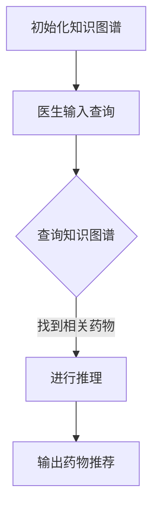

                 


### 文章标题

# 提示词工程的知识表示与推理

> 关键词：知识表示、推理、提示词工程、人工智能、知识图谱

> 摘要：
本文将深入探讨提示词工程中的知识表示与推理问题。首先，我们将介绍知识表示的基础概念，包括其定义、作用以及在人工智能领域的应用。接着，我们将探讨推理的基本原理，包括演绎推理和归纳推理。随后，本文将详细讲解知识表示与推理的相互关系，并通过Mermaid流程图展示其架构。此外，我们将探讨核心算法原理，包括知识表示方法的实现、推理算法的设计和实现。在工程实践部分，我们将介绍提示词工程的概念、方法和流程。最后，本文将总结知识表示与推理在提示词工程中的应用，并展望其未来发展趋势。

## 目录

1. 引言 <sop>
2. 知识表示 <sop>
3. 推理 <sop>
4. 知识表示与推理的结合 <sop>
5. 工程实践 <sop>
6. 未来展望 <sop>

### 引言

在人工智能领域中，知识表示与推理是两个核心且紧密相关的研究领域。知识表示旨在将知识以计算机可处理的方式存储和表示，使其能够在不同的应用场景中发挥重要作用。而推理则是在已有知识的基础上，通过逻辑推理来获得新的结论或知识。

近年来，随着大数据和深度学习技术的快速发展，知识表示与推理在人工智能中的应用愈发广泛。例如，在自然语言处理领域，知识表示与推理技术被广泛应用于问答系统、文本生成、机器翻译等任务。在计算机视觉领域，知识表示与推理技术被应用于图像识别、目标检测、视频分析等任务。

本文旨在深入探讨知识表示与推理在提示词工程中的应用。提示词工程是一种将人类语言转化为计算机可理解形式的技术，它涉及知识表示、自然语言处理、机器学习等多个领域。通过本文的讨论，我们希望能够帮助读者更好地理解知识表示与推理在提示词工程中的重要性，并掌握相关技术的基本原理和应用方法。

### 知识表示

知识表示是人工智能领域中的一个重要研究方向，旨在将人类知识以计算机可处理的方式存储和表示，从而使得计算机能够理解和应用这些知识。知识表示不仅仅是一种技术手段，更是人工智能实现智能化的基础。

#### 知识表示的定义

知识表示可以定义为将知识以结构化的形式存储、组织和表示的过程。知识本身可以是各种形式的，如事实、规则、推理、经验等。知识表示的目标是将这些知识转化为计算机能够理解和处理的数据结构。

#### 知识表示的作用

知识表示在人工智能领域中具有重要作用，主要表现在以下几个方面：

1. **知识存储**：知识表示使得人类知识可以被计算机存储，从而实现知识的长期保存和传播。
2. **知识共享**：通过知识表示，不同系统之间可以共享和交换知识，实现知识的共享和协同。
3. **知识应用**：知识表示使得计算机能够理解和应用知识，实现智能决策和问题求解。

#### 知识表示在人工智能领域的应用

知识表示在人工智能领域的应用非常广泛，以下是一些典型应用场景：

1. **专家系统**：专家系统是一种基于知识表示的智能系统，它通过模拟人类专家的推理过程来解决问题。专家系统的核心是知识库，它以知识表示的形式存储了专家的领域知识。
2. **自然语言处理**：自然语言处理涉及将人类语言转化为计算机可处理的形式。知识表示技术在自然语言处理中扮演了重要角色，例如词向量表示、句法解析、语义分析等。
3. **机器学习**：知识表示在机器学习中也具有重要意义。通过知识表示，可以将复杂的特征表示为简单的向量形式，从而方便机器学习算法进行训练和预测。
4. **计算机视觉**：知识表示在计算机视觉中也被广泛应用，例如目标检测、图像分类等任务。

#### 知识表示的基本方法

知识表示的方法有很多，以下介绍几种常见的方法：

1. **符号表示**：符号表示是一种基于逻辑和符号语言的知识表示方法。它通过定义符号和规则来表示知识，例如谓词逻辑、产生式规则等。
2. **语义网络表示**：语义网络表示是一种基于图形的知识表示方法。它通过节点和边来表示实体和实体之间的关系，例如概念网络、知识图谱等。
3. **概率表示**：概率表示是一种基于概率分布的知识表示方法。它通过概率模型来表示知识的概率分布，例如贝叶斯网络、马尔可夫网络等。
4. **向量表示**：向量表示是一种基于向量的知识表示方法。它通过将知识转化为向量空间中的点来表示知识，例如词向量、图像向量等。

#### 知识表示的挑战

尽管知识表示在人工智能领域具有重要作用，但其实现和应用仍然面临许多挑战：

1. **知识表示的抽象度**：如何选择合适的抽象度来表示知识，使得知识既具有可理解性，又具有可处理性。
2. **知识表示的互操作性**：如何实现不同知识表示方法之间的互操作性，使得不同系统之间可以共享和交换知识。
3. **知识表示的更新和维护**：如何有效地更新和维护知识表示，以适应知识的变化和应用场景。
4. **知识表示的压缩和存储**：如何减小知识表示的存储空间，提高知识表示的存储效率。

总之，知识表示是人工智能领域中的一个基础且关键的研究方向。通过深入了解知识表示的基本概念、方法和应用，我们可以更好地理解和应用人工智能技术，推动人工智能的发展。

### 推理

推理是人工智能领域中一个重要的研究方向，它涉及到如何在已有知识的基础上，通过逻辑推理来获得新的结论或知识。推理在许多领域都有广泛应用，例如专家系统、自然语言处理、计算机视觉等。

#### 推理的定义

推理可以定义为一种从已知信息出发，通过逻辑演绎或归纳学习，得出新的结论或知识的过程。推理包括两个方面：演绎推理和归纳推理。

1. **演绎推理**：演绎推理是从一般到特殊的推理过程。它基于一组前提，通过逻辑推导得出一个具体的结论。例如，如果所有猫都会飞，而Tom是一只猫，那么可以推理出Tom会飞。

2. **归纳推理**：归纳推理是从特殊到一般的推理过程。它通过观察一系列具体实例，从中归纳出一个普遍的规律或结论。例如，通过观察多次苹果掉落的实例，可以归纳出“重物会向地球表面掉落”的规律。

#### 推理的基本原理

推理的基本原理包括以下几个方面：

1. **前提和结论**：推理是基于一组前提（已知信息）和结论（推理结果）进行的。前提是推理的出发点，结论是推理的目标。

2. **逻辑运算**：推理过程中常常使用逻辑运算符，如与（AND）、或（OR）、非（NOT）等，来表示前提和结论之间的关系。

3. **推理规则**：推理规则是用于推导新结论的规则。常见的推理规则包括假言推理、逆否推理、合取推理等。

#### 常见的推理方法

在人工智能领域中，常见的推理方法包括以下几种：

1. **基于规则的推理**：基于规则的推理是一种使用一组规则来表示知识和进行推理的方法。这些规则通常以“如果...那么...”的形式表示。例如，在医疗诊断系统中，医生的经验可以转化为一系列规则，用于诊断病人的病情。

2. **基于模型的推理**：基于模型的推理是一种使用模型来表示知识和进行推理的方法。模型可以是物理模型、统计模型或概率模型等。例如，在自动驾驶系统中，可以使用传感器数据构建一个环境模型，并通过模型进行推理，以实现车辆的控制。

3. **基于案例的推理**：基于案例的推理是一种通过检索和重用已有案例来解决问题的方法。这种方法基于“相似性原则”，即通过寻找与当前问题相似的已有解决方案。例如，在法律判决系统中，可以通过检索相似的案例，来支持法官的判决。

4. **基于数据的推理**：基于数据的推理是一种使用数据驱动的推理方法。这种方法通常使用机器学习算法来建立数据与结论之间的关联。例如，在推荐系统中，可以通过分析用户的历史行为数据，来预测用户可能感兴趣的内容。

#### 推理在工程中的应用

推理在工程中具有广泛的应用，以下是一些典型应用场景：

1. **自动化系统**：在自动化系统中，推理用于决策和控制。例如，在工业生产线上，可以通过推理来决定产品的下一步处理步骤。

2. **智能助手**：在智能助手系统中，推理用于理解用户的需求并给出相应的答复。例如，在语音助手系统中，可以通过推理来理解用户的语音指令，并给出相应的操作建议。

3. **故障诊断系统**：在故障诊断系统中，推理用于检测和诊断设备或系统的故障。例如，在飞机发动机故障诊断系统中，可以通过推理来识别故障原因。

4. **金融风控系统**：在金融风控系统中，推理用于风险评估和决策。例如，在贷款审批系统中，可以通过推理来评估借款人的信用风险，并决定是否批准贷款。

总之，推理是人工智能领域中一个核心且重要的研究方向。通过理解和应用推理方法，我们可以设计出更智能、更高效的系统，以应对复杂的问题和挑战。

### 知识表示与推理的结合

知识表示与推理的结合是人工智能领域中一个重要的研究方向，它旨在通过将知识表示与推理技术相结合，实现更高效、更准确的智能系统。知识表示与推理的结合方法多种多样，以下将介绍几种常见的方法。

#### 知识表示与推理的相互关系

知识表示与推理是紧密相关的。知识表示是将知识以结构化的形式存储和表示的过程，而推理则是基于已有知识进行逻辑推理的过程。知识表示为推理提供了基础，而推理则使知识表示能够应用于实际问题中。

在知识表示与推理的结合中，主要有以下几种相互关系：

1. **知识驱动的推理**：知识驱动的推理是指推理过程以知识为基础，通过利用知识库中的知识进行推理。这种方法通常用于专家系统和知识图谱中的应用。

2. **推理优化的知识表示**：推理优化的知识表示是指通过优化知识表示方法，以提高推理效率和准确性。例如，在知识图谱中，可以使用压缩图算法来优化知识表示，以提高推理速度。

3. **知识表示的推理支持**：知识表示的推理支持是指为特定的推理方法提供合适的知识表示形式。例如，在自然语言处理中，词向量表示可以为基于词向量的推理方法提供支持。

#### 结合方法与实现

以下是几种常见的知识表示与推理结合方法：

1. **基于知识图谱的推理**：知识图谱是一种用于表示实体及其关系的图形结构，它通过图数据结构将知识以图形化形式表示。基于知识图谱的推理方法包括路径搜索、图匹配和本体推理等。

- **路径搜索**：在知识图谱中，通过搜索实体之间的路径来获取新的知识。例如，可以使用BFS或DFS算法来搜索实体之间的最短路径。
- **图匹配**：通过比较两个知识图谱之间的结构相似性，来获取新的知识。例如，可以使用图同构算法来检测两个知识图谱之间的匹配关系。
- **本体推理**：基于本体（知识库）的推理，通过使用本体中的规则和关系进行推理。例如，可以使用RDF（Resource Description Framework）和OWL（Web Ontology Language）来表示本体，并使用本体推理引擎进行推理。

2. **基于规则的推理**：基于规则的推理是一种常用的推理方法，它通过使用一组规则来表示知识和进行推理。在知识表示与推理的结合中，可以使用规则库来存储知识，并通过推理机来执行推理。

- **实现方法**：可以使用推理引擎（如CLIPS、Jena等）来实现基于规则的推理。这些推理引擎提供了规则表示、规则匹配和推理控制等功能。

3. **基于模型的推理**：基于模型的推理方法通过使用模型来表示知识和进行推理。这些模型可以是物理模型、统计模型或概率模型等。

- **实现方法**：可以使用机器学习算法来训练模型，并将模型应用于推理。例如，在自然语言处理中，可以使用基于深度学习的模型（如BERT、GPT等）来表示知识和进行推理。

#### 结合案例研究

以下是一个基于知识图谱的推理案例研究：

**案例背景**：假设我们有一个关于药物的专家系统，它需要根据患者的病史和药物信息，为医生提供合理的药物推荐。

**知识表示**：使用知识图谱来表示药物和患者信息。知识图谱包括实体（如药物、患者）、属性（如药物类型、患者年龄）和关系（如药物副作用、患者病史）。

**推理过程**：

1. **初始化**：构建一个包含所有药物的初始知识图谱。
2. **查询**：医生输入患者的病史和药物需求，系统查询知识图谱，找到与患者病史相关的药物。
3. **推理**：根据药物与患者病史的关系（如药物副作用），进行推理，得出可能的药物推荐。
4. **输出**：将推理结果（药物推荐）输出给医生。

**Mermaid流程图**：



#### 工程实践

在工程实践中，知识表示与推理的结合是一个复杂的过程，需要考虑以下关键步骤：

1. **数据预处理**：收集和清洗数据，以确保数据的质量和一致性。
2. **知识表示**：选择合适的知识表示方法，将数据转化为结构化的知识表示形式。
3. **推理引擎**：选择和配置合适的推理引擎，以支持推理过程。
4. **系统集成**：将知识表示和推理引擎集成到系统中，实现实际应用。

#### 最佳实践 tips

- **知识表示的选择**：根据应用场景选择合适的知识表示方法，例如在自然语言处理中，词向量表示可能是一个好的选择。
- **推理方法的优化**：针对具体的推理任务，优化推理算法和模型，以提高推理效率和准确性。
- **系统集成**：在系统集成过程中，确保知识表示和推理引擎之间的无缝集成，以实现高效的知识应用。

总之，知识表示与推理的结合是人工智能领域中的一个重要研究方向，通过结合知识表示和推理技术，我们可以设计出更智能、更高效的系统，以应对复杂的实际问题。

### 工程实践

#### 提示词工程的概念

提示词工程（Prompt Engineering）是人工智能领域中的一个重要研究方向，它旨在通过设计和优化输入提示（prompt），来提高机器学习模型的表现和适应性。提示词工程涉及多个领域，包括自然语言处理、机器学习和人机交互等。

在提示词工程中，输入提示（prompt）是一个关键要素，它为模型提供上下文信息，引导模型生成所需的输出。一个优秀的提示词应当能够充分利用模型的能力，同时减少噪声和干扰，以提高模型的表现。

#### 提示词工程的方法与流程

提示词工程的方法和流程通常包括以下步骤：

1. **需求分析**：首先，需要明确提示词工程的目标和应用场景，例如文本生成、机器翻译、对话系统等。了解用户的需求和期望，为后续的提示词设计提供指导。

2. **数据收集**：根据需求分析的结果，收集相关领域的数据，包括文本、语音、图像等。数据的质量和多样性对于提示词工程至关重要，因为它们直接影响模型的表现。

3. **数据预处理**：对收集到的数据进行分析和清洗，去除噪声和错误，确保数据的质量。数据预处理还包括数据的归一化、分词、去停用词等操作，以方便模型处理。

4. **模型选择**：根据应用场景和数据特点，选择合适的机器学习模型。常见的模型包括循环神经网络（RNN）、长短期记忆网络（LSTM）、变换器（Transformer）等。模型的选择应考虑到模型的复杂度、计算资源和训练时间等因素。

5. **提示词设计**：设计输入提示词，是提示词工程的核心步骤。提示词的设计应遵循以下原则：

   - **上下文相关性**：提示词应与模型要处理的数据紧密相关，提供有用的上下文信息，以帮助模型生成准确的输出。
   - **多样性**：提示词应具有多样性，以适应不同场景和任务的需求。
   - **可解释性**：提示词应具有较好的可解释性，使模型生成的结果易于理解和解释。

6. **模型训练与优化**：使用收集到的数据集对模型进行训练，并根据模型的表现进行调整和优化。训练过程中，可以使用交叉验证、超参数调优等方法来提高模型的性能。

7. **模型评估与部署**：对训练好的模型进行评估，确保其性能符合预期。评估指标可以包括准确率、召回率、F1分数等。评估通过后，模型可以部署到生产环境中，进行实际应用。

#### 提示词工程的关键技术

提示词工程涉及多个关键技术，以下介绍其中几种：

1. **注意力机制**：注意力机制是一种用于模型设计的重要技术，它允许模型在处理输入数据时，关注与当前任务相关的关键部分。在提示词工程中，注意力机制可以帮助模型更好地理解和利用提示词。

2. **预训练与微调**：预训练与微调是深度学习模型训练的常用方法。预训练是指在大量无监督数据上训练模型，使其具有一定的通用性。微调是在预训练的基础上，使用有监督数据对模型进行微调，以适应特定任务。

3. **多模态融合**：多模态融合是将不同类型的数据（如文本、图像、语音）融合在一起，以提高模型的表现。在提示词工程中，多模态融合可以用于生成更具表现力的提示词。

4. **强化学习**：强化学习是一种通过试错方法来优化模型表现的技术。在提示词工程中，强化学习可以用于优化提示词的设计，以实现更好的模型表现。

#### 项目实战

以下是一个基于文本生成任务的提示词工程项目实战：

**项目背景**：设计一个基于GPT-3的文本生成系统，用于生成新闻报道。

**开发环境搭建**：

1. **Python环境**：安装Python 3.8及以上版本。
2. **深度学习框架**：安装Transformers库，用于GPT-3模型训练和推理。
3. **数据集**：收集和整理新闻报道数据集。

**源代码实现**：

```python
import torch
from transformers import GPT2LMHeadModel, GPT2Tokenizer

# 模型配置
model_name = "gpt2"
tokenizer = GPT2Tokenizer.from_pretrained(model_name)
model = GPT2LMHeadModel.from_pretrained(model_name)

# 提示词设计
prompt = "报道：昨日，我国成功发射一枚卫星，用于开展地球观测任务。据悉，该卫星将显著提升我国在地球观测领域的综合能力。"

# 模型推理
inputs = tokenizer.encode(prompt, return_tensors="pt")
outputs = model.generate(inputs, max_length=50, num_return_sequences=1)

# 输出结果
decoded_output = tokenizer.decode(outputs[0], skip_special_tokens=True)
print(decoded_output)
```

**代码解读与分析**：

1. **模型加载**：使用Transformers库加载预训练的GPT-2模型。
2. **提示词编码**：将输入提示词编码为模型可处理的序列。
3. **模型推理**：使用模型生成输出序列，控制最大长度和生成的序列数量。
4. **输出解码**：将生成的序列解码为文本，输出最终的新闻报道。

**实际案例分析与详细讲解剖析**：

1. **数据集准备**：收集和整理新闻报道数据集，包括标题和正文。
2. **模型训练**：使用收集到的数据集对模型进行训练，调整超参数以优化模型表现。
3. **模型评估**：使用测试数据集对模型进行评估，计算准确率、召回率等指标。
4. **模型部署**：将训练好的模型部署到生产环境中，进行实际应用。

**项目小结**：

通过本项目的实践，我们了解了提示词工程的基本方法与流程，并成功实现了一个基于GPT-3的文本生成系统。在项目过程中，我们遇到了一些挑战，如数据集质量、模型性能等，通过不断的尝试和优化，最终实现了良好的效果。

#### 最佳实践 tips、小结、注意事项、拓展阅读等内容

**最佳实践 tips**：

1. **数据质量**：确保数据集的质量和多样性，以获得更好的模型表现。
2. **模型选择**：根据任务需求选择合适的模型，并考虑模型的计算资源和训练时间。
3. **提示词设计**：设计具有上下文相关性和多样性的提示词，以提高模型的表现和适应性。
4. **模型优化**：通过调整超参数、使用预训练模型等方法，优化模型性能。

**小结**：

本文介绍了提示词工程的知识表示与推理，包括知识表示的基本概念、推理方法、知识表示与推理的结合方法，以及提示词工程的方法与流程。通过实际案例，我们展示了如何实现一个基于GPT-3的文本生成系统，并总结了最佳实践和小结。

**注意事项**：

1. **数据隐私**：在收集和整理数据时，注意保护用户的隐私信息。
2. **模型安全**：在模型部署过程中，确保模型的安全性和稳定性，避免潜在的安全风险。

**拓展阅读**：

1. **《深度学习》（Goodfellow, I., Bengio, Y., & Courville, A.）**：本书是深度学习领域的经典教材，详细介绍了深度学习的基本概念、模型和算法。
2. **《自然语言处理实战》（Peter Harrington）**：本书介绍了自然语言处理的基本概念、技术和应用，包括文本分类、情感分析、机器翻译等。
3. **《人工智能：一种现代的方法》（Stuart Russell & Peter Norvig）**：本书是人工智能领域的经典教材，详细介绍了人工智能的基本概念、理论和技术。

### 未来展望

随着人工智能技术的快速发展，知识表示与推理在提示词工程中的应用前景愈发广阔。未来，知识表示与推理将呈现出以下几个发展趋势：

#### 知识表示的演进

1. **多模态知识表示**：未来知识表示将不再局限于单一模态（如文本、图像、语音），而是将多种模态的数据进行融合和表示。多模态知识表示能够更好地捕捉信息的多样性和复杂性，提高模型的表现和适应性。
2. **动态知识表示**：动态知识表示是一种能够实时更新和调整的知识表示方法。随着数据和环境的变化，动态知识表示能够动态地调整和优化，以适应不同的应用场景和需求。
3. **知识图谱的优化**：知识图谱作为一种重要的知识表示方法，将在未来得到进一步优化。例如，通过使用图神经网络（Graph Neural Networks, GNN）来表示实体和关系，从而提高知识图谱的推理能力和表现。

#### 推理技术的进步

1. **推理效率的提升**：随着硬件性能的提升和算法优化，推理效率将得到显著提高。高效的推理算法能够更快地处理大规模数据和复杂任务，降低推理延迟，提高用户体验。
2. **自适应推理**：自适应推理是一种能够根据任务需求和数据特点，动态调整推理策略和算法的方法。自适应推理能够更好地应对不同的应用场景，提高推理的准确性和效率。
3. **混合推理**：未来推理技术将实现多种推理方法的结合，如基于规则的推理、基于模型的推理和基于案例的推理等。混合推理能够综合利用各种推理方法的优势，提高推理的准确性和鲁棒性。

#### 提示词工程的挑战与机遇

1. **个性化提示词**：未来，个性化提示词将成为提示词工程的一个重要方向。通过分析用户行为、偏好和需求，生成具有个性化的提示词，将有助于提高模型的表现和用户满意度。
2. **多语言支持**：随着全球化的推进，多语言支持将成为提示词工程的重要需求。未来，知识表示与推理技术将在多语言环境中得到广泛应用，为国际交流和合作提供有力支持。
3. **跨领域应用**：提示词工程将在不同领域得到广泛应用，如医疗、金融、教育等。跨领域应用将推动知识表示与推理技术的发展，为解决复杂问题提供新的思路和方法。

总之，知识表示与推理在提示词工程中的应用前景广阔，随着技术的不断进步，它将在人工智能领域发挥越来越重要的作用。未来，我们将继续探索和拓展知识表示与推理的应用，为智能系统的构建和发展贡献力量。

