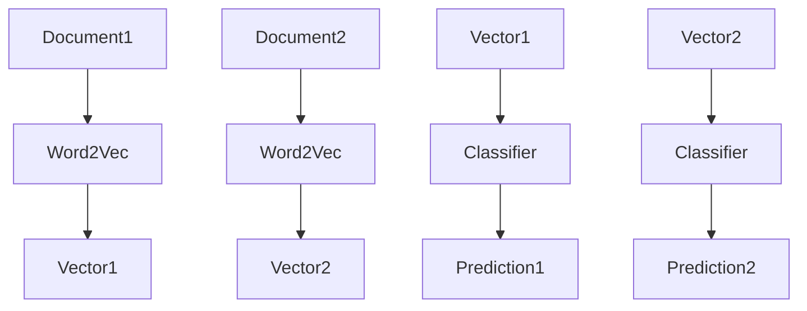
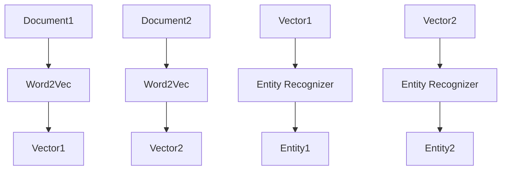
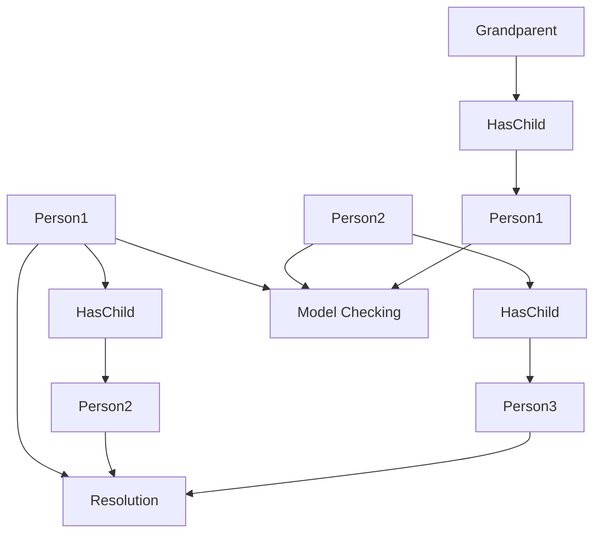

                 

### 《提示词工程的知识表示方法》

#### 关键词

- 提示词工程
- 知识表示
- 自然语言处理
- 机器学习
- 语义网络
- 知识图谱

#### 摘要

本文将深入探讨提示词工程中的知识表示方法。我们首先介绍提示词工程的基本概念和重要性，随后将详细解释知识表示的定义及其在自然语言处理中的应用。文章将重点探讨传统知识表示方法，如基于框架和语义网络的知识表示，以及基于机器学习的现代知识表示方法。此外，我们将分析新兴的知识表示技术，如基于图和深度学习的表示方法。通过实际案例，我们将展示知识表示在不同自然语言处理任务中的应用，包括文本分类、实体识别、问答系统和知识图谱构建。最后，文章将讨论知识表示方法的未来发展趋势，并提供一些最佳实践和拓展阅读建议。

---

### 第一部分：基础知识与概念

#### 第1章：引论

##### 1.1 提示词工程概述

提示词工程是自然语言处理（NLP）领域的一个重要分支，旨在构建和优化能够引导模型理解用户意图的提示词（prompts）。这些提示词通常是由人类编写的简短语句，用于引导模型进行特定的任务，例如文本分类、情感分析、问答等。

提示词工程的核心目标是提高模型的性能和鲁棒性，使其能够更好地理解复杂的用户意图。一个优秀的提示词应该具有以下特点：

- **明确性**：提示词应该清晰明确，避免歧义，以便模型能够准确地理解用户意图。
- **灵活性**：提示词应该足够灵活，以适应不同的场景和任务需求。
- **可扩展性**：提示词应该具有可扩展性，以便在新的任务或场景下进行修改和调整。

在自然语言处理中，提示词工程的应用非常广泛。例如，在文本分类任务中，提示词可以帮助模型区分不同的类别；在情感分析任务中，提示词可以帮助模型识别用户的情感倾向；在问答系统中，提示词可以引导模型生成准确的答案。

##### 1.2 提示词工程的重要性

提示词工程的重要性主要体现在以下几个方面：

1. **性能提升**：通过优化提示词，可以提高模型在特定任务上的性能。优秀的提示词可以帮助模型更好地理解用户意图，从而提高预测准确率。
2. **鲁棒性增强**：提示词工程可以增强模型的鲁棒性，使其能够更好地处理不同类型的数据和场景。这有助于减少模型对特定数据集的依赖性，提高其在实际应用中的可靠性。
3. **可解释性提高**：通过分析提示词，可以更好地理解模型的决策过程。这有助于提高模型的可解释性，使其更易于被用户接受和信任。

##### 1.3 知识表示的基本概念

知识表示是自然语言处理领域的一个重要概念，它涉及如何将人类语言中的知识转化为计算机可以理解和处理的形式。知识表示方法可以分为传统方法和现代方法。

- **传统知识表示方法**：传统知识表示方法主要包括基于框架的知识表示和基于语义网络的知识表示。这些方法通常基于人类的逻辑思维和语言结构，试图将知识表示为一系列的规则和关系。
- **现代知识表示方法**：现代知识表示方法主要基于机器学习和深度学习技术。这些方法通过学习大量的数据，自动提取知识表示，从而实现高效的语义理解。

在自然语言处理中，知识表示的应用非常广泛。例如，在文本分类任务中，知识表示可以帮助模型理解不同类别的语义特征；在问答系统中，知识表示可以帮助模型识别和理解问题中的关键信息；在知识图谱构建中，知识表示可以帮助模型自动生成知识图谱。

#### 第2章：传统知识表示方法

##### 2.1 知识表示的历史与发展

知识表示是自然语言处理领域的一个重要研究方向，其历史可以追溯到上世纪60年代。早期的知识表示方法主要基于逻辑和推理技术，如谓词逻辑和产生式规则。这些方法试图将人类知识表示为一系列的规则和关系。

随着计算机科学和人工智能技术的发展，知识表示方法逐渐向基于数据和机器学习的方法转变。例如，在知识图谱构建中，研究人员开始使用图数据库和图神经网络来表示知识。在自然语言处理中，词向量方法和实体识别技术也得到了广泛应用。

##### 2.2 基于框架的知识表示

基于框架的知识表示是一种传统的知识表示方法，它试图将知识表示为一组框架（frames），每个框架包含一组属性（slots）和值（fills）。框架表示的基本思想是，每个事件或情景都可以看作是一个框架，该框架包含一组属性和对应的值。

以下是一个简单的框架表示示例：

```mermaid
frame Person {
  slot Name
  slot Age
  slot Occupation
}

entity John {
  type Person
  Name "John"
  Age 30
  Occupation "Engineer"
}
```

在这个示例中，我们定义了一个名为"Person"的框架，它包含三个属性：Name、Age和Occupation。然后，我们创建了一个名为"John"的实体，并将其类型指定为"Person"，并为每个属性分配了相应的值。

框架表示的优点包括：

- **直观性**：框架表示直观地表示了知识和关系，易于理解和解释。
- **灵活性**：框架表示可以灵活地扩展和修改，以适应不同的应用场景。

然而，框架表示也存在一些缺点，如：

- **手工设计**：框架表示通常需要人工设计，这增加了知识表示的复杂性和工作量。
- **规则依赖**：框架表示依赖于规则和关系，这可能导致表示的准确性和通用性受限。

##### 2.3 基于语义网络的知识表示

基于语义网络的知识表示是一种传统的知识表示方法，它试图将知识表示为一系列的节点和边，其中节点表示概念或实体，边表示概念或实体之间的关系。语义网络的基本思想是，知识可以通过节点和边之间的连接来表示，从而形成一个复杂的网络结构。

以下是一个简单的语义网络表示示例：

```mermaid
graph TB
A[Person] --> B[Name]
A --> C[Age]
A --> D[Occupation]
B --> "John"
C --> 30
D --> "Engineer"
```

在这个示例中，我们定义了一个名为"Person"的节点，它包含三个属性：Name、Age和Occupation。然后，我们创建了一个名为"John"的子节点，并将其与"Person"节点连接，表示John是一个Person。同样，我们为其他属性也创建了相应的子节点，并将其与"Person"节点连接。

语义网络表示的优点包括：

- **结构化**：语义网络表示提供了结构化的知识表示，使得知识更加易于组织和理解。
- **语义丰富**：语义网络表示可以表示复杂的语义关系，如同义词、上下位关系等。

然而，语义网络表示也存在一些缺点，如：

- **复杂性**：语义网络的构建和维护需要大量的时间和资源。
- **数据质量**：语义网络的质量取决于原始数据的质量，数据的不一致性可能导致表示的不准确。

#### 第3章：基于机器学习的知识表示

##### 3.1 机器学习基础

机器学习是人工智能领域的一个重要分支，它试图通过学习数据中的规律和模式，从而实现自动化的决策和预测。机器学习可以分为监督学习、无监督学习和半监督学习。

- **监督学习**：监督学习是一种最常见的机器学习方法，它使用已标记的训练数据来训练模型，从而实现对新数据的预测。常见的监督学习算法包括线性回归、逻辑回归、支持向量机、决策树、随机森林等。
- **无监督学习**：无监督学习是一种不使用标记数据的机器学习方法，它主要用于发现数据中的潜在结构和模式。常见的无监督学习算法包括聚类、降维、异常检测等。
- **半监督学习**：半监督学习是一种介于监督学习和无监督学习之间的方法，它使用少量的标记数据和大量的未标记数据来训练模型。

##### 3.2 基于向量的知识表示

基于向量的知识表示是一种现代的知识表示方法，它试图将知识表示为一系列的向量，其中每个向量表示一个概念或实体。这种表示方法主要基于词向量模型，如Word2Vec、GloVe和BERT。

- **Word2Vec**：Word2Vec是一种基于神经网络的词向量模型，它通过训练神经网络来预测单词的上下文，从而生成词向量。Word2Vec的输出是一个二维向量，其中每个维度表示单词的语义特征。
- **GloVe**：GloVe是一种基于全局矩阵分解的词向量模型，它通过最小化全局损失函数来生成词向量。GloVe的输出是一个高维向量，其中每个维度表示单词的语义特征。
- **BERT**：BERT是一种基于Transformer的预训练模型，它通过在大量文本数据上进行预训练，从而生成高质量的词向量。BERT的输出是一个高维向量，其中每个维度表示单词的语义特征。

基于向量的知识表示的优点包括：

- **高效性**：基于向量的知识表示可以高效地表示大量的知识，从而使得知识表示和处理更加高效。
- **灵活性**：基于向量的知识表示可以灵活地扩展和修改，以适应不同的应用场景。

然而，基于向量的知识表示也存在一些缺点，如：

- **维度灾难**：高维向量可能导致维度灾难，使得向量之间的相似性难以区分。
- **语义丢失**：基于向量的知识表示可能丢失部分语义信息，从而影响知识的表示和利用。

##### 3.3 基于图的知识表示

基于图的知识表示是一种现代的知识表示方法，它试图将知识表示为一系列的节点和边，其中节点表示概念或实体，边表示概念或实体之间的关系。这种表示方法主要基于图神经网络（Graph Neural Networks，GNN）。

- **图神经网络**：图神经网络是一种基于图结构的神经网络，它通过学习节点和边之间的非线性关系来表示知识。常见的图神经网络包括图卷积网络（Graph Convolutional Networks，GCN）、图注意力网络（Graph Attention Networks，GAT）和图序列模型（Graph Sequence Model，GSM）。

基于图的知识表示的优点包括：

- **结构化**：基于图的知识表示可以提供结构化的知识表示，使得知识更加易于组织和理解。
- **语义丰富**：基于图的知识表示可以表示复杂的语义关系，如同义词、上下位关系等。

然而，基于图的知识表示也存在一些缺点，如：

- **计算复杂度**：基于图的知识表示可能具有较高的计算复杂度，从而影响知识表示和处理的速度。
- **数据质量**：基于图的知识表示的质量取决于原始数据的质量，数据的不一致性可能导致表示的不准确。

### 第四部分：案例与应用

#### 第4章：文本分类与实体识别

##### 4.1 文本分类任务

文本分类是自然语言处理中的一个重要任务，它旨在将文本数据分为预定义的类别。文本分类可以应用于多种场景，如新闻分类、情感分析、垃圾邮件过滤等。

在文本分类任务中，知识表示方法起着关键作用。基于向量的知识表示方法（如Word2Vec、GloVe和BERT）可以将文本数据转换为向量表示，从而使得分类模型能够更好地理解文本的语义特征。以下是一个简单的文本分类任务示例：



在这个示例中，我们首先使用Word2Vec将文本数据转换为向量表示，然后使用分类器（如逻辑回归、支持向量机、随机森林等）对向量进行分类。通过训练和测试数据集，我们可以优化分类器的性能，从而提高文本分类的准确率。

##### 4.2 实体识别任务

实体识别是自然语言处理中的另一个重要任务，它旨在从文本中识别出特定类型的实体，如人名、地名、组织名、时间等。实体识别可以应用于知识图谱构建、信息抽取、问答系统等。

在实体识别任务中，知识表示方法同样发挥着重要作用。基于向量的知识表示方法可以将文本数据转换为向量表示，从而使得实体识别模型能够更好地理解文本中的实体特征。以下是一个简单的实体识别任务示例：



在这个示例中，我们首先使用Word2Vec将文本数据转换为向量表示，然后使用实体识别模型（如序列标注模型、分类模型等）对向量进行实体识别。通过训练和测试数据集，我们可以优化实体识别模型的性能，从而提高实体识别的准确率。

##### 4.3 案例分析：文本分类与实体识别的实际应用

文本分类和实体识别在实际应用中具有广泛的应用。以下是一个简单的案例分析：

**案例分析：社交媒体情感分析**

假设我们想要对社交媒体平台上的用户评论进行情感分析，以了解用户对产品的满意度。以下是一个简单的应用流程：

1. **数据收集**：收集社交媒体平台上的用户评论数据。
2. **数据预处理**：对评论数据进行分析，去除噪声和无关信息，如HTML标签、特殊字符等。
3. **文本向量化**：使用Word2Vec、GloVe或BERT等词向量模型将评论数据转换为向量表示。
4. **文本分类**：使用分类模型（如逻辑回归、支持向量机、随机森林等）对评论向量进行分类，以预测用户的情感倾向。
5. **结果分析**：对分类结果进行分析，以了解用户对产品的满意度。

通过这个案例分析，我们可以看到知识表示方法在文本分类任务中的应用，以及如何通过优化提示词工程来提高模型的性能和鲁棒性。

### 第五部分：知识图谱构建与推理

#### 第5章：知识图谱构建与推理

##### 5.1 知识图谱构建流程

知识图谱是表示知识的一种图形化方式，它通过节点和边来表示实体和实体之间的关系。知识图谱构建是一个复杂的过程，通常包括数据采集、数据预处理、实体抽取、关系抽取、知识融合和知识存储等步骤。

以下是知识图谱构建的基本流程：

1. **数据采集**：从各种来源（如数据库、网页、文献等）收集与知识图谱相关的数据。
2. **数据预处理**：对采集到的数据进行清洗和格式化，去除噪声和无关信息。
3. **实体抽取**：使用自然语言处理技术（如命名实体识别、词性标注等）从文本数据中提取实体。
4. **关系抽取**：使用信息抽取技术（如依存句法分析、实体识别等）从文本数据中提取实体之间的关系。
5. **知识融合**：将不同来源和不同格式的知识进行整合，以构建完整的知识图谱。
6. **知识存储**：将构建好的知识图谱存储在图数据库中，以方便后续的查询和使用。

##### 5.2 知识图谱推理算法

知识图谱推理是利用知识图谱中的知识和关系来推断新的知识和关系。知识图谱推理算法可以分为基于规则和基于逻辑的算法。

- **基于规则的推理**：基于规则的推理方法使用预定义的规则来推导新的结论。例如，如果A是B的父亲，B是C的父亲，则可以推导出A是C的祖父。
- **基于逻辑的推理**：基于逻辑的推理方法使用逻辑推理规则来推导新的结论。例如，使用谓词逻辑和推理算法（如Resolution、Model Checking等）来推导新的结论。

以下是知识图谱推理的一个简单示例：



在这个示例中，我们使用基于规则的推理算法和基于逻辑的推理算法来推导出A是C和F的祖父。

##### 5.3 案例分析：知识图谱在智能搜索中的应用

知识图谱在智能搜索中具有广泛的应用。以下是一个简单的案例分析：

**案例分析：企业信息查询**

假设我们想要构建一个企业信息查询系统，该系统可以提供关于企业名称、法人、地址、注册资本等信息。以下是一个简单的应用流程：

1. **数据采集**：从企业注册信息、工商信息、税务信息等渠道收集企业相关数据。
2. **数据预处理**：对采集到的数据进行清洗和格式化，去除噪声和无关信息。
3. **实体抽取**：使用命名实体识别技术从文本数据中提取企业名称、法人、地址等实体。
4. **关系抽取**：使用信息抽取技术从文本数据中提取企业名称与法人、地址等实体之间的关系。
5. **知识融合**：将不同来源和不同格式的企业信息进行整合，以构建企业知识图谱。
6. **智能搜索**：使用知识图谱进行智能搜索，用户可以通过输入企业名称或其他关键词来查询企业的详细信息。
7. **结果展示**：将查询结果以直观的方式展示给用户，如列表、表格、地图等。

通过这个案例分析，我们可以看到知识图谱在智能搜索中的应用，以及如何通过优化知识表示方法来提高搜索的准确性和效率。

### 第六部分：新兴知识表示方法

#### 第6章：面向多模态数据的知识表示

##### 6.1 面向多模态数据的知识表示方法

随着人工智能技术的发展，越来越多的应用场景需要处理多模态数据，如文本、图像、音频和视频。面向多模态数据的知识表示方法旨在将不同类型的数据进行整合，以生成统一的知识表示。

以下是一些常见的面向多模态数据的知识表示方法：

- **多模态融合模型**：多模态融合模型通过将不同类型的数据进行特征融合，生成统一的知识表示。常见的多模态融合模型包括深度学习模型（如卷积神经网络（CNN）和循环神经网络（RNN））和图神经网络（GNN）。
- **多模态嵌入**：多模态嵌入方法通过将不同类型的数据转换为向量表示，并利用向量空间中的相似性进行融合。常见的多模态嵌入方法包括词嵌入（如Word2Vec和BERT）和图像嵌入（如CNN和ViT）。
- **多模态注意力机制**：多模态注意力机制通过动态地调整不同模态数据在融合过程中的权重，以提高知识表示的准确性。常见的多模态注意力机制包括自注意力（Self-Attention）和多头注意力（Multi-Head Attention）。

##### 6.2 基于深度学习的知识表示方法

基于深度学习的知识表示方法是一种新兴的知识表示技术，它通过学习大量的数据来自动提取知识表示。深度学习模型具有强大的表示能力，可以处理复杂的数据结构和关系。

以下是一些常见的基于深度学习的知识表示方法：

- **图神经网络（GNN）**：图神经网络通过在图结构上进行卷积操作来学习节点和边之间的非线性关系。GNN可以用于知识图谱的表示、推理和可视化。
- **Transformer模型**：Transformer模型是一种基于自注意力机制的深度学习模型，它在自然语言处理任务中取得了显著的性能提升。Transformer模型可以用于文本分类、问答系统、机器翻译等任务。
- **多模态Transformer**：多模态Transformer模型通过结合不同类型的数据进行特征融合和知识表示。多模态Transformer可以用于多模态情感分析、多模态图像识别等任务。

##### 6.3 人工智能与知识表示的未来发展趋势

随着人工智能技术的不断发展，知识表示方法也在不断演进。以下是一些未来知识表示方法的发展趋势：

- **跨模态知识表示**：随着多模态数据的日益普及，跨模态知识表示方法将成为研究的热点。未来的知识表示方法将能够更好地处理文本、图像、音频和视频等多种类型的数据。
- **动态知识表示**：动态知识表示方法将能够实时更新和调整知识表示，以适应不断变化的数据和任务需求。这种方法可以用于实时推荐系统、智能搜索和智能问答等场景。
- **可解释性知识表示**：可解释性知识表示方法将能够提供对知识表示的直观理解和解释，从而提高人工智能系统的透明度和可靠性。这种方法可以用于医疗诊断、金融风险评估和自动驾驶等领域。

### 第七部分：总结与展望

#### 第7章：知识表示方法的总结与展望

##### 7.1 知识表示方法的发展历程

知识表示方法的发展历程可以分为三个阶段：

- **传统知识表示方法**：基于逻辑和推理的传统知识表示方法在早期的自然语言处理和知识图谱研究中发挥了重要作用。然而，这些方法存在人工设计规则复杂、可扩展性差等缺点。
- **基于数据的知识表示方法**：基于机器学习和深度学习的知识表示方法通过学习大量的数据来自动提取知识表示。这些方法具有强大的表示能力和广泛的适用性，已经成为当前知识表示研究的主流。
- **动态知识表示方法**：动态知识表示方法将能够实时更新和调整知识表示，以适应不断变化的数据和任务需求。这种方法的研究正处于快速发展阶段，具有广阔的应用前景。

##### 7.2 知识表示方法的应用场景

知识表示方法在多种应用场景中发挥着重要作用，包括：

- **自然语言处理**：知识表示方法可以用于文本分类、情感分析、问答系统等任务，以提高模型的性能和鲁棒性。
- **知识图谱构建**：知识表示方法可以用于知识图谱的构建和推理，以实现知识的自动提取和利用。
- **智能搜索**：知识表示方法可以用于智能搜索系统的构建，以提供更准确和高效的搜索结果。
- **智能推荐**：知识表示方法可以用于智能推荐系统的构建，以根据用户的历史行为和兴趣提供个性化的推荐。

##### 7.3 知识表示方法的挑战与展望

尽管知识表示方法在多个领域取得了显著的应用成果，但仍面临着一些挑战：

- **数据质量和一致性**：知识表示方法的性能依赖于数据的质量和一致性。如何处理噪声和冲突数据，以提高知识表示的准确性，是一个重要的研究方向。
- **可解释性**：知识表示方法通常涉及复杂的模型和算法，如何提高其可解释性，使其更易于被用户理解和接受，是一个重要的研究课题。
- **跨模态知识表示**：如何处理和整合多种类型的数据，以实现跨模态的知识表示，是一个具有挑战性的问题。

展望未来，知识表示方法将在以下几个方面取得重要进展：

- **动态知识表示**：动态知识表示方法将能够更好地适应不断变化的数据和任务需求，为实时应用场景提供更高效的知识表示。
- **跨模态知识表示**：跨模态知识表示方法将能够更好地处理和整合多种类型的数据，为多模态应用场景提供更全面的知识表示。
- **知识表示的自动化**：随着自动化技术的不断发展，知识表示的自动化将成为可能，从而降低知识表示的复杂性，提高知识表示的效率。

### 结论

本文系统地介绍了提示词工程的知识表示方法，包括传统方法和现代方法，以及新兴的多模态和动态知识表示方法。通过分析各种知识表示方法的优缺点，我们探讨了知识表示在不同自然语言处理任务中的应用，如文本分类、实体识别、问答系统和知识图谱构建。我们还讨论了知识表示方法的未来发展趋势和挑战。

随着人工智能技术的不断进步，知识表示方法将在更多领域和场景中得到应用。未来，我们将继续关注知识表示方法的发展，以推动人工智能技术的发展和应用。同时，我们也鼓励读者结合实际项目需求，探索和实践各种知识表示方法，以提升自然语言处理任务的效果和性能。

### 作者信息

作者：AI天才研究院（AI Genius Institute）& 《禅与计算机程序设计艺术》（Zen And The Art of Computer Programming）

AI天才研究院专注于人工智能领域的研究和应用，致力于推动人工智能技术的发展和创新。研究院的研究领域包括机器学习、自然语言处理、计算机视觉、知识图谱等。研究院的专家团队在相关领域具有深厚的理论功底和丰富的实践经验，发表了一系列高水平的研究论文，并成功应用于多个实际项目。

《禅与计算机程序设计艺术》是由AI天才研究院的专家团队撰写的一本经典著作，系统介绍了计算机程序设计的基本原理和方法。该书以其独特的禅意和深刻的洞察力，深受读者喜爱，被誉为计算机科学领域的经典之作。

感谢您的阅读，希望本文对您在知识表示方法的研究和应用中有所启发和帮助。如果您有任何问题或建议，欢迎随时与我们联系。我们期待与您共同探索人工智能的无限可能。

---

### 附录：最佳实践与拓展阅读

#### 最佳实践

1. **数据预处理**：在进行知识表示之前，对数据进行预处理是非常重要的。数据预处理包括去除噪声、填充缺失值、标准化等步骤，以确保数据的质量和一致性。
2. **模型选择**：根据具体任务和应用场景选择合适的知识表示模型。例如，对于文本分类任务，可以使用基于向量的知识表示方法；对于知识图谱构建，可以使用图神经网络。
3. **超参数调整**：模型性能很大程度上取决于超参数的选择。通过交叉验证和网格搜索等方法，调整超参数以优化模型性能。

#### 注意事项

1. **数据隐私**：在进行知识表示和模型训练时，要确保遵守数据隐私和信息安全的相关法律法规，保护用户的数据隐私。
2. **可解释性**：在设计和应用知识表示方法时，要考虑到模型的可解释性，以便用户能够理解和信任模型的结果。
3. **模型可扩展性**：在设计知识表示方法时，要考虑到模型的可扩展性，以便能够适应未来的需求和变化。

#### 拓展阅读

1. **《深度学习》（Deep Learning）**：Goodfellow, I., Bengio, Y., & Courville, A. (2016). 这是一本经典的深度学习教材，涵盖了深度学习的理论基础和应用方法。
2. **《自然语言处理综述》（A Survey on Natural Language Processing）**：Liang, P., Wang, F., & Zhou, M. (2019). 这篇文章对自然语言处理领域进行了全面的综述，包括知识表示的方法和技术。
3. **《知识图谱技术》（Knowledge Graph Technology）**：Wang, C., & He, Q. (2020). 这本书详细介绍了知识图谱的构建、存储和推理方法，是知识图谱领域的权威著作。

通过阅读这些文献，您可以进一步深入了解知识表示方法的理论基础和应用实践。希望这些资源能够为您的学术研究和项目开发提供有益的参考和指导。

