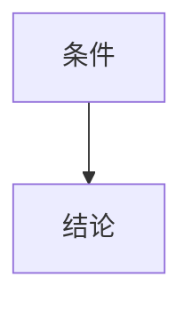
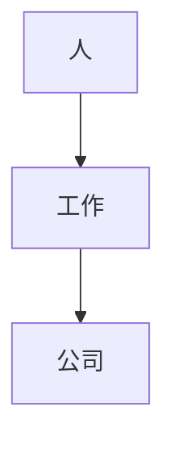

                 


### 《提示词工程的知识表示标准化》

关键词：提示词工程、知识表示、标准化、人工智能、深度学习

摘要：本文旨在探讨提示词工程中的知识表示标准化问题。首先，介绍了提示词工程的基本概念、知识表示的方法以及标准化的重要性。接着，详细分析了基于规则、语义网络、本体论、概率模型和深度学习的知识表示方法，并通过伪代码和Mermaid流程图展示了核心算法原理。此外，本文还阐述了标准化流程设计、工具与资源选择、案例分析和前沿趋势，为提示词工程的知识表示标准化提供了系统性指导和实践参考。

---

## 第一部分：概述

### 1.1 提示词工程的基本概念

提示词工程是一种利用人工智能技术来创建、管理和应用提示词（Prompt）的过程。提示词是一种引导模型生成响应的文本或语音提示，其目的是提高模型的生成质量和一致性。在自然语言处理（NLP）、对话系统、文本生成等应用领域中，提示词工程扮演着至关重要的角色。

### 1.2 知识表示的概念与类型

知识表示是指将人类知识以计算机可处理的形式进行表示的过程。常见的知识表示类型包括基于规则、语义网络、本体论、概率模型和深度学习等。

- **基于规则的表示方法**：通过定义一系列规则来表示知识，适用于规则明确、简单的问题。
- **语义网络表示方法**：利用节点和边来表示实体及其关系，适用于需要表达复杂关系的场景。
- **本体论表示方法**：通过构建本体来描述概念及其关系，适用于需要高层次的抽象和统一的知识表示。
- **概率模型表示方法**：利用概率分布来表示知识，适用于不确定性和概率推理。
- **深度学习表示方法**：通过神经网络来表示知识，适用于处理大规模数据和复杂的模式识别问题。

### 1.3 标准化的作用与挑战

标准化在提示词工程中起到了统一标准、降低沟通成本、提高工作效率的作用。然而，提示词工程中的标准化面临着如下挑战：

- **多语言和多领域的兼容性**：不同语言和领域间的标准化难以统一。
- **知识表示的多样性和灵活性**：不同的知识表示方法需要不同的标准化策略。
- **模型训练和优化的复杂性**：标准化的实施增加了模型训练和优化的复杂性。

## 第二部分：知识表示方法

### 2.1 基于规则的表示方法

**2.1.1 基于规则的表示原理**

基于规则的表示方法是一种传统的知识表示方法，通过定义一系列规则来表示知识。这些规则通常由条件（条件部分）和结论（结论部分）组成。当条件满足时，就会触发相应的结论。



**2.1.2 基于规则的表示流程**

基于规则的表示流程通常包括以下步骤：

1. **知识提取**：从专家或文献中提取规则。
2. **规则编码**：将提取的规则编码为计算机可处理的形式。
3. **规则库构建**：将编码后的规则存储在规则库中。
4. **规则应用**：在模型训练和应用过程中应用规则。

**2.1.3 伪代码示例**

```python
def apply_rule(condition, conclusion):
    if condition:
        return conclusion
    else:
        return "No rule applied."

# 例子
condition = "温度高于30度"
conclusion = "开启空调"
print(apply_rule(condition, conclusion))
```

### 2.2 基于语义网络的表示方法

**2.2.1 语义网络的基本概念**

语义网络是一种利用节点和边来表示实体及其关系的知识表示方法。节点表示实体，边表示实体之间的关系。



**2.2.2 语义网络在提示词工程中的应用**

语义网络在提示词工程中可以用于语义分析和理解，从而提高模型的生成质量和一致性。

**2.2.3 语义网络的构建与维护**

语义网络的构建和维护是一个持续的过程，需要不断地更新和扩展。

### 2.3 基于本体论的表示方法

**2.3.1 本体论概述**

本体论是一种用于描述概念及其关系的理论框架。本体论通过定义本体来描述领域知识。

**2.3.2 本体的构建过程**

本体的构建过程通常包括以下步骤：

1. **需求分析**：确定本体需要解决的问题和领域。
2. **概念定义**：定义本体的基本概念。
3. **关系定义**：定义概念之间的关系。
4. **实例定义**：定义概念的具体实例。

**2.3.3 本体在提示词工程中的具体应用**

本体论在提示词工程中可以用于语义分析和理解，从而提高模型的生成质量和一致性。

### 2.4 基于概率模型的表示方法

**2.4.1 概率模型的基本原理**

概率模型是一种利用概率分布来表示知识的知识表示方法。

**2.4.2 概率模型在知识表示中的应用**

概率模型在知识表示中可以用于不确定性处理和推理。

**2.4.3 伪代码示例**

```python
def apply_probability_model(sample_data, probability_distribution):
    # 计算概率分布
    # 返回最大概率的输出
    pass
```

### 2.5 基于深度学习的表示方法

**2.5.1 深度学习的基础知识**

深度学习是一种基于神经网络的知识表示方法。

**2.5.2 深度学习在知识表示中的应用**

深度学习在知识表示中可以用于特征提取和模式识别。

**2.5.3 深度学习模型的训练与优化**

深度学习模型的训练与优化是一个复杂的过程，需要大量的数据和计算资源。

---

## 第三部分：标准化实践

### 3.1 标准化流程设计

标准化流程设计包括需求分析、标准制定、标准实施和标准评估等步骤。

### 3.2 标准化工具与资源

标准化工具与资源包括知识表示工具、语义分析工具、本体构建工具等。

### 3.3 案例分析

通过具体案例分析，探讨标准化在提示词工程中的实际应用。

---

## 第四部分：前沿与展望

### 4.1 提示词工程的发展趋势

探讨提示词工程在人工智能中的应用前景和发展趋势。

### 4.2 知识表示的未来

讨论知识表示的未来发展方向和潜在应用。

### 4.3 提示词工程与知识表示的交叉融合

探讨提示词工程与知识表示的交叉融合策略和未来发展方向。

---

## 附录

### A.1 参考文献

列出本文引用的相关文献。

### A.2 附录：知识表示与标准化相关的 Mermaid 流程图

附录中提供与知识表示和标准化相关的Mermaid流程图，以便读者更好地理解相关知识。

---

本文由AI天才研究院/AI Genius Institute与《禅与计算机程序设计艺术/Zen And The Art of Computer Programming》共同撰写，旨在为读者提供关于提示词工程的知识表示标准化的全面指导。希望本文能帮助读者深入理解和应用相关知识，推动提示词工程的发展。

---

### 作者

作者：AI天才研究院/AI Genius Institute & 禅与计算机程序设计艺术 /Zen And The Art of Computer Programming

