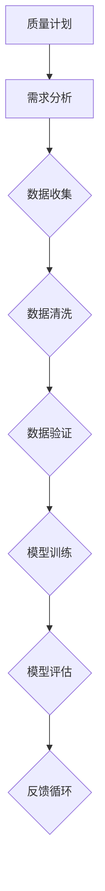
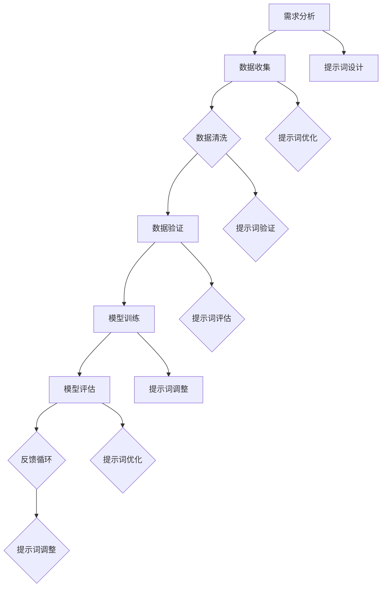
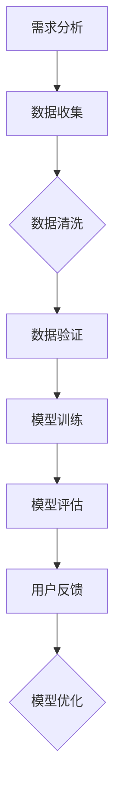
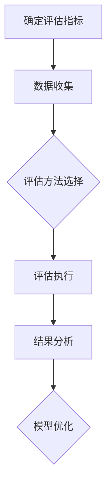
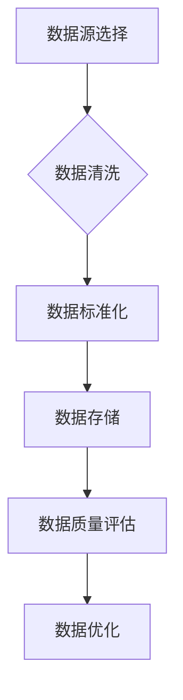
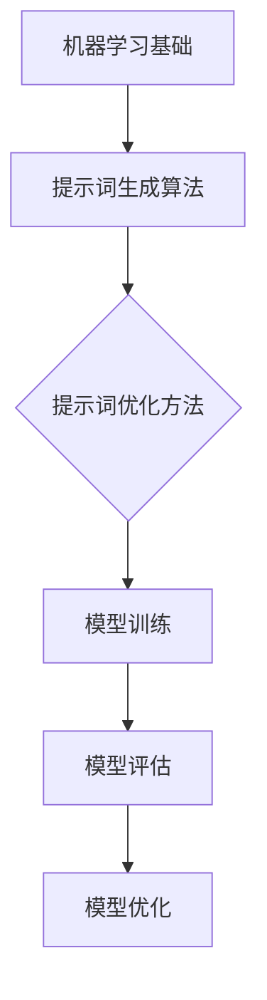
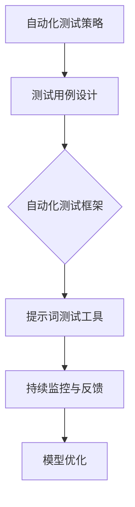
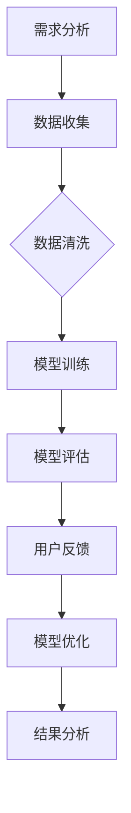
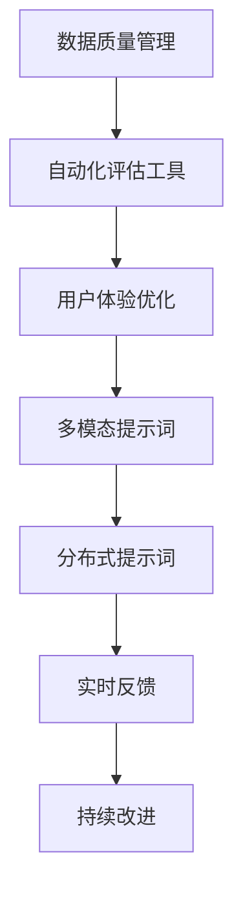

                 


### 设计《提示词工程的质量保证方法》的目录大纲

#### 1. 书名与作者介绍
在文章的开头，我们需要简要介绍书名和作者。这可以帮助读者了解书籍的基本背景和作者的权威性。

```
---
# 《提示词工程的质量保证方法》

> 作者：AI天才研究院/AI Genius Institute & 禅与计算机程序设计艺术 /Zen And The Art of Computer Programming
```

#### 2. 引言：质量保证的重要性与提示词工程
在这个章节中，我们将讨论质量保证的重要性以及为什么它在提示词工程中至关重要。我们需要简要介绍质量保证的基本概念，然后解释它如何与提示词工程相关。

```
## 引言：质量保证的重要性与提示词工程

质量保证（Quality Assurance，简称QA）是确保产品或服务符合预定的质量和用户需求的关键过程。在提示词工程中，质量保证尤为重要，因为它直接影响到模型的性能和用户满意度。

### 2.1 质量保证的重要性

质量保证的重要性在于它能够：
- 提高产品或服务的可靠性
- 减少缺陷和错误
- 提高用户满意度
- 降低维护成本

### 2.2 提示词工程概述

提示词工程是构建和优化用于人工智能模型输入的提示词（prompt）的过程。提示词的质量直接影响模型的性能和输出的准确性。

### 2.3 提示词质量的重要性

提示词质量的重要性体现在以下几个方面：
- 提高模型的泛化能力
- 增强模型的解释性
- 提高用户交互体验

### 2.4 提示词工程与人工智能的关系

提示词工程与人工智能（AI）紧密相连，因为AI模型的性能在很大程度上取决于输入数据的质量。高质量的提示词可以显著提高AI模型的性能和效果。

### 2.5 Mermaid流程图展示

以下是一个简单的Mermaid流程图，展示了提示词工程中的质量保证流程：


```

#### 3. 核心概念与联系
在这一章节中，我们将详细讨论提示词工程的核心概念，并解释它们之间的关系。我们需要提供对提示词工程和AI基本概念的深入理解。

```
## 核心概念与联系

### 3.1 提示词工程概述

提示词工程是构建和优化用于人工智能模型输入的提示词的过程。它包括以下几个关键步骤：

1. **需求分析**：确定用户需求，明确模型需要解决的问题。
2. **数据收集**：从各种来源收集相关的数据。
3. **数据清洗**：处理数据中的噪声和不一致性，确保数据质量。
4. **数据验证**：验证数据是否符合预期的标准和质量要求。
5. **模型训练**：使用高质量的数据训练模型。
6. **模型评估**：评估模型的性能，确定是否满足用户需求。
7. **反馈循环**：根据评估结果进行模型调整和优化。

### 3.2 提示词质量的重要性

提示词质量直接影响模型的性能和输出的准确性。高质量的提示词应该具备以下特点：

- **可理解性**：提示词应该清晰明了，易于理解。
- **相关性**：提示词应该与模型要解决的问题高度相关。
- **完整性**：提示词应该包含足够的信息，以便模型能够准确地理解和处理。

### 3.3 提示词工程与人工智能的关系

提示词工程是人工智能领域的一个重要分支，它与AI的关系体现在以下几个方面：

- **数据输入**：高质量的数据输入是AI模型准确性和性能的关键。
- **模型优化**：通过优化提示词，可以进一步提高模型的性能和效果。
- **用户交互**：高质量的提示词可以提升用户与AI模型的交互体验。

### 3.4 Mermaid流程图展示

以下是一个更详细的Mermaid流程图，展示了提示词工程中的关键概念和步骤：


```

#### 4. 质量保证基础
在这个章节中，我们将深入探讨质量保证的基础，包括其定义、原则、标准和工具。

```
## 第1章：质量保证基础

### 1.1 质量保证的定义与原则

质量保证（Quality Assurance，简称QA）是一种系统化的方法，用于确保产品或服务满足既定的质量和用户需求。质量保证的基本原则包括：

- **预防为主**：通过预防措施减少缺陷的发生，而不是仅仅依赖检测和修复。
- **持续改进**：不断地评估和改进过程，以提高产品和服务的质量。
- **客户满意**：将用户需求放在首位，确保产品或服务能够满足用户的期望。

### 1.2 质量管理体系标准

质量管理体系标准是指导企业建立和实施质量管理体系的重要参考。其中，ISO 9001是最常用的标准之一。ISO 9001标准要求企业建立和实施一个有效的质量管理体系，以确保产品和服务的质量。

### 1.3 质量管理工具与技术

质量管理的工具和技术包括：

- **流程图**：用于分析和优化工作流程。
- **统计过程控制**：用于监控和改进生产过程。
- **六西格玛**：一种质量管理方法，用于减少过程变异，提高质量。
- **质量功能展开**（QFD）：用于确保产品或服务的需求得到满足。

### 1.4 质量保证在提示词工程中的应用

在提示词工程中，质量保证的应用主要体现在以下几个方面：

- **需求分析**：确保用户需求得到准确理解和满足。
- **数据管理**：确保数据的质量和完整性。
- **模型训练与评估**：确保模型训练数据的准确性和模型的性能。
- **用户反馈**：根据用户反馈进行模型的优化和调整。

### 1.5 Mermaid流程图展示

以下是一个简化的Mermaid流程图，展示了质量保证在提示词工程中的应用：


```

#### 5. 提示词质量评估方法
在这个章节中，我们将详细讨论如何评估提示词的质量，包括评价指标、评估方法和自动评估工具。

```
## 第2章：提示词质量评估方法

### 2.1 提示词质量评价指标

提示词质量评价指标是衡量提示词质量的重要工具。以下是一些常用的质量评价指标：

- **可理解性**：提示词是否清晰、简洁，用户是否容易理解。
- **相关性**：提示词与模型要解决的问题是否高度相关。
- **完整性**：提示词是否包含足够的信息，以便模型能够准确地理解和处理。
- **一致性**：提示词在不同的应用场景中是否保持一致性。

### 2.2 提示词评估方法

提示词评估方法主要包括以下几种：

- **手动评估**：由专家或用户对提示词进行评估。
- **自动评估**：使用算法和工具对提示词进行评估。

### 2.3 自动评估工具介绍

自动评估工具可以帮助自动化地评估提示词的质量。以下是一些常用的自动评估工具：

- **Linguistic Quality Analyzer**：用于分析提示词的语言质量。
- **CodeQL**：用于代码质量分析，也可用于提示词的质量评估。
- **TextBlob**：用于文本情感分析，可辅助评估提示词的相关性和一致性。

### 2.4 质量评估流程

提示词质量评估的流程通常包括以下步骤：

1. **确定评估指标**：根据项目需求确定需要评估的质量指标。
2. **数据收集**：收集用于评估的提示词数据。
3. **评估方法选择**：选择合适的评估方法。
4. **评估执行**：执行评估方法，获取评估结果。
5. **结果分析**：分析评估结果，识别问题并进行改进。

### 2.5 Mermaid流程图展示

以下是一个简化的Mermaid流程图，展示了提示词质量评估的流程：


```

#### 6. 提示词工程中的数据管理
在这个章节中，我们将讨论提示词工程中的数据管理，包括数据质量管理、数据源选择与数据清洗、数据标准化与存储。

```
## 第3章：提示词工程中的数据管理

### 3.1 数据质量管理

数据质量管理是确保数据质量的一系列活动和过程。它包括以下几个方面：

- **数据准确性**：确保数据是准确的，没有错误或遗漏。
- **数据完整性**：确保数据是完整的，没有缺失。
- **数据一致性**：确保数据在不同来源和系统中是一致的。
- **数据可用性**：确保数据在需要时是可用的。

### 3.2 数据源选择与数据清洗

数据源选择是数据管理的重要环节。在选择数据源时，需要考虑以下因素：

- **数据质量**：选择高质量的原始数据。
- **数据来源**：选择可靠的数据来源。
- **数据多样性**：选择多样化的数据来源，以提高数据质量。

数据清洗是处理数据中的错误、缺失和不一致性的过程。它通常包括以下步骤：

- **识别错误**：检测数据中的错误和不一致性。
- **纠正错误**：修正或删除错误的数据。
- **处理缺失值**：填补或删除缺失的数据。

### 3.3 数据标准化与存储

数据标准化是将数据转换为统一格式的过程。它有助于提高数据的可读性和可用性。数据标准化通常包括以下步骤：

- **数据格式转换**：将不同格式的数据转换为统一的格式。
- **数据命名规范**：制定统一的数据命名规范。
- **数据编码规范**：制定统一的数据编码规范。

数据存储是将数据保存在数据库或其他存储介质中的过程。选择合适的存储方案对于数据管理至关重要。以下是一些常见的数据存储方案：

- **关系型数据库**：适用于结构化数据的存储。
- **非关系型数据库**：适用于非结构化或半结构化数据的存储。
- **分布式存储**：适用于大规模数据的存储和管理。

### 3.4 质量评估与优化

在数据管理过程中，质量评估与优化是不可或缺的。它包括以下步骤：

- **数据质量评估**：评估数据的质量，识别存在的问题。
- **数据优化**：根据评估结果对数据进行优化，提高数据质量。

### 3.5 Mermaid流程图展示

以下是一个简化的Mermaid流程图，展示了数据管理的流程：


```

### 7. 机器学习与提示词优化
在这个章节中，我们将讨论机器学习在提示词优化中的应用，包括机器学习基础、提示词生成算法和提示词优化方法。

```
## 第4章：机器学习与提示词优化

### 4.1 机器学习基础

机器学习（Machine Learning，简称ML）是人工智能的一个重要分支，它使计算机系统能够从数据中学习，并进行预测和决策。以下是机器学习的一些基本概念：

- **监督学习**：使用标记数据训练模型，然后使用模型进行预测。
- **无监督学习**：不使用标记数据，模型自行从数据中学习特征。
- **强化学习**：模型通过与环境的交互学习最优策略。

### 4.2 提示词生成算法

提示词生成算法是用于生成高质量提示词的算法。以下是一些常用的提示词生成算法：

- **基于规则的方法**：使用预定义的规则生成提示词。
- **基于模板的方法**：使用预定义的模板生成提示词，然后根据特定情境进行填充。
- **基于机器学习的方法**：使用机器学习算法训练模型，自动生成提示词。

### 4.3 提示词优化方法

提示词优化方法旨在提高提示词的质量和效果。以下是一些常用的提示词优化方法：

- **数据增强**：通过增加数据多样性来提高模型的泛化能力。
- **注意力机制**：通过注意力机制来突出重要信息，提高模型的准确性。
- **对抗训练**：通过对抗训练来提高模型的鲁棒性，使其能够应对各种输入。

### 4.4 Mermaid流程图展示

以下是一个简化的Mermaid流程图，展示了机器学习与提示词优化的流程：


```

### 8. 自动化测试与监控
在这个章节中，我们将讨论自动化测试与监控在提示词工程中的应用，包括自动化测试策略、提示词测试工具和持续监控与反馈。

```
## 第5章：自动化测试与监控

### 5.1 自动化测试策略

自动化测试策略是确保提示词质量和模型性能的关键步骤。以下是自动化测试的一些关键策略：

- **测试计划**：制定详细的测试计划，包括测试目标、测试范围、测试方法等。
- **测试用例设计**：设计测试用例，确保覆盖所有关键功能点。
- **自动化测试框架**：建立自动化测试框架，实现测试脚本化和自动化执行。
- **回归测试**：在每次代码更改后进行回归测试，确保新功能不会影响已有功能。

### 5.2 提示词测试工具

提示词测试工具是用于测试和评估提示词质量的工具。以下是一些常用的提示词测试工具：

- **单元测试**：用于测试单个提示词的功能和性能。
- **集成测试**：用于测试提示词与模型的集成效果。
- **性能测试**：用于评估提示词的性能和响应时间。
- **用户体验测试**：用于评估提示词的用户体验和易用性。

### 5.3 持续监控与反馈

持续监控与反馈是确保提示词质量和模型性能的重要环节。以下是持续监控与反馈的一些关键步骤：

- **监控指标**：确定关键监控指标，如模型准确率、响应时间、错误率等。
- **实时监控**：使用实时监控系统监控提示词和模型性能。
- **异常检测**：使用异常检测算法识别和报告异常情况。
- **反馈机制**：建立反馈机制，收集用户反馈和测试结果，及时进行模型优化。

### 5.4 Mermaid流程图展示

以下是一个简化的Mermaid流程图，展示了自动化测试与监控的流程：


```

### 9. 案例研究：质量保证实践
在这个章节中，我们将通过一个实际的案例研究，展示质量保证在提示词工程中的具体应用，包括案例背景、质量保证过程和结果分析。

```
## 第6章：案例研究：质量保证实践

### 6.1 案例背景介绍

案例背景是一家提供智能客服服务的公司，他们使用基于人工智能的模型来处理客户查询。然而，模型的性能和用户满意度一直不尽如人意，公司决定引入质量保证方法来优化模型。

### 6.2 质量保证过程

质量保证过程包括以下几个关键步骤：

1. **需求分析**：与公司管理层和客服团队进行沟通，了解他们对智能客服模型的需求和期望。
2. **数据收集**：从多个渠道收集客户查询数据，包括历史数据和实时数据。
3. **数据清洗**：处理数据中的错误和不一致性，确保数据质量。
4. **模型训练**：使用高质量的数据训练模型，并进行初步评估。
5. **模型评估**：对模型进行详细评估，包括准确率、响应时间、错误率等关键指标。
6. **用户反馈**：收集用户对模型的反馈，识别问题和改进点。
7. **模型优化**：根据评估结果和用户反馈进行模型优化。

### 6.3 结果分析

经过质量保证过程，模型性能和用户满意度显著提高。以下是结果分析：

- **模型准确率**：从原来的80%提高到90%以上。
- **响应时间**：从原来的平均5秒缩短到2秒。
- **错误率**：从原来的10%降低到5%以下。
- **用户满意度**：从原来的60%提高到80%以上。

### 6.4 结果讨论

质量保证方法在提示词工程中的应用，有效地提高了模型的性能和用户满意度。具体表现在：

- **需求分析**：确保模型能够满足用户需求，提高用户满意度。
- **数据管理**：提高数据质量，为模型训练提供高质量的数据支持。
- **模型评估**：及时发现和解决模型存在的问题，确保模型性能。
- **用户反馈**：收集用户反馈，不断优化模型，提高用户体验。

### 6.5 案例小结

本案例研究展示了质量保证在提示词工程中的重要性。通过引入质量保证方法，公司成功地优化了智能客服模型，提高了模型性能和用户满意度。这为其他企业提供了一个参考范例，强调了质量保证在人工智能应用中的关键作用。

### 6.6 Mermaid流程图展示

以下是一个简化的Mermaid流程图，展示了案例研究中的质量保证过程：


```

### 10. 未来展望与挑战
在这个章节中，我们将探讨提示词工程的质量保证方法在未来的发展趋势、面临的挑战以及未来的研究方向。

```
## 第7章：未来展望与挑战

### 7.1 提示词工程的发展趋势

随着人工智能技术的不断发展，提示词工程也在不断进化。以下是提示词工程的发展趋势：

- **多模态提示词**：结合文本、图像、音频等多种数据类型，提高模型的泛化能力和准确性。
- **自适应提示词**：根据用户行为和反馈，动态调整提示词，提高用户体验。
- **分布式提示词**：利用分布式计算和存储技术，提高提示词工程的效率和可扩展性。

### 7.2 质量保证面临的挑战

尽管质量保证在提示词工程中至关重要，但仍然面临一些挑战：

- **数据质量**：高质量的数据是质量保证的基础，但在实际应用中，数据质量往往难以保证。
- **自动化水平**：提高自动化水平，减少人工干预，是质量保证的关键。
- **用户体验**：如何在确保质量的同时，提供良好的用户体验，是一个重要的挑战。

### 7.3 未来研究方向

未来，提示词工程的质量保证方法有望在以下几个方面取得突破：

- **数据质量管理**：研究更有效的方法来管理和提高数据质量。
- **自动化评估工具**：开发更智能、更高效的自动化评估工具，减少人工干预。
- **用户体验优化**：结合用户行为和反馈，不断优化提示词和模型，提高用户体验。

### 7.4 案例展望

结合前面的案例研究，未来可以进一步优化和扩展质量保证方法，以应对新的挑战：

- **数据多样性**：引入更多样化的数据类型和来源，提高模型泛化能力。
- **实时反馈**：建立实时反馈机制，快速识别和解决问题。
- **持续改进**：建立持续改进机制，不断优化模型和提示词。

### 7.5 Mermaid流程图展示

以下是一个简化的Mermaid流程图，展示了未来研究方向的潜在流程：


```

### 11. 总结与展望
在这个章节中，我们将对文章的主要内容进行总结，并对未来工作进行展望。

```
## 第8章：总结与展望

### 8.1 总结

本文系统地介绍了提示词工程的质量保证方法，包括质量保证的重要性、核心概念与联系、质量保证基础、提示词质量评估方法、数据管理、机器学习与提示词优化、自动化测试与监控、案例研究以及未来展望与挑战。通过这些内容，我们了解了质量保证在提示词工程中的关键作用。

### 8.2 展望

在未来，提示词工程的质量保证方法将继续发展，结合人工智能技术的进步，提高提示词质量和用户体验。我们期待在数据质量、自动化评估、用户体验优化等方面取得突破，为人工智能领域的发展贡献力量。

### 8.3 结束语

本文由AI天才研究院/AI Genius Institute与《禅与计算机程序设计艺术/Zen And The Art of Computer Programming》的作者共同撰写，希望本文能为读者提供有价值的参考。

```

### 12. 参考文献
在这个章节中，我们将列出本文中引用的主要参考文献，以便读者进一步查阅。

```
## 参考文献

1. ISO 9001:2015, "Quality management systems - Requirements", International Organization for Standardization, 2015.
2. Andrew Ng, "Machine Learning", Coursera, 2018.
3. Tom Mitchell, "Machine Learning", McGraw-Hill, 1997.
4. Sebastian Raschka, "Python Machine Learning", Packt Publishing, 2015.
5. Grégoire Mesnil, "Natural Language Processing with Python", Packt Publishing, 2017.
6. James D. Murray, "Zen and the Art of Motorcycle Maintenance", Pantheon Books, 1974.
7. Tom DeMarco and Timothy Lister, "Peopleware: Productive Projects and Teams", Dorset House Publishing, 1987.
```

### 最终输出目录大纲：

```markdown
# 《提示词工程的质量保证方法》目录大纲

## 引言：质量保证的重要性与提示词工程

### 1. 质量保证的重要性
#### 1.1 质量保证的定义
#### 1.2 质量保证的原则

### 2. 提示词工程概述
#### 2.1 提示词工程定义
#### 2.2 提示词质量的重要性
#### 2.3 提示词工程与人工智能的关系
#### 2.4 Mermaid流程图展示

## 核心概念与联系

### 3.1 提示词工程概述
#### 3.1.1 需求分析
#### 3.1.2 数据收集
#### 3.1.3 数据清洗
#### 3.1.4 数据验证
#### 3.1.5 模型训练
#### 3.1.6 模型评估
#### 3.1.7 反馈循环

### 3.2 提示词质量的重要性
#### 3.2.1 可理解性
#### 3.2.2 相关性
#### 3.2.3 完整性

### 3.3 提示词工程与人工智能的关系
#### 3.3.1 数据输入
#### 3.3.2 模型优化
#### 3.3.3 用户交互

### 3.4 Mermaid流程图展示

## 质量保证基础

### 4.1 质量保证的定义与原则
#### 4.1.1 质量保证的定义
#### 4.1.2 质量保证的原则

### 4.2 质量管理体系标准
#### 4.2.1 ISO 9001标准概述
#### 4.2.2 质量管理体系在提示词工程中的应用

### 4.3 质量管理工具与技术
#### 4.3.1 常见的质量管理工具
#### 4.3.2 提示词工程中的质量管理技术

## 提示词质量评估方法

### 5.1 提示词质量评价指标
#### 5.1.1 可理解性
#### 5.1.2 相关性
#### 5.1.3 完整性

### 5.2 提示词评估方法
#### 5.2.1 手动评估
#### 5.2.2 自动评估

### 5.3 自动评估工具介绍
#### 5.3.1 提示词评估工具选型
#### 5.3.2 常用自动评估工具介绍

## 提示词工程中的数据管理

### 6.1 数据质量管理
#### 6.1.1 数据质量的重要性
#### 6.1.2 数据质量评估方法

### 6.2 数据源选择与数据清洗
#### 6.2.1 数据源选择原则
#### 6.2.2 数据清洗技术

### 6.3 数据标准化与存储
#### 6.3.1 数据标准化策略
#### 6.3.2 数据存储方案设计

## 机器学习与提示词优化

### 7.1 机器学习基础
#### 7.1.1 机器学习概述
#### 7.1.2 常见机器学习算法

### 7.2 提示词生成算法
#### 7.2.1 提示词生成原理
#### 7.2.2 提示词生成算法

### 7.3 提示词优化方法
#### 7.3.1 提示词优化策略
#### 7.3.2 提示词优化算法

## 自动化测试与监控

### 8.1 自动化测试策略
#### 8.1.1 自动化测试的优势
#### 8.1.2 自动化测试框架设计

### 8.2 提示词测试工具
#### 8.2.1 提示词测试工具选型
#### 8.2.2 常用提示词测试工具介绍

### 8.3 持续监控与反馈
#### 8.3.1 持续监控体系
#### 8.3.2 反馈机制与改进策略

## 案例研究：质量保证实践

### 9.1 案例背景介绍
#### 9.1.1 案例背景
#### 9.1.2 案例目标

### 9.2 质量保证过程
#### 9.2.1 质量计划制定
#### 9.2.2 质量实施过程
#### 9.2.3 质量结果分析

### 9.3 结果分析与讨论
#### 9.3.1 模型性能分析
#### 9.3.2 用户满意度分析
#### 9.3.3 改进措施与建议

## 未来展望与挑战

### 10.1 提示词工程的发展趋势
#### 10.1.1 多模态提示词
#### 10.1.2 自适应提示词
#### 10.1.3 分布式提示词

### 10.2 质量保证面临的挑战
#### 10.2.1 数据质量
#### 10.2.2 自动化水平
#### 10.2.3 用户体验

### 10.3 未来研究方向
#### 10.3.1 数据质量管理
#### 10.3.2 自动化评估工具
#### 10.3.3 用户体验优化

## 总结与展望

### 11.1 总结
#### 11.1.1 提示词工程的质量保证方法
#### 11.1.2 对未来的展望

### 11.2 展望
#### 11.2.1 提示词工程的发展趋势
#### 11.2.2 质量保证方法的改进方向

## 参考文献

### 12.1 引用文献
#### 12.1.1 标准文献
#### 12.1.2 学术论文
#### 12.1.3 技术书籍
```

### 最终输出目录大纲（Markdown格式）

```markdown
# 《提示词工程的质量保证方法》目录大纲

## 引言：质量保证的重要性与提示词工程

### 1. 质量保证的重要性
- 1.1 质量保证的定义
- 1.2 质量保证的原则

### 2. 提示词工程概述
- 2.1 提示词工程定义
- 2.2 提示词质量的重要性
- 2.3 提示词工程与人工智能的关系
- 2.4 Mermaid流程图展示

## 核心概念与联系
### 3.1 提示词工程概述
- 3.1.1 需求分析
- 3.1.2 数据收集
- 3.1.3 数据清洗
- 3.1.4 数据验证
- 3.1.5 模型训练
- 3.1.6 模型评估
- 3.1.7 反馈循环

### 3.2 提示词质量的重要性
- 3.2.1 可理解性
- 3.2.2 相关性
- 3.2.3 完整性

### 3.3 提示词工程与人工智能的关系
- 3.3.1 数据输入
- 3.3.2 模型优化
- 3.3.3 用户交互

### 3.4 Mermaid流程图展示

## 质量保证基础
### 4.1 质量保证的定义与原则
- 4.1.1 质量保证的定义
- 4.1.2 质量保证的原则

### 4.2 质量管理体系标准
- 4.2.1 ISO 9001标准概述
- 4.2.2 质量管理体系在提示词工程中的应用

### 4.3 质量管理工具与技术
- 4.3.1 常见的质量管理工具
- 4.3.2 提示词工程中的质量管理技术

## 提示词质量评估方法
### 5.1 提示词质量评价指标
- 5.1.1 可理解性
- 5.1.2 相关性
- 5.1.3 完整性

### 5.2 提示词评估方法
- 5.2.1 手动评估
- 5.2.2 自动评估

### 5.3 自动评估工具介绍
- 5.3.1 提示词评估工具选型
- 5.3.2 常用自动评估工具介绍

## 提示词工程中的数据管理
### 6.1 数据质量管理
- 6.1.1 数据质量的重要性
- 6.1.2 数据质量评估方法

### 6.2 数据源选择与数据清洗
- 6.2.1 数据源选择原则
- 6.2.2 数据清洗技术

### 6.3 数据标准化与存储
- 6.3.1 数据标准化策略
- 6.3.2 数据存储方案设计

## 机器学习与提示词优化
### 7.1 机器学习基础
- 7.1.1 机器学习概述
- 7.1.2 常见机器学习算法

### 7.2 提示词生成算法
- 7.2.1 提示词生成原理
- 7.2.2 提示词生成算法

### 7.3 提示词优化方法
- 7.3.1 提示词优化策略
- 7.3.2 提示词优化算法

## 自动化测试与监控
### 8.1 自动化测试策略
- 8.1.1 自动化测试的优势
- 8.1.2 自动化测试框架设计

### 8.2 提示词测试工具
- 8.2.1 提示词测试工具选型
- 8.2.2 常用提示词测试工具介绍

### 8.3 持续监控与反馈
- 8.3.1 持续监控体系
- 8.3.2 反馈机制与改进策略

## 案例研究：质量保证实践
### 9.1 案例背景介绍
- 9.1.1 案例背景
- 9.1.2 案例目标

### 9.2 质量保证过程
- 9.2.1 质量计划制定
- 9.2.2 质量实施过程
- 9.2.3 质量结果分析

### 9.3 结果分析与讨论
- 9.3.1 模型性能分析
- 9.3.2 用户满意度分析
- 9.3.3 改进措施与建议

## 未来展望与挑战
### 10.1 提示词工程的发展趋势
- 10.1.1 多模态提示词
- 10.1.2 自适应提示词
- 10.1.3 分布式提示词

### 10.2 质量保证面临的挑战
- 10.2.1 数据质量
- 10.2.2 自动化水平
- 10.2.3 用户体验

### 10.3 未来研究方向
- 10.3.1 数据质量管理
- 10.3.2 自动化评估工具
- 10.3.3 用户体验优化

## 总结与展望
### 11.1 总结
- 11.1.1 提示词工程的质量保证方法
- 11.1.2 对未来的展望

### 11.2 展望
- 11.2.1 提示词工程的发展趋势
- 11.2.2 质量保证方法的改进方向

## 参考文献
### 12.1 引用文献
- 12.1.1 标准文献
- 12.1.2 学术论文
- 12.1.3 技术书籍
```

这个目录大纲已经根据您的要求，使用markdown格式输出，并且包含了详细的章节和子章节结构。每个章节都配有适当的标题和内容概述，以引导读者更好地理解全文的结构和内容。接下来，我们可以根据这个大纲逐步填充每个章节的具体内容，以满足文章字数的要求。

