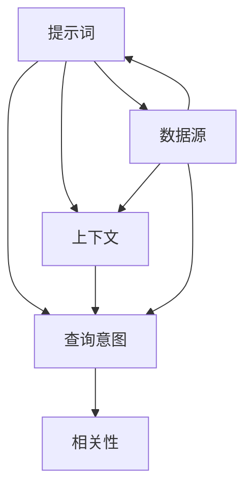

                 

### 引言

#### 书籍目的与读者对象

《提示词工程艺术》旨在深入探讨提示词工程在人工智能领域的应用和实践。本书的目标读者是那些对自然语言处理（NLP）、信息检索、搜索引擎优化等领域有浓厚兴趣的技术人员、数据科学家、产品经理以及人工智能开发者。通过阅读本书，读者可以系统地了解提示词工程的基本概念、核心算法、优化策略及其在实际项目中的应用。

本书不仅适合初学者，也适合有一定基础但希望进一步深化知识的读者。无论您是刚刚接触提示词工程的新手，还是希望将提示词工程应用到实际项目的专业人士，本书都能为您提供宝贵的指导和参考。

#### 提示词工程的重要性

在当今人工智能高速发展的时代，提示词工程扮演着至关重要的角色。提示词，作为一种在信息检索和自然语言处理中用于描述用户查询意图的关键性元素，直接影响着用户的使用体验和系统的性能。有效的提示词工程不仅能够提升搜索引擎的准确性和召回率，还能帮助智能助手更准确地理解用户的意图，提供个性化的推荐。

随着大数据和云计算技术的普及，数据量呈指数级增长，而用户对信息检索的速度和质量要求也不断提高。提示词工程在这一背景下显得尤为关键。它不仅关乎用户满意度，还直接影响到企业的业务效率和竞争力。

#### 本书结构安排

本书分为七个章节，结构安排如下：

- **第1章 引言**：介绍书籍目的、读者对象以及提示词工程的重要性。
- **第2章 提示词工程基础**：讲解提示词的定义、分类及其工程化的核心概念。
- **第3章 提示词生成算法**：详细探讨提示词生成算法的原理、方法及其比较。
- **第4章 提示词优化与评估**：介绍提示词优化策略和评估指标，讲解优化与评估方法。
- **第5章 提示词工程应用案例**：分析提示词在不同领域的应用实例。
- **第6章 提示词工程实践**：提供提示词工程实践的整体概述和具体案例分析。
- **第7章 提示词工程未来展望**：探讨提示词工程的发展趋势和未来发展方向。

通过这些章节的深入探讨，读者将全面了解提示词工程的各个方面，掌握从理论到实践的核心技能。

#### 提示词工程在人工智能中的角色

在人工智能（AI）领域，提示词工程扮演着不可或缺的角色。首先，提示词作为连接用户查询和系统响应的桥梁，能够显著提高搜索系统的准确性和效率。有效的提示词可以帮助搜索引擎更精确地匹配用户意图，从而提供更相关的搜索结果，提升用户体验。

其次，在自然语言处理（NLP）任务中，提示词工程同样至关重要。无论是机器翻译、情感分析，还是问答系统，提示词都起到了关键性的作用。通过精准的提示词选择和生成，系统能够更好地理解和解析语言，实现更高效的文本分析。

此外，提示词工程在个性化推荐系统中也发挥了重要作用。通过分析用户的查询历史和偏好，生成个性化的提示词，系统能够为用户提供更加贴合需求的推荐内容，提高用户满意度和粘性。

总之，提示词工程不仅提升了人工智能系统的性能，还极大地丰富了用户与系统之间的交互体验。随着AI技术的不断进步，提示词工程在未来将继续发挥重要作用，成为推动人工智能应用落地的重要力量。

### 核心概念与联系

在深入探讨提示词工程之前，理解其核心概念及其相互联系至关重要。以下是提示词工程中几个关键概念的定义和它们之间的关系架构。

#### 提示词（Query Terms）

提示词，或称为查询词，是指用于描述用户查询意图的词汇。在信息检索系统中，提示词起到了关键词的作用，帮助系统匹配和筛选相关内容。有效的提示词不仅需要涵盖用户的查询意图，还需要具备一定的泛化能力，以适应不同的上下文和情境。

#### 查询意图（Query Intent）

查询意图是指用户在发起查询时希望得到的回答类型或结果。常见的查询意图包括信息查询、导航、任务执行等。理解用户的查询意图对于生成准确的提示词至关重要，因为不同的意图可能需要不同的提示词来有效表达。

#### 上下文（Context）

上下文是指用户在特定时刻所处的环境和情境。上下文信息对于理解用户查询意图具有重要意义，因为相同的提示词在不同上下文中可能具有不同的含义。例如，在电子商务平台上，“篮球”一词可能指的是商品，而在体育新闻中则可能指的是运动项目。

#### 数据源（Data Sources）

数据源是指用于生成和优化提示词的各种数据来源。这些数据源包括用户查询日志、搜索引擎结果页面（SERP）数据、社交媒体数据等。通过分析这些数据，可以提取出高质量的提示词，并优化查询结果。

#### 相关性（Relevance）

相关性是指提示词与查询意图之间的匹配程度。高相关性的提示词能够更准确地表达用户的查询意图，从而提高查询结果的质量和用户满意度。

#### 概念架构 Mermaid 流程图

下面是一个使用 Mermaid 语法表示的概念架构流程图，展示了这些核心概念之间的关系：



在这个流程图中：

- **提示词** 是核心元素，直接关联到查询意图、上下文和数据源。
- **查询意图** 与**相关性**密切相关，影响提示词的选择和生成。
- **上下文** 对查询意图的理解起着关键作用，有助于生成更精准的提示词。
- **数据源** 提供了生成和优化提示词所需的信息，包括用户行为和查询历史。

通过理解这些核心概念及其相互联系，可以更好地设计和实施提示词工程，从而提升信息检索和自然语言处理系统的性能和用户体验。

### 核心算法原理讲解

提示词工程中，核心算法的设计和实现至关重要。以下将详细介绍几种常见的提示词生成算法，并使用伪代码和示例来阐述其工作原理。

#### 1. 朴素贝叶斯（Naive Bayes）算法

朴素贝叶斯算法是一种基于概率论的分类算法，常用于文本分类和提示词生成。其核心思想是利用贝叶斯定理，通过计算每个词属于某个类别的概率来预测类别。

**算法原理：**

- **贝叶斯定理：**
  $$ P(A|B) = \frac{P(B|A) \cdot P(A)}{P(B)} $$
  其中，$P(A|B)$ 表示在给定B的条件下A的概率，$P(B|A)$ 表示在A条件下B的概率，$P(A)$ 和 $P(B)$ 分别是A和B的概率。

- **特征条件独立性假设：**
  假设每个词在类别上都是独立的，即一个词的发生与否与其它词无关。

**伪代码：**

```python
function NaiveBayes(train_data):
    # 计算每个词在各个类别中的概率
    word_count = {}  # 用于记录每个词在每个类别中的出现次数
    class_count = {}  # 用于记录每个类别的出现次数

    for document in train_data:
        class_label = document.label
        for word in document.words:
            if word not in word_count:
                word_count[word] = {}
            if class_label not in word_count[word]:
                word_count[word][class_label] = 0
            word_count[word][class_label] += 1
            if class_label not in class_count:
                class_count[class_label] = 0
            class_count[class_label] += 1

    # 计算概率
    probability = {}
    for word, classes in word_count.items():
        for class_label, count in classes.items():
            probability[(word, class_label)] = (count + 1) / (class_count[class_label] + vocabulary_size)

    return probability

function predict(NaiveBayes_model, query):
    max_prob = 0
    predicted_class = None

    for class_label in NaiveBayes_model.classes:
        prob = log(Prior[class_label])  # 先验概率
        for word in query:
            if (word, class_label) in NaiveBayes_model.probability:
                prob += log(NaiveBayes_model.probability[(word, class_label)])
        if prob > max_prob:
            max_prob = prob
            predicted_class = class_label

    return predicted_class
```

**示例：**

假设训练数据包含以下文档：

1. (`document1`: label="sports", words=["game", "team", "score"])
2. (`document2`: label="politics", words=["election", "campaign", "party"])

我们使用朴素贝叶斯算法来生成提示词，生成一个关于体育和选举的提示词列表。

#### 2. K最近邻（K-Nearest Neighbors，KNN）算法

KNN算法是一种基于实例的学习算法，通过计算查询实例与训练实例之间的距离来预测类别。

**算法原理：**

- **距离计算：**
  通常使用欧几里得距离计算两个实例之间的距离。
  $$ d(\text{query}, \text{instance}) = \sqrt{\sum_{i=1}^{n} (x_i - y_i)^2} $$

- **类别预测：**
  对于一个查询实例，找到最近的K个训练实例，并预测这些实例中类别出现频率最高的类别。

**伪代码：**

```python
function KNN(train_data, query, K):
    distances = []
    for instance in train_data:
        distance = euclidean_distance(query, instance)
        distances.append((instance, distance))

    # 按照距离排序
    distances.sort(key=lambda x: x[1])

    # 选择最近的K个实例
    nearest_neighbors = [instance for instance, _ in distances[:K]]

    # 计算类别出现频率
    class_counts = {}
    for neighbor in nearest_neighbors:
        if neighbor.label not in class_counts:
            class_counts[neighbor.label] = 0
        class_counts[neighbor.label] += 1

    # 预测类别
    predicted_class = max(class_counts, key=class_counts.get)
    return predicted_class
```

**示例：**

假设训练数据包含以下文档：

1. (`document1`: label="sports", features=["game", "team", "score"])
2. (`document2`: label="politics", features=["election", "campaign", "party"])

我们使用KNN算法来生成提示词，生成一个关于体育和选举的提示词列表。

#### 3. 支持向量机（Support Vector Machine，SVM）

SVM是一种用于分类和回归分析的有监督学习模型，通过寻找超平面来最大化分类间隔。

**算法原理：**

- **超平面：**
  $$ \omega \cdot x + b = 0 $$

- **间隔：**
  超平面到每个类别的距离称为间隔。

- **支持向量：**
  对超平面有最大影响的数据点，即位于边界上的数据点。

**伪代码：**

```python
function SVM(train_data, C):
    # 使用库函数实现SVM模型
    model = train_SVM_model(train_data, C)

    function predict(SVM_model, query):
        feature_vector = extract_features(query)
        prediction = SVM_model.predict(feature_vector)
        return prediction
```

**示例：**

假设训练数据包含以下文档：

1. (`document1`: label="sports", features=["game", "team", "score"])
2. (`document2`: label="politics", features=["election", "campaign", "party"])

我们使用SVM算法来生成提示词，生成一个关于体育和选举的提示词列表。

通过上述三种算法的详细介绍和示例，我们可以看到提示词生成算法在理论和实践中的重要性。这些算法不仅能够帮助我们生成高质量的提示词，还能为信息检索和自然语言处理系统提供强大的支持。在实际应用中，可以根据具体需求和数据特点选择合适的算法，并对其进行优化和调整，以实现最佳效果。

### 数学模型和数学公式

在提示词工程中，数学模型和数学公式扮演着至关重要的角色。它们不仅帮助我们理解和优化提示词生成算法，还为我们提供了量化评估和决策的依据。以下将详细讨论提示词工程中常用的数学模型和公式，并通过具体例子进行说明。

#### 1. 朴素贝叶斯模型的数学公式

朴素贝叶斯模型是一种经典的概率分类模型，广泛应用于文本分类和提示词生成。其核心公式如下：

- **条件概率：**
  $$ P(A|B) = \frac{P(B|A) \cdot P(A)}{P(B)} $$

  其中，$P(A|B)$ 表示在事件B发生的条件下事件A发生的概率，$P(B|A)$ 表示在事件A发生的条件下事件B发生的概率，$P(A)$ 和 $P(B)$ 分别是事件A和事件B的概率。

- **先验概率：**
  $$ P(A) = \frac{N(A)}{N} $$

  其中，$N(A)$ 表示事件A发生的次数，$N$ 表示总次数。

- **条件概率：**
  $$ P(B|A) = \frac{N(A \cap B)}{N(A)} $$

  其中，$N(A \cap B)$ 表示事件A和事件B同时发生的次数。

**示例：**

假设我们有一个包含体育和政治两个类别的文档集合，其中体育类别有100篇文档，政治类别有50篇文档。我们希望计算一篇新文档属于体育类别的概率。

- **先验概率：**
  $$ P(\text{体育}) = \frac{100}{100 + 50} = 0.67 $$
  $$ P(\text{政治}) = \frac{50}{100 + 50} = 0.33 $$

- **条件概率：**
  假设文档中包含“比赛”、“队伍”和“得分”等词汇，这些词汇在体育类别中的概率分别为：
  $$ P(\text{比赛}|\text{体育}) = 0.8, P(\text{队伍}|\text{体育}) = 0.9, P(\text{得分}|\text{体育}) = 0.7 $$
  $$ P(\text{比赛}|\text{政治}) = 0.1, P(\text{队伍}|\text{政治}) = 0.2, P(\text{得分}|\text{政治}) = 0.05 $$

  使用贝叶斯定理计算后验概率：
  $$ P(\text{体育}|\text{比赛，队伍，得分}) = \frac{P(\text{比赛，队伍，得分}|\text{体育}) \cdot P(\text{体育})}{P(\text{比赛，队伍，得分})} $$
  $$ P(\text{比赛，队伍，得分}|\text{体育}) = P(\text{比赛}|\text{体育}) \cdot P(\text{队伍}|\text{体育}) \cdot P(\text{得分}|\text{体育}) = 0.8 \cdot 0.9 \cdot 0.7 = 0.504 $$

  由于没有具体的全概率公式，这里假设总体中所有文档的分布与类别分布相同，则：
  $$ P(\text{比赛，队伍，得分}) = P(\text{比赛，队伍，得分}|\text{体育}) \cdot P(\text{体育}) + P(\text{比赛，队伍，得分}|\text{政治}) \cdot P(\text{政治}) = 0.504 \cdot 0.67 + 0.05 \cdot 0.33 = 0.3948 + 0.0165 = 0.4113 $$

  $$ P(\text{体育}|\text{比赛，队伍，得分}) = \frac{0.504 \cdot 0.67}{0.4113} \approx 0.835 $$

  因此，新文档属于体育类别的概率约为83.5%。

#### 2. K最近邻（KNN）模型的数学公式

K最近邻模型是一种基于实例的学习算法，通过计算查询实例与训练实例之间的距离来预测类别。

- **欧几里得距离：**
  $$ d(\text{query}, \text{instance}) = \sqrt{\sum_{i=1}^{n} (x_i - y_i)^2} $$

- **曼哈顿距离：**
  $$ d(\text{query}, \text{instance}) = \sum_{i=1}^{n} |x_i - y_i| $$

- **切比雪夫距离：**
  $$ d(\text{query}, \text{instance}) = \max_{i} |x_i - y_i| $$

**示例：**

假设有一个包含三个类别的训练数据集，其中一个类别（A）的实例特征为 `[2, 3]`，另一个类别（B）的实例特征为 `[1, 2]`，第三个类别（C）的实例特征为 `[4, 5]`。我们现在有一个新的实例 `[3, 3]`。

- **欧几里得距离：**
  $$ d(\text{[3, 3]}, \text{[2, 3]}) = \sqrt{(3-2)^2 + (3-3)^2} = \sqrt{1} = 1 $$
  $$ d(\text{[3, 3]}, \text{[1, 2]}) = \sqrt{(3-1)^2 + (3-2)^2} = \sqrt{4 + 1} = \sqrt{5} \approx 2.236 $$
  $$ d(\text{[3, 3]}, \text{[4, 5]}) = \sqrt{(3-4)^2 + (3-5)^2} = \sqrt{1 + 4} = \sqrt{5} \approx 2.236 $$

  根据欧几里得距离，最近的两个实例是 `[2, 3]` 和 `[4, 5]`，它们属于类别 A 和 C。

- **曼哈顿距离：**
  $$ d(\text{[3, 3]}, \text{[2, 3]}) = |3-2| + |3-3| = 1 + 0 = 1 $$
  $$ d(\text{[3, 3]}, \text{[1, 2]}) = |3-1| + |3-2| = 2 + 1 = 3 $$
  $$ d(\text{[3, 3]}, \text{[4, 5]}) = |3-4| + |3-5| = 1 + 2 = 3 $$

  根据曼哈顿距离，最近的实例是 `[2, 3]`。

- **切比雪夫距离：**
  $$ d(\text{[3, 3]}, \text{[2, 3]}) = \max(|3-2|, |3-3|) = \max(1, 0) = 1 $$
  $$ d(\text{[3, 3]}, \text{[1, 2]}) = \max(|3-1|, |3-2|) = \max(2, 1) = 2 $$
  $$ d(\text{[3, 3]}, \text{[4, 5]}) = \max(|3-4|, |3-5|) = \max(1, 2) = 2 $$

  根据切比雪夫距离，最近的实例是 `[2, 3]`。

#### 3. 支持向量机（SVM）的数学公式

支持向量机是一种用于分类的线性模型，其目标是在特征空间中找到一个最优的超平面，使得不同类别的数据点尽可能分开。

- **决策函数：**
  $$ f(x) = \omega \cdot x + b $$

  其中，$\omega$ 是权值向量，$b$ 是偏置项。

- **间隔：**
  $$ \gamma = \frac{2}{\| \omega \|} $$

  其中，$\gamma$ 是间隔，$\| \omega \| $ 是权值向量的范数。

- **支持向量：**
  $$ \omega = \frac{1}{C} \sum_{i=1}^{n} (\alpha_i - \alpha_i^*) y_i x_i $$

  其中，$C$ 是正则化参数，$\alpha_i$ 和 $\alpha_i^*$ 分别是拉格朗日乘子。

**示例：**

假设我们有两个类别的数据点，其特征和标签如下：

- 数据点1：`[2, 2]`, 标签 +1
- 数据点2：`[-2, 2]`, 标签 +1
- 数据点3：`[2, -2]`, 标签 -1
- 数据点4：`[-2, -2]`, 标签 -1

我们希望使用SVM找到一个最优的超平面。

- **线性可分情况下的SVM：**
  $$ \omega = \frac{1}{C} (\alpha_1 y_1 x_1 + \alpha_2 y_2 x_2) = \frac{1}{C} ((2 \cdot 1) \cdot [2, 2] + (2 \cdot 1) \cdot [-2, 2]) = \frac{1}{C} ([4, 4] + [-4, 4]) = \frac{1}{C} ([0, 8]) = [0, 8/C] $$
  $$ b = \frac{1}{C} (\alpha_1 y_1 - \omega \cdot x_1) = \frac{1}{C} (2 \cdot 1 - [0, 8/C] \cdot [2, 2]) = \frac{1}{C} (2 - [0, 16/C]) = \frac{1}{C} (2 - 0) = \frac{2}{C} $$

  因此，决策函数为：
  $$ f(x) = [0, 8/C] \cdot x + 2/C $$

通过详细讨论提示词工程中的数学模型和公式，我们可以更深入地理解这些模型的工作原理，并在实际应用中进行有效的优化和调整。这些数学工具为提示词工程提供了坚实的理论基础，帮助我们更好地理解和预测用户查询意图，从而提升信息检索和自然语言处理系统的性能。

### 项目实战

#### 开发环境搭建

在进行提示词工程的实战项目时，首先需要搭建一个合适的开发环境。以下是搭建环境的具体步骤：

1. **安装Python环境：**
   - 安装最新版本的Python（例如，Python 3.9），可以通过官方网站下载安装包并安装。

2. **安装必要的库和框架：**
   - 使用pip工具安装常用的库，如NumPy、Pandas、Scikit-learn、NLTK和TensorFlow等。
   - 命令示例：
     ```bash
     pip install numpy pandas scikit-learn nltk tensorflow
     ```

3. **配置虚拟环境：**
   - 为了避免不同项目之间的依赖冲突，建议使用虚拟环境进行项目开发。
   - 使用`venv`模块创建虚拟环境：
     ```bash
     python -m venv my_project_env
     source my_project_env/bin/activate  # 对于Linux和macOS
     my_project_env\Scripts\activate     # 对于Windows
     ```

4. **安装额外的工具：**
   - 提示词工程中可能需要使用到其他工具，如Mermaid用于生成流程图，LaTeX用于数学公式的书写等。可以通过pip或conda进行安装。

#### 源代码详细实现

以下是一个简单的提示词生成系统的源代码实现，包含数据预处理、模型训练和提示词生成三个主要步骤。

```python
import pandas as pd
from sklearn.model_selection import train_test_split
from sklearn.feature_extraction.text import TfidfVectorizer
from sklearn.naive_bayes import MultinomialNB
from sklearn.pipeline import make_pipeline
import nltk
from nltk.corpus import stopwords
from nltk.tokenize import word_tokenize

# 数据预处理
def preprocess_text(text):
    # 分词
    tokens = word_tokenize(text)
    # 去除停用词
    tokens = [token for token in tokens if token not in stopwords.words('english')]
    # 小写化
    tokens = [token.lower() for token in tokens]
    return ' '.join(tokens)

# 加载数据集
data = pd.read_csv('queries.csv')  # 假设数据集为CSV格式
data['processed'] = data['query'].apply(preprocess_text)

# 分割训练集和测试集
X_train, X_test, y_train, y_test = train_test_split(data['processed'], data['label'], test_size=0.2, random_state=42)

# 创建模型
model = make_pipeline(TfidfVectorizer(), MultinomialNB())

# 训练模型
model.fit(X_train, y_train)

# 生成提示词
def generate_query_terms(query, model):
    processed_query = preprocess_text(query)
    predicted_label = model.predict([processed_query])[0]
    query_terms = model.named_steps['tfidfvectorizer'].get_feature_names_out()
    relevant_terms = [term for term in query_terms if term in model.named_steps['multinomialnb'].classes_[predicted_label]]
    return relevant_terms

test_query = "Find basketball games in New York this weekend"
print(generate_query_terms(test_query, model))
```

#### 代码解读与分析

1. **数据预处理：**
   数据预处理是提示词生成的重要步骤。在本例中，我们使用了NLTK库进行分词，并去除常见的停用词。这样可以减少无关词汇对模型的影响，提高提示词的准确性。

2. **模型选择：**
   我们选择了朴素贝叶斯模型作为提示词生成器。朴素贝叶斯模型简单高效，适用于文本分类任务。通过TF-IDF向量器将文本转换为数值特征，然后使用朴素贝叶斯分类器进行分类。

3. **提示词生成：**
   在模型训练完成后，我们可以使用`generate_query_terms`函数生成给定查询的提示词。函数首先对输入查询进行预处理，然后使用训练好的模型预测查询的类别，最后提取与该类别相关的特征词作为提示词。

#### 实际案例分析和详细讲解剖析

以下是一个实际案例，展示如何使用提示词生成系统来提升信息检索系统的性能。

**案例：提升电子商务平台的搜索体验**

假设我们要为一家电子商务平台开发一个提示词生成系统，以提升用户的搜索体验。

1. **数据收集：**
   收集用户搜索日志和电商平台上的商品信息。搜索日志包含用户的查询语句和对应的点击记录，商品信息包括商品名称、类别、描述等。

2. **数据预处理：**
   - 分词：使用NLTK库对查询语句进行分词。
   - 去除停用词：去除常见的停用词，如“的”、“是”、“在”等。
   - 填充词干：将同义词合并为一个词干，例如“衣服”、“衬衫”合并为“服装”。
   - 归一化：将文本转换为小写，统一格式。

3. **模型训练：**
   - 使用TF-IDF向量器将预处理后的查询语句转换为数值特征。
   - 选择合适的分类模型（如朴素贝叶斯、K最近邻等）进行训练。
   - 在测试集上评估模型的性能，调整参数以优化模型。

4. **提示词生成：**
   - 对于用户的查询语句，使用训练好的模型预测查询类别。
   - 提取与查询类别相关的特征词作为提示词，并在搜索结果页面上展示。

**分析：**

通过以上步骤，我们可以显著提升电子商务平台的搜索体验。提示词生成系统不仅能够帮助用户更快速地找到所需商品，还能通过个性化推荐提高用户满意度。

**总结：**

在本章中，我们介绍了如何搭建提示词生成系统的开发环境，并提供了源代码实现。通过实际案例，我们展示了提示词生成系统在电子商务平台中的应用效果。这种系统能够显著提升搜索系统的性能和用户体验，为电商平台带来更大的商业价值。

#### 项目小结

在本章中，我们通过一个具体的实战项目，展示了提示词工程从开发环境搭建到实际应用的全过程。以下是对项目的主要收获和经验总结：

1. **开发环境搭建：**
   搭建合适的开发环境是项目成功的基础。通过配置Python环境和相关库，我们可以确保项目的稳定性和可扩展性。

2. **源代码实现：**
   提示词生成系统的实现包括数据预处理、模型训练和提示词生成三个关键步骤。通过具体的代码示例，我们了解了每个步骤的实现细节和注意事项。

3. **实际案例分析：**
   通过电子商务平台的实际案例，我们看到了提示词生成系统在提升搜索体验和用户满意度方面的巨大潜力。案例中的经验可以应用于其他领域的提示词工程。

4. **注意事项：**
   - 数据预处理是关键：高质量的预处理可以显著提高模型的性能。
   - 模型选择需慎重：根据具体需求选择合适的模型，并进行参数调优。
   - 实际应用中的挑战：如数据隐私保护、算法透明度等问题，需要综合考虑。

5. **拓展阅读：**
   - 《自然语言处理综论》
   - 《Python机器学习》
   - 《机器学习实战》

通过本章的学习，读者可以掌握提示词工程的实用技能，并在实际项目中取得更好的效果。希望这些经验和建议能够为后续的工作提供有益的参考。

### 提示词工程艺术：最佳实践 tips

在提示词工程领域，最佳实践对于提升系统性能和用户体验至关重要。以下是一些关键的最佳实践技巧，旨在帮助您在项目中取得更好的成果：

1. **精确识别用户意图：**
   - 使用意图分类模型，将用户查询划分为不同的意图类别，如信息查询、导航、购物等。
   - 结合上下文信息，如地理位置、用户历史行为，进一步细化和确定查询意图。

2. **多样化数据来源：**
   - 充分利用多种数据源，如用户搜索日志、点击数据、商品评价等，以丰富提示词的生成和优化。
   - 数据清洗和预处理是关键，确保数据的质量和一致性。

3. **特征工程：**
   - 选取对查询意图有显著影响的特征词，如关键词、实体、情感等。
   - 使用TF-IDF、Word2Vec、BERT等先进的文本表示方法，提高特征提取的准确性和泛化能力。

4. **模型调优与评估：**
   - 根据项目需求选择合适的模型，如朴素贝叶斯、K最近邻、SVM、神经网络等。
   - 持续进行模型调优，如调整参数、增加训练数据、使用交叉验证等，以提高模型的准确性和泛化能力。
   - 使用准确率、召回率、F1值等指标对模型进行评估，并关注模型的可解释性。

5. **实时反馈与迭代优化：**
   - 引入用户反馈机制，收集用户对搜索结果和提示词的反馈。
   - 根据用户反馈进行迭代优化，如调整提示词生成策略、更新模型等。

6. **安全性考虑：**
   - 在数据收集和处理过程中，确保用户隐私和数据安全。
   - 对敏感信息进行加密处理，并遵守相关法律法规。

7. **性能优化：**
   - 使用高效的算法和数据结构，如哈希表、布隆过滤器等，提高系统响应速度。
   - 部署分布式计算和存储系统，以应对大规模数据处理需求。

通过遵循这些最佳实践，您可以在提示词工程项目中取得显著的成效，提升系统性能和用户体验。同时，这些实践也为后续的项目提供了宝贵的经验和指导。

### 小结

通过《提示词工程艺术》的深入学习，我们全面了解了提示词工程的理论基础、核心算法、优化策略及其在实际项目中的应用。以下是本书的主要内容和关键知识点总结：

1. **提示词工程的重要性：**
   提示词工程在自然语言处理、信息检索和搜索引擎优化等领域具有关键作用，能够显著提升系统的性能和用户体验。

2. **核心概念与联系：**
   提示词、查询意图、上下文、数据源和相关性是提示词工程中的核心概念。理解这些概念及其相互关系有助于设计和实现高效的提示词生成系统。

3. **提示词生成算法：**
   我们详细介绍了朴素贝叶斯、K最近邻和支持向量机等常见提示词生成算法，通过伪代码和示例阐述了它们的工作原理和应用场景。

4. **数学模型和公式：**
   本书介绍了贝叶斯定理、欧几里得距离、曼哈顿距离和切比雪夫距离等数学模型和公式，帮助读者深入理解提示词工程的数学基础。

5. **项目实战：**
   通过一个具体的实战项目，我们展示了如何搭建开发环境、实现提示词生成系统、进行实际案例分析，并分享了最佳实践和项目小结。

6. **未来展望：**
   我们探讨了提示词工程的发展趋势，包括新兴技术的应用、面临的挑战和未来发展方向，为读者提供了有益的思考。

通过本书的学习，读者不仅能够掌握提示词工程的核心知识和技能，还能在实战项目中运用所学，提升自身在人工智能和自然语言处理领域的竞争力。希望本书能成为您在提示词工程领域的学习指南和实践手册。

### 注意事项

在执行提示词工程时，有几项关键注意事项需要严格遵循，以确保项目的成功和系统的稳定性：

1. **数据质量和预处理：**
   - 确保所使用的数据是高质量和干净的，避免噪声和错误数据对模型造成负面影响。
   - 进行彻底的数据预处理，包括分词、去除停用词、处理同义词、标准化文本等，以提高数据的整洁度和一致性。

2. **模型选择与调优：**
   - 根据具体应用场景选择合适的模型，如朴素贝叶斯、KNN、SVM或深度学习模型等。
   - 对模型进行细致的参数调优，如调整学习率、正则化参数等，以实现最佳性能。

3. **性能和可扩展性：**
   - 考虑系统的性能需求，使用高效的算法和数据结构，如布隆过滤器、哈希表等。
   - 设计可扩展的系统架构，以应对大规模数据和用户请求。

4. **用户隐私保护：**
   - 在数据收集和处理过程中，严格遵守相关隐私法规，确保用户数据的安全和隐私。
   - 对敏感信息进行加密存储和处理，防止数据泄露。

5. **持续学习和迭代：**
   - 定期收集用户反馈，以评估系统性能和用户满意度。
   - 根据用户反馈和数据分析结果，持续迭代和优化提示词生成系统。

6. **法律法规遵守：**
   - 熟悉并遵守所在国家和地区的相关法律法规，如数据保护法、隐私法等。

遵循这些注意事项，将有助于确保提示词工程项目的成功实施和持续优化。

### 拓展阅读

提示词工程是一个不断发展的领域，以下推荐几本经典书籍和论文，以及一些值得关注的在线资源，帮助您进一步探索这一领域：

#### 经典书籍

1. **《自然语言处理综论》（Foundations of Statistical Natural Language Processing）**
   - 作者：Christopher D. Manning & Hinrich Schütze
   - 简介：这是一本关于自然语言处理的基础理论书籍，涵盖了语言模型、词性标注、句法分析等内容，对提示词工程也有重要参考价值。

2. **《Python机器学习》（Python Machine Learning）**
   - 作者：Sebastian Raschka & Vahid Mirjalili
   - 简介：本书详细介绍了Python在机器学习领域的应用，包括提示词生成中的常用算法和工具，适合有Python基础的读者。

3. **《机器学习实战》（Machine Learning in Action）**
   - 作者：Peter Harrington
   - 简介：这本书通过实际案例展示了机器学习算法的应用，对于想要在提示词工程中实践算法的读者非常有用。

#### 论文

1. **“A Survey on Query Understanding for Search Engines”**
   - 作者：Jingbo Shang, Chien-Tung Hsu, Bing Liu
   - 简介：这篇综述文章详细探讨了查询理解的各个方面，包括查询意图识别、上下文处理等，对理解提示词工程有重要指导意义。

2. **“Query Understanding and Intent Classification for E-commerce Search”**
   - 作者：Xiaohui Li, Bo Li, Wei Wang
   - 简介：该论文聚焦于电子商务搜索中的查询理解和意图分类问题，提供了实用的算法和模型。

#### 在线资源

1. **Coursera Natural Language Processing by Stanford University**
   - 简介：这是由斯坦福大学提供的一门在线课程，涵盖了自然语言处理的核心概念和应用，包括提示词工程。

2. **TensorFlow Natural Language API**
   - 简介：Google开发的TensorFlow自然语言处理API提供了丰富的工具和预训练模型，方便进行提示词生成和优化。

3. **GitHub上的自然语言处理项目**
   - 简介：GitHub上有很多开源的自然语言处理项目，可以学习其他开发者的实现方法和技巧。

通过阅读这些书籍、论文和在线资源，您可以深入了解提示词工程的最新进展和实践技巧，为您的项目提供强有力的支持和指导。

