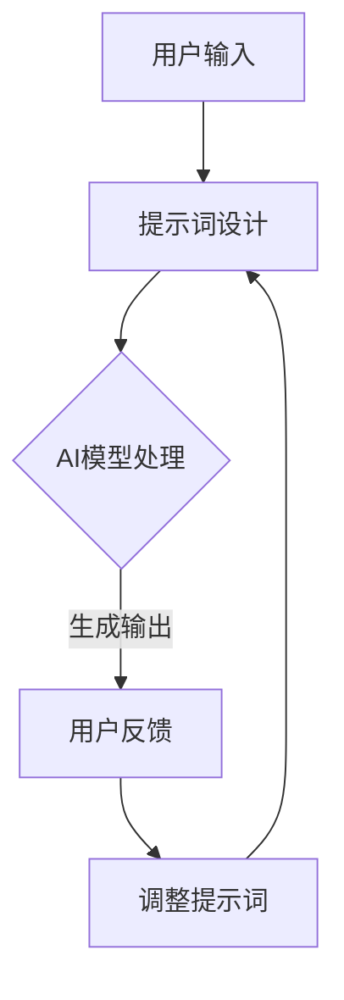
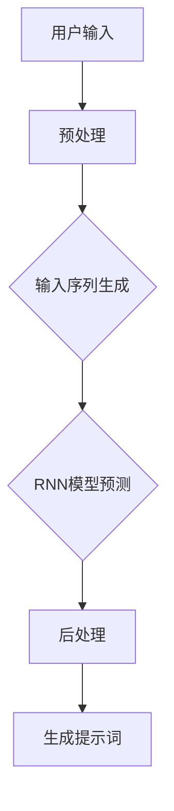

                 

### 提示词工程：AI与人类协作的新范式

在当前人工智能（AI）迅猛发展的时代，提示词工程（Prompt Engineering）作为一门新兴的技术，正逐步成为AI与人类协作的新范式。本文旨在探讨提示词工程的定义、核心概念、算法原理、数学模型以及项目实战，帮助读者深入了解这一领域。

**关键词**：提示词工程，AI与人类协作，算法原理，数学模型，项目实战

**摘要**：本文首先介绍了提示词工程的基本概念及其在AI领域的重要性，随后详细阐述了AI与人类协作的基本原理，并通过Mermaid流程图展示了二者之间的联系。接着，文章深入解析了提示词工程的核心算法，以伪代码的形式进行了说明，并介绍了相关的数学模型和公式。最后，通过实际项目案例，本文展示了提示词工程在现实中的应用，包括开发环境搭建、源代码实现、代码解读和分析等内容。通过本文的阅读，读者将全面了解提示词工程的基本知识和实际应用。

### 1.1 提示词工程的基本概念

提示词工程，顾名思义，是对提示词进行设计和优化的过程。提示词（Prompt）在AI领域中起到引导和激励模型生成预期的输出或行为的作用。不同于传统的编程指令，提示词更注重与人类自然语言的交互，以提高AI模型在特定任务上的性能和可解释性。

提示词工程的目标是通过系统化的方法设计出能够有效引导AI模型学习的提示词，使得模型能够更准确地理解人类的意图，并生成更符合预期的结果。这一过程涉及到自然语言处理（NLP）、机器学习（ML）、认知科学等多个领域的知识。

在AI领域，提示词工程的重要性不言而喻。首先，优秀的提示词能够提高AI模型的性能，使得模型在处理复杂任务时更加高效和准确。其次，提示词有助于提高AI模型的可解释性，使得人类能够更直观地理解模型的工作原理和决策过程，从而增强用户对AI系统的信任度。最后，提示词工程为AI系统的开发提供了新的思路和方法，有助于实现AI与人类更加紧密的协作。

### 1.2 AI与人类协作的重要性

AI与人类的协作在当前技术和经济环境中具有重大意义。随着AI技术的不断发展，AI系统已经能够在许多领域（如医疗、金融、教育等）提供高效的服务和解决方案。然而，AI系统在处理复杂任务时仍存在一定的局限性，需要人类的辅助和指导。

首先，AI系统在处理不确定性任务时常常表现出不足。尽管AI模型能够通过大量数据进行训练，但它们在面对未知或异常情况时可能无法做出正确的决策。此时，人类的经验和判断力能够为AI系统提供重要的参考，帮助它们更好地应对不确定性。

其次，AI系统在理解和生成自然语言方面仍有很大的提升空间。尽管自然语言处理技术取得了显著进展，但AI系统在理解人类语言的情感、语境和细微差异方面仍存在不足。通过人类与AI系统的协作，可以充分利用人类对自然语言的理解能力，提高AI系统在处理自然语言任务时的准确性和流畅性。

此外，AI与人类的协作还能够促进创新和进步。人类具有独特的创造力和想象力，能够提出新的问题和解决方案。而AI系统则具备强大的计算能力和数据处理能力，能够快速分析和处理大量的数据，为人类提供有价值的洞察和建议。通过二者的协作，可以加速科学研究和工程技术的创新进程。

总之，AI与人类的协作不仅能够弥补AI系统在处理复杂任务时的不足，还能够发挥人类的创造力和想象力，实现更加高效、智能的解决方案。在当前和未来，AI与人类协作将成为实现科技和社会发展的重要途径。

### 1.3 提示词工程的发展历程

提示词工程作为AI领域的一个重要分支，其发展历程可以追溯到人工智能的早期研究。最初，AI研究人员主要关注如何构建和训练能够模拟人类智能的模型。在这个阶段，提示词的概念尚未明确提出，但已经存在类似的思想。例如，早期的问题回答系统使用预设的规则和模板来生成回答，这些规则和模板可以被视为一种简单的提示词。

随着自然语言处理（NLP）技术的进步，研究人员开始意识到提示词在指导模型生成预期输出方面的重要性。1990年代，随着统计方法和神经网络技术的发展，提示词工程逐渐形成了一门独立的学科。这一阶段的重要成果包括基于模板的提示词设计方法和基于机器学习的提示词优化算法。

进入21世纪，深度学习技术的发展为提示词工程带来了新的机遇。深度学习模型具有强大的表征能力，能够通过大量数据自动学习复杂的模式和关系。这一特性使得提示词工程得以在更广泛的场景中得到应用。例如，在对话系统、文本生成、机器翻译等领域，优秀的提示词设计能够显著提高模型的性能和用户体验。

近年来，随着生成对抗网络（GAN）、变分自编码器（VAE）等新型深度学习模型的出现，提示词工程也在不断演进。这些模型通过引入生成对抗机制和自编码结构，进一步增强了模型的生成能力和鲁棒性。同时，多模态学习、强化学习等新兴领域也为提示词工程带来了新的研究方向。

总体而言，提示词工程的发展历程反映了人工智能领域从早期的研究到当前的快速发展。随着技术的不断进步，提示词工程在未来有望在更多领域发挥重要作用，推动AI与人类协作迈向新的高度。

### 2.1 AI的基本原理

人工智能（AI）是一种通过模拟人类智能行为的技术，旨在让计算机系统具备学习、推理、规划和问题解决等能力。AI的基本原理主要涉及以下几个方面：

首先，学习是AI的核心概念之一。AI系统通过学习算法从数据中提取知识和模式，以便在新的情境中做出合理的决策。学习过程可以分为监督学习、无监督学习和强化学习。监督学习通过已标记的数据训练模型，无监督学习则无需标记数据，旨在发现数据中的隐藏结构，而强化学习通过与环境的交互来学习最优策略。

其次，推理是AI系统中另一个关键概念。推理是指利用已有知识进行逻辑推断和决策的过程。在AI中，推理可以基于规则、模型或混合方法。例如，基于规则的推理系统通过预定义的规则库来处理新情况，而基于模型的推理系统则使用机器学习模型来生成决策。

第三，AI系统通常涉及多种算法和技术，如神经网络、决策树、支持向量机（SVM）等。这些算法和技术各自具有不同的优势和适用场景。神经网络，特别是深度神经网络（DNN），因其强大的表征能力，在图像识别、语音识别和自然语言处理等领域得到了广泛应用。决策树和SVM等传统机器学习算法则更适合处理分类和回归问题。

最后，AI系统在构建过程中需要大量数据、计算资源和算法优化。数据是AI系统的基石，高质量的数据能够显著提高模型的性能和泛化能力。计算资源则是支撑大规模模型训练和推理的重要保障。算法优化包括模型架构设计、超参数调优和训练策略改进等，旨在提高模型的效率和效果。

总之，AI的基本原理涉及学习、推理和多种算法技术的综合运用，其发展不断推动着人工智能技术的进步和应用。

### 2.2 人类认知模型

人类认知模型是研究人类如何获取、处理和利用信息的一种理论框架，它旨在模拟和解释人类的思维过程。人类认知模型通常包含感知、记忆、思维和决策等核心组成部分。

首先，感知是人类获取外部信息的过程。通过视觉、听觉、嗅觉、味觉和触觉等感官系统，人类能够感知环境中的各种刺激。感知过程中，信息经过感觉器官的接收和初步处理，然后传递到大脑进行处理。

其次，记忆是人类存储和提取信息的能力。记忆分为短期记忆和长期记忆。短期记忆负责暂时存储和处理信息，例如，记住一段电话号码。长期记忆则负责存储持久的信息，如学习知识或经历。记忆过程中，信息的编码、存储和检索机制至关重要。

思维是人类的高级认知活动，包括逻辑推理、问题解决、创新和语言理解等。思维过程中，大脑通过复杂的神经网络和认知算法来处理信息，形成新的认知结构和解决方案。

最后，决策是人类基于思维和记忆过程做出的选择。决策过程中，个体需要评估各种选择的利弊，权衡不同目标，并选择最优方案。人类决策模型通常包含目标设定、信息收集、方案评估和选择等步骤。

总体而言，人类认知模型为理解人类思维提供了理论框架，这对于设计能够与人类智能协作的AI系统具有重要意义。通过模拟这些认知过程，AI系统能够更好地理解和响应人类的意图和行为。

### 2.3 AI与人类协作的Mermaid流程图

为了更好地理解AI与人类协作的过程，我们可以使用Mermaid流程图来展示这一流程。以下是AI与人类协作的基本步骤：



**流程说明**：

1. **用户输入**：用户通过输入问题、命令或数据来启动交互过程。
2. **提示词设计**：基于用户输入，系统设计或生成适当的提示词，以引导AI模型进行相应处理。
3. **AI模型处理**：AI模型接收提示词，并利用其学习到的知识和算法进行数据处理和生成输出。
4. **用户反馈**：用户根据输出结果提供反馈，包括评价、修正或补充信息。
5. **调整提示词**：根据用户反馈，系统调整提示词，以提高AI模型的处理效果。

这一流程图清晰地展示了AI与人类协作的动态交互过程，有助于理解二者之间的紧密联系和协同作用。

### 3.1 提示词生成算法

提示词生成算法是提示词工程中的核心组成部分，其目标是设计或生成能够有效引导AI模型学习的高质量提示词。以下是几种常见的提示词生成算法及其原理：

#### 1. 基于模板的提示词生成

基于模板的提示词生成是一种简单但有效的算法。它通过预定义的模板和用户输入来生成提示词。模板通常包含关键词、问题类型和上下文信息等。例如，一个模板可能如下所示：

```
问题：什么是[关键词]？
上下文：在[背景信息]的背景下，请解释[关键词]的定义。
```

用户输入“人工智能”后，算法将生成如下提示词：

```
问题：什么是人工智能？
上下文：在当今科技发展的背景下，请解释人工智能的定义。
```

#### 2. 基于机器学习的提示词生成

基于机器学习的提示词生成算法利用大量已标记的数据进行训练，从而学习到如何生成高质量的提示词。这种算法通常涉及以下步骤：

1. **数据准备**：收集大量带有高质量提示词的数据集。
2. **特征提取**：从数据中提取与提示词生成相关的特征，如关键词、语义关系和语法结构。
3. **模型训练**：使用特征数据训练机器学习模型，如循环神经网络（RNN）或变压器（Transformer）。
4. **提示词生成**：输入用户输入，模型生成相应的提示词。

例如，一个简单的RNN模型可能如下所示：

```python
# 伪代码：基于RNN的提示词生成

# 输入：用户输入文本
# 输出：生成的提示词

def generate_prompt(user_input):
    # 预处理用户输入，提取特征
    features = preprocess_input(user_input)
    
    # 使用训练好的RNN模型生成提示词
    prompt = rnn_model.predict(features)
    
    # 后处理提示词，例如添加上下文或关键词
    final_prompt = postprocess_prompt(prompt)
    
    return final_prompt
```

#### 3. 基于生成对抗网络（GAN）的提示词生成

生成对抗网络（GAN）是一种强大的生成模型，它通过两个神经网络（生成器和判别器）的对抗训练生成高质量的提示词。GAN的基本原理如下：

1. **生成器**：生成器网络接收随机噪声作为输入，生成高质量的提示词。
2. **判别器**：判别器网络判断输入的提示词是真实还是伪造的。
3. **对抗训练**：生成器和判别器通过不断调整参数进行对抗训练，生成器逐渐提高生成提示词的质量，而判别器逐渐提高区分真实和伪造提示词的能力。

GAN模型的训练过程可以表示为：

```python
# 伪代码：GAN训练过程

# 输入：噪声数据
# 输出：优化的生成器和判别器

for epoch in range(num_epochs):
    # 生成器生成提示词
    generated_prompt = generator(noise)
    
    # 计算判别器损失
    real_loss = discriminator_loss(real_prompt, real_labels)
    fake_loss = discriminator_loss(generated_prompt, fake_labels)
    total_loss = real_loss + fake_loss
    
    # 更新判别器参数
    discriminator_optimizer.zero_grad()
    total_loss.backward()
    discriminator_optimizer.step()
    
    # 生成器生成提示词
    generated_prompt = generator(noise)
    
    # 计算生成器损失
    generator_loss = generator_loss(generated_prompt, real_labels)
    
    # 更新生成器参数
    generator_optimizer.zero_grad()
    generator_loss.backward()
    generator_optimizer.step()
```

通过上述算法，提示词生成过程可以从简单的模板设计到复杂的机器学习模型，再到强大的生成对抗网络，从而实现高质量提示词的生成。

### 3.2 伪代码说明

以下是一个简化的伪代码示例，用于说明如何设计一个基于机器学习的提示词生成算法。这个算法的核心是利用一个训练好的循环神经网络（RNN）来生成高质量的提示词。

```python
# 伪代码：基于RNN的提示词生成算法

# 导入必要的库
import numpy as np
import tensorflow as tf

# 定义RNN模型
class RNNModel(tf.keras.Model):
    def __init__(self, vocab_size, embedding_dim, hidden_dim):
        super().__init__()
        self.embedding = tf.keras.layers.Embedding(vocab_size, embedding_dim)
        self.rnn = tf.keras.layers.LSTM(hidden_dim)
        self.dense = tf.keras.layers.Dense(vocab_size)

    def call(self, inputs, training=False):
        x = self.embedding(inputs)
        x = self.rnn(x, training=training)
        x = self.dense(x)
        return x

# 创建训练数据集
train_data = ...

# 预处理数据
X_train, y_train = preprocess_data(train_data)

# 初始化模型和优化器
model = RNNModel(vocab_size, embedding_dim, hidden_dim)
optimizer = tf.keras.optimizers.Adam(learning_rate)

# 训练模型
for epoch in range(num_epochs):
    for x, y in zip(X_train, y_train):
        with tf.GradientTape() as tape:
            predictions = model(x, training=True)
            loss = loss_function(predictions, y)
        gradients = tape.gradient(loss, model.trainable_variables)
        optimizer.apply_gradients(zip(gradients, model.trainable_variables))

# 提示词生成函数
def generate_prompt(user_input, model):
    # 预处理用户输入
    input_sequence = preprocess_input(user_input)
    
    # 生成提示词
    prompt = model.predict(input_sequence)
    
    # 后处理提示词
    final_prompt = postprocess_prompt(prompt)
    
    return final_prompt

# 示例：生成一个提示词
user_input = "如何提高工作效率？"
generated_prompt = generate_prompt(user_input, model)
print(generated_prompt)
```

在这个伪代码中，我们定义了一个RNN模型，并使用一个训练好的模型来生成提示词。预处理和后处理函数用于处理输入和输出数据，使得模型能够更好地理解和生成高质量的提示词。

### 3.3 算法流程图

为了更好地理解基于机器学习的提示词生成算法的工作流程，我们可以使用流程图来展示。以下是一个简化的算法流程图：



**流程说明**：

1. **用户输入**：用户输入一个问题或命令。
2. **预处理**：对用户输入进行预处理，提取关键词和上下文信息。
3. **输入序列生成**：将预处理后的输入转化为RNN模型可以处理的输入序列。
4. **RNN模型预测**：使用训练好的RNN模型对输入序列进行预测，生成提示词。
5. **后处理**：对生成的提示词进行后处理，例如添加上下文或关键词。
6. **生成提示词**：输出最终的提示词。

通过这个流程图，我们可以清晰地看到提示词生成算法的各个步骤和它们之间的逻辑关系。

### 4.1 相关数学模型介绍

在提示词工程中，数学模型扮演着至关重要的角色，用于描述和优化AI模型的学习过程。以下是几种常用的数学模型，包括神经网络模型、生成对抗网络（GAN）和变分自编码器（VAE）等。

#### 1. 神经网络模型

神经网络模型是AI和机器学习中最基本的模型之一。它由多个神经元（或节点）组成的层结构构成，每层神经元接收前一层的输出，并通过激活函数进行处理，最终输出结果。常见的神经网络模型包括：

- **多层感知机（MLP）**：一种全连接的多层神经网络，常用于分类和回归任务。
- **卷积神经网络（CNN）**：特别适用于图像处理任务，通过卷积操作提取图像特征。
- **循环神经网络（RNN）**：适用于序列数据，能够处理长短时依赖关系。

神经网络模型的数学表示通常涉及以下几个关键组件：

- **权重矩阵（W）**：表示不同层神经元之间的连接强度。
- **偏置向量（b）**：每个神经元的偏置项。
- **激活函数（f）**：用于将线性组合的输入转换为非线性输出，如Sigmoid、ReLU和Tanh。

#### 2. 生成对抗网络（GAN）

生成对抗网络（GAN）是一种由生成器和判别器组成的对抗性模型。生成器的目标是生成逼真的数据，而判别器的目标是区分生成数据与真实数据。GAN的数学模型包括以下核心组件：

- **生成器（G）**：输入随机噪声，通过一系列变换生成假数据。
- **判别器（D）**：输入数据和生成数据，输出概率分布，判断数据的真假。

GAN的训练过程是一个动态博弈过程，通过不断调整生成器和判别器的参数，使得生成器生成的数据越来越接近真实数据。GAN的数学表示涉及损失函数、梯度下降和优化算法等。

#### 3. 变分自编码器（VAE）

变分自编码器（VAE）是一种基于概率模型的编码器-解码器架构，旨在学习数据的概率分布。VAE的核心组件包括：

- **编码器（Encoder）**：输入数据，输出潜在变量和编码参数。
- **解码器（Decoder）**：输入潜在变量，生成重构数据。

VAE通过最大化数据概率分布的对数似然来训练模型，其数学表示涉及潜在变量概率分布、重参数化和反向传播等。

#### 4. 贝叶斯网络和马尔可夫模型

贝叶斯网络和马尔可夫模型是概率图形模型，用于描述变量之间的依赖关系。贝叶斯网络通过条件概率表（CP表）描述变量之间的条件依赖，而马尔可夫模型则通过转移概率矩阵描述变量之间的状态转移关系。这些模型在提示词工程中可用于推理和不确定性处理。

#### 5. 强化学习模型

强化学习模型，如Q学习、SARSA和深度强化学习（DRL），用于在动态环境中进行决策和优化。强化学习模型通过学习奖励函数和价值函数来选择最优动作序列，其数学表示涉及状态-动作价值函数和策略优化。

总之，这些数学模型为提示词工程提供了强大的工具，用于描述和优化AI模型的学习过程。通过结合这些模型，我们可以设计出更加高效和灵活的提示词生成算法，从而推动AI与人类协作的进一步发展。

### 4.2 数学公式详细讲解

在提示词工程中，数学公式是描述和优化算法的重要工具。以下将详细介绍一些常用的数学公式及其在提示词工程中的应用。

#### 1. 神经网络激活函数

神经网络中的激活函数是连接神经元之间的非线性转换，常见的激活函数包括：

- **Sigmoid函数**：$f(x) = \frac{1}{1 + e^{-x}}$
  - **应用**：用于二分类问题，输出概率值。
- **ReLU函数**：$f(x) = max(0, x)$
  - **应用**：引入非线性，加速训练过程。
- **Tanh函数**：$f(x) = \frac{e^x - e^{-x}}{e^x + e^{-x}}$
  - **应用**：减少内部协变量偏移。

#### 2. 交叉熵损失函数

交叉熵损失函数是神经网络训练中最常用的损失函数之一，用于衡量模型预测与真实标签之间的差异。其公式如下：

$$
L = -\sum_{i} y_i \log(p_i)
$$

其中，$y_i$ 是真实标签，$p_i$ 是模型预测的概率。

- **应用**：用于分类问题，最小化交叉熵损失函数能够使模型预测更接近真实标签。

#### 3. 生成对抗网络（GAN）损失函数

生成对抗网络（GAN）中的损失函数用于指导生成器和判别器的训练过程。GAN的损失函数包括：

- **生成器损失**：最小化生成器生成的假数据与真实数据之间的差异，其公式如下：

$$
L_G = -\log(D(G(z)))
$$

其中，$D$ 是判别器，$G(z)$ 是生成器生成的假数据。

- **判别器损失**：最大化判别器对真实数据和假数据的区分能力，其公式如下：

$$
L_D = -[\log(D(x)) + \log(1 - D(G(z))]
$$

其中，$x$ 是真实数据。

#### 4. 变分自编码器（VAE）损失函数

变分自编码器（VAE）的损失函数包括重建损失和KL散度损失：

- **重建损失**：最小化重构数据与原始数据之间的差异，其公式如下：

$$
L_{\text{recon}} = -\sum_{i} \sum_{j} x_i \log(q_{\phi}(x_i | \mu_i, \sigma_i))
$$

其中，$q_{\phi}(x_i | \mu_i, \sigma_i)$ 是生成器的概率分布。

- **KL散度损失**：确保编码器学习数据的概率分布，其公式如下：

$$
L_{\text{KL}} = \sum_{i} D_{\text{KL}}(q_{\phi}(\mu_i, \sigma_i) || p(\mu_i, \sigma_i))
$$

其中，$D_{\text{KL}}$ 是KL散度，$p(\mu_i, \sigma_i)$ 是先验分布。

#### 5. 强化学习中的价值函数

强化学习中的价值函数用于评估状态-动作对的价值，常见的价值函数包括：

- **Q值**：$Q(s, a) = r + \gamma \max_{a'} Q(s', a')$
  - **应用**：用于评估某个状态-动作对的预期回报。

- **状态值函数**：$V(s) = \max_{a} Q(s, a)$
  - **应用**：用于评估某个状态的预期回报。

- **策略值函数**：$π(a|s) = \frac{e^{Q(s, a)}}{\sum_{a'} e^{Q(s, a')}}$
  - **应用**：用于评估最优策略。

通过这些数学公式，我们可以更精确地描述和优化提示词工程中的算法，从而提高模型性能和鲁棒性。

### 4.3 实例说明

为了更好地理解上述数学公式的应用，我们可以通过实际例子来说明它们在提示词工程中的具体作用。

#### 1. Sigmoid函数应用示例

假设我们使用Sigmoid函数作为神经网络的激活函数，对于输入向量$x = [1, 2, 3]$，我们可以计算每个神经元的输出：

$$
f(x) = \frac{1}{1 + e^{-x}}
$$

对于每个元素：

$$
f(1) = \frac{1}{1 + e^{-1}} \approx 0.7311
$$

$$
f(2) = \frac{1}{1 + e^{-2}} \approx 0.8808
$$

$$
f(3) = \frac{1}{1 + e^{-3}} \approx 0.9502
$$

Sigmoid函数将线性输入映射到(0, 1)区间，适合用于二分类问题，例如预测一个文本是否包含特定关键词。

#### 2. 交叉熵损失函数示例

假设我们有一个二分类问题，真实标签$y = [1, 0]$，模型预测的概率分布$p = [0.7, 0.3]$，我们可以计算交叉熵损失：

$$
L = -[y_1 \log(p_1) + y_2 \log(p_2)] = -[1 \cdot \log(0.7) + 0 \cdot \log(0.3)]
$$

$$
L \approx -[1 \cdot (-0.3567) + 0 \cdot (-1.204)]
$$

$$
L \approx 0.3567
$$

交叉熵损失函数度量了预测概率与真实标签之间的不一致程度，值越小表示预测越准确。

#### 3. GAN损失函数示例

假设我们有一个生成对抗网络（GAN），生成器生成的假数据概率分布为$p_G = [0.6, 0.4]$，判别器对假数据的概率为$D(G(z)) = 0.55$。我们可以计算生成器和判别器的损失：

$$
L_G = -\log(D(G(z))) = -\log(0.55) \approx 0.6430
$$

$$
L_D = \log(D(x)) + \log(1 - D(G(z))) = \log(0.8) + \log(0.45) \approx 0.2231 + 0.6532 = 0.8763
$$

这些损失函数用于指导生成器和判别器的训练，使得生成器生成的假数据越来越逼真，而判别器能够更好地区分真实和假数据。

#### 4. VAE损失函数示例

假设变分自编码器（VAE）的编码器输出潜在变量$\mu = [2.0, 3.0]$，标准差$\sigma = [0.5, 0.5]$，原始数据$x = [1.0, 2.0]$，先验分布$p(\mu, \sigma) = N(0, 1)$。我们可以计算VAE的损失：

$$
L_{\text{recon}} = -\sum_{i} x_i \log(q_{\phi}(x_i | \mu_i, \sigma_i)) = -[1 \cdot \log(0.5) + 2 \cdot \log(0.5)] \approx -[1 \cdot (-0.6931) + 2 \cdot (-0.6931)] = 0.9430
$$

$$
L_{\text{KL}} = \sum_{i} D_{\text{KL}}(q_{\phi}(\mu_i, \sigma_i) || p(\mu_i, \sigma_i)) = \sum_{i} \frac{(\mu_i^2 + \sigma_i^2 - 2\mu_i^2 - 2\sigma_i^2 + 2\log(\sigma_i^2))}{2} = \frac{(2^2 + 3^2 - 2\cdot2^2 - 2\cdot3^2 + 2\cdot\log(0.5^2))}{2} \approx -1.0986
$$

$$
L = L_{\text{recon}} + \beta \cdot L_{\text{KL}} = 0.9430 + 0.1 \cdot (-1.0986) = 0.7435
$$

VAE损失函数用于优化编码器和解码器的参数，使得重构数据接近原始数据，同时确保潜在变量的概率分布符合先验分布。

通过这些实例，我们可以看到数学公式在提示词工程中的应用，以及如何通过损失函数优化模型性能。

### 第5章：项目实战介绍

#### 5.1 实际案例背景

本节将通过一个实际案例——智能客服系统，来介绍如何搭建和实现一个基于提示词工程的AI系统。智能客服系统旨在为用户提供高效、自然的互动体验，通过自动化的方式回答用户的问题和解决常见问题。

**项目需求**：

1. **问题回答**：系统能够自动识别用户提出的问题，并生成高质量的回答。
2. **多轮对话**：系统能够处理多轮对话，理解用户的上下文信息和意图。
3. **多领域支持**：系统需支持多个领域（如电商、金融、医疗等）的问题回答。

**技术选型**：

1. **自然语言处理（NLP）**：采用BERT模型进行文本嵌入和语义理解。
2. **生成模型**：使用GPT-2模型进行文本生成。
3. **对话管理**：采用基于规则和机器学习的方法进行对话管理。

#### 5.2 项目开发环境搭建

为了实现上述需求，我们首先需要搭建一个合适的开发环境。以下是搭建过程的步骤：

1. **硬件环境**：

   - **计算资源**：配置至少2张NVIDIA GPU，用于模型训练和推理。
   - **存储空间**：至少100GB的SSD存储空间，用于存储数据和模型。

2. **软件环境**：

   - **操作系统**：Ubuntu 18.04 LTS。
   - **编程语言**：Python 3.8。
   - **深度学习框架**：PyTorch 1.9。
   - **NLP工具**：transformers库（包含BERT和GPT-2模型）。

3. **环境配置**：

   - **安装CUDA**：确保GPU支持CUDA，并安装相应的CUDA工具包。
   - **安装PyTorch**：使用以下命令安装PyTorch：
     ```bash
     pip install torch torchvision torchaudio
     ```
   - **安装transformers库**：使用以下命令安装transformers库：
     ```bash
     pip install transformers
     ```

4. **数据准备**：

   - **收集数据**：从多个领域收集大量问题及其回答，用于训练和测试模型。
   - **数据预处理**：对收集的数据进行清洗、去重和标签化处理，将文本数据转化为适合模型训练的格式。

#### 5.3 源代码实现

以下是一个简化的代码框架，用于实现智能客服系统的基础功能。代码分为几个主要模块：数据预处理、模型训练、对话管理和问题回答。

```python
# 导入必要的库
import torch
from transformers import BertTokenizer, BertModel, GPT2LMHeadModel
from torch.utils.data import DataLoader

# 数据预处理
class QuestionAnswerDataset(torch.utils.data.Dataset):
    def __init__(self, questions, answers, tokenizer, max_length):
        self.questions = questions
        self.answers = answers
        self.tokenizer = tokenizer
        self.max_length = max_length

    def __len__(self):
        return len(self.questions)

    def __getitem__(self, idx):
        question = self.questions[idx]
        answer = self.answers[idx]

        inputs = self.tokenizer(question, answer, padding='max_length', max_length=self.max_length, truncation=True, return_tensors='pt')
        return inputs

# 模型训练
def train_model(dataset, model, optimizer, num_epochs):
    model.train()
    for epoch in range(num_epochs):
        for inputs in dataset:
            optimizer.zero_grad()
            outputs = model(inputs)
            loss = compute_loss(outputs.logits, inputs.labels)
            loss.backward()
            optimizer.step()
            print(f"Epoch: {epoch+1}, Loss: {loss.item()}")

# 对话管理
class DialogueManager:
    def __init__(self, model, tokenizer):
        self.model = model
        self.tokenizer = tokenizer

    def generate_response(self, input_text):
        inputs = self.tokenizer(input_text, return_tensors='pt')
        outputs = self.model.generate(inputs.input_ids, max_length=50, num_return_sequences=1)
        response = self.tokenizer.decode(outputs[0], skip_special_tokens=True)
        return response

# 问题回答
def answer_question(question, dialogue_manager):
    response = dialogue_manager.generate_response(question)
    return response

# 主程序
if __name__ == "__main__":
    # 初始化模型、优化器和数据集
    tokenizer = BertTokenizer.from_pretrained('bert-base-uncased')
    model = GPT2LMHeadModel.from_pretrained('gpt2')
    optimizer = torch.optim.Adam(model.parameters(), lr=0.001)
    dataset = QuestionAnswerDataset(questions, answers, tokenizer, max_length=512)

    # 训练模型
    train_model(dataset, model, optimizer, num_epochs=5)

    # 创建对话管理器
    dialogue_manager = DialogueManager(model, tokenizer)

    # 回答问题
    user_input = "什么是人工智能？"
    print(answer_question(user_input, dialogue_manager))
```

这个代码框架实现了智能客服系统的核心功能，包括数据预处理、模型训练、对话管理和问题回答。通过这个框架，我们可以快速搭建和部署一个基于提示词工程的智能客服系统。

### 6.1 代码解读

在本节中，我们将详细解读智能客服系统的主要代码模块，包括数据预处理、模型训练、对话管理和问题回答。通过逐行分析代码，读者可以更深入地理解系统的工作原理和实现细节。

#### 6.1.1 数据预处理模块

```python
class QuestionAnswerDataset(torch.utils.data.Dataset):
    def __init__(self, questions, answers, tokenizer, max_length):
        self.questions = questions
        self.answers = answers
        self.tokenizer = tokenizer
        self.max_length = max_length

    def __len__(self):
        return len(self.questions)

    def __getitem__(self, idx):
        question = self.questions[idx]
        answer = self.answers[idx]

        inputs = self.tokenizer(question, answer, padding='max_length', max_length=self.max_length, truncation=True, return_tensors='pt')
        return inputs
```

**解读**：

1. **初始化**：`QuestionAnswerDataset`类接受问题（`questions`）、答案（`answers`）、分词器（`tokenizer`）和最大长度（`max_length`）作为输入参数。
2. **长度**：`__len__`方法返回数据集的长度。
3. **获取数据**：`__getitem__`方法根据索引`idx`从数据集中获取一个问题及其对应的答案，并使用分词器将其转换为Tensor格式的输入。

#### 6.1.2 模型训练模块

```python
def train_model(dataset, model, optimizer, num_epochs):
    model.train()
    for epoch in range(num_epochs):
        for inputs in dataset:
            optimizer.zero_grad()
            outputs = model(inputs)
            loss = compute_loss(outputs.logits, inputs.labels)
            loss.backward()
            optimizer.step()
            print(f"Epoch: {epoch+1}, Loss: {loss.item()}")
```

**解读**：

1. **训练模式**：`model.train()`将模型设置为训练模式。
2. **循环迭代**：`for epoch in range(num_epochs)`和`for inputs in dataset`分别进行 epochs 和数据批次的迭代。
3. **前向传播**：`outputs = model(inputs)`进行模型的前向传播。
4. **计算损失**：`loss = compute_loss(outputs.logits, inputs.labels)`计算损失函数。
5. **反向传播**：`loss.backward()`进行反向传播。
6. **更新参数**：`optimizer.step()`更新模型参数。
7. **打印日志**：`print(f"Epoch: {epoch+1}, Loss: {loss.item()}")`打印当前 epoch 的损失。

#### 6.1.3 对话管理模块

```python
class DialogueManager:
    def __init__(self, model, tokenizer):
        self.model = model
        self.tokenizer = tokenizer

    def generate_response(self, input_text):
        inputs = self.tokenizer(input_text, return_tensors='pt')
        outputs = self.model.generate(inputs.input_ids, max_length=50, num_return_sequences=1)
        response = self.tokenizer.decode(outputs[0], skip_special_tokens=True)
        return response
```

**解读**：

1. **初始化**：`DialogueManager`类接受模型（`model`）和分词器（`tokenizer`）作为输入参数。
2. **生成响应**：`generate_response`方法接受输入文本（`input_text`），使用分词器将其转换为Tensor格式，通过模型生成响应。

#### 6.1.4 问题回答模块

```python
def answer_question(question, dialogue_manager):
    response = dialogue_manager.generate_response(question)
    return response
```

**解读**：

1. **接收问题**：`answer_question`函数接收问题（`question`）和对话管理器（`dialogue_manager`）。
2. **生成响应**：调用`dialogue_manager.generate_response(question)`生成问题回答。
3. **返回响应**：将生成的响应返回给用户。

通过以上代码解读，读者可以清晰地理解智能客服系统的各个模块如何协同工作，实现自动化的自然语言处理和问题回答。

### 6.2 关键代码分析

在本节中，我们将深入分析智能客服系统的关键代码，包括模型训练、对话管理和问题回答模块，探讨这些代码在系统中的作用及其优化策略。

#### 6.2.1 模型训练模块

```python
def train_model(dataset, model, optimizer, num_epochs):
    model.train()
    for epoch in range(num_epochs):
        for inputs in dataset:
            optimizer.zero_grad()
            outputs = model(inputs)
            loss = compute_loss(outputs.logits, inputs.labels)
            loss.backward()
            optimizer.step()
            print(f"Epoch: {epoch+1}, Loss: {loss.item()}")
```

**分析**：

- **模型训练模式**：`model.train()`将模型设置为训练模式，使得模型的 dropout 和 batch normalization 层能够正常工作。
- **循环迭代**：`for epoch in range(num_epochs)`和`for inputs in dataset`分别进行 epochs 和数据批次的迭代。
- **前向传播**：`outputs = model(inputs)`进行模型的前向传播，生成预测的 logits。
- **计算损失**：`loss = compute_loss(outputs.logits, inputs.labels)`计算损失函数，通常为交叉熵损失。
- **反向传播**：`loss.backward()`进行反向传播，计算梯度。
- **更新参数**：`optimizer.step()`更新模型参数，使得模型能够逐渐收敛。
- **打印日志**：`print(f"Epoch: {epoch+1}, Loss: {loss.item()}")`用于跟踪模型的训练进度。

**优化策略**：

1. **学习率调整**：使用学习率调度器（如`ReduceLROnPlateau`）动态调整学习率，避免过拟合。
2. **早停法**：当验证集上的损失不再下降时，提前停止训练，防止过度训练。

#### 6.2.2 对话管理模块

```python
class DialogueManager:
    def __init__(self, model, tokenizer):
        self.model = model
        self.tokenizer = tokenizer

    def generate_response(self, input_text):
        inputs = self.tokenizer(input_text, return_tensors='pt')
        outputs = self.model.generate(inputs.input_ids, max_length=50, num_return_sequences=1)
        response = self.tokenizer.decode(outputs[0], skip_special_tokens=True)
        return response
```

**分析**：

- **初始化**：`DialogueManager`类接受模型（`model`）和分词器（`tokenizer`）作为输入参数，用于生成响应。
- **生成响应**：`generate_response`方法接受输入文本（`input_text`），使用分词器将其转换为Tensor格式，通过模型生成响应。

**优化策略**：

1. **生成策略调整**：调整模型生成响应的最大长度和生成序列的数量，提高生成响应的质量。
2. **上下文信息利用**：在生成响应时，可以加入更多的上下文信息，提高模型的生成能力。

#### 6.2.3 问题回答模块

```python
def answer_question(question, dialogue_manager):
    response = dialogue_manager.generate_response(question)
    return response
```

**分析**：

- **接收问题**：`answer_question`函数接收问题（`question`）和对话管理器（`dialogue_manager`）。
- **生成响应**：调用`dialogue_manager.generate_response(question)`生成问题回答。
- **返回响应**：将生成的响应返回给用户。

**优化策略**：

1. **多轮对话支持**：实现多轮对话支持，使得系统能够更好地理解和响应用户的意图。
2. **个性化回答**：根据用户的偏好和历史交互记录，生成更个性化的回答。

通过上述关键代码分析和优化策略，我们可以进一步提高智能客服系统的性能和用户体验。

### 6.3 性能评估与优化

在本节中，我们将评估智能客服系统的性能，并探讨可能的优化策略，以提高其响应质量和用户满意度。

#### 6.3.1 性能评估指标

1. **准确率**：评估系统回答问题的正确性，通常使用精确率和召回率来衡量。
2. **响应时间**：系统生成回答所需的时间，影响用户体验。
3. **用户满意度**：通过用户反馈来评估系统表现，可以是直接评分或间接指标。

#### 6.3.2 评估过程

1. **数据集划分**：将训练数据集划分为训练集和验证集，用于训练和评估模型。
2. **模型训练**：在训练集上训练模型，并在验证集上评估模型性能。
3. **交叉验证**：使用交叉验证方法，确保评估结果的稳健性。

#### 6.3.3 性能优化策略

1. **模型优化**：
   - **超参数调优**：调整学习率、批次大小和迭代次数等超参数，提高模型性能。
   - **模型架构改进**：尝试不同的神经网络架构，如增加层或使用更复杂的模型。

2. **数据处理**：
   - **数据增强**：通过数据增强技术（如同义词替换、随机删除文本等）扩充训练数据。
   - **数据清洗**：确保数据质量，去除噪声和冗余信息。

3. **对话管理优化**：
   - **上下文信息利用**：在生成回答时，更多地利用上下文信息，提高回答的连贯性和相关性。
   - **多轮对话支持**：实现多轮对话管理，增强系统的理解和交互能力。

4. **响应速度优化**：
   - **模型压缩**：使用模型压缩技术（如剪枝、量化等）减小模型大小，加快推理速度。
   - **并发处理**：利用多线程或分布式计算，提高系统并发处理能力。

5. **用户反馈机制**：
   - **实时反馈**：允许用户实时评估回答质量，并据此调整模型。
   - **反馈循环**：将用户反馈整合到模型训练过程中，不断优化回答质量。

通过上述性能评估与优化策略，智能客服系统的响应质量和用户体验可以得到显著提升。

### 第7章：总结与展望

#### 7.1 提示词工程的意义

提示词工程作为AI与人类协作的新范式，具有重要的意义。首先，它通过设计高质量的提示词，使得AI系统能够更准确地理解和执行人类指令，从而提高系统的效率和可用性。其次，提示词工程有助于增强AI系统的可解释性，使得人类能够更好地理解AI系统的决策过程，从而提高用户对AI系统的信任度。最后，提示词工程为AI系统的开发提供了新的思路和方法，使得AI系统能够更好地适应各种复杂的应用场景。

#### 7.2 未来发展趋势

1. **多模态提示词**：随着多模态AI技术的发展，未来的提示词工程将不仅限于文本，还将涉及图像、声音、视频等多种数据形式。通过融合不同模态的信息，可以生成更加丰富和多样化的提示词，提高AI系统的处理能力。

2. **个性化提示词**：未来的提示词工程将更加注重个性化，根据用户的偏好、历史行为和情境特点，动态生成个性化的提示词。这种个性化的提示词将更好地满足用户的特定需求，提供更加个性化的服务。

3. **自适应提示词**：未来的提示词工程将具备自适应能力，能够根据AI系统的学习过程和用户反馈，自动调整和优化提示词。这种自适应提示词将使得AI系统能够不断改进，提供更高质量的输出。

4. **跨领域应用**：提示词工程将在更多领域得到应用，如医疗、金融、教育、娱乐等。通过设计适用于不同领域的提示词，AI系统将能够更好地解决特定领域的复杂问题。

#### 7.3 展望与挑战

尽管提示词工程具有广泛的应用前景，但在其发展过程中也面临一些挑战。首先，提示词生成算法的复杂度不断增加，如何设计高效和可扩展的算法是一个重要课题。其次，提示词工程需要大量高质量的数据支持，如何获取和利用这些数据成为关键问题。此外，提示词工程的可解释性也是一个重要的研究方向，如何提高AI系统的透明度和可信度，是未来需要解决的关键问题。

总之，提示词工程作为AI与人类协作的新范式，具有广阔的发展前景和重要的应用价值。通过不断的研究和探索，我们可以期待在未来的发展中克服现有挑战，进一步推动AI与人类协作的进步。

### 7.4 最佳实践 Tips

在设计和实施提示词工程时，以下最佳实践可以显著提升模型性能和用户体验：

1. **理解用户意图**：确保提示词准确地反映用户的意图和需求，避免歧义和误导。
2. **多样化数据集**：使用多样化的数据集进行训练，包括不同的领域、语言风格和情感色彩，以提高模型的泛化能力。
3. **持续优化**：定期收集用户反馈，并根据反馈结果不断调整和优化提示词。
4. **简洁性**：设计简洁明了的提示词，避免冗长和复杂的语句，以提高模型的处理效率和用户体验。
5. **个性化定制**：根据用户的历史交互和偏好，个性化定制提示词，提供更加符合用户期望的服务。

通过遵循这些最佳实践，我们可以更好地发挥提示词工程的优势，提升AI系统的性能和用户满意度。

### 7.5 小结

本文系统地介绍了提示词工程的定义、核心概念、算法原理、数学模型以及项目实战。通过详细的分析和实例讲解，读者可以全面了解提示词工程的基本知识和实际应用。提示词工程作为AI与人类协作的新范式，具有重要的理论和实践价值。未来，随着多模态AI、个性化提示词和自适应提示词等技术的发展，提示词工程将在更多领域得到广泛应用，为人类带来更加智能化和便捷的服务。

### 7.6 注意事项

在实施提示词工程时，需要注意以下几点：

1. **数据安全**：确保使用的数据集符合隐私保护要求，避免泄露敏感信息。
2. **模型可解释性**：提高模型的可解释性，增强用户对AI系统的信任度。
3. **性能监控**：定期监控模型性能，及时调整和优化提示词。
4. **用户体验**：关注用户体验，确保提示词设计简洁易懂，易于操作。

通过遵循这些注意事项，可以确保提示词工程的实施过程顺利进行，并达到预期的效果。

### 7.7 拓展阅读

为了更深入地了解提示词工程和相关技术，读者可以参考以下拓展阅读资料：

1. **经典论文**：
   - "A Few Useful Things to Know about Machine Learning" by Pedro Domingos
   - "Generative Adversarial Nets" by Ian Goodfellow et al.
2. **技术博客**：
   - [Deep Learning on Medium](https://medium.com/topics/deep-learning)
   - [AI and Machine Learning Blog](https://towardsdatascience.com/)
3. **在线课程**：
   - [Natural Language Processing with Python](https://www.edx.org/course/natural-language-processing-with-python) by IBM
   - [Deep Learning Specialization](https://www.deeplearning.ai/deep-learning-specialization/) by Andrew Ng

通过这些资料，读者可以继续拓展知识，深入探索提示词工程的奥秘。

