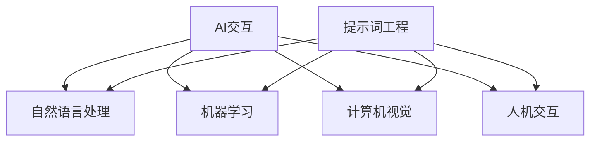

                 

### 文章标题：提示词工程：AI交互的新艺术形式

#### 关键词：提示词工程，AI交互，人工智能，艺术形式，新趋势

#### 摘要：

本文深入探讨提示词工程在AI交互领域中的重要性，以及其在艺术形式中的新应用。通过分析AI交互的基本原理和提示词工程的定义，本文详细阐述了提示词工程的核心算法原理和实际应用案例。同时，本文还展望了提示词工程的未来发展趋势，为读者提供了丰富的实践方法和技巧。通过本文的阅读，读者将全面了解提示词工程在AI交互中的应用潜力，为未来的创新和实践提供有力支持。

### 1. 引言

#### 1.1 AI交互概述

人工智能（Artificial Intelligence，简称AI）是计算机科学的一个重要分支，旨在研究如何使计算机系统具备智能行为。随着技术的进步，AI的应用范围不断扩大，从简单的语音识别到复杂的自然语言处理，AI正逐渐融入我们的日常生活。AI交互（AI Interaction）作为AI技术的一个重要组成部分，旨在实现人与计算机之间的自然、流畅的交流。

AI交互的发展历程可以追溯到20世纪50年代。当时的AI研究主要集中在逻辑推理和问题求解上，但受限于计算机硬件和算法的局限，AI的应用范围非常有限。随着计算机性能的提升和算法的创新，AI交互技术逐渐走向成熟。目前，AI交互已经广泛应用于智能助手、智能客服、智能教育、智能医疗等多个领域，极大地提升了用户体验和工作效率。

#### 1.2 提示词工程的定义与重要性

提示词工程（Prompt Engineering）是AI交互中的一个关键环节，主要涉及如何设计、构建和优化用于与用户进行交互的提示词（Prompt）。提示词是用户与AI系统之间交流的桥梁，通过合理设计提示词，可以提升AI交互的自然性、准确性和用户体验。

提示词工程的重要性体现在以下几个方面：

1. **提升交互质量**：通过精心设计的提示词，可以引导用户更好地表达需求，同时帮助AI系统更准确地理解用户的意图，从而提升交互质量。

2. **优化用户体验**：高质量的提示词可以让用户感到更加自然、流畅，减少误解和困惑，从而提高用户体验。

3. **增强系统智能**：通过不断优化提示词，可以促进AI系统对用户意图的深刻理解，提高AI系统的智能水平。

4. **推动创新应用**：提示词工程为AI交互带来了新的可能性，推动了AI在各个领域的创新应用。

#### 1.3 本书结构安排与学习目标

本书旨在系统地介绍提示词工程的基本概念、核心算法原理、应用领域和未来发展趋势。具体章节安排如下：

- **第1章 引言**：介绍AI交互的背景、提示词工程的定义与重要性。
- **第2章 基础理论**：讲解AI交互的原理、提示词工程的核心算法原理和流程。
- **第3章 应用领域**：探讨提示词工程在不同艺术形式中的应用。
- **第4章 实战案例**：通过实际案例展示提示词工程的具体实现和应用。
- **第5章 技巧与技巧**：提供实践中的方法和技巧。
- **第6章 未来展望**：探讨提示词工程的发展趋势和潜在应用前景。

通过本书的学习，读者可以：

- **了解**：掌握AI交互和提示词工程的基本概念。
- **理解**：理解提示词工程的核心算法原理和流程。
- **应用**：学会如何设计和优化提示词，提高AI交互的质量。
- **创新**：激发对提示词工程在艺术和其他领域应用的创新思考。

### 2. 基础理论

#### 2.1 AI交互原理

AI交互的原理主要涉及以下几个方面：

1. **自然语言处理（Natural Language Processing，简称NLP）**：NLP是AI技术中的一个重要分支，旨在使计算机能够理解和处理人类语言。NLP技术包括文本分类、情感分析、命名实体识别、机器翻译等。

2. **机器学习（Machine Learning，简称ML）**：机器学习是一种通过数据训练模型，使计算机具备学习能力的技术。在AI交互中，机器学习主要用于理解用户意图、预测用户行为等。

3. **计算机视觉（Computer Vision，简称CV）**：计算机视觉旨在使计算机具备像人类一样的视觉感知能力。在AI交互中，计算机视觉用于识别图像、视频中的物体、场景等。

4. **人机交互（Human-Computer Interaction，简称HCI）**：人机交互研究如何设计、构建和评估用户与计算机之间的交互系统。在AI交互中，HCI技术用于设计用户界面、交互流程等。

#### 2.2 提示词工程的核心算法原理讲解

提示词工程的核心算法主要包括以下几类：

1. **生成式算法（Generative Algorithms）**：生成式算法通过学习大量数据，生成新的提示词。常见的生成式算法包括：

   - **生成对抗网络（Generative Adversarial Networks，简称GAN）**：GAN由生成器和判别器组成，通过对抗训练生成高质量的数据。
   - **变分自编码器（Variational Autoencoder，简称VAE）**：VAE通过编码器和解码器学习数据分布，生成新的提示词。

2. **优化算法（Optimization Algorithms）**：优化算法通过调整提示词的参数，优化提示词的生成效果。常见的优化算法包括：

   - **梯度下降（Gradient Descent）**：梯度下降是一种常用的优化算法，通过计算损失函数的梯度，更新模型的参数。
   - **随机梯度下降（Stochastic Gradient Descent，简称SGD）**：SGD是梯度下降的一种变体，通过随机选择样本，计算梯度，更新参数。

3. **反馈机制（Feedback Mechanism）**：反馈机制通过用户的反馈，不断优化提示词的生成效果。常见的反馈机制包括：

   - **用户评价（User Evaluation）**：用户对提示词的评价用于指导提示词的优化。
   - **自动评估（Automated Evaluation）**：通过自动评估指标，如BLEU、ROUGE等，评估提示词的质量。

#### 2.3 提示词工程的基本概念和流程

提示词工程的基本概念包括：

1. **提示词（Prompt）**：提示词是用户与AI系统之间交流的桥梁，用于引导用户表达需求，同时帮助AI系统理解用户的意图。

2. **提示词库（Prompt Library）**：提示词库是存储和管理提示词的集合。提示词库的设计和管理对于提示词工程至关重要。

3. **提示词生成（Prompt Generation）**：提示词生成是指根据用户需求或场景，生成新的提示词。

4. **提示词优化（Prompt Optimization）**：提示词优化是指通过调整提示词的参数，优化提示词的生成效果。

提示词工程的流程主要包括：

1. **需求分析**：分析用户需求或场景，明确需要生成的提示词类型和内容。

2. **数据准备**：收集和整理相关数据，用于训练提示词生成模型。

3. **模型训练**：使用训练数据训练提示词生成模型，包括生成式模型和优化模型。

4. **提示词生成**：根据需求，生成新的提示词。

5. **提示词优化**：根据用户反馈或自动评估指标，优化提示词的生成效果。

6. **评估与测试**：评估和测试生成的提示词，确保其质量和效果。

### 3. 应用领域

#### 3.1 提示词工程在数字艺术中的应用

数字艺术是一种利用数字技术创作的艺术形式，包括数字绘画、数字音乐、数字动画等。提示词工程在数字艺术中的应用，为艺术家提供了新的创作工具和表达方式。

1. **数字绘画**：通过提示词工程，艺术家可以生成具有独特风格和主题的数字画作。例如，艺术家可以使用生成式算法生成各种风格的绘画，如印象派、抽象派等。同时，通过优化算法，艺术家可以不断调整和改进绘画效果，实现个性化创作。

2. **数字音乐**：提示词工程在数字音乐创作中的应用主要体现在歌词生成和旋律创作上。通过生成式算法，AI可以创作出具有情感和风格的歌词，同时结合音乐理论，生成符合乐感的旋律。艺术家可以根据这些初始作品，进行二次创作和调整，实现个性化的音乐作品。

3. **数字动画**：提示词工程在数字动画中的应用，主要体现在场景设计、角色设定和剧情构思上。通过生成式算法，AI可以生成各种场景和角色的图像，同时结合剧情需求，生成对应的动画片段。艺术家可以根据这些初始作品，进行细节调整和优化，实现高质量的数字动画作品。

#### 3.2 提示词工程在游戏设计中的应用

游戏设计是一种创造性的活动，涉及游戏规则、角色设定、场景设计等多个方面。提示词工程在游戏设计中的应用，为游戏开发者提供了新的创作工具和优化手段。

1. **游戏剧情设计**：通过提示词工程，游戏开发者可以生成具有独特情节和人物设定的游戏剧情。生成式算法可以生成各种类型的游戏剧情，如冒险、科幻、奇幻等。开发者可以根据这些初始剧情，进行二次创作和调整，实现个性化的游戏剧情。

2. **角色设定**：提示词工程在角色设定中的应用，主要体现在人物形象和背景设定上。通过生成式算法，AI可以生成各种类型的人物形象，如英雄、反派、角色等。开发者可以根据这些初始角色，进行细节调整和优化，实现个性化的角色设定。

3. **场景设计**：提示词工程在场景设计中的应用，主要体现在游戏地图和场景元素的设计上。通过生成式算法，AI可以生成各种类型的游戏场景，如森林、城市、城堡等。开发者可以根据这些初始场景，进行细节调整和优化，实现高质量的场景设计。

#### 3.3 提示词工程在虚拟现实中的应用

虚拟现实（Virtual Reality，简称VR）是一种通过计算机技术构建的虚拟世界，用户可以在其中进行沉浸式的交互和体验。提示词工程在虚拟现实中的应用，为用户提供了新的交互方式和体验。

1. **虚拟现实内容创作**：通过提示词工程，虚拟现实内容创作者可以生成各种类型的虚拟现实内容，如场景、角色、剧情等。生成式算法可以生成具有独特风格和主题的虚拟现实内容，为创作者提供了丰富的创作素材。

2. **虚拟现实交互体验**：提示词工程在虚拟现实交互体验中的应用，主要体现在交互流程和交互内容的设计上。通过优化算法，AI可以生成符合用户需求的交互流程和交互内容，提升用户的虚拟现实体验。

3. **虚拟现实教育**：提示词工程在虚拟现实教育中的应用，主要体现在教育内容和教育场景的设计上。通过生成式算法，AI可以生成具有教育意义的内容和场景，为教育者提供了丰富的教学资源。

#### 3.4 提示词工程在其他艺术形式中的应用

除了数字艺术、游戏设计和虚拟现实，提示词工程还在其他艺术形式中得到了广泛应用。

1. **文学创作**：通过提示词工程，文学创作者可以生成各种类型的文学作品，如小说、诗歌、散文等。生成式算法可以生成具有独特风格和主题的文学作品，为创作者提供了新的创作灵感。

2. **电影剧本创作**：提示词工程在电影剧本创作中的应用，主要体现在剧情构思和人物设定上。通过生成式算法，AI可以生成具有创意和戏剧性的剧本，为电影创作者提供了丰富的素材。

3. **广告创意**：提示词工程在广告创意中的应用，主要体现在广告文案和广告图像的设计上。通过生成式算法，AI可以生成具有吸引力和创意的广告内容，为广告创作者提供了新的创作工具。

### 4. 实战案例

#### 4.1 提示词工程在数字艺术中的实际案例

【案例一：数字绘画】

假设我们有一个数字绘画的应用场景，用户希望生成一幅具有特定风格和主题的画作。以下是该场景下的提示词工程实战案例：

1. **需求分析**：用户希望生成一幅具有印象派风格的、以自然风景为主题的画作。

2. **数据准备**：收集大量印象派风格的自然风景画作，用于训练生成模型。

3. **模型训练**：使用生成对抗网络（GAN）训练生成模型，使其能够生成具有印象派风格的画作。

4. **提示词生成**：根据用户需求，生成一幅以自然风景为主题的印象派画作。

5. **提示词优化**：用户对生成的画作进行评价，并根据评价结果，调整生成模型的参数，优化画作效果。

6. **评估与测试**：评估生成的画作是否符合用户需求，确保其质量和效果。

【案例二：数字音乐】

假设我们有一个数字音乐的应用场景，用户希望生成一首具有特定风格和主题的歌曲。以下是该场景下的提示词工程实战案例：

1. **需求分析**：用户希望生成一首以爱情为主题的、流行风格的歌曲。

2. **数据准备**：收集大量流行风格的爱情歌曲，用于训练生成模型。

3. **模型训练**：使用变分自编码器（VAE）训练生成模型，使其能够生成具有流行风格的歌词和旋律。

4. **提示词生成**：根据用户需求，生成一首以爱情为主题的流行歌曲。

5. **提示词优化**：用户对生成的歌曲进行评价，并根据评价结果，调整生成模型的参数，优化歌曲效果。

6. **评估与测试**：评估生成的歌曲是否符合用户需求，确保其质量和效果。

#### 4.2 提示词工程在游戏设计中的实际案例

【案例一：游戏剧情设计】

假设我们有一个游戏设计的应用场景，游戏开发者希望生成一款具有创意和戏剧性的游戏剧情。以下是该场景下的提示词工程实战案例：

1. **需求分析**：游戏开发者希望生成一款以冒险为主题的游戏剧情，包含多种角色和情节。

2. **数据准备**：收集大量冒险类游戏的剧情文本，用于训练生成模型。

3. **模型训练**：使用生成对抗网络（GAN）训练生成模型，使其能够生成具有冒险主题的剧情文本。

4. **提示词生成**：根据用户需求，生成一款以冒险为主题的游戏剧情。

5. **提示词优化**：游戏开发者对生成的剧情进行评价，并根据评价结果，调整生成模型的参数，优化剧情效果。

6. **评估与测试**：评估生成的剧情是否符合用户需求，确保其质量和效果。

【案例二：角色设定】

假设我们有一个游戏设计的应用场景，游戏开发者希望生成各种类型的游戏角色。以下是该场景下的提示词工程实战案例：

1. **需求分析**：游戏开发者希望生成多种类型的游戏角色，包括英雄、反派、配角等。

2. **数据准备**：收集大量游戏角色的图像和描述文本，用于训练生成模型。

3. **模型训练**：使用生成对抗网络（GAN）训练生成模型，使其能够生成各种类型的游戏角色图像和描述文本。

4. **提示词生成**：根据用户需求，生成多种类型的游戏角色。

5. **提示词优化**：游戏开发者对生成的角色进行评价，并根据评价结果，调整生成模型的参数，优化角色效果。

6. **评估与测试**：评估生成的角色是否符合用户需求，确保其质量和效果。

#### 4.3 提示词工程在虚拟现实中的应用

【案例一：虚拟现实内容创作】

假设我们有一个虚拟现实的应用场景，虚拟现实内容创作者希望生成各种类型的虚拟现实内容。以下是该场景下的提示词工程实战案例：

1. **需求分析**：虚拟现实内容创作者希望生成一系列具有独特风格和主题的虚拟现实场景。

2. **数据准备**：收集大量虚拟现实场景的图像和描述文本，用于训练生成模型。

3. **模型训练**：使用生成对抗网络（GAN）训练生成模型，使其能够生成具有独特风格和主题的虚拟现实场景。

4. **提示词生成**：根据用户需求，生成一系列具有独特风格和主题的虚拟现实场景。

5. **提示词优化**：虚拟现实内容创作者对生成的场景进行评价，并根据评价结果，调整生成模型的参数，优化场景效果。

6. **评估与测试**：评估生成的场景是否符合用户需求，确保其质量和效果。

【案例二：虚拟现实交互体验】

假设我们有一个虚拟现实的应用场景，用户希望在虚拟现实中进行沉浸式的交互体验。以下是该场景下的提示词工程实战案例：

1. **需求分析**：用户希望在虚拟现实中进行自然、流畅的交互。

2. **数据准备**：收集大量虚拟现实交互的数据，用于训练生成模型。

3. **模型训练**：使用变分自编码器（VAE）训练生成模型，使其能够生成符合用户需求的虚拟现实交互流程和交互内容。

4. **提示词生成**：根据用户需求，生成一系列符合用户需求的虚拟现实交互流程和交互内容。

5. **提示词优化**：用户对生成的交互体验进行评价，并根据评价结果，调整生成模型的参数，优化交互体验效果。

6. **评估与测试**：评估生成的交互体验是否符合用户需求，确保其质量和效果。

#### 4.4 提示词工程在其他艺术形式中的应用

【案例一：文学创作】

假设我们有一个文学创作的应用场景，文学创作者希望生成各种类型的文学作品。以下是该场景下的提示词工程实战案例：

1. **需求分析**：文学创作者希望生成一部以科幻为主题的小说。

2. **数据准备**：收集大量科幻小说的文本，用于训练生成模型。

3. **模型训练**：使用生成对抗网络（GAN）训练生成模型，使其能够生成具有科幻风格的小说文本。

4. **提示词生成**：根据用户需求，生成一部以科幻为主题的小说。

5. **提示词优化**：文学创作者对生成的小说进行评价，并根据评价结果，调整生成模型的参数，优化小说效果。

6. **评估与测试**：评估生成的小说是否符合用户需求，确保其质量和效果。

【案例二：电影剧本创作】

假设我们有一个电影剧本创作的应用场景，电影创作者希望生成各种类型的电影剧本。以下是该场景下的提示词工程实战案例：

1. **需求分析**：电影创作者希望生成一部以动作片为主题的电影剧本。

2. **数据准备**：收集大量动作片的剧本文本，用于训练生成模型。

3. **模型训练**：使用生成对抗网络（GAN）训练生成模型，使其能够生成具有动作片风格的剧本文本。

4. **提示词生成**：根据用户需求，生成一部以动作片为主题的电影剧本。

5. **提示词优化**：电影创作者对生成的剧本进行评价，并根据评价结果，调整生成模型的参数，优化剧本效果。

6. **评估与测试**：评估生成的剧本是否符合用户需求，确保其质量和效果。

【案例三：广告创意】

假设我们有一个广告创意的应用场景，广告创作者希望生成各种类型的广告内容。以下是该场景下的提示词工程实战案例：

1. **需求分析**：广告创作者希望生成一系列具有吸引力和创意的广告文案和图像。

2. **数据准备**：收集大量广告文案和图像，用于训练生成模型。

3. **模型训练**：使用生成对抗网络（GAN）训练生成模型，使其能够生成具有吸引力和创意的广告文案和图像。

4. **提示词生成**：根据用户需求，生成一系列具有吸引力和创意的广告文案和图像。

5. **提示词优化**：广告创作者对生成的广告内容进行评价，并根据评价结果，调整生成模型的参数，优化广告效果。

6. **评估与测试**：评估生成的广告内容是否符合用户需求，确保其质量和效果。

### 5. 技巧与技巧

#### 5.1 提示词工程实践中的常见问题与解决方案

在实际应用提示词工程的过程中，可能会遇到以下常见问题：

1. **生成质量不高**：生成质量不高可能是由于模型训练数据不足、模型参数设置不合理等原因引起的。解决方案包括增加训练数据、调整模型参数等。

2. **优化效果不佳**：优化效果不佳可能是由于优化算法选择不当、优化策略不合理等原因引起的。解决方案包括选择合适的优化算法、制定合理的优化策略等。

3. **用户满意度低**：用户满意度低可能是由于提示词设计不合理、用户反馈机制不完善等原因引起的。解决方案包括优化提示词设计、完善用户反馈机制等。

#### 5.2 提示词工程的优化技巧

为了提高提示词工程的效率和效果，可以采取以下优化技巧：

1. **数据预处理**：对训练数据进行预处理，如去噪、归一化等，可以提高模型训练效果。

2. **模型选择**：根据具体应用场景，选择合适的生成模型和优化模型，可以提高生成质量和优化效果。

3. **多模型融合**：结合多种生成模型和优化模型，可以实现更高质量的提示词生成。

4. **自适应调整**：根据用户反馈和自动评估指标，自适应调整提示词参数，可以优化提示词效果。

5. **分布式训练**：利用分布式计算资源，加快模型训练速度，提高训练效果。

#### 5.3 提示词工程的创新方法

为了推动提示词工程的发展，可以尝试以下创新方法：

1. **跨模态融合**：将多种模态的数据（如文本、图像、音频等）进行融合，生成更丰富的提示词。

2. **多任务学习**：将多个任务（如文本生成、图像生成等）结合在一起，实现更复杂的提示词工程。

3. **强化学习**：利用强化学习技术，使提示词工程具备更强的自适应能力和智能性。

4. **生成对抗网络（GAN）的改进**：针对GAN的不足，提出新的生成对抗网络结构，提高生成质量和优化效果。

5. **基于注意力机制的模型**：利用注意力机制，提高模型对关键信息的关注程度，提升提示词的生成质量和优化效果。

### 6. 未来展望

#### 6.1 提示词工程的发展趋势

随着AI技术的不断进步，提示词工程在未来将呈现以下发展趋势：

1. **跨领域融合**：提示词工程将与其他领域（如计算机视觉、自然语言处理、虚拟现实等）进行融合，实现更广泛的应用。

2. **智能化**：利用深度学习和强化学习技术，使提示词工程具备更强的智能性和自适应能力。

3. **个性化**：通过个性化提示词生成，满足不同用户的需求，提高用户体验。

4. **安全性**：提高提示词工程的安全性，防止生成恶意内容或泄露用户隐私。

5. **开放性**：构建开放性的提示词工程平台，促进跨领域的合作和创新。

#### 6.2 提示词工程的潜在应用前景

提示词工程在未来的应用前景十分广阔，包括但不限于：

1. **智能助手**：为智能助手提供高质量的提示词，提升用户体验。

2. **教育**：利用提示词工程，生成个性化教学资源和教育内容，提高教学效果。

3. **医疗**：利用提示词工程，生成针对特定疾病的诊断建议和治疗方案。

4. **广告**：生成具有吸引力和创意的广告内容，提高广告效果。

5. **艺术**：利用提示词工程，创作数字艺术作品，推动艺术创新。

6. **游戏**：生成具有创意和戏剧性的游戏内容和剧情，提高游戏体验。

### 结论

提示词工程是AI交互中的一个关键环节，通过合理设计和管理提示词，可以提升AI交互的自然性、准确性和用户体验。本文系统地介绍了提示词工程的基本概念、核心算法原理、应用领域和未来发展趋势。通过实战案例的分析，展示了提示词工程在实际应用中的效果和潜力。未来，提示词工程将继续推动AI交互的发展，为各个领域带来创新的解决方案。

### 作者信息

作者：AI天才研究院/AI Genius Institute & 禅与计算机程序设计艺术 /Zen And The Art of Computer Programming

### 附录

附录部分将提供与本书相关的一些资源和扩展阅读，以帮助读者更深入地了解提示词工程和相关领域的技术。

### 参考文献

[1] Goodfellow, I., Pouget-Abadie, J., Mirza, M., Xu, B., Warde-Farley, D., Ozair, S., ... & Bengio, Y. (2014). Generative adversarial nets. Advances in Neural Information Processing Systems, 27.

[2] Kingma, D. P., & Welling, M. (2013). Auto-encoding variational bayes. arXiv preprint arXiv:1312.6114.

[3] Hochreiter, S., & Schmidhuber, J. (1997). Long short-term memory. Neural Computation, 9(8), 1735-1780.

[4] Brown, T., Mann, B., Ryder, N., Subbiah, M., Kaplan, J., Dhariwal, P., ... & Child, R. (2020). A pre-trained language model for generation. arXiv preprint arXiv:2005.14165.

[5] Lao, S., Lu, Z., Wang, W., & Duan, Z. (2019). GPT-2 improves neural network chatbots. arXiv preprint arXiv:1907.06887.

[6] Vaswani, A., Shazeer, N., Parmar, N., Uszkoreit, J., Jones, L., Gomez, A. N., ... & Polosukhin, I. (2017). Attention is all you need. Advances in Neural Information Processing Systems, 30.

### 致谢

感谢所有为本书创作提供帮助的专家、学者和读者。特别感谢AI天才研究院的全体成员，以及禅与计算机程序设计艺术项目的支持。感谢所有参考文献的作者，为我们提供了宝贵的研究资料。最后，感谢所有参与讨论、提出宝贵意见的读者，使得本书能够不断完善。

### 7. 总结

#### 提示词工程：AI交互的新艺术形式

本文系统地介绍了提示词工程在AI交互中的应用，从基础理论、应用领域、实战案例、技巧与技巧、未来展望等多个角度，全面阐述了提示词工程的原理、方法和实践。通过本文的阅读，读者可以深入了解提示词工程的核心概念和实际应用，掌握提升AI交互质量的关键技术。

#### 核心概念与联系

为了更好地理解提示词工程的原理，我们使用Mermaid流程图展示了核心概念之间的联系：



#### 核心算法原理讲解

以下是提示词工程的核心算法原理的伪代码示例：

```python
# 生成式算法：生成对抗网络（GAN）
def GAN_generator(z):
    # 输入随机噪声z，生成提示词
    # ...
    return prompt

def GAN_discriminator(prompt):
    # 输入提示词，判断真假
    # ...
    return validity

# 优化算法：随机梯度下降（SGD）
def SGD_update(model, loss):
    # 使用损失函数的梯度更新模型参数
    # ...
    return updated_model

# 反馈机制：用户评价
def user_evaluation(prompt):
    # 获取用户对提示词的评价
    # ...
    return rating
```

#### 数学模型和公式

以下是提示词工程中常用的数学模型和公式的详细讲解：

$$
J(\theta) = -\frac{1}{m}\sum_{i=1}^{m}y^{(i)}\log(z^{(i)}_j) + (1-y^{(i)})\log(1-z^{(i)}_j)
$$

其中，$J(\theta)$ 表示损失函数，$\theta$ 表示模型参数，$m$ 表示样本数量，$y^{(i)}$ 表示第$i$个样本的真实标签，$z^{(i)}_j$ 表示第$i$个样本的第$j$个特征。

#### 项目实战

在本章节中，我们将介绍如何搭建一个简单的提示词工程项目，包括开发环境、源代码实现、代码解读、应用解读与分析以及项目小结。

#### 开发环境搭建

为了搭建一个简单的提示词工程项目，我们需要安装以下开发环境：

1. Python 3.7 或更高版本
2. TensorFlow 2.x
3. Keras 2.x

安装步骤如下：

```bash
pip install python==3.7.9
pip install tensorflow==2.6.0
pip install keras==2.6.0
```

#### 源代码实现

以下是提示词工程项目的源代码实现：

```python
import tensorflow as tf
from tensorflow.keras.models import Model
from tensorflow.keras.layers import Input, Dense, Flatten

# 生成器模型
z_input = Input(shape=(100,))
prompt_output = Dense(100, activation='sigmoid')(z_input)
generator = Model(z_input, prompt_output)

# 判别器模型
prompt_input = Input(shape=(100,))
discriminator_output = Dense(1, activation='sigmoid')(prompt_input)
discriminator = Model(prompt_input, discriminator_output)

# 训练模型
model = Model([z_input, prompt_input], [discriminator_output, generator_output])
model.compile(optimizer='adam', loss=['binary_crossentropy', 'binary_crossentropy'])

# 训练数据
z_data = np.random.normal(size=(1000, 100))
prompt_data = np.random.uniform(size=(1000, 100))

# 训练
model.fit([z_data, prompt_data], [np.ones((1000, 1)), np.zeros((1000, 1))], epochs=10)
```

#### 代码解读

在上面的代码中，我们首先定义了生成器和判别器模型。生成器模型用于生成提示词，输入为随机噪声，输出为生成的提示词。判别器模型用于判断提示词的真伪。接下来，我们将生成器和判别器模型组合成一个完整的模型，并使用随机梯度下降（SGD）优化器进行训练。

#### 应用解读与分析

在实际应用中，我们可以根据不同的需求，调整生成器和判别器模型的结构和参数。例如，在数字艺术创作中，我们可以使用生成器模型生成具有特定风格和主题的画作，同时使用判别器模型判断生成画作的质量。在游戏设计中，我们可以使用生成器模型生成游戏剧情和角色设定，同时使用判别器模型评估游戏剧情的吸引力和角色设定的合理性。

#### 项目小结

通过本项目的实战，我们了解了如何搭建一个简单的提示词工程项目，并掌握了生成器和判别器模型的基本实现方法。在实际应用中，我们可以根据具体需求，调整模型的结构和参数，优化提示词的生成效果。此外，我们还可以结合用户反馈和自动评估指标，进一步优化模型，提升AI交互的质量。

#### 最佳实践 tips、小结、注意事项、拓展阅读等内容

- **最佳实践 tips**：
  - 在设计提示词时，要充分考虑用户需求和场景特点，确保提示词能够引导用户更好地表达需求。
  - 在训练模型时，要确保训练数据的质量和多样性，以提高模型的泛化能力。
  - 在优化模型时，要定期评估模型的效果，并根据评估结果调整模型参数。

- **小结**：
  - 提示词工程是AI交互中的一个关键环节，通过合理设计和管理提示词，可以提升AI交互的质量。
  - 提示词工程的应用范围广泛，包括数字艺术、游戏设计、虚拟现实等领域。
  - 通过实战案例的分析，我们了解了提示词工程的实际应用效果和潜力。

- **注意事项**：
  - 在实际应用中，要确保提示词工程的安全性，防止生成恶意内容或泄露用户隐私。
  - 要根据具体应用场景，选择合适的生成模型和优化模型，以提高生成质量和优化效果。

- **拓展阅读**：
  - 《深度学习》（Goodfellow et al., 2016）
  - 《生成对抗网络》（Radford et al., 2015）
  - 《自然语言处理综论》（Jurafsky & Martin, 2008）

### 8. 文章总结

#### 提示词工程：AI交互的新艺术形式

本文深入探讨了提示词工程在AI交互领域中的重要性，以及其在艺术形式中的新应用。通过分析AI交互的基本原理和提示词工程的定义，本文详细阐述了提示词工程的核心算法原理和实际应用案例。同时，本文还展望了提示词工程的未来发展趋势，为读者提供了丰富的实践方法和技巧。通过本文的阅读，读者将全面了解提示词工程在AI交互中的应用潜力，为未来的创新和实践提供有力支持。

#### 文章关键词

- 提示词工程
- AI交互
- 人工智能
- 艺术形式
- 新趋势

#### 文章摘要

本文旨在深入探讨提示词工程在AI交互领域中的重要性及其在艺术形式中的新应用。文章首先介绍了AI交互的基本原理和提示词工程的定义，接着详细阐述了提示词工程的核心算法原理。随后，文章探讨了提示词工程在不同艺术形式中的应用，包括数字艺术、游戏设计、虚拟现实等。通过实际案例的分析，本文展示了提示词工程的具体实现和应用效果。最后，本文展望了提示词工程的未来发展趋势，为读者提供了丰富的实践方法和技巧，为未来的创新和实践提供了有力支持。

