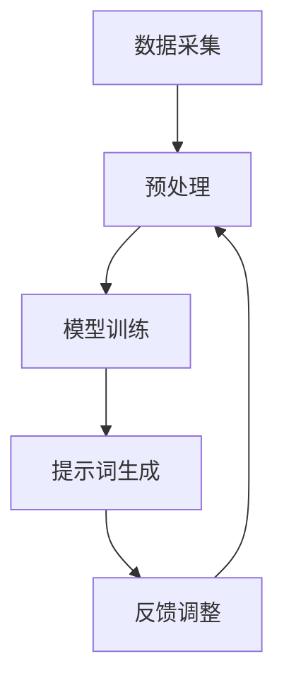

                 


### 2. 提示词工程的基本概念

#### 2.1 提示词的定义与类型

**定义**：
提示词是指为了引导或激励特定行为、决策或思考而设计的一组词汇或短语。在人工智能领域，提示词通常用于与机器学习模型、自然语言处理系统或人机交互界面进行沟通。

**类型**：
- **问题提示词**：用于询问信息或请求具体行动，例如“请提供最近的销售数据”。
- **任务提示词**：用于指定具体任务或目标，例如“构建一个推荐系统”。
- **情感提示词**：用于表达情感状态或情感需求，例如“我很困惑，请帮助我”。

#### 2.2 提示词工程的目标

**目标**：
提示词工程的目标是通过设计、选择和优化提示词，以实现以下效果：

1. **提高模型性能**：通过有效的提示词，增强机器学习模型的训练效果和预测准确性。
2. **优化用户体验**：通过恰当的提示词，提高用户在使用人工智能系统时的满意度和参与度。
3. **促进人机交互**：通过人性化的提示词，改善人与人工智能系统之间的互动，使其更加自然和高效。

**关键目标**：
- **相关性**：提示词应与用户需求或任务密切相关，以提高信息传递的效率。
- **清晰性**：提示词应简洁明了，避免歧义，以确保用户能够迅速理解并响应。
- **灵活性**：提示词应具有一定的适应性，能够根据不同情境和用户反馈进行调整。

#### 2.3 提示词工程的工作流程

**流程**：
提示词工程的工作流程通常包括以下几个步骤：

1. **需求分析**：分析用户需求、任务目标和系统特性，确定提示词的需求和目标。
2. **设计阶段**：设计初步的提示词方案，包括词汇选择、表达方式等。
3. **开发阶段**：根据设计，开发具体的提示词模型或系统，可能包括自然语言处理技术、机器学习算法等。
4. **测试阶段**：对提示词模型或系统进行测试，评估其性能和用户体验。
5. **优化阶段**：根据测试结果，对提示词模型或系统进行调整和优化。

#### 2.4 提示词工程的应用场景

**应用场景**：
提示词工程在多个领域和场景中都有广泛的应用，包括但不限于：

- **智能客服**：通过有效的提示词，智能客服系统能够更好地理解用户意图，提供更精准的解答。
- **搜索引擎优化**：优化提示词可以提高搜索结果的相关性和用户体验。
- **内容创作**：在生成式AI系统中，提示词用于引导生成高质量、有创意的内容。
- **虚拟助理**：虚拟助理通过提示词与用户进行对话，提供个性化服务和建议。

**总结**：
提示词工程作为AI时代的一项关键技术，不仅能够提升系统的性能和用户体验，还能够促进人机交互的深化。通过合理的提示词设计和优化，我们可以更好地利用人工智能技术，实现智能化、个性化的服务。

### 2.5 提示词工程中的核心概念原理联系

**核心概念联系**：

提示词工程涉及多个核心概念，这些概念之间紧密联系，共同构成了提示词工程的理论基础。

1. **自然语言处理（NLP）**：
   - **语言模型**：自然语言处理的基础，用于生成和预测文本。
   - **词嵌入**：将词汇映射到高维空间，便于模型处理。
   - **序列模型**：处理序列数据（如文本）的模型，如RNN、LSTM等。

2. **机器学习**：
   - **监督学习**：通过标注数据训练模型，用于提示词的选择和优化。
   - **无监督学习**：用于发现数据中的模式和结构，为提示词生成提供支持。

3. **人机交互**：
   - **用户行为分析**：通过分析用户行为，了解用户意图和需求。
   - **反馈机制**：用户对提示词的反馈用于模型优化，提高系统的适应性。

4. **语义理解**：
   - **语义分析**：理解文本中的语义关系和含义。
   - **实体识别**：识别文本中的关键实体，如人名、地点、组织等。

**联系与架构**：

- **流程架构**：
  - **数据采集**：收集用户交互数据和文本数据。
  - **预处理**：清洗和格式化数据，提取有用信息。
  - **模型训练**：使用机器学习和自然语言处理技术训练提示词生成模型。
  - **提示词生成**：根据用户需求或任务目标，生成高质量的提示词。
  - **反馈调整**：根据用户反馈调整模型，提高系统性能。

- **技术架构**：
  - **前端**：用户界面，展示提示词和交互结果。
  - **后端**：处理用户请求，生成提示词，存储和检索数据。
  - **算法层**：自然语言处理和机器学习算法，实现提示词的生成和优化。
  - **数据层**：存储用户数据、模型参数和训练数据。

**Mermaid流程图**：

以下是一个简单的Mermaid流程图，展示了提示词工程的核心概念和流程：



**伪代码**：

以下是一个简化的伪代码，用于描述提示词生成模型的基本框架：

```python
# 伪代码：提示词生成模型框架

# 初始化模型
model = initialize_model()

# 预处理数据
preprocessed_data = preprocess_data(data)

# 训练模型
model = train_model(model, preprocessed_data)

# 生成提示词
prompt = generate_prompt(model, user_input)

# 获取用户反馈
user_feedback = get_user_feedback(prompt)

# 调整模型
model = adjust_model(model, user_feedback)

# 输出最终提示词
print(prompt)
```

通过上述核心概念和原理的联系，我们可以更深入地理解提示词工程的工作原理，为后续章节的详细讨论奠定基础。在接下来的章节中，我们将进一步探讨AI时代的关键技术，以及提示词工程在实际应用中的具体实现和挑战。

