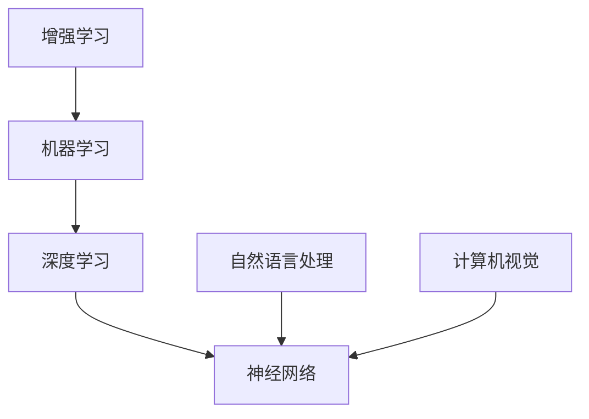
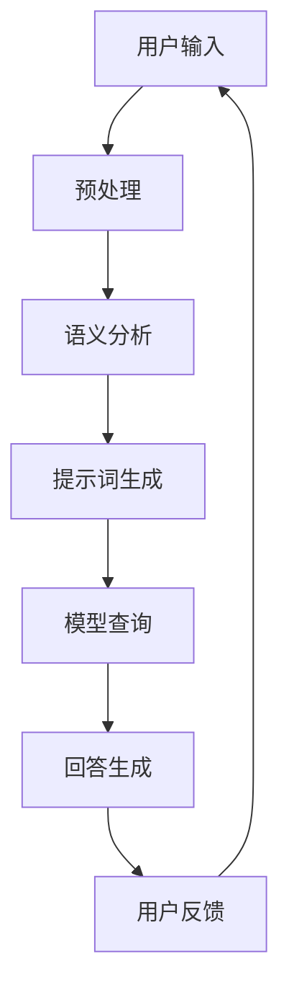
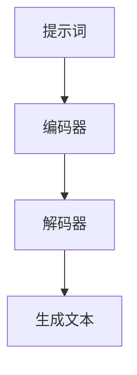
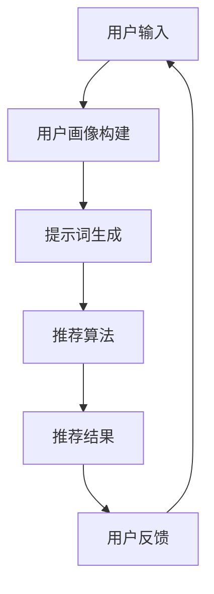

                 

# 提示词工程：AI时代的必修课与新机遇

## 关键词

- AI时代
- 提示词工程
- 自然语言处理
- 语言模型
- 智能问答
- 推荐系统
- 多模态数据

## 摘要

随着人工智能技术的迅猛发展，提示词工程成为了AI领域不可或缺的一环。本文旨在深入探讨提示词工程的背景、基础、技术、实践及未来趋势。我们将从提示词工程的概念、数学基础、自然语言处理技术、应用实践等方面进行详细分析，并以实际案例为例，展示其在AI应用中的重要性。最后，本文将探讨提示词工程的发展趋势及未来可能的方向。

## 第一部分：AI时代的来临与提示词工程的基础

### 1.1 AI时代的来临

随着计算能力的提升和数据规模的不断扩大，人工智能（AI）已经从理论研究走向实际应用，逐渐渗透到我们的日常生活和工作中。AI时代，即人工智能时代，指的是以人工智能技术为核心的新一轮科技革命和产业变革。这一时代的特点是数据驱动、自主学习、智能决策。

#### 核心概念与联系

在AI时代，关键概念包括但不限于机器学习、深度学习、神经网络等。这些概念之间存在着密切的联系，共同构成了AI的技术架构。以下是一个简单的概念关系图，用Mermaid绘制：



#### 核心算法原理讲解

以下是一个简单的机器学习算法——决策树生成的伪代码：

```python
# 伪代码：决策树生成算法
def build_decision_tree(data, features):
    if data is homogeneous:
        return majority_class(data)
    else:
        best_feature = find_best_split(data, features)
        left_tree = build_decision_tree(split_data[0], features)
        right_tree = build_decision_tree(split_data[1], features)
        return Node(best_feature, left_tree, right_tree)
```

### 1.2 提示词工程的概念与作用

提示词工程（Prompt Engineering）是AI时代的一个重要领域，它关注如何设计有效的提示词（Prompt），以提高模型的学习效果和应用性能。提示词是一个引导模型进行学习和推理的文本或短语，它可以提供上下文信息、指导模型的方向或设定问题的边界。

#### 数学模型与公式

提示词生成的概率模型可以表示为：

$$
P(\text{prompt\_word}|\text{input\_context}) = \frac{f(\text{prompt\_word}, \text{input\_context})}{\sum_{\text{all\_words}} f(\text{all\_words}, \text{input\_context})}
$$

其中，$P(\text{prompt\_word}|\text{input\_context})$表示在给定输入上下文$ \text{input\_context}$的情况下，生成特定提示词$ \text{prompt\_word}$的概率。$f(\text{prompt\_word}, \text{input\_context})$和$f(\text{all\_words}, \text{input\_context})$分别表示提示词和所有可能单词与输入上下文的关联度。

#### 详细讲解与举例说明

在提示词生成过程中，如何利用条件概率计算是关键。例如，对于一个问答系统，我们可以根据用户的输入问题和历史数据，计算每个可能提示词的概率，并选择概率最高的作为输出。

```python
# 伪代码：基于条件概率的提示词生成
def generate_prompt(input_context, history_data):
    prompt_candidates = get_prompt_candidates(input_context, history_data)
    probabilities = calculate_probabilities(prompt_candidates, input_context)
    return max(probabilities, key=probabilities.get)
```

## 第二部分：提示词工程的数学基础

### 2.1 语言模型与概率论

语言模型是提示词工程的核心组成部分，它通过对大量文本数据的学习，构建语言的概率分布，从而预测下一个单词或短语。概率论在语言模型中发挥着至关重要的作用。

#### 核心算法原理讲解

以下是一个简单的N元语言模型训练的伪代码：

```python
# 伪代码：N元语言模型训练
def train_ngram_model(corpus, n):
    ngram_model = {}
    for ngram in extract_ngrams(corpus, n):
        ngram_model[ngram] = ngram_model.get(ngram, 0) + 1
    return ngram_model
```

#### 数学模型与公式

在语言模型中，常用的数学模型包括N元马尔可夫模型和最大熵模型。以下是一个N元马尔可夫模型的概率计算公式：

$$
P(w_t | w_{t-1}, w_{t-2}, ..., w_{t-n+1}) = \frac{P(w_t, w_{t-1}, w_{t-2}, ..., w_{t-n+1})}{P(w_{t-1}, w_{t-2}, ..., w_{t-n+1})}
$$

其中，$w_t$表示当前单词，$w_{t-1}, w_{t-2}, ..., w_{t-n+1}$表示前$n-1$个单词。

### 2.2 提示词生成算法

提示词生成算法的核心任务是利用语言模型，根据输入上下文生成合适的提示词。常见的生成算法包括基于概率的生成算法和基于搜索的生成算法。

#### 核心算法原理讲解

以下是一个基于概率的提示词生成算法的伪代码：

```python
# 伪代码：基于概率的提示词生成
def generate_prompt(input_context, language_model):
    candidates = get_candidates(input_context, language_model)
    probabilities = calculate_probabilities(candidates, input_context)
    return max(candidates, key=lambda x: probabilities[x])
```

#### 数学模型与公式

在基于概率的生成算法中，我们通常使用条件概率来计算每个候选提示词的概率。以下是一个简单的条件概率计算公式：

$$
P(\text{prompt\_word}|\text{input\_context}) = \frac{P(\text{prompt\_word}, \text{input\_context})}{P(\text{input\_context})}
$$

其中，$P(\text{prompt\_word}, \text{input\_context})$表示提示词和输入上下文的联合概率，$P(\text{input\_context})$表示输入上下文的概率。

### 2.3 数学模型在提示词工程中的应用

数学模型在提示词工程中的应用主要体现在两个方面：一是优化提示词生成算法，二是评估和比较不同提示词的优劣。

#### 详细讲解与举例说明

以贝叶斯优化为例，我们可以使用贝叶斯公式来计算提示词的期望收益，从而优化生成算法。以下是一个简单的贝叶斯优化公式：

$$
E(\text{reward}|\text{prompt}) = P(\text{reward}|\text{prompt}) \cdot P(\text{prompt})
$$

其中，$E(\text{reward}|\text{prompt})$表示在给定提示词的情况下，期望收益，$P(\text{reward}|\text{prompt})$表示在给定提示词的情况下，收益的概率，$P(\text{prompt})$表示提示词的概率。

## 第三部分：提示词工程中的自然语言处理技术

### 3.1 文本预处理与清洗

文本预处理与清洗是提示词工程的基础步骤，它包括去除标点符号、停用词过滤、词干提取等操作，以提高模型的训练效果。

#### 核心算法原理讲解

以下是一个简单的文本预处理算法的伪代码：

```python
# 伪代码：文本预处理
def preprocess_text(text):
    text = remove_punctuation(text)
    text = remove_stopwords(text)
    text = stemming(text)
    return text
```

#### 数学模型与公式

在文本预处理中，词频统计是一个常用的数学模型。以下是一个简单的词频统计公式：

$$
f(t) = \text{count}(t, \text{document})
$$

其中，$f(t)$表示词$t$在文档中的频率，$\text{count}(t, \text{document})$表示词$t$在文档中出现的次数。

### 3.2 词向量表示与语义分析

词向量表示与语义分析是提示词工程的另一个关键技术，它将文本数据转化为数值形式，以便于计算机处理。常见的词向量表示方法包括Word2Vec、BERT等。

#### 核心算法原理讲解

以下是一个简单的Word2Vec训练的伪代码：

```python
# 伪代码：Word2Vec训练
def train_word2vec(corpus):
    vocabulary = build_vocabulary(corpus)
    vectors = []
    for word in vocabulary:
        vector = train_vector(word, corpus)
        vectors.append(vector)
    return vectors
```

#### 数学模型与公式

在Word2Vec中，常用的数学模型包括余弦相似度、负采样等。以下是一个简单的余弦相似度计算公式：

$$
\text{cosine\_similarity}(v_1, v_2) = \frac{v_1 \cdot v_2}{\|v_1\| \|v_2\|}
$$

其中，$v_1$和$v_2$分别表示两个词的词向量，$\|\|$表示向量的模。

### 3.3 提示词工程的语义理解与应用

提示词工程的语义理解与应用是提升模型性能的关键。通过语义分析，我们可以更好地理解输入上下文，从而生成更合适的提示词。

#### 详细讲解与举例说明

以情感分析为例，我们可以使用语义分析技术来识别文本中的情感倾向。以下是一个简单的情感分析算法的伪代码：

```python
# 伪代码：情感分析
def analyze_sentiment(text):
    sentiment_vector = calculate_sentiment_vector(text)
    sentiment = determine_sentiment(sentiment_vector)
    return sentiment
```

#### 数学模型与公式

在情感分析中，常用的数学模型包括情感向量计算和情感分类。以下是一个简单的情感向量计算公式：

$$
\text{sentiment\_vector} = \sum_{i=1}^{n} w_i \cdot v_i
$$

其中，$w_i$表示权重，$v_i$表示情感词典中的词向量，$n$表示情感词典中的词数。

## 第四部分：提示词工程在AI应用中的实践

### 4.1 智能问答系统的构建

智能问答系统是提示词工程的一个重要应用场景。通过设计有效的提示词，可以提高问答系统的准确性和用户体验。

#### 项目实战

以下是一个简单的智能问答系统的架构设计：



#### 提示词生成的实际案例

以一个问答系统为例，我们可以根据用户输入的问题和上下文，生成以下提示词：

- 如果用户输入：“什么是人工智能？”
  - 提示词：“人工智能、定义、应用、历史”
- 如果用户输入：“如何学习编程？”
  - 提示词：“编程、学习方法、资源、技巧”

### 4.2 提示词在生成式AI中的应用

生成式AI（如文本生成、图像生成等）是另一个重要的应用场景。提示词在生成式AI中起到了引导模型生成内容的作用。

#### 项目实战

以下是一个简单的文本生成模型：



#### 提示词在生成文本中的应用

以一个文本生成模型为例，我们可以根据以下提示词生成相关内容：

- 提示词：“人工智能、未来、趋势、挑战”
  - 生成文本：“随着人工智能技术的不断发展，未来人工智能将在多个领域发挥重要作用，但同时也面临着诸多挑战。”

### 4.3 提示词工程在推荐系统中的优化

提示词工程在推荐系统中可以用来优化用户画像和推荐算法，提高推荐精度和用户体验。

#### 项目实战

以下是一个简单的推荐系统架构：



#### 提示词在用户画像构建中的应用

以一个推荐系统为例，我们可以根据以下提示词构建用户画像：

- 提示词：“用户偏好、历史行为、兴趣标签、相似用户”
  - 用户画像：“用户偏好：科技、娱乐、生活；历史行为：购买、浏览、评论；兴趣标签：人工智能、编程、旅行；相似用户：高学历、年轻、科技爱好者。”

## 第五部分：提示词工程的发展趋势与未来展望

### 5.1 提示词工程的挑战与机遇

随着AI技术的不断进步，提示词工程面临着新的挑战和机遇。一方面，如何设计更有效的提示词，以适应不同的应用场景和用户需求；另一方面，如何将提示词工程与多模态数据结合，提升模型的泛化能力。

#### 未来展望

未来，提示词工程可能在以下几个方面取得突破：

1. **自适应提示词生成**：根据用户行为和历史数据，动态调整提示词，提高生成效果。
2. **多模态提示词工程**：结合文本、图像、音频等多模态数据，实现更丰富的语义理解和应用场景。
3. **个性化提示词生成**：根据用户个性化特征，生成定制化的提示词，提高用户体验。

### 5.2 提示词工程的未来技术发展

未来，提示词工程可能会融合以下新技术：

1. **深度强化学习**：结合深度学习和强化学习，实现更智能的提示词生成。
2. **生成对抗网络（GAN）**：利用GAN生成高质量的提示词，提升模型训练效果。
3. **迁移学习**：将已有模型的知识迁移到新任务，提高提示词工程的应用范围。

## 第六部分：提示词工程的案例分析

### 6.1 国内外案例分析

以下是一些国内外在提示词工程领域的成功案例：

1. **谷歌搜索**：通过提示词优化搜索结果，提高用户体验。
2. **OpenAI**：利用提示词生成高质量的内容，推动AI技术的发展。
3. **百度问答**：通过提示词提高问答系统的准确性和用户体验。

### 6.2 提示词工程的最佳实践

以下是一些提示词工程的最佳实践：

1. **数据质量**：保证输入数据的准确性和多样性，以提高模型性能。
2. **模型调优**：根据实际应用场景，调整模型参数，优化提示词生成效果。
3. **用户反馈**：收集用户反馈，不断优化提示词工程系统。

## 作者信息

作者：AI天才研究院/AI Genius Institute & 禅与计算机程序设计艺术 /Zen And The Art of Computer Programming

## 结语

提示词工程是AI时代不可或缺的一环，它关乎到AI系统的性能和用户体验。通过本文的探讨，我们深入了解了提示词工程的概念、技术、实践及未来趋势。希望本文能为您在提示词工程领域的研究和应用提供一些启示和帮助。在AI时代的浪潮中，让我们共同探索和创造更加智能的未来。

