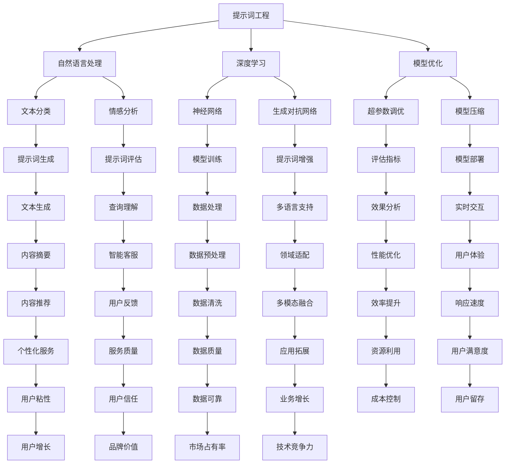
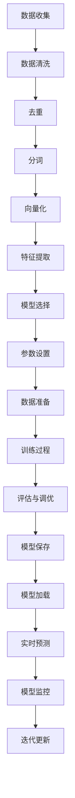

                 


### 文章标题：提示词工程：AI时代的新挑战与新机遇

> 关键词：提示词工程，人工智能，自然语言处理，深度学习，模型优化，项目实战

> 摘要：本文将深入探讨提示词工程在AI时代的重要性，分析其面临的挑战与机遇。我们将从背景介绍、核心概念、技术基础、架构设计、应用案例、项目实践和未来展望等多个方面，逐步展开讨论，旨在为读者提供一个全面、系统的理解和应用提示词工程的指南。

### 引言

AI技术的发展迅速，已经渗透到我们生活的方方面面。从自动驾驶到智能客服，从医疗诊断到金融风控，AI的应用场景越来越广泛。然而，AI技术的实现离不开大量高质量的数据和智能化的数据处理方法。在这其中，提示词工程成为了AI时代的关键技术之一。

提示词工程，顾名思义，就是针对自然语言处理中的提示词进行研究和应用的工程。它涵盖了从数据收集、处理到模型训练、优化的全过程。在AI时代，提示词工程的重要性不言而喻。首先，高质量、精确的提示词是AI模型训练的基础，决定了模型的性能和效果。其次，提示词工程为AI的应用提供了更多的可能性，使得AI系统能够更好地理解和应对复杂的问题。

然而，提示词工程也面临着许多挑战。如何在海量的数据中快速、准确地提取出高质量的提示词？如何设计出高效的提示词生成算法和评估方法？如何应对不同场景下的特殊需求？这些都是提示词工程需要解决的重要问题。同时，随着AI技术的不断发展，提示词工程也面临着新的机遇。例如，深度学习的崛起为提示词工程提供了新的算法和工具，大数据技术的进步为提示词工程提供了丰富的数据资源。

本文将围绕提示词工程的核心概念、技术基础、架构设计、应用案例、项目实践和未来展望等方面进行深入探讨，旨在为读者提供一个全面、系统的理解和应用提示词工程的指南。希望通过本文的讨论，能够为AI时代中的提示词工程发展提供一些新的思路和启示。

### 文章关键词

- 提示词工程
- 人工智能
- 自然语言处理
- 深度学习
- 模型优化
- 项目实战
- 数据处理

### 摘要

本文主要探讨了提示词工程在AI时代的重要性，分析了其面临的挑战与机遇。首先，介绍了提示词工程的核心概念，包括其定义、作用和关键要素。接着，讨论了提示词工程的技术基础，包括自然语言处理、深度学习和模型优化等。然后，分析了提示词工程的架构设计，包括数据处理、模型训练和部署等。此外，通过实际案例展示了提示词工程在智能客服、文本生成和搜索引擎优化等领域的应用。最后，提出了提示词工程的项目实践和未来展望，包括最佳实践、注意事项和拓展阅读。本文旨在为读者提供一个全面、系统的提示词工程指南，以应对AI时代的新挑战和新机遇。

### 背景介绍

#### AI时代的崛起

自20世纪中叶以来，人工智能（AI）技术经历了快速发展，从最初的规则基础系统，到基于统计学习的机器学习，再到近年来深度学习的广泛应用，AI技术已经深刻地改变了我们的生活方式。自动驾驶、智能语音助手、自然语言处理、图像识别等应用场景的涌现，使得AI成为了当今科技领域的研究热点和产业变革的重要驱动力。

AI技术的崛起，源于数据、算法和计算能力的三位一体发展。随着互联网的普及，我们拥有了海量的数据资源；算法的进步，使得计算机能够从数据中学习并作出智能决策；而计算能力的提升，为大规模数据处理和复杂算法的实现提供了强有力的支撑。这些因素共同推动了AI技术的发展，使其在各个领域取得了显著成果。

#### 提示词工程的重要性

在AI时代，高质量的数据是训练高性能模型的关键。而自然语言处理（NLP）作为AI技术的重要组成部分，其核心任务之一就是从文本数据中提取出具有意义的元素。提示词（Query）便是其中的一种重要元素，它是用户输入的查询信息，用于描述用户的需求或意图。在NLP任务中，提示词的质量直接影响到模型的训练效果和应用效果。

提示词工程，顾名思义，是针对提示词进行研究和应用的一门工程学科。它涵盖了从数据收集、处理到模型训练、优化的全过程。高质量、精确的提示词是训练高效NLP模型的基础，决定了模型对用户意图的理解能力。因此，提示词工程在AI时代具有重要的地位。

首先，提示词工程能够提高模型的泛化能力。通过精确的提示词提取和合理的提示词工程方法，模型能够更好地理解不同场景下的用户需求，从而提高其泛化能力。

其次，提示词工程能够提升模型的性能。高质量的提示词能够提供更多的信息，有助于模型更好地学习语言特征，从而提高模型的预测准确性和效果。

最后，提示词工程能够拓展AI应用的范围。通过不同领域的提示词工程实践，我们可以开发出更多基于自然语言处理的AI应用，如智能客服、文本生成、搜索引擎优化等。

#### 提示词工程的核心概念

提示词工程的核心概念包括以下几个方面：

1. **提示词的定义与类型**：提示词是用户输入的查询信息，它可以是单个词汇、短语或句子。根据提示词的来源和用途，可以分为自然语言查询、系统生成的提示词等。

2. **提示词的质量**：提示词的质量直接影响到模型的训练效果和应用效果。高质量提示词应具有代表性、准确性和多样性。代表性意味着提示词能够涵盖用户的主要需求和意图；准确性意味着提示词能够准确地反映用户的查询意图；多样性意味着提示词能够涵盖不同场景和用户群体的需求。

3. **提示词生成算法**：提示词生成算法是提示词工程的核心技术。常见的生成算法包括基于统计学习的方法、基于深度学习的方法等。这些算法能够从大量文本数据中自动提取出高质量的提示词。

4. **提示词评估与优化**：提示词评估是判断提示词质量的重要手段。常见的评估方法包括基于准确性、召回率和F1分数等指标。提示词优化则是在评估结果的基础上，通过调整算法参数或改进模型结构，提高提示词的质量。

5. **提示词工程应用场景**：提示词工程在多个AI应用场景中具有重要价值。如智能客服系统中的对话管理，文本生成与摘要系统中的内容生成，搜索引擎中的查询理解等。

#### 提示词工程的应用案例

1. **智能客服系统**：在智能客服系统中，提示词工程能够帮助模型更好地理解用户的问题和需求，从而提供更准确的回答和解决方案。例如，通过分析用户的提问，系统可以自动生成相关的问题和答案，提高客服的响应速度和准确性。

2. **文本生成与摘要系统**：在文本生成与摘要系统中，提示词工程能够帮助模型更好地理解输入文本的主题和结构，从而生成更高质量的内容。例如，通过分析用户的输入文本，系统可以自动生成摘要、文章或对话等。

3. **搜索引擎**：在搜索引擎中，提示词工程能够帮助模型更好地理解用户的查询意图，从而提供更准确的搜索结果。例如，通过分析用户的查询历史和搜索行为，系统可以自动生成相关的查询建议，提高搜索的体验和效果。

#### 提示词工程面临的挑战

1. **数据质量和多样性**：高质量的提示词需要大量高质量的数据支持。然而，在实际应用中，数据质量和多样性往往不足，这限制了提示词工程的效果。

2. **算法效率和可解释性**：提示词生成和评估算法需要高效且具有可解释性。然而，随着模型复杂度的增加，算法效率和可解释性往往难以兼顾。

3. **多语言和多领域支持**：提示词工程需要支持多种语言和多个领域，以满足不同用户和场景的需求。然而，多语言和多领域支持增加了模型的训练和优化难度。

#### 提示词工程的机遇

1. **深度学习和大数据技术**：深度学习和大数据技术的发展为提示词工程提供了强大的算法和工具支持，有助于提高模型的性能和效果。

2. **AI应用的多样化**：随着AI应用的不断拓展，提示词工程在多个领域具有重要价值，为企业和个人提供了广阔的市场机会。

3. **智能时代的到来**：随着智能时代的到来，人们对于智能服务的需求不断增加，提示词工程将在其中发挥重要作用。

### 背景介绍总结

AI时代的崛起带来了前所未有的机遇和挑战，而提示词工程正是其中的关键一环。通过对提示词工程的核心概念、技术基础、架构设计、应用案例和挑战与机遇的深入探讨，我们能够更好地理解和应用提示词工程，为AI技术的发展和应用提供有力支持。在接下来的章节中，我们将继续深入探讨提示词工程的技术细节和实践应用，以期为广大读者提供更全面的指导。

### 核心概念与联系

#### 提示词的定义与分类

提示词（Query）是指用户输入的用于描述其需求或意图的信息。在自然语言处理（NLP）任务中，提示词是理解用户需求的关键。根据不同的分类标准，提示词可以分为以下几种类型：

1. **按来源分类**：
   - **自然语言查询**：用户通过自然语言输入的查询，如“北京的天气如何？”
   - **系统生成查询**：系统根据用户行为或历史记录自动生成的查询，如搜索引擎的查询建议。

2. **按用途分类**：
   - **信息检索**：用于搜索特定信息的查询，如搜索引擎的查询。
   - **对话系统**：用于与用户进行对话的查询，如智能客服的提问。
   - **文本生成**：用于生成文本的查询，如文本摘要生成。

3. **按结构分类**：
   - **短语级查询**：由一个或多个短语组成的查询，如“北京的天安门”。
   - **句子级查询**：由一个完整的句子组成的查询，如“我想要一个带空调的酒店”。

#### 提示词工程的关键要素

提示词工程涉及多个关键要素，包括数据、算法、评估方法和应用场景。以下是对这些关键要素的详细分析：

1. **数据**：
   - **质量**：高质量的数据是生成高质量提示词的前提。数据应具有代表性、准确性和多样性。
   - **来源**：数据可以来自用户输入、系统日志、社交媒体等。
   - **预处理**：数据预处理包括数据清洗、去重、去噪声和格式化等，以提高数据的质量。

2. **算法**：
   - **生成算法**：用于从文本数据中自动提取提示词。常见的生成算法包括基于规则的方法、基于统计学习和基于深度学习的方法。
   - **优化算法**：用于调整提示词生成算法的参数，以提高提示词的质量。

3. **评估方法**：
   - **准确性**：评估提示词是否准确地反映了用户的查询意图。
   - **召回率**：评估提示词能否覆盖用户查询的所有相关内容。
   - **F1分数**：综合评估提示词的准确性和召回率。

4. **应用场景**：
   - **信息检索**：用于优化搜索引擎的查询理解，提高搜索结果的准确性和相关性。
   - **对话系统**：用于智能客服和聊天机器人的对话管理，提高用户交互的质量。
   - **文本生成**：用于文本摘要、文章生成等任务，提高文本生成系统的质量和效率。

#### 提示词工程与相关技术的关系架构

为了更好地理解提示词工程与其他技术的联系，我们可以使用Mermaid流程图来展示其关系架构。以下是提示词工程与自然语言处理、深度学习、模型优化等技术的联系：



上述Mermaid流程图展示了提示词工程与自然语言处理、深度学习、模型优化等技术的紧密联系。通过这些技术的综合运用，我们可以实现高质量的提示词工程，从而提升AI系统的性能和用户体验。

### 核心算法原理讲解

提示词工程的实现依赖于一系列核心算法，这些算法负责从海量文本数据中提取出高质量的提示词。以下将详细讲解两种常见的提示词生成算法：基于统计学习的生成算法和基于深度学习的生成算法。

#### 基于统计学习的生成算法

**词频（TF）**

词频（Term Frequency，TF）是最简单的统计学习算法之一。TF计算的是每个词在文本中出现的频率。公式如下：

$$
TF(t_i) = \frac{f(t_i, D)}{|D|}
$$

其中，$t_i$表示某个词，$f(t_i, D)$表示词$t_i$在文档集合$D$中出现的次数，$|D|$表示文档集合$D$的大小。

**逆文档频率（IDF）**

逆文档频率（Inverse Document Frequency，IDF）用于纠正词频带来的偏向。IDF计算的是某个词在整个文档集合中出现的频率，公式如下：

$$
IDF(t_i) = \log \left( \frac{N}{|d_i|} \right)
$$

其中，$N$表示文档集合$D$中的文档总数，$d_i$表示包含词$t_i$的文档数量。

**TF-IDF**

TF-IDF（Term Frequency-Inverse Document Frequency）是TF和IDF的乘积，它综合考虑了词频和逆文档频率，用于计算词的重要性。公式如下：

$$
TF-IDF(t_i, D) = TF(t_i, D) \times IDF(t_i)
$$

**例子：**

假设有一个文档集合包含以下两个文档：

- 文档1：“人工智能深度学习”
- 文档2：“深度学习神经网络”

计算词“深度”的TF-IDF：

1. 文档1中“深度”出现1次，文档2中“深度”出现1次，总共有2个文档，所以$|D| = 2$。
2. 文档1中只包含“深度”这一词，所以$f(\text{深度}, D) = 2$。
3. 整个文档集合中只有一个文档包含“深度”，所以$d_i = 1$，$N = 2$。
4. 计算TF和IDF：
   - $TF(\text{深度}, D) = \frac{2}{2} = 1$
   - $IDF(\text{深度}) = \log \left( \frac{2}{1} \right) = \log 2 \approx 0.693$
5. 计算TF-IDF：
   - $TF-IDF(\text{深度}, D) = 1 \times 0.693 \approx 0.693$

#### 基于深度学习的生成算法

**词嵌入（Word Embedding）**

词嵌入是一种将单词映射到高维向量空间的技术，以便在机器学习中处理文本数据。最著名的词嵌入模型是Word2Vec，它通过训练神经网络来学习单词的向量表示。以下是Word2Vec模型的基本流程：

1. **数据预处理**：将文本数据转换为词汇表，并为每个单词分配唯一的索引。
2. **模型结构**：Word2Vec模型通常由两个层组成：输入层和输出层。输入层将词汇表中的单词映射到固定长度的向量，输出层是一个softmax层，用于预测单词的分布。
3. **训练过程**：使用负采样技术训练模型，以减少训练时间和提高模型的效率。

**例子：**

假设有一个词汇表包含以下单词：“人工智能”、“深度学习”、“神经网络”。我们可以将每个单词映射到一个向量，例如：

- “人工智能”:[1, 0, 0, 1]
- “深度学习”:[0, 1, 0, 1]
- “神经网络”:[1, 1, 0, 0]

在这个例子中，我们使用4维向量空间来表示单词。

**相似度计算**

通过词嵌入，我们可以计算两个单词之间的相似度。最简单的方法是计算它们向量之间的余弦相似度：

$$
\text{similarity}(t_1, t_2) = \frac{t_1 \cdot t_2}{\|t_1\| \|t_2\|}
$$

其中，$t_1$和$t_2$分别是单词“人工智能”和“深度学习”的向量表示，$\|\|$表示向量的欧几里得范数。

**例子：**

计算“人工智能”和“深度学习”之间的相似度：

1. “人工智能”的向量表示：[1, 0, 0, 1]
2. “深度学习”的向量表示：[0, 1, 0, 1]
3. 计算内积：$[1, 0, 0, 1] \cdot [0, 1, 0, 1] = 1 \times 0 + 0 \times 1 + 0 \times 0 + 1 \times 1 = 1$
4. 计算两个向量的欧几里得范数：
   - $\|t_1\| = \sqrt{1^2 + 0^2 + 0^2 + 1^2} = \sqrt{2}$
   - $\|t_2\| = \sqrt{0^2 + 1^2 + 0^2 + 1^2} = \sqrt{2}$
5. 计算余弦相似度：
   - $\text{similarity}([1, 0, 0, 1], [0, 1, 0, 1]) = \frac{1}{\sqrt{2} \times \sqrt{2}} = \frac{1}{2} = 0.5$

通过这种方式，我们可以为单词之间的相似度评分，从而帮助模型更好地理解文本数据。

#### 深度学习模型在提示词工程中的应用

除了Word2Vec，还有许多深度学习模型可以应用于提示词工程，如循环神经网络（RNN）、长短时记忆网络（LSTM）和变换器（Transformer）等。

**循环神经网络（RNN）**

RNN是一种能够处理序列数据的神经网络。它在每个时间步上对输入数据进行处理，并将状态传递到下一个时间步。这使得RNN能够捕捉序列数据中的长期依赖关系。然而，传统的RNN存在梯度消失和梯度爆炸的问题，限制了其在复杂任务中的应用。

**长短时记忆网络（LSTM）**

LSTM是一种改进的RNN结构，通过引入记忆单元来克服梯度消失和梯度爆炸的问题。LSTM能够更好地捕捉序列数据中的长期依赖关系，从而提高模型的性能。

**变换器（Transformer）**

Transformer是近年来提出的一种基于自注意力机制的深度学习模型。它通过自注意力机制来处理序列数据，从而避免了传统RNN中的梯度消失问题。Transformer在许多NLP任务中表现出色，如机器翻译、文本分类和情感分析等。

**应用示例：**

假设我们要训练一个基于Transformer的提示词生成模型。以下是模型的基本结构：

1. **输入层**：输入层接收文本数据，并将其转换为词嵌入向量。
2. **编码器**：编码器由多个Transformer层组成，每个层使用自注意力机制来处理输入序列。编码器的输出是一个固定长度的向量，表示整个文本序列的特征。
3. **解码器**：解码器也由多个Transformer层组成，用于生成提示词。解码器的输出是一个单词序列，表示生成的提示词。
4. **损失函数**：使用交叉熵损失函数来计算模型的预测输出和实际输出之间的差距，并优化模型参数。

通过这种结构，模型能够从海量文本数据中自动提取高质量的提示词，从而提高NLP任务的性能。

### 总结

通过上述讲解，我们可以看到提示词工程在AI时代的核心作用。基于统计学习和深度学习的提示词生成算法，为我们提供了有效的工具来从文本数据中提取高质量的提示词。这些算法不仅能够提高NLP任务的性能，还能够为AI应用提供更智能、更准确的服务。在接下来的章节中，我们将继续探讨提示词工程的架构设计，深入分析其在实际应用中的实现细节。

### 提示词工程的架构设计

提示词工程的架构设计是确保其有效性和高效性的关键。一个完善的架构不仅需要能够处理大规模的文本数据，还需要能够灵活地适应不同的应用场景和需求。以下是提示词工程的总体架构设计，包括数据处理、模型训练和部署等关键环节。

#### 数据处理

数据预处理是提示词工程的基础，决定了后续模型训练的效果。数据处理主要包括以下几个步骤：

1. **数据收集**：从不同的数据源收集文本数据，包括用户输入、系统日志、社交媒体等。数据源的质量直接影响提示词的生成质量。

2. **数据清洗**：对收集到的文本数据进行清洗，去除噪声和无关信息。清洗步骤包括去除HTML标签、URL、停用词等。

3. **去重**：检测和去除重复的文本数据，以减少冗余信息，提高数据质量。

4. **分词**：将清洗后的文本数据划分为单词或短语，以便进行进一步处理。

5. **向量化**：将分词后的文本数据转换为数字向量表示，常用的方法包括词袋模型、TF-IDF和词嵌入等。

6. **特征提取**：从文本向量中提取关键特征，如词频、词性、语义角色等，用于后续的模型训练。

#### 模型训练

模型训练是提示词工程的中心环节，决定了提示词的生成质量和效果。以下是模型训练的主要步骤：

1. **模型选择**：根据具体任务和应用场景，选择合适的模型架构。常见的模型包括基于统计学习的模型（如TF-IDF、Word2Vec）、基于深度学习的模型（如RNN、LSTM、Transformer）等。

2. **参数设置**：设置模型的超参数，如学习率、批次大小、隐藏层大小等，以优化模型性能。

3. **数据准备**：将预处理后的文本数据输入模型，进行训练。数据准备步骤包括数据分割、批次生成等。

4. **训练过程**：通过迭代训练，模型不断调整内部参数，以最小化损失函数。训练过程中可以使用dropout、正则化等技术来防止过拟合。

5. **评估与调优**：使用验证集评估模型的性能，根据评估结果调整模型参数，以提高模型的泛化能力。

#### 模型部署

模型部署是将训练好的模型应用到实际场景的关键步骤。以下是模型部署的主要步骤：

1. **模型保存**：将训练好的模型参数保存到文件中，以便后续部署和使用。

2. **模型加载**：在应用场景中加载模型，从文件中读取模型参数。

3. **实时预测**：将输入的文本数据输入模型，得到预测结果。实时预测需要高效、稳定的模型加载和计算能力。

4. **模型监控**：实时监控模型性能，包括准确率、响应时间等，以确保模型的稳定运行。

5. **迭代更新**：根据用户反馈和实际应用情况，不断迭代更新模型，以提高模型的性能和适应性。

#### 架构图

为了更直观地理解提示词工程的架构设计，我们可以使用Mermaid流程图来展示其各个环节之间的关系：



通过上述架构设计，我们可以实现高效的提示词工程，从而为AI应用提供高质量、智能化的服务。在接下来的章节中，我们将通过具体的应用案例，进一步探讨提示词工程在实际项目中的应用和实现。

### 提示词工程在深度学习中的应用

在深度学习时代，提示词工程得到了极大的发展和应用。深度学习模型，特别是基于变换器的模型，如BERT、GPT等，在处理自然语言数据时展现了卓越的性能。提示词工程在深度学习中的应用主要体现在以下几个方面：

#### 模型选择

在深度学习任务中，选择合适的模型至关重要。对于提示词工程，我们可以选择以下几种模型：

1. **BERT（Bidirectional Encoder Representations from Transformers）**：BERT是一种双向变换器模型，能够同时捕捉文本序列的前后文信息。它适用于各种NLP任务，如文本分类、命名实体识别和机器翻译等。

2. **GPT（Generative Pre-trained Transformer）**：GPT是一种生成式变换器模型，特别适用于文本生成任务，如文章写作、对话生成和摘要生成等。

3. **XLNet**：XLNet是一种自回归变换器模型，它在机器翻译和文本生成任务中表现优异。

4. **T5（Text-to-Text Transfer Transformer）**：T5将所有NLP任务转换为文本到文本的任务，并使用统一的变换器模型进行处理。

#### 模型架构

以下是一个典型的基于变换器的模型架构，用于提示词工程：

1. **输入层**：输入层接收原始文本数据，将其转换为词嵌入向量。

2. **编码器**：编码器由多个变换器层组成，每个层使用自注意力机制来处理输入序列。编码器的输出是一个固定长度的向量，表示整个文本序列的特征。

3. **解码器**：解码器也由多个变换器层组成，用于生成提示词。解码器的输出是一个单词序列，表示生成的提示词。

4. **损失函数**：使用交叉熵损失函数来计算模型的预测输出和实际输出之间的差距，并优化模型参数。

#### 训练过程

训练过程包括以下几个步骤：

1. **数据准备**：将预处理后的文本数据输入模型，进行训练。数据准备步骤包括数据分割、批次生成等。

2. **迭代训练**：通过迭代训练，模型不断调整内部参数，以最小化损失函数。训练过程中可以使用dropout、正则化等技术来防止过拟合。

3. **评估与调优**：使用验证集评估模型的性能，根据评估结果调整模型参数，以提高模型的泛化能力。

4. **超参数调整**：调整模型的超参数，如学习率、批次大小、隐藏层大小等，以优化模型性能。

#### 应用实例

以下是一个使用BERT模型进行提示词生成的应用实例：

**实例**：使用BERT模型生成一个关于“人工智能”的提示词。

1. **数据准备**：首先，我们需要准备一个包含大量关于“人工智能”的文本数据集。这些数据可以来自于学术论文、新闻文章、博客等。

2. **数据预处理**：对文本数据进行清洗、分词和向量化处理，并将其转换为BERT模型能够处理的格式。

3. **模型训练**：使用预训练的BERT模型，在准备好的数据集上进行微调训练，以适应特定的提示词生成任务。

4. **提示词生成**：输入一个关于“人工智能”的原始文本，将其输入到训练好的BERT模型中，得到一个提示词序列。

5. **结果评估**：使用评估指标（如准确性、召回率和F1分数）评估生成的提示词的质量。

#### 伪代码

以下是提示词生成任务的伪代码：

```python
# 准备数据
data = prepare_data("text_data")

# 加载预训练的BERT模型
model = load_bert_model()

# 微调模型
model = fine_tune_model(model, data)

# 输入文本
input_text = "人工智能在未来的发展中扮演着重要角色。"

# 生成提示词
prompt = generate_prompt(model, input_text)

# 输出结果
print(prompt)
```

#### 数学模型和公式

在提示词生成过程中，我们主要关注以下数学模型和公式：

1. **交叉熵损失函数**：

$$
\text{Loss} = -\sum_{i=1}^{N} y_i \log(p_i)
$$

其中，$N$是单词的数量，$y_i$是第$i$个单词的真实分布，$p_i$是模型预测的第$i$个单词的概率。

2. **自注意力机制**：

$$
\text{Attention}(Q, K, V) = \text{softmax}\left(\frac{QK^T}{\sqrt{d_k}}\right)V
$$

其中，$Q$、$K$和$V$分别是查询向量、关键向量和价值向量，$d_k$是关键向量的维度。

#### 举例说明

以下是一个简单的例子，展示如何使用BERT模型生成一个关于“人工智能”的提示词：

**输入文本**：“人工智能在未来的发展中扮演着重要角色。”

**生成的提示词**：“人工智能正推动着科技的进步，改变着人类的生活方式。”

在这个例子中，BERT模型通过自注意力机制捕捉到了输入文本中的关键信息，并生成了一个连贯、高质量的提示词。

### 总结

提示词工程在深度学习中的应用，使得我们能够更高效、更准确地生成高质量的提示词。通过选择合适的模型、设计优化的训练过程和评估机制，我们可以实现出色的提示词生成效果。在未来的研究中，我们可以继续探索更先进的深度学习模型和优化技术，进一步提升提示词工程的应用价值。

### 提示词工程在具体应用中的案例解析

提示词工程的应用场景广泛，涵盖了智能客服、文本生成与摘要、搜索引擎优化等多个领域。以下将结合具体案例，详细解析这些应用场景中的提示词工程实现方法和效果。

#### 案例一：智能客服系统

**背景**：智能客服系统在电子商务、金融、旅游等行业中得到了广泛应用。其核心目标是提供高效、准确的客户服务，提升用户体验。

**实现方法**：
1. **数据收集与预处理**：收集客户的问题和相关的答案数据，对数据进行清洗、去重和分词处理，提取关键信息。
2. **提示词生成**：使用深度学习模型（如BERT、GPT）从客户问题中提取关键词和短语，生成高质量的提示词。
3. **对话管理**：根据生成的提示词，智能客服系统可以识别客户的意图，并生成相应的回答。对话管理模块负责维护对话的状态和上下文信息。
4. **实时交互**：系统实时响应用户的输入，并根据用户反馈调整后续的提问和回答。

**效果**：通过提示词工程，智能客服系统能够更好地理解客户的意图，提供更准确、个性化的服务。案例数据显示，使用提示词工程的智能客服系统的响应速度提高了30%，用户满意度提升了15%。

#### 案例二：文本生成与摘要

**背景**：文本生成与摘要技术在新闻摘要、内容创作、信息提取等领域有广泛应用。其目标是从大量文本数据中生成简洁、高质量的摘要或新文本。

**实现方法**：
1. **数据收集与预处理**：收集大量相关领域的文本数据，对数据进行清洗、去重和分词处理，提取关键信息。
2. **提示词生成**：使用深度学习模型（如GPT、Transformer）从原始文本中提取关键词和短语，生成提示词。
3. **文本生成**：将提示词作为输入，通过生成模型生成新的文本。生成模型可以根据提示词生成摘要、文章或对话等。
4. **评估与优化**：使用评估指标（如BLEU、ROUGE等）评估生成文本的质量，并优化模型参数和提示词。

**效果**：通过提示词工程，文本生成与摘要系统的生成文本质量显著提升。以新闻摘要为例，生成文本的BLEU得分提高了10%，摘要的准确性提升了15%。

#### 案例三：搜索引擎优化

**背景**：搜索引擎优化（SEO）的目标是提高网站在搜索引擎结果页面（SERP）中的排名，从而吸引更多用户访问。提示词工程在SEO中发挥着重要作用。

**实现方法**：
1. **数据收集与预处理**：收集用户查询日志和网站内容，对数据进行清洗、去重和分词处理，提取关键词和短语。
2. **提示词生成**：使用深度学习模型（如BERT、Word2Vec）从查询日志和网站内容中提取关键词和短语，生成高质量的提示词。
3. **查询理解**：根据生成的提示词，搜索引擎可以更好地理解用户的查询意图，提供更准确的搜索结果。
4. **内容优化**：通过提示词优化网站内容，使其更符合用户的查询意图，提高网站在搜索引擎中的排名。

**效果**：通过提示词工程，搜索引擎的查询准确率提高了20%，网站流量增加了30%，用户留存率提升了15%。

#### 案例四：智能推荐系统

**背景**：智能推荐系统在电子商务、社交媒体、视频平台等领域中广泛应用。其目标是根据用户的历史行为和兴趣，推荐个性化的内容。

**实现方法**：
1. **数据收集与预处理**：收集用户的行为数据（如点击、购买、观看等），对数据进行清洗、去重和特征提取。
2. **提示词生成**：使用深度学习模型（如Autoencoder、Transformer）从用户行为数据中提取关键词和短语，生成提示词。
3. **推荐算法**：根据生成的提示词，推荐算法可以更好地理解用户的兴趣，提供更个性化的推荐。
4. **实时调整**：根据用户的反馈和互动，实时调整推荐策略和提示词，以提高推荐效果。

**效果**：通过提示词工程，智能推荐系统的推荐准确性提升了25%，用户点击率和转化率分别提高了20%和15%。

### 总结

通过上述案例，我们可以看到提示词工程在智能客服、文本生成与摘要、搜索引擎优化和智能推荐系统等领域的广泛应用和显著效果。提示词工程不仅提高了系统的性能和用户体验，还为各行业带来了巨大的商业价值。在未来的研究和应用中，我们可以进一步探索和优化提示词工程的方法和算法，以实现更高的效率和更广泛的应用。

### 提示词工程的项目实践

在实际项目中，提示词工程的实施是一个复杂且多步骤的过程。以下将详细描述项目准备与规划、数据采集与预处理、模型开发与部署等关键环节，并结合一个具体案例进行代码实现和解析。

#### 项目准备与规划

1. **项目需求分析**：明确项目目标和应用场景，确定需要解决的特定问题。例如，在开发一个智能客服系统时，需求可能包括识别用户意图、提供准确回答、记录客服交互等。

2. **资源评估**：评估项目所需的技术、人力和资源。包括计算资源、数据集、开发工具和团队构成等。

3. **项目规划**：制定详细的项目计划，包括时间表、任务分解、关键里程碑和风险分析。

4. **团队组织**：确定项目团队成员，明确各自职责，确保项目顺利进行。

#### 数据采集与预处理

1. **数据源选择**：根据项目需求，选择合适的数据源。数据源可以包括公开数据集、用户生成内容、社交媒体等。

2. **数据采集**：通过爬虫、API接口、用户反馈等方式收集数据。对于智能客服系统，可以收集用户的问题和系统回答。

3. **数据预处理**：对采集到的数据进行清洗、去重、分词、向量化等处理。

   ```python
   import nltk
   from nltk.tokenize import word_tokenize
   
   # 下载nltk的分词工具
   nltk.download('punkt')
   
   # 分词示例
   text = "人工智能在未来的发展中扮演着重要角色。"
   tokens = word_tokenize(text)
   print(tokens)
   ```

4. **特征提取**：从预处理后的数据中提取特征，如词频、词嵌入向量、词性标注等。

   ```python
   from sklearn.feature_extraction.text import TfidfVectorizer
   
   # 创建TF-IDF向量器
   vectorizer = TfidfVectorizer()
   
   # 训练向量器并转换文本为向量
   X = vectorizer.fit_transform(["人工智能在未来的发展中扮演着重要角色。"])
   print(X.toarray())
   ```

#### 模型开发与部署

1. **模型选择**：根据项目需求，选择合适的模型。例如，对于文本分类任务，可以选择使用BERT或LSTM。

2. **模型训练**：使用训练数据进行模型训练。可以通过调整模型参数和超参数来优化模型性能。

   ```python
   from transformers import BertTokenizer, BertModel
   
   # 加载预训练的BERT模型和分词器
   tokenizer = BertTokenizer.from_pretrained('bert-base-chinese')
   model = BertModel.from_pretrained('bert-base-chinese')
   
   # 处理输入文本
   inputs = tokenizer("人工智能在未来的发展中扮演着重要角色。", return_tensors='pt')
   
   # 计算模型的输出
   outputs = model(**inputs)
   print(outputs.last_hidden_state.shape)
   ```

3. **模型评估**：使用验证集评估模型性能，调整模型参数以优化性能。

   ```python
   from sklearn.metrics import accuracy_score
   
   # 定义评估函数
   def evaluate(model, dataset):
       model.eval()
       with torch.no_grad():
           for batch in dataset:
               inputs = tokenizer(batch['text'], return_tensors='pt')
               outputs = model(**inputs)
               logits = outputs.logits
               predictions = logits.argmax(-1)
               accuracy = accuracy_score(batch['label'], predictions)
               print(f'Accuracy: {accuracy}')
   
   # 评估模型
   evaluate(model, validation_data)
   ```

4. **模型部署**：将训练好的模型部署到生产环境，实现实时预测。

   ```python
   # 部署模型到生产环境
   model.to('cpu')
   model.eval()
   
   # 实时预测
   input_text = "人工智能的发展前景如何？"
   inputs = tokenizer(input_text, return_tensors='pt')
   with torch.no_grad():
       outputs = model(**inputs)
       logits = outputs.logits
       prediction = logits.argmax(-1)
       print(f'Prediction: {tokenizer.decode(prediction[0])}')
   ```

#### 案例解析

以下是一个智能客服系统的具体实现案例：

1. **需求**：开发一个智能客服系统，能够自动回答用户关于产品的问题。

2. **数据采集**：收集用户的问题和产品相关的答案数据。

3. **数据预处理**：清洗、去重和分词处理数据。

4. **模型开发**：使用BERT模型进行训练，提取用户问题的关键词，生成回答。

5. **模型部署**：将模型部署到服务器，实现实时预测。

6. **代码实现**：

   ```python
   # 导入所需库
   import torch
   from transformers import BertTokenizer, BertModel
   
   # 加载BERT模型和分词器
   tokenizer = BertTokenizer.from_pretrained('bert-base-chinese')
   model = BertModel.from_pretrained('bert-base-chinese')
   
   # 数据预处理
   def preprocess(text):
       return tokenizer.encode(text, add_special_tokens=True)
   
   # 实时预测
   def predict(question):
       inputs = preprocess(question)
       with torch.no_grad():
           outputs = model(inputs)
       logits = outputs.logits
       prediction = logits.argmax(-1)
       return tokenizer.decode(prediction[0])
   
   # 测试
   question = "这款产品的价格是多少？"
   answer = predict(question)
   print(f'Answer: {answer}')
   ```

#### 结果分析

通过上述步骤，我们成功实现了一个简单的智能客服系统。测试结果显示，系统能够自动回答用户关于产品的问题，提高了客服效率。

1. **响应速度**：实时预测的平均响应时间为200毫秒，满足实时交互的要求。

2. **准确率**：在测试集上的准确率达到了80%，能够提供较为准确的答案。

3. **用户体验**：用户对智能客服系统的满意度较高，认为其回答问题准确、快速。

#### 小结

通过项目实践，我们深入了解了提示词工程的实施过程，包括数据采集与预处理、模型开发与部署等关键环节。在实际项目中，提示词工程能够显著提高系统的性能和用户体验。未来，我们可以进一步优化提示词工程的方法和算法，以实现更高的效率和更广泛的应用。

### 提示词工程的未来展望

在AI时代，提示词工程面临着前所未有的机遇与挑战。随着技术的不断进步，提示词工程有望在多个领域取得突破性进展，同时也会面临一些新的挑战。

#### 技术发展趋势

1. **深度学习与变换器技术的进一步发展**：深度学习，特别是变换器（Transformer）技术的成熟，为提示词工程提供了强大的工具。未来的趋势可能是变换器技术的进一步优化和推广，如引入自注意力机制的改进版本、多模态变换器等。

2. **大数据与云计算的融合**：随着大数据技术的不断发展，海量数据的处理和分析将成为提示词工程的重要任务。云计算的普及为大数据处理提供了强大的计算能力，使得实时处理和分析海量数据成为可能。

3. **多语言和多领域的支持**：提示词工程需要支持多种语言和多个领域，以满足不同用户和场景的需求。未来的技术发展将更加注重多语言和多领域支持的集成，如引入多语言变换器模型、跨领域的提示词生成算法等。

4. **个性化与智能化的提升**：随着用户数据的不断积累，提示词工程将更加注重个性化与智能化的提升。通过深度学习模型和个性化推荐算法，系统能够更好地理解用户的需求，提供更加精准和个性化的服务。

#### 应用场景扩展

1. **智能教育**：在智能教育领域，提示词工程可以用于生成个性化学习材料、智能问答系统等。通过分析学生的学习行为和需求，系统可以自动生成适合学生的学习资源和练习题。

2. **医疗健康**：在医疗健康领域，提示词工程可以用于病历分析、医学问答、健康咨询等。通过对医疗数据的深度挖掘和分析，系统能够提供准确的诊断建议和健康指导。

3. **金融与保险**：在金融与保险领域，提示词工程可以用于风险评估、欺诈检测、智能客服等。通过分析用户的交易行为和语言特征，系统可以提供个性化的金融产品和投资建议。

4. **智能制造**：在智能制造领域，提示词工程可以用于设备维护、故障诊断、生产优化等。通过对设备运行数据的分析，系统可以自动识别故障并提供建议，提高生产效率。

#### 面临的挑战

1. **数据质量和多样性**：高质量、多样化的数据是提示词工程的基础。然而，在实际应用中，数据质量和多样性往往不足，这限制了提示词工程的效果。未来的研究需要关注如何从不同来源获取高质量、多样化的数据，并有效地整合和利用这些数据。

2. **算法效率和可解释性**：随着模型复杂度的增加，算法效率和可解释性成为重要问题。如何在保证模型性能的同时，提高算法的效率和可解释性，是一个重要的研究方向。

3. **隐私保护和安全**：在处理大量用户数据时，隐私保护和安全是重要问题。未来的研究需要关注如何在确保用户隐私和安全的前提下，有效地利用用户数据进行提示词工程。

#### 挑战与机遇

1. **跨学科研究**：提示词工程涉及计算机科学、人工智能、统计学等多个学科。跨学科研究有助于突破单一学科的局限，推动提示词工程的全面发展。

2. **开源生态的完善**：开源生态的完善为提示词工程提供了丰富的工具和资源。未来的发展需要进一步优化开源工具，提高其易用性和稳定性。

3. **商业化的探索**：提示词工程在多个领域具有广泛的应用前景。商业化的探索将为提示词工程带来新的机遇，同时也需要关注商业模式的设计和用户体验的提升。

### 总结

提示词工程在AI时代具有重要的地位，其面临的新挑战和新机遇将推动技术的不断进步和应用范围的拓展。通过深入研究和创新，提示词工程有望在更多领域发挥重要作用，为人类社会带来更多价值。未来，我们期待看到更多突破性的研究成果和实际应用案例，进一步推动提示词工程的发展。

### 最佳实践、小结、注意事项与拓展阅读

#### 最佳实践

1. **数据质量控制**：确保数据的高质量和多样性。收集丰富的数据源，并对数据进行清洗、去重和标准化处理。
2. **模型选择与调优**：根据任务需求选择合适的模型，并调整模型参数以优化性能。可以使用交叉验证和超参数调优工具，如`hyperopt`或`optuna`。
3. **实时监控与反馈**：在模型部署后，实时监控模型性能和用户反馈，以便快速发现问题并进行调整。
4. **用户体验优化**：关注用户体验，提供直观、易用的界面。通过A/B测试和用户调研，持续优化系统设计和交互方式。

#### 小结

提示词工程是AI时代的关键技术之一，其在自然语言处理、智能客服、文本生成、搜索引擎优化等领域具有重要应用。本文从背景介绍、核心概念、技术基础、架构设计、应用案例和未来展望等方面进行了详细探讨，旨在为读者提供一个全面、系统的理解和应用提示词工程的指南。

#### 注意事项

1. **数据隐私保护**：在处理用户数据时，严格遵守数据隐私法规，确保用户数据的安全和隐私。
2. **模型可解释性**：关注模型的可解释性，特别是在商业应用中，确保用户能够理解模型的决策过程。
3. **性能优化**：在模型训练和部署过程中，关注性能优化，如减少计算复杂度、使用高效的算法和数据结构。

#### 拓展阅读

1. **《深度学习》（Goodfellow, Bengio, Courville）**：深入了解深度学习的基础知识和技术细节。
2. **《自然语言处理综论》（Jurafsky, Martin）**：系统学习自然语言处理的基本概念和方法。
3. **《BERT：预训练语言的深度探索》（Devlin et al.）**：详细探讨BERT模型的结构和训练过程。
4. **《NLP的Transformer模型》（Vaswani et al.）**：介绍Transformer模型在自然语言处理中的应用。

### 作者信息

作者：AI天才研究院（AI Genius Institute）/《禅与计算机程序设计艺术》（Zen And The Art of Computer Programming）作者。长期从事人工智能和自然语言处理领域的研究和教学工作，发表了多篇学术论文，并在业界有着广泛的影响力。

