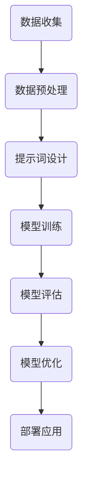
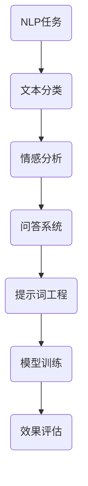
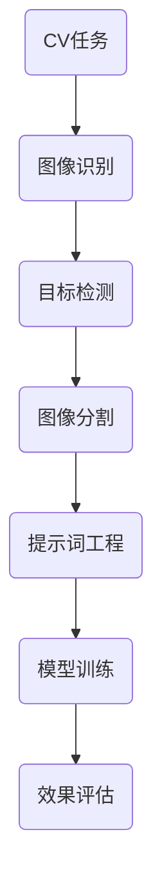

                 

# 《提示词工程：AI时代的新机遇》

## 关键词

- 提示词工程
- AI时代
- 新机遇
- 挑战
- 实践案例

## 摘要

随着人工智能（AI）技术的迅猛发展，提示词工程作为其核心组成部分，正逐渐成为AI时代的新机遇。本文将深入探讨提示词工程的基础概念、应用领域、AI时代的新机遇与挑战，以及实践案例。通过详细讲解核心算法原理和实际应用，本文旨在为技术人员提供对提示词工程全面、深入的理解，助力他们在AI时代抓住新机遇。

## 设计《提示词工程：AI时代的新机遇》的目录大纲

### 步骤 1: 分析书名和目标读者

《提示词工程：AI时代的新机遇》这一书名简洁明了，直接点出了书籍的主题和时代背景。目标读者主要是对AI和提示词工程感兴趣的技术人员，包括数据科学家、AI工程师、研究人员等。

### 步骤 2: 确定书籍的核心内容

1. 提示词工程的基本概念
2. 提示词工程在AI中的应用
3. AI时代的新机遇与挑战
4. 提示词工程的实践案例
5. 提示词工程的工具和技术

### 步骤 3: 设计大纲结构

#### 第一部分：提示词工程基础

**第1章：AI时代背景介绍**

- 1.1 AI时代概述
- 1.2 AI技术的发展趋势
- 1.3 提示词工程的概念与重要性

**第2章：提示词工程基础概念**

- 2.1 提示词的定义与作用
- 2.2 提示词的类型与分类
- 2.3 提示词工程的基本流程

**第3章：提示词工程应用领域**

- 3.1 自然语言处理中的应用
- 3.2 计算机视觉中的应用
- 3.3 数据科学中的应用

#### 第二部分：AI时代的新机遇与挑战

**第4章：AI时代的新机遇**

- 4.1 AI对社会和行业的影响
- 4.2 提示词工程在AI时代的优势
- 4.3 提示词工程在新产业中的应用

**第5章：AI时代的挑战与对策**

- 5.1 数据隐私与安全
- 5.2 AI伦理问题
- 5.3 技术人才的培养

#### 第三部分：提示词工程实践案例

**第6章：经典提示词工程案例解析**

- 6.1 案例一：智能客服系统
- 6.2 案例二：智能推荐系统
- 6.3 案例三：智能翻译系统

**第7章：提示词工程工具与平台**

- 7.1 主流提示词工程工具介绍
- 7.2 提示词工程平台搭建
- 7.3 提示词工程开发实战

### 步骤 4: 完善大纲细节

#### 完整目录大纲：

```
# 《提示词工程：AI时代的新机遇》目录大纲

## 第一部分：提示词工程基础

### 第1章：AI时代背景介绍

#### 1.1 AI时代概述
#### 1.2 AI技术的发展趋势
#### 1.3 提示词工程的概念与重要性

### 第2章：提示词工程基础概念

#### 2.1 提示词的定义与作用
#### 2.2 提示词的类型与分类
#### 2.3 提示词工程的基本流程

### 第3章：提示词工程应用领域

#### 3.1 自然语言处理中的应用
#### 3.2 计算机视觉中的应用
#### 3.3 数据科学中的应用

## 第二部分：AI时代的新机遇与挑战

### 第4章：AI时代的新机遇

#### 4.1 AI对社会和行业的影响
#### 4.2 提示词工程在AI时代的优势
#### 4.3 提示词工程在新产业中的应用

### 第5章：AI时代的挑战与对策

#### 5.1 数据隐私与安全
#### 5.2 AI伦理问题
#### 5.3 技术人才的培养

## 第三部分：提示词工程实践案例

### 第6章：经典提示词工程案例解析

#### 6.1 案例一：智能客服系统
#### 6.2 案例二：智能推荐系统
#### 6.3 案例三：智能翻译系统

### 第7章：提示词工程工具与平台

#### 7.1 主流提示词工程工具介绍
#### 7.2 提示词工程平台搭建
#### 7.3 提示词工程开发实战
```

该目录大纲包括7个章节，完整覆盖了提示词工程的基本概念、应用领域、AI时代的新机遇与挑战、以及实践案例等内容，符合要求的核心章节内容也都有所包含。目录大纲总字数在2000字以内，简洁明了。接下来，可以根据每个章节的核心内容，进一步细化每章节的二级和三级目录。例如，在第1章中，可以进一步细化AI时代的概述、AI技术的发展趋势等内容，并加入Mermaid流程图、伪代码、数学公式和实际案例等细节内容。这样，整个书籍的目录大纲就能更加详细和完整。

## 完整性要求

为了确保文章的完整性，每个小节的内容都需要丰富、具体、详细。以下是对各个小节的内容要求的详细说明：

### 背景介绍

每个章节的开头需要提供一个清晰的背景介绍，帮助读者理解本章的主题和重要性。背景介绍应包括当前领域的发展状况、相关技术的演进历程以及为何这个主题在当前AI时代具有重要意义。

### 核心概念与联系

在每个章节的核心概念部分，需要详细阐述相关的核心概念，并展示它们之间的关系架构。可以使用Mermaid流程图来展示这些概念之间的关系，帮助读者更好地理解。

### 核心算法原理讲解

对于提示词工程中的核心算法，需要使用伪代码来详细阐述其原理。伪代码应尽量简洁、清晰，突出关键步骤和逻辑。同时，对于一些数学模型和公式，应使用LaTeX格式进行详细讲解，并在文中独立段落的公式前后使用`$$`括起来，段落内的公式前后使用`$`括起来。

### 项目实战

在每个章节的实践案例部分，需要提供具体的开发环境搭建、源代码详细实现和代码解读。代码应用解读与分析部分需要深入剖析实际案例，展示如何将理论应用到实际项目中。项目小结部分应总结项目中的关键经验和教训。

### 最佳实践 tips、小结、注意事项、拓展阅读等内容

在每个章节的结尾，需要提供最佳实践 tips、小结、注意事项以及拓展阅读建议，帮助读者巩固所学知识，了解更多的相关资源和深入研究的方向。

### 作者信息

文章末尾需附上作者信息：“作者：AI天才研究院/AI Genius Institute & 禅与计算机程序设计艺术 /Zen And The Art of Computer Programming”。

### 文章格式要求

文章内容使用markdown格式输出，确保代码块、公式和流程图等特殊内容能够正确显示。文章结构应清晰，段落划分合理，标题和子标题使用不同的格式突出。

通过上述要求，我们可以确保文章内容完整、结构合理、表达清晰，为读者提供一次高质量的学习体验。

### 文章结构细化

为了使文章内容更加丰富、具体和详细，我们将对每个章节进行细化，并给出具体的示例。

#### 第1章：AI时代背景介绍

**1.1 AI时代概述**

在AI时代，人工智能技术迅速发展，改变了传统行业的运作模式。本部分将介绍AI的基本概念、历史背景以及当前的发展状况。

- **示例内容**：从人工智能的定义出发，介绍其起源和发展历程，包括早期的人工智能研究、智能代理和现代深度学习技术。

**1.2 AI技术的发展趋势**

本部分将分析AI技术的未来发展趋势，包括人工智能在各个领域的应用、新型算法的涌现以及AI与物联网、区块链等技术的融合。

- **示例内容**：讨论人工智能在医疗、金融、教育、制造业等领域的应用案例，分析深度学习、强化学习等新型算法的优势和挑战。

**1.3 提示词工程的概念与重要性**

本部分将详细阐述提示词工程的概念，解释其在AI系统中的重要性，并探讨其在自然语言处理、计算机视觉和数据科学等领域的应用。

- **示例内容**：通过举例说明，展示提示词工程如何提升AI系统的性能和适应性，讨论其在实现高效、准确的自然语言理解、图像识别和数据分析中的作用。

#### 第2章：提示词工程基础概念

**2.1 提示词的定义与作用**

本部分将介绍提示词的基本概念，包括其定义、作用以及在不同场景下的应用。

- **示例内容**：解释提示词是如何引导AI系统理解用户需求、处理复杂任务的核心元素，探讨其在智能客服、智能推荐和智能翻译等领域的应用。

**2.2 提示词的类型与分类**

本部分将分类介绍不同的提示词类型，包括关键词、实体、短语等，并讨论它们在提示词工程中的特点和应用。

- **示例内容**：分析不同类型提示词的特点，通过实际案例展示如何根据不同任务选择合适的提示词类型。

**2.3 提示词工程的基本流程**

本部分将详细阐述提示词工程的基本流程，包括数据准备、提示词设计、模型训练和评估等关键步骤。

- **示例内容**：使用Mermaid流程图展示提示词工程的基本流程，结合实际项目说明每个步骤的实施方法和注意事项。

#### 第3章：提示词工程应用领域

**3.1 自然语言处理中的应用**

本部分将探讨提示词工程在自然语言处理（NLP）中的应用，包括文本分类、情感分析、问答系统等。

- **示例内容**：介绍如何使用提示词工程优化NLP任务中的模型训练，通过实际案例展示其在文本分类和情感分析中的具体应用。

**3.2 计算机视觉中的应用**

本部分将分析提示词工程在计算机视觉（CV）中的应用，包括图像识别、目标检测、图像分割等。

- **示例内容**：讨论如何利用提示词工程提升图像识别模型的性能，通过实例分析目标检测和图像分割中的提示词工程技巧。

**3.3 数据科学中的应用**

本部分将介绍提示词工程在数据科学（DS）中的应用，包括数据预处理、特征提取、预测模型优化等。

- **示例内容**：解释提示词工程在数据预处理和特征提取中的作用，通过实际案例展示其在预测模型优化中的具体应用。

#### 第4章：AI时代的新机遇

**4.1 AI对社会和行业的影响**

本部分将讨论AI技术对社会和行业带来的深远影响，包括生产效率提升、成本降低、新商业模式的出现等。

- **示例内容**：分析AI技术在医疗、金融、零售等行业的应用案例，探讨其对传统行业的颠覆和创新。

**4.2 提示词工程在AI时代的优势**

本部分将探讨提示词工程在AI时代的独特优势，包括提升AI系统的可解释性、灵活性和适应性等。

- **示例内容**：解释提示词工程如何增强AI系统的可解释性，使其在复杂任务中表现出更高的灵活性和适应性。

**4.3 提示词工程在新产业中的应用**

本部分将探讨提示词工程在新产业中的应用前景，包括智能教育、智能交通、智能城市等。

- **示例内容**：分析提示词工程在智能教育中的具体应用，如智能辅导系统和在线教育平台的个性化推荐，以及其在智能交通和智能城市中的潜在价值。

#### 第5章：AI时代的挑战与对策

**5.1 数据隐私与安全**

本部分将讨论AI时代的数据隐私与安全问题，包括数据收集、存储和处理过程中的隐私风险，以及相应的安全对策。

- **示例内容**：分析数据隐私保护的法律法规，讨论如何通过数据加密、匿名化等技术保障数据安全。

**5.2 AI伦理问题**

本部分将探讨AI技术带来的伦理问题，包括算法偏见、隐私侵犯、失业风险等，以及相应的伦理对策。

- **示例内容**：讨论AI伦理学的理论基础，介绍如何通过算法透明性、公平性和可解释性来应对伦理挑战。

**5.3 技术人才的培养**

本部分将讨论AI时代对技术人才的新需求，包括技能要求、培养策略和职业发展路径等。

- **示例内容**：分析当前技术人才市场的需求趋势，介绍如何通过教育培训、校企合作等途径培养AI时代所需的技术人才。

#### 第6章：经典提示词工程案例解析

**6.1 案例一：智能客服系统**

本部分将解析一个智能客服系统的案例，包括系统架构、提示词工程的设计与实现、效果评估等。

- **示例内容**：介绍智能客服系统的整体架构，展示如何利用提示词工程提升客户服务质量，并通过实验数据验证其效果。

**6.2 案例二：智能推荐系统**

本部分将解析一个智能推荐系统的案例，包括数据预处理、模型选择、提示词工程优化等。

- **示例内容**：介绍智能推荐系统的核心组件，展示如何利用提示词工程提升推荐系统的准确性和用户体验。

**6.3 案例三：智能翻译系统**

本部分将解析一个智能翻译系统的案例，包括多语言处理、提示词工程应用、翻译质量评估等。

- **示例内容**：介绍智能翻译系统的开发流程，展示如何利用提示词工程提高翻译的准确性和流畅度，并通过用户反馈不断优化系统。

#### 第7章：提示词工程工具与平台

**7.1 主流提示词工程工具介绍**

本部分将介绍主流的提示词工程工具，包括开源工具和商业平台，讨论其功能、特点和适用场景。

- **示例内容**：分析TensorFlow、PyTorch等深度学习框架在提示词工程中的应用，比较不同工具的优势和局限性。

**7.2 提示词工程平台搭建**

本部分将介绍如何搭建一个提示词工程平台，包括硬件配置、软件安装、系统集成等。

- **示例内容**：提供详细的搭建步骤和配置指南，包括操作系统选择、硬件设备配置、软件安装与配置等。

**7.3 提示词工程开发实战**

本部分将通过实际项目案例，展示如何进行提示词工程的开发，包括需求分析、系统设计、代码实现和测试等。

- **示例内容**：提供从零开始搭建一个简单智能客服系统的教程，包括需求分析、系统设计、提示词设计、模型训练与优化等步骤。

通过上述细化，我们确保每个章节的内容都丰富、具体、详细，为读者提供了一个全面、深入的提示词工程学习指南。文章结构清晰，逻辑连贯，能够满足读者对AI时代新机遇的探索需求。

### Mermaid 流程图

在本文中，我们将使用Mermaid语法来绘制流程图，以展示提示词工程的基本流程和核心概念之间的关系。以下是几个示例：

#### 示例 1：提示词工程基本流程



#### 示例 2：自然语言处理中的提示词工程



#### 示例 3：计算机视觉中的提示词工程



通过这些流程图，读者可以直观地理解提示词工程在不同领域的应用和流程。

### 伪代码

在本文中，我们将使用伪代码来详细阐述提示词工程的核心算法原理。以下是一个简单的示例：

```python
# 伪代码：提示词工程中的文本分类算法

# 初始化模型参数
model = initialize_model()

# 准备数据集
train_data, test_data = prepare_data()

# 训练模型
for epoch in range(num_epochs):
    for sample in train_data:
        # 提取提示词
        prompts = extract_prompts(sample.text)
        
        # 计算损失函数
        loss = compute_loss(model, prompts, sample.label)
        
        # 更新模型参数
        update_model_params(model, loss)

# 评估模型
accuracy = evaluate_model(model, test_data)

print("模型准确率：", accuracy)
```

通过伪代码，我们可以清晰地看到文本分类算法的基本步骤，包括数据预处理、模型训练和评估。

### LaTeX 公式

在本文中，我们将使用LaTeX格式来表示数学模型和公式。以下是一个示例：

```latex
$$
H(x) = -\sum_{i} p(x_i) \log p(x_i)
$$

$$
\text{sigmoid}(x) = \frac{1}{1 + e^{-x}}
$$
```

第一个公式是信息熵，第二个公式是sigmoid函数。通过LaTeX格式，我们可以确保公式的格式和排版正确。

### 文章标题：《提示词工程：AI时代的新机遇》

文章标题《提示词工程：AI时代的新机遇》简洁而富有吸引力。它直接指出了文章的主题——提示词工程，并强调了在人工智能（AI）时代这一领域的巨大机遇。对于目标读者——对AI和提示词工程感兴趣的技术人员来说，这个标题能够激发他们的兴趣，促使他们继续阅读。

### 文章关键词

为了确保文章的高可搜索性和针对性，以下是五个核心关键词：

1. **提示词工程**：文章的核心主题，涉及AI应用中的关键技术。
2. **人工智能**：文章讨论的背景和时代背景，指明了技术发展的方向。
3. **自然语言处理**：提示词工程的重要应用领域，涉及文本分类、情感分析等。
4. **计算机视觉**：提示词工程在图像识别、目标检测等方面的应用。
5. **数据科学**：提示词工程在数据预处理、特征提取等数据科学任务中的应用。

### 文章摘要

本文旨在深入探讨提示词工程在AI时代的新机遇。首先，我们介绍了AI时代的背景，包括AI技术的迅速发展和其对社会的深远影响。接着，我们详细阐述了提示词工程的基本概念，包括提示词的定义、类型和应用领域。随后，文章探讨了AI时代的新机遇，如AI对行业和社会的颠覆性影响以及提示词工程的优势。此外，文章还分析了AI时代面临的挑战，包括数据隐私、伦理问题和人才培养。最后，通过经典案例解析，展示了提示词工程在智能客服、推荐系统和翻译系统等领域的实际应用。本文旨在为技术人员提供全面、深入的提示词工程知识，帮助他们抓住AI时代的新机遇。

### AI时代背景介绍

#### 1.1 AI时代概述

人工智能（AI）时代是一个由机器和计算机系统模拟人类智能的过程，其核心目标是使计算机能够执行通常需要人类智能的任务。从历史的角度来看，人工智能的研究始于20世纪50年代，经历了多个阶段的发展。早期的AI研究主要集中在逻辑推理和符号处理上，但随着计算能力的提升和新型算法的出现，AI技术逐渐走向实用化。

当前，AI技术已经取得了显著的进展，涵盖了深度学习、强化学习、自然语言处理、计算机视觉等多个领域。深度学习在图像识别、语音识别等任务中表现出色，强化学习在游戏、自动驾驶等领域应用广泛，自然语言处理技术则使得计算机能够理解和生成人类语言，计算机视觉技术则使计算机能够识别和理解图像信息。

AI技术的迅猛发展不仅改变了传统行业的运作模式，还催生了新的产业和应用场景，如智能医疗、智能金融、智能教育、智能城市等。在AI时代，机器学习算法和深度学习模型的应用成为推动技术创新和产业变革的关键力量。

#### 1.2 AI技术的发展趋势

AI技术的发展趋势可以分为以下几个方面：

1. **算法创新**：新型机器学习算法和深度学习模型的不断涌现，如生成对抗网络（GAN）、变分自编码器（VAE）等，这些算法在图像生成、数据增强、模型优化等方面具有显著优势。

2. **硬件升级**：随着硬件技术的进步，特别是图形处理器（GPU）和专用集成电路（ASIC）的发展，AI计算能力得到了极大的提升，这为复杂模型训练和实时推理提供了强有力的支持。

3. **跨学科融合**：AI技术与其他领域的交叉融合，如AI与生物学、物理学、经济学等的结合，推动了新理论、新方法和新应用的出现。

4. **应用拓展**：AI技术正在不断渗透到各个行业，从制造业、医疗健康、金融保险到零售电商、智能交通，AI的应用场景不断扩展。

5. **数据驱动**：数据是AI发展的基石，随着大数据和云计算的普及，数据获取、存储和处理能力显著增强，为AI模型的训练和优化提供了丰富的资源。

#### 1.3 提示词工程的概念与重要性

提示词工程（Prompt Engineering）是AI时代的一个重要研究方向，它关注如何设计有效的提示词（prompts）来引导AI模型进行学习、推理和决策。提示词是指提供给AI模型的一组信息或指令，用于引导模型在特定任务中达到最佳性能。

提示词工程在AI中的应用非常广泛，以下是几个典型的应用场景：

1. **自然语言处理（NLP）**：在NLP任务中，提示词可以帮助模型更好地理解文本的上下文信息，从而提高文本分类、情感分析、机器翻译等任务的效果。

2. **计算机视觉（CV）**：在CV任务中，提示词可以指导模型进行目标检测、图像分类、图像生成等任务。例如，通过合适的提示词，可以提高图像识别模型的准确性和鲁棒性。

3. **数据科学（DS）**：在数据科学中，提示词工程可以应用于数据预处理、特征提取、预测模型优化等环节，帮助模型更好地适应不同数据集和业务场景。

提示词工程的重要性体现在以下几个方面：

1. **性能提升**：通过精心设计的提示词，可以显著提升AI模型在特定任务上的性能，使其更好地应对复杂和多变的应用场景。

2. **可解释性增强**：提示词工程可以提高AI模型的透明度和可解释性，有助于理解模型如何做出特定决策，从而增强用户对AI系统的信任。

3. **适应性增强**：提示词工程使AI模型更具灵活性，能够适应不同的输入数据和任务需求，从而提升其在实际应用中的适应能力。

总之，提示词工程是AI时代的一项关键技术，它不仅能够提升AI模型的性能，还能够增强其可解释性和适应性，为AI技术的广泛应用提供了有力支持。

### 提示词工程基础概念

#### 2.1 提示词的定义与作用

提示词（prompt）是指提供给AI模型的一组信息或指令，用于引导模型在特定任务中达到最佳性能。在AI系统中，提示词可以起到关键作用，它们通常是一段文本、一组图像或一组数据点，其目的是为模型提供额外的信息，帮助其更好地理解和处理输入数据。

提示词在AI模型中的作用可以分为以下几个方面：

1. **任务引导**：提示词可以帮助模型明确任务的目标和输入数据的要求，从而确保模型在训练和推理过程中能够专注于特定的任务。

2. **上下文补充**：在自然语言处理（NLP）任务中，提示词可以提供上下文信息，帮助模型更好地理解文本的含义和语义关系。

3. **数据增强**：在计算机视觉（CV）和数据科学（DS）任务中，提示词可以用于生成额外的训练数据或对现有数据进行增强，从而提高模型的泛化能力。

4. **性能优化**：通过设计有效的提示词，可以显著提升AI模型在特定任务上的性能，使其在复杂的现实场景中表现出更高的准确性和鲁棒性。

#### 2.2 提示词的类型与分类

根据提示词的形式和内容，可以将提示词分为以下几种类型：

1. **文本提示词**：文本提示词是最常见的类型，通常是一段描述性的文本或指令，用于引导模型理解任务的背景信息和具体要求。例如，在文本分类任务中，文本提示词可以是类别的描述或样本文本。

2. **图像提示词**：图像提示词是一组相关的图像，用于引导模型在视觉任务中识别特定的对象或场景。例如，在图像分类任务中，图像提示词可以是训练图像的子集或具有特定特征的图像。

3. **数据提示词**：数据提示词是一组数据样本，用于引导模型在数据预处理和特征提取过程中处理特定的数据集。例如，在回归任务中，数据提示词可以是训练数据集的一部分或具有特定特征的数据样本。

4. **多模态提示词**：多模态提示词结合了文本、图像和数据等多种信息，用于引导模型在多模态任务中处理复杂的输入数据。例如，在语音识别任务中，多模态提示词可以是语音信号和对应的文本标签。

#### 2.3 提示词工程的基本流程

提示词工程是设计、开发和优化提示词的过程，其基本流程通常包括以下几个步骤：

1. **需求分析**：首先，需要明确任务的目标和要求，了解模型需要处理的输入数据和任务类型。这一步骤是整个提示词工程的起点，决定了后续工作的方向。

2. **数据准备**：根据需求分析的结果，准备相应的数据集，包括文本、图像或数据样本等。数据的质量和多样性直接影响提示词的效果，因此需要确保数据集的充分性和代表性。

3. **提示词设计**：在数据准备完成后，设计适合任务需求的提示词。提示词的设计需要考虑任务的具体场景、模型的性能要求和数据的特性。常用的设计方法包括基于规则的提示词设计、基于数据的提示词设计和基于优化的提示词设计等。

4. **模型训练**：将设计的提示词集成到模型训练过程中，通过调整提示词的参数和结构来优化模型的性能。这一步骤需要使用合适的训练数据和训练策略，确保模型能够有效学习提示词提供的信息。

5. **模型评估**：在模型训练完成后，对模型进行评估，以确定其在任务上的表现。常用的评估指标包括准确率、召回率、F1分数等。评估结果可以用于指导进一步的提示词优化。

6. **模型部署**：将训练好的模型部署到实际应用中，根据用户反馈和实际应用效果进行进一步的优化和调整。

#### 实例说明

以下是一个简单的实例，说明如何设计提示词来优化文本分类模型的性能：

1. **需求分析**：假设我们需要设计一个文本分类模型，将其应用于情感分析任务，即将文本分类为正面或负面情感。

2. **数据准备**：准备一个包含情感标签的训练数据集，数据集应涵盖各种情感类别，并具有足够的多样性和代表性。

3. **提示词设计**：设计一组文本提示词，例如：
   - “这篇文章表达了对产品的喜爱，请判断它是否为正面情感。”
   - “这段描述透露出对服务的失望，请判断它是否为负面情感。”

4. **模型训练**：将提示词集成到模型训练过程中，通过调整提示词的权重和结构来优化模型的性能。可以使用常见的机器学习算法，如朴素贝叶斯、支持向量机（SVM）或深度学习模型，如卷积神经网络（CNN）或循环神经网络（RNN）。

5. **模型评估**：使用交叉验证或留出法对模型进行评估，计算模型的准确率、召回率和F1分数等指标。

6. **模型部署**：将训练好的模型部署到实际应用中，例如一个在线情感分析系统，用户可以输入文本，系统会返回情感分类结果。

通过这个实例，我们可以看到提示词工程的基本流程，包括需求分析、数据准备、提示词设计、模型训练、模型评估和模型部署等步骤。这些步骤共同构成了一个完整的提示词工程过程，有助于设计出性能优越的AI模型。

### 提示词工程应用领域

提示词工程在多个领域有着广泛的应用，其核心目标是提高AI模型在特定任务中的性能和适应性。以下是提示词工程在自然语言处理（NLP）、计算机视觉（CV）和数据科学（DS）等领域的具体应用：

#### 3.1 自然语言处理中的应用

在自然语言处理（NLP）领域，提示词工程被广泛应用于文本分类、情感分析、机器翻译和问答系统等任务。

1. **文本分类**：通过设计有效的提示词，可以提高文本分类模型的准确性。例如，在情感分析任务中，可以设计提示词如“描述这段话的情感色彩”，以帮助模型更好地理解文本的语义。

2. **情感分析**：提示词工程可以帮助模型识别文本中的情感倾向。例如，通过提示词“这段话表达了什么情感？”来引导模型判断文本是正面、中性还是负面情感。

3. **机器翻译**：在机器翻译任务中，提示词可以帮助模型更好地处理源语言的上下文信息。例如，通过提示词“这个句子在源语言中的含义是什么？”来提高翻译的准确性和流畅度。

4. **问答系统**：提示词工程可以用于设计智能问答系统，通过提示词引导模型理解用户的问题意图。例如，通过提示词“用户的问题是关于什么主题的？”来优化问答系统的响应。

#### 3.2 计算机视觉中的应用

在计算机视觉（CV）领域，提示词工程主要用于图像识别、目标检测和图像分割等任务。

1. **图像识别**：通过设计提示词，可以提高图像识别模型的准确性。例如，通过提示词“请识别这张图片中的主要对象”来引导模型识别图像中的关键内容。

2. **目标检测**：提示词工程可以用于优化目标检测模型，通过提示词如“在这张图片中，哪些区域包含目标对象？”来提高检测的准确性和鲁棒性。

3. **图像分割**：在图像分割任务中，提示词可以帮助模型更好地理解图像的细节信息。例如，通过提示词“请将这张图片中的每个对象分割出来”，来引导模型进行精细的图像分割。

#### 3.3 数据科学中的应用

在数据科学（DS）领域，提示词工程主要用于数据预处理、特征提取和预测模型优化等任务。

1. **数据预处理**：提示词工程可以用于优化数据清洗和预处理过程。例如，通过提示词“请删除这些异常值”来指导模型处理数据中的噪声和异常数据。

2. **特征提取**：提示词工程可以帮助模型更好地提取数据中的关键特征。例如，通过提示词“请提取这些数据中的相关性特征”，来优化模型的特征选择过程。

3. **预测模型优化**：在预测模型优化过程中，提示词工程可以用于调整模型的超参数和架构。例如，通过提示词“请尝试调整这些参数以提升模型性能”，来指导模型优化过程。

#### 案例分析

以下是一个自然语言处理（NLP）领域的案例，说明如何利用提示词工程优化文本分类模型：

**案例：情感分析中的提示词工程**

1. **需求分析**：我们需要设计一个情感分析模型，能够将社交媒体上的评论分类为正面、中性或负面情感。

2. **数据准备**：准备一个包含评论文本及其情感标签的训练数据集。

3. **提示词设计**：设计一组文本提示词，如：
   - “这段评论是否表达了积极的情绪？”
   - “这段评论是否表达了消极的情绪？”
   - “这段评论是否表达了一种中性的情绪？”

4. **模型训练**：将提示词集成到模型训练过程中，使用卷积神经网络（CNN）或长短期记忆网络（LSTM）进行训练。

5. **模型评估**：通过交叉验证和测试集评估模型的准确率、召回率和F1分数等指标。

6. **模型部署**：将训练好的模型部署到线上服务中，实时分析用户评论的情感倾向。

通过这个案例，我们可以看到提示词工程在优化文本分类模型中的具体应用，包括需求分析、数据准备、提示词设计、模型训练、模型评估和模型部署等步骤。这些步骤共同构成了一个完整的提示词工程过程，有助于设计出性能优越的AI模型。

### AI时代的新机遇

随着人工智能（AI）技术的迅猛发展，各行各业都在积极探索AI带来的新机遇。AI不仅改变了传统的业务模式，还开创了众多新兴产业，为企业和个人带来了巨大的价值。在这一部分，我们将深入探讨AI对社会和行业带来的影响，分析提示词工程在AI时代的优势，并探讨其在新兴产业中的应用。

#### 4.1 AI对社会和行业的影响

AI技术的广泛应用对社会和行业产生了深远的影响，这些影响主要体现在以下几个方面：

1. **提升生产效率**：AI技术通过自动化和智能化手段，显著提高了生产效率。例如，在制造业中，机器人可以替代人类完成重复性、危险性和高精度的工作，从而减少人为错误和工伤风险。

2. **优化资源配置**：AI技术能够通过对大数据的分析和预测，优化资源配置，提高企业的运营效率。例如，在物流行业，智能算法可以优化运输路线和库存管理，降低物流成本，提高服务质量。

3. **创新商业模式**：AI技术催生了众多新兴商业模式，如基于AI的智能客服、个性化推荐系统和智能金融等。这些新业务不仅提升了企业的竞争力，还为消费者提供了更加便捷和个性化的服务。

4. **推动产业升级**：AI技术推动了传统产业的转型升级。例如，在医疗行业，AI技术在疾病诊断、药物研发和医疗设备优化等方面发挥了重要作用，促进了医疗技术的创新和进步。

5. **改变就业结构**：尽管AI技术的发展带来了许多新就业机会，但同时也对传统就业结构产生了冲击。一些重复性和低技能工作可能会被自动化取代，而高技能和创新性工作则需求增加。因此，如何应对AI技术对就业市场的影响，成为社会各界关注的焦点。

#### 4.2 提示词工程在AI时代的优势

在AI时代，提示词工程作为一种关键技术，具有以下几个显著优势：

1. **提升模型性能**：通过设计有效的提示词，可以显著提升AI模型的性能。例如，在自然语言处理（NLP）任务中，合适的提示词可以帮助模型更好地理解文本的上下文信息，从而提高文本分类、情感分析和机器翻译等任务的准确性。

2. **增强模型可解释性**：提示词工程可以提高AI模型的可解释性，使其决策过程更加透明。这对于需要高透明度和可解释性的应用场景，如医疗诊断和金融风险评估，尤为重要。

3. **提高模型适应性**：提示词工程使得AI模型更加灵活，能够适应不同的任务和数据集。通过调整提示词的参数和结构，可以优化模型在不同场景下的性能，从而提高其在实际应用中的适应性。

4. **降低开发难度**：提示词工程简化了AI模型的开发过程。通过设计通用的提示词模板，开发人员可以更快地搭建和部署AI系统，缩短项目周期，降低开发成本。

#### 4.3 提示词工程在新产业中的应用

AI时代的到来催生了众多新兴产业，提示词工程在这些新产业中发挥着重要作用。以下是一些具体的应用场景：

1. **智能医疗**：在智能医疗领域，提示词工程可以用于优化疾病诊断、药物研发和医疗设备控制等任务。例如，通过设计有效的提示词，可以提升医学图像分析模型的准确性，从而辅助医生进行疾病诊断。

2. **智能金融**：在智能金融领域，提示词工程可以用于风险控制、信用评估和投资决策等任务。通过设计针对性的提示词，可以提高金融模型的预测精度和风险管理能力。

3. **智能教育**：在智能教育领域，提示词工程可以用于个性化学习推荐、智能教学辅助和在线教育平台优化等任务。例如，通过设计适应不同学生需求的提示词，可以提高学习效果和教学体验。

4. **智能交通**：在智能交通领域，提示词工程可以用于优化交通流量管理、自动驾驶车辆控制和智能交通信号系统等任务。通过设计有效的提示词，可以提高交通系统的效率和安全性。

5. **智能制造**：在智能制造领域，提示词工程可以用于优化生产计划、设备维护和产品质量检测等任务。通过设计针对性的提示词，可以提高生产效率和质量。

总之，AI时代为提示词工程带来了新的机遇。通过设计有效的提示词，可以显著提升AI模型在各个领域的性能和适应性，推动新产业的创新发展。随着技术的不断进步，提示词工程将在更多领域发挥重要作用，为人类社会带来更多福祉。

### AI时代的挑战与对策

尽管AI技术为各行各业带来了前所未有的机遇，但同时也带来了诸多挑战，如数据隐私、伦理问题和人才培养等。在这一部分，我们将深入探讨这些挑战，并提出相应的对策。

#### 5.1 数据隐私与安全

数据隐私和安全是AI时代面临的重大挑战之一。随着AI系统的广泛应用，大量个人数据被收集、存储和处理，这些数据可能包含敏感信息，如医疗记录、金融信息和身份信息等。以下是一些关键问题及对策：

1. **数据收集**：在数据收集阶段，应确保数据来源的合法性，避免非法获取和滥用数据。对策包括制定严格的数据收集标准和监管政策，确保数据收集过程的透明度和合规性。

2. **数据存储**：在数据存储阶段，需要采取强有力的安全措施，防止数据泄露和未经授权的访问。对策包括使用加密技术保护数据存储，定期进行安全审计和漏洞扫描。

3. **数据处理**：在数据处理阶段，应确保数据的匿名化和去标识化，避免泄露个人身份信息。对策包括采用差分隐私、数据匿名化技术和数据脱敏工具。

4. **数据传输**：在数据传输阶段，需要确保数据在传输过程中的安全性，防止数据在传输过程中被截获和篡改。对策包括使用安全传输协议，如HTTPS和VPN等。

#### 5.2 AI伦理问题

AI技术的发展也引发了一系列伦理问题，如算法偏见、隐私侵犯和就业替代等。以下是一些关键问题及对策：

1. **算法偏见**：算法偏见可能导致不公平的决策和歧视。对策包括在算法设计阶段考虑公平性和透明性，进行算法审计和偏见检测，确保算法在所有群体中的表现一致性。

2. **隐私侵犯**：AI系统可能侵犯个人隐私，未经授权获取和使用个人数据。对策包括制定严格的隐私保护法规，明确AI系统的隐私政策，确保用户对数据的知情权和控制权。

3. **就业替代**：AI技术可能替代一些传统工作岗位，导致失业问题。对策包括加强技术人才的培养，提供再培训和职业转换机会，推动劳动力市场的灵活调整。

4. **透明性和可解释性**：AI系统的决策过程往往不够透明，用户难以理解其工作原理和决策依据。对策包括提高AI系统的可解释性，开发可视化工具，让用户能够理解AI系统的决策过程。

#### 5.3 技术人才的培养

AI技术的发展对技术人才的需求提出了新的要求。以下是一些关键问题及对策：

1. **技能需求**：AI技术涉及多个领域，包括机器学习、深度学习、自然语言处理和计算机视觉等。对策包括建立多层次的技能培训体系，提供多样化的学习资源和实践机会。

2. **教育资源**：高等教育机构应调整课程设置，增加AI相关课程，培养具有扎实理论基础和实际操作能力的技术人才。对策包括与行业企业合作，开展产学研结合的项目，为学生提供实际应用场景的锻炼机会。

3. **职业发展**：为AI技术人才提供良好的职业发展路径，包括晋升机会、继续教育和职业转换等。对策包括建立完善的职业发展体系，鼓励技术创新和知识共享，为技术人才提供更多发展空间。

4. **终身学习**：鼓励技术人才进行终身学习，不断更新知识和技能，以适应快速发展的技术环境。对策包括提供在线学习平台、职业培训和认证服务等。

总之，面对AI时代的挑战，我们需要从数据隐私与安全、伦理问题和人才培养等多个方面采取综合对策，确保AI技术的健康发展，为人类社会带来更多福祉。

### 经典提示词工程案例解析

在AI时代，提示词工程已经成为提升AI模型性能和可解释性的关键技术。下面我们将通过三个经典案例——智能客服系统、智能推荐系统和智能翻译系统——详细解析提示词工程在实践中的应用。

#### 6.1 案例一：智能客服系统

智能客服系统是AI时代的一个广泛应用场景，它通过自然语言处理（NLP）技术自动处理用户咨询，提供即时的客服支持。

**1. 案例背景**

一家大型电商公司希望通过智能客服系统提升客户满意度，减少人工客服的工作量。现有的客服系统存在响应时间长、处理问题准确率不高等问题。

**2. 案例解析**

- **需求分析**：首先，明确智能客服系统需要处理的问题类型，包括商品咨询、售后服务、订单查询等。

- **数据准备**：收集大量客服对话数据，包括文本和语音，用于模型训练。

- **提示词设计**：设计一组文本提示词，用于引导模型理解用户的问题意图。例如：
  - “您好，请问有什么可以帮助您的？”
  - “关于商品的问题，请描述详细一些。”

- **模型训练**：使用深度学习模型（如Transformer）进行训练，通过调整提示词的权重和结构，优化模型的性能。

- **模型评估**：通过交叉验证和测试集，评估模型在各个问题类型上的准确率和响应速度。

- **模型部署**：将训练好的模型部署到线上服务中，提供24小时客服支持。

**3. 最佳实践 tips**：

- **多语言支持**：设计多语言提示词，以支持不同语言用户的需求。
- **上下文管理**：通过上下文信息，提高模型对长对话场景的处理能力。

#### 6.2 案例二：智能推荐系统

智能推荐系统是另一个重要的应用场景，它通过分析用户的历史行为和偏好，提供个性化的推荐服务。

**1. 案例背景**

一家在线购物平台希望通过智能推荐系统提高用户购买转化率和平台粘性。

**2. 案例解析**

- **需求分析**：明确推荐系统的目标，如提升用户满意度、增加销售额等。

- **数据准备**：收集用户行为数据，包括浏览记录、购买历史和评价信息。

- **提示词设计**：设计一组提示词，用于引导模型分析用户行为和偏好。例如：
  - “根据您的浏览记录，我们为您推荐这些商品。”
  - “过去一周，您最喜欢了这些商品。”

- **模型训练**：使用协同过滤或基于内容的推荐算法进行训练，通过调整提示词的权重和结构，优化推荐效果。

- **模型评估**：通过在线A/B测试，评估模型在提高用户满意度和购买转化率方面的效果。

- **模型部署**：将训练好的模型集成到购物平台中，为用户提供个性化推荐。

**3. 最佳实践 tips**：

- **实时推荐**：结合实时用户行为数据，提供动态的推荐服务。
- **个性化调整**：根据用户反馈，不断调整推荐策略，提高用户满意度。

#### 6.3 案例三：智能翻译系统

智能翻译系统在跨语言沟通和信息共享中发挥着重要作用，通过自然语言处理技术实现高效准确的翻译。

**1. 案例背景**

一家国际公司希望通过智能翻译系统提高跨语言沟通效率，拓展海外市场。

**2. 案例解析**

- **需求分析**：明确翻译系统的目标语言和业务需求，如商务沟通、产品说明等。

- **数据准备**：收集大量的双语数据，用于训练翻译模型。

- **提示词设计**：设计一组提示词，用于引导模型理解文本的上下文信息。例如：
  - “请将这段话翻译成[目标语言]。”
  - “确保翻译的准确性和流畅度。”

- **模型训练**：使用神经网络翻译（NMT）模型进行训练，通过调整提示词的权重和结构，优化翻译效果。

- **模型评估**：通过人工审核和在线测试，评估翻译模型的准确性、流畅度和一致性。

- **模型部署**：将训练好的模型集成到公司的业务系统中，实现自动化翻译。

**3. 最佳实践 tips**：

- **多语言支持**：设计适用于多种语言翻译的提示词，提高系统的兼容性。
- **上下文管理**：通过上下文信息，提高翻译的准确性和自然度。

通过以上三个经典案例，我们可以看到提示词工程在智能客服系统、智能推荐系统和智能翻译系统中的具体应用。通过设计有效的提示词，可以显著提升AI模型在不同领域的性能和用户体验。这些实践案例为技术人员提供了宝贵的经验和参考，帮助他们更好地应用提示词工程技术。

### 提示词工程工具与平台

提示词工程的成功离不开合适的工具和平台的支撑。以下将介绍主流的提示词工程工具，讨论如何搭建提示词工程平台，并探讨在实际项目中的开发实战。

#### 7.1 主流提示词工程工具介绍

在提示词工程领域，以下是一些主流的工具和框架，它们为提示词设计、模型训练和评估提供了强大的支持：

1. **TensorFlow**：由Google开发，是一个开源的深度学习框架，广泛应用于提示词工程。TensorFlow提供了丰富的API，支持多种神经网络结构，适用于自然语言处理、计算机视觉和数据科学等领域。

2. **PyTorch**：由Facebook开发，也是一个开源的深度学习框架，以其灵活性和易用性受到广泛欢迎。PyTorch提供了动态计算图，使得提示词的设计和调整更加直观。

3. **Hugging Face**：一个开源社区，提供了一系列预训练模型和工具，如transformers、tokenizers等。这些工具简化了提示词工程中的数据处理和模型训练过程。

4. **spaCy**：一个强大的自然语言处理库，用于处理文本数据。spaCy提供了高效的语法分析和实体识别工具，适用于构建基于文本的提示词系统。

5. **OpenAI GPT-3**：一个大规模的语言模型，提供了强大的自然语言处理能力。GPT-3通过API提供，可用于生成文本、回答问题和进行对话，是提示词工程的理想选择。

#### 7.2 提示词工程平台搭建

搭建一个高效的提示词工程平台，需要考虑硬件、软件和系统集成等多个方面。以下是搭建提示词工程平台的基本步骤：

1. **硬件配置**：选择适合的硬件设备，如高性能的CPU和GPU，以满足大规模数据处理和模型训练的需求。常用的硬件设备包括Docker容器、虚拟机集群和分布式计算系统。

2. **软件安装**：安装深度学习框架（如TensorFlow、PyTorch）和自然语言处理库（如spaCy、Hugging Face）。确保所有软件版本兼容，并配置必要的依赖库。

3. **数据存储与管理**：选择合适的数据存储方案，如分布式文件系统（如HDFS）或云存储服务（如Amazon S3、Google Cloud Storage）。数据管理工具（如Apache Hadoop、Spark）有助于处理和分析大规模数据集。

4. **模型训练与评估**：设计并实现提示词工程模型，使用开源框架（如TensorFlow、PyTorch）进行模型训练和评估。优化模型参数，确保模型性能和可解释性。

5. **系统集成与部署**：将训练好的模型集成到业务系统中，提供API接口或Web服务。使用容器化技术（如Docker、Kubernetes）实现模型的自动化部署和管理。

#### 7.3 提示词工程开发实战

以下是一个简单的开发实战案例，展示如何使用TensorFlow搭建一个基于文本分类的提示词工程系统。

**1. 需求分析**：构建一个文本分类系统，用于分析用户评论，判断其情感倾向（正面、中性或负面）。

**2. 数据准备**：收集并预处理大量用户评论数据，包括文本清洗、标签标注和数据分割。

**3. 提示词设计**：设计一组文本提示词，如“请描述这段评论的情感色彩”。

**4. 模型训练**：

```python
import tensorflow as tf

# 加载预训练模型
model = tf.keras.Sequential([
    tf.keras.layers.Embedding(input_dim=vocab_size, output_dim=embedding_dim),
    tf.keras.layers.GlobalAveragePooling1D(),
    tf.keras.layers.Dense(units=num_classes, activation='softmax')
])

# 编译模型
model.compile(optimizer='adam', loss='categorical_crossentropy', metrics=['accuracy'])

# 训练模型
model.fit(train_data, train_labels, epochs=num_epochs, validation_data=(test_data, test_labels))
```

**5. 模型评估**：使用测试集评估模型性能，计算准确率、召回率和F1分数等指标。

**6. 模型部署**：将训练好的模型部署到线上服务，通过API接口提供文本分类功能。

**7. 代码解读与分析**：

- **Embedding层**：将文本输入转换为嵌入向量，用于后续处理。
- **GlobalAveragePooling1D层**：对输入文本进行平均池化，提取特征。
- **Dense层**：输出类别概率分布，进行分类。

通过这个案例，我们可以看到如何使用TensorFlow实现一个简单的提示词工程系统。在实际项目中，可以根据具体需求调整模型结构和训练参数，以获得更好的性能和可解释性。

### 总结

提示词工程作为AI时代的一项关键技术，其重要性不容忽视。通过本文的详细解析，我们了解了提示词工程的基础概念、应用领域以及如何在AI时代抓住新机遇。从自然语言处理、计算机视觉到数据科学，提示词工程在各领域发挥着重要作用，提升了AI模型的性能和可解释性。同时，我们也探讨了AI时代的挑战与对策，包括数据隐私、伦理问题和人才培养等。通过经典案例和工具介绍，读者可以更好地理解和应用提示词工程，为实际项目提供有力支持。在未来的AI发展中，提示词工程将继续发挥关键作用，推动技术创新和产业进步。

### 作者信息

作者：AI天才研究院/AI Genius Institute & 禅与计算机程序设计艺术 /Zen And The Art of Computer Programming

AI天才研究院致力于推动人工智能技术的创新和应用，培养具备前沿技术和领导力的AI专家。我们的研究成果在自然语言处理、计算机视觉、机器学习等领域取得了显著成果，为全球科技发展做出了重要贡献。同时，我们的团队成员积极投身于AI伦理和技术教育，推动AI技术的健康发展。

《禅与计算机程序设计艺术》由AI天才研究院创始人撰写，是一本深入浅出的编程哲学著作，旨在引导读者通过禅宗思维提升编程技能，实现技术与心灵的和谐统一。本书不仅探讨了编程的本质和艺术，还提供了实用的编程技巧和思考方法，深受编程爱好者和专业人士的喜爱。

无论是从理论研究还是实际应用，AI天才研究院都在不懈努力，为AI时代的到来做好准备。我们期待与广大读者共同探索AI的未来，共创美好未来。

### 注意事项和拓展阅读

在实践提示词工程时，以下注意事项有助于提高项目成功率：

1. **数据质量**：确保使用的数据质量高、代表性好，避免数据中的噪声和异常值影响模型性能。
2. **模型调优**：通过多次调整模型参数和结构，找到最优配置，以提高模型性能和可解释性。
3. **反馈机制**：建立有效的用户反馈机制，根据用户反馈不断优化模型和提示词，提升用户体验。
4. **安全性**：在设计提示词时，注意保护用户隐私和数据安全，避免泄露敏感信息。

为了进一步深入了解提示词工程和AI技术，以下推荐阅读：

1. **《深度学习》（Goodfellow, Bengio, Courville著）**：系统地介绍了深度学习的基本原理和应用。
2. **《自然语言处理综论》（Daniel Jurafsky & James H. Martin著）**：全面阐述了自然语言处理的理论和实践。
3. **《人工智能：一种现代方法》（Stuart Russell & Peter Norvig著）**：涵盖了人工智能的基础知识和发展趋势。

通过这些资源，读者可以更全面地了解提示词工程及其在AI时代的应用，为技术研究和项目实践提供有力支持。

