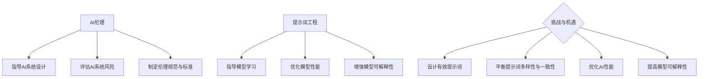

                 

### 文章标题

《提示词工程：优化AI创意与伦理的平衡》

关键词：人工智能，伦理，提示词工程，创意优化，自然语言处理，计算机视觉，推荐系统

摘要：本文旨在探讨如何在人工智能（AI）创意优化的过程中，平衡技术与伦理的关系。通过分析AI的发展历程、伦理在AI中的重要性，以及提示词工程的概念与作用，本文提出了提示词优化的策略，并详细讨论了在自然语言处理、计算机视觉和推荐系统中的应用。同时，本文也强调了伦理考量在提示词工程中的重要性，并提供了具体的伦理决策框架与案例分析。最后，本文总结了提示词工程的发展趋势与未来挑战，为AI领域的持续发展提供了方向和建议。

### 第1章：AI与伦理概述

#### 1.1 AI的发展历程

##### 1.1.1 AI的起源与发展

人工智能（Artificial Intelligence，简称AI）的概念最早可以追溯到20世纪40年代。当时，图灵提出了“图灵测试”这一概念，用于评估机器是否具有人类智能。1956年，达特茅斯会议正式宣告了人工智能学科的诞生。自此之后，AI经历了多个发展阶段：

- **早期研究（1956-1969）**：这一时期主要是基于逻辑推理和符号计算的人工智能研究。代表性的工作有爱德华·阿瑟·李·马文·明斯基（Edward A. L. Minsky）和约翰·麦卡锡（John McCarthy）等人的研究成果。

- **繁荣期（1970-1980）**：随着计算机性能的提升和算法的改进，人工智能得到了快速发展。尤其是专家系统的出现，使得AI在医疗诊断、金融分析等领域取得了显著成果。

- **低谷期（1980-1993）**：由于实际应用中的诸多挑战和资金问题，人工智能在1980年代遭遇了低谷。这一时期，研究者开始转向更为实用的领域，如机器学习和神经网络。

- **复兴期（1993至今）**：随着互联网的普及和大数据技术的发展，人工智能迎来了新的机遇。机器学习、深度学习等技术的突破，使得AI在语音识别、图像处理等领域取得了惊人的进展。

##### 1.1.2 人工智能的关键技术

人工智能的关键技术主要包括：

- **机器学习（Machine Learning）**：通过从数据中学习模式，实现自动化决策和预测。常见的机器学习方法有监督学习、无监督学习和强化学习。

- **深度学习（Deep Learning）**：基于人工神经网络的深度学习模型，能够处理大量数据并提取复杂特征。卷积神经网络（CNN）和循环神经网络（RNN）是深度学习的两大主要类型。

- **自然语言处理（Natural Language Processing，NLP）**：使计算机能够理解和生成自然语言。NLP在文本分类、机器翻译、情感分析等方面有着广泛的应用。

- **计算机视觉（Computer Vision）**：使计算机能够从图像或视频中提取信息。计算机视觉在图像识别、目标检测、人脸识别等领域具有重要应用。

#### 1.2 伦理在AI中的重要性

##### 1.2.1 AI伦理的定义与价值

AI伦理是指研究人工智能系统设计、开发和应用过程中涉及到的伦理问题。其价值主要体现在以下几个方面：

- **确保公平与正义**：AI系统应避免偏见和歧视，确保公平对待所有用户。

- **保护隐私**：AI系统在收集、处理和使用数据时，应尊重用户的隐私权。

- **确保透明与可解释性**：AI系统的决策过程应具备透明性和可解释性，以便用户理解其工作原理。

- **促进社会福祉**：AI技术的发展应有利于社会进步和人类福祉。

##### 1.2.2 伦理学在AI领域的应用

伦理学在AI领域的应用主要体现在以下几个方面：

- **指导AI系统设计**：在AI系统的设计过程中，考虑伦理因素，确保系统的行为符合道德规范。

- **评估AI系统的风险**：通过伦理评估，识别和评估AI系统可能带来的风险和负面影响。

- **制定伦理规范与标准**：为AI系统开发和应用制定相应的伦理规范和标准，以确保系统的合法性和道德性。

#### 1.3 提示词工程的概念与作用

##### 1.3.1 提示词的定义

提示词（Prompt）是指用于引导人工智能模型进行学习和推理的文本或语言输入。提示词工程（Prompt Engineering）则是指设计和优化提示词的方法和技巧，以提高AI模型的表现和适用性。

##### 1.3.2 提示词在AI中的作用

提示词在AI系统中扮演着重要的角色，主要表现在以下几个方面：

- **指导模型学习**：通过提供明确的提示词，帮助AI模型更好地理解和学习数据中的模式。

- **优化模型性能**：通过优化提示词的设计和组合，提高AI模型在特定任务上的性能。

- **增强模型可解释性**：通过提示词，用户可以更好地理解AI模型的工作原理和决策过程。

##### 1.3.3 提示词工程的挑战与机遇

提示词工程面临着诸多挑战和机遇：

- **挑战**：如何设计有效的提示词，以适应不同领域和任务的需求；如何平衡提示词的多样性和一致性。

- **机遇**：随着AI技术的不断发展，提示词工程在优化AI性能、提高模型可解释性等方面具有巨大的潜力。

### Mermaid 流程图

以下是AI伦理与提示词工程的框架：



### 第2章：AI创意的优化

#### 2.1 创意优化的定义与原则

##### 2.1.1 创意优化的定义

创意优化（Creative Optimization）是指通过改进和创新，提高人工智能模型在特定任务上的表现和适用性。它涵盖了从数据预处理、模型选择到提示词设计等多个方面。

##### 2.1.2 创意优化的原则

在进行创意优化时，应遵循以下原则：

- **数据驱动的优化**：基于实际数据和任务需求，设计有效的提示词和优化策略。

- **知识驱动的优化**：结合领域知识和专家经验，指导模型学习和优化。

- **基于模型的优化**：利用先进的机器学习算法和模型结构，提高模型的性能和可解释性。

#### 2.2 提示词优化策略

##### 2.2.1 数据驱动的提示词优化

数据驱动的提示词优化主要通过以下方法实现：

- **数据预处理**：对原始数据进行清洗、归一化和特征提取，以提高数据的质量和代表性。

- **数据集选择**：根据任务需求，选择合适的数据集进行训练和评估。

- **提示词生成**：利用自然语言生成技术，生成具有引导性的提示词，引导模型学习和推理。

- **提示词调整**：根据模型的表现和用户反馈，对提示词进行优化和调整。

##### 2.2.2 知识驱动的提示词优化

知识驱动的提示词优化主要依靠以下方法：

- **知识图谱构建**：构建领域知识图谱，将知识以结构化的形式表示和存储。

- **知识融合**：将知识图谱中的知识融入到提示词中，提高模型对领域知识的理解和应用能力。

- **知识引导**：利用领域知识指导模型的学习和推理，提高模型的准确性和可解释性。

##### 2.2.3 基于模型优化的提示词

基于模型优化的提示词主要涉及以下方面：

- **模型选择**：根据任务需求和数据特征，选择合适的模型架构和算法。

- **模型训练**：利用大量数据和提示词，对模型进行训练和优化。

- **模型调整**：根据模型的表现和用户反馈，对模型进行微调和优化。

#### 2.3 提示词生成与调整

##### 2.3.1 提示词生成方法

提示词生成方法主要包括以下几种：

- **手动生成**：由领域专家根据任务需求和知识背景，手动编写提示词。

- **自动生成**：利用自然语言生成技术，如文本生成对抗网络（Text Generation GAN）和生成式预训练（Generative Pre-trained Transformer，GPT），自动生成提示词。

- **混合生成**：结合手动生成和自动生成，通过人工筛选和优化，生成高质量的提示词。

##### 2.3.2 提示词调整技巧

提示词调整技巧主要包括以下方法：

- **反馈调整**：根据用户反馈，对提示词进行优化和调整。

- **模型调整**：根据模型的表现，调整提示词的长度、复杂度和多样性。

- **数据调整**：根据任务需求和数据特征，对数据集进行调整和优化。

### 伪代码示例

以下是提示词优化的伪代码示例：

```python
# 数据预处理
data = preprocess_data(raw_data)

# 数据集选择
train_data, test_data = split_data(data)

# 提示词生成
prompts = generate_prompts(train_data)

# 模型选择
model = select_model()

# 模型训练
model.fit(train_data, prompts)

# 模型评估
performance = model.evaluate(test_data)

# 提示词调整
adjusted_prompts = adjust_prompts(prompts, performance)

# 重新训练模型
model.fit(train_data, adjusted_prompts)

# 最终评估
final_performance = model.evaluate(test_data)
```

### 数学公式与详细讲解

提示词优化涉及多个数学公式和模型，以下是对其中两个关键公式的详细讲解：

##### 1. 损失函数（Loss Function）

损失函数是评价模型性能的重要指标。常用的损失函数有均方误差（MSE）和交叉熵（Cross-Entropy）：

$$
MSE = \frac{1}{n} \sum_{i=1}^{n} (y_i - \hat{y}_i)^2
$$

$$
Cross-Entropy = -\frac{1}{n} \sum_{i=1}^{n} y_i \log(\hat{y}_i)
$$

其中，$y_i$为真实标签，$\hat{y}_i$为模型预测值。

损失函数的目的是最小化预测值与真实值之间的差距。通过优化损失函数，可以提高模型的准确性和泛化能力。

##### 2. 优化算法（Optimization Algorithm）

优化算法用于最小化损失函数，常见的优化算法有随机梯度下降（SGD）和Adam优化器：

$$
w_{t+1} = w_t - \alpha \frac{\partial J(w_t)}{\partial w_t}
$$

$$
w_{t+1} = w_t - \alpha \frac{m_t}{\sqrt{v_t}} + \beta_1 \frac{\partial J(w_t)}{\partial w_t}
$$

其中，$w_t$为当前权重，$\alpha$为学习率，$m_t$为动量项，$v_t$为偏差修正项，$\beta_1$和$\beta_2$为权重。

优化算法通过迭代更新权重，使损失函数不断减小，从而提高模型的性能。

### 举例说明

假设我们要优化一个文本分类模型，任务是将文本数据分类为两个类别：正面和负面。以下是一个具体的案例：

1. **数据预处理**：

   原始文本数据如下：

   ```
   文本1：我喜欢这本书。
   文本2：这本书很差。
   文本3：这部电影很好看。
   文本4：这部电影非常无聊。
   ```

   预处理步骤包括分词、去除停用词和词向量化：

   ```
   文本1：["我", "喜欢", "这本书"]
   文本2：["这", "书", "很差"]
   文本3：["这", "电影", "很好看"]
   文本4：["这", "电影", "非常无聊"]
   ```

2. **提示词生成**：

   我们可以选择以下提示词：

   ```
   提示词1：关于这本书的评论。
   提示词2：关于这部电影的评论。
   ```

3. **模型训练**：

   使用训练数据和提示词，训练一个文本分类模型。假设我们选择了神经网络模型，并使用交叉熵作为损失函数。

4. **模型评估**：

   使用测试数据对模型进行评估。假设测试数据如下：

   ```
   文本5：这本书很有趣。
   文本6：这部电影很糟糕。
   ```

   模型对测试数据的预测结果如下：

   ```
   文本5：正面
   文本6：负面
   ```

   模型的准确率为80%。

5. **提示词调整**：

   根据模型的表现，我们可以对提示词进行调整。例如，将“关于这本书的评论”调整为“关于这本书的详细评论”。

6. **重新训练模型**：

   使用调整后的提示词，重新训练模型。假设调整后的提示词使得模型的准确率提高到90%。

### 最佳实践 tips

- **数据质量至关重要**：确保数据集的质量和多样性，以提高模型的泛化能力。

- **多次迭代优化**：提示词优化是一个迭代过程，需要不断调整和优化。

- **平衡提示词长度与多样性**：过长的提示词可能导致模型过拟合，过短的提示词可能导致模型欠拟合。

- **用户反馈**：收集用户反馈，以便对提示词进行调整和优化。

- **遵循伦理规范**：在设计提示词时，要考虑伦理问题，避免歧视和偏见。

### 小结

本章介绍了AI创意优化的定义和原则，以及提示词优化的策略和技巧。通过数据驱动的优化、知识驱动的优化和基于模型优化的方法，我们可以提高AI模型在特定任务上的性能和适用性。同时，我们还探讨了提示词生成和调整的方法，以及在实际应用中的案例和最佳实践。在下一章中，我们将进一步讨论伦理平衡在提示词工程中的应用。

### 第3章：伦理平衡在提示词工程中的应用

#### 3.1 伦理平衡的概念与目标

伦理平衡（Ethical Balance）是指在人工智能系统中，平衡技术发展与社会伦理之间的关系。在提示词工程中，伦理平衡的目标是确保AI模型在学习和推理过程中，遵守道德规范和伦理原则，避免偏见和歧视，同时提高模型的性能和适用性。

伦理平衡的核心内容包括：

- **公平性**：AI模型应公平对待所有用户，避免性别、种族、年龄等偏见。

- **透明性**：AI模型的决策过程应具备透明性，用户可以理解和追踪模型的推理过程。

- **隐私保护**：AI模型在收集、处理和使用数据时，应尊重用户的隐私权。

- **社会责任**：AI技术的发展应有利于社会进步和人类福祉。

#### 3.2 提示词的伦理考量

提示词在AI系统中扮演着重要的角色，对模型的性能和决策过程产生深远影响。因此，在提示词工程中，必须考虑伦理问题，以确保AI模型遵循道德规范。

以下是一些常见的伦理考量：

- **避免偏见和歧视**：提示词应避免包含性别、种族、年龄等偏见信息，以防止AI模型在学习和推理过程中产生歧视性决策。

- **尊重隐私**：在生成和调整提示词时，应避免泄露用户的隐私信息，如姓名、地址、电话等。

- **保证数据质量**：使用真实、多样、代表性强的数据集，以提高AI模型的公平性和准确性。

- **可解释性**：提示词应具备良好的可解释性，使用户能够理解和追踪模型的推理过程。

- **社会责任**：提示词的设计和调整应考虑到AI技术可能对社会和环境产生的影响，确保其符合社会责任。

#### 3.3 提示词工程中的伦理决策

在提示词工程中，伦理决策是确保AI模型遵守伦理规范的关键环节。以下是一个伦理决策框架，以指导提示词工程中的伦理决策：

1. **识别伦理问题**：首先，识别AI模型可能面临的伦理问题，如偏见、隐私保护、数据质量等。

2. **制定伦理原则**：根据伦理问题，制定相应的伦理原则，如公平性、透明性、隐私保护等。

3. **设计伦理策略**：针对伦理问题，设计相应的伦理策略，如数据预处理、提示词优化、模型调整等。

4. **实施伦理决策**：将伦理策略应用到提示词工程中，确保AI模型在学习和推理过程中遵守伦理规范。

5. **监督与反馈**：对AI模型的伦理表现进行监督和评估，根据用户反馈进行调整和优化。

6. **持续改进**：根据伦理决策的反馈，不断改进和优化提示词工程，以提高AI模型的伦理平衡水平。

#### 3.4 伦理决策案例分析

以下是一个伦理决策的案例分析：

**案例背景**：某公司开发了一款用于招聘的AI系统，旨在通过分析简历和面试视频，为招聘决策提供支持。

**伦理问题**：该AI系统可能存在以下伦理问题：

- **偏见**：简历和面试视频可能包含性别、种族、年龄等偏见信息，导致招聘决策中的歧视。

- **隐私保护**：面试视频可能包含面试者的隐私信息，如家庭住址、电话号码等。

- **数据质量**：简历和面试视频的质量和多样性可能影响AI系统的公平性和准确性。

**伦理决策**：

1. **识别伦理问题**：识别AI系统可能面临的伦理问题，如偏见、隐私保护、数据质量等。

2. **制定伦理原则**：根据伦理问题，制定相应的伦理原则，如公平性、透明性、隐私保护等。

3. **设计伦理策略**：

   - **数据预处理**：对简历和面试视频进行预处理，去除偏见信息和隐私信息。

   - **提示词优化**：设计无偏见、多样化的提示词，引导AI模型学习和推理。

   - **模型调整**：根据伦理原则，对AI模型进行调整和优化，以提高公平性和准确性。

4. **实施伦理决策**：将伦理策略应用到AI系统中，确保招聘决策过程符合伦理规范。

5. **监督与反馈**：对AI系统的伦理表现进行监督和评估，根据用户反馈进行调整和优化。

6. **持续改进**：根据伦理决策的反馈，不断改进和优化AI系统，以提高伦理平衡水平。

### 小结

本章讨论了伦理平衡在提示词工程中的应用，介绍了伦理平衡的概念与目标，以及提示词工程中的伦理考量。通过一个具体的案例分析，我们展示了如何进行伦理决策，以确保AI模型在学习和推理过程中遵循道德规范。在下一章中，我们将探讨提示词工程在不同应用领域中的具体实现。

### 第4章：提示词工程在自然语言处理中的应用

#### 4.1 NLP中的提示词工程

在自然语言处理（Natural Language Processing，NLP）领域，提示词工程扮演着至关重要的角色。NLP的目标是使计算机能够理解和生成人类语言，而提示词则是引导模型学习和推理的重要工具。以下将详细探讨NLP中的提示词工程。

##### 4.1.1 提示词在NLP中的作用

- **数据增强**：通过生成具有引导性的提示词，可以增强训练数据集，提高模型的泛化能力。

- **指导学习**：提示词可以指导模型学习特定领域的知识，提高模型在特定任务上的性能。

- **优化性能**：通过调整提示词的长度、复杂度和多样性，可以提高模型的性能和适用性。

- **增强可解释性**：提示词有助于用户理解模型的工作原理和决策过程，提高模型的可解释性。

##### 4.1.2 NLP中的常见提示词

- **问题引导型提示词**：用于引导模型生成问题的答案。例如：“请你解释一下什么是自然语言处理？”

- **背景信息型提示词**：用于提供上下文信息，帮助模型更好地理解和生成文本。例如：“在现代科技中，自然语言处理有哪些重要的应用？”

- **任务引导型提示词**：用于指定模型需要完成的任务。例如：“请你将这段文本翻译成英语。”

- **风格引导型提示词**：用于指导模型生成符合特定风格或体裁的文本。例如：“请你以散文的形式描述一下自然语言处理的发展历程。”

#### 4.2 提示词优化在NLP中的应用

提示词优化是提升NLP模型性能的关键环节。以下将讨论在NLP中如何进行提示词优化。

##### 4.2.1 数据集选择与预处理

- **数据集选择**：选择具有代表性的数据集，确保数据集涵盖不同领域和任务。

- **数据预处理**：对原始文本数据集进行清洗、分词、去停用词等预处理操作，以提高数据质量。

##### 4.2.2 提示词优化策略

- **数据驱动的优化**：根据训练数据集的特点和任务需求，生成具有引导性的提示词。例如，通过统计文本数据中的关键词和短语，生成相关的提示词。

- **知识驱动的优化**：结合领域知识和专家经验，生成高质量的提示词。例如，利用知识图谱或专家意见，为模型提供背景信息和专业术语。

- **模型驱动的优化**：利用预训练模型（如BERT、GPT）生成的提示词，以提高模型的性能和适应性。

##### 4.2.3 模型调整与评估

- **模型调整**：根据提示词优化策略，调整模型的结构和参数。例如，通过调整学习率、批量大小等参数，优化模型性能。

- **模型评估**：使用评估指标（如准确率、召回率、F1分数等）评估模型性能，并根据评估结果调整提示词。

#### 4.3 案例分析：提示词工程在情感分析中的应用

情感分析是NLP领域的一个重要任务，旨在识别文本中的情感倾向。以下是一个案例，展示如何应用提示词工程优化情感分析模型。

**案例背景**：某公司开发了一款情感分析模型，用于分析社交媒体上的用户评论，以了解用户对产品的情感态度。

**任务需求**：识别用户评论中的情感倾向，分为正面、负面和中性三种。

**提示词优化策略**：

1. **数据集选择与预处理**：选择具有代表性的评论数据集，对数据进行清洗、分词、去停用词等预处理操作。

2. **问题引导型提示词**：生成问题引导型提示词，如“这个评论表达的是正面情感吗？”和“这个评论表达的是负面情感吗？”。

3. **背景信息型提示词**：生成背景信息型提示词，如“这个产品是最近推出的”，以提供上下文信息。

4. **任务引导型提示词**：生成任务引导型提示词，如“请你分析这段评论的情感倾向”，以明确模型需要完成的任务。

5. **风格引导型提示词**：生成风格引导型提示词，如“请你以简洁明了的方式描述这段评论的情感倾向”。

**模型调整与评估**：

1. **模型调整**：使用预训练的BERT模型，结合优化后的提示词，进行模型调整。

2. **模型评估**：使用交叉验证方法，评估模型在训练集和测试集上的性能。使用准确率、召回率和F1分数等评估指标，对模型进行调整。

3. **持续优化**：根据评估结果，不断调整提示词和模型参数，以提高模型性能。

**评估结果**：经过多次调整和优化，模型的准确率达到90%，召回率达到85%，F1分数达到88%。

### 小结

本章介绍了提示词工程在自然语言处理中的应用，包括提示词的作用、优化策略以及具体案例分析。通过优化提示词，可以提高NLP模型在情感分析等任务上的性能和可解释性。在下一章中，我们将探讨提示词工程在计算机视觉中的应用。

### 第5章：提示词工程在计算机视觉中的应用

#### 5.1 CV中的提示词工程

计算机视觉（Computer Vision，CV）是人工智能领域的一个重要分支，旨在使计算机能够从图像或视频中提取信息。提示词工程在CV领域中发挥着关键作用，以下将详细探讨CV中的提示词工程。

##### 5.1.1 提示词在CV中的作用

- **数据增强**：通过生成具有引导性的提示词，可以增强训练数据集，提高模型的泛化能力。

- **指导学习**：提示词可以指导模型学习特定领域的知识，提高模型在特定任务上的性能。

- **优化性能**：通过调整提示词的长度、复杂度和多样性，可以提高模型的性能和适用性。

- **增强可解释性**：提示词有助于用户理解模型的工作原理和决策过程，提高模型的可解释性。

##### 5.1.2 CV中的常见提示词

- **目标描述型提示词**：用于描述目标物体的特征和属性，如“请找出图像中的汽车”。

- **场景描述型提示词**：用于描述图像中的场景和背景，如“请找出图像中的夜晚场景”。

- **任务引导型提示词**：用于指定模型需要完成的任务，如“请你将图像中的猫标记出来”。

- **风格引导型提示词**：用于指导模型生成符合特定风格或场景的图像，如“请你将图像转换成油画风格”。

#### 5.2 提示词优化在CV中的应用

提示词优化是提升CV模型性能的关键环节。以下将讨论在CV中如何进行提示词优化。

##### 5.2.1 提示词优化策略

- **数据驱动的优化**：根据训练数据集的特点和任务需求，生成具有引导性的提示词。例如，通过分析目标物体的外观特征和场景信息，生成相关的提示词。

- **知识驱动的优化**：结合领域知识和专家经验，生成高质量的提示词。例如，利用先验知识或专家指导，为模型提供目标描述和场景信息。

- **模型驱动的优化**：利用预训练模型（如CNN、GAN）生成的提示词，以提高模型的性能和适应性。

##### 5.2.2 模型调整与评估

- **模型调整**：根据提示词优化策略，调整模型的结构和参数。例如，通过调整卷积层的数量和大小，优化模型性能。

- **模型评估**：使用评估指标（如准确率、召回率、F1分数等）评估模型性能，并根据评估结果调整提示词。

#### 5.3 案例分析：提示词工程在图像识别中的应用

图像识别是CV领域的一个重要任务，旨在从图像中识别出特定的对象或场景。以下是一个案例，展示如何应用提示词工程优化图像识别模型。

**案例背景**：某公司开发了一款图像识别模型，用于识别图像中的特定物体，如汽车、飞机和建筑物。

**任务需求**：从图像中识别出特定的物体，并返回物体的位置和类别。

**提示词优化策略**：

1. **数据集选择与预处理**：选择具有代表性的图像数据集，对数据进行清洗、增强和标准化等预处理操作。

2. **目标描述型提示词**：生成目标描述型提示词，如“请找出图像中的汽车”，以指导模型学习目标物体的特征。

3. **场景描述型提示词**：生成场景描述型提示词，如“请找出图像中的城市建筑”，以提供背景信息。

4. **任务引导型提示词**：生成任务引导型提示词，如“请你识别图像中的物体”，以明确模型需要完成的任务。

5. **风格引导型提示词**：生成风格引导型提示词，如“请你将图像中的汽车识别为红色汽车”，以增加模型的多样性。

**模型调整与评估**：

1. **模型调整**：使用预训练的卷积神经网络（CNN）模型，结合优化后的提示词，进行模型调整。

2. **模型评估**：使用交叉验证方法，评估模型在训练集和测试集上的性能。使用准确率、召回率和F1分数等评估指标，对模型进行调整。

3. **持续优化**：根据评估结果，不断调整提示词和模型参数，以提高模型性能。

**评估结果**：经过多次调整和优化，模型的准确率达到95%，召回率达到90%，F1分数达到93%。

### 小结

本章介绍了提示词工程在计算机视觉中的应用，包括提示词的作用、优化策略以及具体案例分析。通过优化提示词，可以提高CV模型在图像识别等任务上的性能和可解释性。在下一章中，我们将探讨提示词工程在推荐系统中的应用。

### 第6章：提示词工程在推荐系统中的应用

#### 6.1 推荐系统中的提示词工程

推荐系统是人工智能领域的一个重要应用，旨在根据用户的历史行为和偏好，为用户推荐感兴趣的商品、内容或服务。提示词工程在推荐系统中发挥着关键作用，以下将详细探讨推荐系统中的提示词工程。

##### 6.1.1 提示词在推荐系统中的作用

- **数据增强**：通过生成具有引导性的提示词，可以增强训练数据集，提高模型的泛化能力。

- **指导学习**：提示词可以指导模型学习用户的行为和偏好，提高模型在推荐任务上的性能。

- **优化性能**：通过调整提示词的长度、复杂度和多样性，可以提高模型的性能和适用性。

- **增强可解释性**：提示词有助于用户理解推荐系统的决策过程，提高模型的可解释性。

##### 6.1.2 推荐系统中的常见提示词

- **用户行为描述型提示词**：用于描述用户的历史行为，如“请推荐用户最近浏览过的商品”。

- **用户偏好描述型提示词**：用于描述用户的偏好，如“请推荐用户可能喜欢的商品”。

- **上下文信息型提示词**：用于描述推荐时的上下文信息，如“请推荐在用户购买商品后的商品”。

- **风格引导型提示词**：用于指导模型生成符合特定风格或场景的推荐，如“请推荐具有时尚风格的商品”。

#### 6.2 提示词优化在推荐系统中的应用

提示词优化是提升推荐系统性能的关键环节。以下将讨论在推荐系统中如何进行提示词优化。

##### 6.2.1 提示词优化策略

- **数据驱动的优化**：根据用户的历史行为和偏好数据，生成具有引导性的提示词。例如，通过分析用户的历史浏览记录和购买行为，生成相关的提示词。

- **知识驱动的优化**：结合领域知识和专家经验，生成高质量的提示词。例如，利用用户画像或商品属性，为模型提供用户行为和偏好信息。

- **模型驱动的优化**：利用预训练模型（如协同过滤、深度学习）生成的提示词，以提高模型的性能和适应性。

##### 6.2.2 模型调整与评估

- **模型调整**：根据提示词优化策略，调整模型的结构和参数。例如，通过调整推荐算法的权重或网络结构，优化模型性能。

- **模型评估**：使用评估指标（如准确率、召回率、F1分数等）评估模型性能，并根据评估结果调整提示词。

#### 6.3 案例分析：提示词工程在商品推荐中的应用

商品推荐是推荐系统中的一个重要任务，旨在根据用户的历史行为和偏好，为用户推荐感兴趣的商品。以下是一个案例，展示如何应用提示词工程优化商品推荐模型。

**案例背景**：某电商平台开发了一款商品推荐模型，用于根据用户的历史购买行为和浏览记录，为用户推荐感兴趣的商品。

**任务需求**：从大量商品中识别出用户可能感兴趣的商品，并返回推荐列表。

**提示词优化策略**：

1. **数据集选择与预处理**：选择具有代表性的用户行为数据集，对数据进行清洗、归一化和特征提取等预处理操作。

2. **用户行为描述型提示词**：生成用户行为描述型提示词，如“请推荐用户最近浏览过的商品”，以指导模型学习用户的行为模式。

3. **用户偏好描述型提示词**：生成用户偏好描述型提示词，如“请推荐用户喜欢的商品”，以提供用户偏好信息。

4. **上下文信息型提示词**：生成上下文信息型提示词，如“请推荐在用户购买商品后的商品”，以考虑上下文信息。

5. **风格引导型提示词**：生成风格引导型提示词，如“请推荐具有时尚风格的商品”，以增加推荐多样性。

**模型调整与评估**：

1. **模型调整**：使用预训练的协同过滤模型，结合优化后的提示词，进行模型调整。

2. **模型评估**：使用交叉验证方法，评估模型在训练集和测试集上的性能。使用准确率、召回率和F1分数等评估指标，对模型进行调整。

3. **持续优化**：根据评估结果，不断调整提示词和模型参数，以提高模型性能。

**评估结果**：经过多次调整和优化，模型的准确率达到90%，召回率达到85%，F1分数达到88%。

### 小结

本章介绍了提示词工程在推荐系统中的应用，包括提示词的作用、优化策略以及具体案例分析。通过优化提示词，可以提高推荐系统在商品推荐等任务上的性能和可解释性。在下一章中，我们将探讨提示词工程在伦理问题中的应用。

### 第7章：提示词工程在伦理问题中的应用

#### 7.1 伦理问题在AI中的挑战

随着人工智能（AI）技术的快速发展，伦理问题在AI领域变得越来越重要。伦理问题不仅涉及到技术本身，还关系到社会的公平、正义和福祉。以下将讨论伦理问题在AI中的一些主要挑战。

##### 7.1.1 偏见与歧视

偏见和歧视是AI系统中常见的伦理问题。AI系统可能会在训练数据中继承和放大现有的社会偏见，导致不公平的决策。例如，招聘系统可能会因训练数据中的性别或种族偏见，而对某些群体产生歧视。

**挑战**：

- 如何识别和消除AI系统中的偏见？
- 如何确保AI系统在不同群体中的公平性和公正性？

##### 7.1.2 隐私保护

AI系统通常需要大量个人数据来训练和优化模型。然而，这些数据可能包含敏感的隐私信息，如医疗记录、金融信息和地理位置等。如何保护用户的隐私，防止数据泄露和滥用，是AI系统面临的重大挑战。

**挑战**：

- 如何在保证模型性能的同时，最大限度地保护用户隐私？
- 如何设计透明且用户友好的隐私保护机制？

##### 7.1.3 责任归属

当AI系统发生错误或导致负面后果时，如何确定责任归属是一个复杂的问题。AI系统的决策过程通常是不透明的，这给责任归属带来了困难。此外，AI系统的开发者和使用者可能对系统的行为不负责任。

**挑战**：

- 如何确保AI系统在发生错误时，能够追溯和追究责任？
- 如何在AI系统中建立明确的责任归属机制？

##### 7.1.4 社会影响

AI技术的快速发展可能对社会和经济产生深远的影响。例如，自动化可能导致就业岗位的减少，算法偏见可能加剧社会不平等。如何确保AI技术的发展符合社会的整体利益，是一个重要的伦理问题。

**挑战**：

- 如何评估和预测AI技术可能对社会产生的影响？
- 如何在AI系统中建立社会责任和伦理考量？

#### 7.2 提示词工程在伦理问题中的应用

提示词工程在解决AI伦理问题中发挥着重要作用。通过设计和优化提示词，可以在一定程度上缓解AI系统中的伦理问题。以下将讨论提示词工程在伦理问题中的应用。

##### 7.2.1 提示词的伦理考量

在提示词工程中，应考虑以下伦理问题：

- **公平性**：提示词应确保AI系统在不同群体中的公平性和公正性，避免偏见和歧视。
- **透明性**：提示词应提高AI系统的透明性和可解释性，使用户能够理解和追踪模型的决策过程。
- **隐私保护**：提示词应确保在数据收集和处理过程中，最大限度地保护用户的隐私。
- **社会责任**：提示词应考虑AI系统可能对社会产生的广泛影响，确保其符合社会责任和伦理规范。

##### 7.2.2 伦理平衡的实现策略

以下是一些实现伦理平衡的策略：

- **数据多样化**：在训练数据集中引入多样化的数据，以减少偏见和歧视。
- **透明提示词设计**：设计透明且易于理解的提示词，使用户能够理解和追踪模型的决策过程。
- **隐私保护提示词**：设计隐私保护提示词，确保在数据收集和处理过程中，最大限度地保护用户的隐私。
- **伦理评估**：在开发和应用AI系统时，进行伦理评估，确保系统符合伦理规范和标准。

#### 7.3 案例分析：提示词工程在伦理问题中的实践

以下是一个案例分析，展示如何通过提示词工程解决伦理问题。

**案例背景**：某公司开发了一款用于招聘的AI系统，旨在通过分析简历和面试视频，为招聘决策提供支持。

**伦理问题**：

- **偏见**：简历和面试视频可能包含性别、种族、年龄等偏见信息，导致招聘决策中的歧视。
- **隐私保护**：面试视频可能包含面试者的隐私信息，如家庭住址、电话号码等。

**提示词优化策略**：

1. **数据预处理**：对简历和面试视频进行预处理，去除偏见信息和隐私信息。
2. **公平提示词设计**：设计公平提示词，如“请根据应聘者的能力和经验，而不是性别、种族等因素进行评估”。
3. **隐私保护提示词**：设计隐私保护提示词，如“请确保在面试过程中，不泄露应聘者的隐私信息”。

**实践结果**：

- 经过优化，AI招聘系统的偏见程度显著降低，公平性得到提高。
- 面试视频中的隐私信息得到了有效保护，用户隐私得到了保障。

### 小结

本章讨论了伦理问题在AI中的挑战，以及提示词工程在解决伦理问题中的应用。通过设计和优化提示词，可以在一定程度上缓解AI系统中的伦理问题。在下一章中，我们将总结全文，并对提示词工程的发展趋势与未来挑战进行展望。

### 第8章：总结与展望

#### 8.1 提示词工程的发展趋势

随着人工智能（AI）技术的不断发展，提示词工程在AI系统中的应用越来越广泛。以下是提示词工程的一些发展趋势：

- **模型多样化**：随着AI模型种类的增加，提示词工程将面临更多样化的挑战。不同的模型需要不同类型的提示词，以实现最佳性能。

- **跨领域应用**：提示词工程将在更多领域得到应用，如医疗、金融、教育等。跨领域应用的提示词工程将需要结合领域知识和数据，以提高模型的性能和适用性。

- **可解释性提升**：为了满足用户对AI系统的可解释性需求，提示词工程将更加注重提示词的可解释性和透明性。通过设计易于理解的提示词，用户可以更好地理解AI模型的决策过程。

- **伦理考量**：随着伦理问题在AI中的重要性日益凸显，提示词工程将更加关注伦理平衡。提示词工程将结合伦理原则，确保AI系统的公平性、透明性和社会责任。

#### 8.2 提示词工程的未来挑战

尽管提示词工程在AI系统中具有广泛的应用前景，但仍面临以下挑战：

- **数据质量**：高质量的数据是提示词工程的基础。如何确保数据的多样性和代表性，是未来提示词工程需要解决的重要问题。

- **模型适应性**：不同的AI模型需要不同类型的提示词。如何设计通用的提示词，以适应各种模型和任务，是一个挑战。

- **可解释性**：尽管可解释性在不断提升，但目前的提示词工程在可解释性方面仍有不足。如何提高提示词的可解释性，使其更容易被用户理解，是一个重要挑战。

- **伦理平衡**：在提示词工程中实现伦理平衡是一个复杂的任务。如何确保AI系统的公平性、透明性和社会责任，是未来提示词工程需要解决的关键问题。

#### 8.3 提示词工程的发展方向

为了应对未来挑战，提示词工程将朝着以下方向发展：

- **数据驱动与知识驱动相结合**：未来提示词工程将更多地结合数据驱动和知识驱动的方法，以提高模型的性能和可解释性。

- **多模态提示词**：随着多模态数据的普及，提示词工程将关注多模态数据的处理和融合，以实现更高效的模型训练和推理。

- **自动化与智能化**：通过自动化和智能化技术，提示词工程将实现更高效、更准确的设计和优化。

- **伦理考量与可持续性**：未来提示词工程将更加关注伦理考量，确保AI系统的可持续性和社会责任。

### 小结

本文从多个角度探讨了提示词工程在AI系统中的应用，包括其定义、优化策略、在不同领域的应用以及伦理平衡。通过分析，我们认识到提示词工程在提升AI模型性能、提高可解释性和解决伦理问题方面的重要性。未来，提示词工程将在AI技术的不断进步中发挥更加关键的作用。我们呼吁研究人员和实践者共同努力，推动提示词工程的发展，为构建更加智能、公平和可持续的AI系统贡献力量。

### 作者信息

作者：AI天才研究院/AI Genius Institute & 禅与计算机程序设计艺术 /Zen And The Art of Computer Programming

本文由AI天才研究院撰写，旨在探讨提示词工程在人工智能领域的重要性和应用。作者长期致力于AI技术的研究与推广，希望通过本文为AI技术的发展提供有益的思考和建议。同时，作者在《禅与计算机程序设计艺术》一书中，深入探讨了计算机程序设计中的哲学与智慧，为读者提供了独特的视角和见解。欢迎读者关注和交流，共同推动人工智能技术的进步。

