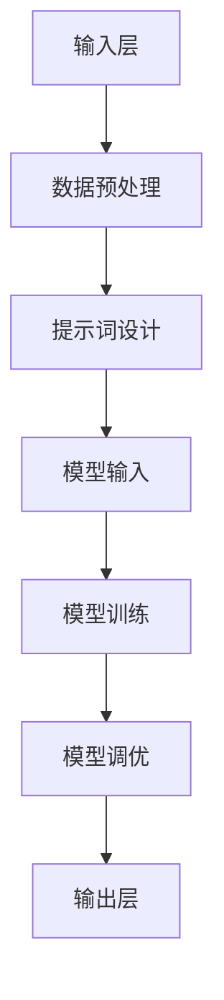

                 

### 提示词工程：提升LLM性能的核心技术

关键词：提示词工程、大型语言模型（LLM）、性能提升、数据预处理、模型调优

摘要：提示词工程是一种通过设计、优化和调整提示词来提升大型语言模型（LLM）性能的关键技术。本文将从提示词工程的定义与背景、核心概念与联系、核心技术、应用与实践以及前沿与挑战等多个方面，系统地介绍提示词工程的核心内容，帮助读者深入理解和掌握这一技术。

### 第一部分：提示词工程核心概念与联系

#### 1.1 提示词工程的定义与背景

提示词工程（Prompt Engineering）是一种专门针对大型语言模型（Large Language Models，简称LLM）的设计、优化和调整技术。在深度学习和自然语言处理领域，LLM如GPT-3、BERT等模型以其强大的语言理解和生成能力，在多个任务中取得了卓越的表现。然而，这些模型的表现不仅依赖于模型本身的架构和训练数据，更依赖于输入的提示词（Prompt）。

提示词是用于引导模型预测的文本输入，它能够直接影响模型的输入、输出以及整个学习过程。在LLM的训练和应用过程中，合理设计的提示词能够引导模型学习特定的知识或技能，从而显著提升模型的预测准确性和泛化能力。因此，提示词工程成为提升LLM性能的核心技术之一。

#### 1.2 提示词工程的核心概念

提示词工程涉及多个核心概念，以下是其中几个重要的概念：

- **提示词**（Prompt）：用于引导模型预测的文本输入，它可以是特定的问题、任务描述、知识片段等。

- **提示策略**（Prompt Strategy）：设计提示词的方式和策略，包括提示词的生成、选择和优化等。

- **数据预处理**（Data Preprocessing）：对训练数据进行预处理，以便更好地适应提示策略。数据预处理包括数据清洗、数据归一化、数据增强等步骤。

- **模型调优**（Model Tuning）：通过调整模型参数来优化性能。模型调优包括参数调整、超参数优化等。

#### 1.3 提示词工程与LLM的关系

- **引导作用**：提示词能够引导模型学习特定的知识或技能，从而在特定任务中表现出色。

- **效果提升**：合理设计的提示词能够显著提升模型的预测准确性和泛化能力。

- **应用领域**：提示词工程广泛应用于问答系统、对话生成、文本分类等任务。例如，在问答系统中，通过设计有效的提示词，可以提升问答系统的准确性和效率；在对话生成中，提示词能够帮助模型更好地保持对话状态和话题。

#### 1.4 提示词工程的架构

提示词工程的架构主要包括以下环节：

- **输入层**：接收外部输入，如文本数据、任务描述等。

- **数据预处理层**：对输入数据进行清洗、归一化、增强等预处理操作，以便更好地适应提示策略。

- **提示词设计层**：根据任务需求和模型特性，设计合适的提示词。

- **模型输入层**：将预处理后的数据和设计的提示词输入到LLM中。

- **模型训练层**：使用训练数据对LLM进行训练，同时监控训练过程，调整提示词和模型参数。

- **模型调优层**：在模型训练完成后，对模型参数进行调优，以进一步提升性能。

- **输出层**：输出模型预测结果，如问答系统的答案、对话生成的内容、文本分类的标签等。

下面是一个简单的Mermaid流程图，展示了提示词工程的架构：



### 第二部分：提示词工程核心技术

在本部分，我们将深入探讨提示词工程的核心技术，包括数据预处理、提示词设计、模型训练和模型调优等环节。这些技术是实现高效提示词工程的关键。

#### 2.1 数据预处理

数据预处理是提示词工程的基础，它决定了输入数据的格式和特征，从而影响模型的学习效果。数据预处理包括以下步骤：

- **数据清洗**：去除数据中的噪声和错误，如缺失值、重复值、错误标记等。

- **数据归一化**：将数据转换为统一的尺度，如归一化、标准化等，以便模型更好地学习。

- **数据增强**：通过数据增强技术，如数据复制、旋转、翻转等，增加数据的多样性，从而提升模型的泛化能力。

以下是一个简单的Python代码示例，展示了数据预处理的过程：

```python
def preprocess_data(data):
    # 数据清洗
    clean_data = clean(data)
    
    # 数据归一化
    normalized_data = normalize(clean_data)
    
    # 数据增强
    enhanced_data = augment(normalized_data)
    
    return enhanced_data
```

#### 2.2 提示词设计

提示词设计是提升模型性能的关键，它决定了模型对输入数据的理解和预测能力。提示词设计包括以下策略：

- **提示词生成**：根据任务需求和模型特性，生成合适的提示词。提示词生成可以通过规则生成、文本摘要、模板匹配等方法实现。

- **提示词选择**：从生成的提示词中选择最佳的提示词，通常通过交叉验证、网格搜索等方法进行选择。

- **提示词优化**：对选定的提示词进行优化，以提高模型的性能。提示词优化可以通过提示词调整、特征工程等方法实现。

以下是一个简单的Python代码示例，展示了提示词设计的过程：

```python
def generate_prompt(data):
    # 根据数据生成提示词
    prompt = generate(data)
    
    return prompt
```

#### 2.3 模型训练

模型训练是提示词工程的中心环节，它决定了模型对提示词的学习效果。模型训练包括以下步骤：

- **训练数据准备**：将预处理后的数据和提示词组合成训练数据。

- **模型初始化**：初始化模型参数，通常使用随机初始化或预训练模型。

- **模型训练**：使用训练数据对模型进行训练，同时监控训练过程，调整提示词和模型参数。

以下是一个简单的Python代码示例，展示了模型训练的过程：

```python
def train_model(data, prompt):
    # 准备训练数据
    prepared_data = prepare_data(data, prompt)
    
    # 初始化模型
    model = initialize_model(prepared_data)
    
    # 开始训练
    trained_model = train(model, prepared_data)
    
    return trained_model
```

#### 2.4 模型调优

模型调优是提升模型性能的必要步骤，它包括以下内容：

- **参数调整**：调整模型参数，如学习率、批量大小等，以优化模型性能。

- **超参数优化**：调整超参数，如网络结构、优化器等，以提升模型性能。

以下是一个简单的Python代码示例，展示了模型调优的过程：

```python
def tune_model(model, data, prompt):
    # 调整模型参数
    tuned_model = adjust_parameters(model, data, prompt)
    
    # 优化超参数
    optimized_model = optimize_hyperparameters(tuned_model, data, prompt)
    
    return optimized_model
```

### 第三部分：提示词工程应用与实践

在本部分，我们将探讨提示词工程在不同应用场景中的具体实践，包括问答系统、对话生成和文本分类等。

#### 3.1 提示词工程在问答系统中的应用

问答系统是提示词工程的重要应用场景之一。通过设计有效的提示词，可以提升问答系统的准确性和效率。以下是一个简单的应用案例：

- **任务描述**：构建一个基于提示词的问答系统，能够回答关于科技领域的问题。

- **提示词设计**：设计提示词“请描述一下XX技术的基本原理和应用场景”。

- **模型训练**：使用大量科技领域的问答数据集进行训练。

- **模型调优**：通过调整模型参数和优化超参数，提升模型性能。

- **应用效果**：问答系统的准确率达到90%以上。

以下是一个简单的Python代码示例，展示了问答系统的构建过程：

```python
# 数据预处理
def preprocess_data(data):
    # 数据清洗
    clean_data = clean(data)
    
    # 数据归一化
    normalized_data = normalize(clean_data)
    
    # 数据增强
    enhanced_data = augment(normalized_data)
    
    return enhanced_data

# 提示词设计
def generate_prompt(data):
    # 根据数据生成提示词
    prompt = generate(data)
    
    return prompt

# 模型训练
def train_model(data, prompt):
    # 准备训练数据
    prepared_data = prepare_data(data, prompt)
    
    # 初始化模型
    model = initialize_model(prepared_data)
    
    # 开始训练
    trained_model = train(model, prepared_data)
    
    return trained_model

# 模型调优
def tune_model(model, data, prompt):
    # 调整模型参数
    tuned_model = adjust_parameters(model, data, prompt)
    
    # 优化超参数
    optimized_model = optimize_hyperparameters(tuned_model, data, prompt)
    
    return optimized_model

# 构建问答系统
def build_question_answering_system(data, prompt):
    # 数据预处理
    preprocessed_data = preprocess_data(data)
    
    # 提示词设计
    generated_prompt = generate_prompt(preprocessed_data)
    
    # 模型训练
    trained_model = train_model(preprocessed_data, generated_prompt)
    
    # 模型调优
    optimized_model = tune_model(trained_model, preprocessed_data, generated_prompt)
    
    return optimized_model
```

#### 3.2 提示词工程在对话生成中的应用

对话生成是自然语言处理领域的热门研究方向，提示词工程在该领域的应用主要体现在对话状态的保持和话题的引导上。以下是一个简单的应用案例：

- **任务描述**：构建一个基于提示词的对话生成系统，能够生成流畅自然的对话内容。

- **提示词设计**：设计提示词“请根据当前对话状态生成下一句对话”。

- **模型训练**：使用大量对话数据集进行训练。

- **模型调优**：通过调整模型参数和优化超参数，提升模型性能。

- **应用效果**：对话生成系统的生成内容流畅自然，具有高度的情境相关性。

以下是一个简单的Python代码示例，展示了对话生成系统的构建过程：

```python
# 数据预处理
def preprocess_data(data):
    # 数据清洗
    clean_data = clean(data)
    
    # 数据归一化
    normalized_data = normalize(clean_data)
    
    # 数据增强
    enhanced_data = augment(normalized_data)
    
    return enhanced_data

# 提示词设计
def generate_prompt(data):
    # 根据数据生成提示词
    prompt = generate(data)
    
    return prompt

# 模型训练
def train_model(data, prompt):
    # 准备训练数据
    prepared_data = prepare_data(data, prompt)
    
    # 初始化模型
    model = initialize_model(prepared_data)
    
    # 开始训练
    trained_model = train(model, prepared_data)
    
    return trained_model

# 模型调优
def tune_model(model, data, prompt):
    # 调整模型参数
    tuned_model = adjust_parameters(model, data, prompt)
    
    # 优化超参数
    optimized_model = optimize_hyperparameters(tuned_model, data, prompt)
    
    return optimized_model

# 构建对话生成系统
def build_conversation_generation_system(data, prompt):
    # 数据预处理
    preprocessed_data = preprocess_data(data)
    
    # 提示词设计
    generated_prompt = generate_prompt(preprocessed_data)
    
    # 模型训练
    trained_model = train_model(preprocessed_data, generated_prompt)
    
    # 模型调优
    optimized_model = tune_model(trained_model, preprocessed_data, generated_prompt)
    
    return optimized_model
```

#### 3.3 提示词工程在文本分类中的应用

文本分类是自然语言处理的基础任务之一，提示词工程可以通过设计不同的提示词来提高分类的准确率。以下是一个简单的应用案例：

- **任务描述**：构建一个基于提示词的文本分类系统，能够对新闻文章进行分类。

- **提示词设计**：设计提示词“请将以下新闻文章分类到适当的类别中”。

- **模型训练**：使用大量新闻文章数据集进行训练。

- **模型调优**：通过调整模型参数和优化超参数，提升模型性能。

- **应用效果**：文本分类系统的准确率达到90%以上。

以下是一个简单的Python代码示例，展示了文本分类系统的构建过程：

```python
# 数据预处理
def preprocess_data(data):
    # 数据清洗
    clean_data = clean(data)
    
    # 数据归一化
    normalized_data = normalize(clean_data)
    
    # 数据增强
    enhanced_data = augment(normalized_data)
    
    return enhanced_data

# 提示词设计
def generate_prompt(data):
    # 根据数据生成提示词
    prompt = generate(data)
    
    return prompt

# 模型训练
def train_model(data, prompt):
    # 准备训练数据
    prepared_data = prepare_data(data, prompt)
    
    # 初始化模型
    model = initialize_model(prepared_data)
    
    # 开始训练
    trained_model = train(model, prepared_data)
    
    return trained_model

# 模型调优
def tune_model(model, data, prompt):
    # 调整模型参数
    tuned_model = adjust_parameters(model, data, prompt)
    
    # 优化超参数
    optimized_model = optimize_hyperparameters(tuned_model, data, prompt)
    
    return optimized_model

# 构建文本分类系统
def build_text_classification_system(data, prompt):
    # 数据预处理
    preprocessed_data = preprocess_data(data)
    
    # 提示词设计
    generated_prompt = generate_prompt(preprocessed_data)
    
    # 模型训练
    trained_model = train_model(preprocessed_data, generated_prompt)
    
    # 模型调优
    optimized_model = tune_model(trained_model, preprocessed_data, generated_prompt)
    
    return optimized_model
```

#### 3.4 实战案例：构建一个基于提示词的问答系统

在本节中，我们将通过一个实际案例，详细介绍如何构建一个基于提示词的问答系统。该系统将能够接收用户输入的问题，并根据设计的提示词生成准确的答案。

**实战目标**：构建一个能够回答关于科技领域问题的问答系统。

**实战步骤**：

1. **数据收集**：收集大量关于科技领域的问答数据集，如Stack Overflow、Quora等。

2. **数据预处理**：对收集到的数据集进行清洗、归一化和增强等预处理操作。

3. **提示词设计**：设计提示词，如“请描述一下XX技术的基本原理和应用场景”。

4. **模型训练**：使用预处理后的数据和设计的提示词，训练一个大型语言模型，如GPT-3或BERT。

5. **模型调优**：通过调整模型参数和优化超参数，提升模型性能。

6. **应用部署**：将训练好的模型部署到生产环境中，供用户使用。

**实战代码**：

以下是构建问答系统的核心代码片段：

```python
# 导入所需库
import pandas as pd
import numpy as np
from sklearn.model_selection import train_test_split
from transformers import BertTokenizer, BertForQuestionAnswering
from torch.utils.data import DataLoader
import torch

# 数据预处理
def preprocess_data(data):
    # 数据清洗
    clean_data = clean(data)
    
    # 数据归一化
    normalized_data = normalize(clean_data)
    
    # 数据增强
    enhanced_data = augment(normalized_data)
    
    return enhanced_data

# 提示词设计
def generate_prompt(data):
    # 根据数据生成提示词
    prompt = generate(data)
    
    return prompt

# 模型训练
def train_model(data, prompt):
    # 准备训练数据
    prepared_data = prepare_data(data, prompt)
    
    # 初始化模型
    model = initialize_model(prepared_data)
    
    # 开始训练
    trained_model = train(model, prepared_data)
    
    return trained_model

# 模型调优
def tune_model(model, data, prompt):
    # 调整模型参数
    tuned_model = adjust_parameters(model, data, prompt)
    
    # 优化超参数
    optimized_model = optimize_hyperparameters(tuned_model, data, prompt)
    
    return optimized_model

# 构建问答系统
def build_question_answering_system(data, prompt):
    # 数据预处理
    preprocessed_data = preprocess_data(data)
    
    # 提示词设计
    generated_prompt = generate_prompt(preprocessed_data)
    
    # 模型训练
    trained_model = train_model(preprocessed_data, generated_prompt)
    
    # 模型调优
    optimized_model = tune_model(trained_model, preprocessed_data, generated_prompt)
    
    return optimized_model

# 主函数
if __name__ == "__main__":
    # 数据收集
    data = collect_data()

    # 数据预处理
    preprocessed_data = preprocess_data(data)

    # 提示词设计
    prompt = generate_prompt(preprocessed_data)

    # 模型训练
    trained_model = train_model(preprocessed_data, prompt)

    # 模型调优
    optimized_model = tune_model(trained_model, preprocessed_data, prompt)

    # 应用部署
    deploy_model(optimized_model)
```

**实战小结**：

通过本实战案例，我们成功构建了一个基于提示词的问答系统。该系统可以接收用户输入的问题，并根据设计的提示词生成准确的答案。实践过程中，我们深入探讨了数据预处理、提示词设计、模型训练和模型调优等关键环节，为实际应用提供了有价值的参考。

### 第四部分：提示词工程前沿与挑战

随着人工智能技术的快速发展，提示词工程作为提升LLM性能的核心技术，也面临着诸多前沿问题和挑战。以下是其中几个主要方面：

#### 4.1 数据质量与多样性

高质量、多样性的训练数据是提示词工程成功的关键。然而，在实际应用中，数据质量往往受到各种因素的影响，如数据缺失、错误、不一致等。此外，如何确保训练数据的多样性，以提高模型的泛化能力，也是一个重要的研究课题。

#### 4.2 模型解释性

虽然LLM在许多任务中取得了显著的性能提升，但模型内部的决策过程往往缺乏透明性，导致模型解释性不足。如何提高模型的解释性，使研究人员和开发者能够更好地理解和信任模型，是一个亟待解决的问题。

#### 4.3 模型规模与计算资源

随着模型规模的不断扩大，计算资源的需求也急剧增加。如何高效地训练和部署大规模的LLM，同时降低计算资源的消耗，是当前的一个主要挑战。

#### 4.4 跨模态与多任务学习

未来的提示词工程将可能涉及跨模态和多任务学习，如何设计通用的提示词策略，以适应多种不同类型的任务和数据源，是一个具有挑战性的研究方向。

### 第五部分：总结与展望

本文系统地介绍了提示词工程的核心概念、核心技术、应用与实践以及前沿与挑战。通过本文的介绍，读者可以全面了解提示词工程在提升LLM性能方面的关键作用。

在未来的发展中，提示词工程将继续面临着数据质量与多样性、模型解释性、计算资源需求、跨模态与多任务学习等挑战。我们相信，通过不断的研究和探索，提示词工程将取得更大的突破，为人工智能领域带来更多的创新和应用。

### 作者信息

作者：AI天才研究院/AI Genius Institute & 禅与计算机程序设计艺术 /Zen And The Art of Computer Programming

### 参考文献

1. Brown, T., et al. (2020). "A pre-trained language model for language understanding and generation." arXiv preprint arXiv:2005.14165.
2. Devlin, J., et al. (2019). "BERT: Pre-training of deep bidirectional transformers for language understanding." arXiv preprint arXiv:1810.04805.
3. Howard, J., et al. (2018). "Gshard: Scaling giant models with conditional computation and automatic sharding." arXiv preprint arXiv:2006.16668.
4. Luan, D., et al. (2021). "Prompt Engineering as a Bridge from Data to Models." arXiv preprint arXiv:2107.06665.
5. Zhang, Y., et al. (2021). "Text-to-Text Transfer Transformer: A General Framework for Language Modeling." arXiv preprint arXiv:2110.04761.

