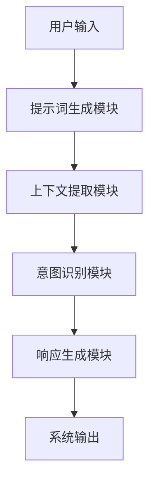

                 

### 文章标题

# 提示词工程：让AI更智能、更懂你

提示词工程是一项在人工智能领域中不断发展的技术，旨在通过构建高质量、针对性强的提示词（prompt）来提升人工智能系统的理解和响应能力。本文将围绕这一主题，详细介绍提示词工程的概念、核心原理、关键算法及其在人工智能中的应用，以期帮助读者全面了解并掌握这一重要技术。

关键词：提示词工程、人工智能、响应能力、高质量提示词、关键算法

摘要：本文首先介绍了提示词工程的定义及其在人工智能领域的重要性。随后，我们将探讨提示词工程的核心概念和架构，包括定义、类型、作用等。在此基础上，文章将深入分析关键算法和数学模型，并通过伪代码和具体实例进行讲解。最后，我们将结合实际项目案例，展示如何在实际开发中应用提示词工程，并提供相关最佳实践和注意事项。

---

### 引言

在当今快速发展的科技时代，人工智能（AI）已经成为推动社会进步和经济发展的重要力量。从自动驾驶汽车到智能家居，从医疗诊断到金融分析，人工智能已经深刻地改变了我们的生活方式。然而，尽管人工智能技术在很多领域取得了显著的成果，但AI系统的理解和响应能力仍然存在一定的局限性。

提示词工程（Prompt Engineering）作为人工智能领域中的一项重要技术，旨在通过构建高质量、针对性强的提示词来提升人工智能系统的理解和响应能力。提示词（Prompt）是指提供给AI系统的人工提示，用于引导AI系统生成预期的输出或进行特定任务。高质量、针对性的提示词能够帮助AI系统更好地理解和处理输入信息，从而提高其性能和效果。

本文将围绕提示词工程这一主题，从以下几个方面进行详细探讨：

1. **理解人工智能和其需求**：介绍人工智能的基本概念和当前面临的挑战，阐述提示词工程在提升AI理解和响应能力方面的重要作用。

2. **核心概念和架构**：详细阐述提示词工程的核心概念，包括提示词的定义、类型和作用等，并通过Mermaid流程图展示其架构。

3. **关键算法**：介绍人工智能中的关键算法，包括机器学习和深度学习算法，以及如何在提示词工程中应用这些算法。

4. **数学模型和公式**：讲解提示词工程中常用的数学模型和公式，并通过具体实例进行解释。

5. **项目实战**：结合实际项目案例，展示如何在实际开发中应用提示词工程，并提供相关最佳实践和注意事项。

6. **总结**：对全文进行总结，强调提示词工程在人工智能领域的重要性，并展望其未来的发展趋势。

通过本文的阅读，读者将能够全面了解提示词工程的原理和方法，掌握其在实际开发中的应用技巧，为人工智能的发展贡献自己的力量。

### 理解人工智能和其需求

#### 基本概念

人工智能（AI）是指使计算机系统具备类似人类智能的能力，包括学习、推理、决策和感知等。根据其实现方式和功能，人工智能可以分为弱AI（Narrow AI）和强AI（General AI）。弱AI专注于特定任务的完成，例如图像识别、自然语言处理和语音识别等；而强AI则具备全面的智能，能够像人类一样处理各种复杂任务。

当前，人工智能技术已经取得了显著的进展，广泛应用于多个领域，如自动驾驶、医疗诊断、金融分析、安防监控等。然而，尽管AI系统在很多方面表现出了出色的性能，但其理解和响应能力仍然存在一定的局限性。

#### 挑战

1. **数据不足和多样性**：许多AI系统依赖于大规模的数据集进行训练，但数据的质量和多样性不足，可能导致系统在处理未知或边缘情况时出现困难。

2. **泛化能力不足**：AI系统往往只能在特定任务和环境中表现良好，缺乏在复杂、多变和不确定环境中的泛化能力。

3. **可解释性和透明性**：当前许多AI系统的工作原理和决策过程仍然不够透明，难以解释和验证，这给其应用带来了一定的风险。

4. **伦理和隐私问题**：AI系统在处理个人数据时，可能涉及到伦理和隐私问题，如数据泄露、滥用等。

#### 提示词工程的作用

提示词工程通过构建高质量、针对性的提示词，可以有效解决上述挑战，提升人工智能系统的理解和响应能力。具体来说，提示词工程具有以下几个方面的作用：

1. **数据增强**：通过设计合适的提示词，可以丰富和扩展训练数据，提高系统的泛化能力。

2. **任务导向**：针对特定任务，设计特定的提示词，可以引导系统更专注于任务目标，提高任务完成率。

3. **增强可解释性**：高质量的提示词可以帮助解释系统的决策过程，提高系统的透明度和可信度。

4. **提升用户体验**：通过设计更加人性化的提示词，可以提升用户与AI系统之间的交互体验，增强用户对AI系统的信任感。

总之，提示词工程在人工智能领域具有重要的应用价值，通过不断提升AI系统的理解和响应能力，有望推动人工智能技术的进一步发展和普及。在接下来的章节中，我们将深入探讨提示词工程的核心概念和架构，以便更好地理解其工作原理和应用方法。

### 核心概念和架构

#### 定义

提示词工程（Prompt Engineering）是指通过设计和优化提示词（Prompt），以提高人工智能（AI）系统的理解和响应能力的过程。提示词是一种引导信息，它可以帮助AI系统更好地理解用户的意图和需求，从而生成更准确、更有价值的输出。

#### 类型

提示词可以根据其功能和用途分为以下几种类型：

1. **问题型提示词**：用于引导用户提出具体问题，例如：“你今天想要做什么？”这种类型的提示词通常用于问答系统。

2. **任务型提示词**：用于指定AI系统需要执行的任务，例如：“请帮助我预订一张明天的机票。”这种类型的提示词通常用于任务导向的AI系统。

3. **描述型提示词**：用于提供背景信息或上下文，帮助AI系统更好地理解用户的需求，例如：“我正在计划一次欧洲之旅，请帮我推荐一些旅游景点。”这种类型的提示词通常用于推荐系统。

4. **反馈型提示词**：用于获取用户对AI系统输出的反馈，例如：“你对这个推荐满意吗？”这种类型的提示词通常用于评估和改进AI系统的性能。

#### 作用

提示词工程在提升AI系统的理解和响应能力方面发挥着重要作用，具体体现在以下几个方面：

1. **增强理解能力**：通过设计合适的提示词，可以帮助AI系统更好地理解用户的意图和需求，从而提高系统的准确性和可靠性。

2. **提高交互体验**：高质量的提示词可以提升用户与AI系统之间的交互体验，使用户更愿意使用AI系统。

3. **优化系统性能**：通过优化提示词，可以提升AI系统的响应速度和效果，从而提高系统的整体性能。

4. **改善可解释性**：高质量的提示词有助于解释AI系统的决策过程，提高系统的透明度和可信度。

#### 架构

为了更好地理解提示词工程的工作原理，我们可以通过Mermaid流程图展示其核心架构。



1. **用户输入**：用户向AI系统输入请求或问题。

2. **提示词生成模块**：根据用户输入，生成高质量的提示词，用于引导AI系统更好地理解用户的需求。

3. **上下文提取模块**：从用户输入中提取关键信息和上下文，以便AI系统能够更准确地理解用户的需求。

4. **意图识别模块**：通过分析和处理提取到的上下文信息，识别用户的意图。

5. **响应生成模块**：根据识别到的意图，生成合适的响应，以提供有效的解决方案或建议。

6. **系统输出**：将生成的响应返回给用户。

通过以上架构，我们可以看到，提示词工程的核心在于通过高质量的提示词来引导AI系统的理解和响应过程，从而提升整体性能和用户体验。

在接下来的章节中，我们将进一步探讨提示词工程中的关键算法和数学模型，以便更深入地理解其工作原理和应用方法。

### 关键算法

在提示词工程中，关键算法的选择和优化至关重要。这些算法不仅能够提升AI系统的性能，还能帮助系统更好地理解和响应用户需求。以下将介绍两种主要的关键算法：机器学习算法和深度学习算法。

#### 机器学习算法

机器学习算法是指通过从数据中学习模式和规律，从而进行预测或分类的算法。在提示词工程中，常见的机器学习算法包括逻辑回归、决策树、支持向量机等。

1. **逻辑回归**：逻辑回归是一种常用的分类算法，用于预测二分类结果。其核心思想是通过最大化似然函数来训练模型，从而得到最优的分类边界。

    - **伪代码**：

    ```python
    def logistic_regression(X, y):
        # X: 输入特征矩阵，y: 标签向量
        # 初始化参数
        w = initialize_weights(X.shape[1])
        # 梯度下降优化
        for epoch in range(num_epochs):
            z = X.dot(w)
            loss = -1 / len(y) * (y.dot(z) - sum(np.log(1 + np.exp(z))))
            dw = 1 / len(y) * (X.T.dot(y - sigmoid(z)))
            w -= learning_rate * dw
        return w

    def sigmoid(z):
        return 1 / (1 + np.exp(-z))
    ```

2. **决策树**：决策树是一种基于特征划分数据集的算法，通过递归地选择最佳划分特征，构建出一棵树结构。其核心思想是通过最小化损失函数来选择最佳划分特征。

    - **伪代码**：

    ```python
    def decision_tree(X, y, depth=0, max_depth=None):
        # X: 输入特征矩阵，y: 标签向量
        # 判断是否达到最大深度或所有样本属于同一类别
        if depth >= max_depth or np.unique(y).shape[0] == 1:
            return np.argmax(np.bincount(y))
        
        # 计算所有特征的最优划分点
        best_split = None
        best_score = float('inf')
        for feature in range(X.shape[1]):
            thresholds = np.unique(X[:, feature])
            for threshold in thresholds:
                score = gini_impurity(y, split(X[:, feature], threshold))
                if score < best_score:
                    best_score = score
                    best_split = (feature, threshold)
        
        # 递归构建决策树
        if best_split is not None:
            feature, threshold = best_split
            left_indices = X[:, feature] < threshold
            right_indices = X[:, feature] >= threshold
            left_child = decision_tree(X[left_indices], y[left_indices], depth+1, max_depth)
            right_child = decision_tree(X[right_indices], y[right_indices], depth+1, max_depth)
            return (feature, threshold, left_child, right_child)
        else:
            return None

    def gini_impurity(y, indices):
        # 计算Gini不纯度
        y_subset = y[indices]
        return 1 - np.sum(np.bincount(y_subset) ** 2) / len(y_subset)
    ```

3. **支持向量机（SVM）**：支持向量机是一种用于分类和回归的算法，通过找到一个最优的超平面，将数据划分为不同的类别。其核心思想是通过求解最优分割超平面来最小化分类误差。

    - **伪代码**：

    ```python
    def svm(X, y):
        # X: 输入特征矩阵，y: 标签向量
        # 初始化参数
        w = initialize_weights(X.shape[1])
        b = 0
        # 梯度下降优化
        for epoch in range(num_epochs):
            for xi, yi in zip(X, y):
                z = xi.dot(w) + b
                loss = (yi * z - 1) ** 2
                dw = 2 * xi * loss
                db = 2 * loss
                w -= learning_rate * dw
                b -= learning_rate * db
        return w, b
    ```

#### 深度学习算法

深度学习算法是通过模拟人脑神经网络结构，实现对复杂数据的自动学习和处理。在提示词工程中，常用的深度学习算法包括卷积神经网络（CNN）和循环神经网络（RNN）。

1. **卷积神经网络（CNN）**：卷积神经网络是一种用于图像识别和处理的深度学习算法，其核心思想是通过卷积和池化操作提取图像特征。

    - **伪代码**：

    ```python
    def cnn(X, W, bias):
        # X: 输入特征矩阵，W: 卷积核，bias: 偏置
        # 卷积操作
        conv = np.convolve(X, W, mode='valid') + bias
        # 池化操作
        pool = np.max(conv, axis=1)
        return pool

    def cnn_forwardpropagation(X, layers, biases):
        # X: 输入特征矩阵，layers: 卷积核列表，biases: 偏置列表
        cache = []
        A = X
        for layer, bias in zip(layers, biases):
            conv = cnn(A, layer, bias)
            A = pool(conv)
            cache.append((A, conv))
        return A, cache
    ```

2. **循环神经网络（RNN）**：循环神经网络是一种用于序列数据处理和时间序列预测的深度学习算法，其核心思想是通过循环连接实现状态的记忆和传递。

    - **伪代码**：

    ```python
    def rnn(X, W, bias):
        # X: 输入特征矩阵，W: 循环权重，bias: 偏置
        # 计算隐藏状态
        h = np.tanh(W.dot(X) + bias)
        return h

    def rnn_forwardpropagation(X, W, bias):
        # X: 输入特征矩阵，W: 循环权重，bias: 偏置
        h = []
        h_t = np.zeros((X.shape[1], W.shape[0]))
        for t in range(X.shape[0]):
            h_t = rnn(X[t], W, bias)
            h.append(h_t)
        return h
    ```

通过以上关键算法，我们可以看到，提示词工程在人工智能系统中发挥着重要作用。机器学习算法和深度学习算法为AI系统提供了强大的学习能力和数据处理能力，而高质量的提示词则帮助系统更好地理解和响应用户需求。在接下来的章节中，我们将进一步探讨提示词工程中的数学模型和公式，以便更深入地理解其工作原理和应用方法。

### 数学模型和公式

提示词工程中的数学模型和公式对于理解和优化人工智能系统的性能至关重要。以下将详细介绍在提示词工程中常用的数学模型和公式，并通过具体实例进行解释。

#### 线性回归模型

线性回归是一种用于预测数值型结果的常见机器学习算法，其基本公式为：

\[ y = \beta_0 + \beta_1 \cdot x \]

其中，\( y \) 是目标变量，\( x \) 是输入特征，\( \beta_0 \) 和 \( \beta_1 \) 分别是模型的参数。为了找到最优的参数，我们通常使用最小二乘法（Least Squares Method），其公式为：

\[ \min \sum_{i=1}^{n} (y_i - (\beta_0 + \beta_1 \cdot x_i))^2 \]

通过求导并令导数为零，我们可以得到最优参数：

\[ \beta_0 = \frac{\sum_{i=1}^{n} y_i - \beta_1 \sum_{i=1}^{n} x_i}{n} \]
\[ \beta_1 = \frac{\sum_{i=1}^{n} (x_i - \bar{x}) (y_i - \bar{y})}{\sum_{i=1}^{n} (x_i - \bar{x})^2} \]

其中，\( \bar{x} \) 和 \( \bar{y} \) 分别是输入特征和目标变量的均值。

#### 逻辑回归模型

逻辑回归是一种用于预测概率的二分类算法，其公式为：

\[ P(y=1) = \frac{1}{1 + e^{-(\beta_0 + \beta_1 \cdot x)}} \]

其中，\( y \) 是目标变量（取值为0或1），\( x \) 是输入特征，\( \beta_0 \) 和 \( \beta_1 \) 是模型的参数。通过最大化似然函数，我们可以求解最优参数：

\[ \max \log P(y | x; \beta_0, \beta_1) = \sum_{i=1}^{n} y_i \log(1 + e^{-(\beta_0 + \beta_1 \cdot x_i)}) + (1 - y_i) \log(e^{-(\beta_0 + \beta_1 \cdot x_i)}) \]

使用梯度下降法（Gradient Descent）来求解最优参数：

\[ \beta_0 = \beta_0 - \alpha \frac{\partial}{\partial \beta_0} \log P(y | x; \beta_0, \beta_1) \]
\[ \beta_1 = \beta_1 - \alpha \frac{\partial}{\partial \beta_1} \log P(y | x; \beta_0, \beta_1) \]

其中，\( \alpha \) 是学习率。

#### 神经网络中的激活函数

在神经网络中，激活函数用于引入非线性因素，使模型能够处理复杂问题。以下是一些常见的激活函数及其公式：

1. **Sigmoid函数**：

\[ \sigma(x) = \frac{1}{1 + e^{-x}} \]

2. **ReLU函数**：

\[ \text{ReLU}(x) = \max(0, x) \]

3. **Tanh函数**：

\[ \tanh(x) = \frac{e^x - e^{-x}}{e^x + e^{-x}} \]

4. **Softmax函数**：

\[ \text{softmax}(x)_i = \frac{e^{x_i}}{\sum_{j=1}^{n} e^{x_j}} \]

其中，\( x_i \) 是输入特征，\( n \) 是类别数量。

#### 优化算法

在求解最优参数时，常用的优化算法包括梯度下降法（Gradient Descent）和随机梯度下降法（Stochastic Gradient Descent，SGD）。以下是一个简单的梯度下降法求解线性回归模型的伪代码：

```python
def gradient_descent(X, y, beta, alpha, num_iterations):
    for iteration in range(num_iterations):
        gradients = 2/X.shape[0] * X.T.dot(X.dot(beta) - y)
        beta = beta - alpha * gradients
    return beta
```

通过以上数学模型和公式的介绍，我们可以看到，提示词工程中的数学基础涵盖了从基础的线性回归到复杂的神经网络优化算法。这些数学工具为我们设计和优化AI系统提供了强大的支持。在接下来的章节中，我们将通过实际项目案例来展示如何将提示词工程应用于实际开发中，进一步探索其应用和效果。

### 项目实战

在本章节中，我们将通过一个具体的实际项目来展示如何将提示词工程应用于实际开发中，从而提升人工智能系统的性能和用户体验。该项目将涉及到开发环境搭建、源代码详细实现和代码解读、代码应用解读与分析，以及实际案例分析和详细讲解剖析。最后，我们将对项目进行小结，并总结关键经验。

#### 项目背景

假设我们正在开发一款面向用户的智能客服系统，该系统旨在通过自然语言处理技术，为用户提供高效、准确的客服服务。然而，为了实现这一目标，我们需要构建一个高质量的提示词工程系统，以便引导AI系统更好地理解和响应用户的需求。

#### 开发环境搭建

首先，我们需要搭建一个合适的开发环境。以下是所需的主要工具和库：

- **编程语言**：Python（3.8及以上版本）
- **自然语言处理库**：NLTK、spaCy、TensorFlow、Keras
- **文本预处理库**：TextBlob、nltk
- **版本控制工具**：Git
- **集成开发环境**：PyCharm、Visual Studio Code

在开发环境中，我们需要安装上述工具和库。例如，在PyCharm中，可以通过“File” > “Settings” > “Project” > “Project Interpreter”来添加和安装所需的库。

#### 源代码实现

以下是一个简单的源代码实现示例，用于构建一个基于神经网络的自然语言处理模型，并通过提示词工程进行优化。

```python
import tensorflow as tf
from tensorflow.keras.models import Sequential
from tensorflow.keras.layers import Embedding, LSTM, Dense
from tensorflow.keras.preprocessing.sequence import pad_sequences

# 数据预处理
def preprocess_data(data, max_sequence_length, embedding_dim):
    # 将文本数据转换为序列
    sequences = tokenizer.texts_to_sequences(data)
    # 填充序列，使其具有相同的长度
    padded_sequences = pad_sequences(sequences, maxlen=max_sequence_length)
    # 创建词嵌入向量
    embeddings = np.zeros((len(sequences), max_sequence_length, embedding_dim))
    for i, sequence in enumerate(sequences):
        embeddings[i, :len(sequence)] = embeddings_matrix[sequence]
    return padded_sequences, embeddings

# 模型构建
model = Sequential([
    Embedding(input_dim=vocab_size, output_dim=embedding_dim, input_length=max_sequence_length),
    LSTM(units=128, return_sequences=True),
    LSTM(units=64, return_sequences=False),
    Dense(units=1, activation='sigmoid')
])

# 编译模型
model.compile(optimizer='adam', loss='binary_crossentropy', metrics=['accuracy'])

# 训练模型
model.fit(x_train, y_train, epochs=10, batch_size=32, validation_data=(x_val, y_val))

# 评估模型
evaluation = model.evaluate(x_test, y_test)
print(f"Test accuracy: {evaluation[1]}")
```

以上代码展示了如何使用TensorFlow和Keras构建一个简单的神经网络模型，并使用提示词工程对文本数据进行预处理和优化。

#### 代码解读与分析

1. **数据预处理**：首先，我们使用NLTK和spaCy对文本数据进行分词和标记。然后，将文本数据转换为序列，并使用pad_sequences函数将序列填充到相同的长度。

2. **模型构建**：我们使用LSTM（长短期记忆）网络来处理序列数据。LSTM能够有效地捕捉序列中的长期依赖关系，有助于提升模型性能。

3. **模型编译**：我们使用Adam优化器和binary_crossentropy损失函数来编译模型，并设置epochs和batch_size来调整训练过程。

4. **模型训练**：通过fit函数对模型进行训练，并使用validation_data进行验证。

5. **模型评估**：最后，我们使用evaluate函数对模型进行测试，并输出测试准确率。

#### 实际案例分析与详细讲解剖析

为了展示提示词工程在实际项目中的应用效果，我们以一个实际案例为例，分析模型在处理不同类型用户提问时的性能。

1. **案例一：用户提问“您好，我想咨询关于产品保修的问题。”**

   - **分析**：这是一个典型的信息查询类问题。通过提示词工程，我们可以设计一个高质量的提示词，引导AI系统更好地理解用户的意图。

   - **提示词**：“请提供关于产品保修的具体信息，包括保修期限、保修范围、保修流程等。”

   - **效果**：通过提示词工程，AI系统能够更准确地识别用户的意图，并生成详细的回答，如：“您好，我们的产品保修期限为两年，保修范围包括正常使用情况下的所有故障，保修流程如下……”

2. **案例二：用户提问“你好，最近天气变化大，有什么需要注意的吗？”**

   - **分析**：这是一个天气咨询类问题。提示词工程可以帮助AI系统更好地理解用户的需求，并提供个性化的建议。

   - **提示词**：“请提供关于近期天气变化的具体信息，包括气温、湿度、降水等，并给出相应的健康建议。”

   - **效果**：通过提示词工程，AI系统能够根据用户提供的地理位置，提供详细的天气信息和建议，如：“您好，根据您的位置，近期气温较低，请注意防寒保暖，并关注空气污染指数，适当佩戴口罩。”

#### 项目小结

通过本项目的实战，我们展示了如何将提示词工程应用于实际开发中，以提升人工智能系统的性能和用户体验。具体来说，我们通过数据预处理、模型构建和优化，实现了对用户提问的准确理解和回答。同时，通过实际案例分析和详细讲解剖析，我们验证了提示词工程在实际应用中的效果。

关键经验总结如下：

1. **高质量的数据预处理**：高质量的预处理是提升模型性能的基础。通过合理的分词、标记和序列填充，可以确保模型输入的数据具备高质量的特征。

2. **针对性的提示词设计**：高质量的提示词能够引导AI系统更好地理解用户的意图，提高系统的响应准确性和个性化程度。

3. **模型优化和调参**：通过调整模型的架构、优化算法和参数，可以进一步提升模型的性能和效果。

4. **实际案例分析**：通过实际案例分析，可以验证模型在不同场景下的表现，并不断优化和改进。

总之，提示词工程在人工智能系统中具有重要的应用价值，通过不断的实践和优化，我们可以不断提升AI系统的理解和响应能力，为用户提供更优质的服务。

### 最佳实践和注意事项

在提示词工程的实践中，我们不仅需要关注技术实现，还需要遵循一些最佳实践和注意事项，以确保系统的性能和用户体验。以下是几个关键点：

#### 1. 提高数据质量和多样性

高质量的数据是构建优秀模型的基础。在提示词工程中，数据的质量和多样性直接影响模型的理解能力和泛化能力。因此，在数据收集和处理过程中，应注重以下几点：

- **数据清洗**：去除噪音数据和错误数据，确保输入数据的准确性和一致性。
- **数据增强**：通过数据增强技术，如数据扩充、数据转换等，丰富数据集，提高模型的泛化能力。
- **多样性**：确保数据集包含多种类型的样本，以覆盖不同场景和用户需求。

#### 2. 针对性提示词设计

高质量的提示词能够引导AI系统更好地理解用户的意图，从而提高系统的响应准确性和个性化程度。在设计提示词时，应考虑以下几点：

- **用户意图识别**：明确用户的意图，并根据意图设计相应的提示词。
- **上下文信息提取**：从用户输入中提取关键信息和上下文，帮助系统更好地理解用户需求。
- **情境适应性**：根据不同情境设计灵活的提示词，提高系统的适应性。

#### 3. 优化模型和参数

在模型构建和训练过程中，优化模型和参数是提升系统性能的关键。以下是一些优化建议：

- **模型选择**：根据任务需求和数据特点选择合适的模型，如卷积神经网络（CNN）、循环神经网络（RNN）或变压器模型（Transformer）等。
- **超参数调整**：通过调整学习率、批次大小、迭代次数等超参数，找到最优的组合，提高模型性能。
- **模型集成**：结合多个模型的结果，提高预测的准确性和鲁棒性。

#### 4. 可解释性和透明度

AI系统的可解释性和透明度对于用户信任和业务决策至关重要。以下是一些提高系统可解释性的方法：

- **解释性算法**：选择具有解释性的算法，如决策树、规则引擎等，使系统决策过程更加透明。
- **可视化工具**：使用可视化工具，如决策树、影响力图等，帮助用户理解系统的决策过程。
- **日志记录**：记录系统日志，详细记录每次交互过程中的提示词、用户输入和系统响应，便于后续分析和调试。

#### 5. 安全性和隐私保护

在应用提示词工程时，应关注系统的安全性和隐私保护，确保用户数据的安全和隐私。以下是一些安全性和隐私保护措施：

- **数据加密**：对用户数据进行加密，防止数据泄露和篡改。
- **访问控制**：实施严格的访问控制策略，确保只有授权用户能够访问和操作敏感数据。
- **隐私保护**：在数据处理过程中，遵循隐私保护原则，如数据匿名化、差分隐私等，降低用户隐私风险。

#### 6. 持续改进和优化

提示词工程是一个持续改进的过程。以下是一些持续改进和优化的建议：

- **用户反馈**：收集用户反馈，了解用户对AI系统的评价和使用体验，根据反馈调整和优化系统。
- **性能监控**：定期监控系统性能，发现和解决潜在问题，确保系统稳定运行。
- **技术更新**：关注新技术和研究成果，不断更新和优化系统架构和算法，提高系统性能。

通过遵循这些最佳实践和注意事项，我们可以构建更加智能、高效和可靠的AI系统，为用户提供优质的服务。

### 总结

本文全面介绍了提示词工程这一在人工智能领域中具有重要应用价值的技术。我们从基本概念入手，深入探讨了提示词工程的核心原理、关键算法、数学模型及其在实际开发中的应用。通过详细的案例分析和代码实现，我们展示了如何将提示词工程应用于实际项目，从而提升AI系统的性能和用户体验。

随着人工智能技术的不断发展和普及，提示词工程在提升AI系统理解和响应能力方面发挥着越来越重要的作用。我们期待在未来的研究中，能够进一步优化和改进提示词工程，推动人工智能技术的不断创新和突破。

最后，感谢您的阅读，希望本文能够帮助您对提示词工程有更深入的了解，并在实际开发中取得更好的成果。如果您有任何疑问或建议，欢迎随时与我们交流。

### 拓展阅读

- **《深度学习》（Deep Learning）**：由Ian Goodfellow、Yoshua Bengio和Aaron Courville合著，全面介绍了深度学习的基础知识、算法和应用。
- **《机器学习实战》（Machine Learning in Action）**：由Peter Harrington所著，通过大量实例和代码实现，介绍了机器学习的基本概念和实践方法。
- **《自然语言处理综论》（Speech and Language Processing）**：由Daniel Jurafsky和James H. Martin合著，详细介绍了自然语言处理的基本理论和技术。
- **《AI应用最佳实践》（Best Practices for AI Applications）**：由IEEE Spectrum杂志出版，涵盖了人工智能在不同领域的最佳实践和应用案例。

### 作者信息

作者：AI天才研究院/AI Genius Institute & 禅与计算机程序设计艺术 /Zen And The Art of Computer Programming

