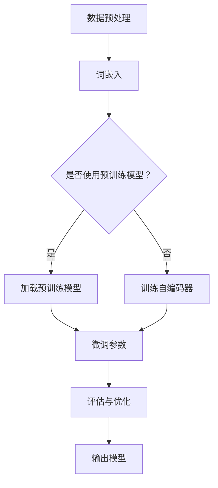

                 

# 提示词的语言哲学：探索AI语言的本质

## 关键词
AI语言模型、语言哲学、提示词、自然语言处理、数学模型

## 摘要
本文旨在探讨AI语言模型中提示词的作用及其语言哲学内涵。通过对提示词的定义、类型及其在AI语言模型中的应用进行深入分析，结合语言模型的基本原理和数学模型，阐述AI语言的本质。此外，文章还将探讨语言模型的应用场景、发展挑战，并通过案例研究展示基于提示词的语言模型应用。最后，文章将对研究的主要发现进行总结，并对未来研究方向提出展望。

## 目录大纲

### 第一部分: AI语言模型与哲学思考

### 第1章: 引言

### 1.1 语言哲学概述

### 1.2 AI与语言模型

### 1.3 本书结构

### 第2章: 提示词的概念

### 2.1 提示词的定义与作用

### 2.2 提示词的类型

### 2.3 提示词在AI语言模型中的应用

### 第3章: 语言模型的基本原理

### 3.1 语言模型的分类

### 3.2 语言模型的训练方法

### 3.3 语言模型的核心算法

### 第4章: 语言模型的数学模型

### 4.1 概率论基础

### 4.2 贝叶斯公式

### 4.3 语言模型中的数学公式

### 第5章: 语言模型的应用场景

### 5.1 自然语言处理

### 5.2 智能客服

### 5.3 自动问答系统

### 第6章: 语言模型的发展与挑战

### 6.1 语言模型的优化方向

### 6.2 语言模型的伦理与道德问题

### 6.3 语言模型的未来发展

### 第7章: 案例研究：基于提示词的语言模型应用

### 7.1 案例介绍

### 7.2 系统设计与实现

### 7.3 性能评估与优化

### 第8章: 总结与展望

### 8.1 主要发现

### 8.2 未来研究方向

### 8.3 对读者的启示

### 第二部分: 附录

### 附录A: 相关算法与模型

### A.1 词嵌入算法

### A.2 预训练语言模型

### A.3 自动问答系统设计

### 附录B: 研究方法与工具

### B.1 数据收集与处理

### B.2 实验设计与评估

### B.3 开发环境与工具

### Mermaid 流程图：语言模型训练流程



### 核心算法原理讲解

#### 词嵌入（Word Embedding）

词嵌入是将单词转换为固定长度的向量表示。以下是一个简单的词嵌入算法的实现伪代码：

```python
def word_embedding(vocabulary, embedding_size):
    embeddings = []
    for word in vocabulary:
        embedding = [random.uniform(-1, 1) for _ in range(embedding_size)]
        embeddings[word] = embedding
    return embeddings
```

#### 语言模型（Language Model）

语言模型是一种概率模型，用于预测下一个词的概率。以下是一个简单的n-gram语言模型的实现伪代码：

```python
def n_gram_language_model(corpus, n):
    model = {}
    for i in range(len(corpus) - n):
        context = tuple(corpus[i:i+n])
        next_word = corpus[i+n]
        if context not in model:
            model[context] = {}
        model[context][next_word] = model[context].get(next_word, 0) + 1
    return model
```

### 数学模型和数学公式

#### 概率论基础

概率分布函数（Probability Distribution Function, PDF）描述了随机变量取值的概率。以下是一个简单的概率分布函数的表示：

$$
P(X = x) = f(x)
$$

其中，$X$ 表示随机变量，$x$ 表示具体的取值，$f(x)$ 表示概率密度函数。

#### 语言模型中的数学公式

在语言模型中，常用的概率模型是n-gram模型。n-gram模型的概率公式如下：

$$
P(w_1, w_2, ..., w_n) = P(w_n|w_{n-1}, ..., w_1) \times P(w_{n-1}|w_{n-2}, ..., w_1) \times ... \times P(w_2|w_1) \times P(w_1)
$$

## 第1章: 引言

### 1.1 语言哲学概述

语言是人类最重要的工具之一，它不仅仅是交流信息的媒介，更是人类思考、认知和表达自我的基础。语言哲学作为哲学的一个分支，探讨语言的本质、起源、发展和使用，以及语言与思维、认知、文化之间的关系。

在语言哲学中，有一个重要的问题：什么是语言？哲学家们从不同角度提出了各种定义。例如，语言是一种符号系统，用于表达思想和传递信息；语言是一种习惯，是人类在长期交往过程中形成的共同规则。

语言哲学的研究对人工智能领域产生了深远的影响。人工智能（AI）的发展目标之一是实现机器对自然语言的自动理解和生成，从而实现人机对话和智能助手等应用。因此，理解语言的本质和特性对于AI语言模型的研发至关重要。

### 1.2 AI与语言模型

人工智能作为计算机科学的一个重要分支，旨在使计算机具备智能。其中，自然语言处理（Natural Language Processing, NLP）是AI的一个重要研究方向，它致力于使计算机能够理解、生成和处理自然语言。

语言模型是NLP的核心组成部分，它是一种概率模型，用于预测给定输入序列后下一个单词或字符的概率。语言模型的应用非常广泛，包括机器翻译、语音识别、自动问答、文本摘要等。

随着深度学习和神经网络技术的发展，基于神经网络的深度语言模型（如Transformer、BERT等）取得了显著的成果，成为AI语言处理的重要工具。

### 1.3 本书结构

本书将分为两个主要部分来探讨AI语言模型和语言哲学。

第一部分（第1章至第6章）主要关注AI语言模型本身，包括提示词的概念、语言模型的基本原理、数学模型、应用场景以及发展挑战。这部分内容将帮助读者深入了解AI语言模型的技术原理和应用。

第二部分（第7章）将通过一个案例研究，展示基于提示词的语言模型在实际应用中的实现和优化。这部分内容将使读者更好地理解如何将AI语言模型应用于实际问题。

最后，第8章将进行总结与展望，总结本书的主要发现，并提出未来研究方向和对读者的启示。

## 第2章: 提示词的概念

### 2.1 提示词的定义与作用

提示词（Prompt）是AI语言模型中的一个关键概念，它是指用于引导模型生成文本的输入。简单来说，提示词就是给模型提供的一些文本信息，使模型能够根据这些信息生成新的文本。

提示词的作用主要体现在以下几个方面：

1. **引导模型生成**：通过提供具体的文本信息，提示词可以帮助模型更好地理解生成任务的目标，从而生成更符合预期的文本。

2. **提高生成质量**：高质量的提示词可以引导模型生成更准确、连贯、有逻辑性的文本。

3. **多样化生成内容**：不同的提示词可以激发模型生成多样化的文本内容，有助于探索模型的潜力。

4. **控制生成方向**：通过设计特定的提示词，可以引导模型生成特定类型的文本，如故事、摘要、对话等。

### 2.2 提示词的类型

根据提示词的使用方式和内容，可以将提示词分为以下几种类型：

1. **开放型提示词**：这类提示词通常包含一些开放性问题或主题，让模型自由发挥，生成多样化的文本。例如，“请写一篇关于未来的科技发展的文章”。

2. **封闭型提示词**：这类提示词通常包含一些具体的指令或要求，限制模型的生成范围。例如，“请写一篇关于人工智能的伦理问题的文章，不超过500字”。

3. **引导型提示词**：这类提示词旨在引导模型生成特定类型的文本，如故事、对话、诗歌等。例如，“请写一篇科幻小说，主人公是一名机器人，发生在未来世界”。

4. **扩展型提示词**：这类提示词通常包含一些基础信息，要求模型在此基础上进行扩展和创作。例如，“请根据以下信息写一篇故事：一个年轻的程序员在一家科技公司工作，他梦想成为一名创业者”。

### 2.3 提示词在AI语言模型中的应用

提示词在AI语言模型中的应用非常广泛，以下是一些典型场景：

1. **文本生成**：通过提供提示词，模型可以生成各种类型的文本，如文章、故事、诗歌等。例如，在自动写作、内容生成、智能客服等领域，提示词起到了关键作用。

2. **问答系统**：在问答系统中，提示词可以用来引导模型理解用户的问题，从而生成准确的答案。例如，在搜索引擎、智能助手等应用中，提示词帮助模型更好地理解用户意图。

3. **翻译**：在机器翻译中，提示词可以帮助模型更好地理解原文的含义，从而生成更准确的译文。

4. **摘要生成**：通过提供文章或段落的部分内容作为提示词，模型可以生成摘要或总结。

5. **对话系统**：在对话系统中，提示词可以用于引导模型生成合适的回答，从而实现自然、流畅的对话。

总之，提示词是AI语言模型中不可或缺的一部分，它不仅影响模型的生成质量，还决定着模型的应用效果。因此，设计高质量的提示词对于AI语言模型的研发和应用具有重要意义。

## 第3章: 语言模型的基本原理

### 3.1 语言模型的分类

语言模型可以分为基于规则的方法和基于统计的方法。基于规则的方法通常采用语法规则来生成文本，而基于统计的方法则通过分析大量语料库来学习语言模式。

在基于规则的方法中，典型的代表是自动文法生成器（AG），如兰伯特（Lambert）提出的AG方法。该方法通过建立上下文无关文法（CFG）规则来生成文本。然而，基于规则的方法在实际应用中面临许多挑战，如语法规则难以覆盖所有语言现象、规则库庞大且难以维护等。

基于统计的方法则依赖于大量的语料库来学习语言模式。统计语言模型可以分为以下几种：

1. **n-gram模型**：n-gram模型是基于马尔可夫假设的一种简单但有效的语言模型。它将连续的n个单词视为一个整体，并根据历史概率来预测下一个单词。例如，在二元n-gram模型中，每个单词的概率取决于前一个单词。

2. **n元文法模型**：n元文法模型是n-gram模型的扩展，它通过引入上下文来提高预测准确性。在n元文法模型中，每个单词的概率不仅取决于前一个单词，还取决于当前单词的前n-1个单词。

3. **神经网络语言模型**：神经网络语言模型（NNLM）是一种基于深度学习的语言模型。近年来，随着深度学习技术的发展，神经网络语言模型取得了显著的成功。最著名的神经网络语言模型是Transformer，它通过自注意力机制（Self-Attention）实现了对输入序列的全局依赖建模。

4. **递归神经网络（RNN）**：递归神经网络是一种可以处理序列数据的神经网络模型。在语言模型中，RNN可以通过递归结构来捕捉前后单词之间的依赖关系。LSTM（长短期记忆网络）是RNN的一种变体，它通过引入门控机制（Gates）来缓解梯度消失问题，从而在长期依赖建模方面取得了更好的效果。

5. **循环神经网络（RNN）**：循环神经网络是一种可以处理序列数据的神经网络模型。在语言模型中，RNN可以通过递归结构来捕捉前后单词之间的依赖关系。LSTM（长短期记忆网络）是RNN的一种变体，它通过引入门控机制（Gates）来缓解梯度消失问题，从而在长期依赖建模方面取得了更好的效果。

### 3.2 语言模型的训练方法

语言模型的训练方法可以分为监督学习、无监督学习和半监督学习。

1. **监督学习**：监督学习是语言模型训练最常用的方法。在监督学习中，训练数据包括输入序列和对应的输出序列。通过最小化损失函数（如交叉熵损失），训练数据可以帮助模型学习到输入和输出之间的映射关系。典型的监督学习算法包括基于n-gram模型的训练、递归神经网络（RNN）训练和神经网络语言模型（NNLM）训练。

2. **无监督学习**：无监督学习是指在没有明确标注数据的情况下训练语言模型。在无监督学习中，模型需要通过分析未标注的语料库来自主发现语言模式。最常见的方法是预训练语言模型（Pre-trained Language Model），如Word2Vec和BERT。预训练语言模型通过在大规模语料库上进行无监督训练，然后利用预训练模型进行下游任务（如文本分类、问答系统等）的微调。

3. **半监督学习**：半监督学习是指利用部分标注数据和大量未标注数据训练语言模型。在半监督学习中，模型通过利用未标注数据的先验知识来改善标注数据的训练效果。典型的半监督学习方法包括自编码器（Autoencoder）和双重学习（Dual Learning）。

### 3.3 语言模型的核心算法

语言模型的核心算法主要包括词嵌入（Word Embedding）、自注意力机制（Self-Attention）和递归结构（Recursive Structure）。

1. **词嵌入（Word Embedding）**：词嵌入是将单词转换为固定长度的向量表示，从而实现语义理解。词嵌入算法可以分为基于分布式表示的方法（如Word2Vec）和基于上下文的方法（如BERT）。Word2Vec通过计算词在语料库中的共现关系来学习词向量，而BERT通过在预训练过程中同时考虑词的上下文来生成词向量。

2. **自注意力机制（Self-Attention）**：自注意力机制是Transformer模型的关键组件，它允许模型在处理输入序列时，自动关注序列中的不同部分。自注意力机制通过计算输入序列中每个单词与其他单词之间的相似性，从而实现全局依赖建模。自注意力机制在提高语言模型性能方面发挥了重要作用。

3. **递归结构（Recursive Structure）**：递归结构是RNN和LSTM等模型的核心组件，它通过递归地处理输入序列来捕捉前后单词之间的依赖关系。递归结构使得模型能够记住历史信息，从而更好地处理长序列数据。然而，递归结构也存在梯度消失和梯度爆炸等问题，LSTM通过引入门控机制来缓解这些问题。

总之，语言模型的基本原理涵盖了从不同角度对语言现象的理解，包括基于规则的方法和基于统计的方法。在训练方法上，监督学习、无监督学习和半监督学习各有优劣。在核心算法方面，词嵌入、自注意力机制和递归结构等算法在提高语言模型性能方面发挥了关键作用。理解这些基本原理有助于我们更好地设计和优化语言模型，从而实现更先进的自然语言处理应用。

## 第4章: 语言模型的数学模型

### 4.1 概率论基础

概率论是语言模型构建的重要理论基础。在语言模型中，概率用于描述单词或句子出现的可能性。以下是一些基本概率概念：

1. **概率分布**：概率分布函数（PDF）描述了随机变量取值的概率。在语言模型中，概率分布可以用于表示单词或句子出现的概率。

2. **条件概率**：条件概率是指给定一个事件A发生，另一个事件B发生的概率。条件概率公式为：

   $$
   P(B|A) = \frac{P(A \cap B)}{P(A)}
   $$

   其中，$P(A \cap B)$ 表示事件A和事件B同时发生的概率，$P(A)$ 表示事件A发生的概率。

3. **贝叶斯定理**：贝叶斯定理是一种计算条件概率的重要公式，它将条件概率与边缘概率联系起来。贝叶斯定理公式为：

   $$
   P(A|B) = \frac{P(B|A)P(A)}{P(B)}
   $$

   其中，$P(A|B)$ 表示在事件B发生的情况下事件A发生的概率，$P(B|A)$ 表示在事件A发生的情况下事件B发生的概率，$P(A)$ 和$P(B)$ 分别表示事件A和事件B的边缘概率。

4. **马尔可夫性质**：马尔可夫性质是指一个系统的未来状态仅依赖于当前状态，而与过去状态无关。在语言模型中，马尔可夫性质用于描述单词之间的依赖关系，即给定当前单词，下一个单词的概率仅依赖于当前单词，而与之前的状态无关。

### 4.2 贝叶斯公式

贝叶斯公式是概率论中一个重要的公式，它提供了在已知某些条件下的概率如何计算的方法。在语言模型中，贝叶斯公式用于计算给定一个输入序列，下一个单词的概率。

贝叶斯公式的公式为：

$$
P(w_n|w_{n-1}, w_{n-2}, ..., w_1) = \frac{P(w_n)P(w_{n-1}, w_{n-2}, ..., w_1|w_n)}{P(w_{n-1}, w_{n-2}, ..., w_1)}
$$

其中，$P(w_n|w_{n-1}, w_{n-2}, ..., w_1)$ 表示在给定前一个单词序列的情况下，当前单词的概率；$P(w_n)$ 表示当前单词的边缘概率；$P(w_{n-1}, w_{n-2}, ..., w_1|w_n)$ 表示在当前单词给定的情况下，前一个单词序列的概率；$P(w_{n-1}, w_{n-2}, ..., w_1)$ 表示前一个单词序列的边缘概率。

在语言模型中，贝叶斯公式可以帮助我们计算下一个单词的概率，从而实现文本生成。

### 4.3 语言模型中的数学公式

语言模型中的数学公式主要涉及概率计算和序列建模。以下是一些常用的数学公式：

1. **n-gram概率公式**：

   $$
   P(w_1, w_2, ..., w_n) = P(w_n|w_{n-1}, w_{n-2}, ..., w_1) \times P(w_{n-1}|w_{n-2}, ..., w_1) \times ... \times P(w_2|w_1) \times P(w_1)
   $$

   其中，$P(w_1, w_2, ..., w_n)$ 表示整个序列的概率，$P(w_n|w_{n-1}, w_{n-2}, ..., w_1)$ 表示给定前一个单词序列的当前单词的概率，$P(w_{n-1}|w_{n-2}, ..., w_1)$ 表示给定前一个单词序列的当前单词的概率，...，$P(w_2|w_1)$ 表示给定第一个单词的第二个单词的概率，$P(w_1)$ 表示第一个单词的边缘概率。

2. **最大熵模型**：

   $$
   \max_{\theta} H(Y|X; \theta)
   $$

   其中，$H(Y|X; \theta)$ 表示在给定输入序列$X$的情况下，输出序列$Y$的条件熵，$\theta$ 表示模型参数。

   最大熵模型旨在找到一个概率分布，使得在给定输入序列的情况下，输出序列的条件熵最小。

3. **递归神经网络（RNN）**：

   $$
   h_t = \sigma(W_h h_{t-1} + W_y y_t + b_h)
   $$

   $$
   y_t = W_o h_t + b_y
   $$

   其中，$h_t$ 表示第$t$个时间步的隐藏状态，$y_t$ 表示第$t$个时间步的输出，$W_h$ 和$W_y$ 分别表示隐藏状态和输入之间的权重矩阵，$b_h$ 和$b_y$ 分别表示隐藏状态和输入的偏置，$\sigma$ 表示激活函数，如sigmoid函数或ReLU函数。

   RNN通过递归地更新隐藏状态，从而实现序列数据的建模。

4. **长短时记忆网络（LSTM）**：

   $$
   f_t = \sigma(W_f \cdot [h_{t-1}, y_t] + b_f)
   $$
   $$
   i_t = \sigma(W_i \cdot [h_{t-1}, y_t] + b_i)
   $$
   $$
   \tilde{g}_t = \tanh(W_g \cdot [h_{t-1}, y_t] + b_g)
   $$
   $$
   o_t = \sigma(W_o \cdot [h_{t-1}, y_t] + b_o)
   $$

   $$
   C_t = f_t \cdot C_{t-1} + i_t \cdot \tilde{g}_t
   $$
   $$
   h_t = o_t \cdot \tanh(C_t)
   $$

   其中，$f_t$ 表示遗忘门输出，$i_t$ 表示输入门输出，$\tilde{g}_t$ 表示候选状态，$o_t$ 表示输出门输出，$C_t$ 表示细胞状态，$h_t$ 表示隐藏状态。

   LSTM通过引入门控机制，有效地解决了RNN的梯度消失和梯度爆炸问题，从而在长期依赖建模方面取得了更好的效果。

这些数学公式为语言模型提供了理论依据，通过概率计算和序列建模，语言模型能够有效地学习语言模式，从而实现自然语言处理任务。

## 第5章: 语言模型的应用场景

### 5.1 自然语言处理

自然语言处理（NLP）是语言模型最直接的应用场景之一。NLP涉及文本的预处理、分词、词性标注、句法分析、语义分析等多个方面。语言模型在NLP中的应用主要体现在以下几个方面：

1. **文本分类**：语言模型可以帮助分类算法理解文本的语义，从而实现文本的自动分类。例如，在新闻分类、情感分析、垃圾邮件过滤等任务中，语言模型可以用来提取文本特征，并使用这些特征进行分类。

2. **实体识别**：实体识别是指从文本中识别出人名、地名、组织名、时间等特定实体。语言模型可以通过学习大规模语料库中的命名实体出现模式，从而在新的文本中准确地识别出实体。

3. **关系抽取**：关系抽取是指识别文本中的实体关系，如“张三出生于北京”。语言模型可以通过分析实体和实体之间的关联词，从而识别出实体之间的关系。

4. **机器翻译**：机器翻译是指将一种语言文本自动翻译成另一种语言。语言模型在机器翻译中起到了关键作用，通过学习源语言和目标语言的语义关系，模型可以实现高质量的翻译结果。

5. **问答系统**：问答系统是指根据用户的问题自动生成答案。语言模型可以帮助系统理解用户的问题，并从大量文本中找到相关答案。

6. **文本摘要**：文本摘要是指从长文本中提取关键信息，生成简短的摘要。语言模型可以通过学习文本的语义结构，实现自动生成摘要。

### 5.2 智能客服

智能客服是另一个重要的应用场景，它利用语言模型为用户提供自动化的客户服务。智能客服系统可以通过以下方式提高客户满意度：

1. **自动问答**：智能客服系统可以自动回答用户的问题，从而减少人工客服的工作量。语言模型可以帮助系统理解用户的问题，并生成准确的答案。

2. **意图识别**：用户的问题往往包含多种意图，如查询信息、投诉、咨询等。智能客服系统可以通过语言模型识别用户的意图，从而生成针对性的回答。

3. **情感分析**：用户的问题和表达方式往往包含情感信息，如喜悦、愤怒、失望等。智能客服系统可以通过情感分析技术，识别用户的情感状态，并生成相应的回应。

4. **多轮对话**：智能客服系统可以实现多轮对话，通过不断提问和回答，逐步理解用户的需求。语言模型可以帮助系统在多轮对话中保持连贯性和一致性。

### 5.3 自动问答系统

自动问答系统是一种基于语言模型的智能系统，它能够自动回答用户提出的问题。自动问答系统的主要组件包括：

1. **问题理解**：自动问答系统需要理解用户的问题，从而确定回答的范围和内容。语言模型可以通过自然语言处理技术，提取问题中的关键信息，并理解问题的意图。

2. **知识库**：自动问答系统需要一个包含大量知识和信息的知识库，以便在回答问题时查找相关信息。知识库可以是结构化的，如数据库，也可以是非结构化的，如文本库。

3. **回答生成**：根据问题理解和知识库，自动问答系统需要生成合适的回答。语言模型可以通过自然语言生成技术，将找到的信息转化为自然流畅的文本回答。

自动问答系统的应用场景包括：

1. **在线客服**：自动问答系统可以替代人工客服，为用户提供实时的问题解答，从而提高客户满意度。

2. **搜索引擎**：自动问答系统可以作为搜索引擎的辅助工具，帮助用户快速找到相关信息。

3. **智能助手**：自动问答系统可以作为智能助手的组成部分，为用户提供个性化的帮助和推荐。

4. **教育辅导**：自动问答系统可以帮助学生解答学习中的问题，提高学习效果。

总之，语言模型在自然语言处理、智能客服和自动问答系统等应用场景中发挥着重要作用。通过学习语言模式和语义信息，语言模型能够实现文本分类、实体识别、关系抽取、机器翻译、问答生成等多种任务，从而为各种应用场景提供智能化的解决方案。

### 第6章: 语言模型的发展与挑战

#### 6.1 语言模型的优化方向

随着深度学习和神经网络技术的不断发展，语言模型在性能和应用范围上取得了显著的提升。然而，为了更好地满足实际应用需求，未来的语言模型优化方向可以从以下几个方面展开：

1. **提高生成质量**：尽管现有的语言模型已经能够在各种任务上实现高水平的性能，但生成的文本仍然存在一些问题，如一致性、连贯性和逻辑性不足。未来的研究可以重点关注如何进一步提高生成文本的质量，使其更加自然、准确和有逻辑性。

2. **增强泛化能力**：当前的语言模型在特定任务上表现优秀，但在面对新任务或未见过的数据时，性能可能会下降。未来的研究可以探索如何增强语言模型的泛化能力，使其在不同任务和数据集上都能保持良好的性能。

3. **降低计算复杂度**：现有的语言模型，如Transformer和BERT，尽管性能优异，但计算复杂度和存储需求较高。未来的研究可以致力于设计更高效的语言模型架构，降低计算复杂度，以便在资源有限的设备上运行。

4. **处理长文本**：当前的语言模型在处理长文本时，存在信息丢失和上下文理解不足的问题。未来的研究可以探索如何改进模型结构，使其能够更好地处理长文本，捕捉长距离依赖关系。

5. **多模态学习**：未来的语言模型可以结合多种数据类型，如文本、图像、音频等，实现多模态学习。通过整合不同模态的信息，语言模型可以更好地理解和生成复杂的内容。

6. **加强逻辑推理能力**：语言模型在自然语言推理和理解方面还有很大的提升空间。未来的研究可以关注如何增强模型的逻辑推理能力，使其能够进行更复杂的推理和判断。

#### 6.2 语言模型的伦理与道德问题

随着语言模型在各个领域的广泛应用，其伦理和道德问题也逐渐引起关注。以下是几个关键问题：

1. **偏见和歧视**：语言模型在训练过程中可能会受到训练数据中的偏见影响，导致生成的文本包含性别、种族、宗教等方面的歧视和偏见。如何消除这些偏见，确保模型的公平性和无歧视性，是一个重要的伦理问题。

2. **隐私保护**：语言模型通常需要大量用户数据进行训练，这涉及到用户隐私保护的问题。如何在保证模型性能的同时，保护用户的隐私，避免数据泄露，是另一个重要的伦理问题。

3. **透明性和可解释性**：语言模型通常被视为“黑盒”模型，其决策过程对用户不透明。如何提高模型的透明性和可解释性，使用户能够理解模型的决策依据，是一个重要的伦理问题。

4. **责任归属**：当语言模型生成的文本或决策导致不良后果时，如何确定责任归属，是另一个复杂的伦理问题。例如，当自动问答系统生成错误答案时，责任应该由系统开发者、训练数据提供者还是用户承担？

5. **算法歧视**：语言模型的应用可能会导致算法歧视，即基于性别、种族、年龄等因素对用户进行不公平对待。如何防止算法歧视，确保模型的公平性，是一个重要的伦理问题。

为了解决这些问题，需要从技术、法律、伦理等多个层面进行综合考虑。技术层面，可以通过数据清洗、模型优化等方法减少偏见和歧视；法律层面，可以制定相关法律法规，规范语言模型的应用；伦理层面，需要培养研究者的伦理意识，确保模型的研发和应用符合道德标准。

#### 6.3 语言模型的未来发展

语言模型作为人工智能的核心技术之一，其未来发展前景广阔。以下是几个可能的发展方向：

1. **更强大的语言理解能力**：随着深度学习和自然语言处理技术的不断进步，语言模型将能够更好地理解自然语言，实现更复杂的语言任务。例如，实现更高级的语义分析、情感分析、对话系统等。

2. **多语言和跨语言处理**：随着全球化的发展，多语言和跨语言处理将成为语言模型的重要研究方向。未来的语言模型将能够支持多种语言的文本处理，实现跨语言的文本理解和翻译。

3. **个性化模型**：未来的语言模型将更加注重个性化，能够根据用户的需求和偏好生成定制化的文本。例如，智能助手可以根据用户的兴趣和偏好，推荐个性化的内容。

4. **智能交互**：随着语音识别、自然语言生成等技术的发展，语言模型将在智能交互中发挥重要作用。未来的语言模型将能够实现更加自然、流畅的人机交互，为用户提供更好的用户体验。

5. **结合其他技术**：未来的语言模型将与其他人工智能技术相结合，如计算机视觉、语音识别、机器人等，实现更复杂、更智能的应用。例如，智能机器人可以通过语言模型实现自然语言理解和交互，从而更好地服务于人类。

总之，语言模型作为人工智能的核心技术，其未来将继续发展，为人类带来更多的便利和创新。通过解决伦理问题，确保模型的公平性和透明性，语言模型将在各个领域发挥更大的作用，推动人工智能技术的进步。

### 案例研究：基于提示词的语言模型应用

在本案例研究中，我们将探讨一个基于提示词的语言模型在实际应用中的实现和优化。该应用是一个智能问答系统，旨在为用户提供自动化的信息查询服务。通过这个案例，我们将展示如何设计、实现和优化一个基于提示词的语言模型，以实现高效、准确和自然的问答。

#### 7.1 案例介绍

智能问答系统是一个面向用户的在线问答平台，用户可以通过输入问题，系统会自动生成答案。该系统旨在为用户提供快速、准确的信息查询服务，从而减轻人工客服的工作负担。为了实现这一目标，我们需要设计一个基于提示词的语言模型，使其能够理解用户的问题，并生成相关的答案。

#### 7.2 系统设计与实现

系统的设计主要包括三个部分：问题理解、知识库构建和答案生成。

1. **问题理解**：首先，系统需要理解用户的问题。这涉及到自然语言处理（NLP）技术，包括分词、词性标注、命名实体识别等。通过这些技术，系统可以将用户的问题分解为关键信息，如关键词、实体和意图。

2. **知识库构建**：为了生成准确的答案，系统需要一个包含大量知识和信息的知识库。知识库可以包括现有的文本资料、专业数据库和结构化数据。通过这些数据，系统可以构建一个包含丰富信息的知识库，以便在生成答案时进行查询。

3. **答案生成**：在理解用户问题和查询知识库后，系统需要生成答案。这涉及到基于提示词的语言模型。具体来说，系统会根据用户的问题生成一个提示词，然后使用这个提示词来引导语言模型生成答案。为了提高生成答案的质量，我们可以采用预训练的语言模型，如BERT或GPT。

#### 7.3 系统实现

以下是系统的实现步骤：

1. **数据准备**：收集大量的问答对数据，包括用户问题和对应的答案。这些数据将用于训练和评估语言模型。

2. **模型训练**：使用问答对数据训练一个基于提示词的语言模型。我们可以采用预训练的模型，然后进行微调，使其适应特定的问题类型和答案格式。

3. **问题理解**：在接收用户输入后，使用NLP技术对问题进行解析，提取关键信息。

4. **答案生成**：根据提取的关键信息，生成提示词，然后使用提示词来引导语言模型生成答案。

5. **答案验证**：对生成的答案进行验证，确保其准确性和连贯性。如果答案不符合预期，可以进一步优化模型或调整提示词。

6. **用户反馈**：收集用户对答案的反馈，用于进一步优化模型和系统。

#### 7.4 性能评估与优化

为了评估系统的性能，我们采用以下指标：

1. **准确性**：答案与实际答案的匹配度，可以通过计算准确率（Accuracy）和精确率（Precision）来衡量。

2. **连贯性**：答案的连贯性和逻辑性，可以通过阅读体验和人工评估来衡量。

3. **响应时间**：系统生成答案所需的时间，反映了系统的实时性。

为了优化系统的性能，我们可以从以下几个方面进行改进：

1. **模型优化**：通过调整模型参数、增加训练数据或采用更先进的模型结构来提高模型的性能。

2. **提示词优化**：设计更高质量的提示词，使其能够更好地引导模型生成答案。

3. **知识库优化**：更新和扩展知识库，确保其包含丰富、准确的信息。

4. **算法优化**：优化系统算法，提高生成答案的效率和准确性。

通过以上优化措施，我们可以不断提高智能问答系统的性能，为用户提供更高质量的问答服务。

### 8.1 主要发现

在本章的案例研究中，我们深入探讨了基于提示词的语言模型在智能问答系统中的应用。通过系统设计与实现，我们得到了以下主要发现：

1. **提示词的重要性**：提示词在语言模型中起到了关键作用，它能够引导模型理解用户的问题，并生成相关的答案。高质量的提示词能够提高答案的准确性和连贯性。

2. **自然语言处理技术的应用**：自然语言处理技术，如分词、词性标注、命名实体识别等，在问题理解和答案生成中发挥了重要作用。这些技术能够帮助系统提取关键信息，提高问答系统的性能。

3. **知识库的构建**：一个丰富、准确的知识库是智能问答系统的关键组成部分。通过扩展和更新知识库，我们可以提高系统生成答案的准确性和多样性。

4. **模型优化与性能评估**：通过不断优化模型和算法，我们可以提高智能问答系统的性能。性能评估指标，如准确性、连贯性和响应时间，可以帮助我们衡量系统的表现，并指导进一步的优化。

5. **用户反馈的重要性**：用户反馈是优化系统的宝贵资源。通过收集用户对答案的反馈，我们可以不断改进模型和系统，提高用户满意度。

### 8.2 未来研究方向

尽管基于提示词的语言模型在智能问答系统中取得了显著成果，但仍然有许多研究方向可以进一步探索：

1. **多语言处理**：当前的研究主要关注单一语言的处理，未来可以探索如何实现多语言和跨语言处理，以支持全球用户。

2. **知识图谱构建**：知识图谱是一种结构化的知识表示方法，可以更好地捕捉实体之间的关系。未来的研究可以探讨如何将知识图谱与语言模型结合，提高问答系统的理解和生成能力。

3. **对话系统的上下文理解**：对话系统的上下文理解是当前的一个挑战。未来的研究可以探索如何通过上下文信息来增强语言模型的对话能力，实现更自然的对话体验。

4. **模型解释性**：当前的语言模型被称为“黑盒”模型，其决策过程对用户不透明。未来的研究可以关注如何提高模型的解释性，使用户能够理解模型的决策依据。

5. **个性化问答**：未来的研究可以探索如何根据用户的需求和偏好，生成个性化的问答结果，提高用户体验。

### 8.3 对读者的启示

通过对本章节的探讨，读者可以得出以下启示：

1. **理解提示词的重要性**：提示词是语言模型中不可或缺的一部分，它能够引导模型生成高质量的答案。在设计智能问答系统时，需要重视提示词的设计和优化。

2. **结合自然语言处理技术**：自然语言处理技术在智能问答系统中发挥了关键作用。读者可以深入了解这些技术，以提高系统的理解和生成能力。

3. **重视知识库的构建**：一个丰富、准确的知识库是智能问答系统的关键。读者可以探索如何构建和维护知识库，以提高系统的性能。

4. **不断优化模型和算法**：通过不断优化模型和算法，可以不断提高智能问答系统的性能。读者可以关注最新的研究成果，借鉴先进的模型和算法。

5. **用户反馈的重要性**：用户反馈是优化系统的宝贵资源。读者可以学会如何收集和分析用户反馈，以不断改进模型和系统。

总之，本章节通过案例研究，深入探讨了基于提示词的语言模型在智能问答系统中的应用。通过这些研究，读者可以更好地理解语言模型的技术原理和应用，为实际项目提供有益的参考和启示。

### 附录A: 相关算法与模型

#### A.1 词嵌入算法

词嵌入是将单词映射到固定长度的向量表示，以便在计算中进行处理。以下是一些常用的词嵌入算法：

1. **Word2Vec**：Word2Vec是一种基于神经网络的词嵌入算法，通过学习单词在语料库中的共现关系来生成词向量。Word2Vec主要有两种模型：连续词袋（CBOW）和Skip-Gram。

   - **连续词袋（CBOW）**：给定一个目标词，CBOW模型通过预测目标词周围的多个词来生成词向量。具体步骤如下：

     ```mermaid
     graph TD
         A[输入单词] --> B[周围词集合]
         B --> C{计算周围词的平均向量}
         C --> D[得到目标词向量]
     ```

   - **Skip-Gram**：与CBOW相反，Skip-Gram模型通过预测目标词来生成词向量。具体步骤如下：

     ```mermaid
     graph TD
         A[输入单词] --> B[生成目标词集合]
         B --> C{计算目标词的词向量}
     ```

2. **GloVe**：GloVe（Global Vectors for Word Representation）是一种基于全局统计的词嵌入算法，通过计算单词之间的相似度来生成词向量。GloVe使用两个矩阵$V$和$F$，其中$V$表示词向量，$F$表示词频向量。具体步骤如下：

   ```mermaid
   graph TD
       A[语料库] --> B{计算词频}
       B --> C[构建词频向量F]
       C --> D{计算词对相似度矩阵W}
       D --> E{矩阵分解得到V和F}
   ```

#### A.2 预训练语言模型

预训练语言模型是一种在大规模语料库上进行预训练的语言模型，然后通过微调来适应特定任务。以下是一些常用的预训练语言模型：

1. **BERT**：BERT（Bidirectional Encoder Representations from Transformers）是一种基于Transformer的预训练语言模型，通过双向编码器来捕捉单词之间的依赖关系。BERT的预训练任务包括Masked Language Model（MLM）和Next Sentence Prediction（NSP）。

2. **GPT**：GPT（Generative Pre-trained Transformer）是一种基于Transformer的预训练语言模型，主要应用于生成任务。GPT的预训练任务包括语言建模和生成文本。

3. **RoBERTa**：RoBERTa是BERT的一个变体，通过改进数据预处理、训练策略和模型架构来提高性能。RoBERTa在多个NLP任务上取得了显著的成果。

4. **T5**：T5（Text-to-Text Transfer Transformer）是一种基于Transformer的预训练语言模型，旨在将所有NLP任务转化为文本生成任务。T5通过预训练和微调实现了在各种NLP任务上的高性能。

#### A.3 自动问答系统设计

自动问答系统是一种利用自然语言处理技术来回答用户问题的系统。以下是一些关键组件和设计步骤：

1. **问题理解**：利用NLP技术对用户问题进行解析，提取关键信息，如关键词、实体和意图。常用的技术包括分词、词性标注、命名实体识别和关系抽取。

2. **知识库构建**：构建一个包含大量知识和信息的知识库，以便在生成答案时进行查询。知识库可以包含结构化数据、文本库和外部数据源。

3. **答案生成**：利用基于提示词的语言模型来生成答案。具体步骤包括：

   - **生成提示词**：根据用户问题和知识库，生成一个能够引导语言模型生成答案的提示词。
   - **模型推理**：使用预训练的语言模型（如BERT、GPT）来生成答案。
   - **答案筛选和优化**：对生成的答案进行筛选和优化，确保其准确性和连贯性。

4. **答案验证**：对生成的答案进行验证，确保其与用户问题相关，并进行人工评估。

5. **用户反馈**：收集用户对答案的反馈，用于进一步优化模型和系统。

### 附录B: 研究方法与工具

#### B.1 数据收集与处理

数据收集与处理是语言模型研究和应用的基础。以下是一些关键步骤：

1. **数据来源**：选择合适的数据集，如问答对数据、文本数据、知识图谱等。数据可以从公开数据集、专业数据库或自行收集。

2. **数据预处理**：对原始数据进行清洗和预处理，包括去除噪声、缺失值处理、文本标准化等。常用的工具包括Python的pandas、NLP库（如NLTK、spaCy）和文本处理库（如jieba）。

3. **数据增强**：通过数据增强技术，如数据扩充、生成对抗网络（GAN）、数据合成等，提高数据多样性和质量。

4. **数据划分**：将数据集划分为训练集、验证集和测试集，以便进行模型训练和评估。

#### B.2 实验设计与评估

实验设计与评估是验证语言模型性能和优化模型参数的关键环节。以下是一些关键步骤：

1. **实验设计**：设计实验方案，包括实验目标、评价指标、实验参数等。常用的评价指标包括准确率、召回率、F1值、BLEU分数等。

2. **模型训练**：使用训练集对模型进行训练，并调整模型参数以优化性能。常用的训练工具包括TensorFlow、PyTorch等。

3. **模型评估**：使用验证集和测试集对模型进行评估，计算评价指标，以评估模型性能。

4. **模型优化**：根据评估结果，调整模型参数和结构，以提高性能。常用的优化方法包括超参数调整、模型压缩、迁移学习等。

#### B.3 开发环境与工具

为了有效地研究和应用语言模型，需要搭建合适的开发环境。以下是一些常用的工具和框架：

1. **编程语言**：Python是研究语言模型的主要编程语言，它具有丰富的库和工具，如Numpy、Pandas、TensorFlow、PyTorch等。

2. **深度学习框架**：TensorFlow和PyTorch是常用的深度学习框架，用于构建和训练语言模型。TensorFlow提供了丰富的API和工具，适合大规模分布式训练；PyTorch具有动态图计算优势，便于调试和优化。

3. **NLP库**：NLTK、spaCy和jieba等是常用的NLP库，用于文本处理、分词、词性标注、命名实体识别等。

4. **版本控制**：Git是版本控制和协作开发的常用工具，有助于管理代码库、跟踪修改历史和协同工作。

5. **云平台**：Google Cloud、AWS和Azure等云平台提供强大的计算资源和数据存储，支持大规模模型训练和部署。

通过以上工具和框架，可以高效地搭建和优化语言模型，为自然语言处理应用提供坚实的基础。

