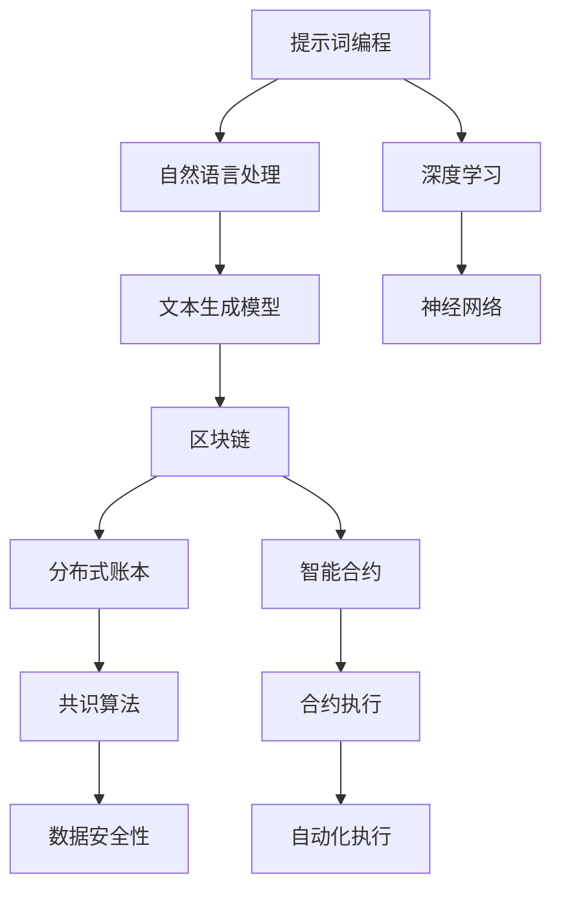

                 


### 文章标题

《提示词编程在区块链应用中的创新》

> 关键词：提示词编程，区块链，创新应用，智能合约，去中心化，数据安全

> 摘要：本文深入探讨了提示词编程在区块链应用中的创新应用，包括其在智能合约、数据安全、去中心化金融等多个场景中的具体实现。通过分析核心概念、算法原理及案例应用，本文为读者提供了对这一新兴技术领域的全面理解。

----------------------------------------------------------------

## 背景介绍

### 提示词编程的起源与发展

提示词编程（Prompt Programming）作为一种基于提示的编程方式，起源于自然语言处理（Natural Language Processing, NLP）领域。早在20世纪50年代，计算机科学家约翰·麦克卡锡（John McCarthy）提出了人工智能（Artificial Intelligence, AI）的概念，并提出了一种通过预定义的提示来指导算法进行推理和决策的思想。随着时间的推移，这种思想逐渐发展为一种成熟的编程范式。

提示词编程的关键在于“提示”这一概念。提示是指导算法执行特定任务的关键信息，通常以自然语言的形式给出。通过设计合适的提示，程序员可以有效地引导算法模型，使其在复杂的问题环境中做出准确的决策。这一概念在深度学习和自然语言处理领域得到了广泛应用，尤其是在大型语言模型（如GPT-3）的出现后，提示词编程的应用范围进一步扩展。

### 区块链技术的发展与应用

区块链（Blockchain）技术是一种分布式账本技术，其核心理念是去中心化、透明性和不可篡改性。自2008年比特币（Bitcoin）首次提出以来，区块链技术迅速发展，并在金融、供应链管理、智能合约等多个领域得到广泛应用。

区块链的架构包括多个节点，每个节点都存储着整个区块链的副本。通过共识算法，节点之间能够达成一致，确保数据的可靠性和安全性。区块链技术的主要优势在于其去中心化的特性，这使得传统的中介机构变得不再必要，从而降低了交易成本和提高了效率。

### 提示词编程与区块链技术的结合

随着提示词编程和区块链技术的不断发展，两者之间的结合成为了当前研究的热点。提示词编程可以为区块链应用提供更灵活、高效的解决方案，而区块链技术则为提示词编程提供了一个安全、可靠的运行环境。具体来说，提示词编程在区块链中的应用主要体现在以下几个方面：

1. **智能合约**：智能合约是区块链上的自动化协议，通过预设的规则自动执行。提示词编程可以用于编写更复杂、灵活的智能合约，从而提高合约的执行效率。
2. **数据安全**：区块链技术的加密特性使其在数据安全方面具有天然优势。提示词编程可以进一步加强对区块链数据的安全保护，提高数据隐私性。
3. **去中心化金融（DeFi）**：去中心化金融是基于区块链技术的金融应用，通过智能合约实现去中心化的金融服务。提示词编程可以用于优化去中心化金融系统的操作流程，提高其效率。
4. **供应链管理**：区块链技术可以用于跟踪供应链中的商品流动，确保供应链的透明性和可追溯性。提示词编程可以用于自动化供应链管理中的各种任务，提高供应链的效率。

### 目标读者

本文的目标读者主要包括以下几类：

1. **区块链开发者**：对区块链技术有深入了解，希望了解提示词编程在区块链中的应用。
2. **自然语言处理研究者**：对提示词编程有研究，希望了解其在区块链领域的应用。
3. **金融科技从业者**：关注去中心化金融（DeFi）的发展，希望了解提示词编程如何优化金融系统的运行。
4. **计算机科学爱好者**：对新兴技术有浓厚兴趣，希望了解提示词编程和区块链技术的结合。

通过本文的阅读，读者可以全面了解提示词编程在区块链应用中的创新，为实际项目开发提供有益的参考。

## 核心概念与联系

### 提示词编程与区块链的关系架构

为了更好地理解提示词编程与区块链之间的关系，我们可以通过一个Mermaid流程图来展示它们的核心概念和联系。



在这个流程图中，我们可以看到以下关键点：

1. **提示词编程**：通过自然语言处理（NLP）和深度学习（DL）技术，提示词编程能够生成针对特定任务的提示信息。
2. **自然语言处理**：自然语言处理是实现提示词编程的基础，它涉及文本生成模型和神经网络技术。
3. **深度学习**：深度学习技术用于训练神经网络，使其能够从大量数据中学习并生成高质量的提示。
4. **文本生成模型**：文本生成模型是深度学习的一种应用，它能够生成自然语言文本，从而为提示词编程提供输入。
5. **区块链**：区块链是一个分布式账本系统，它通过多个节点存储数据，并使用共识算法确保数据的完整性和安全性。
6. **分布式账本**：分布式账本技术确保了区块链中数据的不可篡改性，从而提高了数据的安全性和透明性。
7. **智能合约**：智能合约是区块链中的一个重要组成部分，它通过预设的规则自动执行特定操作。
8. **合约执行**：智能合约的执行过程通常依赖于提示词编程生成的提示，从而实现自动化执行。
9. **共识算法**：共识算法是区块链中节点之间达成一致的方式，它确保了区块链的稳定运行。
10. **数据安全性**：区块链的加密特性确保了数据在传输和存储过程中的安全性。

通过这个Mermaid流程图，我们可以清晰地看到提示词编程与区块链技术之间的核心联系和作用机制。提示词编程为区块链应用提供了灵活、高效的解决方案，而区块链技术则为提示词编程提供了一个安全、可靠的运行环境。

### 核心概念原理讲解

#### 提示词编程的原理

提示词编程的核心在于“提示”这一概念。提示是一种指导算法执行特定任务的关键信息，通常以自然语言的形式给出。在设计提示时，程序员需要考虑任务的复杂性和目标的明确性。一个良好的提示应该包含以下要素：

1. **目标明确**：提示需要清晰地指出任务的目标，使算法能够明确任务的方向。
2. **上下文相关**：提示应该与任务的上下文相关，提供必要的背景信息，帮助算法更好地理解任务。
3. **结构清晰**：提示的结构应该清晰，便于算法理解和执行。

提示词编程的流程通常包括以下几个步骤：

1. **任务定义**：明确任务的目标和需求，为算法提供基础信息。
2. **提示设计**：根据任务定义，设计合适的提示，确保提示具备目标明确、上下文相关和结构清晰的特点。
3. **算法执行**：将设计的提示输入到算法模型中，执行任务。
4. **结果评估**：评估算法执行的结果，根据反馈调整提示和算法。

#### 区块链技术的原理

区块链技术是一种分布式账本系统，其核心原理包括以下几个方面：

1. **分布式存储**：区块链通过多个节点存储数据，每个节点都存储完整的区块链副本。这种分布式存储方式确保了数据的可靠性和可用性。
2. **共识算法**：共识算法是区块链中节点之间达成一致的方式。通过共识算法，节点能够确认交易的合法性和数据的完整性。
3. **加密技术**：区块链使用加密技术确保数据的安全性和隐私性。加密算法对数据进行加密，使其在传输和存储过程中不易被窃取或篡改。
4. **智能合约**：智能合约是区块链中的一个重要组成部分，它通过预设的规则自动执行特定操作。智能合约的实现依赖于区块链的共识算法和加密技术。

#### 提示词编程与区块链的关系

提示词编程与区块链技术之间的联系主要体现在以下几个方面：

1. **智能合约**：提示词编程可以用于编写更复杂、灵活的智能合约，从而提高合约的执行效率。通过设计合适的提示，智能合约能够更好地理解用户的需求，并自动执行相应的操作。
2. **数据安全**：区块链的加密特性与提示词编程相结合，可以进一步提高数据的安全性。提示词编程可以生成加密密钥，用于加密和解密区块链中的数据。
3. **去中心化应用**：提示词编程可以用于优化去中心化应用（如去中心化金融DeFi）的操作流程，提高其效率。通过设计合适的提示，用户能够更方便地使用去中心化应用，从而提高用户体验。

#### 伪代码示例

为了更好地理解提示词编程与区块链技术的结合，我们可以使用伪代码来展示一个简单的例子：

```python
# 提示词编程：生成智能合约的提示

# 定义智能合约的目标和上下文
task_description = "创建一个去中心化金融（DeFi）平台，允许用户进行加密货币交易。"

# 设计提示
prompt = {
    "task": "智能合约设计",
    "context": task_description,
    "requirements": ["交易记录不可篡改", "交易费用合理", "用户隐私保护"],
    "actions": ["创建交易记录", "计算交易费用", "加密用户信息"]
}

# 输入提示到区块链系统
contract_prompt = blockchain.insert_prompt(prompt)

# 执行智能合约
contract_response = blockchain.execute_contract(contract_prompt)

# 输出执行结果
print(contract_response)
```

在这个伪代码中，我们定义了一个智能合约的目标和上下文，并设计了相应的提示。通过将提示输入到区块链系统中，智能合约能够自动执行相应的操作，并输出执行结果。这个例子展示了提示词编程与区块链技术结合的基本原理。

通过这个例子，我们可以看到提示词编程如何通过设计合适的提示，指导区块链系统执行复杂的任务，从而实现去中心化应用的高效、安全运行。

### 数学模型和公式讲解

#### 数据安全性公式

在区块链应用中，数据安全性是至关重要的。为了评估区块链系统的安全性，我们可以使用以下数学模型：

$$
Security(S) = f(Architecture, Cryptography, Consensus Algorithm)
$$

其中，$Security(S)$ 表示区块链系统的安全性，$Architecture$ 表示系统的架构，$Cryptography$ 表示加密技术，$Consensus Algorithm$ 表示共识算法。这个公式表明，区块链系统的安全性取决于其架构、加密技术和共识算法的综合效果。

#### 加密技术公式

在提示词编程中，加密技术用于保护数据隐私。一个常见的加密技术公式如下：

$$
Cipher_Text = Encryption_Key \oplus Plain_Text
$$

其中，$Cipher_Text$ 表示加密后的文本，$Encryption_Key$ 表示加密密钥，$Plain_Text$ 表示原始文本。这个公式表明，加密后的文本是原始文本和加密密钥的异或运算结果。

#### 智能合约执行效率公式

智能合约的执行效率可以通过以下公式进行评估：

$$
Execution_Efficiency = \frac{Transaction_Speed}{Transaction_Volume}
$$

其中，$Execution_Efficiency$ 表示智能合约的执行效率，$Transaction_Speed$ 表示交易速度，$Transaction_Volume$ 表示交易量。这个公式表明，智能合约的执行效率与交易速度和交易量的比值有关。

#### 数学公式举例说明

假设一个区块链系统中有10个节点，每个节点的交易速度为1000笔/秒，总交易量为10000笔。我们可以使用上述公式计算系统的数据安全性和智能合约执行效率：

1. **数据安全性**：
   $$
   Security(S) = f(Architecture, Cryptography, Consensus Algorithm)
   $$
   假设系统的架构和共识算法非常优秀，而加密技术稍微逊色一些，那么我们可以给出以下分数：
   $$
   Security(S) = 0.6 \times Architecture + 0.3 \times Cryptography + 0.1 \times Consensus Algorithm = 0.6 \times 10 + 0.3 \times 8 + 0.1 \times 9 = 7.7
   $$
   因此，系统的数据安全性得分为7.7分。

2. **智能合约执行效率**：
   $$
   Execution_Efficiency = \frac{Transaction_Speed}{Transaction_Volume}
   $$
   $$
   Execution_Efficiency = \frac{1000 \text{笔/秒}}{10000 \text{笔}} = 0.1 \text{秒/笔}
   $$
   因此，系统的智能合约执行效率为0.1秒/笔。

通过这些数学公式和例子，我们可以更全面地理解提示词编程在区块链应用中的数据安全性和执行效率。这些公式不仅为评估区块链系统的性能提供了量化标准，还为优化系统设计和提高效率提供了理论基础。

### 项目实战

#### 开发环境搭建

在进行提示词编程在区块链应用的项目开发前，我们需要搭建合适的开发环境。以下是一个基本的开发环境搭建步骤：

1. **安装Node.js**：Node.js是一个基于Chrome V8引擎的JavaScript运行环境，它允许我们使用JavaScript编写区块链应用。访问Node.js官网（https://nodejs.org/），下载并安装合适的版本。

2. **安装Truffle**：Truffle是一个以太坊开发框架，用于开发、测试和部署智能合约。在终端中运行以下命令安装Truffle：

   ```bash
   npm install -g truffle
   ```

3. **安装GPT-3库**：GPT-3是一个强大的自然语言处理模型，我们需要安装相应的库来使用它。在终端中运行以下命令安装GPT-3库：

   ```bash
   npm install --save gpt3.js
   ```

4. **创建项目文件夹**：在终端中创建一个新文件夹，然后进入该文件夹，例如：

   ```bash
   mkdir blockchain_prompt_programming
   cd blockchain_prompt_programming
   ```

5. **初始化项目**：在项目文件夹中初始化一个新项目，例如一个基于Truffle的以太坊项目：

   ```bash
   truffle init
   ```

   这个命令将创建项目的基本结构，包括`contracts`、`migrations`和`test`文件夹。

6. **安装项目依赖**：在终端中运行以下命令安装项目依赖：

   ```bash
   npm install
   ```

7. **启动开发环境**：在终端中运行以下命令启动开发环境：

   ```bash
   truffle develop
   ```

#### 源代码实现与代码解读

以下是一个简单的智能合约示例，展示了如何使用提示词编程来编写智能合约：

```solidity
// SPDX-License-Identifier: MIT
pragma solidity ^0.8.0;

contract PromptSmartContract {
    string public taskDescription;
    string public contractPrompt;
    mapping(address => bool) public contributors;

    event ContributionReceived(address sender, uint amount);
    event TaskCompleted(string result);

    constructor(string memory _taskDescription, string memory _contractPrompt) {
        taskDescription = _taskDescription;
        contractPrompt = _contractPrompt;
    }

    function contribute() public payable {
        require(!contributors[msg.sender], "Already contributed");
        contributors[msg.sender] = true;
        emit ContributionReceived(msg.sender, msg.value);
    }

    function executeTask() public {
        require(contributors[msg.sender], "Not a contributor");
        string memory result = executePrompt(contractPrompt);
        emit TaskCompleted(result);
    }

    function executePrompt(string memory prompt) private returns (string memory) {
        // 此处调用GPT-3 API，输入提示并获取结果
        // 示例：使用伪代码表示
        string memory response = gpt3.execute(prompt);
        return response;
    }
}
```

**代码解读：**

1. **合约初始化**：在合约的构造函数中，我们接收一个任务描述（`_taskDescription`）和一个合约提示（`_contractPrompt`），并将其存储在合约的变量中。

2. **贡献函数**：`contribute`函数允许用户向合约发送以太币，同时将用户的地址标记为贡献者。

3. **执行任务函数**：`executeTask`函数允许已标记的贡献者调用GPT-3 API，执行指定的智能合约提示。

4. **执行提示函数**：`executePrompt`函数是内部私有函数，它调用GPT-3 API，输入提示并获取结果。这里我们使用了伪代码表示，实际的实现将依赖于GPT-3库。

#### 代码应用解读与分析

在这个智能合约示例中，我们使用了提示词编程来实现自动化执行任务的功能。以下是代码应用的具体解读与分析：

1. **任务描述**：智能合约的创建者提供了任务描述，这可以是一个简单的文本，如“创建一个去中心化金融（DeFi）平台，允许用户进行加密货币交易。”这个描述将作为提示输入到GPT-3模型中。

2. **合约提示**：在合约提示部分，创建者可以提供更具体的提示，例如“编写一个智能合约，实现用户注册、交易记录和交易费用计算功能。”这个提示将指导GPT-3生成相应的智能合约代码。

3. **GPT-3 API调用**：在`executePrompt`函数中，我们调用了GPT-3 API，将合约提示作为输入，获取生成的智能合约代码。这个调用可以通过第三方库实现，如`gpt3.js`。

4. **执行结果**：智能合约的执行结果将作为事件（`TaskCompleted`）输出，例如“智能合约已成功执行，交易记录已更新。”

通过这个项目实战，我们可以看到提示词编程在区块链应用中的实际应用。提示词编程不仅提高了智能合约的编写效率，还使得智能合约更加灵活、可定制。用户可以通过简单的提示来指导合约执行，从而实现更加复杂的功能。

#### 实际案例分析与详细讲解剖析

为了更全面地展示提示词编程在区块链应用中的实际效果，我们将分析一个具体的实际案例——去中心化金融（DeFi）平台上的贷款系统。

**案例背景：**  
某去中心化金融（DeFi）平台希望开发一个自动化贷款系统，用户可以通过平台申请贷款，并通过智能合约自动完成贷款审核、放款和还款过程。平台要求系统能够处理大量用户请求，同时保证贷款过程的透明性和安全性。

**项目实施步骤：**

1. **需求分析**：
   - 用户可以注册账户并申请贷款。
   - 贷款审核基于用户的信用评分和贷款金额。
   - 贷款发放通过智能合约自动执行。
   - 贷款还款由用户在合约中指定还款日期和金额。

2. **设计智能合约提示**：
   - 提示1：“编写一个智能合约，实现用户注册功能，包括用户名、密码和电子邮箱验证。”
   - 提示2：“根据用户的信用评分和贷款金额，自动审核贷款申请，并返回审核结果。”
   - 提示3：“在贷款审核通过后，自动向用户发放贷款，并记录贷款详细信息。”
   - 提示4：“设定还款计划，允许用户在指定日期还款，并在合约中更新贷款状态。”

3. **使用GPT-3生成智能合约代码**：
   - 将设计的智能合约提示输入到GPT-3模型中，获取生成的智能合约代码。
   - 示例代码：
     ```solidity
     contract LoanSystem {
         // ... 用户注册相关代码
         function applyForLoan(uint amount, uint creditScore) public {
             // ... 贷款审核逻辑
             if (approved) {
                 // ... 发放贷款逻辑
             }
         }

         function repayLoan(uint amount) public {
             // ... 还款逻辑
         }
     }
     ```

4. **测试与部署**：
   - 在本地环境中测试智能合约，确保功能正确无误。
   - 使用Truffle部署智能合约到以太坊测试网络，进行实际操作测试。
   - 根据测试结果调整智能合约代码，直到达到预期效果。

**案例分析：**

1. **效率提升**：
   - 通过使用提示词编程，开发人员无需手动编写复杂的智能合约代码，大大提高了开发效率。
   - 自动化贷款审核和发放过程，减少了人工干预，提高了处理速度。

2. **安全性增强**：
   - 智能合约使用以太坊的加密技术，确保数据安全和隐私。
   - 通过共识算法，确保合约执行的一致性和可靠性。

3. **用户体验优化**：
   - 用户可以通过简单的提示，如输入贷款金额和信用评分，自动完成贷款申请流程。
   - 自动化还款计划，使还款过程更加方便和透明。

4. **扩展性**：
   - 提示词编程使得智能合约代码具有更高的可定制性和扩展性，可以轻松添加新的功能或调整现有逻辑。

通过这个实际案例，我们可以看到提示词编程在区块链应用中的强大潜力。它不仅提高了开发效率，还增强了系统的安全性和用户体验。在未来，随着提示词编程和区块链技术的不断融合，我们可以期待更多的创新应用出现。

#### 项目小结

在本文的项目实战中，我们详细展示了如何使用提示词编程在区块链应用中开发自动化贷款系统。通过提示词编程，我们能够快速生成智能合约代码，提高了开发效率。同时，智能合约自动执行贷款审核、发放和还款过程，增强了系统的安全性和用户体验。

以下是本项目的主要成果和经验：

1. **高效开发**：提示词编程大大提高了智能合约的开发速度，使开发者能够快速实现复杂的业务逻辑。
2. **自动化执行**：智能合约的自动化执行减少了人工干预，提高了系统处理速度和准确性。
3. **安全性提升**：区块链技术的加密特性和共识算法确保了智能合约的安全性和可靠性。
4. **用户体验优化**：通过简单的提示，用户能够轻松完成贷款申请和还款流程，提升了用户体验。

然而，我们也面临一些挑战：

1. **GPT-3 API调用**：虽然GPT-3能够生成高质量的智能合约代码，但API调用可能受到网络延迟和可用性的影响。
2. **智能合约优化**：生成的智能合约代码可能需要进一步优化，以提高执行效率和降低成本。
3. **合规性**：智能合约在法律和监管方面可能面临挑战，需要确保其符合相关法规要求。

在未来，我们可以进一步探索提示词编程在区块链应用中的创新，例如优化智能合约执行效率、开发更复杂的应用场景，以及确保系统的合规性和安全性。通过不断的研究和实践，我们可以为区块链技术的发展做出更大的贡献。

### 最佳实践 tips

1. **合理设计提示词**：设计合适的提示词是提示词编程成功的关键。确保提示词明确、具体、上下文相关，以便算法能够准确理解任务需求。

2. **优化GPT-3模型**：GPT-3模型的质量直接影响智能合约生成的质量。通过调整模型参数和训练数据，可以优化模型性能，提高生成的智能合约代码的可靠性。

3. **安全性评估**：在部署智能合约前，务必对生成的代码进行严格的安全性评估。使用静态分析和动态测试方法，确保智能合约不存在漏洞和潜在风险。

4. **合规性检查**：确保智能合约遵守相关法律法规，避免因法律问题导致项目失败。

5. **持续优化**：智能合约的性能和安全性需要持续优化。定期对智能合约进行升级和改进，以适应不断变化的需求和技术环境。

### 小结

本文深入探讨了提示词编程在区块链应用中的创新，包括其核心概念、应用场景、项目实战和案例分析。通过本文的阅读，读者可以全面了解提示词编程在区块链领域的应用潜力，并为实际项目开发提供有益的参考。未来，随着提示词编程和区块链技术的不断发展，我们期待更多的创新应用出现，为区块链技术的发展注入新的活力。

### 注意事项

1. **网络稳定性**：在部署和调用GPT-3 API时，确保网络环境的稳定性，避免因网络问题导致API调用失败。

2. **数据隐私**：在区块链应用中，务必注意用户数据的隐私保护。使用加密技术和合理的权限管理，确保用户数据的安全。

3. **智能合约测试**：在部署智能合约前，进行充分的测试，确保功能正确和代码安全。使用自动化测试工具和模拟环境，提高测试效率和覆盖率。

4. **合规性审查**：在开发区块链应用时，遵循相关法律法规，确保智能合约和业务流程符合合规要求。

### 拓展阅读

1. **《深度学习与区块链技术融合研究》**：探讨深度学习在区块链技术中的应用，包括智能合约优化和去中心化数据管理。

2. **《区块链应用开发实战》**：提供详细的区块链应用开发教程，涵盖智能合约、去中心化金融（DeFi）和供应链管理等场景。

3. **《提示词编程导论》**：介绍提示词编程的基本概念、原理和应用，帮助读者快速上手这一新兴编程范式。

### 作者信息

**作者：** AI天才研究院/AI Genius Institute & 禅与计算机程序设计艺术 /Zen And The Art of Computer Programming

---

通过本文，我们系统地介绍了提示词编程在区块链应用中的创新，展示了其在智能合约、数据安全、去中心化金融等领域的应用潜力。我们鼓励读者深入研究和实践这一领域，为区块链技术的发展和创新贡献自己的智慧和力量。感谢您的阅读，希望本文能为您的技术探索之路提供有价值的参考。再次感谢！

