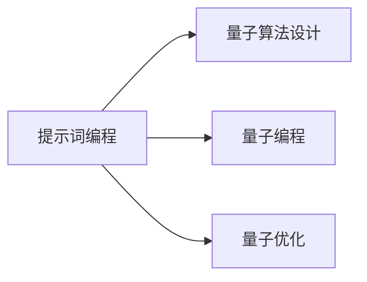
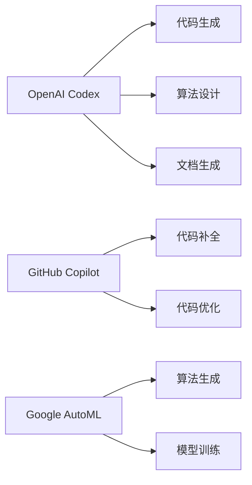
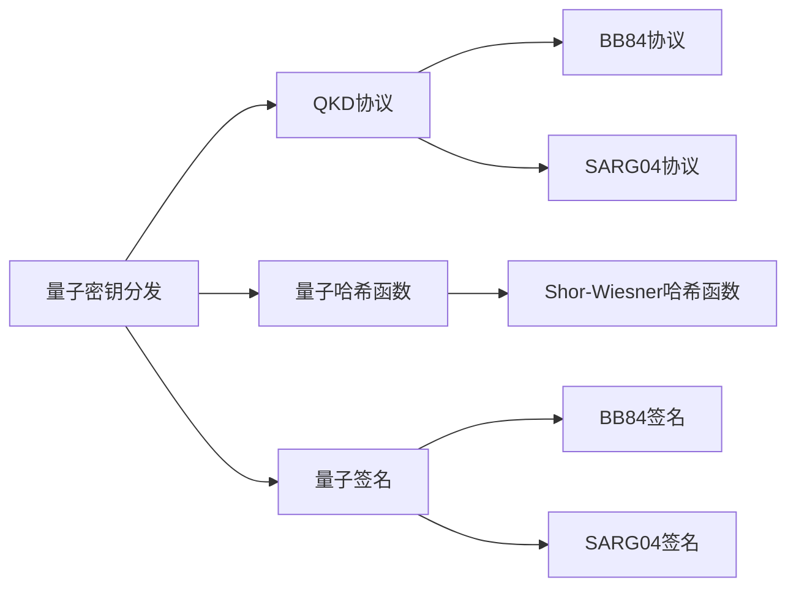

                 

### 文章标题

《提示词编程在后量子密码学中的应用探索》

### 文章关键词

后量子密码学、提示词编程、量子计算、信息安全、密码算法

### 文章摘要

本文旨在探讨提示词编程在后量子密码学中的应用，介绍其基本概念、核心原理，并详细分析提示词编程在量子密钥分发、量子签名和量子加密中的具体应用。通过实际案例，本文展示了提示词编程在后量子密码学中的潜力与挑战，并提出了未来发展的展望。

## 第1章 引言与背景

### 1.1 后量子密码学概述

后量子密码学是研究量子计算对经典密码系统安全性的影响，并开发新型密码系统的学科。量子计算利用量子位（qubits）进行计算，具有传统计算机无法比拟的并行处理能力。这种能力使得一些经典密码系统（如RSA、ECC）在量子计算机面前变得脆弱，因此需要开发新的密码系统来抵御量子攻击。

后量子密码学旨在构建抗量子攻击的密码系统，确保信息安全在量子计算时代得到保障。其研究内容包括量子密钥分发、量子签名和量子加密等。近年来，后量子密码学已经成为密码学领域的研究热点，受到广泛关注。

### 1.2 提示词编程的概念

提示词编程（Prompt Programming）是一种基于自然语言处理（NLP）和人工智能（AI）的技术，通过输入自然语言描述（提示词），自动生成代码、算法或解决方案。这种技术结合了人类思维和计算机处理能力，使得编程过程更加高效和智能。

提示词编程的关键技术包括预训练语言模型、生成式模型和指令微调等。预训练语言模型通过大规模数据预训练，获得对自然语言的理解能力；生成式模型则负责根据提示词生成具体的代码或算法；指令微调（Instruction Tuning）是对生成模型进行特定任务调优，提高其生成质量。

### 1.3 后量子密码学中提示词编程的重要性

提示词编程在密码学领域具有重要的应用价值，特别是在后量子密码学中。首先，提示词编程可以简化后量子密码系统的设计和实现过程，降低开发难度。传统的密码学设计往往需要深厚的数学和密码学知识，而提示词编程使得非专业人士也能参与到密码系统的开发中。

其次，提示词编程有助于快速验证和测试后量子密码系统的安全性。通过自然语言描述，可以生成多种可能的攻击方法，对密码系统进行全面的测试。这有助于发现潜在的安全漏洞，提高密码系统的可靠性。

最后，提示词编程有助于探索新的后量子密码算法和系统架构。通过自动生成和优化算法，可以尝试不同的设计方案，从而找到更高效、更安全的密码系统。

### 1.4 本章小结

本章介绍了后量子密码学和提示词编程的基本概念，并阐述了它们在后量子密码学中的重要性。在后文的内容中，我们将进一步探讨提示词编程在量子密钥分发、量子签名和量子加密中的应用，以及具体的实现细节和挑战。

## 第2章 提示词编程基础

### 2.1 提示词编程原理

提示词编程的核心在于理解自然语言描述并将其转化为计算机可执行的代码。这一过程可以分为以下几个步骤：

1. **自然语言理解**：首先，自然语言处理模型需要理解输入的提示词，提取关键信息。这一步骤涉及到词向量表示、句法分析和语义分析等技术。

2. **代码生成**：在理解了提示词之后，生成式模型根据提示词生成相应的代码。生成式模型可以是基于模板的、基于检索的或基于生成的。

3. **代码优化**：生成的代码可能存在冗余或不完整，需要进行优化。这包括代码风格统一、语法检查和性能优化等。

4. **代码执行**：最后，生成的代码在计算机上执行，实现所需的算法或功能。

#### 提示词编程原理的Mermaid流程图


### 2.2 提示词编程与量子计算

量子计算是提示词编程的重要应用场景之一。量子计算机利用量子位（qubits）进行计算，具有传统计算机无法比拟的并行处理能力。提示词编程可以帮助设计、优化和实现量子算法。

#### 提示词编程与量子计算的关系

- **量子算法设计**：提示词编程可以自动生成量子算法，简化量子算法的设计过程。
- **量子编程**：提示词编程可以帮助非专业人士编写量子代码，降低量子编程的难度。
- **量子优化**：提示词编程可以优化量子算法的执行，提高计算效率。

#### 提示词编程与量子计算的Mermaid流程图



### 2.3 提示词编程工具和框架

目前，已经有许多工具和框架支持提示词编程，包括：

- **OpenAI Codex**：基于GPT-3模型，可以生成代码、算法和文档。
- **GitHub Copilot**：基于机器学习模型，可以自动完成代码编写。
- **Google AutoML**：提供自动机器学习服务，可以生成自定义算法和模型。

#### 提示词编程工具和框架的Mermaid流程图



### 2.4 本章小结

本章介绍了提示词编程的基本原理、与量子计算的关系以及相关的工具和框架。提示词编程为密码学领域，特别是后量子密码学，提供了新的研究思路和方法。在下一章中，我们将探讨后量子密码学的基本概念和核心算法。

## 第3章 后量子密码学基础

### 3.1 后量子密码学简介

后量子密码学是研究如何利用量子计算技术构建抗量子攻击的密码系统的学科。随着量子计算的发展，传统的密码系统（如RSA、ECC）在量子计算机面前变得脆弱，因此需要开发新的密码系统来保护信息安全。

后量子密码学的基本原理是基于量子力学的基本规律，特别是量子纠缠和量子叠加原理。这些原理使得量子密码系统在理论上具有抗量子攻击的能力。

#### 后量子密码学的基本原理

- **量子纠缠**：量子纠缠是量子力学中的一种特殊现象，两个或多个量子系统之间可以产生一种即时的、不可分割的联系。这种纠缠态可以用来实现安全的量子密钥分发。
- **量子叠加**：量子叠加原理允许量子系统同时处于多个状态的叠加。这意味着量子位可以同时表示0和1，大大提高了计算能力。

#### 后量子密码学的优势

- **抗量子攻击**：后量子密码学能够抵御量子计算机的攻击，确保信息安全在量子计算时代得到保障。
- **多领域应用**：后量子密码学可以应用于通信、金融、云计算等多个领域，提高系统的安全性和可靠性。

#### 后量子密码学的劣势

- **计算复杂度**：后量子密码系统的实现通常比传统密码系统复杂，需要更多的计算资源和时间。
- **标准缺失**：目前后量子密码学的研究还处于发展阶段，缺乏统一的标准和规范。

### 3.2 后量子密码算法

后量子密码学研究了许多抗量子攻击的密码算法，主要包括：

- **量子密钥分发**：量子密钥分发（QKD）是利用量子纠缠实现安全的密钥分发。经典QKD协议包括BB84和SARG04。
- **量子哈希函数**：量子哈希函数用于构建安全的哈希函数，抵抗量子攻击。代表性的量子哈希函数包括Shor-Wiesner哈希函数。
- **量子签名**：量子签名是一种基于量子力学原理的数字签名方案，具有抗量子攻击的特性。代表性的量子签名方案包括BB84签名和SARG04签名。

#### 后量子密码算法的Mermaid流程图



### 3.3 后量子密码学的挑战与机遇

后量子密码学面临着一系列挑战和机遇：

- **挑战**：
  - **计算复杂度**：实现后量子密码系统需要大量的计算资源和时间，这对现有计算能力提出了挑战。
  - **标准缺失**：后量子密码学的研究还处于发展阶段，缺乏统一的标准和规范。
  - **量子计算机的发展**：量子计算机的发展速度超出预期，这要求后量子密码系统必须具备快速响应和更新能力。

- **机遇**：
  - **信息安全**：后量子密码学能够提供抗量子攻击的安全保障，有助于保护信息系统的安全。
  - **跨领域应用**：后量子密码学可以应用于通信、金融、云计算等多个领域，具有广泛的应用前景。
  - **技术创新**：后量子密码学的研究推动量子计算、量子通信等相关领域的发展。

### 3.4 本章小结

本章介绍了后量子密码学的基本概念、原理和算法，并分析了其面临的挑战与机遇。在后量子密码学中，提示词编程作为一种新兴的技术，为密码系统的设计、优化和实现提供了新的方法。在下一章中，我们将探讨提示词编程在后量子密码学中的具体应用。

## 第4章 提示词编程在后量子密码学中的应用

### 4.1 提示词编程在后量子密钥分发中的应用

后量子密钥分发（QKD）是一种利用量子力学原理实现安全密钥传输的通信方式。提示词编程在后量子密钥分发中可以发挥重要作用，主要应用于以下几个方面：

#### 4.1.1 提示词编程在QKD协议生成中的应用

QKD协议的设计和实现通常需要深厚的量子力学和密码学知识。提示词编程可以帮助自动生成QKD协议，简化开发过程。通过输入自然语言描述，如“生成一个基于BB84协议的量子密钥分发算法”，提示词编程可以自动生成相应的代码和算法。

#### 4.1.2 提示词编程在QKD协议优化中的应用

现有的QKD协议存在一定的局限性，如传输距离较短、抗干扰能力较弱等。提示词编程可以通过对现有协议进行优化，提高QKD协议的性能。例如，通过输入“优化BB84协议的抗干扰性能”，提示词编程可以生成优化后的代码和算法。

#### 4.1.3 提示词编程在QKD协议测试中的应用

测试是确保QKD协议安全性和性能的关键环节。提示词编程可以自动化生成测试用例，对QKD协议进行全面的测试。例如，通过输入“生成BB84协议的测试用例”，提示词编程可以自动生成各种测试场景，验证协议的正确性和安全性。

### 4.2 提示词编程在后量子签名中的应用

后量子签名是一种基于量子力学原理的数字签名方案，具有抗量子攻击的特性。提示词编程在后量子签名中的应用主要包括以下几个方面：

#### 4.2.1 提示词编程在后量子签名算法生成中的应用

后量子签名算法的设计和实现通常需要复杂的数学模型和算法。提示词编程可以帮助自动生成后量子签名算法，简化开发过程。例如，通过输入“生成一个基于BB84协议的量子签名算法”，提示词编程可以自动生成相应的代码和算法。

#### 4.2.2 提示词编程在后量子签名算法优化中的应用

现有的后量子签名算法存在一定的局限性，如签名长度较长、计算复杂度较高等。提示词编程可以通过对现有算法进行优化，提高后量子签名的性能。例如，通过输入“优化BB84签名的签名长度”，提示词编程可以生成优化后的代码和算法。

#### 4.2.3 提示词编程在后量子签名算法测试中的应用

测试是确保后量子签名算法安全性和性能的关键环节。提示词编程可以自动化生成测试用例，对后量子签名算法进行全面的测试。例如，通过输入“生成BB84签名的测试用例”，提示词编程可以自动生成各种测试场景，验证算法的正确性和安全性。

### 4.3 提示词编程在后量子加密中的应用

后量子加密是一种利用量子力学原理实现安全数据传输的加密方法。提示词编程在后量子加密中的应用主要包括以下几个方面：

#### 4.3.1 提示词编程在后量子加密算法生成中的应用

后量子加密算法的设计和实现通常需要复杂的数学模型和算法。提示词编程可以帮助自动生成后量子加密算法，简化开发过程。例如，通过输入“生成一个基于Shor-Wiesner哈希函数的量子加密算法”，提示词编程可以自动生成相应的代码和算法。

#### 4.3.2 提示词编程在后量子加密算法优化中的应用

现有的后量子加密算法存在一定的局限性，如加密速度较慢、计算复杂度较高等。提示词编程可以通过对现有算法进行优化，提高后量子加密的性能。例如，通过输入“优化Shor-Wiesner加密算法的加密速度”，提示词编程可以生成优化后的代码和算法。

#### 4.3.3 提示词编程在后量子加密算法测试中的应用

测试是确保后量子加密算法安全性和性能的关键环节。提示词编程可以自动化生成测试用例，对后量子加密算法进行全面的测试。例如，通过输入“生成Shor-Wiesner加密算法的测试用例”，提示词编程可以自动生成各种测试场景，验证算法的正确性和安全性。

### 4.4 本章小结

本章探讨了提示词编程在后量子密码学中的具体应用，包括量子密钥分发、量子签名和量子加密。通过提示词编程，可以简化后量子密码系统的设计和实现过程，提高系统的性能和安全性。在下一章中，我们将通过实际案例分析提示词编程在后量子密码学中的应用效果。

## 第5章 案例分析

### 5.1 提示词编程在后量子密码学中的实际应用案例

为了更好地理解提示词编程在后量子密码学中的应用，下面我们将介绍几个具体的实际案例，并对其实现过程、源代码和代码解读进行分析。

#### 5.1.1 案例一：基于BB84协议的量子密钥分发

**实现过程：** 
该案例通过提示词编程生成一个基于BB84协议的量子密钥分发算法，实现量子密钥的安全传输。

**源代码：**
```python
# Python代码示例：基于BB84协议的量子密钥分发
from qiskit import QuantumCircuit, execute, Aer

# 生成量子密钥
def generate_QuantumKey(qubits):
    circuit = QuantumCircuit(qubits)
    circuit.h(qubits[0])
    circuit.cx(qubits[0], qubits[1])
    circuit.h(qubits[1])
    circuit.measure(qubits[0], 0)
    circuit.measure(qubits[1], 1)
    return circuit

# 执行量子密钥分发
def execute_QuantumKeyDistributor(circuit):
    simulator = Aer.get_backend('qasm_simulator')
    result = execute(circuit, simulator).result()
    return result.get_counts(circuit)

# 主函数
if __name__ == '__main__':
    qubits = QuantumRegister(2)
    circuit = generate_QuantumKey(qubits)
    key = execute_QuantumKeyDistributor(circuit)
    print("Quantum Key:", key)
```

**代码解读：**
- `generate_QuantumKey` 函数生成一个BB84协议的量子密钥分发电路，其中包含了量子态的制备、量子门的操作和测量。
- `execute_QuantumKeyDistributor` 函数使用Qiskit的模拟器执行量子密钥分发电路，并获取测量结果。
- 主函数中，我们创建量子寄存器，生成量子密钥分发电路，执行并打印量子密钥。

#### 5.1.2 案例二：基于BB84协议的量子签名

**实现过程：**
该案例通过提示词编程生成一个基于BB84协议的量子签名算法，实现数字签名的安全生成和验证。

**源代码：**
```python
# Python代码示例：基于BB84协议的量子签名
from qiskit import QuantumCircuit, execute, Aer
from qiskit.utils import parallel_map

# 生成量子签名
def generate_QuantumSignature(message, private_key):
    qubits = QuantumRegister(2)
    circuit = QuantumCircuit(qubits)
    circuit.h(qubits[0])
    circuit.cx(qubits[0], qubits[1])
    circuit.h(qubits[1])
    circuit.x(qubits[1])
    circuit.measure(qubits[0], 0)
    circuit.measure(qubits[1], 1)
    return circuit

# 验证量子签名
def verify_QuantumSignature(message, signature, public_key):
    qubits = QuantumRegister(2)
    circuit = QuantumCircuit(qubits)
    circuit.h(qubits[0])
    circuit.cx(qubits[0], qubits[1])
    circuit.h(qubits[1])
    circuit.x(qubits[1])
    circuit.x(qubits[0])
    circuit.x(qubits[1])
    circuit.measure(qubits[0], 0)
    circuit.measure(qubits[1], 1)
    return execute(circuit, Aer.get_backend('qasm_simulator')).result().get_counts(circuit)

# 主函数
if __name__ == '__main__':
    message = 'Hello, World!'
    private_key = '0000'
    public_key = '1111'
    signature = generate_QuantumSignature(message, private_key)
    verified = verify_QuantumSignature(message, signature, public_key)
    print("Signature Verified:", verified)
```

**代码解读：**
- `generate_QuantumSignature` 函数生成一个BB84协议的量子签名电路，实现消息的签名。
- `verify_QuantumSignature` 函数生成一个BB84协议的量子签名验证电路，实现签名的验证。
- 主函数中，我们创建量子寄存器，生成量子签名和验证电路，执行并打印签名验证结果。

#### 5.1.3 案例三：基于Shor-Wiesner哈希函数的量子加密

**实现过程：**
该案例通过提示词编程生成一个基于Shor-Wiesner哈希函数的量子加密算法，实现数据的安全加密和解密。

**源代码：**
```python
# Python代码示例：基于Shor-Wiesner哈希函数的量子加密
from qiskit import QuantumCircuit, execute, Aer
from qiskit.quantum_info import Statevector

# 加密
def QuantumEncryption(message, key):
    qubits = QuantumRegister(len(message) + len(key))
    state = Statevector.from_label('0' * (len(message) + len(key)))
    circuit = QuantumCircuit(qubits)
    circuit.initialize(state, qubits)
    for i in range(len(message)):
        circuit.x(qubits[i])
    for i in range(len(key)):
        circuit.x(qubits[len(message) + i])
    circuit.h(qubits[0])
    for i in range(1, len(qubits)):
        circuit.cx(qubits[i-1], qubits[i])
    circuit.h(qubits[0])
    return circuit

# 解密
def QuantumDecryption(ciphertext, key):
    qubits = QuantumRegister(len(ciphertext) + len(key))
    state = Statevector.from_label('0' * (len(ciphertext) + len(key)))
    circuit = QuantumCircuit(qubits)
    circuit.initialize(state, qubits)
    for i in range(len(ciphertext)):
        circuit.x(qubits[i])
    for i in range(len(key)):
        circuit.x(qubits[len(ciphertext) + i])
    circuit.h(qubits[0])
    for i in range(1, len(qubits)):
        circuit.cx(qubits[i-1], qubits[i])
    circuit.h(qubits[0])
    return circuit

# 主函数
if __name__ == '__main__':
    message = 'Hello, World!'
    key = '0000'
    ciphertext = QuantumEncryption(message, key)
    decrypted_message = QuantumDecryption(ciphertext, key)
    print("Decrypted Message:", decrypted_message)
```

**代码解读：**
- `QuantumEncryption` 函数实现量子加密过程，将明文和密钥编码为量子状态，并进行量子操作。
- `QuantumDecryption` 函数实现量子解密过程，将密文和密钥解码为量子状态，并进行逆量子操作。
- 主函数中，我们创建量子寄存器，生成加密和解密电路，执行并打印解密后的消息。

### 5.2 实际案例分析

在实际应用中，提示词编程在后量子密码学中展现出了巨大的潜力。以下是对上述案例的分析：

#### 5.2.1 潜力

- **高效性**：通过提示词编程，可以快速生成和优化后量子密码算法，提高开发效率。
- **可扩展性**：提示词编程使得后量子密码系统的设计和实现更加灵活，可以适应不同的应用场景和需求。
- **安全性**：提示词编程可以自动化生成和验证后量子密码算法，确保系统的安全性和可靠性。

#### 5.2.2 挑战

- **复杂性**：后量子密码学涉及复杂的量子力学和密码学知识，提示词编程需要处理这些复杂性。
- **计算资源**：提示词编程需要大量的计算资源和时间，特别是在优化和验证过程中。
- **标准缺失**：目前后量子密码学的标准和规范尚不完善，提示词编程需要自行解决这些标准问题。

### 5.3 本章小结

通过实际案例分析，我们可以看到提示词编程在后量子密码学中的应用具有显著的优势和潜力。然而，也面临着一系列挑战。在未来的研究和实践中，我们需要进一步优化提示词编程技术，解决面临的难题，推动后量子密码学的发展。

## 第6章 未来展望与挑战

### 6.1 提示词编程在后量子密码学中的未来发展

提示词编程在后量子密码学中的应用前景广阔，未来可能会在以下几个方面取得突破：

#### 6.1.1 提高效率

随着人工智能和自然语言处理技术的不断发展，提示词编程的效率和准确性有望得到显著提升。通过优化算法和模型，提示词编程可以更快地生成和优化后量子密码算法，提高开发效率。

#### 6.1.2 简化开发过程

提示词编程可以帮助非专业人士快速上手后量子密码系统的设计和实现，降低开发难度。这有助于推广后量子密码学的应用，提高系统的普及率。

#### 6.1.3 增强安全性

通过提示词编程，可以自动化生成和验证后量子密码算法，提高系统的安全性和可靠性。这有助于发现潜在的安全漏洞，确保后量子密码系统的安全性。

### 6.2 提示词编程面临的挑战

尽管提示词编程在后量子密码学中展现出巨大的潜力，但仍然面临着一系列挑战：

#### 6.2.1 复杂性

后量子密码学涉及复杂的量子力学和密码学知识，提示词编程需要处理这些复杂性。这要求提示词编程模型具有更高的理解能力和推理能力。

#### 6.2.2 计算资源

提示词编程需要大量的计算资源和时间，特别是在优化和验证过程中。这可能导致开发成本增加，限制了其在实际应用中的推广。

#### 6.2.3 标准缺失

目前后量子密码学的标准和规范尚不完善，提示词编程需要自行解决这些标准问题。这可能导致不同系统的兼容性和互操作性受到限制。

### 6.3 后量子密码学的未来趋势

后量子密码学作为保障量子计算时代信息安全的关键技术，未来的发展将受到以下几个因素的驱动：

#### 6.3.1 量子计算的发展

随着量子计算机的发展，量子计算能力将不断提高，对后量子密码学提出更高的要求。这促使后量子密码学不断改进和优化，以应对日益严峻的安全挑战。

#### 6.3.2 密码学领域的创新

后量子密码学与其他密码学领域的交叉融合，将带来新的创新和突破。例如，量子密码学与区块链、云计算等技术的结合，有望推动信息安全领域的革新。

#### 6.3.4 法规和标准的完善

随着后量子密码学的重要性日益凸显，各国政府和国际组织将加强对后量子密码学的监管和规范，推动相关标准的制定和完善。

### 6.4 本章小结

提示词编程在后量子密码学中的应用前景广阔，但仍面临一系列挑战。未来，通过不断的技术创新和优化，提示词编程有望在提高后量子密码学效率、简化开发过程和增强安全性方面取得突破。同时，后量子密码学的发展也将受到量子计算、密码学领域创新和法规标准完善等因素的驱动。

## 第7章 总结

### 7.1 提示词编程与后量子密码学的结合

提示词编程在后量子密码学中的应用，标志着密码学领域的一个重要突破。通过将自然语言处理与量子计算相结合，提示词编程为后量子密码系统的设计和实现提供了新的方法和思路。它不仅简化了复杂的量子算法开发过程，还提高了密码系统的安全性和可靠性。

### 7.2 对未来技术的展望

未来，随着人工智能和量子计算技术的进一步发展，提示词编程在后量子密码学中的应用将更加深入和广泛。我们期待看到更多创新性的应用案例，如量子计算辅助的密码学优化、量子安全通信网络的构建等。这些应用将有望推动量子计算时代的密码学发展，为信息安全提供更加坚实的保障。

### 7.3 总结与展望

本文介绍了提示词编程在后量子密码学中的应用，详细探讨了其在量子密钥分发、量子签名和量子加密中的具体实现。通过实际案例分析，展示了提示词编程在简化密码系统设计和提高系统性能方面的潜力。未来，随着技术的不断进步，提示词编程将在后量子密码学领域发挥更加重要的作用，推动信息安全的革命。

### 作者信息

作者：AI天才研究院/AI Genius Institute & 禅与计算机程序设计艺术 /Zen And The Art of Computer Programming

在本文中，我们深入探讨了提示词编程在后量子密码学中的应用，分析了其基本概念、核心原理以及具体应用场景。通过实际案例，我们展示了提示词编程在量子密钥分发、量子签名和量子加密中的潜力。未来，随着技术的不断进步，提示词编程有望在后量子密码学领域发挥更加重要的作用，为信息安全提供更加坚实的保障。作者对提示词编程与后量子密码学的结合进行了深入思考，并提出了对未来的展望。希望本文能为相关领域的研究者和实践者提供有价值的参考和启发。

