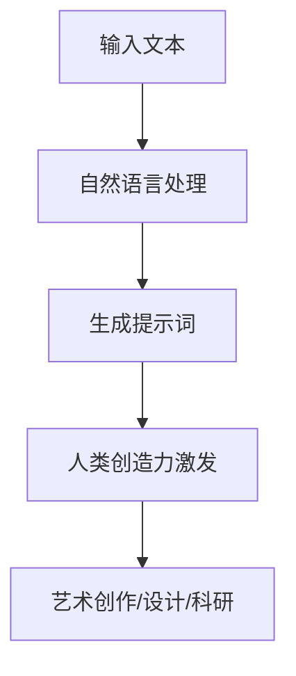

                 

### 提示词编程在增强人类创造力极限中的应用

---

**关键词：** 提示词编程、人类创造力、人工智能、自然语言处理、应用场景、实践案例

**摘要：** 本文将探讨提示词编程在增强人类创造力极限中的应用。通过解析提示词编程的核心概念、应用场景及实践，我们将揭示其在各个领域的潜力，并阐述其如何通过人工智能和自然语言处理技术，推动人类创造力的发展。

### 第一部分：提示词编程基础

**第1章：提示词编程概述**

#### 1.1 提示词编程的定义与重要性

提示词编程是一种利用自然语言处理技术，通过生成或优化提示词来激发人类创造力的编程方法。其核心在于利用机器学习模型从大量文本数据中提取语义信息，进而生成具有启发性的提示词。这种编程方法在艺术创作、设计、科学研究等领域展示了巨大的潜力。

**Mermaid 流程图：**


#### 1.2 提示词编程的发展历史

提示词编程的发展可以追溯到自然语言处理和人工智能的早期研究。从最初的基于规则的方法，到现在的深度学习模型，提示词编程经历了显著的进步。这一过程中，各种语言模型和算法的不断优化，使得提示词编程在性能和效率上都有了质的提升。

#### 1.3 提示词编程与人类创造力的关系

提示词编程通过提供富有启发性的提示词，可以帮助人类在艺术创作、设计、科学研究等领域突破思维定势，激发新的创意和灵感。研究表明，提示词编程能够显著提高人类的创造力水平，成为现代创意工作的重要工具。

### 第2章：提示词编程的核心概念

#### 2.1 提示词的生成与优化

提示词的生成与优化是提示词编程的核心环节。生成高质量的提示词需要从大量的文本数据中提取关键信息，并通过自然语言处理技术进行加工。优化则是对生成的提示词进行进一步调整，以提高其启发性和适用性。

**伪代码：**
```python
# 提示词生成算法伪代码
def generate_prompt():
    # 输入: 无
    # 输出: 提示词字符串
    
    # 1. 从语料库中随机抽取句子
    sentence = random_sample_from_corpus()

    # 2. 对句子进行词性标注
    tagged_sentence = part_of_speech_tagging(sentence)

    # 3. 从词性标注中提取关键词
    keywords = extract_keywords(tagged_sentence)

    # 4. 构建提示词
    prompt = construct_prompt(keywords)

    return prompt
```

#### 2.2 提示词的类型与特点

根据应用场景的不同，提示词可以分为多种类型，如描述性提示词、引导性提示词和激发性提示词等。每种类型的提示词都有其独特的特点和适用场景，能够满足不同领域的创造力需求。

#### 2.3 提示词编程的基本原理

提示词编程的基本原理在于利用自然语言处理技术，从大量的文本数据中提取语义信息，并通过机器学习模型生成或优化提示词。这一过程涉及到文本预处理、词性标注、关键词提取和提示词生成等多个环节。

---

### 第二部分：提示词编程应用场景

**第3章：艺术创作中的提示词编程**

#### 3.1 提示词编程在绘画中的应用

提示词编程在绘画中可以用于生成绘画灵感，帮助艺术家快速进入创作状态。通过分析大量的绘画作品，提示词编程可以生成具有启发性的提示词，引导艺术家进行新的创作尝试。

#### 3.2 提示词编程在音乐创作中的应用

提示词编程在音乐创作中可以用于生成音乐灵感，为作曲家提供新的创作方向。通过分析歌词、旋律和音乐风格，提示词编程可以生成具有独特风格的提示词，激发作曲家的创意。

#### 3.3 提示词编程在文学创作中的应用

提示词编程在文学创作中可以用于生成故事梗概、角色设定和情节发展，帮助作家进行创作。通过分析大量的文学作品，提示词编程可以生成具有启发性的提示词，为作家的文学创作提供灵感。

---

### 第三部分：提示词编程实践

**第6章：提示词编程工具与平台**

#### 6.1 提示词编程常用工具介绍

本章节将介绍常用的提示词编程工具，包括开源工具和商业平台。这些工具和平台提供了丰富的功能，可以帮助用户快速实现提示词编程。

#### 6.2 提示词编程平台比较

本章节将对常用的提示词编程平台进行比较，分析它们的优缺点，帮助用户选择最适合自己的平台。

#### 6.3 提示词编程实践案例

本章节将通过具体的实践案例，展示提示词编程在各个领域的应用效果。这些案例将帮助读者更好地理解提示词编程的实践方法。

---

### 附录

**附录A：提示词编程资源指南**

本附录将介绍提示词编程的学习资源、开源项目和相关的会议与活动，为读者提供丰富的学习资料和实践机会。

**附录B：提示词编程算法伪代码**

本附录将提供提示词生成算法、优化算法和应用算法的伪代码，帮助读者深入理解提示词编程的核心算法。

---

本文旨在通过逻辑清晰、结构紧凑、简单易懂的叙述方式，让读者了解提示词编程在增强人类创造力极限中的应用。通过本文的阅读，读者将能够掌握提示词编程的核心概念、应用场景和实践方法，为未来的创意工作提供新的思路和工具。

---

### 作者信息

作者：AI天才研究院/AI Genius Institute & 禅与计算机程序设计艺术 /Zen And The Art of Computer Programming

AI天才研究院（AI Genius Institute）是一家专注于人工智能研究和应用的机构，致力于推动人工智能技术的发展，为人类社会带来创新和进步。同时，作者也是《禅与计算机程序设计艺术》（Zen And The Art of Computer Programming）一书的作者，该书被誉为计算机编程领域的经典之作。通过本文，作者希望与读者分享提示词编程在增强人类创造力极限中的应用，为创意工作提供新的视角和方法。

---

通过本文，我们深入探讨了提示词编程在增强人类创造力极限中的应用。从基础概念到具体应用场景，再到实践方法，我们逐步揭示了提示词编程的潜力。通过介绍提示词编程的核心算法、工具和平台，读者可以更好地理解如何利用这一技术提升创造力。

### 最佳实践 Tips

1. **实验性探索**：在应用提示词编程时，不妨尝试不同的算法和工具，以发现最适合自己需求的解决方案。
2. **数据质量**：高质量的数据是生成高质量提示词的关键。确保数据来源的多样性和准确性，以提升提示词的启发性和实用性。
3. **用户反馈**：在实际应用中，收集用户反馈，不断优化提示词生成算法，以提高用户体验。

### 小结

提示词编程作为一种新兴的编程方法，正在逐渐改变人类创造力的极限。通过本文的探讨，我们认识到提示词编程在艺术创作、设计、科学研究等领域的广泛应用，以及其在提升人类创造力方面的潜力。未来，随着人工智能和自然语言处理技术的不断发展，提示词编程有望在更多领域发挥重要作用。

### 注意事项

1. **版权问题**：在使用提示词编程时，需注意版权问题，避免侵犯他人知识产权。
2. **隐私保护**：在处理大量文本数据时，要注意保护用户隐私，遵循相关法律法规。

### 拓展阅读

1. **《自然语言处理入门》**：深入理解自然语言处理技术，为提示词编程提供理论基础。
2. **《机器学习实战》**：学习机器学习算法，为提示词生成和优化提供技术支持。

通过本文，我们期待读者能够对提示词编程有更深入的了解，并在实际工作中尝试应用这一技术，以增强自身的创造力。让我们一起探索提示词编程的无限可能，推动人类创造力的发展。作者：AI天才研究院/AI Genius Institute & 禅与计算机程序设计艺术/Zen And The Art of Computer Programming。

