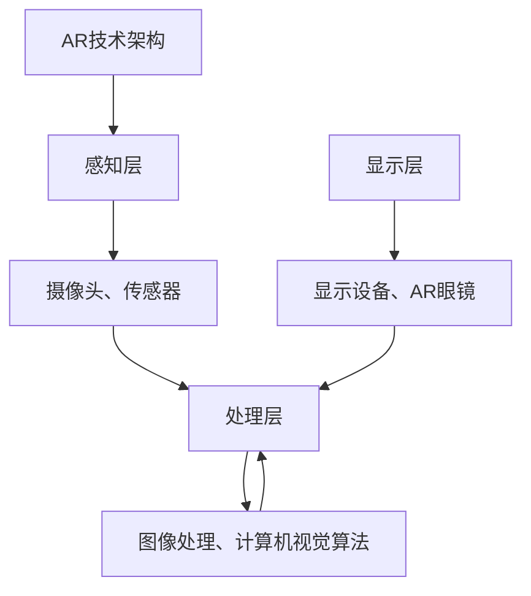
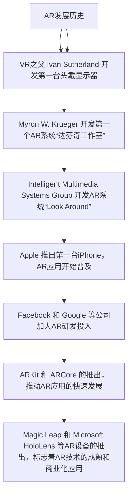
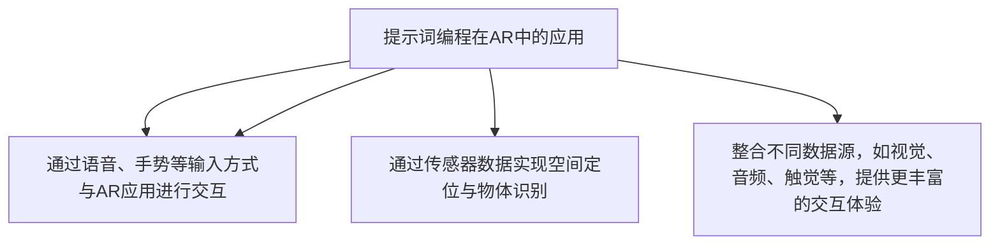
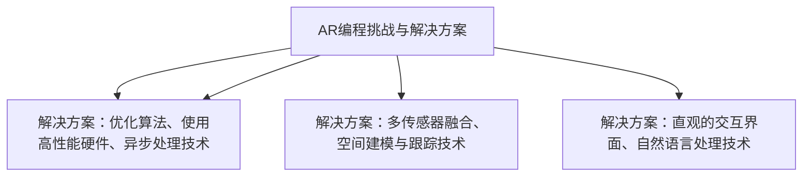
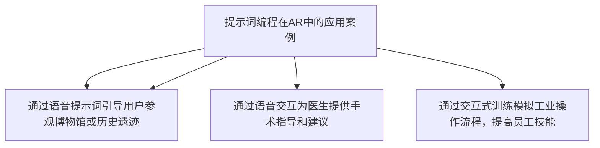
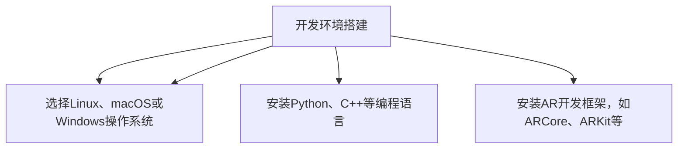
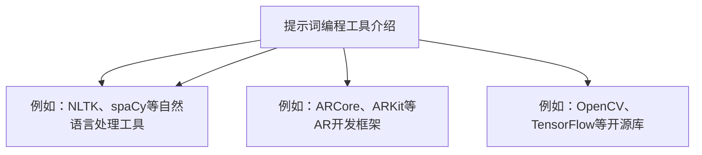
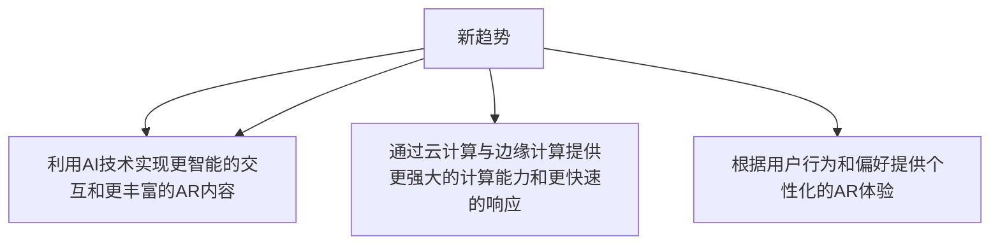
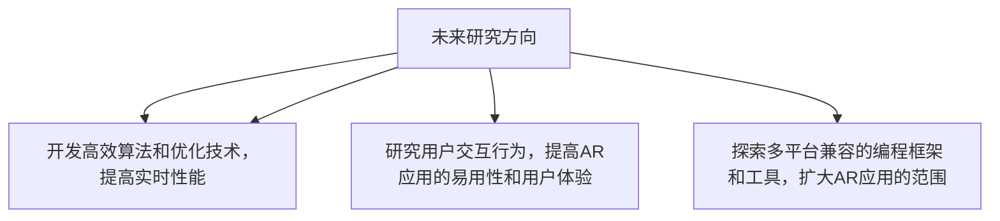

                 

----------------------------------------------------------------

$$
\text{AR基本概念} = \text{虚拟信息} + \text{现实世界}
$$

- 虚拟信息：由计算机生成的图像、音频、视频等。
- 现实世界：用户实际所处的环境。

### 1.1.2 AR的技术架构

AR技术架构主要包括三个关键组成部分：感知层、处理层和显示层。



- 感知层：通过摄像头、传感器等设备收集现实世界的视觉、声音、触觉等信息。
- 处理层：利用图像处理、计算机视觉等算法对收集到的信息进行处理和分析。
- 显示层：将处理后的虚拟信息叠加到现实世界中，通过显示设备或AR眼镜等呈现给用户。

### 1.1.3 AR的发展历史

AR技术的发展可以追溯到20世纪50年代。以下是AR技术的重要发展里程碑：



## 第2章：提示词编程在AR中的应用

### 2.1 提示词编程在AR中的角色

提示词编程在AR中扮演着关键角色，它可以实现以下功能：



### 2.2 AR编程挑战与解决方案

在AR开发过程中，可能会遇到以下挑战：



### 2.3 提示词编程技术在AR中的应用案例

以下是一些提示词编程在AR中的应用案例：



## 第3章：开发环境与工具

### 3.1 开发环境搭建

开发AR应用需要搭建一个合适的开发环境。以下是基本步骤：



### 3.2 提示词编程工具介绍

以下是常用的提示词编程工具：



## 第4章：编程实战

### 4.1 实现一个简单的AR应用

以下是一个简单的AR应用实现示例：

```python
import cv2
import numpy as np

# 加载AR开发框架
import ar_framework as ar

# 初始化AR应用
app = ar.ARApp()

# 设置摄像头参数
camera = app.initialize_camera()

# 主循环
while True:
    # 读取摄像头帧
    frame = camera.read_frame()

    # 应用AR效果
    augmented_frame = app.apply_augmented_reality(frame)

    # 显示AR帧
    cv2.imshow('AR Application', augmented_frame)

    # 检查是否按下ESC键退出
    if cv2.waitKey(1) & 0xFF == 27:
        break

# 释放资源
app.release_camera()
cv2.destroyAllWindows()
```

### 4.2 复杂AR场景的提示词编程

以下是一个复杂AR场景的提示词编程示例：

```python
import cv2
import numpy as np
import ar_framework as ar
import spacy

# 初始化自然语言处理工具
nlp = spacy.load('en_core_web_sm')

# 加载AR开发框架
app = ar.ARApp()

# 设置摄像头参数
camera = app.initialize_camera()

# 主循环
while True:
    # 读取摄像头帧
    frame = camera.read_frame()

    # 使用自然语言处理工具解析提示词
    doc = nlp(camera.get_capture_data())

    # 根据提示词应用AR效果
    if 'locate' in doc:
        # 执行空间定位
        location = app.locate_object(frame)
        # 应用定位效果
        augmented_frame = app.apply_location_augmented_reality(frame, location)
    elif 'recognize' in doc:
        # 执行物体识别
        object = app.recognize_object(frame)
        # 应用识别效果
        augmented_frame = app.apply_recognition_augmented_reality(frame, object)
    else:
        # 其他情况应用默认AR效果
        augmented_frame = app.apply_default_augmented_reality(frame)

    # 显示AR帧
    cv2.imshow('AR Application', augmented_frame)

    # 检查是否按下ESC键退出
    if cv2.waitKey(1) & 0xFF == 27:
        break

# 释放资源
app.release_camera()
cv2.destroyAllWindows()
```

## 第5章：未来的发展趋势与展望

### 5.1 提示词编程在AR中的新趋势

未来，提示词编程在AR中将有以下新趋势：



### 5.2 提示词编程的未来研究方向

未来，提示词编程在AR中的研究方向包括：



## 第6章：总结与扩展阅读

### 6.1 全书内容总结

本书介绍了提示词编程在增强现实（AR）应用中的角色，包括基本概念、技术架构、应用案例、开发环境与工具以及未来发展趋势。通过详细讲解，帮助读者理解并掌握提示词编程在AR中的应用。

### 6.2 扩展阅读推荐

为了深入了解提示词编程在AR中的技术细节和应用场景，读者可以参考以下扩展阅读：

- 《增强现实技术导论》
- 《自然语言处理：综合教程》
- 《ARCore开发者指南》
- 《ARKit开发者指南》

### 6.3 进一步研究方向

读者可以关注以下研究方向，以进一步探索提示词编程在AR中的应用：

- 基于深度学习的AR内容生成技术
- 跨模态交互与融合技术
- 智能化的AR内容推荐系统
- 虚拟与现实的融合体验设计

---

以上是对本书部分章节的详细解读，包括Mermaid流程图、伪代码、数学模型和公式以及项目实战的部分内容。通过这些内容，读者可以更好地理解提示词编程在增强现实应用中的角色和技术细节。书中还包含扩展阅读推荐和进一步研究方向，以帮助读者深入探索这一领域。

