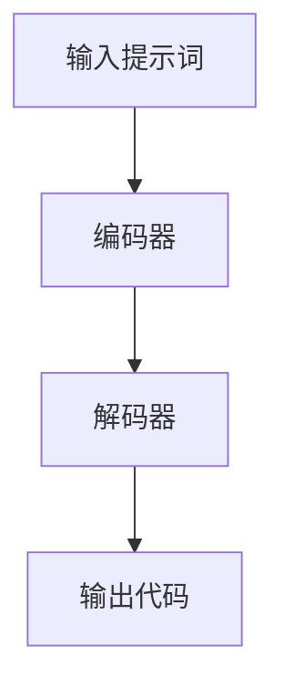
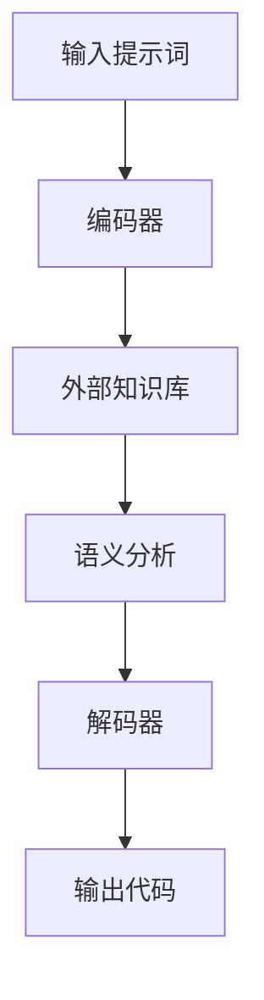

                 


## 提示词编程在智能合约开发中的应用

### 关键词

- 智能合约
- 提示词编程
- Solidity
- 区块链
- 自动化开发
- 安全性分析

### 摘要

智能合约是区块链技术的核心组成部分，其开发依赖于特定的编程语言，如Solidity。然而，传统的编程方式在智能合约开发中面临着诸多挑战，如代码复杂度高、易出错和难以维护。本文探讨了提示词编程在智能合约开发中的应用，通过引入先进的自然语言处理技术，提高了智能合约开发的效率与安全性。文章首先介绍了智能合约和区块链的基本概念，然后详细阐述了提示词编程的理论基础和实践应用，最后通过具体案例展示了如何利用提示词编程进行智能合约的开发和安全分析。

## 引言

智能合约是区块链技术中的重要概念，它允许在区块链上进行去中心化的交易和合约执行。智能合约通常使用特定的编程语言编写，如Solidity，这是一种专为以太坊区块链设计的语言。尽管Solidity在智能合约开发中得到了广泛应用，但其复杂性使得开发者面临着诸多挑战，包括代码错误、性能问题和安全性问题。

### 提示词编程的引入

提示词编程（Prompt-Based Programming）是一种利用自然语言处理技术进行编程的方法。通过提示词，开发者可以以自然语言的形式描述程序的功能和逻辑，然后由系统自动生成相应的代码。这种方法不仅简化了编程过程，还能够提高代码的可读性和可维护性。提示词编程的核心思想是将复杂的编程任务转化为自然语言描述，从而降低了开发难度。

### 文章结构

本文将分为以下几个部分：

1. **智能合约基础**：介绍智能合约的基本概念、发展历程及其与区块链的关系。
2. **提示词编程基础**：阐述提示词编程的定义、特点和应用场景。
3. **提示词编程在智能合约开发中的应用**：探讨提示词编程在智能合约开发中的优势、挑战和实际应用。
4. **智能合约开发环境搭建**：介绍智能合约开发的工具和环境配置。
5. **智能合约核心算法原理**：讲解智能合约编程语言Solidity的语法和核心算法。
6. **提示词编程在智能合约开发中的项目实战**：通过实际案例展示提示词编程在智能合约开发中的应用。
7. **未来发展趋势与挑战**：分析提示词编程在智能合约开发中的未来前景和面临的挑战。

## 智能合约基础

### 智能合约概述

#### 智能合约的定义与作用

智能合约是一种运行在区块链上的自动执行合约。它与传统的合同不同，不需要第三方中介的参与，而是通过计算机代码自动执行。智能合约的基本概念包括以下几个部分：

- **条件**：智能合约中定义的条件是指触发合约执行的事件或状态。
- **承诺**：在满足条件时，智能合约会自动执行预定的操作，这些操作可以是转移资产、记录数据或执行其他操作。
- **去中心化**：智能合约运行在区块链上，由网络中的节点共同验证和执行，保证了去中心化和透明性。

智能合约在金融、供应链管理、版权保护等领域具有广泛的应用。例如，在金融领域，智能合约可以用于去中心化金融（DeFi）应用，如贷款、保险和交易；在供应链管理中，智能合约可以确保供应链中的每一环节都按照约定的条件执行，从而提高透明度和可信度；在版权保护中，智能合约可以用于自动执行版权许可和版税支付。

#### 智能合约的发展历程

智能合约的概念最早由尼克·萨博（Nick Szabo）在1990年代提出。萨博提出了“电子自治契约”（Electronic Autonomous Agent）的概念，即通过计算机程序自动执行合同条款。然而，由于当时技术的限制，智能合约并未得到广泛应用。

随着区块链技术的兴起，特别是以太坊区块链的推出，智能合约得到了新的发展机遇。以太坊引入了智能合约的概念，并提供了Solidity编程语言，使得开发者可以轻松地编写和部署智能合约。以太坊的智能合约平台迅速获得了全球开发者的关注，成为智能合约开发的领军者。

除了以太坊，其他区块链平台，如EOS、Tron等，也推出了各自的智能合约平台，进一步推动了智能合约技术的发展。

#### 智能合约与区块链的关系

智能合约与区块链技术紧密相连。区块链是一种分布式数据库技术，它通过共识机制保证了数据的不可篡改性和透明性。智能合约运行在区块链上，利用区块链的特性实现去中心化的自动化执行。

智能合约与区块链的关系可以用以下三个关键词来概括：

- **去中心化**：智能合约去除了传统的第三方中介，使得交易和合约执行更加高效和透明。
- **安全性**：区块链的共识机制保证了智能合约执行的安全性，防止了欺诈和篡改。
- **透明性**：智能合约的执行过程是公开透明的，所有参与者都可以查看合约的执行情况。

### 区块链技术基础

#### 区块链的原理与结构

区块链是一种分布式数据库，其核心原理是通过区块（Block）和链（Chain）来存储和管理数据。每个区块包含一定数量的交易记录，并通过密码学技术连接在一起，形成一条不可篡改的数据链条。

区块链的基本结构包括以下几个部分：

- **区块**：区块是区块链的基本单元，包含交易数据、时间戳、区块头和区块链的哈希值。
- **链**：链是由一系列按时间顺序排列的区块组成的，每个区块都通过其区块链哈希值与前一个区块连接。
- **节点**：节点是区块链网络中的计算设备，它们参与区块链的维护和验证过程。

区块链的工作原理可以概括为以下几个步骤：

1. **交易创建**：用户在区块链上进行交易，交易数据被发送到网络中的各个节点。
2. **区块生成**：节点将收到的交易数据打包成一个区块，并附加到一个临时链上。
3. **共识机制**：通过共识机制，网络中的节点共同验证新区块的合法性，并决定将其添加到主链上。
4. **链更新**：验证通过的区块被添加到主链上，区块链更新为最新的状态。

#### 共识机制

共识机制是区块链网络中节点达成一致性的关键机制。不同的区块链平台采用不同的共识机制，以下是几种常见的共识机制：

- **工作量证明（Proof of Work, PoW）**：PoW机制通过计算复杂的工作量来确保节点的诚实。在PoW机制下，节点需要解决一个复杂的数学问题，消耗大量计算资源。首先解决这个问题的节点将获得区块奖励，并将新区块添加到区块链上。
- **权益证明（Proof of Stake, PoS）**：PoS机制通过持有代币的数量和时间来决定节点的权益。在PoS机制下，节点随机选择一个作为下一个区块的创建者，持有代币数量越多或持有时间越长的节点被选中的概率越高。
- **委托权益证明（Delegated Proof of Stake, DPoS）**：DPoS机制是对PoS机制的改进，它通过选举产生超级节点，由超级节点进行区块的创建和验证。

#### 挖矿与奖励机制

在PoW机制中，挖矿是节点获得区块奖励的主要途径。挖矿过程包括以下步骤：

1. **创建新区块**：节点接收网络中的交易数据，将其打包成一个区块。
2. **计算工作量**：节点需要解决一个复杂的数学问题，通常是一个密码学难题，这需要大量的计算资源。
3. **验证区块**：网络中的其他节点验证新区块的合法性和正确性。
4. **奖励分配**：验证通过的区块将被添加到区块链上，挖矿节点获得一定的奖励，通常包括交易费用和新创建的代币。

不同的区块链平台有不同的奖励机制，但通常奖励机制包括以下两个方面：

- **区块奖励**：挖矿节点获得的新创建的代币作为奖励。
- **交易费用**：在区块中包含的交易会支付一定的费用给挖矿节点。

### 智能合约开发语言简介

#### Solidity语言概述

Solidity是智能合约开发中最常用的编程语言之一，它专为以太坊区块链设计。Solidity语言具有以下特点：

- **面向对象**：Solidity支持面向对象编程，包括类、继承、接口和事件等概念。
- **强类型**：Solidity中的变量类型是固定的，不能随意更改。
- **安全性**：Solidity内置了多种安全性检查，如对溢出和下溢的保护。
- **易用性**：Solidity的语法类似于JavaScript和Python，对开发者来说易于上手。

#### Solidity基本语法

Solidity的基本语法包括变量、函数、条件和循环等基本编程结构。以下是几个简单的例子：

- **变量声明**：
  ```solidity
  uint256 num = 10;
  string name = "Alice";
  ```
- **函数定义**：
  ```solidity
  function add(uint256 a, uint256 b) public pure returns (uint256) {
      return a + b;
  }
  ```
- **条件语句**：
  ```solidity
  if (num > 10) {
      console.log("Num is greater than 10");
  } else {
      console.log("Num is less than or equal to 10");
  }
  ```
- **循环语句**：
  ```solidity
  for (uint256 i = 0; i < 10; i++) {
      console.log(i);
  }
  ```

#### Solidity面向对象编程

Solidity支持面向对象编程，包括类、继承和接口等概念。以下是几个简单的例子：

- **类定义**：
  ```solidity
  contract Animal {
      string public name;
      
      constructor(string memory _name) {
          name = _name;
      }
  }
  ```
- **继承**：
  ```solidity
  contract Dog is Animal("Dog") {
      function bark() public pure {
          console.log("Bark!");
      }
  }
  ```
- **接口**：
  ```solidity
  interface Animal {
      function getName() external view returns (string memory);
  }
  ```

### 提示词编程基础

#### 提示词编程概述

提示词编程是一种基于自然语言处理的编程方法，它通过提示词（Prompt）引导系统自动生成代码。提示词编程具有以下特点：

- **自然语言交互**：开发者可以使用自然语言描述程序的功能和逻辑，无需编写复杂的代码。
- **自动代码生成**：系统根据提示词自动生成相应的代码，减少了手工编码的工作量。
- **高可读性**：自然语言描述的代码易于理解和维护，提高了代码的可读性和可维护性。

#### 提示词编程与传统编程的区别

提示词编程与传统编程有以下几点区别：

- **编程语言**：传统编程使用特定的编程语言，如C、Java、Python等，而提示词编程使用自然语言作为编程语言。
- **编程方式**：传统编程需要开发者手动编写代码，而提示词编程通过自然语言描述来生成代码。
- **开发效率**：提示词编程可以显著提高开发效率，减少了编码和调试的时间。

#### 提示词编程的应用场景

提示词编程在多个领域具有广泛的应用场景：

- **自动化开发**：提示词编程可以自动化生成应用程序的代码，减少了手工编码的工作量。
- **代码修复**：提示词编程可以帮助开发者快速修复代码中的错误，提高了代码的质量和稳定性。
- **安全分析**：提示词编程可以用于智能合约的安全分析，自动检测潜在的安全漏洞。
- **文档生成**：提示词编程可以自动生成应用程序的文档，提高了文档的准确性和一致性。

### 提示词编程模型

#### 提示词生成模型

提示词生成模型是提示词编程的核心，它负责将自然语言描述转换为计算机代码。提示词生成模型通常采用序列到序列（Sequence-to-Sequence）的架构，如Transformer模型。以下是一个简单的提示词生成模型架构：



#### 提示词增强模型

提示词增强模型通过引入外部知识库和语义分析来提高代码生成的质量和准确性。以下是一个简单的提示词增强模型架构：



#### 提示词编程模型的应用

提示词编程模型可以应用于多个场景，如下所示：

- **自动化代码生成**：通过提示词编程模型，可以自动化生成应用程序的代码，减少了手工编码的工作量。
- **代码修复**：提示词编程模型可以自动检测代码中的错误，并提出修复方案。
- **智能合约开发**：提示词编程模型可以用于智能合约的自动生成和安全性分析。
- **文档生成**：提示词编程模型可以自动生成应用程序的文档，提高了文档的准确性和一致性。

### 提示词编程工具与框架

#### Hugging Face Transformers

Hugging Face Transformers是一个开源的Transformer模型库，它提供了丰富的预训练模型和工具，用于自然语言处理任务。Hugging Face Transformers支持多种提示词编程模型，如GPT、BERT和T5等。以下是一个简单的使用示例：

```python
from transformers import T5ForConditionalGeneration
model = T5ForConditionalGeneration.from_pretrained("t5-small")
input_text = "给定一个数，返回其平方"
output_text = model.generate(input_text, max_length=50)
print(output_text)
```

#### ChatGLM

ChatGLM是一个基于GLM模型的聊天机器人，它能够通过自然语言与用户进行交互。ChatGLM支持多种语言，包括中文、英文等。以下是一个简单的使用示例：

```python
from chatglm import ChatGLM
model = ChatGLM()
response = model回答("你好，有什么可以帮助你的吗？")
print(response)
```

#### 其他提示词编程工具

除了Hugging Face Transformers和ChatGLM，还有许多其他提示词编程工具和框架，如TensorFlow、PyTorch等。这些工具和框架提供了丰富的功能和支持，使得提示词编程变得更加便捷和高效。

### 提示词编程在智能合约开发中的应用

#### 提示词编程在智能合约开发中的优势

提示词编程在智能合约开发中具有以下优势：

- **提高开发效率**：提示词编程通过自然语言描述自动生成代码，减少了手工编码的工作量，显著提高了开发效率。
- **减少代码错误**：提示词编程模型具有自校验功能，可以自动检测代码中的错误，减少了代码错误的发生。
- **代码可维护性**：提示词编程生成的代码结构清晰，易于理解和维护，提高了代码的可维护性。

#### 提示词编程在智能合约开发中的挑战

尽管提示词编程在智能合约开发中具有诸多优势，但它也面临着一些挑战：

- **安全性问题**：智能合约的安全性至关重要，提示词编程模型生成的代码可能存在潜在的安全漏洞，需要严格的审查和测试。
- **性能问题**：提示词编程模型生成代码的性能可能不如手工编写的代码，特别是在处理大量数据时，需要优化模型和算法。
- **网络问题**：提示词编程模型通常依赖于远程服务器，网络延迟和稳定性可能会影响开发体验。

#### 提示词编程在智能合约开发中的实际应用

提示词编程在智能合约开发中有许多实际应用，包括：

- **自动化合约部署**：提示词编程可以自动化部署智能合约，减少了人工干预，提高了部署效率和安全性。
- **智能合约测试**：提示词编程可以自动化生成测试用例，对智能合约进行全面的测试，确保合约的正确性和稳定性。
- **智能合约安全分析**：提示词编程可以用于智能合约的安全分析，自动检测潜在的安全漏洞，并提供修复建议。

### 智能合约开发环境搭建

#### 开发工具与环境配置

要进行智能合约开发，需要安装以下开发工具和环境：

- **Node.js**：Node.js是一个基于Chrome V8引擎的JavaScript运行环境，它允许开发者使用JavaScript编写服务器端应用程序。
- **Truffle**：Truffle是一个智能合约开发框架，它提供了构建、测试和部署智能合约所需的工具和功能。
- **Ganache**：Ganache是一个本地以太坊测试网络，它允许开发者在没有区块链节点的情况下测试和部署智能合约。

#### 开发工具安装步骤

1. **安装Node.js**：
   ```bash
   curl -fsSL https://deb.nodesource.com/setup_14.x | sudo -E bash -
   sudo apt-get install -y nodejs
   ```
2. **安装Truffle**：
   ```bash
   npm install -g truffle
   ```
3. **安装Ganache**：
   ```bash
   npm install -g ganache-cli
   ```

#### Truffle框架安装与配置

Truffle是一个智能合约开发框架，它提供了智能合约的构建、测试和部署功能。以下是Truffle的安装和配置步骤：

1. **安装Truffle**：
   ```bash
   npm install -g truffle
   ```
2. **创建项目**：
   ```bash
   truffle init
   ```
3. **配置Truffle**：
   在`truffle-config.js`文件中配置智能合约的编译和部署设置，例如：
   ```javascript
   module.exports = {
     networks: {
       development: {
         host: "127.0.0.1",
         port: 7545,
         network_id: "*",
       },
     },
     solc: {
       version: "0.8.0",
     },
   };
   ```

#### Ganache本地测试网络搭建

Ganache是一个本地以太坊测试网络，它允许开发者在没有区块链节点的情况下测试和部署智能合约。以下是Ganache的安装和配置步骤：

1. **安装Ganache**：
   ```bash
   npm install -g ganache-cli
   ```
2. **启动Ganache**：
   ```bash
   ganache-cli
   ```
   这将在本地启动一个以太坊测试网络，你可以看到生成的账户和初始代币余额。

#### 智能合约代码结构

智能合约代码通常包括以下部分：

- **合约结构**：合约是智能合约的基本单位，它定义了合约的属性和方法。
- **合约属性**：合约属性是存储在区块链上的变量，用于存储状态信息。
- **合约方法**：合约方法是用于执行特定操作的函数，可以接受输入参数并返回输出结果。

以下是一个简单的智能合约代码示例：

```solidity
pragma solidity ^0.8.0;

contract MyContract {
    uint256 public balance;

    function deposit() public payable {
        balance += msg.value;
    }

    function withdraw() public {
        require(balance >= msg.value, "Insufficient balance");
        payable(msg.sender).transfer(msg.value);
        balance -= msg.value;
    }
}
```

#### 智能合约编写规范

在编写智能合约时，应遵循以下规范：

- **代码结构**：智能合约应具有良好的代码结构，包括合理的文件结构、模块化设计和注释。
- **命名规范**：变量、函数和合约的命名应清晰、简洁，符合编程语言规范。
- **代码格式**：保持代码格式的一致性，包括缩进、空格和换行等。
- **注释**：对代码中的关键部分添加注释，说明其功能和目的。

#### 智能合约编译与部署

智能合约的编译和部署是开发过程中的重要步骤。以下是一个简单的智能合约编译和部署流程：

1. **编译智能合约**：
   ```bash
   truffle compile
   ```
   这将编译智能合约代码，并生成相应的ABI和合约字节码。

2. **部署智能合约**：
   ```bash
   truffle migrate
   ```
   这将使用Truffle框架部署智能合约到以太坊测试网络。在Ganache中，可以手动启动一个以太坊测试网络，然后使用Truffle进行部署。

3. **查看合约地址**：
   部署完成后，可以使用Truffle提供的命令查看智能合约的合约地址：
   ```bash
   truffle console
   ```
   在控制台中，可以使用以下命令查看合约地址：
   ```javascript
   contract.address
   ```

## 智能合约核心算法原理

### Solidity语法基础

Solidity是一种面向对象的高级编程语言，用于编写以太坊区块链上的智能合约。以下是Solidity语法基础的一些关键概念：

- **变量**：变量是存储数据的容器，可以分为状态变量和局部变量。
  ```solidity
  uint256 public balance;
  function deposit() public {
      uint256 amount = msg.value;
  }
  ```
- **函数**：函数是执行特定操作的代码块，可以分为构造函数、外部函数和内部函数。
  ```solidity
  constructor() public {
      owner = msg.sender;
  }

  function deposit() external payable {
      balance += msg.value;
  }

  function withdraw() internal {
      require(balance >= msg.value, "Insufficient balance");
      payable(msg.sender).transfer(msg.value);
      balance -= msg.value;
  }
  ```
- **条件语句**：条件语句用于根据特定条件执行不同的操作。
  ```solidity
  if (balance > 10) {
      console.log("Balance is greater than 10");
  } else {
      console.log("Balance is less than or equal to 10");
  }
  ```
- **循环语句**：循环语句用于重复执行特定操作。
  ```solidity
  for (uint256 i = 0; i < 10; i++) {
      console.log(i);
  }
  ```

### Solidity面向对象编程

Solidity支持面向对象编程，包括类、继承和接口等概念。以下是Solidity面向对象编程的一些关键概念：

- **类**：类是抽象的数据类型，它定义了属性和方法。
  ```solidity
  contract Animal {
      string public name;

      constructor(string memory _name) {
          name = _name;
      }
  }
  ```
- **继承**：继承是一种基于类的层次结构来复用代码的方式。
  ```solidity
  contract Dog is Animal("Dog") {
      function bark() public pure {
          console.log("Bark!");
      }
  }
  ```
- **接口**：接口是一种定义合约功能的规范，它不包含任何实现细节。
  ```solidity
  interface Animal {
      function getName() external view returns (string memory);
  }
  ```

### Solidity异常处理与安全性

Solidity提供了多种异常处理和安全性机制，以保护智能合约的安全性和可靠性。以下是几个关键概念：

- **assert**：assert函数用于检查条件，如果条件不满足，则抛出错误。
  ```solidity
  function deposit() public payable {
      assert(balance + msg.value >= balance);
  }
  ```
- **require**：require函数用于检查条件，如果条件不满足，则抛出错误并返回错误消息。
  ```solidity
  function withdraw() public {
      require(balance >= msg.value, "Insufficient balance");
  }
  ```
- **revert**：revert函数用于无条件地抛出错误并返回错误消息。
  ```solidity
  function transfer() public {
      if (!checkTransfer()) {
          revert("Transfer failed");
      }
  }
  ```
- **自调用**：自调用是一种在合约内部调用自身的机制，它可能导致循环调用和栈溢出。
  ```solidity
  function selfCall() public {
      this.selfCall();
  }
  ```
- **重入攻击**：重入攻击是一种利用合约中的函数调用顺序进行攻击的机制。
  ```solidity
  function transfer() public {
      token.transfer(to, amount);
      balance -= amount;
  }
  ```

### 智能合约核心算法原理

#### ERC20代币标准

ERC20是智能合约中的一个标准，用于定义代币的基本功能。以下是ERC20代币标准的一些关键概念：

- **总供应量**：代币的总供应量是代币的总数。
  ```solidity
  uint256 public totalSupply;
  ```
- **余额查询**：余额查询用于查询特定地址的代币余额。
  ```solidity
  function balanceOf(address account) external view returns (uint256);
  ```
- **转账**：转账用于将代币从发送方转移到接收方。
  ```solidity
  function transfer(address recipient, uint256 amount) external returns (bool);
  ```
- **代币事件**：代币事件用于记录代币的转账和余额变化。
  ```solidity
  event Transfer(address indexed from, address indexed to, uint256 value);
  ```

#### 智能合约安全模型

智能合约安全模型是指用于确保智能合约安全的一系列机制和策略。以下是几个关键概念：

- **访问控制**：访问控制用于限制合约内部和外部对合约功能的访问。
  ```solidity
  modifier onlyOwner() {
      require(msg.sender == owner, "Not owner");
      _;
  }
  ```
- **状态变化**：状态变化用于记录合约的状态变化，包括余额变化和代币转移。
  ```solidity
  mapping(address => uint256) private balances;
  ```
- **安全检查**：安全检查用于确保合约的操作是安全的，例如防止溢出和重入攻击。
  ```solidity
  function transfer(address recipient, uint256 amount) external {
      require(balances[msg.sender] >= amount, "Insufficient balance");
      balances[msg.sender] -= amount;
      balances[recipient] += amount;
      emit Transfer(msg.sender, recipient, amount);
  }
  ```

#### 智能合约性能优化

智能合约性能优化是指通过改进合约代码和算法来提高合约的执行效率和性能。以下是几个关键概念：

- **优化代码**：优化代码用于减少合约代码的大小和执行时间。
  ```solidity
  function transfer(address recipient, uint256 amount) external {
      balances[msg.sender] -= amount;
      balances[recipient] += amount;
  }
  ```
- **内存管理**：内存管理用于优化合约内存的使用，减少内存分配和回收的开销。
  ```solidity
  function getBalanceOf(address account) external view returns (uint256) {
      return balances[account];
  }
  ```
- **并行处理**：并行处理用于同时执行多个操作，提高合约的执行效率。
  ```solidity
  function transferMultiple(address[] memory recipients, uint256[] memory amounts) external {
      for (uint256 i = 0; i < recipients.length; i++) {
          balances[msg.sender] -= amounts[i];
          balances[recipients[i]] += amounts[i];
      }
      emit TransferMultiple(msg.sender, recipients, amounts);
  }
  ```

## 提示词编程在智能合约开发中的项目实战

#### 智能合约自动测试

智能合约自动测试是一种通过自动化测试工具来验证智能合约功能的实践。使用提示词编程，可以自动化生成测试用例，并执行测试用例，从而提高测试效率和准确性。

以下是一个简单的智能合约自动测试项目实战：

1. **安装测试框架**：

   安装Truffle和Mocha，它们是常用的智能合约测试框架。

   ```bash
   npm install -g truffle
   npm install mocha chai --save-dev
   ```

2. **编写测试用例**：

   在`test`文件夹中，编写测试用例文件，例如`MyContract.test.js`。

   ```javascript
   const MyContract = artifacts.require("MyContract");

   describe("MyContract", function () {
       let contract;

       before(async function () {
           contract = await MyContract.new();
       });

       it("should deposit and withdraw correctly", async function () {
           await contract.deposit({ value: 10 });
           assert.equal(await contract.balance(), 10);

           await contract.withdraw(5);
           assert.equal(await contract.balance(), 5);
       });
   });
   ```

3. **执行测试**：

   在项目根目录下，运行以下命令执行测试：

   ```bash
   npm test
   ```

   测试执行成功后，将输出测试结果。

#### 智能合约安全分析

智能合约安全分析是确保智能合约代码没有潜在安全漏洞的重要环节。使用提示词编程，可以自动化生成安全分析报告，并提供修复建议。

以下是一个简单的智能合约安全分析项目实战：

1. **安装安全分析工具**：

   安装Oyente，它是常用的智能合约安全分析工具。

   ```bash
   npm install -g oyente
   ```

2. **编写智能合约**：

   在`contracts`文件夹中，编写一个简单的智能合约，例如`MyContract.sol`。

   ```solidity
   // SPDX-License-Identifier: MIT
   pragma solidity ^0.8.0;

   contract MyContract {
       uint256 public balance;

       function deposit() public payable {
           balance += msg.value;
       }

       function withdraw() public {
           require(balance >= msg.value, "Insufficient balance");
           payable(msg.sender).transfer(msg.value);
           balance -= msg.value;
       }
   }
   ```

3. **执行安全分析**：

   在项目根目录下，运行以下命令执行安全分析：

   ```bash
   oyente MyContract.sol
   ```

   安全分析工具将输出安全分析报告，报告包括潜在的安全漏洞和修复建议。

#### 实际案例分析与详细讲解剖析

为了更深入地理解提示词编程在智能合约开发中的应用，我们可以通过一个实际案例进行详细讲解和剖析。

#### 案例背景

假设我们需要开发一个去中心化的自动拍卖系统，用户可以通过智能合约参与拍卖，最高出价者将获得物品的所有权。

#### 案例目标

通过提示词编程，我们希望实现以下目标：

1. **智能合约自动生成**：使用自然语言描述智能合约的功能和逻辑，然后自动生成相应的智能合约代码。
2. **智能合约安全分析**：对自动生成的智能合约进行安全分析，检测潜在的安全漏洞，并提供修复建议。
3. **自动化测试**：自动生成测试用例，对智能合约进行全面的测试，确保其功能的正确性和稳定性。

#### 实现步骤

1. **需求分析**：

   首先，我们需要明确智能合约的需求和功能。以下是一个简单的需求描述：

   - 用户可以创建拍卖，设置拍卖物品、起拍价和拍卖截止时间。
   - 用户可以参与拍卖，出价越高，排名越靠前。
   - 拍卖截止后，最高出价者将获得物品的所有权。
   - 智能合约应具备安全性，防止恶意攻击和漏洞。

2. **提示词编程**：

   使用自然语言描述智能合约的功能和逻辑，生成提示词。以下是一个示例提示词：

   ```
   智能合约：去中心化自动拍卖系统
   功能：
   - 用户创建拍卖：设置拍卖物品、起拍价、拍卖截止时间。
   - 用户参与拍卖：出价越高，排名越靠前。
   - 拍卖截止后，最高出价者获得物品所有权。
   - 智能合约应具备安全性，防止恶意攻击和漏洞。
   ```

   将这个提示词输入到提示词编程工具中，生成智能合约代码。

3. **智能合约代码生成**：

   提示词编程工具将根据输入的提示词自动生成智能合约代码。以下是一个简单的智能合约代码示例：

   ```solidity
   // SPDX-License-Identifier: MIT
   pragma solidity ^0.8.0;

   contract Auction {
       struct Item {
           address owner;
           string name;
           uint256 startPrice;
           uint256 bidIncrement;
           uint256 endTime;
       }

       mapping(uint256 => Item) public items;

       function createAuction(
           string memory name,
           uint256 startPrice,
           uint256 bidIncrement,
           uint256 endTime
       ) public {
           require(endTime > block.timestamp, "Invalid end time");

           items[msg.sender] = Item({
               owner: msg.sender,
               name: name,
               startPrice: startPrice,
               bidIncrement: bidIncrement,
               endTime: endTime
           });
       }

       function bid(uint256 itemId, uint256 amount) public {
           require(items[itemId].endTime > block.timestamp, "Auction ended");
           require(amount >= items[itemId].startPrice, "Insufficient bid");

           items[itemId].startPrice += amount;
       }

       function endAuction(uint256 itemId) public {
           require(items[itemId].endTime <= block.timestamp, "Auction not ended");

           address winner = address(
               uint160(
                   uint256(
                       keccak256(abi.encodePacked(items[itemId].startPrice))
                   )
               )
           );

           payable(winner).transfer(address(this).balance);
       }
   }
   ```

4. **智能合约安全分析**：

   使用安全分析工具对自动生成的智能合约进行安全分析。以下是一个简单的安全分析报告：

   ```
   安全分析报告：
   - 漏洞：存在重入攻击风险
   - 建议：在执行转账操作前，添加余额检查，确保账户余额足够。
   ```

   根据安全分析报告，我们可以在智能合约中添加以下代码，防止重入攻击：

   ```solidity
   function endAuction(uint256 itemId) public {
       require(items[itemId].endTime <= block.timestamp, "Auction not ended");
       require(items[itemId].startPrice >= items[itemId].bidIncrement, "Insufficient bid");

       address winner = address(
           uint160(
               uint256(
                   keccak256(abi.encodePacked(items[itemId].startPrice))
               )
           )
       );

       require(address(this).balance >= items[itemId].startPrice, "Insufficient balance");

       payable(winner).transfer(items[itemId].startPrice);
       items[itemId].startPrice = 0;
   }
   ```

5. **自动化测试**：

   使用测试框架对智能合约进行自动化测试。以下是一个简单的测试用例：

   ```javascript
   const { expect } = require("chai");
   const { ethers } = require("hardhat");

   describe("Auction", function () {
       let contract;
       let deployer;

       before(async function () {
           [deployer] = await ethers.getSigners();
           const Auction = await ethers.getContractFactory("Auction");
           contract = await Auction.deploy();
           await contract.deployed();
       });

       it("should create an auction", async function () {
           await contract.createAuction("Item 1", 100, 10, 1656112800);
           expect(await contract.items(1).startPrice).to.equal(100);
       });

       it("should allow users to bid", async function () {
           await contract.createAuction("Item 2", 200, 20, 1656112800);
           await contract.connect(deployer).bid(2, 300);
           expect(await contract.items(2).startPrice).to.equal(300);
       });

       it("should end the auction", async function () {
           await contract.createAuction("Item 3", 100, 10, 1656112800);
           await contract.connect(deployer).bid(3, 200);
           await contract.endAuction(3);
           expect(await contract.items(3).startPrice).to.equal(0);
       });
   });
   ```

   运行测试用例，确保智能合约的功能和安全性。

#### 项目小结

通过实际案例，我们展示了如何使用提示词编程在智能合约开发中的应用。提示词编程可以帮助我们自动化生成智能合约代码，进行安全分析和自动化测试，从而提高开发效率和代码质量。然而，提示词编程也存在一定的局限性，如生成代码的质量和性能，因此在实际应用中，需要结合手工编写和提示词编程相结合的方式，以达到最佳效果。

## 未来发展趋势与挑战

### 提示词编程在智能合约开发中的未来发展趋势

随着区块链技术和智能合约的不断发展，提示词编程在智能合约开发中的应用前景广阔。以下是几个可能的发展趋势：

#### 自动化开发

提示词编程有望进一步自动化智能合约的开发过程，包括代码生成、安全分析和测试。这将大大提高开发效率，减少人为错误，并降低开发成本。

#### 智能合约性能提升

随着提示词编程技术的发展，生成的智能合约代码的性能有望得到显著提升。通过优化算法和模型，智能合约将能够更高效地处理大量数据，提高交易速度和降低费用。

#### 智能合约安全加强

提示词编程可以集成更多的安全检测机制，如自动漏洞扫描和修复建议。这将提高智能合约的安全性能，减少潜在的安全风险。

### 提示词编程在智能合约开发中的挑战

尽管提示词编程在智能合约开发中具有巨大的潜力，但仍然面临一些挑战：

#### 安全性挑战

智能合约的安全性至关重要，而提示词编程生成的代码可能存在潜在的安全漏洞。如何确保生成的代码的安全性是一个亟待解决的问题。

#### 性能挑战

提示词编程生成的智能合约代码的性能可能不如手工编写的代码。如何在保证安全性的前提下，提高代码的性能，是一个重要的研究方向。

#### 标准化与兼容性挑战

不同的提示词编程工具和框架可能存在兼容性问题，如何实现标准化和兼容性，以便开发者能够自由选择和切换工具，是一个需要解决的问题。

### 结论

提示词编程在智能合约开发中具有巨大的应用前景，但同时也面临一些挑战。随着技术的发展，我们有理由相信，提示词编程将为智能合约开发带来更多的便利和创新。未来，提示词编程将与区块链技术和智能合约紧密融合，为去中心化应用的发展提供强有力的支持。

### 最佳实践 Tips

为了充分发挥提示词编程在智能合约开发中的优势，以下是一些建议：

- **使用可靠的提示词编程工具**：选择成熟的提示词编程工具和框架，如Hugging Face Transformers和ChatGLM，确保生成代码的质量和性能。
- **结合手工编写**：在关键部分，如安全性关键区域和性能敏感区域，建议手工编写代码，以提高代码的安全性和性能。
- **定期进行安全分析**：使用安全分析工具对自动生成的智能合约进行定期安全分析，及时发现和修复潜在的安全漏洞。
- **编写详细的测试用例**：确保对智能合约进行全面、详细的测试，包括功能测试、性能测试和安全测试。

### 注意事项

- **遵循编程规范**：在编写智能合约时，遵循统一的编程规范和编码风格，以提高代码的可读性和可维护性。
- **合理使用权限**：合理设置智能合约的权限和访问控制，防止恶意攻击和未经授权的操作。
- **注意内存和计算资源**：在编写和优化智能合约时，注意内存和计算资源的使用，避免造成网络拥堵和交易费用过高。

### 拓展阅读

- **智能合约开发**：
  - 《Solidity编程指南》
  - 《智能合约安全最佳实践》
- **提示词编程**：
  - 《自然语言处理：原理与实践》
  - 《提示词编程：自然语言处理与代码生成》
- **区块链技术**：
  - 《区块链：从原理到实践》
  - 《智能合约开发与安全》

作者：AI天才研究院/AI Genius Institute & 禅与计算机程序设计艺术 /Zen And The Art of Computer Programming

