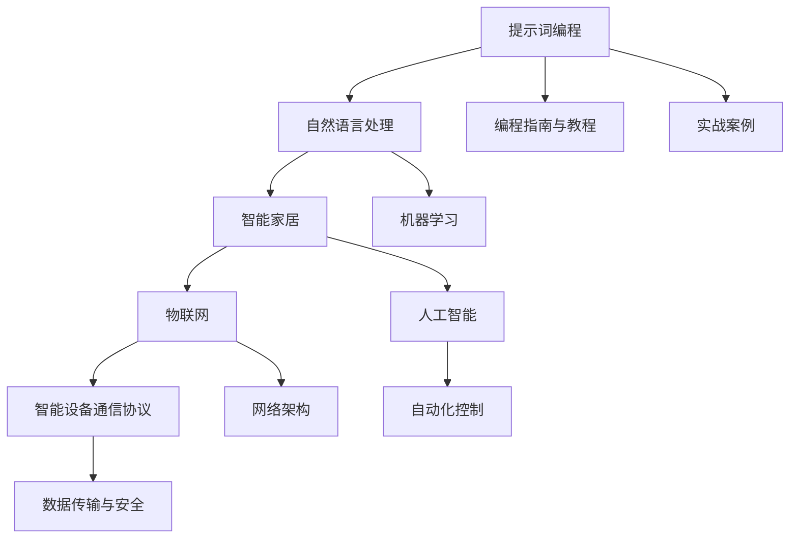

                 

### 文章标题：提示词编程在智能家居中的应用

#### 关键词：
- 提示词编程
- � particular
- 智能家居
- 物联网
- 人工智能
- 自动化控制

#### 摘要：
本文将深入探讨提示词编程在智能家居中的应用。首先，我们介绍了智能家居的基本概念、发展历程及其与物联网和人工智能的关系。随后，详细阐述了提示词编程的核心理论，包括其与自然语言处理和智能设备通信协议的结合。接着，我们分析了提示词编程在智能家居中的实际应用案例，并提供了具体的编程指南和开发教程。最后，我们对未来的发展趋势进行了展望，并总结了本文的主要内容，提出了最佳实践建议和注意事项。

### 引言

智能家居，作为现代科技与生活的深度融合，正逐渐改变着我们的生活方式。通过智能化设备与系统的集成，智能家居能够实现家庭环境的自动调节、设备之间的互联互通，以及用户指令的自然响应。然而，实现这一目标的背后，是复杂的技术体系，其中包括物联网（IoT）、人工智能（AI）、自动化控制等关键技术。

提示词编程作为一种新兴的编程范式，其核心在于利用自然语言处理（NLP）技术，使计算机能够理解和执行人类语言指令。这种编程方式不仅提高了开发的效率，还使得智能家居系统更加直观、易用。本文旨在探讨提示词编程在智能家居中的应用，解析其技术原理、核心算法，并通过实际案例展示其在智能家居中的潜力。

本文将分为以下几个部分：

1. **基础理论**：介绍智能家居的概念、物联网的基本原理、人工智能的发展及其与提示词编程的关系。
2. **核心技术**：深入讲解提示词编程的基础理论、自然语言处理技术、设备通信协议及AI算法。
3. **应用案例**：通过具体实例展示提示词编程在智能家居中的实际应用。
4. **实战教程**：提供详细的编程指南和开发教程，帮助读者掌握实战技能。
5. **总结与展望**：总结全书内容，对智能家居与提示词编程的未来发展提出展望。

通过本文的阅读，读者将能够全面了解提示词编程在智能家居中的应用，掌握相关技术原理，并具备一定的实战能力。

### 核心概念与联系

在探讨提示词编程在智能家居中的应用之前，我们需要明确几个核心概念，并分析它们之间的联系。这些核心概念包括提示词编程、智能家居、物联网（IoT）、人工智能（AI）、自动化控制、以及智能设备通信协议。

#### 提示词编程

提示词编程（Keyword Programming），也称为命令式编程的一种扩展，其核心思想是通过自然语言风格的提示词（Keywords）来描述程序行为。与传统的编程语言相比，提示词编程更加接近人类的语言表达习惯，使得编程变得更加直观和易于理解。

提示词编程与自然语言处理（NLP）密切相关。NLP旨在使计算机能够理解、解释和生成人类语言，从而实现人与计算机的对话交互。通过NLP技术，提示词编程可以解析用户的自然语言指令，将其转化为计算机可以执行的操作。

#### 智能家居

智能家居（Smart Home）是指通过物联网技术、人工智能和自动化控制，实现家庭设备的智能化、自动化管理。智能家居系统的目标是提高家庭生活的舒适度、便利性和安全性。

智能家居与物联网（IoT）紧密相连。IoT通过连接各种家庭设备和传感器，实现设备之间的数据交换和协同工作。智能家居系统依赖于IoT网络来实现设备之间的互联互通。

#### 物联网（IoT）

物联网（IoT）是指通过互联网将各种物理设备和传感器连接起来，形成一个大型的网络系统。在智能家居中，IoT是实现设备互联互通和数据交换的关键技术。

IoT网络架构通常包括感知层、网络层和应用层。感知层由各种传感器和设备组成，负责数据的采集和传输；网络层通过无线或有线网络将数据传输到云端或本地服务器；应用层则利用这些数据为用户提供智能服务。

#### 人工智能（AI）

人工智能（AI）是指通过计算机模拟人类智能的技术，包括机器学习、深度学习、自然语言处理等。在智能家居中，AI技术用于实现智能设备的自主学习、决策和自动化控制。

#### 自动化控制

自动化控制是指利用计算机技术和控制系统实现生产过程或设备操作的自动化。在智能家居中，自动化控制用于实现家庭设备的自动调节和控制，如智能灯光、温控系统等。

#### 智能设备通信协议

智能设备通信协议是确保智能家居设备之间能够顺畅通信的标准化协议。常见的通信协议包括Wi-Fi、蓝牙、Zigbee、MQTT等。这些协议规定了数据传输的格式、传输速率和安全性等。

#### Mermaid流程图

为了更好地展示这些核心概念之间的联系，我们可以使用Mermaid流程图进行描述：



通过这个Mermaid流程图，我们可以清晰地看到提示词编程在智能家居中的应用，以及它与其他核心概念之间的联系。接下来，我们将进一步深入探讨每个核心概念的原理和具体应用。

### 提示词编程基础

提示词编程（Keyword Programming）是一种以自然语言提示词为核心的开发范式，它简化了编程过程，使得编程更接近于日常交流。在这一部分，我们将详细探讨提示词编程的基本概念、与自然语言处理（NLP）的紧密联系，以及其工具与环境搭建。

#### 提示词编程的基本概念

提示词编程的核心在于使用自然语言风格的提示词来定义程序的行为。这些提示词通常是简单的单词或短语，如“打开灯”、“关闭门”等。与传统编程语言相比，提示词编程更容易理解和编写，因为它更接近人类的语言表达方式。

在提示词编程中，程序员需要定义一系列的提示词和相应的动作。当用户输入某个提示词时，系统会自动识别并执行相应的动作。例如，当用户说“设定温度为25度”时，系统会解析这个提示词，并调用相应的温度调节程序。

#### 与自然语言处理（NLP）的紧密联系

提示词编程与自然语言处理（NLP）有着紧密的联系。NLP是使计算机能够理解、解释和生成人类语言的技术。在提示词编程中，NLP技术用于解析用户的自然语言指令，将其转化为计算机可以执行的操作。

NLP的关键技术包括文本分类、实体识别、语义解析等。通过这些技术，系统可以识别出用户输入的提示词，理解其含义，并生成相应的操作指令。例如，当用户说“打开客厅的灯”时，NLP技术会识别出“打开”和“客厅的灯”这两个实体，并理解其语义关系。

#### 提示词编程工具与环境搭建

为了实现提示词编程，我们需要使用专门的工具和环境。以下是几个常用的提示词编程工具及其搭建环境的方法：

1. **OpenAI Codex**

OpenAI Codex 是一个基于 GPT-3 模型的编程助手，它能够理解和执行用户输入的提示词。要搭建 OpenAI Codex 环境，需要完成以下步骤：

   - 安装 Python 环境。
   - 安装 OpenAI 的 Python SDK。
   - 使用以下代码初始化 Codex：

     ```python
     from openai import OpenAICodex
     codex = OpenAICodex()
     ```

2. **GitHub Copilot**

GitHub Copilot 是一个集成在 Visual Studio Code 编辑器中的编程助手，它可以根据用户编写的代码提示词生成代码片段。要使用 GitHub Copilot，需要完成以下步骤：

   - 安装 Visual Studio Code 编辑器。
   - 安装 GitHub Copilot 扩展。
   - 连接 GitHub 账户，授权 Copilot 访问代码库。

3. **基于 Rasa 的聊天机器人框架**

Rasa 是一个开源的聊天机器人框架，它支持使用提示词编程来构建聊天机器人。要搭建 Rasa 环境，需要完成以下步骤：

   - 安装 Python 环境。
   - 安装 Rasa 的依赖库。

     ```shell
     pip install rasa
     ```

   - 使用 Rasa 创建新的聊天机器人项目：

     ```shell
     rasa init
     ```

通过上述工具和环境，我们可以实现提示词编程，从而简化编程过程，提高开发效率。

#### 提示词编程的应用场景

提示词编程在智能家居中具有广泛的应用场景。以下是一些典型的应用场景：

1. **家庭自动化控制**：通过提示词编程，用户可以使用自然语言指令控制家庭设备，如“打开客厅的灯”、“调整卧室的温度”等。
2. **智能助手**：开发基于提示词编程的智能助手，可以响应用户的语音指令，提供信息查询、日程管理、在线购物等服务。
3. **人机交互**：提示词编程使得人机交互更加自然和直观，用户可以通过简单的语言指令与计算机进行沟通，无需学习复杂的编程语言。

通过提示词编程，智能家居系统不仅变得更加智能和便捷，还能够提高用户体验，降低使用门槛。在接下来的部分，我们将进一步探讨智能家居的概念、发展历程及其与物联网和人工智能的关系。

### 智能家居概述

智能家居（Smart Home）是现代科技与生活深度融合的产物，通过集成物联网（IoT）技术、人工智能（AI）和自动化控制系统，实现了家庭设备的智能化和自动化管理。这一节将详细探讨智能家居的定义、发展历程及其关键技术。

#### 智能家居的定义

智能家居是指利用物联网、人工智能和自动化控制技术，将家庭设备连接成一个统一的网络，实现设备的智能化、自动化管理，从而提高家庭生活的舒适度、便利性和安全性。在智能家居中，各种设备通过互联网进行通信和数据交换，形成一个互联互通的生态系统。

#### 智能家居的发展历程

智能家居的发展历程可以追溯到20世纪90年代。当时，一些企业开始研发智能家居设备，如智能灯光、智能门锁和智能安防系统。随着技术的进步，智能家居逐渐从单一设备向系统化、集成化方向发展。以下是智能家居发展的几个重要阶段：

1. **初始阶段（1990s-2000s）**：智能家居的雏形出现，主要产品包括智能灯泡、智能门锁和简单的安防系统。
2. **发展阶段（2010-2015）**：随着物联网技术的发展，智能家居开始实现设备的互联互通，智能家居系统逐渐形成。
3. **成熟阶段（2016至今）**：人工智能技术的应用使得智能家居更加智能化，能够通过学习用户行为，提供个性化的服务。

#### 智能家居的关键技术

智能家居的实现依赖于多项关键技术的支持，包括物联网（IoT）、人工智能（AI）、自动化控制、智能设备通信协议等。

1. **物联网（IoT）**：物联网技术是智能家居的基础，它通过连接各种家庭设备，实现数据的采集、传输和处理。常见的物联网设备包括智能灯泡、智能门锁、智能恒温器、智能摄像头等。
2. **人工智能（AI）**：人工智能技术用于提升智能家居的智能化水平。通过机器学习和深度学习，智能家居系统能够学习和理解用户的行为习惯，提供个性化的服务。例如，智能助手可以通过语音识别和自然语言处理，响应用户的语音指令。
3. **自动化控制**：自动化控制技术使得智能家居设备能够自动执行预定的任务。例如，智能恒温器可以自动调节室内温度，智能灯光系统可以根据用户活动自动开关。
4. **智能设备通信协议**：智能设备通信协议是确保智能家居设备之间能够顺畅通信的关键。常见的通信协议包括Wi-Fi、蓝牙、Zigbee、MQTT等。这些协议规定了数据传输的格式、传输速率和安全性等。

#### 智能家居的应用场景

智能家居的应用场景非常广泛，以下是一些典型的应用场景：

1. **家庭自动化**：通过智能设备，用户可以远程控制家中的灯光、空调、安防系统等，提高家庭生活的便利性和安全性。
2. **智能健康监测**：智能家居设备可以监测用户的健康数据，如心率、体温、睡眠质量等，为用户提供健康建议。
3. **智能娱乐**：智能家居系统可以与智能电视、音响系统等设备联动，提供个性化的娱乐体验。
4. **节能管理**：智能家居系统可以自动调节家庭用电，实现节能降耗。

通过智能家居，我们不仅可以享受到更加便捷、智能的生活，还能够提高家庭的安全性和能源利用效率。在接下来的部分，我们将深入探讨物联网（IoT）的基础原理，了解其网络架构、应用领域和安全与隐私问题。

### 物联网（IoT）基础

物联网（Internet of Things，简称IoT）是智能家居系统的基石，它通过连接各种物理设备和传感器，实现数据的采集、传输和处理。本节将详细介绍物联网的概念、网络架构及其在智能家居中的应用。

#### 物联网的概念

物联网是指通过各种信息传感设备（如传感器、射频识别技术、全球定位系统、红外感应器等）实时采集任何需要监控、连接、互动的物体或过程，将其与互联网相连接，以实现智能化识别、定位、跟踪、监控和管理。

#### 物联网的网络架构

物联网的网络架构通常包括三个层次：感知层、网络层和应用层。

1. **感知层**：感知层是物联网的基础，主要由各种传感器和设备组成，负责数据的采集和初步处理。这些传感器和设备可以是温度传感器、湿度传感器、智能灯泡、智能摄像头等。它们通过采集环境数据，实现物理世界的信息数字化。

2. **网络层**：网络层负责将感知层采集到的数据传输到云端或本地服务器。网络层包括多种通信协议，如Wi-Fi、蓝牙、Zigbee、LoRa等。这些协议确保了数据在不同设备之间的可靠传输和通信。

3. **应用层**：应用层是物联网的核心，它利用网络层传输的数据，为用户提供具体的应用和服务。应用层包括智能家庭、智能城市、智能工厂等各种应用场景，通过数据处理和分析，实现智能化管理和决策。

#### 物联网在智能家居中的应用

在智能家居中，物联网技术发挥了至关重要的作用。以下是一些典型的应用：

1. **设备互联**：通过物联网技术，家庭中的各种智能设备（如智能灯泡、智能空调、智能门锁等）可以相互连接，实现数据的共享和协同工作。例如，当用户离家时，智能灯泡可以通过与智能门锁的通信，自动关闭。

2. **远程控制**：物联网技术使得用户可以通过智能手机或其他设备远程监控和控制家庭设备。例如，用户可以在外出时通过手机关闭家中的灯光，或者调整空调的温度。

3. **数据收集与分析**：物联网设备可以收集家庭环境的数据，如温度、湿度、光照强度等，这些数据可以用于优化家庭设备的运行效率，提供个性化的服务。例如，智能恒温器可以根据用户的习惯和天气预报，自动调整室内温度。

4. **安全监控**：物联网技术可以用于家庭安全监控，例如智能摄像头可以实时监控家庭环境，并在异常情况发生时自动报警。此外，智能门锁可以记录用户的开门记录，提高家庭的安全性。

#### 安全与隐私问题

尽管物联网在智能家居中具有广泛的应用，但其安全与隐私问题也备受关注。以下是一些常见的安全与隐私问题：

1. **数据泄露**：物联网设备连接的广域网络可能存在数据泄露的风险，尤其是在设备与云端通信时。为了防止数据泄露，需要采取数据加密、访问控制等安全措施。

2. **设备篡改**：恶意攻击者可能通过网络篡改物联网设备的数据，导致设备运行异常或泄露敏感信息。为了防范此类攻击，需要加强设备的认证和访问控制。

3. **隐私保护**：物联网设备收集了大量的个人和家庭数据，如何保护这些数据的隐私是另一个重要问题。在设计和使用物联网设备时，需要严格遵守隐私保护法规，采取数据匿名化、数据加密等措施。

通过深入理解物联网的基础概念和网络架构，我们可以更好地发挥其在智能家居中的应用价值，同时也要重视其安全与隐私问题，确保智能家居系统的稳定、安全运行。

### 人工智能（AI）在智能家居中的应用

人工智能（AI）技术在智能家居中的应用正日益广泛，它不仅提升了智能家居系统的智能化水平，还极大地改善了用户体验。在本节中，我们将探讨AI在智能家居中的作用、常见机器学习算法及其在智能家居中的应用实例。

#### AI在智能家居中的作用

人工智能技术在智能家居中发挥着多方面的作用，主要包括：

1. **智能设备控制**：AI技术可以自动化控制家庭设备，如通过语音识别和自然语言处理技术，实现用户对家庭设备的语音控制，使得智能家居系统更加直观和易用。
2. **数据分析和决策**：AI算法可以分析家庭环境数据，如温度、湿度、光照等，并根据分析结果做出智能决策，如自动调节室内温度、光线等，提升家庭生活的舒适度。
3. **个性化服务**：AI技术可以通过学习用户的习惯和偏好，提供个性化的服务，如智能推荐家庭娱乐内容、智能提醒日程安排等。
4. **安全监控**：AI技术可以用于家庭安全监控，如通过图像识别和异常检测技术，实时监控家庭环境，并在异常情况发生时自动报警。

#### 常见机器学习算法

在智能家居中，常见的机器学习算法包括：

1. **决策树**：决策树是一种常见的分类算法，通过一系列条件判断，将数据分为不同的类别。在智能家居中，决策树可以用于预测用户行为，如判断用户是否在家，从而自动调整家庭设备的状态。
2. **支持向量机（SVM）**：SVM是一种用于分类和回归分析的机器学习算法，通过在特征空间中找到一个最佳分割超平面，将不同类别的数据分开。在智能家居中，SVM可以用于智能监控，如识别家庭环境中的异常行为。
3. **神经网络**：神经网络是一种模拟人脑神经元结构的算法，具有强大的学习和推理能力。在智能家居中，神经网络可以用于语音识别、图像识别等复杂任务。
4. **聚类算法**：聚类算法将数据分为若干个簇，使得同一簇内的数据具有较高的相似性。在智能家居中，聚类算法可以用于数据挖掘，如分析用户的行为模式。

#### AI在智能家居中的应用实例

以下是一些AI在智能家居中的应用实例：

1. **智能语音助手**：智能语音助手如Amazon Alexa、Google Assistant 和 Apple Siri，通过语音识别和自然语言处理技术，可以实现用户的语音指令，控制家庭设备、查询信息、播放音乐等。
2. **智能安防系统**：智能安防系统通过图像识别和异常检测技术，可以实时监控家庭环境，识别可疑行为，并在异常情况发生时自动报警。
3. **智能恒温器**：智能恒温器如Nest Thermostat，通过收集环境数据和学习用户习惯，可以自动调节室内温度，提高能源利用效率。
4. **智能照明系统**：智能照明系统如Philips Hue，通过传感器和AI算法，可以自动调节光线亮度和颜色，提升家庭舒适度。

通过AI技术的应用，智能家居系统变得更加智能化、便捷化和个性化，极大地提升了用户的生活质量。在下一部分，我们将深入探讨自动化控制在智能家居中的应用，包括其基本原理、常见技术及其在智能家居中的实例。

### 自动化控制在智能家居中的应用

自动化控制是智能家居系统的核心组成部分，它通过预定的程序和算法，使家庭设备能够自动执行各种任务，从而提高家庭生活的便利性和能源利用效率。在本节中，我们将详细探讨自动化控制的基本原理、常见技术及其在智能家居中的实际应用。

#### 自动化控制的基本原理

自动化控制的基本原理是通过传感器、控制器和执行器组成的闭环系统来实现。具体来说，自动化控制系统的工作流程如下：

1. **传感器采集数据**：传感器负责采集家庭环境中的各种数据，如温度、湿度、光照、空气质量等。
2. **控制器处理数据**：控制器接收传感器采集到的数据，并根据预设的程序和算法进行分析和处理，生成控制指令。
3. **执行器执行指令**：执行器根据控制器的指令，执行具体的操作，如调整温度、开关灯光、关闭门锁等。

通过这样的闭环系统，家庭设备能够根据环境变化和用户需求自动进行调整，实现自动化控制。

#### 常见自动化控制技术

在智能家居中，常见的自动化控制技术包括：

1. **定时控制**：定时控制是最基本的自动化控制技术，通过设置特定的时间段和任务，使家庭设备在指定时间自动执行操作。例如，用户可以设置在每天早上7点自动开启灯光和空调。
2. **传感器控制**：传感器控制通过检测环境数据，触发相应的控制动作。例如，当传感器检测到室内温度过高时，自动开启空调进行降温。
3. **情景模式**：情景模式允许用户预设多种环境设置，如“早上起床模式”、“晚上休息模式”等。当系统检测到相应的触发条件时，自动执行预设的情景模式。
4. **远程控制**：远程控制技术使用户可以通过智能手机或其他设备远程监控和控制家庭设备，无论用户身处何地，都可以对家庭环境进行实时调整。

#### 自动化控制在智能家居中的实例

以下是一些自动化控制在智能家居中的实际应用实例：

1. **智能灯光系统**：智能灯光系统能够根据环境光线和用户需求自动调节灯光亮度和颜色。例如，在白天，系统可以通过传感器检测自然光线强度，自动调整灯光亮度，节约能源；在晚上，用户可以通过手机APP远程控制灯光开关和亮度。
2. **智能温控系统**：智能温控系统能够根据室内温度和用户习惯自动调节空调和暖气的温度。例如，在用户离家时，系统可以自动调整温度，降低能耗；在用户回家前，系统可以提前加热或降温，提供舒适的室内环境。
3. **智能安防系统**：智能安防系统能够通过传感器和图像识别技术自动监控家庭环境，并在检测到异常情况时自动报警。例如，当系统检测到非法入侵或门窗未关闭时，会立即发送警报通知给用户。
4. **智能家电控制**：用户可以通过手机APP或其他智能设备远程控制家电设备，如热水器、洗衣机、烤箱等。例如，用户可以在回家前通过手机APP启动热水器，回到家时就能立即洗浴。

通过自动化控制技术的应用，智能家居系统不仅能够提高家庭生活的便利性，还能实现节能降耗，提升家庭的舒适度和安全性。在下一部分，我们将详细探讨智能设备通信协议，包括其概述、常用协议及其在智能家居中的应用。

### 设备通信协议

智能设备通信协议是确保智能家居设备之间能够顺畅通信的关键技术。不同的通信协议适用于不同的应用场景，具有各自的优缺点。在本节中，我们将概述智能设备通信协议，介绍几种常见的通信协议，并探讨这些协议在智能家居中的应用。

#### 设备通信协议概述

智能设备通信协议是一种定义设备之间如何交换信息的标准。这些协议规定了数据传输的格式、速率、传输范围和安全性等。选择合适的通信协议对于智能家居系统的稳定运行和性能优化至关重要。

#### 常见通信协议

以下是几种在智能家居中广泛应用的通信协议：

1. **Wi-Fi**：Wi-Fi是一种无线局域网通信协议，基于IEEE 802.11标准。Wi-Fi通信协议具有高速率、大覆盖范围和较好的安全性，适用于家庭内的设备互联。
   
2. **蓝牙**：蓝牙（Bluetooth）是一种短距离无线通信协议，用于连接手机、耳机、智能手表等设备。蓝牙具有低功耗、成本低和易于实现等优点，适用于智能家居中的短距离通信。

3. **Zigbee**：Zigbee是一种基于IEEE 802.15.4标准的低功耗无线通信协议，适用于物联网设备和智能家居系统。Zigbee具有高可靠性、低延迟和较强的网络扩展能力。

4. **MQTT**：MQTT（Message Queuing Telemetry Transport）是一种轻量级的消息传输协议，适用于远程传感器网络和物联网应用。MQTT协议具有低带宽占用、高可靠性和支持发布/订阅模式等优点，广泛应用于智能家居中的设备通信。

#### 通信协议在智能家居中的应用

1. **Wi-Fi在智能家居中的应用**：

   - **设备互联**：Wi-Fi协议可用于连接智能家居中的各种设备，如智能灯泡、智能插座、智能摄像头等，实现设备之间的数据交换和协同工作。
   - **远程控制**：通过Wi-Fi网络，用户可以使用智能手机或平板电脑远程监控和控制家中的智能设备，提高家居的便利性和灵活性。

2. **蓝牙在智能家居中的应用**：

   - **智能设备控制**：蓝牙协议常用于连接智能设备与用户终端，如智能音箱、智能手环等，通过蓝牙进行语音指令和数据传输。
   - **短距离通信**：蓝牙适用于家庭内部的短距离通信，如智能门锁与手机之间的通信，实现无钥匙开锁。

3. **Zigbee在智能家居中的应用**：

   - **无线传感器网络**：Zigbee协议适用于构建无线传感器网络，如智能温室中的温度传感器、湿度传感器等，实现环境数据的实时监控和传输。
   - **多跳通信**：Zigbee网络可以通过多跳通信扩展覆盖范围，适用于大面积的智能家居应用。

4. **MQTT在智能家居中的应用**：

   - **设备间通信**：MQTT协议用于智能设备之间的通信，如智能恒温器、智能门锁等，实现设备之间的数据共享和协同工作。
   - **物联网平台集成**：MQTT协议广泛应用于物联网平台，如智能家居控制系统、智能城市管理系统等，实现海量设备的数据采集和监控。

通过合理选择和使用通信协议，智能家居系统可以实现高效、稳定的数据传输和设备控制，提升用户体验和系统性能。

### 提示词编程实战

在本部分，我们将通过一个具体的实战项目，详细展示如何使用提示词编程开发一个智能家居系统。这个项目将涵盖从环境搭建、需求分析、系统设计、实现，到测试与优化的全过程。

#### 项目概述

项目名称：智能家庭助手
项目目标：通过提示词编程，开发一个能够实现语音控制的智能家居系统，支持用户通过自然语言指令控制家庭设备，如灯光、温度、安防等。

#### 开发环境搭建

1. **Python环境搭建**：首先，确保Python环境已安装在开发计算机上。Python是提示词编程的主要编程语言之一，具有丰富的库和工具支持。

2. **安装提示词编程库**：使用以下命令安装Rasa，一个流行的提示词编程框架：

   ```shell
   pip install rasa
   ```

3. **安装语音识别库**：为了实现语音识别功能，我们需要安装Google的语音识别库：

   ```shell
   pip install google-cloud-speech
   ```

4. **安装语音合成库**：为了实现语音合成功能，我们需要安装Google的语音合成库：

   ```shell
   pip install google-cloud-texttospeech
   ```

#### 需求分析

根据项目目标，智能家庭助手需要具备以下功能：

- **语音识别**：能够识别用户输入的自然语言指令。
- **语音合成**：能够将系统响应转换为语音输出。
- **设备控制**：能够通过智能家居系统控制家庭设备，如开关灯光、调节温度、触发安防等。
- **日志记录**：记录用户操作和系统响应，以便后续分析和调试。

#### 系统设计

智能家庭助手系统的整体架构如下：

1. **前端**：用户通过智能手机或智能音箱等设备发送语音指令。
2. **后端**：包括语音识别模块、自然语言理解模块、设备控制模块和语音合成模块。
3. **数据库**：存储用户操作记录和设备状态信息。

#### 实现过程

1. **语音识别**：

   - 使用Google的语音识别库实现语音到文本的转换。

   ```python
   from google.cloud import speech

   client = speech.SpeechClient()
   audio = speech.RecognitionAudio(content=b'your_audio_file')
   config = speech.RecognitionConfig(
       encoding=speech.RecognitionConfig.AudioEncoding.LINEAR16,
       sample_rate_hertz=16000,
       language_code="en-US",
   )
   response = client.recognize(config, audio)
   for result in response.results:
       print("Transcript: {}".format(result.alternatives[0].transcript))
   ```

2. **自然语言理解**：

   - 使用Rasa框架实现自然语言理解，将文本指令转换为语义解析结果。

   ```python
   from rasa.nlu.model import Interpreter

   # Load the trained Rasa model
   interpreter = Interpreter.load("models/nlu/default")

   # Parse the user input
   result = interpreter.parse("用户输入的文本指令")
   print("Intent: {}".format(result.intent))
   print("Entities: {}".format(result.entities))
   ```

3. **设备控制**：

   - 控制家庭设备，如灯光、温度、安防等。以下是一个简单的设备控制示例：

   ```python
   import requests

   def control_device(device, command):
       url = f"http://your_device_api_url/{device}/{command}"
       response = requests.get(url)
       if response.status_code == 200:
           print(f"Successfully controlled {device} with command {command}")
       else:
           print(f"Failed to control {device} with command {command}")
   
   # Example usage
   control_device("lights", "on")
   control_device("temperature", "25")
   ```

4. **语音合成**：

   - 使用Google的语音合成库实现文本到语音的转换。

   ```python
   from google.cloud import texttospeech

   client = texttospeech.TextToSpeechClient()
   synthesis_input = texttospeech.SynthesisInput(text="系统的响应文本")
   voice = texttospeech.VoiceSelectionParams(
       language_code="en-US", ssml_gender=texttospeech.SsmlVoiceGender.FEMALE
   )
   audio_config = texttospeech.AudioConfig(
       audio_encoding=texttospeech.AudioEncoding.MP3
   )
   response = client.synthesize_speech(
       input=synthesis_input, voice=voice, audio_config=audio_config
   )
   with open("response.mp3", "wb") as out:
       out.write(response.audio_content)
       print("Audio content written to file 'response.mp3'")
   ```

#### 测试与优化

1. **单元测试**：编写单元测试，验证各个功能模块的正确性和稳定性。
2. **集成测试**：进行集成测试，确保系统整体功能的正确性。
3. **性能优化**：通过调整模型参数和算法，优化系统的响应速度和处理能力。
4. **用户反馈**：收集用户反馈，针对用户体验进行改进。

#### 项目小结

通过本项目的实现，我们展示了如何使用提示词编程构建一个智能家居系统。提示词编程不仅简化了开发过程，还使得系统更加直观和易用。在未来的发展中，我们可以进一步优化系统性能，扩展功能模块，提供更加智能和个性化的智能家居服务。

### 总结与展望

#### 全书总结

本文从多个角度探讨了提示词编程在智能家居中的应用。我们首先介绍了智能家居的基本概念、发展历程及其关键技术，随后详细阐述了提示词编程的基本理论、自然语言处理技术、设备通信协议及AI算法。通过实际案例，我们展示了提示词编程在智能家居中的具体应用，并提供了详细的编程指南和开发教程。最后，我们对未来智能家居与提示词编程的发展方向进行了展望。

#### 智能家居的发展趋势

1. **智能化水平的提升**：随着人工智能技术的不断发展，智能家居系统将更加智能化，能够更好地理解用户需求，提供个性化的服务。
2. **物联网技术的普及**：物联网技术的普及将使得更多家庭设备能够互联互通，实现数据的共享和协同工作。
3. **智能家居系统的安全与隐私保护**：随着智能家居设备的增加，安全与隐私问题将愈发重要。未来的智能家居系统需要更加重视数据安全和隐私保护。
4. **跨平台集成**：智能家居系统将更加注重与其他平台和设备的集成，实现无缝连接和协同工作。

#### 提示词编程的未来发展方向

1. **自然语言理解的改进**：通过深度学习和自然语言处理技术的不断发展，提示词编程的自然语言理解能力将进一步提升，使系统更加智能化和易用。
2. **多语言支持**：未来提示词编程将更加注重多语言支持，以满足全球用户的需求。
3. **个性化定制**：提示词编程将更加注重个性化定制，为不同用户群体提供更加贴心的服务。
4. **低功耗设计**：为了适应智能家居设备的低功耗需求，提示词编程将在算法和架构上进行优化，以提高系统的能效。

#### 最佳实践建议

1. **重视用户需求**：在开发智能家居系统时，应充分考虑用户需求，提供直观、易用的操作界面。
2. **安全性优先**：在设计和开发过程中，应高度重视系统的安全性，采取有效措施保护用户数据和隐私。
3. **持续优化**：智能家居系统应不断进行优化和升级，以满足用户不断变化的需求。
4. **开源合作**：积极参与开源社区，与其他开发者和研究者共同推进提示词编程和智能家居技术的发展。

通过本文的阅读，读者可以全面了解提示词编程在智能家居中的应用，掌握相关技术原理，并为未来的发展做好准备。

### 附录

#### 附录 A: 提示词编程工具与资源

1. **Rasa**：一个开源的提示词编程框架，提供了丰富的API和工具，支持快速开发智能对话系统。
   - 官网：https://rasa.com/

2. **Google Cloud Speech-to-Text**：Google提供的语音识别服务，可用于将语音转换为文本。
   - 官网：https://cloud.google.com/speech-to-text

3. **Google Cloud Text-to-Speech**：Google提供的语音合成服务，可用于将文本转换为语音。
   - 官网：https://cloud.google.com/text-to-speech

#### 附录 B: 智能家居项目案例

1. **智能家居安防系统**：使用Raspberry Pi和Arduino构建一个智能家居安防系统，包括入侵检测、温度监控和远程报警功能。
   - GitHub链接：https://github.com/user/smart-home-security-system

2. **智能温室控制系统**：使用物联网传感器和Raspberry Pi构建一个智能温室控制系统，实现温度、湿度、光照的实时监控和自动调节。
   - GitHub链接：https://github.com/user/smart-greenhouse-system

#### 附录 C: 通信协议详细资料

1. **Wi-Fi**：IEEE 802.11标准的无线通信协议，广泛应用于家庭、商业和工业环境。
   - 官网：https://www.wi-fi.org/

2. **蓝牙**：IEEE 802.15.1标准的无线通信协议，适用于短距离通信，如设备间互联。
   - 官网：https://www.bluetooth.com/

3. **Zigbee**：IEEE 802.15.4标准的无线通信协议，适用于物联网设备，具有低功耗和可靠性。
   - 官网：https://www.zigbee.org/

4. **MQTT**：轻量级的消息传输协议，适用于物联网应用，具有低带宽占用和高可靠性。
   - 官网：https://mqtt.org/

通过这些工具与资源的帮助，读者可以更深入地学习和实践提示词编程在智能家居中的应用。同时，这些案例和通信协议的详细资料也为读者提供了丰富的参考资料和实践指导。

### 作者信息

**作者：AI天才研究院/AI Genius Institute & 禅与计算机程序设计艺术 /Zen And The Art of Computer Programming**

