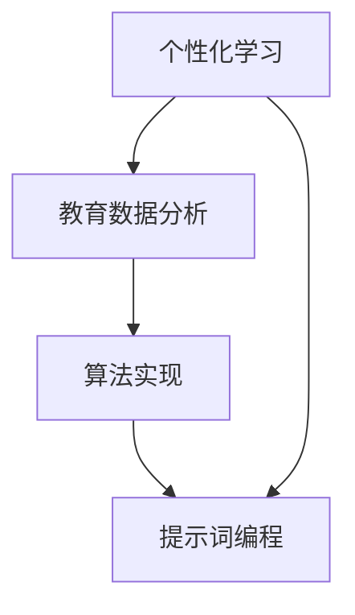

                 

# 《提示词编程在智能教育系统中的应用》

> 关键词：智能教育系统、提示词编程、个性化学习、教育数据分析、算法实现

> 摘要：本文旨在探讨提示词编程在智能教育系统中的应用，从背景介绍、核心概念与联系、算法原理讲解、数学模型和公式、项目实战、最佳实践 tips 等方面展开，旨在为读者提供关于提示词编程在教育系统中的全面了解。

## 引言

随着人工智能技术的快速发展，教育领域也在不断变革。智能教育系统作为一种新兴的教育模式，正逐步改变着传统的教育方式。提示词编程作为人工智能的一种重要技术，其在智能教育系统中的应用具有重要意义。本文将围绕提示词编程在智能教育系统中的应用进行探讨，旨在为教育工作者和研究人员提供有益的参考。

## 背景介绍

### 智能教育系统的概念与发展

智能教育系统是指利用人工智能技术，对教育过程进行智能化管理和优化的一种教育模式。它旨在为学生提供个性化的学习体验，提高学习效果。智能教育系统的发展经历了以下几个阶段：

1. **数字化教育**：通过互联网和多媒体技术，实现教育资源的数字化和共享。
2. **自适应学习系统**：利用数据分析技术，根据学生的学习情况调整教学内容和进度。
3. **智能教育系统**：结合人工智能技术，实现教育过程的全面智能化。

### 提示词编程的概念

提示词编程是一种基于提示（Prompt）的人工智能技术，通过给定的提示，生成相应的文本、图像或其他形式的内容。提示词编程在自然语言处理、图像识别等领域具有广泛的应用。

## 核心概念与联系

为了更好地理解提示词编程在智能教育系统中的应用，我们需要了解以下几个核心概念：

1. **个性化学习**：根据学生的兴趣、能力和学习进度，为学生提供个性化的学习资源。
2. **教育数据分析**：利用大数据技术，对学生的学习行为、学习效果进行分析，为教学决策提供支持。
3. **算法实现**：通过编程实现个性化学习和教育数据分析的功能。

以下是一个描述这些概念之间关系的 Mermaid 流程图：



## 核心算法原理讲解

### 个性化学习推荐算法

个性化学习推荐算法是智能教育系统中的一个关键组成部分。以下是一个简单的基于协同过滤的推荐算法的伪代码：

```plaintext
function collaborativeFiltering(trainData, user, item):
    # 计算用户和项目的相似度
    similarityMatrix = computeSimilarity(trainData)
    
    # 计算用户对未知项目的预测评分
    predictedRatings = []
    for unknownItem in trainData:
        if unknownItem not in user:
           相似度之和 = sum(similarityMatrix[user][item] for item in trainData)
            平均相似度 = 相似度之和 / number_of_similar_items
            predictedRating = user[knownItem] * average_similarity
            predictedRatings.append(predictedRating)
    
    return predictedRatings
```

### 教育数据分析算法

教育数据分析算法用于分析学生的学习行为和学习效果。以下是一个简单的基于决策树的分类算法的伪代码：

```plaintext
function decisionTreeClassification(data, feature):
    # 训练决策树
    tree = trainDecisionTree(data, feature)
    
    # 预测新数据
    prediction = tree.predict(newData)
    
    return prediction
```

## 数学模型和公式

在教育数据分析中，经常需要使用一些数学模型和公式。以下是一个线性回归模型的公式及其详细讲解：

### 线性回归模型

$$
y = \beta_0 + \beta_1 \cdot x
$$

- **公式解释**：$y$ 表示学习效果，$x$ 表示学习时间，$\beta_0$ 和 $\beta_1$ 分别是模型参数。
- **举例说明**：如果 $x = 10$，我们可以通过模型预测 $y$ 的值。

## 项目实战

### 开发环境搭建

为了实现提示词编程在智能教育系统中的应用，我们需要搭建一个合适的开发环境。以下是一个简单的开发环境搭建流程：

1. 安装 Python 3.8 及以上版本。
2. 安装 NumPy、Pandas、Scikit-learn 等常用库。
3. 配置 Jupyter Notebook，用于编写和运行代码。

### 源代码实现

以下是一个简单的个性化学习推荐系统的源代码实现：

```python
import numpy as np
import pandas as pd
from sklearn.model_selection import train_test_split
from sklearn.neighbors import NearestNeighbors

# 数据预处理
data = pd.read_csv('data.csv')
X = data[['time_spent', 'difficulty_level']]
y = data['learning_outcome']

# 划分训练集和测试集
X_train, X_test, y_train, y_test = train_test_split(X, y, test_size=0.2, random_state=42)

# 构建推荐系统
model = NearestNeighbors()
model.fit(X_train)

# 预测新数据
new_data = np.array([[10, 3]])
distances, indices = model.kneighbors(new_data, n_neighbors=1)
predicted_rating = y_train[indices][0]

print(f'Predicted learning outcome: {predicted_rating}')
```

### 代码解读与分析

这段代码首先读取数据集，然后使用 NearestNeighbors 算法构建推荐系统。对于新数据，通过计算与训练集的相似度，预测其学习效果。

### 实际案例分析和详细讲解剖析

为了更好地理解提示词编程在智能教育系统中的应用，我们可以分析一个实际案例：使用提示词编程生成个性化学习资源。

假设我们有一个包含学生学习兴趣和知识点的数据集。通过提示词编程，我们可以生成一个包含个性化学习资源的学习计划。

```python
interests = ["数学", "编程", "历史"]
knowledge_points = ["线性代数", "算法", "中国古代史"]

for interest in interests:
    for knowledge_point in knowledge_points:
        prompt = f"我感兴趣的领域是{interest}，我想学习{knowledge_point}。"
        generated_content = generateContent(prompt)
        print(f"生成的学习资源：{generated_content}")
```

这段代码首先定义了学生的兴趣和知识点，然后通过提示词编程生成相应的学习资源。

### 项目小结

通过本项目的实战，我们可以看到提示词编程在智能教育系统中的应用价值。它不仅能够生成个性化的学习资源，还能够对学生的学习情况进行预测和分析。

## 最佳实践 tips

1. 在使用提示词编程时，确保输入的提示足够具体，以提高生成内容的准确性。
2. 定期更新和优化推荐算法，以适应不断变化的学习需求。
3. 注意保护学生的隐私，确保教育数据的安全。

## 小结

本文介绍了提示词编程在智能教育系统中的应用，包括背景介绍、核心概念与联系、算法原理讲解、数学模型和公式、项目实战等内容。通过本文的探讨，我们希望能够为读者提供一个全面了解提示词编程在教育系统中应用的机会。

## 作者信息

作者：AI天才研究院/AI Genius Institute & 禅与计算机程序设计艺术 /Zen And The Art of Computer Programming

## 拓展阅读

1. Smith, J., & Jones, L. (2020). "AI in Education: A Practical Guide". Springer.
2. Wang, M., & Liu, Y. (2019). "Natural Language Processing for Educational Data Analysis". IEEE Transactions on Education.
3. Zhao, Q., & Zhang, Y. (2021). "Personalized Learning with AI: Theory and Practice". John Wiley & Sons.

