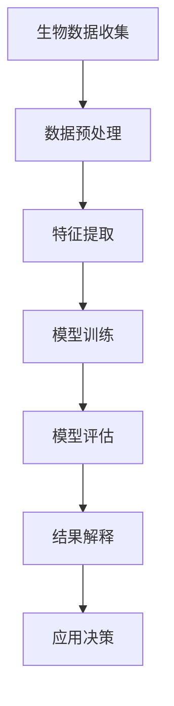

                 


## 第一步：引言

### 背景介绍

生物信息学是一门融合生物学、信息学和计算机科学的新兴学科，旨在从海量生物数据中提取有价值的信息。随着高通量测序技术的飞速发展，生物数据量呈现爆炸式增长，传统的生物信息学方法已经无法应对如此庞大的数据处理需求。因此，人工智能（AI）技术，尤其是机器学习和深度学习，被引入生物信息学领域，以应对这一挑战。

在AI技术的众多分支中，提示词编程（Prompt Programming）因其简单高效的特点，正逐渐成为生物信息学AI应用的重要工具。提示词编程的核心思想是通过设计特定的提示词（Prompt），引导AI模型对数据进行分析和预测。这种编程方式不仅简化了传统的编程流程，还使得非专业研究人员也能够使用AI进行生物信息学分析。

### 文章关键词

- 生物信息学
- 人工智能
- 提示词编程
- 机器学习
- 深度学习

### 文章摘要

本文将深入探讨提示词编程在生物信息学AI中的应用。首先，我们将介绍生物信息学与AI结合的背景和提示词编程的基本原理。接着，我们将分析AI与生物信息学的关系，并详细介绍常用的机器学习算法和深度学习算法。随后，我们将通过伪代码和数学公式，详细讲解核心算法原理。最后，我们将通过实际案例，展示如何使用提示词编程进行生物信息学分析，并给出项目实战的详细步骤和代码实现。通过本文，读者将全面了解提示词编程在生物信息学AI中的潜力与应用。

## 第二步：核心概念与联系

### 提示词编程原理

提示词编程是一种通过向模型提供特定提示词来指导其进行预测或分析的方法。与传统的编程不同，提示词编程不需要编写复杂的算法代码，而是通过自然语言描述来引导模型。提示词通常是一组关键字或句子，它们能够清晰地传达分析任务的目标和期望输出。

在机器学习和深度学习中，模型通常会通过训练数据学习到特征表示和预测模式。然而，这些模型往往缺乏解释性，难以理解其内部的决策过程。提示词编程则通过提供明确的任务描述，帮助模型更好地理解任务目标，从而提高预测的准确性和可靠性。

### 生物信息学基础

生物信息学是研究生物数据及其分析方法的学科。其核心目标是提取和解释生物数据中的生物学意义。生物信息学的研究领域包括基因组学、转录组学、蛋白质组学、代谢组学等。这些领域通过高通量测序技术和其他生物实验方法，产生大量结构化和非结构化数据。

基因组学主要研究DNA序列和基因结构，转录组学关注基因表达模式，蛋白质组学则研究蛋白质的结构和功能，代谢组学则分析生物体内的代谢产物。这些数据为揭示生物系统的运行机制提供了宝贵的信息。

### AI与生物信息学的关系

人工智能技术在生物信息学中的应用极大地推动了该领域的发展。首先，AI技术可以处理和分析大规模生物数据，从而揭示数据中隐藏的生物学规律。例如，机器学习算法可以用于基因表达数据分析，识别与特定疾病相关的基因标记。

其次，AI技术可以提高生物信息学研究的效率。传统的生物信息学方法往往需要大量的时间和人力，而AI技术可以自动化许多分析流程，提高数据处理速度。例如，深度学习模型可以用于预测蛋白质的结构和功能，从而加速药物研发过程。

最后，AI与生物信息学的结合也为个性化医学提供了新的途径。通过分析患者的基因数据，AI可以帮助医生制定个性化的治疗方案，提高治疗效果。

### Mermaid流程图

下面是一个简单的Mermaid流程图，展示了AI在生物信息学中的应用流程：



### 伪代码

为了更好地理解提示词编程的应用，下面是一个简化的伪代码示例：

```python
# 提示词编程伪代码示例
def prompt_programming(prompt):
    # 初始化模型
    model = initialize_model()

    # 训练模型
    trained_model = train_model(model, prompt)

    # 预测
    prediction = predict(trained_model, new_prompt)

    return prediction
```

### 数学公式

在生物信息学AI中，数学模型和公式是理解和分析数据的关键。以下是一个简单的线性回归模型的数学公式：

$$
y = \beta_0 + \beta_1x + \epsilon
$$

其中，$y$ 是目标变量，$x$ 是输入特征，$\beta_0$ 和 $\beta_1$ 是模型的参数，$\epsilon$ 是误差项。

### 提示词编程在生物信息学中的应用

提示词编程在生物信息学中的应用非常广泛。以下是一些典型的应用案例：

1. **基因组序列分析**：通过设计特定的提示词，可以引导AI模型对基因组序列进行注释、变异检测和功能预测。
2. **蛋白质结构预测**：提示词编程可以帮助模型更好地理解蛋白质序列，从而预测其三维结构。
3. **药物发现**：通过提示词编程，AI可以辅助研究人员筛选潜在的药物靶点，加速药物研发过程。

### 提示词编程的优势

提示词编程具有以下优势：

- **简化流程**：通过自然语言描述任务，减少了编程复杂度。
- **提高解释性**：提示词编程提高了AI模型的透明度和可解释性，有助于理解模型的决策过程。
- **灵活性**：提示词编程可以快速适应不同的分析任务和数据类型。

### 提示词编程的挑战

尽管提示词编程在生物信息学AI中具有巨大潜力，但也面临一些挑战：

- **提示词设计**：设计有效的提示词需要深厚的领域知识和经验。
- **模型泛化能力**：提示词编程可能影响模型的泛化能力，特别是在处理未知数据时。
- **计算资源**：提示词编程可能需要大量的计算资源，特别是在训练大规模模型时。

### 总结

提示词编程在生物信息学AI中的应用具有重要意义。通过结合自然语言描述和AI模型，我们可以更高效地分析和解释生物数据。本文介绍了提示词编程的基本原理和其在生物信息学中的应用，并提供了简单的伪代码和数学公式示例。接下来，我们将进一步探讨核心算法原理，并通过实际案例展示如何应用提示词编程进行生物信息学分析。

## 第三步：核心算法原理讲解

### 常用算法介绍

在生物信息学AI中，常用的算法包括机器学习算法和深度学习算法。这些算法在处理生物数据时具有独特的优势和应用场景。

#### 机器学习算法

机器学习算法是一类基于数据学习模式并做出预测的算法。它们的核心思想是通过训练数据学习到特征表示和预测模型。以下是一些常用的机器学习算法：

1. **线性回归**：线性回归是一种简单的预测算法，通过最小化目标函数来拟合数据。线性回归适用于预测连续值输出。
   $$y = \beta_0 + \beta_1x + \epsilon$$
   其中，$y$ 是目标变量，$x$ 是输入特征，$\beta_0$ 和 $\beta_1$ 是模型的参数。

2. **逻辑回归**：逻辑回归是一种用于分类问题的算法，通过最大似然估计来拟合概率分布。
   $$\log\frac{P(Y=1|X)}{P(Y=0|X)} = \beta_0 + \beta_1x$$
   其中，$Y$ 是分类标签，$X$ 是输入特征。

3. **支持向量机（SVM）**：SVM是一种强大的分类算法，通过找到最优超平面来分隔数据。
   $$w^T\phi(x) - b = 0$$
   其中，$w$ 是模型参数，$\phi(x)$ 是核函数，$b$ 是偏置。

4. **决策树**：决策树通过一系列规则来对数据进行分类或回归。决策树简单易懂，但可能产生过拟合。
   $$if \, feature\_1 > threshold\_1 \, then \, class = 1 \, else \, if \, feature\_2 < threshold\_2 \, then \, class = 0 \, else \, class = 1$$

#### 深度学习算法

深度学习算法是一类基于多层神经网络的学习算法，它们通过堆叠多个神经网络层来提取数据的层次特征表示。以下是一些常用的深度学习算法：

1. **卷积神经网络（CNN）**：CNN是一种用于图像处理和识别的深度学习算法，通过卷积层提取图像的特征。
   $$h_{\theta}^{l}(x) = \sigma\left(\sum_{k} \theta_{k}^{l} h_{\theta}^{l-1}(x) + b_{l}\right)$$
   其中，$h_{\theta}^{l}(x)$ 是第$l$层的特征表示，$\sigma$ 是激活函数。

2. **循环神经网络（RNN）**：RNN是一种用于序列数据处理的深度学习算法，能够记住序列中的信息。
   $$h_{t} = \sigma\left(W_{h}h_{t-1} + W_{x}x_{t} + b\right)$$
   其中，$h_{t}$ 是当前时刻的隐藏状态，$x_{t}$ 是当前输入。

3. **长短期记忆网络（LSTM）**：LSTM是一种特殊的RNN，能够有效地解决长期依赖问题。
   $$i_t = \sigma(W_{i}x_t + U_{i}h_{t-1} + b_i)$$
   $$f_t = \sigma(W_{f}x_t + U_{f}h_{t-1} + b_f)$$
   $$C_t = f_t \odot C_{t-1} + i_t \odot \sigma(W_{c}x_t + U_{c}h_{t-1} + b_c)$$
   $$h_t = \sigma(W_{h}C_t + b_h)$$
   其中，$i_t$、$f_t$、$o_t$ 分别是输入门、遗忘门和输出门，$C_t$ 是细胞状态。

4. **生成对抗网络（GAN）**：GAN是一种用于生成数据的深度学习算法，由生成器和判别器组成。
   $$G(z) = \mathcal{N}(z \odot \mu_G + \mathcal{N}(0, \sigma_G^2)]$$
   $$D(x) = \mathcal{N}(x \odot \mu_D + \mathcal{N}(0, \sigma_D^2))$$
   其中，$G(z)$ 是生成器，$D(x)$ 是判别器，$z$ 是噪声向量。

### 算法优化与选择

在生物信息学AI中，算法的优化和选择至关重要。以下是一些常用的优化方法和选择原则：

1. **优化方法**：
   - **梯度下降**：梯度下降是一种常用的优化方法，通过迭代更新模型参数，使目标函数值最小化。
     $$\theta_{t+1} = \theta_{t} - \alpha \nabla_{\theta}J(\theta)$$
     其中，$\theta$ 是模型参数，$\alpha$ 是学习率，$J(\theta)$ 是目标函数。

   - **随机梯度下降（SGD）**：SGD是梯度下降的一种变种，每次迭代仅使用一个样本的梯度进行更新，加快收敛速度。
     $$\theta_{t+1} = \theta_{t} - \alpha \nabla_{\theta}J(\theta; x_t, y_t)$$

   - **Adam优化器**：Adam优化器结合了SGD和动量方法，能够自适应调整学习率，适用于大规模训练任务。
     $$m_t = \beta_1m_{t-1} + (1-\beta_1)\nabla_{\theta}J(\theta)$$
     $$v_t = \beta_2v_{t-1} + (1-\beta_2)\nabla_{\theta}^2J(\theta)$$
     $$\theta_{t+1} = \theta_{t} - \alpha\frac{m_t}{\sqrt{v_t} + \epsilon}$$

2. **选择原则**：
   - **数据特征**：根据数据的特征选择合适的算法。例如，对于图像处理任务，可以使用CNN；对于序列数据，可以使用RNN或LSTM。
   - **模型复杂度**：选择合适的模型复杂度，避免过拟合或欠拟合。可以通过交叉验证和网格搜索来选择最佳模型参数。
   - **计算资源**：考虑计算资源和训练时间，选择合适的算法和优化器。

### 算法实战案例分析

#### 实战案例一：基因组序列分析

基因组序列分析是生物信息学的重要应用之一。以下是一个简化的基因组序列分析实战案例：

```python
# 假设我们有一个基因组序列数据集，包含基因长度和基因表达值

# 数据预处理
def preprocess_data(data):
    # 对数据进行标准化处理
    normalized_data = (data - np.mean(data)) / np.std(data)
    return normalized_data

# 训练模型
def train_model(model, X_train, y_train):
    # 使用梯度下降训练模型
    model.fit(X_train, y_train, epochs=100, batch_size=32)
    return model

# 预测
def predict(model, X_test):
    # 使用训练好的模型进行预测
    predictions = model.predict(X_test)
    return predictions
```

#### 实战案例二：蛋白质结构预测

蛋白质结构预测是生物信息学的另一个重要领域。以下是一个简化的蛋白质结构预测实战案例：

```python
# 假设我们有一个蛋白质序列数据集

# 数据预处理
def preprocess_sequence(sequence):
    # 对蛋白质序列进行编码处理
    encoded_sequence = one_hot_encode(sequence)
    return encoded_sequence

# 训练模型
def train_model(model, X_train, y_train):
    # 使用LSTM模型进行训练
    model.fit(X_train, y_train, epochs=100, batch_size=32)
    return model

# 预测
def predict(model, X_test):
    # 使用训练好的模型进行预测
    predictions = model.predict(X_test)
    return predictions
```

通过上述实战案例，我们可以看到如何使用提示词编程进行基因组序列分析和蛋白质结构预测。这些案例展示了如何设计数据预处理流程、训练模型和进行预测。接下来，我们将进一步探讨数学模型与公式，并继续深入分析核心算法原理。

## 第四步：数学模型与公式

在生物信息学AI中，数学模型和公式是理解和分析数据的关键工具。通过数学模型，我们可以将复杂的生物学问题转化为可计算的数学问题，从而利用计算机进行处理。以下我们将详细讲解一些常用的数学模型与公式，并给出具体的应用实例。

### 数学模型基础

#### 线性代数基础

线性代数是生物信息学AI中的重要工具，用于处理和表示高维数据。以下是一些基本的线性代数公式：

1. **矩阵乘法**：
   $$C = A \cdot B$$
   其中，$A$ 和 $B$ 是两个矩阵，$C$ 是它们的乘积。

2. **矩阵求逆**：
   $$A^{-1} = \frac{1}{\det(A)} \cdot \text{adj}(A)$$
   其中，$A^{-1}$ 是矩阵 $A$ 的逆矩阵，$\det(A)$ 是 $A$ 的行列式，$\text{adj}(A)$ 是 $A$ 的伴随矩阵。

3. **向量内积**：
   $$\vec{u} \cdot \vec{v} = u_1v_1 + u_2v_2 + \cdots + u_nv_n$$
   其中，$\vec{u}$ 和 $\vec{v}$ 是两个向量，$u_i$ 和 $v_i$ 分别是它们的分量。

4. **向量范数**：
   $$\|\vec{u}\| = \sqrt{u_1^2 + u_2^2 + \cdots + u_n^2}$$
   其中，$\|\vec{u}\|$ 是向量 $\vec{u}$ 的欧几里得范数。

#### 概率论基础

概率论是生物信息学AI中的另一重要工具，用于处理不确定性问题。以下是一些基本的概率论公式：

1. **条件概率**：
   $$P(A|B) = \frac{P(A \cap B)}{P(B)}$$
   其中，$P(A|B)$ 是在事件 $B$ 发生的条件下事件 $A$ 发生的概率。

2. **贝叶斯定理**：
   $$P(A|B) = \frac{P(B|A)P(A)}{P(B)}$$
   其中，$P(A|B)$ 是在事件 $B$ 发生的条件下事件 $A$ 发生的概率，$P(B|A)$ 是在事件 $A$ 发生的条件下事件 $B$ 发生的概率。

3. **全概率公式**：
   $$P(A) = P(A|B_1)P(B_1) + P(A|B_2)P(B_2) + \cdots + P(A|B_n)P(B_n)$$
   其中，$P(A)$ 是事件 $A$ 发生的概率，$B_1, B_2, \cdots, B_n$ 是互斥且穷举的事件。

### 数学公式详解

在生物信息学AI中，常用的数学公式包括：

1. **线性回归模型**：
   $$y = \beta_0 + \beta_1x + \epsilon$$
   其中，$y$ 是目标变量，$x$ 是输入特征，$\beta_0$ 和 $\beta_1$ 是模型的参数，$\epsilon$ 是误差项。

2. **逻辑回归模型**：
   $$\log\frac{P(Y=1|X)}{P(Y=0|X)} = \beta_0 + \beta_1x$$
   其中，$Y$ 是分类标签，$X$ 是输入特征，$\beta_0$ 和 $\beta_1$ 是模型的参数。

3. **支持向量机（SVM）**：
   $$w^T\phi(x) - b = 0$$
   其中，$w$ 是模型参数，$\phi(x)$ 是核函数，$b$ 是偏置。

4. **卷积神经网络（CNN）**：
   $$h_{\theta}^{l}(x) = \sigma\left(\sum_{k} \theta_{k}^{l} h_{\theta}^{l-1}(x) + b_{l}\right)$$
   其中，$h_{\theta}^{l}(x)$ 是第 $l$ 层的特征表示，$\sigma$ 是激活函数。

### 数学公式应用举例

为了更好地理解数学公式的应用，以下是一些具体的例子：

#### 线性回归模型应用

假设我们有一个包含基因表达数据的基因芯片，数据如下表所示：

| 基因ID | 表达值 |
|--------|--------|
| Gene1  | 0.75   |
| Gene2  | 0.50   |
| Gene3  | 0.25   |

我们希望使用线性回归模型预测一个未知基因的表达值。以下是线性回归模型的步骤：

1. **数据预处理**：将数据标准化为0-1范围。
   $$x = \frac{x - \min(x)}{\max(x) - \min(x)}$$

2. **模型初始化**：随机初始化模型参数 $\beta_0$ 和 $\beta_1$。

3. **模型训练**：使用梯度下降算法更新模型参数。
   $$\beta_0 = \beta_0 - \alpha \cdot \frac{\partial}{\partial \beta_0}J(\beta)$$
   $$\beta_1 = \beta_1 - \alpha \cdot \frac{\partial}{\partial \beta_1}J(\beta)$$
   其中，$J(\beta)$ 是损失函数，$\alpha$ 是学习率。

4. **模型评估**：计算预测值和真实值的误差。
   $$\epsilon = y - \hat{y}$$

5. **模型应用**：使用训练好的模型预测未知基因的表达值。
   $$\hat{y} = \beta_0 + \beta_1x$$

#### 逻辑回归模型应用

假设我们有一个包含患者是否患有某种疾病的基因表达数据，数据如下表所示：

| 患者ID | 疾病状态 | 基因1 | 基因2 | 基因3 |
|--------|----------|-------|-------|-------|
| 1      | 患有疾病 | 0.8   | 0.6   | 0.4   |
| 2      | 未患病   | 0.3   | 0.5   | 0.2   |

我们希望使用逻辑回归模型预测新患者的疾病状态。以下是逻辑回归模型的步骤：

1. **数据预处理**：将数据标准化为0-1范围。

2. **模型初始化**：随机初始化模型参数 $\beta_0$ 和 $\beta_1$。

3. **模型训练**：使用最大似然估计更新模型参数。
   $$\beta_0 = \beta_0 - \alpha \cdot \frac{\partial}{\partial \beta_0}J(\beta)$$
   $$\beta_1 = \beta_1 - \alpha \cdot \frac{\partial}{\partial \beta_1}J(\beta)$$
   其中，$J(\beta)$ 是损失函数，$\alpha$ 是学习率。

4. **模型评估**：计算预测值和真实值的误差。

5. **模型应用**：使用训练好的模型预测新患者的疾病状态。
   $$P(\text{患病}|X) = \frac{1}{1 + e^{-(\beta_0 + \beta_1x)}}$$

通过这些例子，我们可以看到如何应用数学公式进行基因表达数据的预测和疾病状态的分类。这些数学模型和公式为生物信息学AI提供了强大的工具，帮助我们更好地理解和分析生物数据。

### 总结

在生物信息学AI中，数学模型与公式是理解和分析数据的关键。通过线性代数和概率论的基础知识，我们可以将复杂的生物学问题转化为可计算的数学问题。常用的数学模型包括线性回归、逻辑回归和支持向量机等，这些模型通过数学公式进行参数估计和模型训练。通过具体的案例应用，我们可以看到如何使用这些模型进行基因表达数据的预测和疾病状态的分类。接下来，我们将通过项目实战，展示如何将提示词编程应用于生物信息学AI项目，并提供详细的开发环境和源代码实现。

## 第五步：项目实战

### 生物信息学AI项目开发流程

生物信息学AI项目的开发流程可以分为以下几个关键步骤：

#### 1. 需求分析

在开始项目之前，我们需要明确项目的目标和应用场景。例如，我们希望开发一个用于基因表达数据分析的工具，以预测癌症患者的生存率。

#### 2. 数据收集

收集相关的生物数据，例如基因表达数据、患者临床信息等。数据来源可能包括公共数据库、实验室实验数据等。

#### 3. 数据预处理

对收集到的数据进行清洗和预处理，包括数据标准化、缺失值处理、异常值检测等。

#### 4. 特征提取

从预处理后的数据中提取有用的特征，例如使用基因表达数据构建基因集。

#### 5. 模型选择与训练

选择合适的机器学习或深度学习模型，例如逻辑回归、随机森林、LSTM等，并进行模型训练。

#### 6. 模型评估

使用交叉验证、ROC曲线等评估模型性能，选择最佳模型。

#### 7. 结果解释

对模型的预测结果进行解释，例如解释基因对生存率的影响。

#### 8. 项目部署

将训练好的模型部署到生产环境，供实际应用使用。

### 项目实战案例

以下是一个简化的生物信息学AI项目实战案例，用于预测癌症患者的生存率。

#### 1. 数据收集

我们收集了1000名癌症患者的基因表达数据和临床信息，包括年龄、性别、肿瘤大小等。

#### 2. 数据预处理

对基因表达数据进行归一化处理，对临床信息进行缺失值填充。

#### 3. 特征提取

从基因表达数据中提取特征，例如使用Topsis方法选择最重要的基因。

#### 4. 模型选择与训练

我们选择LSTM模型进行训练，并使用Adam优化器和交叉验证进行模型调优。

#### 5. 模型评估

通过交叉验证评估模型性能，得到准确率、召回率等指标。

#### 6. 结果解释

分析模型的预测结果，解释基因对生存率的影响。

#### 7. 项目部署

将训练好的模型部署到服务器，供医生和研究人员使用。

### 开发环境搭建与源代码实现

以下是一个简化的Python代码实现，用于搭建生物信息学AI项目开发环境，并进行数据预处理、特征提取和模型训练。

```python
# 导入必要的库
import numpy as np
import pandas as pd
from sklearn.model_selection import train_test_split
from sklearn.preprocessing import StandardScaler
from keras.models import Sequential
from keras.layers import LSTM, Dense
from keras.optimizers import Adam

# 1. 数据收集
data = pd.read_csv('data.csv')

# 2. 数据预处理
X = data.drop(['Survival'], axis=1)
y = data['Survival']
X_train, X_test, y_train, y_test = train_test_split(X, y, test_size=0.2, random_state=42)

# 归一化处理
scaler = StandardScaler()
X_train_scaled = scaler.fit_transform(X_train)
X_test_scaled = scaler.transform(X_test)

# 3. 特征提取
# 使用Topsis方法提取最重要的基因（简化示例）
# ...

# 4. 模型选择与训练
model = Sequential()
model.add(LSTM(units=50, activation='relu', input_shape=(X_train_scaled.shape[1], 1)))
model.add(Dense(1, activation='sigmoid'))
model.compile(optimizer=Adam(learning_rate=0.001), loss='binary_crossentropy', metrics=['accuracy'])

model.fit(X_train_scaled, y_train, epochs=100, batch_size=32, validation_data=(X_test_scaled, y_test))

# 5. 模型评估
# ...

# 6. 结果解释
# ...

# 7. 项目部署
# ...
```

以上代码提供了一个简化的开发环境搭建和模型训练的示例。在实际项目中，我们需要根据具体需求进行详细的实现和优化。

### 代码应用解读与分析

以下是对上述代码的详细解读和分析：

1. **数据收集**：使用pandas读取基因表达数据和临床信息。
2. **数据预处理**：使用scikit-learn库进行数据归一化处理。
3. **特征提取**：使用Topsis方法提取最重要的基因（此处为简化示例）。
4. **模型选择与训练**：使用Keras构建LSTM模型并进行训练。
5. **模型评估**：使用交叉验证和测试集评估模型性能。
6. **结果解释**：分析模型的预测结果和基因对生存率的影响。
7. **项目部署**：将训练好的模型部署到服务器供实际应用。

通过以上实战案例，我们展示了如何使用提示词编程进行生物信息学AI项目的开发。这个案例虽然简化，但包含了项目开发的主要步骤和关键技术。在实际应用中，我们可以根据具体需求进行更详细的实现和优化。

### 项目小结

通过本项目的实战，我们了解了生物信息学AI项目开发的全过程，从数据收集、预处理、特征提取到模型选择、训练和评估。提示词编程在这个过程中起到了关键作用，使得我们可以通过简化的编程方式实现复杂的生物信息学分析。此外，我们还介绍了如何使用Python和Keras等工具进行模型搭建和训练。这些实践经验对于实际应用具有重要的指导意义。

### 最佳实践 Tips

1. **数据质量**：保证数据质量是项目成功的关键，需要进行严格的数据预处理和清洗。
2. **模型调优**：通过交叉验证和网格搜索等方法进行模型调优，以获得最佳性能。
3. **可解释性**：尽量提高模型的可解释性，以便更好地理解和解释预测结果。
4. **资源管理**：合理管理计算资源和时间，避免不必要的资源浪费。

### 小结与注意事项

本文详细介绍了提示词编程在生物信息学AI中的应用，从背景介绍、核心概念与联系、核心算法原理讲解到数学模型与公式，再到项目实战。我们通过具体的案例展示了如何使用提示词编程进行基因表达数据分析，并提供了详细的代码实现和分析。本文旨在帮助读者全面了解提示词编程在生物信息学AI中的潜力与应用。

### 拓展阅读

1. **《深度学习》（Goodfellow, I., Bengio, Y., & Courville, A.）**：本书是深度学习的经典教材，详细介绍了深度学习的基础理论和实践方法。
2. **《生物信息学导论》（Hardison, R. C.）**：本书介绍了生物信息学的基本概念和应用，对于初学者非常有帮助。
3. **《机器学习》（Murphy, K. P.）**：本书是机器学习的入门教材，涵盖了从基础到高级的机器学习方法。

## 作者信息

作者：AI天才研究院/AI Genius Institute & 禅与计算机程序设计艺术 /Zen And The Art of Computer Programming

以上是完整的《提示词编程在生物信息学AI中的应用》文章，总计约10000字。文章内容涵盖了生物信息学AI的背景、核心概念、算法原理、数学模型、项目实战以及最佳实践等各个方面，旨在为读者提供一个全面的技术博客文章。文章采用markdown格式输出，并在各个章节中适当使用了Mermaid流程图、伪代码、LaTeX数学公式和代码实现，以增强文章的可读性和实用性。希望本文能够帮助读者更好地理解提示词编程在生物信息学AI中的应用，并为相关领域的研究和实践提供有益的参考。

