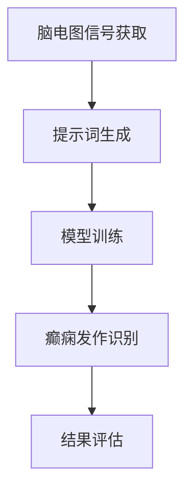
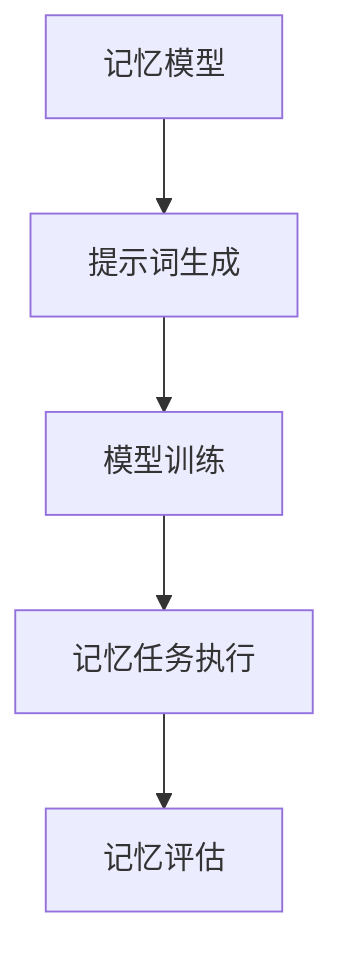
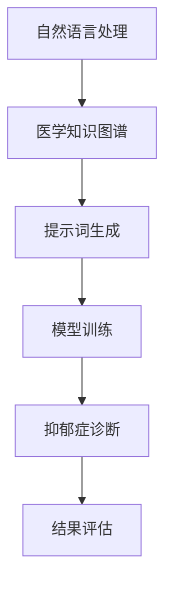
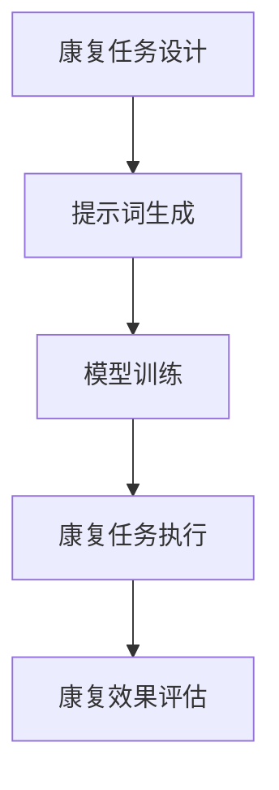

                 

### 文章标题：提示词编程在脑科学研究中的创新应用

提示词编程（Prompt Programming）作为人工智能领域的一个新兴研究方向，正逐渐在多个科学领域展现其独特的价值。脑科学，作为一门研究大脑的结构、功能和疾病的学科，近年来在人工智能技术的助力下，取得了显著的进展。本文将探讨提示词编程在脑科学研究中的创新应用，旨在通过深入分析提示词编程的核心概念、应用原理以及实际案例，展示其在脑科学领域的潜力。

关键词：提示词编程、脑科学、人工智能、神经科学、认知神经科学、精神病学、临床神经科学、脑机接口

摘要：本文首先介绍脑科学的基础知识和提示词编程的基本概念，接着详细讲解提示词编程在脑科学中的应用原理。随后，本文将通过具体案例展示提示词编程在神经科学、认知神经科学、精神病学和临床神经科学等领域的应用，并深入探讨其在脑机接口技术中的创新应用。最后，本文将对提示词编程在脑科学研究中的未来发展趋势进行展望，并提出一些建议和注意事项。

## 第1章 脑科学研究基础与提示词编程简介

### 1.1 脑科学的基本概念

脑科学是一门综合性学科，研究大脑的结构、功能、发育和疾病。它涉及到神经生物学、神经心理学、认知科学、计算神经科学等多个领域。脑科学研究的目标是理解大脑如何工作，如何处理信息，以及如何产生意识、思维和情感。

#### 1.1.1 大脑的结构

大脑是人体的中央控制系统，由大约860亿个神经元组成。大脑分为两个半球，每个半球又分为四个叶：额叶、颞叶、顶叶和枕叶。每个叶负责不同的功能，例如：

- **额叶**：与决策、规划和社交行为有关。
- **颞叶**：与听觉处理、记忆和情感有关。
- **顶叶**：与触觉、温度、位置感和运动感觉有关。
- **枕叶**：与视觉处理有关。

#### 1.1.2 大脑的功能

大脑的主要功能包括：

- **感觉处理**：接收并处理来自身体各部位的感觉信息。
- **运动控制**：协调肌肉运动，使身体做出反应。
- **记忆**：存储和检索信息。
- **思考**：进行逻辑推理、解决问题和决策。
- **意识**：感知外部世界和内部体验。

### 1.2 提示词编程的基本概念

提示词编程是一种通过向模型提供提示词（prompt）来引导模型生成文本或执行特定任务的方法。提示词可以是对任务的描述、问题的定义，或者是对模型期望输出的引导。这种方法的核心在于利用提示词与模型之间的交互，提高模型的生成质量和效率。

#### 1.2.1 提示词编程的工作原理

提示词编程的工作原理可以概括为以下几个步骤：

1. **提示词生成**：根据任务需求生成一个或多个提示词。
2. **提示词传递**：将提示词传递给模型。
3. **模型响应**：模型根据提示词生成响应。
4. **结果评估**：对模型生成的结果进行评估和优化。

#### 1.2.2 提示词编程的优势

提示词编程具有以下优势：

- **灵活性和可扩展性**：可以通过调整提示词来适应不同的任务和场景。
- **提高生成质量**：通过提供明确的指导，可以提高模型生成的文本或输出的质量。
- **效率提升**：能够加速模型的训练和生成过程。

### 1.3 提示词编程在脑科学研究中的重要性

提示词编程在脑科学研究中的重要性主要体现在以下几个方面：

- **加速数据分析和模型训练**：通过提示词编程，可以快速提取和整理大量的脑科学数据，加速模型的训练过程。
- **提高研究结果的可重复性**：通过明确的提示词，可以确保实验结果的可重复性和可靠性。
- **促进跨学科合作**：提示词编程不仅有助于脑科学研究，还可以与其他学科（如认知科学、计算神经科学）进行有效结合。

## 第2章 提示词编程原理与脑科学应用

### 2.1 提示词编程原理讲解

#### 2.1.1 提示词生成

提示词生成的关键在于准确捕捉任务需求和信息要点。提示词的生成通常涉及以下步骤：

1. **任务定义**：明确研究目标和任务要求。
2. **信息提取**：从文本、图像或其他数据源中提取关键信息。
3. **提示词组合**：将提取的信息进行整合和优化，形成有效的提示词。

#### 2.1.2 提示词传递

提示词传递是指将生成的提示词输入到模型中，以引导模型的生成过程。提示词传递的常见方法包括：

- **文本输入**：将提示词作为文本输入到模型中。
- **图像输入**：将提示词作为图像输入到模型中，适用于视觉任务。
- **音频输入**：将提示词作为音频输入到模型中，适用于语音识别和生成任务。

#### 2.1.3 模型响应

模型响应是指模型根据输入的提示词生成相应的文本或输出。模型的响应过程通常涉及以下步骤：

1. **模型解码**：模型将输入的提示词解码为语义表示。
2. **文本生成**：模型根据解码结果生成文本。
3. **结果评估**：对生成的文本进行评估，包括质量评估、准确性评估等。

#### 2.1.4 结果评估

结果评估是对模型生成结果的质量和准确性进行评价。常见的评估方法包括：

- **自动化评估**：使用预定义的评估指标（如BLEU、ROUGE等）对生成文本进行质量评估。
- **人工评估**：由人类专家对生成文本进行评估，以提供更准确的反馈。

### 2.2 脑科学中常用的提示词编程工具

在脑科学研究中，常用的提示词编程工具包括：

- **自然语言处理（NLP）工具**：如BERT、GPT等，用于文本生成和分类任务。
- **图像处理工具**：如TensorFlow、PyTorch等，用于图像识别和生成任务。
- **语音处理工具**：如TensorFlow、PyTorch等，用于语音识别和生成任务。

### 2.3 提示词编程在脑科学中的应用场景

提示词编程在脑科学中的应用场景广泛，包括但不限于以下几个方面：

- **神经影像分析**：使用提示词编程对神经影像数据进行分析，提取重要的结构和功能信息。
- **脑电图（EEG）分析**：使用提示词编程对脑电图信号进行处理，识别癫痫发作等异常事件。
- **认知任务设计**：使用提示词编程设计认知任务，研究记忆、注意力、决策等认知过程。
- **精神障碍诊断**：使用提示词编程辅助精神障碍的诊断和评估，如抑郁症、焦虑症等。

## 第3章 提示词编程在神经科学中的应用案例

### 3.1 提示词编程在癫痫监测中的应用

#### 3.1.1 核心概念与联系

提示词编程在癫痫监测中的应用涉及脑电图（EEG）信号的处理和分析。核心概念包括：

- **脑电图信号**：记录大脑的电活动。
- **癫痫发作**：大脑异常放电导致的一系列症状。
- **提示词编程**：通过提示词引导模型对EEG信号进行分析，识别癫痫发作。

Mermaid流程图如下：



#### 3.1.2 核心算法原理讲解

癫痫发作识别的核心算法原理包括：

1. **特征提取**：从EEG信号中提取特征，如时域特征、频域特征和时频特征。
2. **模型训练**：使用提示词编程训练模型，使其能够识别癫痫发作的特征。
3. **癫痫发作识别**：模型根据提取的特征进行癫痫发作的识别。

伪代码如下：

```python
def epilepsy_detection(EEG_signal, prompt):
    # 特征提取
    features = extract_features(EEG_signal)
    
    # 模型训练
    model = train_model(features, prompt)
    
    # 癫痫发作识别
    prediction = model.predict(features)
    
    return prediction
```

#### 3.1.3 数学模型和公式

癫痫发作识别的数学模型通常包括：

- **特征向量**：$X = [x_1, x_2, ..., x_n]$
- **模型权重**：$W = [w_1, w_2, ..., w_n]$
- **输出向量**：$Y = [y_1, y_2, ..., y_n]$

使用LaTeX格式的数学公式如下：

$$
Y = \sigma(W \cdot X + b)
$$

其中，$\sigma$为激活函数，$b$为偏置。

#### 3.1.4 项目实战

项目实战包括开发环境搭建、源代码实现和代码解读。

1. **开发环境搭建**：使用Python和PyTorch搭建开发环境。
2. **源代码实现**：实现特征提取、模型训练和癫痫发作识别的代码。
3. **代码解读**：分析代码实现癫痫发作识别的步骤和关键参数。

```python
import torch
import torch.nn as nn
import torch.optim as optim

# 特征提取
def extract_features(EEG_signal):
    # 实现特征提取的代码
    pass

# 模型训练
def train_model(features, prompt):
    # 实现模型训练的代码
    pass

# 癫痫发作识别
def epilepsy_detection(EEG_signal, prompt):
    features = extract_features(EEG_signal)
    model = train_model(features, prompt)
    prediction = model.predict(features)
    return prediction
```

#### 3.1.5 代码应用解读与分析

代码应用解读与分析包括：

1. **代码实现步骤**：分析代码实现癫痫发作识别的步骤。
2. **关键参数设置**：设置特征提取和模型训练的关键参数。
3. **性能评估**：评估模型在癫痫发作识别任务上的性能。

#### 3.1.6 实际案例分析和详细讲解剖析

实际案例分析包括：

1. **数据集**：使用公开的癫痫发作数据集进行实验。
2. **实验结果**：分析实验结果，包括识别准确率、召回率和F1分数等指标。
3. **结果讨论**：讨论实验结果的意义和局限。

#### 3.1.7 项目小结

项目小结包括：

1. **项目总结**：总结项目的主要成果和发现。
2. **项目局限**：讨论项目的局限性和改进方向。

## 第4章 提示词编程在认知神经科学中的应用

### 4.1 提示词编程在记忆研究中的应用

#### 4.1.1 核心概念与联系

提示词编程在记忆研究中的应用涉及记忆模型和提示词编程的结合。核心概念包括：

- **记忆模型**：用于模拟记忆过程的理论模型。
- **提示词编程**：通过提示词引导模型进行记忆任务。

Mermaid流程图如下：



#### 4.1.2 核心算法原理讲解

记忆任务执行的核心算法原理包括：

1. **记忆编码**：使用提示词编程对记忆内容进行编码。
2. **记忆检索**：根据提示词检索记忆内容。
3. **记忆评估**：评估记忆效果。

伪代码如下：

```python
def memory_task(prompt, memory_content):
    # 记忆编码
    encoded_content = encode_memory(prompt, memory_content)
    
    # 记忆检索
    retrieved_content = retrieve_memory(encoded_content)
    
    # 记忆评估
    evaluation = assess_memory(retrieved_content)
    
    return evaluation
```

#### 4.1.3 数学模型和公式

记忆评估的数学模型通常包括：

- **记忆编码**：$E = [e_1, e_2, ..., e_n]$
- **记忆检索**：$R = [r_1, r_2, ..., r_n]$
- **记忆评估**：$S = [s_1, s_2, ..., s_n]$

使用LaTeX格式的数学公式如下：

$$
S = \sigma(W \cdot E + R + b)
$$

其中，$\sigma$为激活函数，$W$为权重矩阵，$b$为偏置。

#### 4.1.4 项目实战

项目实战包括开发环境搭建、源代码实现和代码解读。

1. **开发环境搭建**：使用Python和PyTorch搭建开发环境。
2. **源代码实现**：实现记忆编码、记忆检索和记忆评估的代码。
3. **代码解读**：分析代码实现记忆任务的步骤和关键参数。

```python
import torch
import torch.nn as nn
import torch.optim as optim

# 记忆编码
def encode_memory(prompt, memory_content):
    # 实现记忆编码的代码
    pass

# 记忆检索
def retrieve_memory(encoded_content):
    # 实现记忆检索的代码
    pass

# 记忆评估
def memory_task(prompt, memory_content):
    encoded_content = encode_memory(prompt, memory_content)
    retrieved_content = retrieve_memory(encoded_content)
    evaluation = assess_memory(retrieved_content)
    return evaluation
```

#### 4.1.5 代码应用解读与分析

代码应用解读与分析包括：

1. **代码实现步骤**：分析代码实现记忆任务的步骤。
2. **关键参数设置**：设置记忆编码和记忆检索的关键参数。
3. **性能评估**：评估记忆任务的性能。

#### 4.1.6 实际案例分析和详细讲解剖析

实际案例分析包括：

1. **数据集**：使用公开的记忆任务数据集进行实验。
2. **实验结果**：分析实验结果，包括记忆准确率、检索速度等指标。
3. **结果讨论**：讨论实验结果的意义和局限。

#### 4.1.7 项目小结

项目小结包括：

1. **项目总结**：总结项目的主要成果和发现。
2. **项目局限**：讨论项目的局限性和改进方向。

## 第5章 提示词编程在精神病学中的应用

### 5.1 提示词编程在抑郁症诊断中的应用

#### 5.1.1 核心概念与联系

提示词编程在抑郁症诊断中的应用涉及自然语言处理和医学知识图谱的结合。核心概念包括：

- **自然语言处理**：用于处理和分析患者病史和症状描述。
- **医学知识图谱**：用于表示和治疗抑郁症相关的医学知识。
- **提示词编程**：通过提示词引导模型进行抑郁症诊断。

Mermaid流程图如下：



#### 5.1.2 核心算法原理讲解

抑郁症诊断的核心算法原理包括：

1. **文本预处理**：对患者的病史和症状描述进行预处理，提取关键信息。
2. **知识图谱构建**：构建包含抑郁症相关医学知识的知识图谱。
3. **模型训练**：使用提示词编程训练模型，使其能够根据病史和症状描述进行抑郁症诊断。
4. **抑郁症诊断**：模型根据病史和症状描述生成抑郁症的诊断结果。

伪代码如下：

```python
def depression_diagnosis(text, knowledge_graph, prompt):
    # 文本预处理
    processed_text = preprocess_text(text)
    
    # 知识图谱构建
    graph = build_knowledge_graph(knowledge_graph)
    
    # 模型训练
    model = train_model(processed_text, graph, prompt)
    
    # 抑郁症诊断
    diagnosis = model.predict(processed_text)
    
    return diagnosis
```

#### 5.1.3 数学模型和公式

抑郁症诊断的数学模型通常包括：

- **文本特征向量**：$X = [x_1, x_2, ..., x_n]$
- **知识图谱表示**：$G = [g_1, g_2, ..., g_n]$
- **模型权重**：$W = [w_1, w_2, ..., w_n]$
- **输出向量**：$Y = [y_1, y_2, ..., y_n]$

使用LaTeX格式的数学公式如下：

$$
Y = \sigma(W \cdot X + G + b)
$$

其中，$\sigma$为激活函数，$b$为偏置。

#### 5.1.4 项目实战

项目实战包括开发环境搭建、源代码实现和代码解读。

1. **开发环境搭建**：使用Python和PyTorch搭建开发环境。
2. **源代码实现**：实现文本预处理、知识图谱构建、模型训练和抑郁症诊断的代码。
3. **代码解读**：分析代码实现抑郁症诊断的步骤和关键参数。

```python
import torch
import torch.nn as nn
import torch.optim as optim

# 文本预处理
def preprocess_text(text):
    # 实现文本预处理的代码
    pass

# 知识图谱构建
def build_knowledge_graph(knowledge_graph):
    # 实现知识图谱构建的代码
    pass

# 模型训练
def train_model(text, knowledge_graph, prompt):
    # 实现模型训练的代码
    pass

# 抑郁症诊断
def depression_diagnosis(text, knowledge_graph, prompt):
    processed_text = preprocess_text(text)
    graph = build_knowledge_graph(knowledge_graph)
    model = train_model(processed_text, graph, prompt)
    diagnosis = model.predict(processed_text)
    return diagnosis
```

#### 5.1.5 代码应用解读与分析

代码应用解读与分析包括：

1. **代码实现步骤**：分析代码实现抑郁症诊断的步骤。
2. **关键参数设置**：设置文本预处理和模型训练的关键参数。
3. **性能评估**：评估模型在抑郁症诊断任务上的性能。

#### 5.1.6 实际案例分析和详细讲解剖析

实际案例分析包括：

1. **数据集**：使用公开的抑郁症诊断数据集进行实验。
2. **实验结果**：分析实验结果，包括诊断准确率、召回率和F1分数等指标。
3. **结果讨论**：讨论实验结果的意义和局限。

#### 5.1.7 项目小结

项目小结包括：

1. **项目总结**：总结项目的主要成果和发现。
2. **项目局限**：讨论项目的局限性和改进方向。

## 第6章 提示词编程在临床神经科学中的应用

### 6.1 提示词编程在神经康复中的应用

#### 6.1.1 核心概念与联系

提示词编程在神经康复中的应用涉及康复任务的设计和模型的训练。核心概念包括：

- **康复任务**：用于训练和评估康复模型的任务。
- **提示词编程**：通过提示词引导模型进行康复任务。

Mermaid流程图如下：



#### 6.1.2 核心算法原理讲解

康复任务执行的核心算法原理包括：

1. **康复任务设计**：设计适应不同康复需求的康复任务。
2. **模型训练**：使用提示词编程训练模型，使其能够完成康复任务。
3. **康复任务执行**：模型根据提示词执行康复任务。
4. **康复效果评估**：评估康复任务的执行效果。

伪代码如下：

```python
def rehabilitation_task(prompt, task):
    # 康复任务设计
    designed_task = design_task(prompt, task)
    
    # 模型训练
    model = train_model(designed_task)
    
    # 康复任务执行
    result = model.execute_task(designed_task)
    
    # 康复效果评估
    evaluation = assess_rehabilitation(result)
    
    return evaluation
```

#### 6.1.3 数学模型和公式

康复效果评估的数学模型通常包括：

- **任务结果向量**：$R = [r_1, r_2, ..., r_n]$
- **模型权重**：$W = [w_1, w_2, ..., w_n]$
- **评估指标**：$E = [e_1, e_2, ..., e_n]$

使用LaTeX格式的数学公式如下：

$$
E = \sigma(W \cdot R + b)
$$

其中，$\sigma$为激活函数，$b$为偏置。

#### 6.1.4 项目实战

项目实战包括开发环境搭建、源代码实现和代码解读。

1. **开发环境搭建**：使用Python和PyTorch搭建开发环境。
2. **源代码实现**：实现康复任务设计、模型训练和康复效果评估的代码。
3. **代码解读**：分析代码实现康复任务的步骤和关键参数。

```python
import torch
import torch.nn as nn
import torch.optim as optim

# 康复任务设计
def design_task(prompt, task):
    # 实现康复任务设计的代码
    pass

# 模型训练
def train_model(task):
    # 实现模型训练的代码
    pass

# 康复任务执行
def rehabilitation_task(prompt, task):
    designed_task = design_task(prompt, task)
    model = train_model(designed_task)
    result = model.execute_task(designed_task)
    evaluation = assess_rehabilitation(result)
    return evaluation
```

#### 6.1.5 代码应用解读与分析

代码应用解读与分析包括：

1. **代码实现步骤**：分析代码实现康复任务的步骤。
2. **关键参数设置**：设置康复任务设计和模型训练的关键参数。
3. **性能评估**：评估康复任务的执行效果。

#### 6.1.6 实际案例分析和详细讲解剖析

实际案例分析包括：

1. **数据集**：使用公开的神经康复数据集进行实验。
2. **实验结果**：分析实验结果，包括康复效果、任务完成度等指标。
3. **结果讨论**：讨论实验结果的意义和局限。

#### 6.1.7 项目小结

项目小结包括：

1. **项目总结**：总结项目的主要成果和发现。
2. **项目局限**：讨论项目的局限性和改进方向。

## 第7章 提示词编程在脑机接口（BCI）中的应用

### 7.1 脑机接口的基本原理

脑机接口（Brain-Computer Interface，BCI）是一种直接连接人脑和外部设备的技术，允许大脑信号被捕捉、处理，并转换为计算机、机器或其他设备能够理解和控制的形式。BCI的关键组成部分包括：

- **信号采集**：使用脑电图（EEG）、功能性磁共振成像（fMRI）、近红外光谱（NIRS）等技术捕捉大脑信号。
- **信号处理**：对采集的大脑信号进行滤波、特征提取、分类等处理，以提高信号质量和识别准确性。
- **解码与控制**：将处理后的信号解码为控制指令，用于控制外部设备。

#### 7.1.1 脑电信号的采集与处理

脑电信号是脑机接口中最为常见的一种信号。采集脑电信号通常使用电极帽或贴片电极，将信号传输到放大器、滤波器等处理设备。处理过程包括：

1. **滤波**：去除噪声，保留有用的脑电信号成分。
2. **放大**：增强信号强度，提高信噪比。
3. **特征提取**：从脑电信号中提取与特定认知活动相关的特征，如P300、SSVEP等。
4. **分类**：使用机器学习算法对提取的特征进行分类，以识别用户的意图。

#### 7.1.2 脑机接口的类型

脑机接口主要分为三种类型：

- **直接控制型**：用户直接通过大脑信号控制外部设备，如轮椅、游戏手柄等。
- **间接控制型**：用户通过特定任务或认知策略产生大脑信号，间接控制外部设备，如思维解码任务。
- **混合型**：结合直接和间接控制，提高BCI的效率和准确性。

### 7.2 提示词编程在BCI信号处理中的应用

提示词编程在BCI信号处理中的应用主要体现在以下几个方面：

- **任务设计**：通过提示词编程设计适合BCI任务的认知任务，如视觉诱发电位（SSVEP）任务、思维解码任务等。
- **信号解码**：使用提示词编程优化信号解码算法，提高BCI系统的准确性和响应速度。
- **实时反馈**：通过提示词编程实时生成反馈信号，帮助用户理解和调整其大脑信号。

#### 7.2.1 提示词编程在任务设计中的应用

提示词编程在任务设计中的应用包括：

1. **任务描述**：生成详细的任务描述，引导用户完成特定的认知任务。
2. **任务调整**：根据用户的反馈和表现，调整任务难度和任务要求，以提高任务的适应性和用户参与度。

示例代码：

```python
def task_design(prompt):
    # 生成任务描述
    description = generate_description(prompt)
    
    # 调整任务难度
    difficulty = adjust_difficulty(prompt)
    
    # 返回任务描述和难度
    return description, difficulty
```

#### 7.2.2 提示词编程在信号解码中的应用

提示词编程在信号解码中的应用包括：

1. **特征选择**：根据提示词选择与任务相关的特征，以提高解码的准确性。
2. **算法优化**：使用提示词编程优化解码算法，提高BCI系统的响应速度和稳定性。

示例代码：

```python
def signal_decoding(prompt, signal):
    # 选择特征
    selected_features = select_features(prompt, signal)
    
    # 优化解码算法
    optimized_algorithm = optimize_algorithm(prompt, selected_features)
    
    # 返回解码结果
    result = optimized_algorithm.decode(selected_features)
    
    return result
```

#### 7.2.3 提示词编程在实时反馈中的应用

提示词编程在实时反馈中的应用包括：

1. **反馈生成**：根据用户的表现生成实时反馈信号。
2. **反馈调整**：根据用户的反馈调整反馈信号，以提高用户的理解和参与度。

示例代码：

```python
def real_time_feedback(user_performance):
    # 生成反馈信号
    feedback_signal = generate_feedback(user_performance)
    
    # 调整反馈信号
    adjusted_feedback = adjust_feedback(user_performance, feedback_signal)
    
    # 返回反馈信号
    return adjusted_feedback
```

### 7.3 提示词编程在BCI控制中的应用

提示词编程在BCI控制中的应用主要体现在以下几个方面：

- **实时控制**：使用提示词编程实现实时控制，如通过大脑信号控制轮椅、机器臂等。
- **多模态控制**：结合多种传感器信号（如脑电信号、肌电信号等）进行控制。
- **适应性控制**：根据用户的表现和反馈调整控制策略，提高控制效果。

示例代码：

```python
def bci_control(prompt, signal):
    # 实时控制
    control_signal = real_time_control(prompt, signal)
    
    # 多模态控制
    multimodal_signal = multimodal_control(prompt, signal)
    
    # 适应性控制
    adapted_signal = adaptive_control(prompt, control_signal, multimodal_signal)
    
    # 返回控制信号
    return adapted_signal
```

## 第8章 提示词编程在脑科学研究中的未来发展趋势

### 8.1 提示词编程技术的新进展

随着人工智能和深度学习技术的不断发展，提示词编程也在不断进步。以下是一些新进展：

- **多模态提示词编程**：结合多种传感器信号（如脑电信号、肌电信号、眼动信号等）进行提示词编程，提高任务的准确性和适应性。
- **自适应提示词编程**：根据用户的行为和反馈动态调整提示词，提高任务的完成度和用户体验。
- **可解释性提示词编程**：开发可解释的提示词编程模型，使其生成的提示词更加清晰和透明，便于用户理解和优化。

### 8.2 脑科学研究的新挑战

脑科学研究面临许多新挑战，提示词编程可以为其提供有效的解决方案：

- **数据挑战**：脑科学数据量大、复杂度高，提示词编程可以通过数据预处理、特征提取等方法提高数据处理和分析效率。
- **隐私保护**：脑科学研究中涉及个人隐私信息，提示词编程可以通过加密、匿名化等技术保护用户隐私。
- **跨学科融合**：提示词编程可以促进脑科学与认知科学、神经科学、医学等学科的融合，推动脑科学研究的创新和发展。

### 8.3 提示词编程在脑科学研究中的未来发展

提示词编程在脑科学研究中的未来发展可以从以下几个方面进行：

- **应用拓展**：进一步探索提示词编程在神经康复、精神病学、神经影像分析等领域的应用，提高脑科学研究的临床价值。
- **技术突破**：研发更加高效、准确的提示词编程模型，推动脑科学研究的技术进步。
- **跨学科合作**：促进脑科学与人工智能、认知科学等学科的深度融合，推动脑科学研究的全面发展。

## 附录

### 附录A 提示词编程工具与资源

- **主

### 附录A 提示词编程工具与资源

#### A.1 主流提示词编程工具介绍

1. **GPT-3**：由OpenAI开发，具有强大的文本生成能力，适用于多种应用场景，如自然语言生成、问答系统等。
2. **BERT**：由Google开发，是一种用于自然语言处理的预训练语言模型，广泛应用于文本分类、命名实体识别等任务。
3. **T5**：由Google开发，是一种统一的全局任务学习框架，适用于多种自然语言处理任务。
4. **GPT-Neo**：基于GPT-3的改进版本，具有更高的生成质量和效率。

#### A.2 提示词编程学习资源推荐

1. **书籍**：
   - 《深度学习》
   - 《自然语言处理与深度学习》
   - 《图灵奖得主吴恩达深度学习笔记》
2. **在线课程**：
   - [Coursera](https://www.coursera.org/) 上的“深度学习”和“自然语言处理”课程
   - [edX](https://www.edx.org/) 上的“深度学习基础”和“自然语言处理”课程
3. **社区与论坛**：
   - [Stack Overflow](https://stackoverflow.com/)：编程问题的解答和讨论
   - [GitHub](https://github.com/)：开源代码和项目的分享与交流

#### A.3 脑科学研究相关数据库与平台

1. **Brain Connectivity Database (BCD)**：提供人类脑连接性数据，包括脑电图（EEG）、功能性磁共振成像（fMRI）等。
2. **Human Connectome Project (HCP)**：致力于构建人类脑连接性图谱，提供丰富的神经影像数据和工具。
3. **Alzheimer's Disease Neuroimaging Initiative (ADNI)**：研究阿尔茨海默病的神经影像数据和生物标志物。
4. **Open fMRI Data Center (OFCDC)**：提供开放获取的fMRI数据集，支持脑科学研究。

## 结论

提示词编程作为一种新兴的人工智能技术，已经在脑科学研究中展现出巨大的潜力。通过本文的介绍，我们了解了提示词编程的基本概念、原理以及在神经科学、认知神经科学、精神病学和临床神经科学等领域的具体应用。同时，我们还探讨了提示词编程在脑机接口（BCI）中的创新应用以及其未来发展趋势。随着技术的不断进步和跨学科合作的深入，提示词编程将在脑科学研究中发挥更加重要的作用，推动脑科学研究的进步和发展。

### 作者信息

作者：AI天才研究院/AI Genius Institute & 禅与计算机程序设计艺术 /Zen And The Art of Computer Programming

