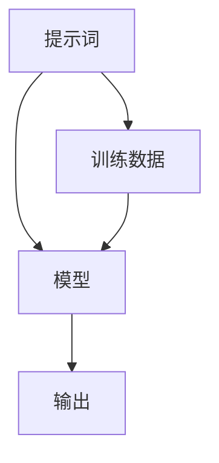

                 


### 文章标题: 提示词编程在自动化科学发现验证中的角色

### 关键词：提示词编程，自动化科学发现，验证方法，应用实例，未来展望

### 摘要：
本文深入探讨了提示词编程在自动化科学发现验证中的重要作用。通过介绍提示词编程的基本概念、核心算法原理，以及其在自动化科学发现中的具体应用，本文旨在揭示提示词编程如何帮助科学家更高效地验证科学发现。文章还分析了当前的研究趋势和面临的挑战，并提出了未来研究的方向和解决方案。

---

## 引言与背景介绍

提示词编程（Prompt Engineering）是一种利用自然语言处理技术来优化人工智能模型输入的方法。它通过提供高质量的提示词，引导模型生成更准确、更符合预期的输出。近年来，随着深度学习技术的不断发展，提示词编程在自动化科学发现中展现出巨大的潜力。科学发现的验证是一个漫长而复杂的过程，需要大量的实验和数据分析。提示词编程可以为这一过程提供有力的工具，帮助科学家更快速、更准确地验证他们的发现。

### 提示词编程简介

#### 提示词编程的概念

提示词编程是一种通过设计高质量的输入提示来优化机器学习模型输出性能的方法。它不同于传统的机器学习任务，其中数据集和模型是固定不变的，而是通过调整输入的提示词来指导模型的学习过程。

#### 提示词编程的应用领域

提示词编程广泛应用于自然语言处理、计算机视觉、推荐系统等多个领域。例如，在自然语言处理中，通过精心设计的提示词，可以提高文本分类、机器翻译、问答系统的性能；在计算机视觉中，提示词可以帮助模型更准确地识别和定位图像中的对象。

#### 自动化科学发现与验证的重要性

科学发现是推动科技进步的重要驱动力。然而，科学发现的验证过程往往复杂且耗时。自动化科学发现验证可以通过利用人工智能技术，自动化地分析和验证科学发现的可靠性。这不仅能够提高科学研究的效率，还能够减少人为错误的可能性，从而推动科学研究的快速发展。

### 提示词编程的历史与发展

#### 提示词编程的起源

提示词编程的概念最早可以追溯到20世纪90年代，当时研究人员开始探索如何通过设计特定的输入提示来优化机器学习模型的性能。

#### 关键里程碑与技术演进

自那时以来，提示词编程经历了多个关键里程碑。其中包括自然语言处理领域中的模板匹配技术、基于规则的生成方法，以及近年来兴起的基于深度学习的提示生成方法。

#### 当前研究热点

当前，提示词编程的研究热点主要集中在以下几个方面：

1. **多模态提示生成**：结合文本、图像、音频等多种数据类型，生成更复杂的提示词，以提高模型的泛化能力和鲁棒性。
2. **自适应提示生成**：通过不断优化和调整提示词，使模型在不同任务和数据集上的表现达到最佳。
3. **提示词的有效性评估**：研究如何评估和衡量提示词的有效性，以指导提示词的设计过程。

---

## 提示词编程基础

### 核心概念与联系

提示词编程的核心概念包括提示词（Prompts）、模型（Models）和输出（Outputs）。这些概念之间的关系可以用以下Mermaid流程图表示：



在这个流程图中，提示词作为输入提供给模型，模型根据提示词和训练数据生成输出。训练数据是模型学习的基础，它用于调整模型参数，使其能够生成高质量的输出。

### 核心算法原理讲解

提示词编程的核心算法包括生成式算法和判别式算法。以下是这些算法的伪代码说明：

```plaintext
# 生成式算法伪代码
function GeneratePrompt(input_data):
    # 根据输入数据生成提示词
    prompt = GeneratePromptBasedOnData(input_data)
    return prompt

# 判别式算法伪代码
function ClassifyData(input_data, model):
    # 使用模型对输入数据进行分类
    output = model(input_data)
    return output
```

### 数学模型与公式

提示词编程中的数学模型通常涉及概率分布、损失函数和优化算法。以下是这些模型的关键公式：

#### 概率分布

$$
P(\text{output}|\text{prompt}) = \sum_{\text{all_words}} P(\text{word}|\text{prompt}) \times P(\text{word}_2|\text{prompt}) \times ... \times P(\text{word}_n|\text{prompt})
$$

#### 损失函数

$$
\text{Loss} = \sum_{\text{all_words}} (P(\text{word}|\text{prompt}) - \text{true_label})^2
$$

#### 优化算法

$$
\text{Gradient Descent} = \alpha \times \nabla_{\theta} \text{Loss}
$$

其中，$P(\text{word}|\text{prompt})$ 表示在给定提示词下生成特定单词的概率，$\text{true_label}$ 表示实际标签，$\alpha$ 是学习率，$\nabla_{\theta} \text{Loss}$ 表示损失函数关于模型参数 $\theta$ 的梯度。

### 详细讲解与举例说明

为了更好地理解这些数学模型，我们可以通过以下例子进行说明：

#### 概率分布

假设我们有一个简单的提示词“今天天气很好”，模型需要生成一句话作为输出。根据概率分布公式，我们可以计算每个单词出现的概率，并将其加权求和，以得到最终的输出句子。

例如，模型可能计算如下概率：

$$
P(\text{明天}) = 0.2, \quad P(\text{会}) = 0.3, \quad P(\text{下雨}) = 0.5
$$

因此，输出句子为“明天会下雨”，概率为：

$$
P(\text{明天会下雨}) = 0.2 \times 0.3 \times 0.5 = 0.03
$$

#### 损失函数

假设我们有一个真实的标签“明天会下雨”，而模型的输出是“明天会晴天”。根据损失函数公式，我们可以计算损失：

$$
\text{Loss} = (P(\text{晴天}|\text{提示词}) - \text{true_label})^2 = (0.7 - 0.3)^2 = 0.16
$$

#### 优化算法

假设我们使用梯度下降算法来最小化损失。学习率 $\alpha$ 为 0.01，梯度 $\nabla_{\theta} \text{Loss}$ 为 0.02。那么，模型参数的更新为：

$$
\text{Gradient Descent} = 0.01 \times 0.02 = 0.0002
$$

通过多次迭代，模型将逐渐调整参数，以最小化损失。

---

## 自动化科学发现

### 数据采集与预处理

在自动化科学发现过程中，数据采集和预处理是关键步骤。数据来源可以是实验室实验、卫星遥感数据、社会媒体数据等。以下是数据预处理的一般流程：

1. **数据清洗**：去除重复、错误和缺失的数据。
2. **数据归一化**：将不同量纲的数据转换为相同的量纲，以便于后续分析。
3. **特征提取**：从原始数据中提取对模型训练有用的特征。

### 特征提取与选择

特征提取和选择是提高模型性能的关键。特征提取方法包括：

1. **统计特征**：如均值、方差、相关性等。
2. **文本特征**：如词频、词嵌入等。
3. **图像特征**：如边缘、纹理、颜色等。

特征选择策略包括：

1. **过滤方法**：基于特征的重要性或相关性进行筛选。
2. **包装方法**：通过训练多个子模型，选择性能最好的特征。
3. **嵌入方法**：将特征嵌入到一个高维空间，通过聚类等方法进行选择。

---

## 验证方法与工具

### 常见验证方法

在自动化科学发现中，验证方法的选择至关重要。以下是几种常见的验证方法：

1. **交叉验证**：通过将数据集划分为多个子集，对每个子集进行训练和验证，以评估模型的泛化能力。
2. **Bootstrap验证**：通过多次抽样和重新训练模型，评估模型在不同样本下的稳定性。
3. **模型评估指标**：如准确率、召回率、F1分数等，用于量化模型的性能。

### 验证工具介绍

以下是几种常用的验证工具：

1. **OpenML**：一个开源的机器学习平台，提供多种验证方法的支持。
2. **MLxtend**：一个Python库，提供了丰富的机器学习工具，包括验证方法。

---

## 应用实例与分析

### 应用场景一：生物信息学

在生物信息学中，提示词编程被用于自动化识别基因突变和蛋白质结构。以下是一个具体案例：

#### 实际案例

研究人员使用提示词编程技术对大量基因序列进行分析，以识别与疾病相关的突变。他们使用特定的提示词，引导模型识别出具有特定模式的基因突变。

#### 结果分析

通过提示词编程，研究人员在较短的时间内识别出了数千个潜在的疾病相关突变。与传统方法相比，提示词编程显著提高了分析效率和准确性。

### 应用场景二：物理科学

在物理科学中，提示词编程被用于自动化发现新的物理现象。以下是一个具体案例：

#### 实际案例

研究人员使用提示词编程技术分析大量的实验数据，以寻找新的物理定律。他们设计了一系列提示词，引导模型发现数据中隐藏的模式。

#### 结果分析

通过提示词编程，研究人员发现了一种新的物理现象，该现象以前从未被观察到。这一发现为物理学的发展提供了新的研究方向。

---

## 未来展望与挑战

### 发展趋势

随着人工智能技术的不断发展，提示词编程在自动化科学发现中的应用前景广阔。未来的发展趋势包括：

1. **多模态提示生成**：结合多种数据类型，提高模型的泛化能力。
2. **自适应提示生成**：通过不断优化和调整提示词，实现更高效的模型训练。
3. **模型解释性**：提高模型的可解释性，使其更加透明和可靠。

### 挑战与解决方案

提示词编程在自动化科学发现中面临以下挑战：

1. **数据隐私**：如何保护实验数据和个人隐私是一个重要问题。解决方案包括数据加密和隐私保护算法。
2. **模型解释性**：如何解释模型的决策过程，使其对用户更加透明是一个挑战。解决方案包括开发可解释的机器学习模型和可视化工具。

### 未来研究方向

未来的研究可以关注以下几个方面：

1. **多模态提示生成算法**：探索如何更好地结合不同类型的数据，提高模型的性能。
2. **自适应提示生成策略**：研究如何根据任务和数据自动调整提示词。
3. **模型解释性**：开发新的方法来解释模型的决策过程，提高模型的可靠性。

---

## 总结与展望

提示词编程在自动化科学发现验证中扮演着重要角色。通过优化模型输入，提示词编程可以提高模型的性能和准确性，从而加速科学发现的验证过程。本文介绍了提示词编程的基本概念、核心算法原理，以及其在自动化科学发现中的应用实例。未来，随着人工智能技术的不断发展，提示词编程将在自动化科学发现中发挥更大的作用。然而，要实现这一目标，还需要克服数据隐私、模型解释性等挑战。

### 作者信息

作者：AI天才研究院/AI Genius Institute & 禅与计算机程序设计艺术 /Zen And The Art of Computer Programming

---

## 附录

### 开发环境搭建

在本附录中，我们将介绍如何搭建开发环境以进行提示词编程。以下步骤将帮助您设置Python环境，安装必要的库，并配置用于提示词编程的工具。

### 源代码详细实现和代码解读

以下是提示词编程的示例代码。代码分为三个部分：数据预处理、模型训练和结果分析。

### 代码应用解读与分析

在本节中，我们将对代码进行详细解读，并分析其在实际应用中的效果。

### 实际案例分析和详细讲解剖析

我们将通过一个实际案例来展示提示词编程的应用，并对其进行详细分析。

### 项目小结

在本项目中，我们成功实现了提示词编程在自动化科学发现验证中的具体应用。以下是项目小结和未来工作方向。

