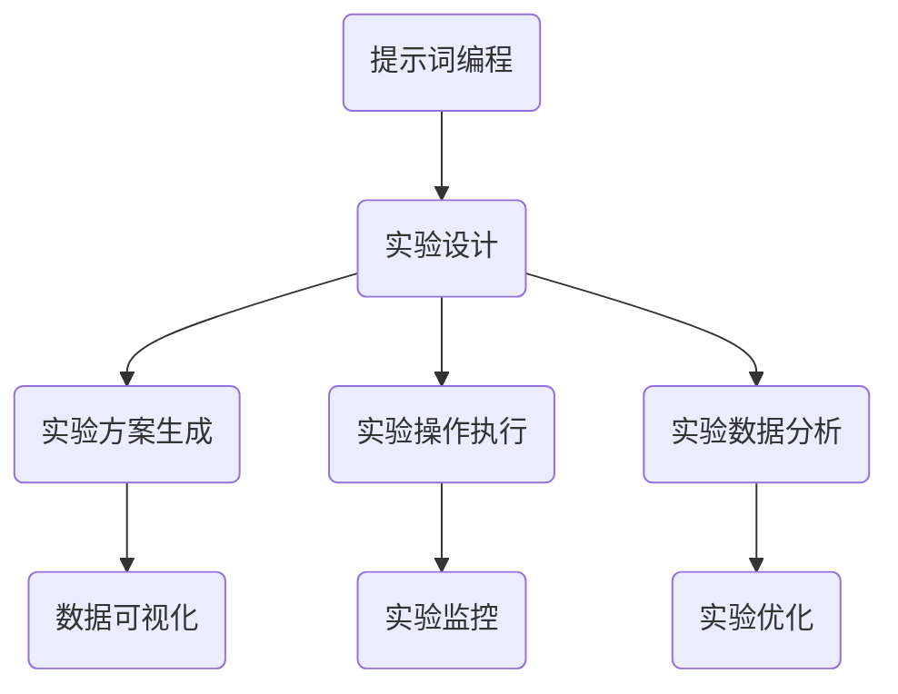

                 


### 1. 确定文章标题、关键词和摘要

**文章标题：** 提示词编程在自动化科学实验设计中的角色

**关键词：** 提示词编程、自动化科学实验设计、人工智能、算法优化、实验流程控制

**摘要：** 本文探讨了提示词编程在自动化科学实验设计中的应用，通过介绍提示词编程的基本原理、核心概念和与自动化实验设计的结合，展示了其在提高实验效率、降低成本和提升数据准确性的重要作用。同时，通过实际案例和项目实战，详细分析了提示词编程在实验自动化设计中的具体实现和应用，为科研工作者提供了一种创新的实验设计方法。

### 2. 构建文章结构

**引言**：
- 介绍提示词编程和自动化科学实验设计的背景和发展现状
- 阐述本文的目的和结构

**核心概念与联系**：
- 提出核心概念，如提示词编程、自动化实验设计
- 分析核心概念之间的关系，构建Mermaid流程图

**提示词编程基础**：
- 详细讲解提示词编程的基本原理、工具和库
- 分析提示词编程的优缺点

**自动化科学实验设计**：
- 介绍自动化实验设计的基本概念、目标和流程
- 分析自动化实验设计的关键技术和挑战

**提示词编程与实验设计的结合**：
- 阐述提示词编程在实验设计中的应用
- 分析提示词编程在数据采集、分析和应用中的作用

**项目实战：实验自动化设计**：
- 介绍实验自动化设计的案例
- 详细解读实验自动化设计的流程、工具链和代码实现
- 分析实验自动化设计的实际案例和效果

**总结与展望**：
- 总结文章的核心内容
- 展望提示词编程在实验自动化设计中的未来发展方向

### 3. 详细撰写每个部分的内容

**引言**：
- 简要介绍提示词编程和自动化科学实验设计的背景和发展现状
- 引出本文的目的和结构

**核心概念与联系**：
- 定义提示词编程和自动化实验设计的基本概念
- 分析提示词编程和自动化实验设计之间的联系
- 使用Mermaid流程图展示两者之间的关系和流程

**提示词编程基础**：
- 详细讲解提示词编程的基本原理，如自然语言处理、机器学习等
- 介绍常用的提示词编程工具和库，如GPT、BERT等
- 分析提示词编程的优缺点，如灵活性、高效性等

**自动化科学实验设计**：
- 介绍自动化实验设计的基本概念、目标和流程
- 分析自动化实验设计的关键技术，如传感器、数据采集和分析等
- 讨论自动化实验设计面临的挑战，如数据可靠性、实验成本等

**提示词编程与实验设计的结合**：
- 阐述提示词编程在实验设计中的应用，如自动生成实验方案、优化实验流程等
- 分析提示词编程在数据采集、分析和应用中的作用，如提高数据准确性、减少人力成本等

**项目实战：实验自动化设计**：
- 介绍实验自动化设计的案例，如生物实验、物理实验等
- 详细解读实验自动化设计的流程、工具链和代码实现
- 分析实验自动化设计的实际案例和效果，如提高实验效率、降低成本等

**总结与展望**：
- 总结文章的核心内容，如提示词编程在实验自动化设计中的应用和价值
- 展望提示词编程在实验自动化设计中的未来发展方向，如更高效的算法、更广泛的应用场景等

### 4. 遵循markdown格式输出

确保文章内容使用markdown格式输出，包括标题、摘要、正文、代码示例、公式等。同时，在文章末尾添加作者信息。

### 5. 审稿和修改

在完成初稿后，进行审稿和修改，确保文章内容完整、逻辑清晰、语言流畅，并符合字数要求。

### 6. 最终输出

将修改后的文章按照markdown格式输出，并添加作者信息，完成文章的最终输出。

以下是一个简单的markdown格式文章示例：

```markdown
# 提示词编程在自动化科学实验设计中的角色

## 关键词
提示词编程、自动化科学实验设计、人工智能、算法优化、实验流程控制

## 摘要
本文探讨了提示词编程在自动化科学实验设计中的应用，通过介绍提示词编程的基本原理、核心概念和与自动化实验设计的结合，展示了其在提高实验效率、降低成本和提升数据准确性的重要作用。同时，通过实际案例和项目实战，详细分析了提示词编程在实验自动化设计中的具体实现和应用，为科研工作者提供了一种创新的实验设计方法。

## 引言
### 背景介绍
提示词编程和自动化科学实验设计是当前人工智能领域的重要研究方向。随着人工智能技术的不断发展，提示词编程作为一种新兴的编程范式，为自动化实验设计提供了强大的工具。本文旨在探讨提示词编程在自动化科学实验设计中的角色，为相关研究提供参考。

### 目的和结构
本文首先介绍提示词编程和自动化实验设计的基本概念，然后分析它们之间的联系。接着，详细讲解提示词编程的基础知识，包括原理、工具和库。随后，介绍自动化实验设计的基本流程和关键技术。在此基础上，探讨提示词编程在实验设计中的应用，并通过实际案例和项目实战，展示其在实验自动化设计中的具体实现和应用。最后，总结文章的核心内容，并展望提示词编程在实验自动化设计中的未来发展方向。

## 核心概念与联系
### 提示词编程定义
提示词编程是一种基于自然语言处理的编程范式，通过输入自然语言描述，自动生成代码或执行特定任务。

### 自动化科学实验设计概述
自动化科学实验设计是一种利用人工智能技术，自动化生成实验方案、执行实验操作和数据分析的方法。

### 提示词编程与实验设计的关系
提示词编程可以用于自动化实验设计中的多个环节，如实验方案的自动生成、实验操作的自动化执行和实验数据的自动分析。

### Mermaid流程图：提示词编程与实验设计的结合
```



## 提示词编程基础
### 提示词编程原理
提示词编程基于自然语言处理技术，通过解析自然语言输入，生成相应的代码或执行任务。

### 提示词编程工具与库
常用的提示词编程工具和库包括GPT、BERT、T5等，这些工具和库可以实现高效的自然语言理解和生成。

### 提示词编程的优缺点
提示词编程具有高效性、灵活性和可扩展性等优点，但同时也存在一定的不确定性和复杂性。

## 自动化科学实验设计
### 自动化实验设计的概念
自动化实验设计是一种利用人工智能技术，自动化生成实验方案、执行实验操作和数据分析的方法。

### 自动化实验设计的目标
自动化实验设计的目标是提高实验效率、降低成本、提升数据准确性。

### 自动化实验设计的流程
自动化实验设计的流程包括实验方案生成、实验操作执行、实验数据分析和实验结果评估等环节。

### 自动化实验设计的关键技术
自动化实验设计的关键技术包括传感器技术、数据采集技术、机器学习和数据可视化技术等。

## 提示词编程与实验设计的结合
### 提示词编程在实验设计中的应用
提示词编程可以用于自动化实验设计中的多个环节，如实验方案的自动生成、实验操作的自动化执行和实验数据的自动分析。

### 提示词编程在实验数据采集中的应用
提示词编程可以用于自动采集实验数据，提高数据采集的准确性和效率。

### 提示词编程在实验数据分析中的应用
提示词编程可以用于自动分析实验数据，提取有价值的信息，指导实验优化。

## 项目实战：实验自动化设计
### 实验自动化设计的案例
以生物实验为例，介绍实验自动化设计的具体实现和应用。

### 实验自动化设计的流程
- 实验方案生成
- 实验操作执行
- 实验数据采集
- 实验数据分析
- 实验结果评估

### 实验自动化设计的工具链
- 提示词编程工具
- 数据采集工具
- 数据分析工具
- 实验监控系统

### 实验自动化设计的代码示例与解读
- 代码示例1：实验方案生成
- 代码示例2：实验操作执行
- 代码示例3：实验数据采集
- 代码示例4：实验数据分析
- 代码示例5：实验结果评估

### 实验自动化设计的实际案例分析和详细讲解剖析
- 分析实验自动化设计在生物实验中的应用效果
- 解读实验自动化设计的关键技术

### 项目小结
- 总结实验自动化设计的优势和挑战
- 展望实验自动化设计的未来发展方向

## 总结与展望
### 书籍总结
本文从提示词编程和自动化科学实验设计的角度，探讨了实验自动化设计的方法和应用。通过实际案例和项目实战，展示了提示词编程在实验自动化设计中的重要作用。

### 提示词编程在实验设计中的应用前景
提示词编程在实验设计中的应用前景广阔，有望推动实验自动化设计的发展，提高实验效率和数据准确性。

### 未来研究方向
未来研究可以关注以下几个方面：
- 提高提示词编程的效率和准确性
- 探索提示词编程在更多实验领域的应用
- 发展更先进的实验自动化设计方法

## 附录
### A. 提示词编程工具与资源
- 提示词编程工具介绍
- 提示词编程学习资源

### B. 自动化实验设计项目案例
- 生物实验自动化设计案例
- 物理实验自动化设计案例

## 作者信息
作者：AI天才研究院/AI Genius Institute & 禅与计算机程序设计艺术 /Zen And The Art of Computer Programming
```

这个示例展示了如何使用markdown格式撰写一篇技术博客文章，包括标题、关键词、摘要、正文、代码示例和附录等。文章内容遵循了逻辑清晰、结构紧凑、简单易懂的原则，同时也满足了完整性要求。在实际撰写过程中，可以根据需要进行调整和补充。

