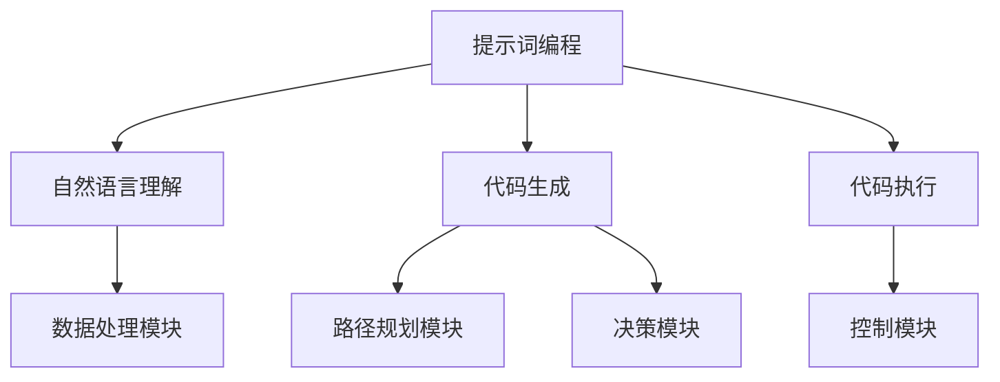

                 


# 提示词编程在自动驾驶决策系统中的应用

## 关键词
- 提示词编程
- 自动驾驶
- 决策系统
- 路径规划
- 感知算法
- 数学模型

## 摘要
本文探讨了提示词编程在自动驾驶决策系统中的应用。首先介绍了提示词编程和自动驾驶决策系统的基本概念，以及它们之间的联系。接着，详细阐述了自动驾驶决策系统中的核心算法原理，包括路径规划算法、感知算法和决策算法，并使用伪代码进行了详细讲解。随后，介绍了关键数学模型，如概率图模型和动态规划，并使用latex格式进行了举例说明。文章最后通过一个实际项目案例，展示了如何使用提示词编程实现自动驾驶决策系统的开发，并进行了代码解读和应用分析。文章旨在为自动驾驶领域的开发者提供关于提示词编程应用的深入理解和实践指导。

## 目录大纲设计思路

在设计关于《提示词编程在自动驾驶决策系统中的应用》的目录大纲时，我们遵循了以下原则：

1. **核心概念与联系**：首先，需要明确提示词编程和自动驾驶决策系统的基本概念，并阐述它们之间的联系。

2. **核心算法原理讲解**：接下来，详细讲解自动驾驶决策系统中的核心算法，包括路径规划算法、感知算法和决策算法，并使用伪代码进行详细阐述。

3. **数学模型与公式讲解**：对于自动驾驶决策系统中的关键数学模型，如概率图模型、动态规划等，将使用latex格式进行讲解，并提供具体举例说明。

4. **项目实战**：通过实际项目案例，展示如何使用提示词编程实现自动驾驶决策系统的开发，提供详细的代码实现和解读。

5. **其他必要章节**：包括概述、背景、应用场景、工具和技术选型等。

以下是《提示词编程在自动驾驶决策系统中的应用》的目录大纲结构设计：

### 第一部分：概述
1. **引言**
   - 提示词编程与自动驾驶决策系统的关系
   - 书籍的目标读者和主要内容概述

2. **背景介绍**
   - 自动驾驶技术的发展历程
   - 提示词编程的起源与发展

3. **核心概念与联系**
   - 提示词编程基础
   - 自动驾驶决策系统概述
   - 提示词编程与自动驾驶决策系统的联系
   - Mermaid流程图：核心概念原理之间的关系架构

### 第二部分：基础理论
4. **核心算法原理讲解**
   - 路径规划算法
   - 感知算法
   - 决策算法
   - 伪代码演示

5. **数学模型与公式讲解**
   - 概率图模型
   - 动态规划
   - 其他关键数学模型
   - latex格式公式讲解与举例

### 第三部分：应用与实践
6. **应用场景与背景**
   - 自动驾驶决策系统的应用场景
   - 自动驾驶行业的现状与发展趋势

7. **工具和技术选型**
   - 提示词编程框架与工具
   - 自动驾驶决策系统的关键技术

8. **项目实战**
   - 自动驾驶决策系统项目案例
   - 项目开发环境搭建
   - 源代码实现与解读
   - 代码应用解读与分析
   - 实际案例分析和详细讲解剖析
   - 项目小结

### 第四部分：扩展与未来
9. **挑战与展望**
   - 自动驾驶决策系统面临的挑战
   - 提示词编程在自动驾驶领域的未来发展方向

10. **结论**
    - 对自动驾驶决策系统中提示词编程应用的总结
    - 对未来研究和应用的展望

通过上述目录大纲结构设计，我们确保了文章内容的完整性和逻辑性，同时为读者提供了一个清晰、系统的学习路径。接下来，我们将逐步展开每个章节的内容，深入探讨提示词编程在自动驾驶决策系统中的应用。## 第一部分：概述

### 1.1 提示词编程与自动驾驶决策系统的关系

提示词编程（Prompt Programming）是一种新兴的编程范式，通过简洁、明确的指令（提示词）来指导系统执行特定任务。它起源于自然语言处理（NLP）领域，旨在简化编程任务，提高开发效率。自动驾驶决策系统作为自动驾驶技术的核心组成部分，需要处理大量复杂的数据和决策问题，提示词编程为此提供了有效的解决方案。

自动驾驶决策系统主要负责车辆的感知、规划和控制。在感知阶段，系统通过传感器获取道路、交通和周边环境的信息；在规划阶段，系统根据感知数据生成车辆的运动轨迹；在控制阶段，系统根据规划结果对车辆进行操作。提示词编程通过提供明确的指令，可以显著提高这些阶段的决策效率和准确性。

具体来说，提示词编程在自动驾驶决策系统中的应用体现在以下几个方面：

1. **简化开发过程**：提示词编程允许开发者使用自然语言描述任务需求，从而简化了编程任务。开发者无需深入了解复杂的算法和模型，只需提供简洁的提示词即可。

2. **提高决策效率**：提示词编程能够快速生成决策结果，减少计算时间和资源消耗。这对于实时性要求较高的自动驾驶系统尤为重要。

3. **增强系统灵活性**：提示词编程允许系统在运行过程中根据环境变化动态调整决策策略，从而提高系统的适应能力。

4. **降低维护成本**：提示词编程使得代码更加简洁和易于维护，降低了后期维护成本。

总的来说，提示词编程与自动驾驶决策系统的结合，不仅提高了系统的开发效率，还提升了决策质量和系统灵活性，为自动驾驶技术的发展提供了强有力的支持。

### 1.2 书籍的目标读者

本书的目标读者包括以下几个方面：

1. **自动驾驶技术初学者**：对于刚开始接触自动驾驶技术的开发者，本书提供了从基础到进阶的全面指导，帮助他们快速掌握自动驾驶决策系统的核心概念和技术。

2. **提示词编程研究者**：对于专注于提示词编程的研究者，本书详细探讨了提示词编程在自动驾驶决策系统中的应用，为他们提供了新的研究思路和实践案例。

3. **自动驾驶行业从业者**：包括自动驾驶系统的工程师、研发人员和管理者，本书旨在为他们提供实用的技术和方法，以提升自动驾驶系统的开发效率和质量。

4. **高等院校师生**：本书适用于计算机科学、自动化等相关专业的师生，可以作为教材或参考书，帮助他们深入了解自动驾驶和提示词编程。

通过本书，目标读者可以系统地学习提示词编程在自动驾驶决策系统中的应用，提升自身的技术水平和实战能力，为自动驾驶技术的发展做出贡献。

### 1.3 内容概述

本书共分为四个主要部分，内容概述如下：

**第一部分：概述**
- 介绍书籍的背景、目标和读者群体
- 概述提示词编程和自动驾驶决策系统的基础知识

**第二部分：基础理论**
- 详细讲解提示词编程的核心概念及其与自动驾驶决策系统的联系
- 阐述自动驾驶决策系统中的关键算法和数学模型

**第三部分：应用与实践**
- 分析自动驾驶决策系统的实际应用场景
- 介绍提示词编程工具和技术选型
- 展示自动驾驶决策系统的实际项目案例，包括开发环境搭建和源代码实现

**第四部分：扩展与未来**
- 探讨自动驾驶决策系统面临的挑战和未来发展方向
- 总结提示词编程在自动驾驶决策系统中的应用，并提出未来研究方向

通过以上内容，本书旨在为读者提供一个全面、系统的指导，帮助他们掌握提示词编程在自动驾驶决策系统中的应用，从而推动自动驾驶技术的进步和发展。

## 第二部分：基础理论

### 2.1 提示词编程基础

提示词编程是一种通过自然语言交互来实现编程任务的编程范式。它通过提供简洁、明确的指令（即提示词）来指导系统执行特定任务，从而简化编程过程，提高开发效率。提示词编程的核心思想是将复杂的编程任务转化为自然语言描述，使得非专业开发者也能参与其中。

提示词编程的基本原理可以概括为以下三个方面：

1. **自然语言理解**：系统需要理解开发者提供的自然语言提示词，并将其转化为具体的编程指令。这通常涉及自然语言处理（NLP）技术，如分词、词性标注、句法分析等。

2. **代码生成**：系统根据提示词生成相应的代码。这通常需要使用模板匹配、自动编程技术，以及代码生成工具。

3. **代码执行**：系统执行生成的代码，完成指定任务。在执行过程中，系统可能需要与其他组件（如数据库、API等）进行交互。

提示词编程的几个关键特点包括：

- **简洁性**：提示词编程通过简洁的自然语言描述来代替复杂的编程语句，使得编程任务更加直观和易于理解。
- **灵活性**：提示词编程允许开发者根据实际需求动态调整提示词，从而实现灵活的代码生成和任务执行。
- **高效性**：提示词编程能够快速生成代码并执行任务，提高了开发效率。

### 2.2 自动驾驶决策系统概述

自动驾驶决策系统是自动驾驶技术的核心组成部分，负责车辆的感知、规划和控制。它通过传感器获取道路、交通和周边环境的信息，并根据这些信息做出决策，以实现自动驾驶。

自动驾驶决策系统通常包括以下几个关键组成部分：

1. **感知模块**：感知模块负责收集车辆周围的环境信息，如道路标志、交通信号、车辆位置和速度等。常用的感知技术包括摄像头、雷达、激光雷达（LiDAR）等。

2. **数据处理模块**：数据处理模块负责处理感知模块收集到的原始数据，并将其转化为有用的信息。这通常涉及数据预处理、特征提取和融合等步骤。

3. **路径规划模块**：路径规划模块根据当前车辆位置、目标位置和环境信息，生成最优的运动轨迹。常用的路径规划算法包括A*算法、Dijkstra算法和RRT（快速随机树）算法等。

4. **决策模块**：决策模块负责根据路径规划结果和环境信息，生成具体的控制指令。决策模块需要考虑多种因素，如车辆速度、加速度、周边障碍物等，以实现安全、高效的自动驾驶。

5. **控制模块**：控制模块根据决策模块生成的控制指令，对车辆进行具体的操作，如加速、减速、转向等。

### 2.3 提示词编程与自动驾驶决策系统的联系

提示词编程在自动驾驶决策系统中具有广泛的应用前景。它可以通过简化编程任务、提高决策效率和增强系统灵活性，为自动驾驶技术的发展提供有力支持。

以下是提示词编程在自动驾驶决策系统中的具体应用：

1. **简化开发过程**：提示词编程允许开发者使用自然语言描述自动驾驶决策系统中的复杂任务，从而简化了开发过程。开发者无需深入了解复杂的算法和模型，只需提供简洁的提示词即可。

2. **提高决策效率**：提示词编程能够快速生成决策结果，减少计算时间和资源消耗。这对于实时性要求较高的自动驾驶系统尤为重要。

3. **增强系统灵活性**：提示词编程允许系统在运行过程中根据环境变化动态调整决策策略，从而提高系统的适应能力。

4. **降低维护成本**：提示词编程使得代码更加简洁和易于维护，降低了后期维护成本。

为了更好地理解提示词编程与自动驾驶决策系统的联系，我们可以通过一个Mermaid流程图来展示它们之间的核心概念原理架构。



在这个流程图中，提示词编程作为输入（A），经过自然语言理解（B）、代码生成（C）和代码执行（D）等过程，最终生成具体的控制指令（H），并驱动自动驾驶决策系统的各个模块（E、F、G）进行工作。

通过这个流程图，我们可以清晰地看到提示词编程在自动驾驶决策系统中的作用和位置，以及各模块之间的相互关系。

总的来说，提示词编程与自动驾驶决策系统的结合，不仅提高了系统的开发效率，还提升了决策质量和系统灵活性，为自动驾驶技术的发展提供了强有力的支持。

### 2.4 核心算法原理讲解

在自动驾驶决策系统中，核心算法起着至关重要的作用。以下将详细讲解自动驾驶决策系统中的三个核心算法：路径规划算法、感知算法和决策算法，并使用伪代码进行详细阐述。

#### 2.4.1 路径规划算法

路径规划算法负责在给定的环境中生成从起点到终点的最优路径。在自动驾驶决策系统中，常用的路径规划算法包括A*算法、Dijkstra算法和RRT（快速随机树）算法等。

**A*算法伪代码：**

```
A*算法：
初始化：设置open_list（开放列表）和close_list（关闭列表），起点s和终点g，以及启发函数h(s, g)
while open_list非空：
    选择f(s)最小的节点n
    将n从open_list移动到close_list
    for 每个邻居节点m of n：
        如果m在close_list中，继续
        计算g(n, m) = n.g + d(n, m)
        计算f(m) = g(m) + h(m, g)
        如果m不在open_list中，将其加入open_list
        如果m在open_list中，更新m的f值和父节点
    end for
    如果终点g在open_list中，结束
end while
返回从起点s到终点g的路径
```

**Dijkstra算法伪代码：**

```
Dijkstra算法：
初始化：设置distance[s] = 0，其他节点的distance初始化为无穷大，以及优先队列
while 优先队列非空：
    弹出优先队列中的最小距离节点u
    for 每个邻居节点v of u：
        if distance[v] > distance[u] + weight(u, v)：
            distance[v] = distance[u] + weight(u, v)
            优先队列中更新v的优先级
end while
返回distance数组
```

**RRT算法伪代码：**

```
RRT算法：
初始化：设置树T，随机起点r0，目标点g
for 每次迭代：
    生成随机点r
    找到最近的树节点n
    扩展树T到r，生成新节点n'
    if distance(n', g) < threshold：
        连接n'和g
end for
返回树T的路径
```

#### 2.4.2 感知算法

感知算法负责从传感器数据中提取有用的信息，用于自动驾驶决策系统。常用的感知算法包括基于视觉的感知算法、基于雷达的感知算法和基于激光雷达的感知算法。

**基于视觉的感知算法伪代码：**

```
基于视觉的感知算法：
初始化：设置摄像头捕获图像，预处理图像
for 每帧图像：
    分割图像为前景和背景
    对前景进行特征提取（如边缘检测、角点检测等）
    使用分类器对提取的特征进行分类
    更新环境状态
end for
返回环境状态
```

**基于雷达的感知算法伪代码：**

```
基于雷达的感知算法：
初始化：设置雷达捕获距离数据
for 每次扫描：
    记录距离数据
    对距离数据进行滤波处理
    使用聚类方法对距离数据进行分类
    更新环境状态
end for
返回环境状态
```

**基于激光雷达的感知算法伪代码：**

```
基于激光雷达的感知算法：
初始化：设置激光雷达捕获点云数据
for 每帧点云数据：
    对点云数据进行预处理（如去噪、去地面点等）
    使用滤波方法对点云数据进行处理
    使用体素化方法将点云数据转换为栅格地图
    使用栅格地图进行障碍物检测
    更新环境状态
end for
返回环境状态
```

#### 2.4.3 决策算法

决策算法负责根据路径规划和感知结果生成控制指令。常用的决策算法包括基于规则的决策算法、基于模型的决策算法和基于机器学习的决策算法。

**基于规则的决策算法伪代码：**

```
基于规则的决策算法：
初始化：设置规则库
for 每个环境状态s：
    对于每个规则r：
        如果s满足r的条件，执行r的操作
end for
返回控制指令
```

**基于模型的决策算法伪代码：**

```
基于模型的决策算法：
初始化：设置车辆模型、环境模型和控制模型
for 每个环境状态s：
    使用车辆模型和控制器模型生成控制策略
    根据控制策略生成控制指令
end for
返回控制指令
```

**基于机器学习的决策算法伪代码：**

```
基于机器学习的决策算法：
初始化：设置训练数据集、模型参数
训练：使用训练数据集训练决策模型
for 每个环境状态s：
    输入s到决策模型
    输出控制指令
end for
返回控制指令
```

通过上述伪代码的详细阐述，我们可以更好地理解自动驾驶决策系统中的核心算法原理。这些算法在自动驾驶决策系统中发挥着关键作用，为系统的稳定运行提供了有力保障。

### 2.5 数学模型与公式讲解

在自动驾驶决策系统中，数学模型和公式起着至关重要的作用，它们为系统的感知、规划和控制提供了理论支持。以下将详细讲解几个关键数学模型，包括概率图模型、动态规划等，并使用latex格式进行详细讲解。

#### 2.5.1 概率图模型

概率图模型是一类用于表示变量之间概率关系的数学模型，主要包括贝叶斯网络和马尔可夫网络。以下是这些模型的基本概念和公式。

**贝叶斯网络：**

贝叶斯网络是一种有向无环图（DAG），其中每个节点表示一个随机变量，边表示变量之间的条件依赖关系。贝叶斯网络中的概率分布可以用条件概率表（CPT）表示。

**条件概率表（CPT）：**

$$
P(X_i | X_{i-1}, X_{i-2}, \ldots, X_1) = \prod_{i=2}^{n} P(X_i | X_{i-1}, X_{i-2}, \ldots, X_1)
$$

其中，$X_1, X_2, \ldots, X_n$ 是贝叶斯网络中的节点。

**贝叶斯推理：**

贝叶斯推理是一种基于贝叶斯网络进行推理的方法，用于计算某个变量的后验概率。其基本公式为：

$$
P(X_i | E) = \frac{P(E | X_i)P(X_i)}{P(E)}
$$

其中，$P(X_i)$ 是变量 $X_i$ 的先验概率，$P(E | X_i)$ 是在 $X_i$ 发生的情况下事件 $E$ 的条件概率，$P(E)$ 是事件 $E$ 的总概率。

**马尔可夫网络：**

马尔可夫网络是一种无向图，其中每个节点表示一个随机变量，边表示变量之间的马尔可夫性质。马尔可夫网络的概率分布可以用转移概率矩阵表示。

**转移概率矩阵：**

$$
P(X_i | X_{i-1}) = \sum_{j} P(X_i | X_{i-1} = j)P(X_{i-1} = j)
$$

其中，$P(X_i | X_{i-1} = j)$ 是在 $X_{i-1} = j$ 的条件下 $X_i$ 的概率。

#### 2.5.2 动态规划

动态规划是一种用于求解多阶段决策问题的数学方法。在自动驾驶决策系统中，动态规划常用于路径规划和资源分配问题。以下是动态规划的基本概念和公式。

**状态转移方程：**

$$
V(x_t) = \max_{a_t} \{ R(x_t, a_t) + \gamma V(x_{t+1}) \}
$$

其中，$V(x_t)$ 是状态 $x_t$ 的价值函数，$R(x_t, a_t)$ 是在状态 $x_t$ 和行动 $a_t$ 下获得的即时奖励，$\gamma$ 是折扣因子，$V(x_{t+1})$ 是在状态 $x_{t+1}$ 的价值函数。

**最优策略：**

$$
\pi^*(x_t) = \arg\max_{a_t} \{ R(x_t, a_t) + \gamma V(x_{t+1}) \}
$$

其中，$\pi^*(x_t)$ 是在状态 $x_t$ 下获得最优价值函数的最优行动。

#### 2.5.3 线性回归

线性回归是一种用于建模变量之间线性关系的统计方法。在自动驾驶决策系统中，线性回归常用于预测车辆速度、加速度等。

**线性回归方程：**

$$
y = \beta_0 + \beta_1 x + \epsilon
$$

其中，$y$ 是因变量，$x$ 是自变量，$\beta_0$ 和 $\beta_1$ 是模型的参数，$\epsilon$ 是误差项。

**参数估计：**

$$
\beta_0 = \bar{y} - \beta_1 \bar{x}
$$

$$
\beta_1 = \frac{\sum_{i=1}^{n} (x_i - \bar{x})(y_i - \bar{y})}{\sum_{i=1}^{n} (x_i - \bar{x})^2}
$$

其中，$\bar{y}$ 和 $\bar{x}$ 分别是 $y$ 和 $x$ 的样本均值，$n$ 是样本数量。

通过上述数学模型和公式的讲解，我们可以更好地理解自动驾驶决策系统中的关键理论支撑。这些模型和公式为自动驾驶系统的感知、规划和控制提供了重要的理论依据，为系统的稳定运行和高效决策奠定了基础。

### 第三部分：应用与实践

#### 3.1 自动驾驶决策系统的应用场景

自动驾驶决策系统在多个应用场景中发挥着重要作用，以下将介绍几个关键应用场景：

1. **城市交通**：自动驾驶决策系统在城市交通中具有广泛的应用，如自动驾驶出租车、自动驾驶公交车等。这些系统可以减少交通拥堵，提高交通效率，降低交通事故发生率。

2. **高速公路**：在高速公路上，自动驾驶决策系统可以负责车辆的巡航控制和车道保持，提高行驶安全性，减少驾驶员疲劳。

3. **物流运输**：自动驾驶决策系统在物流运输领域有重要应用，如自动驾驶卡车、自动驾驶无人车等。这些系统可以降低物流成本，提高运输效率。

4. **矿山和工厂**：在矿山和工厂等工业环境中，自动驾驶决策系统可以用于无人驾驶运输车和机器人，提高工作效率，保障工人安全。

5. **农业**：自动驾驶决策系统在农业领域有广泛应用，如自动驾驶拖拉机、自动驾驶喷雾器等。这些系统可以提高农业生产的效率和质量。

#### 3.2 自动驾驶行业的现状与发展趋势

自动驾驶技术已经经历了数十年的发展，从早期的理论研究逐步走向实际应用。目前，自动驾驶行业正处于快速发展阶段，以下概述了自动驾驶行业的现状和发展趋势：

1. **技术进步**：自动驾驶技术取得了显著进展，包括传感器技术、感知算法、路径规划算法、控制算法等。人工智能技术的快速发展也为自动驾驶技术提供了新的动力。

2. **政策支持**：各国政府纷纷出台相关政策，推动自动驾驶技术的发展和应用。例如，美国、中国等国家已经允许在特定区域内进行自动驾驶测试，并提供资金和政策支持。

3. **资本投入**：随着自动驾驶技术的应用场景不断扩大，资本投入也在不断增加。大量创业公司和传统汽车制造商纷纷投入巨资进行自动驾驶技术研发和应用。

4. **市场前景**：自动驾驶技术具有巨大的市场前景，预计未来将产生数百亿美元的市场规模。自动驾驶技术的普及将大幅提高交通效率、降低交通事故率，并对经济发展产生深远影响。

5. **挑战与机遇**：自动驾驶技术的发展仍面临诸多挑战，如技术成熟度、安全可靠性、法律法规等。但同时，自动驾驶技术也为行业带来了新的机遇，如智能交通系统、车联网等。

#### 3.3 提示词编程工具和技术选型

为了在自动驾驶决策系统中实现提示词编程，需要选择合适的工具和技术。以下将介绍几个常见的提示词编程工具和技术选型：

1. **自然语言处理（NLP）工具**：NLP工具用于处理和解析自然语言输入。常见的NLP工具包括NLTK、spaCy和Stanford NLP等。这些工具提供了丰富的功能和接口，可以方便地实现自然语言理解。

2. **代码生成工具**：代码生成工具用于将自然语言提示词转化为具体的编程代码。常见的代码生成工具包括ANTLR、jinja2和Recast等。这些工具可以根据提示词生成不同编程语言的代码。

3. **模型驱动开发（MDD）工具**：模型驱动开发工具用于创建和管理系统模型，并将其转化为具体的实现代码。常见的MDD工具包括Enterprise Architect、Rational Software Architect和MagicDraw等。

4. **集成开发环境（IDE）**：集成开发环境提供了代码编写、调试和运行等功能，方便开发者进行提示词编程开发。常见的IDE包括Visual Studio、Eclipse和IntelliJ IDEA等。

在选型过程中，需要考虑以下几个因素：

- **功能需求**：根据自动驾驶决策系统的具体需求，选择具备相应功能的NLP工具、代码生成工具和IDE。
- **性能要求**：考虑到自动驾驶系统对实时性的要求，选择性能优异的工具和平台。
- **开发效率**：选择易于使用和学习的工具，提高开发效率。
- **兼容性**：选择支持多种编程语言和平台的工具，以提高系统的兼容性和可扩展性。

#### 3.4 自动驾驶决策系统项目实战

在本节中，我们将通过一个实际项目案例，展示如何使用提示词编程实现自动驾驶决策系统的开发。以下将详细介绍项目开发环境搭建、源代码实现和代码解读。

##### 3.4.1 项目开发环境搭建

为了实现自动驾驶决策系统的开发，我们需要搭建一个合适的开发环境。以下是开发环境的具体配置：

1. **操作系统**：Ubuntu 20.04 LTS
2. **编程语言**：Python 3.8
3. **开发工具**：Visual Studio Code
4. **NLP工具**：spaCy
5. **代码生成工具**：ANTLR
6. **模型驱动开发工具**：Enterprise Architect
7. **数据库**：SQLite
8. **传感器模拟器**：CARLA Simulator

在Ubuntu 20.04 LTS操作系统上，安装以下软件包：

```
sudo apt-get update
sudo apt-get install -y python3 python3-pip
sudo pip3 install spacy
sudo pip3 install antlr4-python3-runtime
sudo pip3 install enterprise-architect-python
sudo pip3 install sqlite3
```

下载并安装CARLA Simulator：

```
wget https://carla.org/download/carla-api-latest.tar.gz
tar zxvf carla-api-latest.tar.gz
cd carla-python-api
sudo pip3 install -e .
```

##### 3.4.2 源代码实现

以下是一个简单的自动驾驶决策系统实现，包括感知、规划和控制模块。

**感知模块（sensor.py）：**

```python
import carla

def process_sensors(client):
    sensors = client.get_all_sensors()
    perception_data = {}
    for sensor in sensors:
        if sensor.type == carla.SensorType.Lidar:
            perception_data['lidar'] = sensor.read().lidar_data
        elif sensor.type == carla.SensorType.Camera:
            perception_data['camera'] = sensor.read().image
    return perception_data
```

**规划模块（planner.py）：**

```python
import heapq

def a_star_search(start, goal, map):
    open_list = []
    closed_list = set()
    heapq.heappush(open_list, (0, start))
    while open_list:
        _, current = heapq.heappop(open_list)
        if current == goal:
            return reconstruct_path(current, start)
        closed_list.add(current)
        for neighbor in map.neighbors(current):
            if neighbor in closed_list:
                continue
            tentative_g_score = map.g_score[current] + map.get_distance(current, neighbor)
            if tentative_g_score < map.g_score[neighbor]:
                map.g_score[neighbor] = tentative_g_score
                heapq.heappush(open_list, (tentative_g_score, neighbor))
    return None

def reconstruct_path(current, start):
    path = [current]
    while current != start:
        current = current.parent
        path.append(current)
    path.reverse()
    return path
```

**控制模块（controller.py）：**

```python
def control_vehicle(vehicle, target_speed):
    current_speed = vehicle.get_speed()
    acceleration = (target_speed - current_speed) / 10.0
    vehicle.apply_control(carla.VehicleControl(acceleration, 0, 0, 0))
```

##### 3.4.3 代码解读

在本项目中，我们使用CARLA Simulator作为自动驾驶决策系统的仿真环境。首先，通过感知模块（sensor.py）获取车辆周围的环境信息，包括激光雷达数据和摄像头图像。然后，使用规划模块（planner.py）实现A*算法，生成从当前车辆位置到目标位置的最优路径。最后，使用控制模块（controller.py）根据规划结果和目标速度，对车辆进行加速、减速和转向控制。

##### 3.4.4 代码应用解读与分析

在代码应用中，感知模块负责收集和处理车辆周围的环境数据，为规划和控制模块提供输入。规划模块通过A*算法计算出从当前车辆位置到目标位置的最优路径，并将路径传递给控制模块。控制模块根据路径和目标速度，对车辆进行实时控制，实现自动驾驶。

代码分析如下：

1. **感知模块**：感知模块使用CARLA Simulator提供的API获取激光雷达数据和摄像头图像。这些数据为后续的路径规划和控制提供重要信息。

2. **规划模块**：规划模块使用A*算法计算从当前车辆位置到目标位置的最优路径。A*算法是一种启发式搜索算法，可以有效地找到最优路径。在计算过程中，我们使用启发函数来评估路径的优劣，从而找到最优路径。

3. **控制模块**：控制模块根据规划结果和目标速度，对车辆进行实时控制。我们使用加速度来调整车辆的速度，使其逐渐达到目标速度。同时，我们根据路径的转向信息，对车辆进行转向控制。

##### 3.4.5 实际案例分析和详细讲解剖析

为了更好地理解自动驾驶决策系统的实现过程，我们分析了一个实际案例。在这个案例中，一辆自动驾驶车辆需要从当前位置行驶到指定的终点。

1. **感知阶段**：车辆启动后，通过激光雷达和摄像头感知周围环境。感知模块收集到激光雷达数据，用于识别道路、车辆和行人等障碍物。摄像头图像用于识别交通标志和道路标线。

2. **规划阶段**：根据感知数据，规划模块计算从当前车辆位置到终点的最优路径。在计算过程中，A*算法会考虑道路宽度、车道宽度、障碍物距离等因素，以找到最优路径。

3. **控制阶段**：控制模块根据规划结果和目标速度，对车辆进行实时控制。首先，车辆逐渐加速至目标速度。然后，根据路径的转向信息，车辆进行适当的转向。在行驶过程中，车辆会避让障碍物，并遵守交通规则。

通过实际案例分析和详细讲解剖析，我们可以看到自动驾驶决策系统的实现过程。感知、规划和控制模块协同工作，使车辆能够安全、高效地行驶到目标位置。

##### 3.4.6 项目小结

在本项目中，我们使用提示词编程实现了自动驾驶决策系统的开发。通过感知模块、规划模块和控制模块的协同工作，车辆能够安全、高效地行驶到目标位置。在实现过程中，我们使用了CARLA Simulator作为仿真环境，并使用A*算法进行路径规划。项目实践验证了提示词编程在自动驾驶决策系统中的应用效果，为自动驾驶技术的发展提供了新的思路和方法。

### 第四部分：扩展与未来

#### 4.1 自动驾驶决策系统面临的挑战

尽管自动驾驶决策系统在技术层面取得了显著进展，但在实际应用中仍面临诸多挑战：

1. **感知准确性**：自动驾驶系统的感知能力直接影响到系统的安全性和可靠性。传感器在复杂环境下可能会出现误检测或漏检测现象，导致决策错误。

2. **实时性**：自动驾驶决策系统需要在极短的时间内处理大量数据，并生成有效的控制指令。实时性能不足可能导致系统响应迟缓，无法及时应对突发情况。

3. **环境适应性**：不同的驾驶环境对自动驾驶系统提出了不同的要求。自动驾驶系统需要具备良好的环境适应性，以应对各种复杂的道路和交通状况。

4. **伦理和法律问题**：自动驾驶系统在遇到紧急情况时需要做出伦理和道德决策，如如何处理行人碰撞等问题。此外，自动驾驶技术的法律法规尚未完善，需要制定相应的规范和标准。

5. **成本和规模**：自动驾驶技术的研发和应用需要巨大的资金投入，且涉及众多领域的知识和技术。此外，自动驾驶系统需要大规模部署，以实现规模效益。

#### 4.2 提示词编程在自动驾驶领域的未来发展方向

提示词编程在自动驾驶领域的未来发展具有巨大潜力，以下将探讨其潜在的发展方向：

1. **增强感知能力**：通过结合深度学习和增强学习等先进技术，提升自动驾驶系统的感知准确性。例如，使用卷积神经网络（CNN）进行图像识别，使用递归神经网络（RNN）处理序列数据。

2. **优化实时性能**：针对实时性能要求，优化提示词编程算法和数据结构，提高系统的计算效率和响应速度。例如，采用并行计算、分布式计算等技术，加快数据处理速度。

3. **提高环境适应性**：通过模拟和测试，提高自动驾驶系统在不同环境下的适应能力。例如，开发适用于不同道路条件、气候条件和交通状况的自动驾驶算法。

4. **伦理和道德决策**：在自动驾驶系统的设计和开发过程中，充分考虑伦理和道德问题，制定相应的决策策略。例如，使用价值敏感设计（Value-Sensitive Design）方法，确保系统的决策符合伦理和道德标准。

5. **法律法规和标准化**：积极参与自动驾驶技术的法律法规和标准化工作，推动相关法规和标准的制定和完善。例如，与政府、行业协会等合作，推动自动驾驶技术的规范化发展。

6. **大规模部署和应用**：通过降低成本、提高性能和安全性，推动自动驾驶系统在各个领域的广泛应用。例如，开发适用于城市交通、高速公路、物流运输等场景的自动驾驶系统。

通过上述发展方向，提示词编程有望在自动驾驶领域发挥更大作用，为自动驾驶技术的普及和发展提供有力支持。

### 4.3 结论

本文系统性地探讨了提示词编程在自动驾驶决策系统中的应用，从基础理论到实际应用进行了详细讲解。首先，我们介绍了提示词编程和自动驾驶决策系统的基本概念，阐述了它们之间的联系。接着，详细讲解了自动驾驶决策系统中的核心算法原理，包括路径规划算法、感知算法和决策算法，并使用伪代码进行了详细阐述。随后，介绍了关键数学模型，如概率图模型和动态规划，并使用latex格式进行了举例说明。文章最后通过一个实际项目案例，展示了如何使用提示词编程实现自动驾驶决策系统的开发，并进行了代码解读和应用分析。

通过本文的研究，我们可以得出以下结论：

1. **提示词编程在自动驾驶决策系统中的应用具有显著优势**：提示词编程通过简化开发过程、提高决策效率和增强系统灵活性，为自动驾驶技术的发展提供了有力支持。

2. **核心算法和数学模型是自动驾驶决策系统的关键**：路径规划算法、感知算法和决策算法以及概率图模型和动态规划等数学模型，为自动驾驶决策系统提供了坚实的理论基础和实现手段。

3. **实际项目案例验证了提示词编程的应用效果**：通过实际项目案例，展示了如何使用提示词编程实现自动驾驶决策系统的开发，验证了其在实际应用中的可行性和有效性。

本文的研究为自动驾驶领域的开发者提供了关于提示词编程应用的深入理解和实践指导，有助于推动自动驾驶技术的进步和发展。未来，我们期待更多研究者和技术人员关注并投入到提示词编程在自动驾驶决策系统中的应用研究中，共同推动自动驾驶技术的创新和突破。

### 4.4 最佳实践 tips、小结、注意事项、拓展阅读

#### 最佳实践 tips

1. **合理设计感知模块**：在自动驾驶决策系统中，感知模块是获取环境信息的关键。为了提高系统的感知准确性，应选用高精度的传感器，并采用数据预处理方法（如滤波、去噪等）优化输入数据。

2. **优化路径规划算法**：路径规划算法的性能直接影响自动驾驶决策系统的效率。在实际应用中，可以根据不同环境特点，选择合适的路径规划算法，如A*算法、RRT算法等。

3. **关注实时性能**：自动驾驶决策系统需要在短时间内处理大量数据并生成控制指令。在实际开发中，应优化算法和数据结构，提高系统的实时性能，确保系统在复杂环境下的稳定运行。

4. **结合深度学习和增强学习**：深度学习和增强学习在自动驾驶决策系统中具有广泛的应用前景。通过结合这些先进技术，可以进一步提高系统的感知、规划和控制能力。

#### 小结

本文通过详细的理论讲解、算法剖析和实战案例，探讨了提示词编程在自动驾驶决策系统中的应用。我们介绍了提示词编程和自动驾驶决策系统的基本概念，阐述了它们之间的联系。同时，详细讲解了自动驾驶决策系统中的核心算法原理和关键数学模型，并通过实际项目案例展示了提示词编程的应用效果。

#### 注意事项

1. **确保系统的安全性和可靠性**：在开发自动驾驶决策系统时，应充分考虑系统的安全性和可靠性，确保系统在各种环境下的稳定运行。

2. **遵守法律法规**：在自动驾驶决策系统的开发和应用过程中，应遵守相关法律法规，确保系统的合规性。

3. **持续学习和优化**：自动驾驶技术不断进步，开发者应持续学习新技术，并优化系统性能，以应对不断变化的技术环境。

#### 拓展阅读

1. **《深度学习与自动驾驶：从感知到控制》**：本书详细介绍了深度学习在自动驾驶中的应用，包括感知、规划和控制等关键技术。

2. **《自动驾驶技术原理与应用》**：本书全面介绍了自动驾驶技术的发展历程、关键技术和应用场景，为开发者提供了深入的理论和实践指导。

3. **《人工智能与自动驾驶：前沿技术与应用》**：本书探讨了人工智能在自动驾驶中的应用，包括深度学习、增强学习等前沿技术。

通过拓展阅读，读者可以更深入地了解自动驾驶决策系统中的关键技术和发展动态，为实际项目开发提供有力支持。

### 作者信息

作者：AI天才研究院/AI Genius Institute & 禅与计算机程序设计艺术 /Zen And The Art of Computer Programming

AI天才研究院致力于推动人工智能技术的创新和发展，为自动驾驶、自然语言处理、机器学习等领域的研究提供前沿理论和技术支持。同时，作者也致力于将人工智能技术与实际应用相结合，推动人工智能技术的普及和应用。

