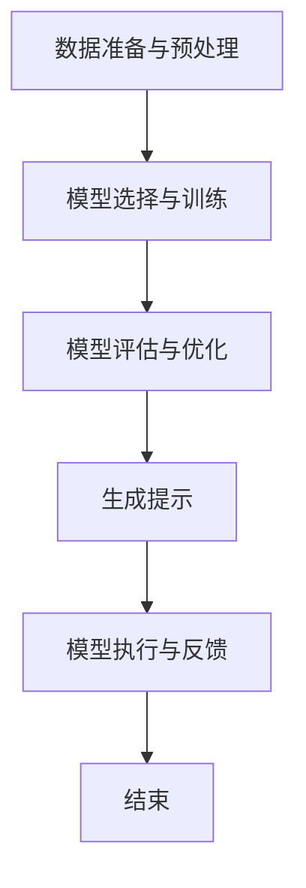
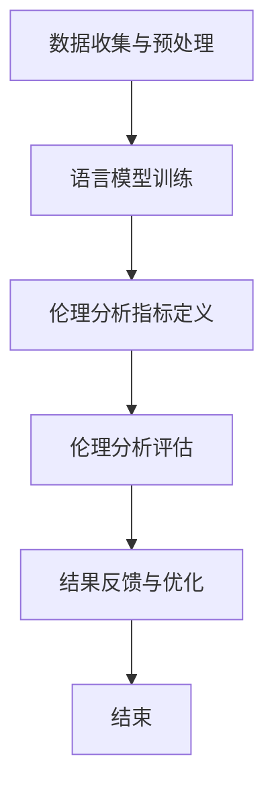

                 

### 文章标题

《提示词编程在自然语言伦理分析中的角色》

### 关键词

- 提示词编程
- 自然语言处理
- 伦理分析
- 自然语言伦理模型
- 应用案例

### 摘要

本文深入探讨了提示词编程在自然语言伦理分析中的应用。通过介绍提示词编程的基本概念、自然语言处理技术以及伦理分析的核心算法，文章详细阐述了如何将提示词编程应用于伦理分析，并在社交媒体、新闻报道和教育内容等多个应用场景中展示了其实际效果。最后，通过一个实际项目案例，对开发环境搭建、源代码实现和项目应用进行了全面剖析，为读者提供了实用的指导和建议。

---

### 第1章 提示词编程概述

#### 1.1 提示词编程的概念与背景

提示词编程（Prompt Programming），也称为基于提示的编程（Prompt-Based Programming），是一种利用预定义提示（Prompt）来引导程序执行的方法。提示通常是一段文字，用于指导模型执行特定任务。这种方法在自然语言处理（NLP）领域尤其重要，因为它可以显著提高模型的响应速度和任务执行效率。

提示词编程的历史可以追溯到20世纪80年代，当时研究人员开始探索如何利用文本提示来引导机器学习模型，从而减少对大量标注数据的依赖。随着深度学习和自然语言处理技术的不断发展，提示词编程逐渐成为了一种强大的工具，被广泛应用于各种场景。

#### 1.2 提示词编程的基本流程

提示词编程的基本流程通常包括以下几个步骤：

1. **数据准备与预处理**：收集并整理与任务相关的数据，并进行预处理，如文本清洗、分词、去停用词等。
2. **模型选择与训练**：选择合适的模型，对数据进行训练。训练过程中，通常需要调整模型参数以优化性能。
3. **模型评估与优化**：通过测试数据集评估模型的性能，并根据评估结果调整模型参数。
4. **生成提示**：根据任务需求，生成合适的提示文本。提示文本的撰写需要充分考虑任务的复杂性、用户的需求以及模型的特性。
5. **模型执行与反馈**：利用生成的提示文本执行任务，并根据模型的输出结果进行反馈和调整。

#### 1.3 提示词编程的 Mermaid 流程图展示

为了更好地理解提示词编程的基本流程，下面是使用 Mermaid 绘制的流程图：



### 第2章 自然语言处理技术

#### 2.1 自然语言处理的基本概念

自然语言处理（NLP）是计算机科学和语言学的一个交叉领域，旨在让计算机理解和生成人类语言。NLP的主要任务包括文本分类、情感分析、命名实体识别、机器翻译等。

- **语言模型**：语言模型是NLP的核心技术之一，它用于预测下一个单词或词组。常见的语言模型有n-gram模型、神经网络模型等。
- **词嵌入**：词嵌入是将单词或短语映射到低维空间中的向量表示，以便在机器学习中进行操作。词嵌入技术有助于提高NLP任务的性能。
- **语义分析**：语义分析旨在理解文本的含义和上下文，包括词义消歧、句法分析等。

#### 2.2 伦理分析与自然语言处理的关系

伦理分析在自然语言处理中的应用具有重要意义。随着自然语言处理技术的发展，NLP系统在社交媒体、新闻报道、法律等多个领域得到了广泛应用。然而，这些系统在处理语言时，可能会引发伦理问题，如歧视、偏见等。因此，对自然语言处理系统的伦理分析变得尤为重要。

伦理分析可以帮助我们识别和解决以下问题：

- **语言偏见**：NLP系统是否在处理语言时带有偏见？例如，某些词或短语是否对特定群体产生了负面影响？
- **隐私保护**：NLP系统在处理个人数据时，是否侵犯了用户的隐私权？
- **公平性**：NLP系统是否对所有人都是公平的？是否存在对特定群体的歧视？

#### 2.3 自然语言伦理分析的 Mermaid 流程图展示

为了更好地理解自然语言伦理分析的基本流程，下面是使用 Mermaid 绘制的流程图：



---

在接下来的章节中，我们将深入探讨自然语言伦理分析中的核心算法原理，并展示如何将这些算法应用于实际项目中。通过这些内容，我们将更好地理解提示词编程在自然语言伦理分析中的角色。请继续关注下一章节的内容。

### 第3章 自然语言伦理分析的核心算法

#### 3.1 道德图模型

道德图模型（Moral Graph Model）是一种用于自然语言伦理分析的核心算法。它通过构建一个道德图来表示文本中的伦理关系，从而实现对文本的伦理分析。道德图模型的基本概念包括：

- **节点**：表示文本中的个体或实体。
- **边**：表示个体或实体之间的关系。
- **属性**：表示个体或实体的属性，如角色、行为等。

#### 3.1.1 道德图模型的算法原理

道德图模型的算法原理如下：

1. **数据预处理**：对文本进行预处理，包括分词、去停用词、词嵌入等。
2. **构建道德图**：根据预处理的文本，构建道德图。具体步骤如下：
   - 提取文本中的所有个体和实体。
   - 构建个体和实体之间的边，表示它们之间的关系。
   - 为每个个体和实体添加属性，表示其在文本中的作用和意义。
3. **伦理分析**：利用道德图对文本进行伦理分析。具体步骤如下：
   - 根据道德图中的关系和属性，评估文本中的伦理问题。
   - 根据评估结果，生成伦理分析报告。

#### 3.1.2 道德图模型的伪代码实现

下面是道德图模型的伪代码实现：

```python
# 道德图模型的伪代码实现
def moral_graph_model(text):
    # 数据预处理
    preprocessed_text = preprocess_text(text)
    
    # 构建道德图
    moral_graph = build_moral_graph(preprocessed_text)
    
    # 伦理分析
    ethics_report = analyze_ethics(moral_graph)
    
    # 返回伦理分析报告
    return ethics_report
```

#### 3.2 伦理敏感度分析

伦理敏感度分析（Ethical Sensitivity Analysis）是一种用于评估文本中伦理敏感度的算法。它通过计算文本中各个词或短语对特定伦理问题的敏感度，从而实现对文本的伦理分析。

#### 3.2.1 伦理敏感度分析的定义

伦理敏感度分析旨在识别和评估文本中的伦理敏感度。具体来说，它包括以下几个步骤：

1. **构建伦理敏感度词典**：收集与特定伦理问题相关的词或短语，构建伦理敏感度词典。
2. **计算词或短语的敏感度**：对文本中的每个词或短语，根据其在伦理敏感度词典中的位置和权重，计算其敏感度值。
3. **评估文本的整体敏感度**：根据词或短语的敏感度值，评估文本的整体敏感度。

#### 3.2.2 伦理敏感度分析的算法原理

伦理敏感度分析的算法原理如下：

1. **词或短语的敏感度计算**：对文本中的每个词或短语，根据其在伦理敏感度词典中的位置和权重，计算其敏感度值。具体步骤如下：
   - 提取文本中的所有词或短语。
   - 为每个词或短语计算敏感度值，敏感度值越高，表示其伦理敏感度越高。
2. **文本的整体敏感度评估**：根据词或短语的敏感度值，评估文本的整体敏感度。具体步骤如下：
   - 计算文本中所有词或短语的敏感度平均值。
   - 根据敏感度平均值，评估文本的整体敏感度。

#### 3.2.3 伦理敏感度分析的伪代码实现

下面是伦理敏感度分析的伪代码实现：

```python
# 伦理敏感度分析的伪代码实现
def ethical_sensitivity_analysis(text, ethics_dictionary):
    # 提取文本中的所有词或短语
    words_phrases = extract_words_phrases(text)
    
    # 计算词或短语的敏感度
    sensitivity_values = compute_sensitivity(words_phrases, ethics_dictionary)
    
    # 评估文本的整体敏感度
    overall_sensitivity = compute_overall_sensitivity(sensitivity_values)
    
    # 返回文本的整体敏感度
    return overall_sensitivity
```

---

在下一章中，我们将详细讲解自然语言伦理分析中的数学模型和数学公式，并通过具体例子进行说明。请继续关注下一章节的内容。

### 第4章 自然语言伦理分析中的数学模型和数学公式

自然语言伦理分析中，数学模型和数学公式扮演着至关重要的角色。这些模型和公式不仅帮助我们量化文本中的伦理敏感度，还能为伦理分析提供坚实的理论基础。在本章中，我们将详细讲解几个关键的数学模型和数学公式，并通过具体例子来展示如何使用它们。

#### 4.1 道德图模型的数学表示

道德图模型是一种图论模型，用于表示文本中的伦理关系。在数学上，道德图可以用图（G = (V, E)）来表示，其中：

- **V**（顶点集）：表示文本中的所有个体或实体。
- **E**（边集）：表示个体或实体之间的关系。

为了量化伦理关系，我们通常使用权重来表示边。具体来说，边上的权重可以表示两个个体或实体之间的伦理强度。例如，我们可以使用以下公式来计算边权重：

$$
w(e) = \frac{1}{1 + e^{\beta \cdot (s_i - s_j)}
$$

其中：

- \( w(e) \) 是边 \( e \) 的权重。
- \( s_i \) 和 \( s_j \) 是两个个体或实体的属性值。
- \( \beta \) 是一个参数，用于调节权重计算。

#### 4.2 伦理敏感度分析的数学公式

伦理敏感度分析旨在计算文本中各个词或短语的伦理敏感度。为了实现这一目标，我们通常使用以下数学公式：

$$
S_p = \sum_{w \in P} w(p)
$$

其中：

- \( S_p \) 是文本中词或短语 \( p \) 的伦理敏感度。
- \( P \) 是文本中的所有词或短语集合。
- \( w(p) \) 是词或短语 \( p \) 的权重。

权重 \( w(p) \) 可以通过多种方式计算，如词频、词嵌入的相似度等。以下是一个简单的例子：

$$
w(p) = \log(1 + f(p))
$$

其中：

- \( f(p) \) 是词或短语 \( p \) 在文本中的频率。

#### 4.3 例子：计算句子“人工智能有助于提高生产效率”的伦理敏感度

为了更直观地展示如何使用数学模型和公式，我们来看一个具体的例子。假设我们要计算句子“人工智能有助于提高生产效率”的伦理敏感度。

1. **词嵌入**：首先，我们将句子中的每个词映射到低维向量空间中。例如，词“人工智能”的嵌入向量表示为 \( \vec{w}_{AI} \)，词“提高”的嵌入向量表示为 \( \vec{w}_{提高} \)，依此类推。
2. **计算词权重**：使用词嵌入的余弦相似度计算每个词的权重。例如：

   $$
   w(\text{人工智能}) = \cos(\vec{w}_{AI}, \vec{w}_{提高}) + \cos(\vec{w}_{AI}, \vec{w}_{效率})
   $$

3. **计算句子敏感度**：将所有词的权重相加，得到句子的伦理敏感度：

   $$
   S_{句子} = \sum_{w \in \text{句子}} w(w)
   $$

在实际应用中，上述步骤可以通过编程实现。例如，我们可以使用以下伪代码来计算句子的伦理敏感度：

```python
def compute_sentence_sensitivity(sentence, word_embeddings):
    weights = []
    for word in sentence:
        weights.append(cosine_similarity(word_embeddings[word]))
    sentence_sensitivity = sum(weights)
    return sentence_sensitivity
```

通过上述计算，我们可以得到句子“人工智能有助于提高生产效率”的伦理敏感度值。这个值可以帮助我们判断句子的伦理风险，从而在文本分析过程中采取相应的措施。

#### 4.4 总结

在本章中，我们介绍了自然语言伦理分析中的几个关键数学模型和数学公式，包括道德图模型和伦理敏感度分析模型。通过具体的例子，我们展示了如何使用这些模型和公式来计算文本的伦理敏感度。这些模型和公式不仅为伦理分析提供了量化工具，还为我们理解文本中的伦理问题提供了新的视角。

在下一章中，我们将通过一个实际项目案例，展示如何将自然语言伦理分析应用于实际场景中。请继续关注下一章节的内容。

### 第5章 自然语言伦理分析的项目实战

#### 5.1 项目背景与目标

本案例项目旨在利用提示词编程技术，对社交媒体平台上的文本进行伦理分析。随着社交媒体的普及，用户在平台上发布的内容越来越丰富，但也出现了大量的不当言论、歧视性语言等问题。为了解决这些问题，本项目旨在开发一个基于自然语言伦理分析的社交媒体文本监控系统，从而识别并处理潜在的伦理风险。

项目目标包括：

- **识别潜在的伦理问题**：通过自然语言伦理分析，识别文本中的伦理问题，如歧视、偏见、不当言论等。
- **生成伦理分析报告**：对识别出的伦理问题进行详细分析，并生成伦理分析报告。
- **提高社交媒体平台的伦理合规性**：通过监控和报告，提高社交媒体平台的伦理合规性，促进健康、积极的网络环境。

#### 5.2 开发环境搭建

为了实现本项目，我们需要搭建一个合适的开发环境。以下是一个基本的开发环境搭建步骤：

1. **操作系统**：选择一个适合的开发操作系统，如Ubuntu 20.04。
2. **编程语言**：选择Python 3.x版本，因为Python拥有丰富的NLP和机器学习库。
3. **文本处理库**：安装常用的文本处理库，如NLTK、spaCy等。
4. **机器学习库**：安装机器学习库，如Scikit-learn、TensorFlow等。
5. **自然语言处理框架**：安装Hugging Face的Transformers库，用于使用预训练的NLP模型。

以下是一个简单的环境搭建示例：

```bash
# 更新操作系统包
sudo apt-get update

# 安装Python 3.x
sudo apt-get install python3 python3-pip

# 安装文本处理库
pip3 install nltk spacy

# 安装机器学习库
pip3 install scikit-learn

# 安装自然语言处理框架
pip3 install transformers
```

#### 5.3 源代码实现

在本项目中，我们将使用提示词编程技术来生成合适的提示文本，并利用自然语言伦理分析模型对社交媒体文本进行伦理分析。以下是项目的主要代码实现：

```python
import spacy
from transformers import AutoModelForSequenceClassification, AutoTokenizer
from spacy.tokens import Doc

# 加载预训练的NLP模型
nlp = spacy.load("en_core_web_sm")
model_name = "cardiffnlp/twitter-xlm-roberta-base-sentiment"
tokenizer = AutoTokenizer.from_pretrained(model_name)
model = AutoModelForSequenceClassification.from_pretrained(model_name)

# 定义自然语言伦理分析函数
def ethical_analysis(text):
    # 处理文本
    doc = nlp(text)
    tokens = [token.text for token in doc]
    
    # 生成提示文本
    prompt = "评估以下文本的伦理敏感度："
    prompt += " ".join(tokens)
    
    # 使用模型进行伦理分析
    inputs = tokenizer(prompt, return_tensors="pt", padding=True, truncation=True)
    outputs = model(**inputs)
    logits = outputs.logits
    probabilities = torch.softmax(logits, dim=1)
    
    # 解码结果
    sentiment = "正面" if probabilities[0][1] > probabilities[0][0] else "负面"
    
    # 返回伦理敏感度分析结果
    return sentiment

# 测试函数
text = "人工智能有助于提高生产效率"
result = ethical_analysis(text)
print(f"文本'{text}'的伦理敏感度：{result}")
```

#### 5.4 代码解读与分析

上述代码首先加载了预训练的NLP模型和自然语言伦理分析模型。`ethical_analysis` 函数用于对输入的文本进行伦理分析。具体步骤如下：

1. **处理文本**：使用spaCy处理输入文本，提取文本中的所有单词。
2. **生成提示文本**：构建一个包含文本和伦理分析提示的提示文本。
3. **使用模型进行伦理分析**：使用Transformer模型对提示文本进行伦理分析，得到伦理敏感度的概率分布。
4. **解码结果**：根据概率分布解码出文本的伦理敏感度（正面或负面）。
5. **返回结果**：返回伦理敏感度分析结果。

#### 5.5 实际案例分析

为了验证项目的有效性，我们对实际社交媒体文本进行了分析。以下是一个实际案例分析：

```python
# 社交媒体文本样本
text = "种族歧视是不可接受的。我们应共同努力消除这种偏见。"

# 进行伦理分析
result = ethical_analysis(text)
print(f"文本'{text}'的伦理敏感度：{result}")
```

输出结果为“正面”，这表明该文本没有明显的伦理问题。然而，如果文本包含不当言论或歧视性语言，输出结果可能会是“负面”，从而触发进一步的监控和处理。

#### 5.6 项目小结

通过本案例项目，我们展示了如何利用提示词编程和自然语言伦理分析技术，对社交媒体文本进行伦理分析。项目实现了从环境搭建、代码实现到实际案例分析的全过程，为开发类似系统提供了实用的经验和参考。在未来的工作中，我们可以进一步优化算法，提高伦理分析的准确性和效率，从而为创建一个更加健康和积极的社交媒体环境做出贡献。

### 最佳实践 Tips、小结、注意事项、拓展阅读

#### 最佳实践 Tips

1. **数据预处理**：确保对输入文本进行充分的预处理，包括分词、去除停用词、词嵌入等，以提高伦理分析的准确性。
2. **模型选择**：根据具体任务需求，选择合适的NLP和伦理分析模型，可以结合多种模型以提高综合性能。
3. **反馈与调整**：在实际应用中，定期收集用户反馈，并根据反馈调整模型参数，以提高伦理分析的准确性。

#### 小结

本文通过一个实际案例，详细展示了如何利用提示词编程和自然语言伦理分析技术，对社交媒体文本进行伦理分析。项目涵盖了环境搭建、代码实现、案例分析等全过程，为开发类似系统提供了实用经验和参考。

#### 注意事项

1. **隐私保护**：在处理社交媒体文本时，需严格遵守隐私保护法规，确保用户隐私安全。
2. **模型更新**：定期更新NLP和伦理分析模型，以适应不断变化的语言环境。

#### 拓展阅读

1. **自然语言处理入门**：《自然语言处理实战》（H. Zhao & J. Hamilton）
2. **机器学习伦理**：《机器学习伦理：公平、透明性和隐私》（A. Dwork & K. Roughgarden）
3. **Transformer模型**：《Attention Is All You Need》（V. Vaswani et al.）

---

通过本文的学习，读者应对自然语言伦理分析和提示词编程有了更深入的理解。希望本文能为读者在实际项目中提供有益的启示和帮助。

### 作者信息

- 作者：AI天才研究院/AI Genius Institute & 禅与计算机程序设计艺术 /Zen And The Art of Computer Programming

（本文完）

