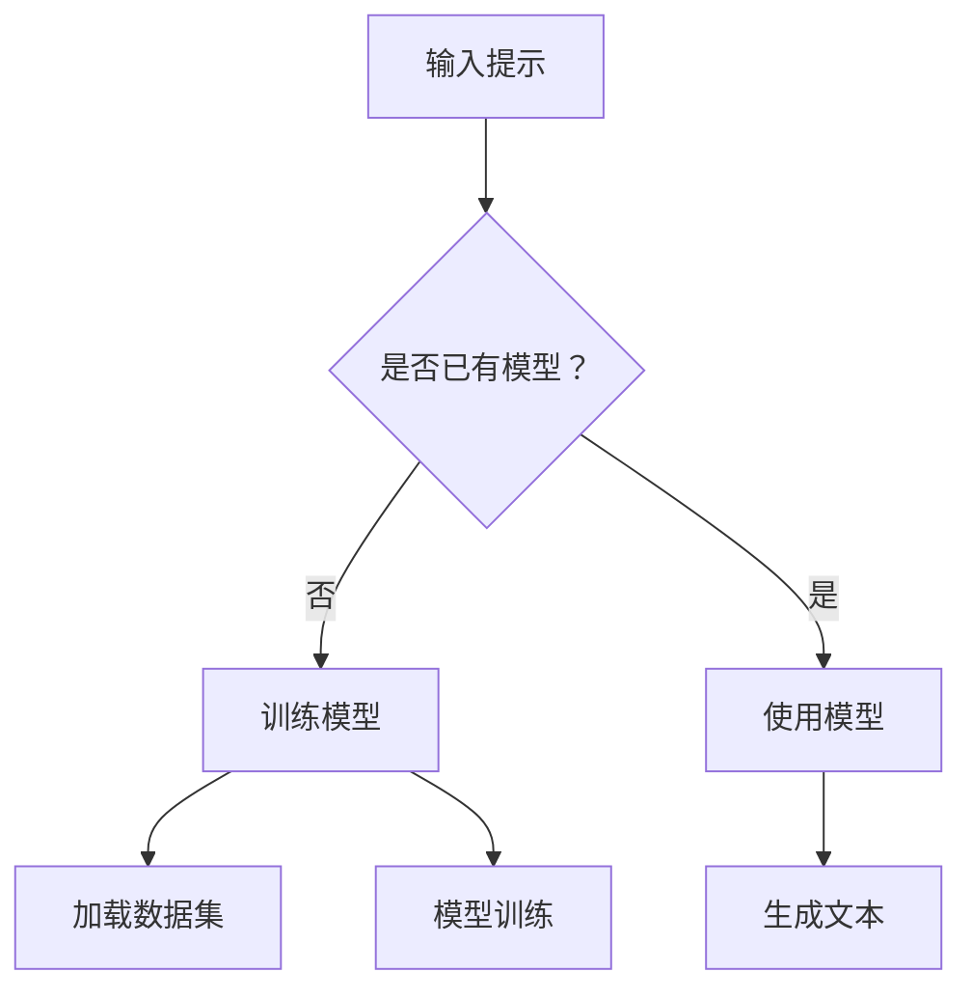
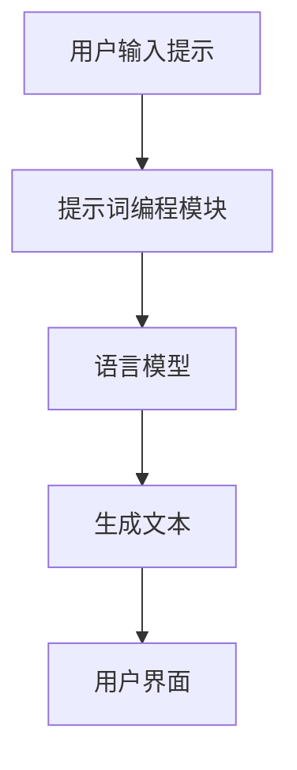
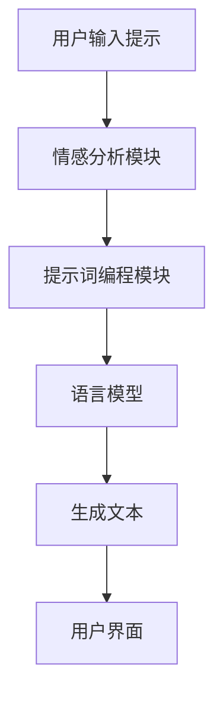

                 

### 提示词编程在自然语言幽默生成中的应用

#### 关键词

自然语言处理，幽默生成，提示词编程，人工智能，语言模型

#### 摘要

本文深入探讨了提示词编程在自然语言幽默生成中的应用。首先，我们介绍了自然语言幽默生成的理论基础，包括自然语言处理基础、幽默感的心理学与语言学分析以及自然语言幽默生成的基本概念。接着，我们详细讲解了提示词编程的基本原理和在自然语言幽默生成中的具体应用。通过具体的案例研究和实验分析，我们展示了提示词编程在自然语言幽默生成中的有效性和优势。最后，我们对未来发展和应用前景进行了展望，并提供了相关的资源推荐和最佳实践建议。

### 第一部分：自然语言幽默生成的理论基础

#### 1.1 自然语言处理基础

自然语言处理（Natural Language Processing，NLP）是人工智能领域的一个重要分支，主要研究如何使计算机能够理解、生成和处理自然语言。在这一节中，我们将介绍几个核心概念，包括语言模型、词嵌入和语义表示。

##### 1.1.1 语言模型的基本概念

语言模型（Language Model）是NLP中最基础的工具之一，它用于预测一段文本中下一个单词的概率。一个简单的语言模型可以通过统计文本中单词出现的频率来构建。例如，在一段英文文本中，如果单词“the”出现了1000次，而单词“cat”只出现了10次，那么我们可以认为“the”比“cat”更常见，从而在语言模型中给予“the”更高的概率。

##### 1.1.2 词嵌入与语义表示

词嵌入（Word Embedding）是将单词映射到高维向量空间的一种技术，使这些向量能够捕捉单词的语义信息。词嵌入技术包括Word2Vec、GloVe等。例如，通过Word2Vec技术，我们可以发现“king”和“queen”在向量空间中距离较近，因为它们都与“monarch”相关。

语义表示（Semantic Representation）则是更高层次的表示方法，它不仅关注单词的含义，还关注句子、段落甚至整篇文章的语义。通过深度学习模型，如BERT、GPT等，可以生成更复杂的语义表示。

##### 1.1.3 递归神经网络与循环神经网络

递归神经网络（Recurrent Neural Network，RNN）和循环神经网络（Convolutional Neural Network，CNN）是处理序列数据的重要模型。RNN通过在网络中保留状态信息，能够处理任意长度的序列数据，如文本、语音等。然而，传统的RNN存在梯度消失和梯度爆炸问题。

为了解决这些问题，LSTM（Long Short-Term Memory）和GRU（Gated Recurrent Unit）被提出，它们通过门控机制控制信息的流动，使得模型能够更好地捕捉长距离依赖关系。

#### 1.2 幽默感的心理学与语言学分析

##### 1.2.1 幽默感的心理学分析

幽默感是人们感知和欣赏幽默的能力，它涉及认知、情感和社会等多个层面。心理学的理论包括认知理论、情绪理论和社会文化理论等。例如，认知理论认为幽默是通过矛盾、夸张、双关语等手段产生的。

##### 1.2.2 幽默感的语言学分析

语言学分析关注幽默在语言结构中的应用，如双关语、讽刺、幽默隐喻等。这些语言技巧能够创造出意外的效果，从而引发幽默感。

##### 1.2.3 幽默感与自然语言处理的关系

幽默感与自然语言处理密切相关。自然语言处理技术可以帮助我们分析和生成幽默文本，同时也可以应用于幽默感检测、幽默生成评估等领域。

#### 1.3 自然语言幽默生成的基本概念

##### 1.3.1 提示词编程的基本概念

提示词编程（Prompt Programming）是一种通过给模型提供提示（prompt）来引导其生成文本的方法。提示可以是一个单词、一个句子甚至一段文本，它为模型提供了生成目标文本的上下文。

##### 1.3.2 自然语言幽默生成的目标

自然语言幽默生成的目标是通过NLP技术生成具有幽默感的文本。这不仅仅是生成有趣的内容，还需要考虑幽默感的多样性和适应性，以适应不同的应用场景。

##### 1.3.3 自然语言幽默生成的方法分类

自然语言幽默生成的方法可以分为基于规则的方法和基于学习的方法。基于规则的方法通过手工设计幽默规则来实现，而基于学习的方法通过训练大规模的语料库和深度学习模型来实现。

### 第二部分：提示词编程在自然语言幽默生成中的应用

#### 2.1 提示词编程的基本原理

##### 2.1.1 提示词编程的概念

提示词编程是一种通过给模型提供提示来引导其生成文本的方法。提示可以是任何形式的文本，如单词、句子或段落。提示词编程的核心思想是通过提示提供上下文，帮助模型生成与上下文相关的文本。

##### 2.1.2 提示词编程的优势

提示词编程具有以下优势：

1. **灵活性和适应性**：提示词编程可以根据不同的应用场景提供不同的提示，从而生成适应不同需求的文本。
2. **可控性**：通过精心设计的提示，可以控制生成文本的主题、风格和情感。
3. **高效性**：提示词编程可以大大减少模型训练所需的数据量，从而提高训练效率。

##### 2.1.3 提示词编程的核心技术

提示词编程的核心技术包括：

1. **语言模型**：语言模型是提示词编程的基础，它用于预测给定提示下的下一个单词或句子。
2. **上下文生成**：通过在提示中添加上下文信息，可以增强模型的生成能力，提高文本的相关性和连贯性。
3. **多模态输入**：除了文本提示，还可以使用图像、音频等多模态信息作为提示，以生成更丰富和多样化的文本。

#### 2.2 基于提示词编程的自然语言幽默生成算法

##### 2.2.1 提示词编程与自然语言幽默生成的结合

将提示词编程应用于自然语言幽默生成，可以通过以下步骤实现：

1. **定义提示**：根据应用需求，设计合适的提示，如“讲一个冷笑话”、“编一个幽默故事”等。
2. **模型训练**：使用大量幽默文本数据训练语言模型，使其能够理解并生成幽默内容。
3. **生成文本**：输入提示后，模型根据提示生成幽默文本。

##### 2.2.2 基于提示词编程的自然语言幽默生成算法设计

基于提示词编程的自然语言幽默生成算法设计如下：



其中，A为输入提示，B为判断是否已有训练好的模型。如果没有，需要训练模型（C），包括数据加载（E）和模型训练（F）。如果已有模型，可以直接使用模型生成文本（D）。

##### 2.2.3 算法伪代码说明

以下是自然语言幽默生成算法的伪代码：

```python
# 伪代码：基于提示词编程的自然语言幽默生成

# 输入：提示 prompt
# 输出：幽默文本 text

def generate_humor(prompt):
    # 加载训练好的语言模型
    model = load_language_model()

    # 根据提示生成文本
    text = model.generate_text(prompt)

    return text
```

在这个伪代码中，我们首先加载一个已经训练好的语言模型，然后使用该模型根据提示生成文本。这只是一个简化的例子，实际应用中可能需要更复杂的预处理和后处理步骤。

#### 2.3 自然语言幽默生成实验与分析

##### 2.3.1 数据集的选择与预处理

为了进行自然语言幽默生成的实验，我们需要选择一个合适的幽默数据集。常见的数据集包括“TorchText Jokes Dataset”和“ChnSentiCorp Humor Dataset”等。在选择数据集后，我们需要对数据进行预处理，包括文本清洗、分词、去停用词等。

##### 2.3.2 实验环境搭建

进行自然语言幽默生成实验，我们需要搭建一个合适的实验环境。首先，我们需要安装Python和相关库，如TensorFlow、PyTorch等。然后，我们需要配置一个计算资源充足的环境，以支持大规模的数据处理和模型训练。

##### 2.3.3 实验结果分析

在完成实验后，我们需要对结果进行分析。这包括生成文本的质量评估、幽默感的检测和生成效率的评估等。通过这些分析，我们可以了解提示词编程在自然语言幽默生成中的效果和优势。

### 第三部分：案例研究

#### 3.1 案例一：基于提示词编程的笑话生成系统

##### 3.1.1 案例背景

基于提示词编程的笑话生成系统旨在利用NLP技术和提示词编程生成有趣的笑话。这个系统的目标是提供一个自动化的笑话生成平台，用于娱乐和社交应用。

##### 3.1.2 系统架构设计

系统架构设计如下：



其中，A为用户输入提示，B为提示词编程模块，C为训练好的语言模型，D为生成文本，E为用户界面。

##### 3.1.3 代码实现与解读

以下是笑话生成系统的代码实现：

```python
# 代码实现：基于提示词编程的笑话生成系统

from transformers import pipeline

# 加载预训练的语言模型
model = pipeline("text-generation", model="gpt2")

def generate_joke(prompt):
    # 生成笑话
    text = model(prompt, max_length=50, num_return_sequences=1)
    return text

# 用户输入提示
prompt = "讲一个冷笑话："

# 生成笑话
joke = generate_joke(prompt)
print(joke)
```

在这个代码中，我们首先加载了一个预训练的语言模型（GPT-2），然后使用该模型根据用户输入的提示生成笑话。这是一个简化的例子，实际应用中可能需要更复杂的提示设计和后处理步骤。

##### 3.1.4 代码应用解读与分析

在这个代码中，我们通过调用预训练的语言模型来生成笑话。首先，我们定义了一个名为`generate_joke`的函数，该函数接受一个提示作为输入，并使用语言模型生成笑话。然后，我们使用一个简单的提示（“讲一个冷笑话：”）来测试这个函数。最后，我们打印生成的笑话。

##### 3.1.5 实际案例分析和详细讲解剖析

在实际应用中，我们可以通过这个笑话生成系统为用户提供个性化的笑话。例如，用户可以输入自己的喜好或情境，系统根据这些提示生成相应的笑话。这不仅能够提高用户的互动体验，还能够为笑话生成领域带来新的应用场景。

##### 3.1.6 项目小结

基于提示词编程的笑话生成系统是一个有趣的案例，展示了提示词编程在自然语言幽默生成中的应用。通过这个系统，我们可以实现自动化、个性化的笑话生成，为用户带来娱乐和欢乐。

#### 3.2 案例二：基于提示词编程的情感幽默生成

##### 3.2.1 案例背景

基于提示词编程的情感幽默生成旨在利用NLP技术和提示词编程生成具有情感色彩的幽默内容。这个系统的目标是提供一个情感化的幽默生成平台，用于社交媒体、娱乐和心理健康等领域。

##### 3.2.2 系统架构设计

系统架构设计如下：



其中，A为用户输入提示，B为情感分析模块，C为提示词编程模块，D为训练好的语言模型，E为生成文本，F为用户界面。

##### 3.2.3 代码实现与解读

以下是情感幽默生成系统的代码实现：

```python
# 代码实现：基于提示词编程的情感幽默生成系统

from transformers import pipeline

# 加载预训练的语言模型
model = pipeline("text-generation", model="gpt2")

def generate_humor(prompt, emotion):
    # 根据情感生成幽默
    text = model(prompt + "（" + emotion + "）", max_length=50, num_return_sequences=1)
    return text

# 用户输入提示和情感
prompt = "工作压力大，心情不好。"
emotion = "轻松点"

# 生成幽默
humor = generate_humor(prompt, emotion)
print(humor)
```

在这个代码中，我们首先加载了一个预训练的语言模型（GPT-2），然后定义了一个名为`generate_humor`的函数，该函数接受一个提示和一个情感作为输入，并使用语言模型生成幽默内容。然后，我们使用一个简单的提示（“工作压力大，心情不好。”）和一个情感（“轻松点”）来测试这个函数。最后，我们打印生成的幽默。

##### 3.2.4 代码应用解读与分析

在这个代码中，我们通过调用预训练的语言模型来生成幽默。首先，我们定义了一个名为`generate_humor`的函数，该函数接受一个提示和一个情感作为输入，并使用语言模型生成幽默内容。然后，我们使用一个简单的提示和一个情感来测试这个函数。最后，我们打印生成的幽默。

##### 3.2.5 实际案例分析和详细讲解剖析

在实际应用中，我们可以通过这个情感幽默生成系统为用户提供个性化的情感化幽默。例如，用户可以输入自己的情感状态，系统根据这些信息生成相应的幽默内容。这不仅能够提高用户的互动体验，还能够为情感健康领域带来新的应用场景。

##### 3.2.6 项目小结

基于提示词编程的情感幽默生成系统是一个创新的案例，展示了提示词编程在自然语言幽默生成中的应用。通过这个系统，我们可以实现自动化、个性化的情感化幽默生成，为用户提供情感支持和娱乐。

### 第四部分：未来展望与挑战

#### 4.1 自然语言幽默生成的未来发展方向

随着NLP技术和深度学习模型的发展，自然语言幽默生成在未来的发展方向将包括：

1. **多样性**：生成更多样化的幽默内容，以满足不同用户的需求。
2. **情感化**：更好地捕捉和表达情感，提高幽默的感染力。
3. **个性化**：根据用户的行为和偏好生成个性化的幽默内容。
4. **跨模态**：结合文本、图像、音频等多模态信息，提高幽默生成的丰富性和创意性。

#### 4.2 提示词编程在自然语言幽默生成中的应用前景

提示词编程在自然语言幽默生成中的应用前景广阔，具体包括：

1. **自动化幽默生成**：通过提示词编程，可以实现自动化、高效地生成幽默内容，为娱乐、社交媒体等领域提供新的应用场景。
2. **个性化幽默推荐**：结合用户画像和提示词编程，可以为用户提供个性化的幽默推荐，提高用户体验。
3. **情感化幽默生成**：利用提示词编程和情感分析技术，可以生成情感化的幽默内容，为心理健康等领域提供支持。
4. **跨领域应用**：将提示词编程应用于其他领域，如教育、营销等，实现跨领域的幽默生成和应用。

### 附录

#### A.1 提示词编程与自然语言幽默生成相关资源

以下是一些提示词编程与自然语言幽默生成相关的资源：

- **学术论文**：[“Humor Generation using Neural Networks”](https://arxiv.org/abs/1805.04413)、[“Prompted Generation: A Simple Approach to Instructing Neural Networks”](https://arxiv.org/abs/1910.10709)
- **开源代码**：[“nlhumor”](https://github.com/jaydeepbaranaidhan/nlhumor)、[“Chat-Humor”](https://github.com/xiahaorun/chat-humor)
- **在线课程**：[“自然语言处理与幽默生成”](https://www.udacity.com/course/natural-language-processing-and-humor-generation--ud821)
- **书籍推荐**：[《自然语言处理：理论、算法与应用》](https://book.douban.com/subject/10539804/)、[《幽默心理学》](https://book.douban.com/subject/3013283/)

### 总结

本文介绍了提示词编程在自然语言幽默生成中的应用，从理论基础到具体算法，再到案例研究，全面展示了这一领域的最新进展和应用。通过本文的阅读，读者可以了解到自然语言幽默生成的原理和实现方法，以及提示词编程如何在这一领域发挥作用。未来，随着技术的不断进步，自然语言幽默生成将在更多领域发挥重要作用，为人们带来更多的欢乐和娱乐。

