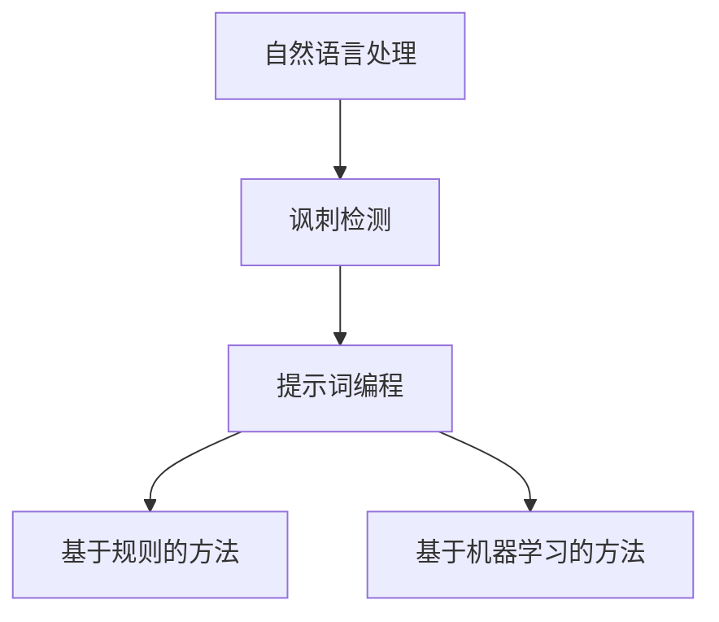

                 

### 文章标题：提示词编程在自然语言讽刺检测中的角色

### 关键词：自然语言处理、讽刺检测、提示词编程、人工智能、文本分析

### 摘要：
本文将深入探讨提示词编程在自然语言讽刺检测中的应用。首先，我们将介绍自然语言讽刺检测的背景和挑战。接着，本文将详细阐述提示词编程的基本概念及其在自然语言处理中的重要性。通过Mermaid流程图展示核心概念之间的关系，我们还将解析自然语言讽刺检测的算法原理，并使用伪代码详细说明。此外，本文将介绍数学模型和相关公式，结合实际案例对代码进行解读和分析，最后提出最佳实践建议和小结。

---

### 1.1 自然语言处理与讽刺检测

#### 1.1.1 自然语言处理

自然语言处理（Natural Language Processing, NLP）是计算机科学和人工智能领域的一个重要分支，它涉及使用计算机技术和算法来理解和生成人类语言。NLP的目标是通过理解和分析自然语言数据，使计算机能够与人类更有效地交流和互动。

在自然语言处理中，常见的任务包括文本分类、情感分析、命名实体识别、机器翻译等。这些任务不仅对学术界具有重要意义，也在实际应用中发挥着关键作用。例如，文本分类可以帮助网站过滤垃圾邮件，情感分析可以用于社交媒体情绪监测，命名实体识别则可以用于自动提取文章中的关键信息。

#### 1.1.2 讽刺检测

讽刺检测（Sarcasm Detection）是自然语言处理中的一个特殊任务，它旨在识别文本中潜在的讽刺含义。讽刺是一种复杂的语言现象，它通常涉及到语言的双关意义、反转逻辑和情感微妙的转变。讽刺检测的挑战在于，它不仅需要理解文本的字面意义，还需要捕捉到背后的情感和意图。

讽刺检测在多种应用场景中具有重要价值。例如，在社交媒体分析中，识别讽刺可以帮助平台更准确地理解用户的情感倾向，从而优化内容推荐和社交网络治理。在客户服务领域，讽刺检测可以帮助企业更好地理解客户的反馈，从而改进产品和服务。

---

### 1.2 提示词编程的基本概念

#### 1.2.1 提示词的定义与作用

提示词（Prompt）是在自然语言处理任务中用来引导模型预测的输入文本。提示词的作用是帮助模型更好地理解输入数据，从而提高预测的准确性和可靠性。提示词可以是简单的关键词，也可以是复杂的句子或段落。

在自然语言处理中，提示词编程（Prompt Engineering）是一个重要的研究方向。提示词编程的目标是设计出能够最大化模型性能的提示词。提示词编程的关键在于理解模型的工作原理，并根据模型的需求来设计提示词。

#### 1.2.2 提示词生成算法

提示词生成算法可以分为两类：基于规则的方法和基于机器学习的方法。

- **基于规则的方法**：这种方法依赖于预定义的规则和模式。例如，可以使用语法规则来生成提示词，以确保它们符合自然语言的语法结构。
- **基于机器学习的方法**：这种方法使用机器学习模型来从大量数据中学习生成提示词。常见的机器学习模型包括循环神经网络（RNN）和变压器（Transformer）。

提示词编程不仅需要理解模型的工作原理，还需要对自然语言处理任务有深入的了解。通过合理设计提示词，可以提高模型在自然语言处理任务中的性能。

---

### 1.3 核心概念之间的关系架构

为了更好地理解提示词编程在自然语言讽刺检测中的角色，我们使用Mermaid流程图来展示核心概念之间的关系。

图1.1 提示词编程在自然语言讽刺检测中的角色架构

在这个流程图中，自然语言处理作为基础，讽刺检测作为具体任务，而提示词编程则作为连接自然语言处理和讽刺检测的桥梁。基于规则和基于机器学习的方法是提示词编程的两种实现方式，它们共同作用于提高讽刺检测的准确性。

---

### 1.4 下一步分析

在下一部分，我们将深入探讨自然语言讽刺检测的挑战，分析讽刺语言的复杂性以及当前的数据集和标注问题。随后，我们将详细介绍提示词编程的基本原理，包括提示词的定义、作用和生成算法。通过这些分析，我们将为后续章节的核心算法原理讲解和伪代码提供坚实的理论基础。

