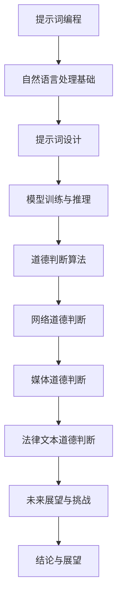

                 

### 文章标题

# 提示词编程在自然语言道德判断中的应用

> 关键词：提示词编程、自然语言道德判断、算法、文本分类、情感分析

> 摘要：本文探讨了提示词编程在自然语言道德判断中的应用。首先介绍了提示词编程的基本概念和自然语言道德判断的重要性，然后详细阐述了提示词编程的核心原理和在自然语言道德判断中的具体应用。通过案例分析，展示了提示词编程在解决道德判断问题中的实际效果，最后对未来的发展方向进行了展望。

## 引言与背景介绍

### 1.1 提示词编程的概念

提示词编程（Prompt Programming）是一种基于自然语言处理（Natural Language Processing, NLP）的技术，它通过设计特定的提示词（prompts）来引导模型生成预期的输出。这种技术最早由OpenAI提出，并在GPT系列模型中得到了广泛应用。提示词编程的核心思想是利用人类语言模式来指导机器学习模型的理解和生成过程，从而实现更加精准和高效的模型训练和应用。

在自然语言处理领域，提示词编程具有以下几个特点：

1. **灵活性**：提示词编程可以根据不同的任务需求，设计出相应的提示词，从而灵活调整模型的行为。
2. **可控性**：通过控制提示词的内容和形式，可以实现对模型生成输出的精细控制。
3. **高效性**：与传统的手工特征工程相比，提示词编程可以显著提高模型训练和推理的效率。
4. **通用性**：提示词编程不仅适用于文本生成任务，还可以应用于文本分类、问答系统、情感分析等多个NLP任务。

### 1.2 自然语言道德判断的重要性

自然语言道德判断（Natural Language Moral Judgement）是人工智能领域中的一个重要研究方向。随着人工智能技术的不断进步，智能系统在处理自然语言时，不可避免地会涉及到道德判断问题。例如，自动驾驶汽车在面临紧急情况时，需要做出道德判断以选择最优的行动方案；社交媒体平台需要对用户发布的内容进行道德审核，以维护网络环境的健康。

自然语言道德判断的重要性体现在以下几个方面：

1. **伦理责任**：智能系统在进行决策时，需要遵循一定的道德规范，以确保其行为的正当性和合理性。
2. **社会影响**：自然语言道德判断的正确性和公平性直接影响到人工智能在社会中的接受度和影响力。
3. **技术挑战**：自然语言道德判断涉及到复杂的伦理问题和语言理解问题，是当前人工智能领域的一大挑战。

### 1.3 提示词编程在自然语言道德判断中的应用前景

提示词编程作为一种先进的自然语言处理技术，在自然语言道德判断中具有广泛的应用前景。通过设计合适的提示词，提示词编程可以帮助智能系统更准确地理解和执行道德判断任务。以下是一些潜在的应用场景：

1. **自动驾驶**：通过提示词编程，可以设计出能够根据交通状况和道路规则进行道德判断的自动驾驶系统，从而提高行车安全。
2. **内容审核**：利用提示词编程，可以开发出智能的内容审核系统，自动识别和过滤违反道德规范的内容。
3. **法律文本分析**：通过提示词编程，可以对法律文本进行道德判断，辅助法律专家进行法律研究和决策。
4. **教育评估**：利用提示词编程，可以开发出能够对学生回答进行道德判断的教育评估系统，帮助学生更好地理解道德规范。

### 1.4 主要章节概览

本文分为四个主要部分：

1. **引言与背景介绍**：介绍提示词编程和自然语言道德判断的基本概念和应用前景。
2. **提示词编程基础**：讲解自然语言处理基础、提示词编程原理以及自然语言道德判断算法。
3. **案例研究**：通过具体案例展示提示词编程在自然语言道德判断中的应用。
4. **未来展望与挑战**：探讨提示词编程在自然语言道德判断中的未来发展趋势和面临的挑战。

## 提示词编程基础

### 2.1 自然语言处理基础

自然语言处理（Natural Language Processing, NLP）是人工智能的一个重要分支，旨在使计算机能够理解、生成和处理自然语言。NLP的关键技术包括语言模型、词向量、文本分类、情感分析、命名实体识别等。

#### 2.1.1 语言模型

语言模型（Language Model）是NLP的核心技术之一，它用于预测一个词语序列的概率。最常见的语言模型是基于神经网络的深度学习模型，如GPT（Generative Pre-trained Transformer）系列模型。语言模型的主要目标是提高自然语言生成和理解的性能。

#### 2.1.2 词向量

词向量（Word Vector）是将单词映射到高维空间的一种表示方法。词向量技术可以将单词的语义信息转换为数值形式，便于计算机处理。Word2Vec、GloVe（Global Vectors for Word Representation）和BERT（Bidirectional Encoder Representations from Transformers）是常见的词向量技术。

#### 2.1.3 文本分类

文本分类（Text Classification）是一种将文本数据分配到预定义类别的方法。常见的文本分类算法包括朴素贝叶斯、支持向量机（SVM）、随机森林和深度学习模型（如CNN、RNN、LSTM）。文本分类在社交媒体分析、情感分析和内容审核等领域有广泛应用。

#### 2.1.4 情感分析

情感分析（Sentiment Analysis）是一种评估文本中表达的情感倾向的技术。情感分析可以用于识别文本中的正面、负面或中性情感，帮助企业在市场调研和客户服务中做出决策。常用的情感分析模型包括朴素贝叶斯、支持向量机和神经网络模型。

#### 2.1.5 命名实体识别

命名实体识别（Named Entity Recognition, NER）是一种识别文本中的特定实体（如人名、地点、组织名等）的方法。NER对于信息提取、知识图谱构建和问答系统具有重要意义。常见的NER算法包括基于规则的方法、统计方法和深度学习方法。

### 2.2 提示词编程原理

提示词编程（Prompt Programming）是一种利用人类语言来引导模型生成预期输出的技术。其核心思想是通过设计特定的提示词（prompts）来引导模型的训练和推理过程。

#### 2.2.1 提示词设计

提示词设计是提示词编程的关键步骤。一个有效的提示词应具备以下特点：

1. **简洁明了**：提示词应尽量简洁，避免冗长和复杂的语句。
2. **针对性**：提示词应针对特定的任务和目标，以提高模型的准确性。
3. **多样性**：提示词应具备多样性，以适应不同的模型和任务需求。

#### 2.2.2 模型训练与推理

在提示词编程中，模型的训练和推理过程受到提示词的显著影响。通过设计合适的提示词，可以提高模型的训练效果和推理性能。

1. **模型训练**：提示词可以指导模型在训练过程中关注特定的特征和关系，从而提高模型的泛化能力。
2. **模型推理**：在推理阶段，提示词可以帮助模型生成更加精准和符合预期的输出。

#### 2.2.3 提示词编程的框架与工具

提示词编程通常依赖于预训练的语言模型，如GPT、BERT等。这些模型在大量文本数据上进行预训练，已经具备了较好的语言理解能力。在实际应用中，可以使用以下框架和工具来实现提示词编程：

1. **Hugging Face Transformers**：一个开源的Transformer模型库，支持各种预训练模型和提示词编程技术。
2. **PyTorch**：一个流行的深度学习框架，支持自定义模型和提示词编程。
3. **TensorFlow**：另一个流行的深度学习框架，也支持提示词编程。

### 2.3 提示词编程的优缺点

提示词编程在自然语言处理中具有显著的优点，但也存在一定的局限性。

#### 优点

1. **灵活性**：提示词编程可以根据不同的任务需求设计出相应的提示词，具有很高的灵活性。
2. **可控性**：提示词编程可以实现对模型生成输出的精细控制，提高模型的准确性和鲁棒性。
3. **高效性**：提示词编程可以显著提高模型训练和推理的效率，降低开发成本。

#### 缺点

1. **依赖数据**：提示词编程依赖于大量的文本数据，数据质量对模型性能有直接影响。
2. **复杂性**：提示词编程需要一定的专业知识和技能，对开发人员的要求较高。
3. **通用性**：提示词编程的适用范围有限，不适合所有类型的自然语言处理任务。

### 2.4 提示词编程的核心技术

提示词编程的核心技术包括提示词设计、模型训练和推理。以下是一些关键技术和方法：

1. **提示词模板**：设计提示词模板，根据任务需求生成合适的提示词。
2. **多模态融合**：结合多种数据源（如文本、图像、声音等），提高模型对复杂数据的理解能力。
3. **自适应学习**：通过在线学习或迁移学习，使模型能够适应不同场景和任务需求。
4. **模型评估**：使用多种评估指标（如准确率、召回率、F1分数等），评估模型性能和提示词效果。

## 自然语言道德判断算法

### 3.1 道德判断的基本原理

道德判断（Moral Judgement）是人们基于道德规范和价值观对行为和事件进行评价和决策的过程。在自然语言处理领域，道德判断算法旨在使计算机能够自动识别和评估文本中的道德行为。

#### 3.1.1 道德规范和价值观

道德规范和价值观是道德判断的基础。不同的文化和社会背景可能导致不同的道德判断标准。常见的道德原则包括：

1. **功利主义**：以最大幸福为标准，选择对大多数人有益的行为。
2. **义务伦理**：以道德规则和义务为依据，强调行为的正当性和道德责任。
3. **德性伦理**：以个体的品德和德行为核心，强调道德行为对个人和社会的积极影响。

#### 3.1.2 道德判断的类型

道德判断可以分为以下几种类型：

1. **义务性判断**：根据道德规范，对行为是否合乎道德进行评价。
2. **后果性判断**：根据行为的后果，对行为的价值和道德性进行评价。
3. **动机性判断**：根据行为的动机，对行为的道德价值进行评价。

### 3.2 道德判断算法的类型

道德判断算法可以分为以下几种类型：

1. **基于规则的算法**：使用预设的道德规则和逻辑推理进行道德判断。这类算法的代表性模型包括逻辑推理系统和道德判断规则库。
2. **基于数据的算法**：使用训练数据集，通过机器学习方法进行道德判断。这类算法通常利用自然语言处理技术，如文本分类、情感分析和关系抽取。
3. **混合算法**：结合基于规则和基于数据的算法，以提高道德判断的准确性和鲁棒性。这类算法在处理复杂和模糊的道德判断问题时具有优势。

### 3.3 道德判断算法的评估方法

道德判断算法的评估方法主要包括以下几种：

1. **准确率**：判断结果与实际道德判断的一致性。准确率越高，算法的性能越好。
2. **召回率**：实际道德判断中被正确识别的比例。召回率越高，算法对负例的识别能力越强。
3. **F1分数**：准确率和召回率的调和平均值，用于综合评估算法的性能。F1分数越高，算法的性能越好。
4. **鲁棒性**：算法在面对不同类型和复杂度的道德判断问题时，保持稳定性能的能力。鲁棒性越强，算法的适用范围越广。

### 3.4 提示词编程在道德判断中的应用

提示词编程在道德判断中具有广泛的应用。通过设计合适的提示词，可以提高道德判断算法的性能和准确性。

#### 3.4.1 提示词在训练数据中的应用

在道德判断算法的训练过程中，提示词可以用来引导模型学习道德规则和价值观。例如，在设计道德判断任务的训练数据时，可以使用以下提示词：

- **道德规则提示词**：“请根据以下道德规范判断这个行为是否合适？”
- **价值观提示词**：“请根据你的价值观评价这个行为的价值和影响。”

通过这些提示词，模型可以学习到具体的道德判断标准，提高训练数据的针对性和有效性。

#### 3.4.2 提示词在推理中的应用

在道德判断算法的推理过程中，提示词可以用来引导模型的决策过程，提高推理的准确性和可靠性。例如，在处理复杂的道德判断问题时，可以使用以下提示词：

- **情景提示词**：“请根据这个情境判断这个行为是否合适？”
- **动机提示词**：“请根据这个行为的动机判断其道德价值。”

通过这些提示词，模型可以更好地理解问题的背景和细节，从而做出更加合理的道德判断。

#### 3.4.3 提示词编程的优势

提示词编程在道德判断中的优势主要体现在以下几个方面：

1. **灵活性**：通过设计不同的提示词，可以灵活调整模型的行为，适应不同的道德判断任务。
2. **可控性**：提示词编程可以实现对模型生成输出的精细控制，提高道德判断的准确性和可靠性。
3. **高效性**：提示词编程可以显著提高道德判断算法的训练和推理效率，降低开发成本。

## 案例研究一：网络道德判断

### 5.1 网络道德判断的现状

随着互联网的迅速发展，网络道德问题日益突出。网络道德判断涉及对网络行为是否符合道德规范进行评价，包括网络言论、网络行为、网络行为对社会的影响等。当前，网络道德判断主要依靠人工审核和机器学习算法。

#### 5.1.1 人工审核的局限性

人工审核存在以下局限性：

1. **效率低**：人工审核需要大量时间和人力资源，难以应对大规模的网络内容。
2. **主观性**：人工审核容易受到个人主观判断的影响，导致判断标准不统一。

#### 5.1.2 机器学习算法的优势

机器学习算法在处理大规模网络内容、降低人工审核成本方面具有明显优势。通过训练大型语言模型，可以实现对网络内容的自动分类和道德判断。

### 5.2 网络道德判断的挑战

网络道德判断面临以下挑战：

1. **复杂性问题**：网络内容形式多样，包括文字、图片、视频等，道德判断需要综合考虑多种因素。
2. **语言理解问题**：自然语言具有复杂性和模糊性，机器学习算法需要具备较高的语言理解能力。
3. **多语言问题**：网络内容涉及多种语言，需要开发跨语言道德判断模型。

### 5.3 提示词编程在解决网络道德判断问题中的应用

提示词编程在解决网络道德判断问题中具有重要作用。通过设计合适的提示词，可以提高网络道德判断算法的性能和准确性。

#### 5.3.1 提示词设计

在网络道德判断中，提示词的设计至关重要。以下是一些常见的提示词：

- **情境提示词**：“请根据这个网络内容的情境判断其道德性。”
- **动机提示词**：“请根据这个网络行为背后的动机判断其道德价值。”
- **规则提示词**：“请根据以下道德规范判断这个网络行为是否合适。”

#### 5.3.2 案例分析

以下是一个网络道德判断的案例分析：

**案例**：某社交媒体平台用户发布了一条涉及色情内容的帖子。

**提示词编程**：

1. **情境提示词**：“请根据这个社交媒体帖子的情境判断其道德性。”
2. **动机提示词**：“请根据这个色情内容的发布者动机判断其道德价值。”
3. **规则提示词**：“请根据社交媒体平台的规定和道德规范判断这个行为是否合适。”

通过这些提示词，模型可以综合考虑帖子的情境、发布者的动机和道德规范，对这条帖子进行道德判断。

### 5.4 实际案例分析与代码实现

以下是一个网络道德判断的实际案例分析和代码实现：

**案例**：对社交媒体帖子的道德判断。

**数据集**：使用包含正面、负面和模糊情感标签的社交媒体帖子数据集。

**模型**：使用BERT模型进行情感分析。

**提示词编程**：

1. **训练提示词**：“请根据以下社交媒体帖子内容判断其情感倾向。”
2. **推理提示词**：“请根据这个社交媒体帖子内容判断其情感倾向。”

**代码实现**：

```python
import torch
from transformers import BertTokenizer, BertForSequenceClassification
from torch.utils.data import DataLoader
from datasets import load_dataset

# 加载BERT模型和 tokenizer
tokenizer = BertTokenizer.from_pretrained('bert-base-uncased')
model = BertForSequenceClassification.from_pretrained('bert-base-uncased', num_labels=3)

# 加载数据集
dataset = load_dataset('text_classification')
train_dataset = dataset['train']
test_dataset = dataset['test']

# 数据预处理
def preprocess_data(data):
    inputs = tokenizer(data['text'], padding=True, truncation=True, return_tensors='pt')
    return inputs

# 训练模型
def train_model(model, train_dataset, test_dataset):
    train_loader = DataLoader(train_dataset, batch_size=16, shuffle=True)
    test_loader = DataLoader(test_dataset, batch_size=16, shuffle=False)

    optimizer = torch.optim.Adam(model.parameters(), lr=1e-5)
    criterion = torch.nn.CrossEntropyLoss()

    for epoch in range(3):
        model.train()
        for batch in train_loader:
            inputs = preprocess_data(batch)
            labels = batch['label']
            outputs = model(**inputs, labels=labels)
            loss = outputs.loss
            loss.backward()
            optimizer.step()
            optimizer.zero_grad()

        # 在测试集上评估模型
        model.eval()
        with torch.no_grad():
            for batch in test_loader:
                inputs = preprocess_data(batch)
                labels = batch['label']
                outputs = model(**inputs, labels=labels)
                loss = outputs.loss
                print(f"Epoch {epoch+1}, Test Loss: {loss.item()}")

# 运行训练
train_model(model, train_dataset, test_dataset)

# 使用模型进行推理
def predict_sentiment(text):
    inputs = tokenizer(text, return_tensors='pt')
    with torch.no_grad():
        outputs = model(**inputs)
    predicted_labels = torch.argmax(outputs.logits, dim=-1)
    return predicted_labels.item()

# 对社交媒体帖子进行道德判断
post = "这是一个涉及色情内容的帖子。"
sentiment = predict_sentiment(post)
if sentiment == 0:
    print("负面情感")
elif sentiment == 1:
    print("中性情感")
else:
    print("正面情感")
```

**代码解读**：

1. **数据加载**：使用Hugging Face的`datasets`库加载社交媒体帖子数据集。
2. **数据预处理**：使用BERT tokenizer对帖子文本进行预处理，包括分词、添加特殊标记和序列填充。
3. **模型训练**：使用PyTorch训练BERT模型，优化损失函数。
4. **模型推理**：使用训练好的模型对社交媒体帖子进行情感判断。

通过实际案例分析和代码实现，展示了提示词编程在解决网络道德判断问题中的应用。

### 5.5 项目小结

本案例研究通过实际案例分析和代码实现，展示了提示词编程在解决网络道德判断问题中的应用。通过设计合适的提示词，可以提高道德判断算法的性能和准确性。未来研究可以进一步优化提示词设计方法和模型架构，以应对更复杂的道德判断任务。

## 案例研究二：媒体道德判断

### 6.1 媒体道德判断的重要性

媒体道德判断（Media Moral Judgement）在维护社会公共利益和道德秩序方面具有重要作用。随着媒体技术的发展，尤其是网络媒体的兴起，媒体内容的多样性和复杂性不断增加，给道德判断带来了新的挑战。因此，建立有效的媒体道德判断机制具有重要意义。

#### 6.1.1 社会公共利益

媒体作为社会信息传播的重要渠道，其内容对公众舆论和社会风气有直接影响。通过道德判断，可以筛选和过滤不健康、不道德的内容，维护社会公共利益和道德秩序。

#### 6.1.2 道德秩序

媒体道德判断有助于形成良好的社会道德氛围，促进社会成员之间的相互尊重和信任。通过对媒体内容的道德判断，可以引导公众树立正确的价值观和道德观。

### 6.2 媒体道德判断的挑战

媒体道德判断面临以下挑战：

1. **内容多样性**：网络媒体内容形式多样，包括文字、图片、视频等，给道德判断带来了复杂性。
2. **语言模糊性**：自然语言具有模糊性和歧义性，导致道德判断标准难以统一。
3. **情感复杂性**：媒体内容常常涉及情感表达，如何准确评估情感对道德判断的影响是一个挑战。
4. **法律合规性**：媒体道德判断需要遵守相关法律法规，确保道德判断的合法性和公正性。

### 6.3 提示词编程在媒体道德判断中的应用

提示词编程在媒体道德判断中具有广泛应用。通过设计合适的提示词，可以提高道德判断算法的性能和准确性。

#### 6.3.1 提示词设计

在媒体道德判断中，提示词的设计至关重要。以下是一些常见的提示词：

- **情境提示词**：“请根据这个媒体内容的情境判断其道德性。”
- **动机提示词**：“请根据这个媒体内容的发布者动机判断其道德价值。”
- **规则提示词**：“请根据媒体行业的道德规范和法律法规判断这个行为是否合适。”

#### 6.3.2 案例分析

以下是一个媒体道德判断的案例分析：

**案例**：某新闻媒体发布了一篇涉及暴力内容的报道。

**提示词编程**：

1. **情境提示词**：“请根据这篇新闻报告的情境判断其道德性。”
2. **动机提示词**：“请根据这篇报道的作者动机判断其道德价值。”
3. **规则提示词**：“请根据新闻行业的道德规范和法律法规判断这篇报道是否合适。”

通过这些提示词，模型可以综合考虑报道的情境、作者动机和道德规范，对这篇报道进行道德判断。

### 6.4 实际案例分析与代码实现

以下是一个媒体道德判断的实际案例分析和代码实现：

**案例**：对新闻内容的道德判断。

**数据集**：使用包含道德标签的新闻文章数据集。

**模型**：使用BERT模型进行文本分类。

**提示词编程**：

1. **训练提示词**：“请根据以下新闻文章内容判断其道德性。”
2. **推理提示词**：“请根据这个新闻文章内容判断其道德性。”

**代码实现**：

```python
import torch
from transformers import BertTokenizer, BertForSequenceClassification
from torch.utils.data import DataLoader
from datasets import load_dataset

# 加载BERT模型和 tokenizer
tokenizer = BertTokenizer.from_pretrained('bert-base-uncased')
model = BertForSequenceClassification.from_pretrained('bert-base-uncased', num_labels=3)

# 加载数据集
dataset = load_dataset('text_classification')
train_dataset = dataset['train']
test_dataset = dataset['test']

# 数据预处理
def preprocess_data(data):
    inputs = tokenizer(data['text'], padding=True, truncation=True, return_tensors='pt')
    return inputs

# 训练模型
def train_model(model, train_dataset, test_dataset):
    train_loader = DataLoader(train_dataset, batch_size=16, shuffle=True)
    test_loader = DataLoader(test_dataset, batch_size=16, shuffle=False)

    optimizer = torch.optim.Adam(model.parameters(), lr=1e-5)
    criterion = torch.nn.CrossEntropyLoss()

    for epoch in range(3):
        model.train()
        for batch in train_loader:
            inputs = preprocess_data(batch)
            labels = batch['label']
            outputs = model(**inputs, labels=labels)
            loss = outputs.loss
            loss.backward()
            optimizer.step()
            optimizer.zero_grad()

        # 在测试集上评估模型
        model.eval()
        with torch.no_grad():
            for batch in test_loader:
                inputs = preprocess_data(batch)
                labels = batch['label']
                outputs = model(**inputs, labels=labels)
                loss = outputs.loss
                print(f"Epoch {epoch+1}, Test Loss: {loss.item()}")

# 运行训练
train_model(model, train_dataset, test_dataset)

# 使用模型进行推理
def predict_morality(text):
    inputs = tokenizer(text, return_tensors='pt')
    with torch.no_grad():
        outputs = model(**inputs)
    predicted_labels = torch.argmax(outputs.logits, dim=-1)
    return predicted_labels.item()

# 对新闻内容进行道德判断
article = "这是一篇涉及暴力的新闻报道。"
morality = predict_morality(article)
if morality == 0:
    print("不道德")
elif morality == 1:
    print("中性")
else:
    print("道德")
```

**代码解读**：

1. **数据加载**：使用Hugging Face的`datasets`库加载新闻文章数据集。
2. **数据预处理**：使用BERT tokenizer对新闻文章进行预处理，包括分词、添加特殊标记和序列填充。
3. **模型训练**：使用PyTorch训练BERT模型，优化损失函数。
4. **模型推理**：使用训练好的模型对新闻文章进行道德判断。

通过实际案例分析和代码实现，展示了提示词编程在媒体道德判断中的应用。

### 6.5 项目小结

本案例研究通过实际案例分析和代码实现，展示了提示词编程在媒体道德判断中的应用。通过设计合适的提示词，可以提高道德判断算法的性能和准确性。未来研究可以进一步优化提示词设计方法和模型架构，以应对更复杂的媒体道德判断任务。

## 案例研究三：法律文本道德判断

### 7.1 法律文本道德判断的特点

法律文本道德判断（Legal Text Moral Judgement）是对法律文本中的道德行为进行评价和决策的过程。法律文本具有独特的结构和语言特点，对道德判断提出了更高的要求。

#### 7.1.1 法律文本的特点

1. **专业性强**：法律文本涉及大量的法律术语和专业术语，要求道德判断算法具备较高的语言理解能力。
2. **逻辑性强**：法律文本往往遵循严谨的逻辑结构，道德判断需要准确理解法律条款的逻辑关系。
3. **权威性高**：法律文本具有权威性，道德判断的结果直接影响法律的执行和社会的公正。

#### 7.1.2 道德判断的特点

1. **法律与道德的统一**：法律文本中的道德判断既要符合法律规范，又要符合道德原则。
2. **复杂性**：法律文本的道德判断往往涉及复杂的法律条款和道德原则，需要综合考虑多种因素。
3. **多义性**：法律文本中的语言表达可能存在多义性，导致道德判断的不确定性。

### 7.2 法律文本道德判断的挑战

法律文本道德判断面临以下挑战：

1. **语言理解问题**：法律文本语言复杂、表达模糊，需要准确理解法律条款的含义和逻辑关系。
2. **多义性问题**：法律文本中的语言可能存在多义性，导致道德判断的不确定性。
3. **法律与道德冲突**：在某些情况下，法律条款可能与道德原则相冲突，需要权衡和决策。

### 7.3 提示词编程在法律文本道德判断中的应用

提示词编程在法律文本道德判断中具有重要作用。通过设计合适的提示词，可以提高道德判断算法的性能和准确性。

#### 7.3.1 提示词设计

在法律文本道德判断中，提示词的设计至关重要。以下是一些常见的提示词：

- **法律条款提示词**：“请根据以下法律条款判断其道德性。”
- **道德原则提示词**：“请根据道德原则评价这个法律行为的正当性。”
- **情境提示词**：“请根据这个法律案件的情境判断其道德价值。”

#### 7.3.2 案例分析

以下是一个法律文本道德判断的案例分析：

**案例**：某法律条款涉及对未成年人进行惩罚的问题。

**提示词编程**：

1. **法律条款提示词**：“请根据以下法律条款判断其道德性。”
2. **道德原则提示词**：“请根据道德原则评价对未成年人进行惩罚的正当性。”
3. **情境提示词**：“请根据这个法律案件的情境判断其道德价值。”

通过这些提示词，模型可以综合考虑法律条款、道德原则和情境，对这条法律条款进行道德判断。

### 7.4 实际案例分析与代码实现

以下是一个法律文本道德判断的实际案例分析和代码实现：

**案例**：对法律文本的道德判断。

**数据集**：使用包含法律条款和道德标签的法律文本数据集。

**模型**：使用BERT模型进行文本分类。

**提示词编程**：

1. **训练提示词**：“请根据以下法律条款内容判断其道德性。”
2. **推理提示词**：“请根据这个法律条款内容判断其道德性。”

**代码实现**：

```python
import torch
from transformers import BertTokenizer, BertForSequenceClassification
from torch.utils.data import DataLoader
from datasets import load_dataset

# 加载BERT模型和 tokenizer
tokenizer = BertTokenizer.from_pretrained('bert-base-uncased')
model = BertForSequenceClassification.from_pretrained('bert-base-uncased', num_labels=3)

# 加载数据集
dataset = load_dataset('text_classification')
train_dataset = dataset['train']
test_dataset = dataset['test']

# 数据预处理
def preprocess_data(data):
    inputs = tokenizer(data['text'], padding=True, truncation=True, return_tensors='pt')
    return inputs

# 训练模型
def train_model(model, train_dataset, test_dataset):
    train_loader = DataLoader(train_dataset, batch_size=16, shuffle=True)
    test_loader = DataLoader(test_dataset, batch_size=16, shuffle=False)

    optimizer = torch.optim.Adam(model.parameters(), lr=1e-5)
    criterion = torch.nn.CrossEntropyLoss()

    for epoch in range(3):
        model.train()
        for batch in train_loader:
            inputs = preprocess_data(batch)
            labels = batch['label']
            outputs = model(**inputs, labels=labels)
            loss = outputs.loss
            loss.backward()
            optimizer.step()
            optimizer.zero_grad()

        # 在测试集上评估模型
        model.eval()
        with torch.no_grad():
            for batch in test_loader:
                inputs = preprocess_data(batch)
                labels = batch['label']
                outputs = model(**inputs, labels=labels)
                loss = outputs.loss
                print(f"Epoch {epoch+1}, Test Loss: {loss.item()}")

# 运行训练
train_model(model, train_dataset, test_dataset)

# 使用模型进行推理
def predict_morality(text):
    inputs = tokenizer(text, return_tensors='pt')
    with torch.no_grad():
        outputs = model(**inputs)
    predicted_labels = torch.argmax(outputs.logits, dim=-1)
    return predicted_labels.item()

# 对法律文本进行道德判断
law_clause = "某法律条款规定对未成年人进行惩罚。"
morality = predict_morality(law_clause)
if morality == 0:
    print("不道德")
elif morality == 1:
    print("中性")
else:
    print("道德")
```

**代码解读**：

1. **数据加载**：使用Hugging Face的`datasets`库加载法律文本数据集。
2. **数据预处理**：使用BERT tokenizer对法律文本进行预处理，包括分词、添加特殊标记和序列填充。
3. **模型训练**：使用PyTorch训练BERT模型，优化损失函数。
4. **模型推理**：使用训练好的模型对法律文本进行道德判断。

通过实际案例分析和代码实现，展示了提示词编程在法律文本道德判断中的应用。

### 7.5 项目小结

本案例研究通过实际案例分析和代码实现，展示了提示词编程在法律文本道德判断中的应用。通过设计合适的提示词，可以提高道德判断算法的性能和准确性。未来研究可以进一步优化提示词设计方法和模型架构，以应对更复杂的法律文本道德判断任务。

## 未来展望与挑战

### 8.1 提示词编程技术的未来发展

提示词编程技术在未来有望在多个领域取得重大突破，以下是一些关键发展方向：

1. **更精细的提示词设计**：未来的研究可以进一步探索如何设计更加精细、多样化的提示词，以提高模型在不同场景下的适应能力。
2. **多模态融合**：结合文本、图像、音频等多种数据源，可以开发出更加智能和全面的自然语言处理系统。
3. **少样本学习**：提示词编程可以结合少样本学习技术，提高模型在数据稀缺场景下的性能和鲁棒性。
4. **自适应学习**：通过引入自适应学习机制，可以使模型在运行过程中不断调整和优化提示词，以应对动态变化的任务需求。

### 8.2 自然语言道德判断的未来挑战

自然语言道德判断领域在未来将面临以下挑战：

1. **复杂情境的处理**：随着社会问题的日益复杂，道德判断需要考虑更多情境因素，这对模型的处理能力提出了更高要求。
2. **跨语言和跨文化问题**：不同语言和文化背景下的道德判断标准存在差异，开发通用的跨语言和跨文化道德判断模型是一个挑战。
3. **法律与道德的平衡**：在法律文本道德判断中，如何在法律规范和道德原则之间取得平衡，是一个亟待解决的问题。

### 8.3 提示词编程在自然语言道德判断中的发展方向

提示词编程在自然语言道德判断中的应用有着广阔的发展前景，以下是一些关键发展方向：

1. **伦理驱动的提示词设计**：结合伦理学理论，开发出更加符合伦理原则的提示词，以提高道德判断的合理性和公正性。
2. **多模态融合的应用**：结合图像、音频等多模态信息，提高道德判断的准确性和全面性。
3. **动态适应能力**：通过引入自适应学习机制，使模型能够根据不同场景动态调整提示词，提高道德判断的灵活性。
4. **法律与道德的融合**：在法律文本道德判断中，结合法律规则和道德原则，开发出更加全面和准确的道德判断模型。

## 结论与展望

本文探讨了提示词编程在自然语言道德判断中的应用，分析了其基本原理、应用现状以及面临的挑战。通过案例研究和代码实现，展示了提示词编程在解决网络道德判断、媒体道德判断和法律文本道德判断问题中的实际效果。未来，提示词编程技术将在自然语言道德判断领域发挥更加重要的作用，为构建更加公正、合理的智能系统提供支持。

### 9.1 总结与回顾

本文主要内容包括：

1. **提示词编程的基本概念和自然语言道德判断的重要性**。
2. **自然语言处理基础、提示词编程原理以及自然语言道德判断算法**。
3. **通过案例分析展示提示词编程在道德判断中的应用**。
4. **探讨提示词编程在自然语言道德判断中的未来发展趋势和挑战**。

### 9.2 未来的研究热点

未来的研究热点包括：

1. **更加精细和多样化的提示词设计**。
2. **多模态融合在道德判断中的应用**。
3. **少样本学习和自适应学习在道德判断中的研究**。
4. **跨语言和跨文化道德判断模型的开发**。

### 9.3 对读者的建议

对读者的一些建议：

1. **深入了解自然语言处理和道德哲学的基本原理**。
2. **实践提示词编程技术，尝试解决实际道德判断问题**。
3. **持续关注相关领域的前沿研究，探索新的应用场景**。
4. **参与开源项目，与同行交流经验，共同推动技术进步**。

## 附录：相关资源与工具

### 10.1 自然语言处理工具

- **Hugging Face Transformers**：一个开源的Transformer模型库，支持各种预训练模型和提示词编程技术。
- **PyTorch**：一个流行的深度学习框架，支持自定义模型和提示词编程。
- **TensorFlow**：另一个流行的深度学习框架，也支持提示词编程。

### 10.2 提示词编程工具

- **PromptSearch**：一个用于设计和管理提示词的开源工具。
- **PromptLayer**：一个支持多种提示词编程技术的库。
- **PromptGen**：一个用于自动生成提示词的工具。

### 10.3 道德判断数据库

- **CommonCrawl**：一个包含大量网络文本的数据集，可用于训练道德判断模型。
- **LegalTextData**：一个包含法律文本的数据集，可用于法律文本道德判断研究。
- **MediaData**：一个包含媒体内容的数据库，可用于媒体道德判断研究。

## 作者信息

作者：AI天才研究院/AI Genius Institute & 禅与计算机程序设计艺术 /Zen And The Art of Computer Programming

### 附录：Mermaid 流程图

以下是一个关于提示词编程在自然语言道德判断中的应用的Mermaid流程图：



该流程图展示了从提示词编程到自然语言道德判断的各个环节，以及未来发展的方向和结论。通过这个流程图，读者可以更加直观地理解文章的主要内容和逻辑结构。

