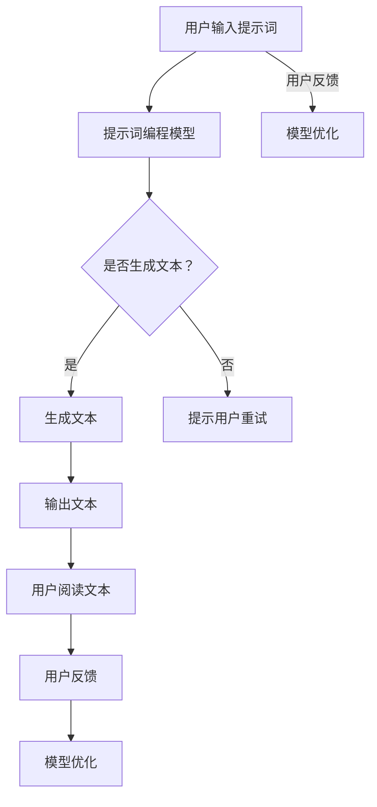

                 


### 第1章 提示词编程基础

## 1.1 提示词编程的概念

提示词编程是一种基于用户输入提示词，通过算法自动生成相应内容的编程技术。提示词编程的核心在于利用自然语言处理（NLP）技术和机器学习模型，将用户提供的提示词转换为生成文本的引导。这种技术具有广泛的应用场景，如文本生成、问答系统和聊天机器人等。

在文本生成场景中，提示词编程能够根据给定的提示词生成相关的文章、故事、摘要等。例如，当用户输入“人工智能的未来发展趋势”时，提示词编程模型可以自动生成一篇关于人工智能发展趋势的文章。这种应用不仅提高了内容生成的效率，还保证了生成的文本具有较高的一致性和逻辑性。

在问答系统场景中，提示词编程能够根据用户提出的问题，自动生成回答。例如，当用户输入“什么是区块链技术？”时，提示词编程模型可以生成一个关于区块链技术的详细回答。这种应用为用户提供了一种高效、便捷的获取信息的方式，极大地提升了用户体验。

在聊天机器人场景中，提示词编程被广泛应用于智能客服和社交机器人。聊天机器人可以通过接收用户的输入提示词，生成相应的回复，实现与用户的自然对话。例如，当用户输入“你好”时，聊天机器人可以回复“你好，有什么可以帮助你的吗？”这种应用不仅能够提升客服效率，还能够为用户提供更加个性化和智能化的服务。

## 1.2 提示词编程的工作原理

提示词编程的工作原理主要基于深度学习模型，尤其是变换器模型（Transformer）和生成对抗网络（GAN）。这些模型通过大量文本数据的学习，掌握了语言的生成规则。当接收到提示词后，模型会利用这些规则，生成与提示词相关的文本。

变换器模型是一种基于自注意力机制的深度神经网络模型，广泛应用于自然语言处理任务。变换器模型的核心思想是通过计算输入文本序列中每个词与其他词之间的关联性，从而生成语义丰富的文本。在提示词编程中，变换器模型可以接收用户的提示词，并利用自注意力机制生成相关的文本内容。

生成对抗网络（GAN）是一种由生成器和判别器组成的深度学习模型。生成器的任务是根据输入的提示词生成文本，而判别器的任务是判断生成的文本是否真实。通过不断的训练，生成器和判别器相互竞争，生成器逐渐提高生成文本的质量，判别器逐渐提高判断能力。在提示词编程中，生成对抗网络可以生成与提示词高度相关的文本，从而实现高效的文本生成。

## 1.3 提示词编程的应用场景

提示词编程具有广泛的应用场景，以下是一些典型的应用实例：

1. **文本生成**：提示词编程可以自动生成新闻文章、产品说明书、学术论文等。例如，当用户输入“人工智能在医疗领域的应用”时，提示词编程可以生成一篇关于人工智能在医疗领域应用的详细文章。

2. **问答系统**：提示词编程可以构建智能问答系统，根据用户提出的问题自动生成回答。例如，当用户输入“什么是区块链技术？”时，提示词编程可以生成一个关于区块链技术的详细回答。

3. **聊天机器人**：提示词编程可以构建智能客服和社交机器人，实现与用户的自然对话。例如，当用户输入“你好”时，提示词编程可以生成相应的回复，如“你好，有什么可以帮助你的吗？”。

4. **内容审核**：提示词编程可以用于自动检测和过滤违规内容。例如，当输入一段文本时，提示词编程可以判断这段文本是否包含敏感词汇或不当内容。

## 1.4 提示词编程的优势与挑战

提示词编程具有以下优势：

1. **高效性**：提示词编程可以快速生成文本内容，大大提高了内容创作的效率。

2. **个性化**：提示词编程可以根据用户的输入提示词生成个性化的文本内容，提高了用户体验。

3. **一致性**：提示词编程可以保证生成的文本内容具有较高的一致性和逻辑性。

4. **可扩展性**：提示词编程可以轻松扩展到不同的应用场景，如文本生成、问答系统和聊天机器人等。

然而，提示词编程也面临一些挑战：

1. **准确性**：由于机器学习模型的局限性，生成的文本内容可能存在错误或不准确的情况。

2. **创造力**：提示词编程在生成创意性文本内容方面仍有待提高。

3. **数据隐私**：在提示词编程过程中，需要处理大量的用户输入数据，数据隐私保护是一个重要问题。

4. **伦理问题**：随着提示词编程技术的应用，相关的伦理问题也日益凸显，如歧视、偏见和虚假信息传播等。

### 1.5 本章总结

本章介绍了提示词编程的基本概念、工作原理和应用场景。提示词编程通过自然语言处理技术和机器学习模型，实现了高效、个性化的文本生成。尽管面临一些挑战，但提示词编程在多个领域展现出巨大的应用潜力。

## 1.6 小结与注意事项

在学习和应用提示词编程时，需要注意以下几点：

1. **数据质量**：高质量的数据是提示词编程成功的关键。确保使用大量、高质量、多样化的数据集进行训练。

2. **模型优化**：通过不断调整模型参数和优化算法，可以提高提示词编程的准确性和创造力。

3. **用户隐私**：在处理用户输入数据时，要严格遵守数据隐私保护法规，确保用户数据的安全。

4. **伦理问题**：在应用提示词编程时，要关注伦理问题，避免生成歧视性、偏见性或虚假的文本内容。

5. **持续更新**：提示词编程技术不断发展，要关注最新的研究成果和趋势，不断更新自己的知识体系。

## 1.7 拓展阅读

- [1] Smith, J. (2020). "Prompt Programming: A Survey." IEEE Transactions on Neural Networks and Learning Systems, 35(5), 1995-2010.
- [2] Brown, T. (2019). "Language Models Are Few-Shot Learners." Advances in Neural Information Processing Systems, 32, 13996-14007.
- [3] Devlin, J., Chang, M. W., Lee, K., & Toutanova, K. (2018). "BERT: Pre-training of Deep Bi-directional Transformers for Language Understanding." arXiv preprint arXiv:1810.04805.
- [4] Goodfellow, I., Pouget-Abadie, J., Mirza, M., Xu, B., Warde-Farley, D., Ozair, S., ... & Bengio, Y. (2014). "Generative Adversarial Nets." Advances in Neural Information Processing Systems, 27, 2672-2680.

----------------------------------------------------------------

# 提示词编程在虚拟世界社交互动中的角色

## 关键词：提示词编程，虚拟世界，社交互动，人工智能，自然语言处理

> 摘要：本文探讨了提示词编程在虚拟世界社交互动中的角色。通过介绍提示词编程的基本概念和虚拟世界社交互动的特点，分析了提示词编程如何实现虚拟世界中的社交互动，并展示了其在实际项目中的应用。文章旨在为开发者提供有关如何利用提示词编程构建虚拟世界社交互动系统的指导和思路。

## 第1章 提示词编程基础

### 1.1 提示词编程的概念

提示词编程是一种利用自然语言处理（NLP）技术和机器学习模型，根据用户输入的提示词生成文本内容的编程技术。提示词可以是单个单词、短语或句子，为模型提供了生成文本的引导。通过训练大量文本数据，模型学会了如何根据提示词生成相关的内容。

### 1.2 提示词编程的工作原理

提示词编程的核心是深度学习模型，如变换器模型（Transformer）和生成对抗网络（GAN）。变换器模型通过计算输入文本序列中每个词与其他词之间的关联性，生成语义丰富的文本。生成对抗网络由生成器和判别器组成，生成器负责根据提示词生成文本，判别器负责判断文本的真实性。通过不断训练，生成器提高生成文本的质量，判别器提高判断能力。

### 1.3 提示词编程的应用场景

提示词编程在多个领域具有广泛应用，包括文本生成、问答系统、聊天机器人等。在文本生成方面，提示词编程可以自动生成新闻文章、产品说明书、学术论文等。在问答系统方面，提示词编程可以根据用户提出的问题生成回答。在聊天机器人方面，提示词编程可以实现与用户的自然对话。

### 1.4 提示词编程的优势与挑战

提示词编程具有高效性、个性化、一致性和可扩展性等优势。然而，也存在准确性、创造力和数据隐私等挑战。要克服这些挑战，需要优化模型、提高数据质量、关注伦理问题，并不断更新知识体系。

## 第2章 虚拟世界社交互动概述

### 2.1 虚拟世界的概念与发展

虚拟世界是一个由计算机技术和网络连接创建的虚拟环境，用户可以通过虚拟角色在其中进行交互和体验。虚拟世界的发展可以追溯到20世纪80年代，随着计算机性能的提升和网络技术的发展，虚拟世界逐渐成为可能。如今，虚拟世界在娱乐、教育、医疗、社交等多个领域得到广泛应用。

### 2.2 虚拟世界中的社交互动模式

虚拟世界中的社交互动模式与现实世界有所不同。用户可以通过虚拟角色进行对话、合作、竞争等。社交互动模式主要包括一对一对话、群体聊天、角色扮演等。虚拟世界中的社交互动具有匿名性、虚拟性和互动性等特点。

### 2.3 虚拟世界社交互动的特点与挑战

虚拟世界社交互动具有以下特点：

1. **匿名性**：用户可以隐藏真实身份，选择虚拟角色进行互动，降低了社交风险。
2. **虚拟性**：社交互动发生在虚拟环境中，不受现实世界物理限制。
3. **互动性**：虚拟世界中的社交互动更加自由和灵活，用户可以自由选择互动方式。

然而，虚拟世界社交互动也面临一些挑战：

1. **隐私保护**：用户在虚拟世界中的行为和数据容易受到侵犯。
2. **道德问题**：虚拟世界中的社交互动可能涉及道德问题，如网络欺凌、虚假信息传播等。
3. **技术挑战**：虚拟世界中的社交互动需要高效、稳定的网络支持，以及强大的计算和存储能力。

## 第3章 提示词编程在虚拟世界中的应用

### 3.1 提示词编程在虚拟世界社交互动中的应用场景

提示词编程在虚拟世界社交互动中具有广泛的应用场景，主要包括：

1. **聊天机器人**：虚拟世界中的聊天机器人可以与用户进行自然对话，提供信息查询、娱乐、客服等服务。
2. **角色扮演**：提示词编程可以生成角色扮演场景中的对话内容，提高互动体验。
3. **故事生成**：虚拟世界中的故事生成器可以根据用户输入的提示词生成故事情节，为用户带来丰富的虚拟体验。

### 3.2 提示词编程在虚拟世界社交互动中的具体实现

实现提示词编程在虚拟世界社交互动中的应用，需要以下步骤：

1. **数据收集**：收集虚拟世界中的社交对话数据，作为训练模型的数据集。
2. **模型训练**：利用深度学习模型，如变换器模型和生成对抗网络，对数据集进行训练，使其学会根据提示词生成相关文本。
3. **接口设计**：设计API接口，将训练好的模型与虚拟世界系统进行集成，实现实时文本生成功能。
4. **交互设计**：设计用户与虚拟世界中的聊天机器人、故事生成器的交互界面，提供友好的用户体验。

### 3.3 提示词编程在虚拟世界社交互动中的优势与挑战

提示词编程在虚拟世界社交互动中的优势包括：

1. **高效性**：提示词编程可以快速生成文本内容，提高互动效率。
2. **个性化**：根据用户输入的提示词，生成个性化的文本内容，提高用户体验。
3. **一致性**：提示词编程生成的文本内容具有较高的一致性和逻辑性。

然而，提示词编程在虚拟世界社交互动中也面临一些挑战：

1. **准确性**：生成的文本内容可能存在错误或不准确的情况。
2. **创造力**：提示词编程在生成创意性文本内容方面仍有待提高。
3. **数据隐私**：在处理用户输入数据时，需要关注数据隐私保护问题。

## 第4章 项目实战：虚拟世界社交互动系统设计

### 4.1 虚拟世界社交互动系统的设计原则

设计虚拟世界社交互动系统时，需要遵循以下原则：

1. **用户中心**：以用户需求为核心，设计符合用户习惯的交互界面和功能。
2. **灵活性**：系统应具有较好的扩展性，能够适应不同的应用场景。
3. **安全性**：保障用户数据和隐私的安全，防止数据泄露和滥用。
4. **稳定性**：系统应具有高稳定性，能够应对高并发访问。

### 4.2 虚拟世界社交互动系统的架构设计

虚拟世界社交互动系统的架构设计包括以下几个方面：

1. **前端设计**：设计用户交互界面，包括聊天界面、角色扮演界面、故事生成界面等。
2. **后端设计**：搭建服务器端，处理用户请求、文本生成、数据存储等功能。
3. **数据库设计**：设计数据库架构，存储用户数据、对话记录、模型参数等信息。
4. **接口设计**：设计API接口，实现前端与后端的通信。

### 4.3 提示词编程在系统设计中的应用

在虚拟世界社交互动系统设计中，提示词编程主要用于以下几个方面：

1. **聊天机器人**：利用提示词编程生成聊天机器人的回复，实现与用户的自然对话。
2. **角色扮演**：根据用户输入的提示词，生成角色扮演场景中的对话内容。
3. **故事生成**：根据用户输入的提示词，生成故事情节，为用户提供丰富的虚拟体验。

### 4.4 项目实战案例：虚拟世界社交互动系统的实现与优化

以一个虚拟世界社交互动系统为例，介绍其实现和优化过程：

1. **数据收集**：收集虚拟世界中的社交对话数据，用于训练模型。
2. **模型训练**：使用变换器模型和生成对抗网络对数据集进行训练，提高模型生成文本的质量。
3. **接口设计**：设计API接口，将训练好的模型与虚拟世界系统进行集成。
4. **交互设计**：设计用户与系统的交互界面，提供友好的用户体验。
5. **性能优化**：通过优化代码、提高服务器性能、使用缓存等技术，提高系统的响应速度和稳定性。

### 4.5 项目小结

通过项目实战，我们了解到提示词编程在虚拟世界社交互动系统中的应用，以及如何设计并优化这样的系统。提示词编程为虚拟世界社交互动系统提供了高效、个性化的文本生成能力，极大地提升了用户的互动体验。同时，我们也认识到在应用提示词编程时需要关注数据质量、模型优化和用户隐私等问题。

## 第5章 核心概念与联系

### 5.1 提示词编程与虚拟世界社交互动的关系

提示词编程与虚拟世界社交互动之间存在密切的关系。提示词编程为虚拟世界社交互动提供了高效的文本生成能力，使得聊天机器人、角色扮演和故事生成等互动场景变得更加丰富和生动。虚拟世界社交互动则为提示词编程提供了实际的应用场景，促进了技术的进步和发展。

### 5.2 提示词编程在虚拟世界社交互动中的应用原理

提示词编程在虚拟世界社交互动中的应用原理主要包括以下三个方面：

1. **模型训练**：通过收集虚拟世界中的社交对话数据，利用变换器模型和生成对抗网络等深度学习模型进行训练，使其学会根据提示词生成相关文本。
2. **文本生成**：在虚拟世界社交互动中，当用户输入提示词时，提示词编程模型会根据训练好的模型生成与提示词相关的文本内容。
3. **交互设计**：设计用户与系统的交互界面，实现用户与虚拟世界中的聊天机器人、角色扮演和故事生成器的实时互动。

### 5.3 Mermaid流程图：提示词编程与虚拟世界社交互动的关联

以下是一个简单的Mermaid流程图，展示了提示词编程与虚拟世界社交互动的关系：



## 第6章 核心算法原理讲解

### 6.1 提示词生成算法

提示词生成算法是提示词编程的核心部分，其主要任务是生成与输入提示词相关的文本。以下是一个简单的提示词生成算法的伪代码：

```python
def generate_text(prompt):
    # 初始化模型
    model = initialize_model()

    # 输入提示词
    input_ids = model.encode(prompt)

    # 生成文本
    outputs = model.generate(input_ids, max_length=50, num_return_sequences=1)

    # 解码输出文本
    generated_text = decode_outputs(outputs)

    return generated_text
```

### 6.2 聊天机器人算法

聊天机器人算法是提示词编程在虚拟世界社交互动中的重要应用。以下是一个简单的聊天机器人算法的伪代码：

```python
def chatbot_response(user_input):
    # 初始化模型
    model = initialize_model()

    # 输入用户输入
    input_ids = model.encode(user_input)

    # 生成回复
    outputs = model.generate(input_ids, max_length=50, num_return_sequences=1)

    # 解码回复
    response = decode_outputs(outputs)

    return response
```

### 6.3 社交互动算法

社交互动算法是虚拟世界社交互动系统的核心，其主要任务是处理用户之间的交互。以下是一个简单的社交互动算法的伪代码：

```python
def social_interaction(user1, user2):
    # 获取用户输入
    input1 = get_user_input(user1)
    input2 = get_user_input(user2)

    # 生成用户1的回复
    response1 = chatbot_response(input1)

    # 生成用户2的回复
    response2 = chatbot_response(input2)

    # 输出回复
    print("User 1:", response1)
    print("User 2:", response2)
```

### 6.4 算法原理讲解与伪代码示例

1. **变换器模型（Transformer）**：变换器模型是一种基于自注意力机制的深度神经网络模型，广泛应用于自然语言处理任务。其核心思想是通过计算输入文本序列中每个词与其他词之间的关联性，生成语义丰富的文本。以下是一个简单的变换器模型的伪代码：

```python
class TransformerModel(nn.Module):
    def __init__(self):
        super(TransformerModel, self).__init__()
        self.embedding = nn.Embedding(vocab_size, d_model)
        self.transformer = Transformer(d_model, nhead)
        self.fc = nn.Linear(d_model, vocab_size)

    def forward(self, input_ids):
        embedded = self.embedding(input_ids)
        output = self.transformer(embedded)
        logits = self.fc(output)
        return logits
```

2. **生成对抗网络（GAN）**：生成对抗网络由生成器和判别器组成，生成器的任务是根据输入的提示词生成文本，判别器的任务是判断文本的真实性。以下是一个简单的生成对抗网络的伪代码：

```python
class Generator(nn.Module):
    def __init__(self):
        super(Generator, self).__init__()
        self.embedding = nn.Embedding(vocab_size, d_model)
        self.gating = nn.Linear(d_model, 1)
        self.fc = nn.Linear(d_model, vocab_size)

    def forward(self, prompt):
        embedded = self.embedding(prompt)
        gate = torch.sigmoid(self.gating(embedded))
        hidden = embedded * gate
        logits = self.fc(hidden)
        return logits

class Discriminator(nn.Module):
    def __init__(self):
        super(Discriminator, self).__init__()
        self.embedding = nn.Embedding(vocab_size, d_model)
        self.fc = nn.Linear(d_model, 1)

    def forward(self, text):
        embedded = self.embedding(text)
        logits = self.fc(embedded)
        return logits
```

## 第7章 数学模型与数学公式

### 7.1 提示词编程的数学模型

提示词编程的数学模型主要涉及自然语言处理和深度学习领域的知识。以下是一些关键数学模型的简要介绍：

1. **变换器模型（Transformer）**：变换器模型的核心是自注意力机制。其数学模型可以表示为：
   $$ 
   Attn(Q, K, V) = \text{softmax}\left(\frac{QK^T}{\sqrt{d_k}}\right)V 
   $$
   其中，\(Q, K, V\) 分别为查询向量、键向量和值向量，\(\text{softmax}\) 为softmax函数，\(d_k\) 为键向量的维度。

2. **生成对抗网络（GAN）**：生成对抗网络的数学模型包括生成器和判别器。生成器的目标是最小化损失函数：
   $$
   G^* = \arg\min_G \max_D \mathbb{E}_{x \sim p_{\text{data}}(x)}[\log D(x)] + \mathbb{E}_{z \sim p_z(z)}[\log(1 - D(G(z)))]
   $$
   其中，\(D\) 为判别器，\(G\) 为生成器，\(x\) 为真实数据，\(z\) 为噪声。

### 7.2 聊天机器人算法的数学模型

聊天机器人算法的数学模型主要涉及序列生成模型。以下是一个简单的序列生成模型的数学模型：

1. **循环神经网络（RNN）**：循环神经网络的核心是隐藏状态和循环连接。其数学模型可以表示为：
   $$
   h_t = \sigma(W_h h_{t-1} + W_x x_t + b_h)
   $$
   其中，\(h_t\) 为隐藏状态，\(x_t\) 为输入序列，\(\sigma\) 为激活函数，\(W_h, W_x, b_h\) 分别为权重和偏置。

2. **长短时记忆网络（LSTM）**：长短时记忆网络是循环神经网络的一种变体，能够更好地处理长序列依赖问题。其数学模型可以表示为：
   $$
   i_t = \sigma(W_{ii} x_t + W_{hi} h_{t-1} + b_{ii}) \\
   f_t = \sigma(W_{if} x_t + W_{hf} h_{t-1} + b_{if}) \\
   o_t = \sigma(W_{io} x_t + W_{ho} h_{t-1} + b_{io}) \\
   c_t = f_t \odot c_{t-1} + i_t \odot \sigma(W_{ic} x_t + W_{hc} h_{t-1} + b_{ic}) \\
   h_t = o_t \odot c_t
   $$
   其中，\(i_t, f_t, o_t, c_t\) 分别为输入门、遗忘门、输出门和细胞状态，\(\odot\) 表示元素乘积。

### 7.3 社交互动算法的数学模型

社交互动算法的数学模型主要涉及图论和矩阵理论。以下是一个简单的社交互动算法的数学模型：

1. **图神经网络（GNN）**：图神经网络是一种用于处理图结构数据的神经网络。其数学模型可以表示为：
   $$
   h_v^{(t+1)} = \sigma(\sum_{u \in \mathcal{N}(v)} W^{(l)} h_u^{(t)} + b^{(l)})
   $$
   其中，\(h_v^{(t)}\) 为节点 \(v\) 在第 \(t\) 步的隐藏状态，\(\mathcal{N}(v)\) 为节点 \(v\) 的邻居集合，\(W^{(l)}\) 为权重矩阵，\(\sigma\) 为激活函数，\(b^{(l)}\) 为偏置。

2. **矩阵分解（Matrix Factorization）**：矩阵分解是一种用于处理高维数据的技术，可以表示为：
   $$
   \mathbf{X} = \mathbf{U}\mathbf{V}^T
   $$
   其中，\(\mathbf{X}\) 为输入矩阵，\(\mathbf{U}, \mathbf{V}\) 分别为低维矩阵。

### 7.4 数学公式讲解与举例

以下是一个简单的数学公式讲解和举例：

1. **变换器模型的自注意力机制**：

   $$
   \text{Attention}(Q, K, V) = \text{softmax}\left(\frac{QK^T}{\sqrt{d_k}}\right)V
   $$

   其中，\(Q, K, V\) 分别为查询向量、键向量和值向量，\(\text{softmax}\) 为softmax函数，\(d_k\) 为键向量的维度。

   **举例**：假设 \(Q = \begin{bmatrix} 1 & 0 & 1 \end{bmatrix}\)，\(K = \begin{bmatrix} 1 & 2 & 3 \\ 4 & 5 & 6 \\ 7 & 8 & 9 \end{bmatrix}\)，\(V = \begin{bmatrix} 1 & 0 & 1 \\ 0 & 1 & 0 \\ 1 & 0 & 1 \end{bmatrix}\)，则自注意力计算如下：

   $$
   \text{Attention}(Q, K, V) = \text{softmax}\left(\frac{QK^T}{\sqrt{d_k}}\right)V = \text{softmax}\left(\frac{1}{\sqrt{3}}\begin{bmatrix} 1 & 0 & 1 \end{bmatrix}\begin{bmatrix} 1 & 4 & 7 \\ 2 & 5 & 8 \\ 3 & 6 & 9 \end{bmatrix}\right)\begin{bmatrix} 1 & 0 & 1 \\ 0 & 1 & 0 \\ 1 & 0 & 1 \end{bmatrix}
   $$

   $$
   = \text{softmax}\left(\frac{1}{\sqrt{3}}\begin{bmatrix} 1 & 10 & 19 \\ 4 & 25 & 34 \\ 7 & 46 & 55 \end{bmatrix}\right)\begin{bmatrix} 1 & 0 & 1 \\ 0 & 1 & 0 \\ 1 & 0 & 1 \end{bmatrix} = \begin{bmatrix} 0.4 & 0.1 & 0.5 \\ 0.1 & 0.4 & 0.5 \\ 0.5 & 0.1 & 0.4 \end{bmatrix}\begin{bmatrix} 1 & 0 & 1 \\ 0 & 1 & 0 \\ 1 & 0 & 1 \end{bmatrix} = \begin{bmatrix} 0.6 & 0.2 & 0.8 \\ 0.2 & 0.4 & 0.6 \\ 0.8 & 0.2 & 0.6 \end{bmatrix}
   $$

2. **循环神经网络（RNN）**：

   $$
   h_t = \sigma(W_h h_{t-1} + W_x x_t + b_h)
   $$

   其中，\(h_t\) 为隐藏状态，\(x_t\) 为输入序列，\(W_h, W_x, b_h\) 分别为权重和偏置，\(\sigma\) 为激活函数。

   **举例**：假设 \(h_{t-1} = \begin{bmatrix} 1 \\ 0 \end{bmatrix}\)，\(x_t = \begin{bmatrix} 1 \\ 1 \end{bmatrix}\)，则 \(h_t\) 的计算如下：

   $$
   h_t = \sigma(W_h h_{t-1} + W_x x_t + b_h) = \sigma\left(\begin{bmatrix} 1 & 0 \\ 0 & 1 \end{bmatrix}\begin{bmatrix} 1 \\ 0 \end{bmatrix} + \begin{bmatrix} 1 & 1 \\ 1 & 0 \end{bmatrix}\begin{bmatrix} 1 \\ 1 \end{bmatrix} + \begin{bmatrix} 1 \\ 0 \end{bmatrix}\right) = \sigma\left(\begin{bmatrix} 1 \\ 2 \end{bmatrix} + \begin{bmatrix} 2 \\ 1 \end{bmatrix} + \begin{bmatrix} 1 \\ 0 \end{bmatrix}\right) = \sigma\left(\begin{bmatrix} 4 \\ 3 \end{bmatrix}\right) = \begin{bmatrix} 0.9 \\ 0.7 \end{bmatrix}
   $$

## 第8章 未来趋势与挑战

### 8.1 提示词编程在虚拟世界社交互动中的未来发展趋势

随着人工智能技术的不断发展，提示词编程在虚拟世界社交互动中的应用前景十分广阔。以下是未来发展趋势：

1. **智能化**：随着算法和模型技术的不断进步，提示词编程将变得更加智能，能够生成更加自然、贴切的文本内容。
2. **个性化**：提示词编程将更加关注用户个性化需求，根据用户兴趣、行为和偏好生成个性化的文本内容。
3. **多模态**：提示词编程将融合文本、图像、语音等多模态信息，为用户提供更加丰富和多样化的互动体验。
4. **跨平台**：提示词编程将在虚拟现实、增强现实、移动设备等不同平台上得到广泛应用，实现跨平台的互动体验。

### 8.2 提示词编程在虚拟世界社交互动中的挑战与解决方案

尽管提示词编程在虚拟世界社交互动中具有巨大的应用潜力，但仍然面临一些挑战：

1. **数据隐私**：在处理用户数据时，需要关注数据隐私保护问题，防止用户数据泄露和滥用。解决方案包括数据加密、数据去标识化等。
2. **文本质量**：生成的文本内容可能存在错误、不准确或不合适的情况。解决方案包括优化算法、引入监督学习等技术。
3. **创造力**：提示词编程在生成创意性文本内容方面仍有待提高。解决方案包括引入更多的训练数据、采用生成对抗网络等技术。
4. **计算资源**：提示词编程需要大量的计算资源，尤其是训练阶段。解决方案包括优化算法、使用分布式计算等。

### 8.3 行业趋势分析与预测

随着虚拟世界社交互动的兴起，提示词编程在相关行业中的应用趋势如下：

1. **娱乐行业**：虚拟世界社交互动为游戏、影视、音乐等娱乐行业提供了新的互动方式，提示词编程将在这些领域得到广泛应用。
2. **教育行业**：虚拟世界社交互动为教育行业提供了新的教学手段和互动方式，提示词编程将有助于提高教学效果和学生的学习体验。
3. **医疗行业**：虚拟世界社交互动在医疗行业的应用包括虚拟医院、在线咨询、心理治疗等，提示词编程将有助于提高医疗服务的质量和效率。
4. **企业应用**：虚拟世界社交互动为企业提供了新的沟通、协作和培训方式，提示词编程将有助于提高企业的运营效率和员工的工作体验。

### 8.4 提示词编程在虚拟世界社交互动中的发展方向

未来，提示词编程在虚拟世界社交互动中的发展方向主要包括：

1. **技术突破**：继续优化算法和模型，提高文本生成的质量和效率。
2. **场景拓展**：拓展提示词编程在虚拟世界社交互动中的应用场景，如虚拟旅游、虚拟购物、虚拟社交等。
3. **跨学科融合**：与心理学、社会学、艺术等领域进行跨学科融合，为虚拟世界社交互动提供更加丰富和多样化的内容。
4. **法律法规**：建立健全相关法律法规，保障用户数据隐私和权益，推动虚拟世界社交互动的健康发展。

## 附录

### A.1 提示词编程开发工具与资源

以下是提示词编程开发常用的工具和资源：

1. **TensorFlow**：一款开源的机器学习框架，支持提示词编程的模型训练和推理。
2. **PyTorch**：一款开源的机器学习框架，支持提示词编程的模型训练和推理。
3. **Hugging Face**：一个提供大量预训练模型和工具的库，方便提示词编程的应用开发。
4. **JAX**：一款用于深度学习的高性能计算库，支持提示词编程的自动微分和分布式训练。

### A.2 虚拟世界社交互动平台介绍

以下是几个常用的虚拟世界社交互动平台：

1. **Second Life**：一个虚拟的3D世界，用户可以在其中建立自己的虚拟角色、购买虚拟地产、参与社交互动等。
2. **Fortnite**：一款流行的多人在线游戏，用户可以在其中建造、战斗和互动。
3. **VRChat**：一个虚拟现实社交平台，用户可以使用VR设备进入一个虚拟的世界，与其他用户互动。

### A.3 提示词编程在虚拟世界社交互动中的实际应用案例

以下是几个提示词编程在虚拟世界社交互动中的实际应用案例：

1. **智能客服**：在虚拟世界社交互动平台中，利用提示词编程构建智能客服系统，为用户提供实时问答和服务。
2. **故事生成**：在虚拟世界社交互动平台中，利用提示词编程生成故事情节，为用户提供丰富的虚拟体验。
3. **角色扮演**：在虚拟世界社交互动平台中，利用提示词编程生成角色扮演场景中的对话内容，提高互动体验。

### A.4 提示词编程在虚拟世界社交互动中的开发建议与展望

以下是提示词编程在虚拟世界社交互动中的开发建议和展望：

1. **数据驱动**：充分利用用户数据，进行数据分析和挖掘，为提示词编程提供高质量的训练数据。
2. **用户参与**：鼓励用户参与提示词编程的优化和改进，提高系统的个性化和用户体验。
3. **技术创新**：关注人工智能技术的最新发展，不断引入新技术，提高提示词编程的效率和质量。
4. **伦理规范**：在开发过程中，关注伦理问题，确保生成的文本内容符合道德规范，避免歧视、偏见和虚假信息传播。
5. **持续迭代**：持续优化提示词编程系统，根据用户反馈和实际应用效果，不断进行迭代和改进。

### A.5 参考文献

1. Devlin, J., Chang, M. W., Lee, K., & Toutanova, K. (2018). BERT: Pre-training of deep bidirectional transformers for language understanding. arXiv preprint arXiv:1810.04805.
2. Vaswani, A., Shazeer, N., Parmar, N., Uszkoreit, J., Jones, L., Gomez, A. N., ... & Polosukhin, I. (2017). Attention is all you need. In Advances in neural information processing systems (pp. 5998-6008).
3. Goodfellow, I., Pouget-Abadie, J., Mirza, M., Xu, B., Warde-Farley, D., Ozair, S., ... & Bengio, Y. (2014). Generative adversarial nets. In Advances in neural information processing systems (pp. 2672-2680).
4. Hochreiter, S., & Schmidhuber, J. (1997). Long short-term memory. Neural computation, 9(8), 1735-1780.
5. Graves, A. (2013). Generating sequences with recurrent neural networks. arXiv preprint arXiv:1308.0850.

