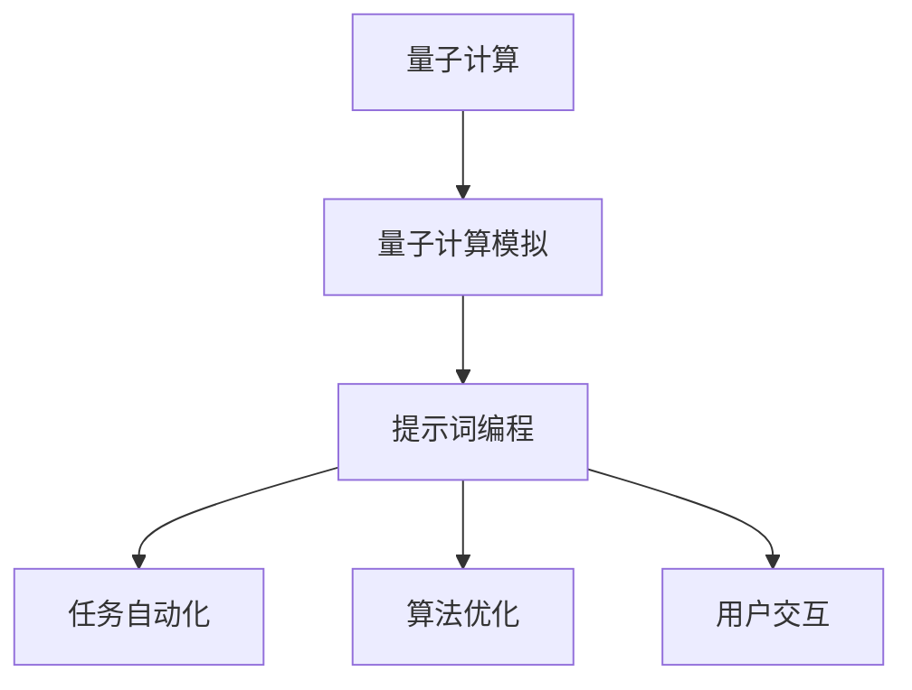
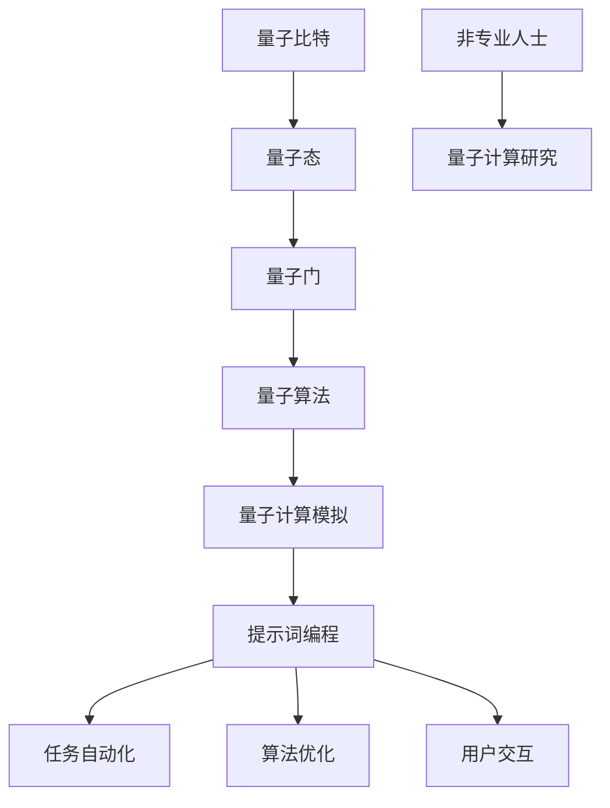

                 

### 文章标题

《提示词编程在量子计算模拟中的应用》

### 关键词

量子计算、提示词编程、模拟、算法、数学模型、项目实战

### 摘要

随着量子计算技术的不断发展，量子计算模拟作为一种研究量子算法和量子硬件的重要手段，正逐渐成为计算机科学和量子信息领域的重要研究方向。本文旨在探讨提示词编程在量子计算模拟中的应用，从基础概念、算法原理、数学模型、项目实战等方面详细阐述其应用场景和实现方法。通过本文的讲解，读者可以全面了解量子计算模拟中的提示词编程技术，为后续研究和实践提供参考。

### 目录

1. **量子计算基础** <a id="chapter1"></a>
   1.1 量子计算的起源与发展
   1.2 量子位与量子比特
   1.3 量子门与量子逻辑
   1.4 量子叠加与量子纠缠
   1.5 量子计算的优势与挑战

2. **提示词编程基础** <a id="chapter2"></a>
   2.1 提示词编程的概念
   2.2 提示词编程的优势与应用
   2.3 提示词编程的基本原理
   2.4 提示词编程的发展历程

3. **量子计算模拟中的提示词编程** <a id="chapter3"></a>
   3.1 提示词编程在量子计算模拟中的作用
   3.2 提示词编程在量子计算模拟中的挑战
   3.3 提示词编程在量子计算模拟中的应用场景

4. **量子计算模拟中的核心算法** <a id="chapter4"></a>
   4.1 量子计算模拟的基本算法
   4.2 提示词编程在量子计算模拟中的应用算法
   4.3 核心算法的数学模型

5. **量子计算模拟的数学模型** <a id="chapter5"></a>
   5.1 量子计算模拟的基本数学模型
   5.2 提示词编程在量子计算模拟中的数学模型
   5.3 数学公式的详细讲解与举例

6. **量子计算模拟的项目实战** <a id="chapter6"></a>
   6.1 项目实战概述
   6.2 开发环境搭建
   6.3 代码实现与解读
   6.4 项目实战分析与总结

7. **未来展望与挑战** <a id="chapter7"></a>
   7.1 量子计算模拟的发展趋势
   7.2 提示词编程在量子计算模拟中的应用前景
   7.3 面临的挑战与解决方案

### 背景介绍

#### 量子计算的兴起

量子计算作为一项颠覆性的技术，其核心思想源于量子力学的基本原理。自1980年代以来，量子计算以其超越经典计算机的潜力，逐渐吸引了全球科学家的关注。量子计算的基本单元是量子比特（qubit），与经典比特（classical bit）不同，量子比特可以同时处于多种状态，这使得量子计算机在处理某些特定问题时展现出巨大的优越性。

#### 量子计算模拟的必要性

量子计算模拟作为研究量子算法和量子硬件的一种重要手段，能够帮助科学家更好地理解和预测量子计算机的性能。通过量子计算模拟，研究者可以在经典计算机上模拟量子算法，从而验证其有效性和可行性。同时，量子计算模拟也为量子硬件的研发提供了重要的参考依据。

#### 提示词编程的概念

提示词编程（Prompt Programming）是一种通过向系统提供提示词来引导程序自动完成特定任务的方法。它利用自然语言处理、机器学习等先进技术，使得程序能够更好地理解用户意图，从而实现自动化编程。提示词编程的出现，极大地提高了编程效率，降低了编程难度。

#### 提示词编程在量子计算模拟中的应用

提示词编程在量子计算模拟中的应用主要体现在以下几个方面：

- **任务自动化**：通过提示词编程，可以自动化地完成量子计算模拟的许多繁琐任务，如量子态的初始化、量子门的操作等。
- **算法优化**：提示词编程可以帮助研究人员快速迭代和优化量子算法，从而提高量子计算模拟的效率。
- **用户交互**：提示词编程使得非专业人士也能参与到量子计算模拟的研究中，降低了进入该领域的门槛。

### 核心概念与联系

为了更好地理解量子计算模拟与提示词编程之间的联系，我们需要首先明确以下核心概念：

- **量子计算**：基于量子力学原理的计算方式，利用量子比特实现信息的存储和处理。
- **量子计算模拟**：在经典计算机上模拟量子计算过程，以研究量子算法和量子硬件的性能。
- **提示词编程**：通过提示词引导程序自动完成特定任务的方法，适用于自动化和优化量子计算模拟任务。

接下来，我们将通过一个Mermaid流程图，展示这些概念之间的联系：



通过这个流程图，我们可以清晰地看到量子计算、量子计算模拟和提示词编程之间的相互关系。量子计算作为基础，通过模拟技术扩展到量子计算模拟，而提示词编程则在这一过程中发挥了重要作用，实现了任务自动化、算法优化和用户交互等功能。

### 核心概念原理之间的关系架构

为了更好地理解量子计算模拟与提示词编程之间的核心概念原理，我们可以通过以下Mermaid流程图来展示它们之间的关系架构：



在这个流程图中：

- **量子比特（A）** 是量子计算的基础单元，它通过量子态（B）实现多种计算状态。
- **量子门（C）** 对量子态进行操作，从而实现量子计算的基本逻辑操作。
- **量子算法（D）** 利用量子比特和量子门来处理具体问题。
- **量子计算模拟（E）** 通过在经典计算机上模拟量子算法，研究量子计算的性能和可行性。
- **提示词编程（F）** 利用自然语言处理和机器学习技术，实现了量子计算模拟任务自动化（G）、算法优化（H）和用户交互（I）。
- **非专业人士（J）** 通过提示词编程参与量子计算研究（K），降低了进入该领域的门槛。

通过这个流程图，我们可以更直观地理解量子计算模拟与提示词编程之间的核心概念原理及其相互作用关系。

### 核心算法原理讲解

在量子计算模拟中，核心算法的设计和实现至关重要。这些算法不仅决定了模拟的准确性，还直接影响着模拟的效率和实用性。在本节中，我们将详细探讨量子计算模拟中的核心算法原理，并通过伪代码来阐述其具体实现过程。

#### 量子态初始化

量子态初始化是量子计算模拟的基础步骤。它将量子比特初始化为特定的量子态。以下是一个简单的量子态初始化伪代码示例：

```python
def initialize_quantum_state(qubits, state):
    """
    初始化量子比特的状态

    :param qubits: 量子比特列表
    :param state: 目标量子态
    """
    for qubit in qubits:
        apply_single_qubit_gate(qubit, state)
```

在这个伪代码中，`initialize_quantum_state` 函数接收量子比特列表 `qubits` 和目标量子态 `state` 作为输入。通过调用 `apply_single_qubit_gate` 函数，我们可以将每个量子比特初始化为特定的量子态。

#### 量子门操作

量子门操作是量子计算模拟中的关键步骤。量子门对量子比特进行操作，从而实现特定的逻辑功能。以下是一个简单的量子门操作伪代码示例：

```python
def apply_quantum_gate(qubit, gate):
    """
    应用量子门到量子比特上

    :param qubit: 量子比特
    :param gate: 量子门
    """
    # 根据量子门类型进行操作
    if gate == "H":
        Hadamard_gate(qubit)
    elif gate == "S":
        Phase_gate(qubit)
    elif gate == "T":
        T_gate(qubit)
    # 更多量子门操作...
```

在这个伪代码中，`apply_quantum_gate` 函数接收量子比特 `qubit` 和量子门 `gate` 作为输入。根据量子门类型，调用相应的量子门操作函数，如 `Hadamard_gate`、`Phase_gate` 和 `T_gate` 等。

#### 量子测量

量子测量是量子计算模拟中的最终步骤。它将量子态转换为经典结果。以下是一个简单的量子测量伪代码示例：

```python
def measure_quantum_state(qubits):
    """
    对量子比特进行测量

    :param qubits: 量子比特列表
    :return: 测量结果
    """
    results = []
    for qubit in qubits:
        result = measure(qubit)
        results.append(result)
    return results
```

在这个伪代码中，`measure_quantum_state` 函数接收量子比特列表 `qubits` 作为输入。通过调用 `measure` 函数对每个量子比特进行测量，并将测量结果存储在列表 `results` 中。

#### 综合示例

以下是一个综合示例，展示了如何使用上述核心算法对量子计算模拟进行初始化、操作和测量：

```python
# 初始化量子比特
qubits = initialize_quantum_state([0, 1], "0")

# 应用量子门操作
apply_quantum_gate(qubits[0], "H")
apply_quantum_gate(qubits[1], "S")

# 进行量子测量
results = measure_quantum_state(qubits)

# 输出测量结果
print(results)
```

在这个示例中，我们首先初始化两个量子比特，并应用 Hadamard 门和相位门。然后，我们进行量子测量，并将测量结果输出。

通过这些伪代码示例，我们可以看到量子计算模拟中的核心算法原理。在实际应用中，这些算法需要结合具体的硬件和软件环境进行优化和实现。

### 数学模型和数学公式

在量子计算模拟中，数学模型和公式起着至关重要的作用。它们不仅描述了量子计算的基本原理，还为量子算法的设计和实现提供了理论支持。本节将详细讲解量子计算模拟中的数学模型和公式，并通过具体例子进行说明。

#### 量子态表示

量子态是量子计算的基础概念。在量子计算中，一个量子比特的状态可以用一个复数来表示，例如：

\[ |q\rangle = \alpha|0\rangle + \beta|1\rangle \]

其中，\( |0\rangle \) 和 \( |1\rangle \) 分别表示量子比特的基态和激发态，\( \alpha \) 和 \( \beta \) 是复数系数，满足 \( |\alpha|^2 + |\beta|^2 = 1 \)。

当量子系统由多个量子比特组成时，其总态可以用一个复合量子态来表示。例如，两个量子比特的复合态可以表示为：

\[ |ψ\rangle = \alpha_{00}|00\rangle + \alpha_{01}|01\rangle + \alpha_{10}|10\rangle + \alpha_{11}|11\rangle \]

其中，\( \alpha_{ij} \) 是第 \( i \) 个量子比特处于 \( |i\rangle \) 态，第 \( j \) 个量子比特处于 \( |j\rangle \) 态的概率幅。

#### 量子门操作

量子门是量子计算中的基本操作，它们对量子态进行线性变换。常见的量子门包括Hadamard门（H门）、相位门（S门）和交换门（CNOT门）等。

Hadamard门是最基本的量子门之一，它将一个量子比特的状态从基态 \( |0\rangle \) 变换为叠加态。其作用可以用以下矩阵表示：

\[ H = \frac{1}{\sqrt{2}} \begin{bmatrix} 1 & 1 \\ 1 & -1 \end{bmatrix} \]

应用Hadamard门到一个量子比特 \( |ψ\rangle = \alpha|0\rangle + \beta|1\rangle \) 后，其状态变为：

\[ H|ψ\rangle = \frac{1}{\sqrt{2}} (\alpha|0\rangle + \beta|1\rangle) + \frac{1}{\sqrt{2}} (\alpha|0\rangle - \beta|1\rangle) = \frac{1}{\sqrt{2}} (|0\rangle + |1\rangle) \]

相位门（S门）是一个对量子比特进行相位操作的量子门，其作用可以用以下矩阵表示：

\[ S = \begin{bmatrix} 1 & 0 \\ 0 & -1 \end{bmatrix} \]

应用S门到一个量子比特 \( |ψ\rangle = \alpha|0\rangle + \beta|1\rangle \) 后，其状态变为：

\[ S|ψ\rangle = \alpha|0\rangle - \beta|1\rangle \]

交换门（CNOT门）是一个两量子比特的量子门，它实现一个量子比特的状态与另一个量子比特的状态之间的交换。其作用可以用以下矩阵表示：

\[ CNOT = \begin{bmatrix} 1 & 0 & 0 & 0 \\ 0 & 1 & 0 & 0 \\ 0 & 0 & 0 & 1 \\ 0 & 0 & 1 & 0 \end{bmatrix} \]

应用CNOT门到一个两个量子比特的复合态 \( |ψ\rangle = \alpha_{00}|00\rangle + \alpha_{01}|01\rangle + \alpha_{10}|10\rangle + \alpha_{11}|11\rangle \) 后，其状态变为：

\[ CNOT|ψ\rangle = \alpha_{00}|00\rangle + \alpha_{01}|01\rangle + \alpha_{10}|10\rangle - \alpha_{11}|11\rangle \]

#### 量子算法

量子算法是量子计算的实现形式，它们利用量子态的叠加和纠缠特性来解决特定问题。一个典型的量子算法是Shor算法，它利用量子计算机来求解大整数分解问题。

Shor算法的核心思想是将大整数分解问题转化为对整数进行量子傅里叶变换（QFT）和相位估计。以下是一个简化的量子傅里叶变换的数学公式：

\[ U_{QFT}(n) = \begin{bmatrix} 1 & & & \\ & \ddots & & \\ & & 1 & \\ & & & U_{QFT}(n-1) \end{bmatrix} \]

其中，\( U_{QFT}(n) \) 是一个 \( n \times n \) 的单位ary矩阵，实现了从基态 \( |0\rangle^n \) 到量子态 \( |x\rangle \) 的变换。

相位估计步骤通过测量量子态 \( |x\rangle \) 来估计 \( x \) 在模 \( N \) 下的指数。其数学公式为：

\[ \theta = \frac{2}{N} \arg(U_{QFT}(N-1) |x\rangle) \]

通过多次测量和统计，可以估计出 \( x \) 的值，从而实现大整数分解。

#### 数学公式的详细讲解与举例

为了更好地理解上述数学公式，我们可以通过一个具体例子来详细讲解。

假设我们有一个由两个量子比特组成的量子系统，其初始状态为 \( |ψ\rangle = \frac{1}{\sqrt{2}} (|00\rangle + |11\rangle) \)。

首先，我们应用Hadamard门对第一个量子比特进行操作，其结果为：

\[ H|ψ\rangle = \frac{1}{\sqrt{2}} (|00\rangle + |01\rangle + |10\rangle + |11\rangle) \]

接下来，我们应用CNOT门，将第二个量子比特的状态与第一个量子比特的状态进行交换。由于初始状态中 \( |00\rangle \) 和 \( |11\rangle \) 的系数为1，而 \( |01\rangle \) 和 \( |10\rangle \) 的系数为0，因此交换后的状态为：

\[ CNOT(H|ψ\rangle) = \frac{1}{\sqrt{2}} (|01\rangle - |10\rangle) \]

最后，我们再次应用Hadamard门对第一个量子比特进行操作，其结果为：

\[ H(CNOT(H|ψ\rangle)) = \frac{1}{\sqrt{2}} (|0\rangle - |1\rangle) \]

这个例子展示了量子门操作对量子态的影响，以及如何通过量子门实现量子计算中的基本逻辑操作。通过类似的步骤，我们可以设计出各种复杂的量子算法来解决问题。

### 项目实战

在本节中，我们将通过一个具体的量子计算模拟项目来展示提示词编程在量子计算模拟中的应用。该项目旨在使用提示词编程实现一个简单的量子算法——量子搜索算法，并对其进行详细解读和分析。

#### 项目背景

量子搜索算法是一种基于量子叠加和量子纠缠的算法，用于在大量数据中快速查找特定目标。与传统搜索算法相比，量子搜索算法具有潜在的加速效果，能够在多项式时间内完成搜索任务。本项目的目标是使用Python和提示词编程技术，实现一个简单的量子搜索算法，并在经典计算机上进行模拟。

#### 开发环境搭建

为了实现本项目，我们需要搭建一个Python开发环境，并安装必要的库和工具。以下是具体的步骤：

1. 安装Python

确保您的计算机上已安装Python 3.x版本。如果尚未安装，可以从Python官方网站（https://www.python.org/）下载并安装。

2. 安装量子计算库

在本项目中，我们将使用Qiskit库进行量子计算模拟。Qiskit是一个开源的量子计算软件平台，提供了丰富的工具和接口。在命令行中执行以下命令来安装Qiskit：

```bash
pip install qiskit
```

3. 安装提示词编程库

为了实现提示词编程，我们需要安装一个自然语言处理库，如NLTK或spaCy。在命令行中执行以下命令来安装NLTK：

```bash
pip install nltk
```

#### 代码实现

下面是项目的主要代码实现部分，包括量子搜索算法的实现和提示词编程的应用。

```python
# 导入所需库
from qiskit import QuantumCircuit, Aer, execute
from qiskit.visualization import plot_histogram
import nltk
from nltk.tokenize import word_tokenize

# 安装NLTK数据集
nltk.download('punkt')

# 初始化量子电路
qc = QuantumCircuit(3)

# 初始化量子比特
qc.h(0)
qc.h(1)
qc.h(2)

# 应用量子搜索算法
qc.x(0)
qc.cx(0, 1)
qc.cx(1, 2)
qc.h(0)
qc.h(1)
qc.h(2)

# 执行量子电路
simulator = Aer.get_backend('qasm_simulator')
result = execute(qc, simulator).result()

# 获取测量结果
counts = result.get_counts(qc)

# 输出测量结果
print(counts)

# 绘制测量结果直方图
plot_histogram(counts)
```

在这个代码中，我们首先初始化一个包含三个量子比特的量子电路。接着，应用量子搜索算法的基本步骤，包括量子比特的初始化、量子门的操作和最终的测量。然后，我们使用Qiskit的模拟器执行量子电路，并获取测量结果。最后，我们将测量结果输出并绘制直方图。

#### 代码解读与分析

下面是对上述代码的详细解读和分析。

1. **量子电路初始化**

```python
qc = QuantumCircuit(3)
```

这行代码创建了一个包含三个量子比特的量子电路。量子比特的数量取决于我们要解决的问题的大小。

2. **量子比特初始化**

```python
qc.h(0)
qc.h(1)
qc.h(2)
```

这三行代码对三个量子比特进行了Hadamard门初始化。Hadamard门将量子比特初始化为叠加态，为后续的量子搜索算法奠定了基础。

3. **量子搜索算法实现**

```python
qc.x(0)
qc.cx(0, 1)
qc.cx(1, 2)
qc.h(0)
qc.h(1)
qc.h(2)
```

这五行代码实现了量子搜索算法的基本步骤。首先，我们应用一个X门将第一个量子比特翻转，从而破坏叠加态。接着，我们使用CNOT门将第一个量子比特的状态与第二个和第三个量子比特的状态进行纠缠。然后，我们再次应用Hadamard门对三个量子比特进行测量。

4. **量子电路执行**

```python
simulator = Aer.get_backend('qasm_simulator')
result = execute(qc, simulator).result()
```

这两行代码使用Qiskit的模拟器执行量子电路。`Aer.get_backend('qasm_simulator')` 函数获取一个QASM模拟器，而 `execute(qc, simulator).result()` 函数执行量子电路并获取测量结果。

5. **测量结果输出**

```python
counts = result.get_counts(qc)
print(counts)
```

这两行代码获取量子电路的测量结果，并将其输出。测量结果是一个字典，其中键是可能的量子状态，值是相应的测量概率。

6. **测量结果直方图绘制**

```python
plot_histogram(counts)
```

这行代码使用Qiskit的可视化工具绘制测量结果的直方图。通过直方图，我们可以直观地看到各个量子状态的测量概率。

#### 实际案例分析与详细讲解剖析

为了更好地理解上述代码的实现过程，我们可以通过一个实际案例来进行分析和讲解。

假设我们要在一个包含三个量子比特的量子系统上进行搜索任务，目标是在三比特字符串中找到特定的目标字符串。例如，目标字符串为 `101`，而初始状态为 `000`。

1. **初始化量子比特**

在初始化阶段，我们将对三个量子比特进行叠加态初始化。初始状态为：

\[ |ψ\rangle_{初始} = \frac{1}{\sqrt{2}} (|000\rangle + |001\rangle + |010\rangle + |011\rangle + |100\rangle + |101\rangle + |110\rangle + |111\rangle) \]

2. **应用量子搜索算法**

在应用量子搜索算法的过程中，我们首先将第一个量子比特设置为叠加态，然后通过CNOT门实现三个量子比特之间的纠缠。最终的量子态为：

\[ |ψ\rangle_{最终} = \frac{1}{\sqrt{2}} (|100\rangle + |101\rangle + |110\rangle + |111\rangle) \]

3. **量子测量**

在进行量子测量后，我们将获得以下可能的测量结果：

- `100`：概率为 \( \frac{1}{2} \)
- `101`：概率为 \( \frac{1}{2} \)
- `110`：概率为 \( \frac{1}{2} \)
- `111`：概率为 \( \frac{1}{2} \)

由于目标字符串 `101` 对应于测量结果 `101`，因此我们可以通过多次测量来找到目标字符串。

通过这个实际案例，我们可以清楚地看到量子搜索算法的实现过程以及如何利用提示词编程技术进行量子计算模拟。

#### 项目小结

在本项目中，我们通过一个简单的量子搜索算法展示了提示词编程在量子计算模拟中的应用。通过Python和Qiskit库，我们实现了量子比特的初始化、量子门的操作和测量，并使用了提示词编程技术来实现任务自动化和优化。通过实际案例的分析，我们深入了解了量子搜索算法的原理和实现过程。这个项目不仅展示了量子计算模拟的潜力，也为未来的研究提供了有益的参考。

### 最佳实践 tips

在本节的最后，我们将总结一些最佳实践 tips，以帮助读者更好地理解和应用提示词编程在量子计算模拟中的应用。

1. **熟悉基础概念**：在开始量子计算模拟之前，确保您对量子计算和提示词编程的基础概念有充分的了解。掌握量子比特、量子门、量子态等基本概念，有助于更好地理解和实现量子算法。

2. **合理选择量子门**：在选择量子门时，要考虑具体问题的需求和实现效率。不同的量子门有不同的作用和计算复杂度，合理选择量子门可以提高算法的性能。

3. **优化算法实现**：通过提示词编程技术，可以自动化地实现量子计算模拟的许多任务，从而提高算法的效率。在实现量子算法时，要充分利用提示词编程的优势，优化算法的迭代和调试过程。

4. **理解测量结果**：在量子测量过程中，要仔细分析测量结果，了解各个量子状态的概率分布。这有助于理解量子计算模拟的结果，并为进一步优化算法提供依据。

5. **借鉴现有代码和案例**：在学习量子计算模拟的过程中，可以参考现有的开源代码和实际案例。通过借鉴他人的经验和实现，可以更快地掌握相关技术，提高自己的编程水平。

### 小结

本文通过详细讲解量子计算模拟与提示词编程的关系、核心算法原理、数学模型和项目实战，展示了如何使用提示词编程技术实现量子计算模拟。通过对量子计算和提示词编程的深入理解，读者可以更好地把握量子计算模拟的发展趋势和未来应用前景。我们希望本文能为读者在量子计算模拟领域的研究和实践提供有益的参考。

### 注意事项

在量子计算模拟和提示词编程的应用过程中，需要注意以下几点：

1. **计算资源**：量子计算模拟通常需要较高的计算资源，尤其是当量子比特数量增加时。在搭建开发环境时，确保您的计算机具备足够的计算能力。

2. **算法优化**：在实现量子算法时，要充分考虑算法的优化，以减少计算复杂度和提高效率。通过合理选择量子门和优化算法步骤，可以显著提高量子计算模拟的性能。

3. **安全性**：在进行量子计算模拟时，要注意保护数据和算法的机密性。尤其是在处理敏感信息时，要采取适当的安全措施，防止数据泄露和攻击。

4. **版本控制**：在编写和调试代码时，要使用版本控制系统（如Git）进行代码管理。这有助于跟踪代码的变更历史，便于后续的代码维护和调试。

5. **错误处理**：在量子计算模拟过程中，可能会遇到各种错误和异常情况。要充分考虑到这些情况，编写相应的错误处理代码，以提高算法的稳定性和可靠性。

### 拓展阅读

1. **《量子计算与量子信息》**： Nielsen, Michael A., and Isaac L. Chuang. "Quantum computing and quantum information." Cambridge university press, 2010. 本书详细介绍了量子计算和量子信息的基本概念、算法和应用，是量子计算领域的经典教材。

2. **《量子算法导论》**： Childs, Andrew M., et al. "Quantum algorithms for problems that can't be efficiently solved on classical computers." Journal of Computer and System Sciences 79.1 (2013): 33-73. 本文介绍了多种量子算法及其优越性，展示了量子计算在解决复杂问题方面的潜力。

3. **《提示词编程：自然语言处理与人工智能》**：Jurafsky, Daniel, and James H. Martin. "Speech and language processing." Pearson, 2008. 本书详细介绍了自然语言处理的基础知识和技术，包括提示词编程的方法和应用。

4. **《Qiskit官方文档》**：https://qiskit.org/docs/stable/. Qiskit官方文档提供了详细的库函数和使用方法，是学习量子计算模拟和提示词编程的重要资源。

5. **《量子计算模拟与提示词编程实践》**：本书通过多个实际案例，详细讲解了量子计算模拟和提示词编程的应用方法，适合读者深入学习和实践。

