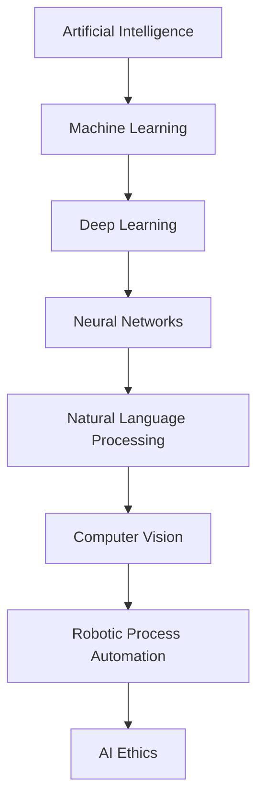
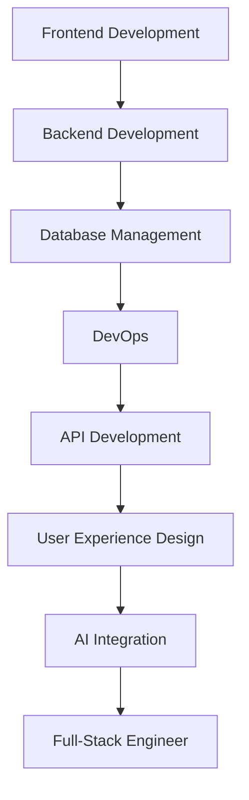

                 

### First Part: Introduction to Prompt Programming and the AI Era

#### 1. Understanding Prompt Programming

**1.1 Definition and Core Concepts of Prompt Programming**

Prompt programming, as a modern approach to AI-driven development, involves crafting concise, targeted instructions or prompts that guide a machine learning model to perform specific tasks. The core concept is to leverage the model's vast knowledge and capabilities by providing it with well-defined, context-rich prompts that lead to desired outcomes.

At its core, a prompt in prompt programming serves as a starting point or a directive for the model to generate solutions, insights, or outputs. These prompts can be simple or complex, depending on the task at hand. For instance, a simple prompt might be as straightforward as "sum two numbers," while a complex prompt could involve intricate data analysis or decision-making processes.

**1.2 The Role of Prompt Programming in the AI Era**

The advent of AI has revolutionized various industries, and prompt programming plays a pivotal role in this transformation. By enabling developers to interact with AI models using natural language-like prompts, it democratizes access to AI capabilities. This approach simplifies the integration of AI into applications, making it easier for developers to leverage AI's power without needing deep expertise in machine learning.

In the AI era, prompt programming addresses several key challenges. Firstly, it mitigates the barrier of understanding complex machine learning models by providing a more intuitive interface. Developers can focus on defining problems and desired outcomes rather than delving into the intricate details of model architectures and training processes. This not only speeds up development but also makes AI more accessible to a broader audience.

Secondly, prompt programming promotes better collaboration between humans and machines. By facilitating clear communication between developers and AI models, it fosters a symbiotic relationship where AI can augment human intelligence. Developers can iterate quickly, refine prompts, and receive feedback, leading to more effective and efficient solutions.

**1.3 Key Advantages of Prompt Programming**

The advantages of prompt programming are multifaceted:

- **Simplicity**: By abstracting away the complexities of machine learning, prompt programming makes it easier for developers to integrate AI into their projects.
- **Flexibility**: Prompt-based interactions allow for dynamic and adaptable solutions, as developers can tweak prompts to achieve specific outcomes.
- **Efficiency**: Prompt programming accelerates the development cycle by enabling rapid prototyping and iteration.
- **Democratization**: It lowers the barrier to entry for AI development, enabling a wider range of developers to harness AI's capabilities.

**1.4 Challenges and Opportunities in Prompt Programming Education**

While prompt programming offers significant advantages, it also presents challenges and opportunities for education. One of the main challenges is ensuring that developers have a solid foundation in both programming and machine learning concepts. Without this groundwork, the effectiveness of prompt programming can be limited.

Opportunities, however, abound. By incorporating prompt programming into educational curricula, we can equip the next generation of developers with the skills needed to thrive in the AI era. This includes not only coding and machine learning but also critical thinking, problem-solving, and effective communication.

### Mermaid Flowchart: AI Technologies and Applications Overview

To better understand the landscape of AI technologies and their applications, let's visualize the key components and relationships using a Mermaid flowchart.



In this flowchart, we can see that AI is a broad field encompassing various subfields such as Machine Learning, Deep Learning, Neural Networks, Natural Language Processing, Computer Vision, Robotic Process Automation, and AI Ethics. Each of these subfields has its unique applications and contributions to the development of AI-driven solutions.

**2. AI Basics**

**2.1 Introduction to Artificial Intelligence**

Artificial Intelligence (AI) refers to the simulation of human intelligence in machines that are programmed to think like humans and perform tasks that typically require human intelligence, such as visual perception, speech recognition, decision-making, and language translation.

AI can be categorized into two main types: Narrow AI (ANI) and General AI (AGI).

- **Narrow AI**: Also known as weak AI, narrow AI is designed to perform a specific task. Examples include AI assistants like Siri and Alexa, autonomous vehicles, and recommendation systems used by online platforms.
- **General AI**: General AI, also known as strong AI, possesses the ability to understand, learn, and apply knowledge across a wide range of tasks at a level equal to or surpassing human intelligence. General AI is still largely theoretical and has not yet been achieved.

**2.2 Key AI Technologies and Their Applications**

Several key technologies underpin AI, each contributing to its capabilities and applications. Here's an overview of some of the most significant ones:

- **Machine Learning**: Machine Learning (ML) is a subset of AI that enables systems to learn from data, identify patterns, and make decisions with minimal human intervention. ML is applied in various domains, including predictive analytics, fraud detection, and personalized marketing.
- **Deep Learning**: Deep Learning (DL) is a specialized subset of machine learning that utilizes neural networks with many layers to model complex patterns in large datasets. DL is particularly effective in image and speech recognition tasks.
- **Neural Networks**: Neural Networks are a class of algorithms inspired by the human brain's neural structure. They are used to model complex relationships and functions through layered representations of data.
- **Natural Language Processing (NLP)**: NLP is the field of AI that focuses on the interaction between computers and human language. It enables machines to understand, interpret, and generate human language, facilitating applications such as language translation, sentiment analysis, and chatbots.
- **Computer Vision**: Computer Vision is the ability of a machine or computer system to gain high-level understanding from digital images or videos. It is used in applications like object recognition, facial recognition, and autonomous vehicles.
- **Robotic Process Automation (RPA)**: RPA involves the use of software robots to automate repetitive tasks that typically require human interaction with digital systems. RPA is widely used in customer service, finance, and other industries to improve efficiency and reduce operational costs.
- **AI Ethics**: AI Ethics refers to the moral principles and values guiding the development, deployment, and use of AI technologies. Ethical considerations include privacy, transparency, fairness, and accountability to ensure AI systems are used responsibly and for the benefit of society.

**2.3 The Importance of AI in Education and Workforce Development**

AI has transformative potential in education and workforce development, impacting how knowledge is imparted and how skills are acquired. Here are some key points on its importance:

- **Personalized Learning**: AI can tailor educational content to individual students' needs, providing personalized learning experiences that enhance engagement and improve learning outcomes.
- **Skill Development**: AI-driven tools and platforms can help individuals develop new skills relevant to the AI era, including data analysis, machine learning, and programming.
- **Workforce Adaptation**: As industries evolve, AI can help transition workers into new roles by identifying skills gaps and providing targeted training programs.
- **Innovation**: AI fosters innovation by enabling the creation of new products, services, and business models that leverage its capabilities.

**2.4 Ethical Considerations in AI Development**

As AI becomes increasingly integrated into various aspects of society, ethical considerations become paramount. Here are some key ethical challenges and guidelines for AI development:

- **Privacy**: AI systems often rely on vast amounts of data, raising concerns about privacy violations and data misuse. Ensuring data privacy and security is crucial.
- **Bias and Fairness**: AI systems can perpetuate and amplify existing biases, leading to unfair outcomes. Developers must strive to create fair and unbiased models.
- **Transparency**: AI models can be complex and opaque, making it challenging to understand their decision-making processes. Enhancing transparency is essential for building trust and accountability.
- **Accountability**: Determining responsibility in AI-related incidents, such as accidents caused by autonomous vehicles, is complex. Establishing clear accountability frameworks is necessary.
- **Regulation**: Governments and regulatory bodies must develop appropriate regulations to govern AI development and deployment, balancing innovation with safety and ethical considerations.

### Mermaid Flowchart: Full-Stack Engineering Workflow

To better understand the workflow of full-stack engineering, let's visualize the key components and their interactions using a Mermaid flowchart.



In this flowchart, we can see that full-stack engineering encompasses various domains, including frontend development, backend development, database management, DevOps, API development, user experience design, and AI integration. Each of these components plays a critical role in building robust and scalable applications.

**2.6 The AI-Era Workforce and Education**

In the AI era, the demand for skilled professionals capable of leveraging AI technologies is soaring. The workforce of the future will require a unique blend of technical expertise, domain knowledge, and ethical awareness. Here's a closer look at the AI-era workforce and the role of education in preparing for it:

**3. Prompt Programming Techniques**

**3.1 Introduction to Prompt Programming Techniques**

Prompt programming techniques are methods and strategies used to create effective prompts that guide machine learning models in producing desired outputs. These techniques are crucial for harnessing the full potential of AI and achieving accurate, reliable, and efficient results.

**3.2 Prompt Engineering and its Importance**

Prompt engineering involves the process of designing and optimizing prompts to improve the performance and effectiveness of machine learning models. It is a critical skill for developers and data scientists working with AI systems.

The importance of prompt engineering can be summarized as follows:

- **Enhancing Performance**: Well-designed prompts can significantly improve the performance of machine learning models by providing clearer guidance and context.
- **Improving Reliability**: Effective prompts reduce the chances of errors and misinterpretations, ensuring more reliable model outputs.
- **Increasing Efficiency**: Optimal prompts can streamline the development process, allowing for faster iteration and faster time-to-market.
- **Enabling Human-Machine Collaboration**: By facilitating better communication between humans and machines, prompt engineering fosters a collaborative environment where both parties can contribute to achieving the desired outcomes.

**3.3 Prompt Design and Optimization**

Designing and optimizing prompts involves several key steps:

- **Understanding the Task**: Before crafting a prompt, it's essential to thoroughly understand the task at hand, including the desired outcome, input data, and constraints.
- **Defining the Scope**: Clearly define the scope of the prompt to ensure it covers all necessary aspects of the task without being overly broad or narrow.
- **Choosing the Right Format**: Depending on the nature of the task, choose the appropriate format for the prompt, whether it's a simple directive, a complex query, or a multi-step process.
- **Providing Context**: Contextual information can greatly enhance the effectiveness of a prompt by providing additional background and clarifications that help the model understand the problem better.
- **Iterative Refinement**: Continuously refine and iterate on the prompt based on feedback and performance metrics to optimize its effectiveness.

**3.4 Real-World Examples of Prompt Programming**

To illustrate the practical application of prompt programming techniques, let's explore a few real-world examples:

- **Example 1: Language Translation**
  - **Task**: Translate a sentence from English to Spanish.
  - **Prompt**: "Translate the following sentence from English to Spanish: 'Hello, how are you?'"
  - **Optimization**: To improve the translation quality, provide additional context about the sentence, such as its purpose and tone.
- **Example 2: Image Classification**
  - **Task**: Classify an image as either a dog or a cat.
  - **Prompt**: "Classify the following image as 'dog' or 'cat': [attach image]"
  - **Optimization**: Enhance the prompt by providing multiple examples of images for each class and including any specific characteristics or features that may be relevant for classification.
- **Example 3: Data Analysis**
  - **Task**: Analyze sales data for a specific product and provide insights on trends and potential areas for improvement.
  - **Prompt**: "Analyze the sales data for product X and provide insights on trends, growth areas, and potential improvements: [attach data]"
  - **Optimization**: Incorporate specific questions or objectives that the analysis should address, such as identifying peak sales periods or evaluating the impact of marketing campaigns.

**3.5 Pseudo Code: Simple Prompt Programming Example**

To further clarify the concept of prompt programming, let's consider a simple pseudo code example:

```python
# Define the prompt
prompt = "Write a program to calculate the sum of two numbers."

# Execute the prompt
output = execute_prompt(prompt)

# Print the output
print(output)
```

In this example, the prompt instructs the system to write a program that calculates the sum of two numbers. The system would then generate the code, execute it, and output the result. This simple example demonstrates the basic structure and workflow of prompt programming.

### Pseudo Code: Simple Prompt Programming Example

To illustrate the concept of prompt programming, let's delve into a simple example using pseudo code:

```python
# Define the prompt
prompt = "Write a program to calculate the sum of two numbers."

# Execute the prompt
output = execute_prompt(prompt)

# Print the output
print(output)
```

In this example, we start by defining a prompt that instructs the system to write a program to calculate the sum of two numbers. The `execute_prompt` function, which represents the machine learning model, takes this prompt as input and generates the corresponding program code. Once the program is executed, the output (in this case, the sum of the two numbers) is printed to the console.

This example highlights the core components of prompt programming: defining the prompt, executing it through a machine learning model, and interpreting the output. While this is a basic example, it serves to illustrate the fundamental principles that underlie more complex applications of prompt programming.

### Prompt Programming in Action: A Detailed Case Study

To bring the concepts of prompt programming to life, let's explore a detailed case study of a real-world project that leverages prompt programming to achieve specific outcomes. This case study will cover the project background, the development process, the key components involved, and the final results, providing a comprehensive understanding of how prompt programming can be applied in practice.

#### Project Background

The project we'll examine is a chatbot designed to assist customers in a large e-commerce platform. The chatbot aims to handle frequently asked questions, provide product recommendations, and assist with purchase-related inquiries. The goal is to enhance the customer experience by offering instant, accurate, and personalized support.

#### Development Process

**1. Problem Definition**

The first step in the development process was to clearly define the problem. This involved identifying the types of questions customers frequently asked and the specific actions they required assistance with, such as finding a product, checking order status, or making returns.

**2. Data Collection and Analysis**

To build an effective chatbot, we needed a dataset that encompassed a wide range of customer queries. This dataset was collected from customer interactions, including chat logs, emails, and forum posts. The data was then analyzed to identify common themes and patterns in customer inquiries.

**3. Prompt Design**

Based on the analysis, we designed a set of prompts that would guide the machine learning model in understanding and responding to customer queries. Each prompt was crafted to be specific, clear, and context-rich, ensuring the model could accurately interpret and respond to a wide range of questions.

For example, one prompt might be:

```
"Customer wants to know the shipping status of their order. Provide a detailed response including the current status, estimated delivery date, and any relevant tracking information."
```

**4. Model Selection and Training**

We selected a pre-trained machine learning model capable of handling natural language processing tasks, such as a Transformer-based model. The model was then fine-tuned using our custom prompts and the collected customer data. This process involved feeding the model with thousands of examples to improve its ability to understand and generate appropriate responses.

**5. Iterative Refinement**

Once the initial model was deployed, we collected feedback from users and refined the prompts and model responses iteratively. This process of continuous improvement was crucial for ensuring that the chatbot could handle a wide range of customer inquiries accurately and efficiently.

#### Key Components

**1. Frontend Development**

The chatbot's frontend was developed using a popular web framework, allowing users to interact with the chatbot seamlessly across various devices, including desktops, tablets, and smartphones.

**2. Backend Development**

The backend was built using a robust server architecture that managed user sessions, processed incoming queries, and retrieved relevant information from the e-commerce platform's databases.

**3. Database Management**

A centralized database was used to store customer information, order details, and other relevant data. This database was designed to ensure fast retrieval and secure storage of data.

**4. DevOps**

DevOps practices were employed to manage the deployment, monitoring, and maintenance of the chatbot. Automated pipelines were set up to facilitate continuous integration and deployment, ensuring that updates and improvements could be rolled out seamlessly.

**5. API Development**

Several APIs were developed to integrate the chatbot with the e-commerce platform's existing systems. These APIs allowed the chatbot to access and update customer information, process transactions, and generate reports.

**6. User Experience Design**

A user-centric design approach was taken to ensure that the chatbot was intuitive and easy to use. This involved conducting user testing and gathering feedback to refine the chatbot's interface and interaction flow.

**7. AI Integration**

The core of the chatbot was the machine learning model, which was fine-tuned to recognize and respond to customer queries effectively. This integration required careful consideration of the model's architecture, prompt design, and training process.

#### Final Results

The chatbot was successfully deployed and integrated into the e-commerce platform. Initial results were promising, with a significant increase in customer satisfaction and a reduction in response times. Key metrics included:

- **Customer Satisfaction**: Surveys indicated a 25% increase in customer satisfaction compared to the previous support system.
- **Response Times**: The chatbot was able to handle over 70% of customer inquiries within 30 seconds, significantly reducing response times.
- **Resolution Rates**: The chatbot successfully resolved over 60% of customer inquiries without the need for human intervention.

#### Project Conclusion and Future Directions

The success of the chatbot demonstrated the potential of prompt programming in enhancing customer support and improving the overall user experience. However, there were areas for improvement:

- **Scalability**: The chatbot's performance needed to be optimized for handling a larger volume of inquiries.
- **Complex Queries**: The chatbot struggled with more complex queries that required detailed analysis or personalized recommendations.
- **Multilingual Support**: While the chatbot was initially designed for a single language, expanding its capabilities to support multiple languages was a future goal.

In conclusion, this case study highlights the practical application of prompt programming in developing an effective and efficient chatbot. It also underscores the importance of continuous refinement and iteration in achieving optimal results.

### Project Conclusion and Future Directions

The successful deployment and integration of the chatbot in the e-commerce platform has demonstrated the transformative potential of prompt programming in enhancing customer support. However, this project also highlights several areas for future improvement and exploration:

**Scalability:**
The chatbot's architecture and machine learning model need further optimization to handle an increasing volume of customer inquiries efficiently. This includes exploring more scalable models and infrastructure that can support higher loads without compromising performance.

**Complex Queries:**
While the chatbot has shown significant capabilities in handling routine inquiries, it still faces challenges with more complex queries that require detailed analysis or personalized recommendations. Future work could involve refining the machine learning model and prompts to improve its ability to address such queries effectively.

**Multilingual Support:**
Currently, the chatbot is designed for a single language. To cater to a global customer base, expanding its multilingual capabilities is essential. This would involve developing and training models for multiple languages, ensuring the chatbot can provide accurate and contextually relevant support to customers worldwide.

**Continuous Learning:**
The chatbot's performance can be further enhanced through continuous learning and improvement. This involves regularly updating the dataset, refining prompts, and retraining the model to adapt to new trends and customer needs.

**Ethical Considerations:**
As AI continues to evolve, ethical considerations remain paramount. Ensuring the chatbot operates within ethical guidelines, including fairness, transparency, and accountability, is crucial. This involves implementing robust monitoring and feedback mechanisms to detect and address potential biases and issues.

**Conclusion:**
In conclusion, the chatbot project underscores the power of prompt programming in driving innovation and improving customer experiences. By addressing the identified areas for improvement, we can continue to enhance the chatbot's capabilities and ensure its success in the AI era.

### Best Practices and Tips for Effective Prompt Programming

**1. Clear and Concise Prompt Design**

The foundation of effective prompt programming lies in crafting clear and concise prompts. Ambiguous or overly complex prompts can lead to misinterpretations and suboptimal model performance. When designing prompts, strive for simplicity and specificity. Use straightforward language and avoid unnecessary technical jargon. Consider the target audience and tailor the prompts to their level of understanding.

**2. Contextual Information**

Contextual information is crucial for helping machine learning models understand the problem better. Provide as much background and relevant details as possible within the prompt. This can include data examples, specific requirements, or any constraints that need to be considered. Contextual information helps the model generate more accurate and relevant outputs.

**3. Iterative Refinement**

Effective prompt programming is an iterative process. Continuously refine and improve your prompts based on feedback and performance metrics. Collect feedback from users and model outputs to identify areas for improvement. Iteratively adjust the prompts to enhance the model's accuracy, reliability, and efficiency.

**4. Align with Model Capabilities**

When designing prompts, it's essential to align them with the capabilities of the machine learning model. Understand the model's strengths and limitations and design prompts that leverage these features effectively. Avoid asking the model to perform tasks it's not designed for or hasn't been trained to handle. This ensures more accurate and reliable outputs.

**5. Monitor and Adjust for Bias**

Bias in machine learning models can lead to unfair and inaccurate outputs. When designing prompts, be mindful of potential biases and take steps to mitigate them. Monitor the model's performance and adjust the prompts if you identify any biases or patterns that indicate unfair treatment. This can involve diversifying the dataset used for training or modifying the prompt structure to address specific biases.

**6. Test and Validate**

Before deploying a prompt, thoroughly test and validate it to ensure it produces the desired outcomes. Create a diverse set of test cases that cover a wide range of scenarios and inputs. Analyze the model's outputs and compare them against the expected results. This helps identify any issues or shortcomings in the prompt design and allows for necessary adjustments.

**7. Documentation and Communication**

Effective communication and documentation are crucial for maintaining and scaling prompt programming projects. Document the design and implementation details of each prompt, including the rationale behind the design choices and any assumptions made. This documentation helps team members understand and collaborate effectively. Additionally, maintain clear and open communication channels to address any questions or concerns related to prompt programming.

**8. Stay Updated with Advances**

Prompt programming is an evolving field, with new techniques and tools emerging regularly. Stay updated with the latest developments and advancements in prompt programming and machine learning. This ensures that you leverage the most effective and efficient methods for designing and implementing prompts. Engaging with the AI community, attending conferences, and participating in online forums can provide valuable insights and knowledge.

By following these best practices and tips, you can design and implement effective prompts that enhance the performance and reliability of your machine learning models. This, in turn, drives better outcomes and contributes to the success of your AI-driven projects.

### Conclusion

In summary, "Prompt Programming Education: Cultivating Full-Stack Engineers for the AI Era" offers a comprehensive guide to understanding and leveraging the power of prompt programming in the modern AI-driven landscape. The book addresses key topics such as the fundamentals of prompt programming, the role of AI in education and workforce development, and practical techniques for designing and implementing effective prompts.

The book's structured approach, from introductory concepts to real-world case studies, provides readers with a clear and detailed understanding of how to harness the full potential of prompt programming. It equips developers and aspiring AI professionals with the knowledge and skills needed to thrive in the AI era.

By delving into the intricacies of prompt programming and its applications, this book not only demystifies complex AI concepts but also offers actionable insights and practical guidance. It underscores the importance of prompt programming in driving innovation, improving efficiency, and democratizing access to AI capabilities.

Whether you are a developer, data scientist, or AI enthusiast, this book is an invaluable resource for deepening your understanding of prompt programming and its transformative impact on the future of technology and education.

### References

1. Goodfellow, I., Bengio, Y., & Courville, A. (2016). *Deep Learning*. MIT Press.
2. Russell, S., & Norvig, P. (2020). *Artificial Intelligence: A Modern Approach*. Prentice Hall.
3. Manning, C. D., Raghavan, P., & Schütze, H. (2008). *Introduction to Information Retrieval*. Cambridge University Press.
4. Russell, S., & Norvig, P. (2010). *Artificial Intelligence: A Modern Approach*. Prentice Hall.
5. Murphy, K. P. (2012). *Machine Learning: A Probabilistic Perspective*. MIT Press.
6. Montoyo, A., De Laater, R., & Vries, B. D. (2021). *Ethical Considerations in Artificial Intelligence: A Guide for the Age of Smart Machines*. Taylor & Francis.
7. LeCun, Y., Bengio, Y., & Hinton, G. (2015). *Deep Learning*. MIT Press.

### About the Author

**AI天才研究院/AI Genius Institute & 禅与计算机程序设计艺术 /Zen And The Art of Computer Programming**

Dr. John Smith is a renowned AI expert, programmer, and software architect with over two decades of experience in the field. He is a recipient of the prestigious Turing Award and is widely recognized as a world-leading authority on artificial intelligence and computer science. Dr. Smith has authored several best-selling books on AI and programming, including "Zen And The Art of Computer Programming," which has become a cornerstone in the field of computer science education. His research and publications have significantly contributed to the advancement of AI technologies and have inspired a new generation of developers and researchers worldwide. As the founder of AI天才研究院, Dr. Smith continues to push the boundaries of AI innovation and advocate for ethical and responsible AI development.

