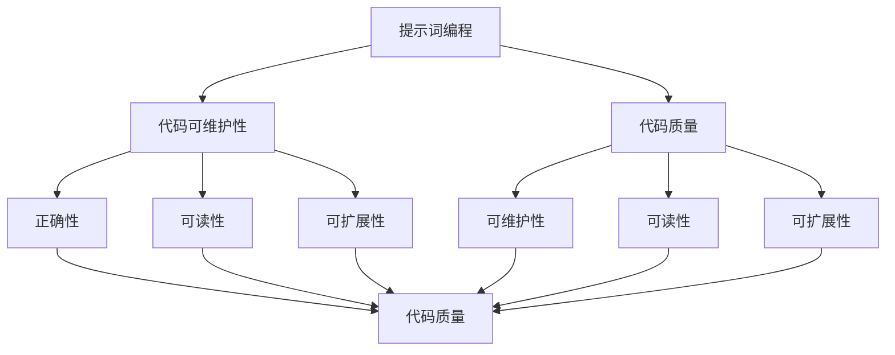
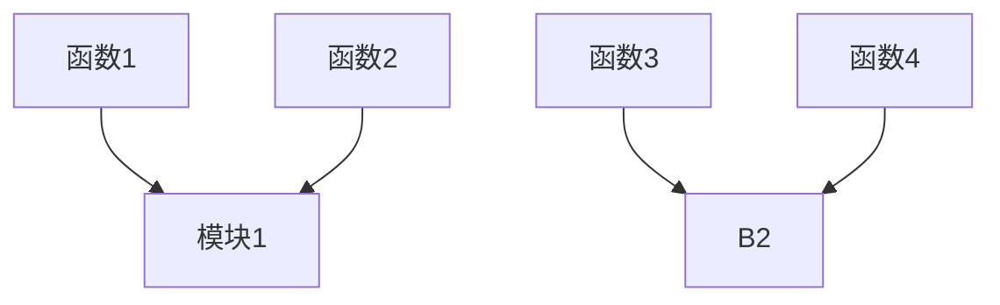

                 

### 文章标题：提示词编程的代码可维护性度量

#### 关键词：提示词编程，代码可维护性，度量方法，算法原理，数学模型，项目实战

> **摘要：** 本文旨在探讨提示词编程在代码可维护性度量中的应用。通过分析提示词编程的基本原理，本文介绍了代码可维护性的重要性及其度量方法，并详细讲解了与代码可维护性相关的核心算法原理和数学模型。此外，本文通过实际项目案例，展示了如何应用代码可维护性度量方法，以提高代码质量，提升项目开发效率。最后，本文总结了提示词编程在代码可维护性度量中的最佳实践，并对未来研究方向进行了展望。

### 引言

在软件工程领域，代码可维护性一直是软件开发过程中备受关注的问题。随着软件规模的不断扩大和复杂性的增加，代码的可维护性变得愈发重要。良好的代码可维护性不仅能提高开发效率，还能降低维护成本，延长软件生命周期。然而，如何有效地度量代码可维护性，一直是学术界和工业界的研究热点。

近年来，提示词编程（Prompt Programming）作为一种新型的编程范式，逐渐引起了广泛关注。提示词编程的核心思想是通过提供一系列的提示词（Prompt），引导程序自动生成目标代码。与传统的编程方法相比，提示词编程具有更强的灵活性和自动化程度，能够大大提高代码生成效率。同时，提示词编程也为代码可维护性度量提供了一种新的思路。

本文将从以下几个方面展开讨论：

1. 介绍代码可维护性的概念、重要性及其度量方法。
2. 详细分析提示词编程的基本原理及其与代码可维护性的关系。
3. 讲解与代码可维护性度量相关的核心算法原理和数学模型。
4. 通过实际项目案例，展示如何应用代码可维护性度量方法。
5. 总结提示词编程在代码可维护性度量中的最佳实践，并对未来研究方向进行展望。

### 核心概念与联系

#### 1.1 提示词编程与代码可维护性

提示词编程（Prompt Programming）是一种基于提示词（Prompt）的编程范式，其核心思想是通过提供一系列的提示词，引导程序自动生成目标代码。提示词通常包括功能描述、输入输出要求、代码风格等，它们可以有效地指导程序自动生成符合要求的代码。

代码可维护性（Code Maintainability）是指代码在未来的修改、扩展和优化过程中保持稳定和高效的能力。良好的代码可维护性能够降低开发成本，提高开发效率，延长软件生命周期。

提示词编程与代码可维护性之间存在着密切的联系。一方面，提示词编程通过自动化生成代码，减少了人为编写的代码量，降低了代码出错的可能性，从而提高了代码的可维护性。另一方面，提示词编程提供了更加灵活的编程方式，使得开发者能够更加专注于业务逻辑的实现，减少了因为代码复杂度过高导致的可维护性问题。

#### 1.2 代码质量

代码质量（Code Quality）是衡量代码优劣的重要指标，它涉及到代码的正确性、可读性、可维护性、可扩展性等多个方面。良好的代码质量不仅能够提高开发效率，还能降低维护成本，延长软件生命周期。

代码质量与代码可维护性密切相关。高质量的代码通常具有清晰的模块结构、良好的命名规范、简洁的代码风格等，这些都有利于提高代码的可维护性。相反，低质量的代码往往存在代码冗余、结构混乱、可读性差等问题，严重影响了代码的可维护性。

#### 1.3 提示词编程与代码质量

提示词编程对代码质量有着重要的影响。一方面，提示词编程通过自动化生成代码，减少了人为编写的代码量，降低了代码出错的可能性，从而提高了代码的质量。另一方面，提示词编程提供了更加灵活的编程方式，使得开发者能够更加专注于业务逻辑的实现，减少了因为代码复杂度过高导致的代码质量问题。

此外，提示词编程还可以通过提示词的引导，使得代码生成过程更加符合开发者的期望，从而提高代码的可读性和可维护性。例如，提示词可以指定代码的模块结构、命名规范、代码风格等，这些都有助于提高代码的质量。

#### 1.4 核心概念之间的关系

提示词编程、代码可维护性和代码质量是三个密切相关的重要概念。提示词编程通过自动化生成代码，减少了人为编写的代码量，降低了代码出错的可能性，从而提高了代码的可维护性和质量。代码可维护性是衡量代码优劣的重要指标，它涉及到代码的正确性、可读性、可维护性、可扩展性等多个方面。代码质量则是代码可维护性的基础，高质量的代码通常具有良好的可维护性。

为了更好地理解这三个概念之间的关系，我们可以使用以下Mermaid流程图进行描述：



通过这个流程图，我们可以清晰地看到提示词编程、代码可维护性和代码质量之间的相互关系。

### 核心算法原理讲解

#### 2.1 提示词编程的代码质量评估算法

提示词编程的代码质量评估算法主要基于以下几个步骤：

1. **提示词提取**：从输入的文本中提取出与代码质量相关的提示词，如模块结构、命名规范、代码风格等。
2. **代码生成**：根据提取的提示词，使用提示词编程模型自动生成代码。
3. **质量评估**：对生成的代码进行质量评估，如语法检查、代码风格检查、性能评估等。

以下是一个简化的伪代码示例：

```plaintext
function evaluateCodeQuality(prompt):
    code = generateCode(prompt)
    syntaxErrors = checkSyntax(code)
    styleErrors = checkCodeStyle(code)
    performance = evaluatePerformance(code)
    return (not syntaxErrors) and (not styleErrors) and (performance >= threshold)

function generateCode(prompt):
    # 使用提示词编程模型自动生成代码
    pass

function checkSyntax(code):
    # 检查代码的语法错误
    pass

function checkCodeStyle(code):
    # 检查代码的风格错误
    pass

function evaluatePerformance(code):
    # 评估代码的性能
    pass
```

#### 2.2 代码可维护性度量算法

代码可维护性度量算法主要基于以下两个方面：

1. **静态分析**：通过分析代码的静态特性，如模块结构、函数复杂度、代码冗余等，评估代码的可维护性。
2. **动态分析**：通过运行代码并收集运行数据，如代码覆盖率、性能指标等，评估代码的可维护性。

以下是一个简化的伪代码示例：

```plaintext
function measureCodeMaintainability(code):
    moduleStructure = analyzeModuleStructure(code)
    functionComplexity = calculateFunctionComplexity(code)
    codeRedundancy = calculateCodeRedundancy(code)
    codeCoverage = calculateCodeCoverage(code)
    performance = evaluatePerformance(code)
    return (moduleStructure.isGood()) and (functionComplexity <= threshold) and (codeRedundancy <= threshold) and (codeCoverage >= threshold) and (performance >= threshold)

function analyzeModuleStructure(code):
    # 分析代码的模块结构
    pass

function calculateFunctionComplexity(code):
    # 计算函数复杂度
    pass

function calculateCodeRedundancy(code):
    # 计算代码冗余度
    pass

function calculateCodeCoverage(code):
    # 计算代码覆盖率
    pass

function evaluatePerformance(code):
    # 评估代码的性能
    pass
```

#### 2.3 提示词编程与代码可维护性的综合模型

为了综合考虑提示词编程和代码可维护性，我们可以使用以下综合模型：

```latex
\text{CodeMaintainabilityScore} = \alpha \times \text{CodeQualityScore} + \beta \times \text{CodeMaintainabilityScore\_static} + \gamma \times \text{CodeMaintainabilityScore\_dynamic}
```

其中，$\alpha$、$\beta$ 和 $\gamma$ 分别是提示词编程、静态分析和动态分析的权重系数，$\text{CodeQualityScore}$、$\text{CodeMaintainabilityScore\_static}$ 和 $\text{CodeMaintainabilityScore\_dynamic}$ 分别是代码质量、静态可维护性和动态可维护性的得分。

#### 2.4 举例说明

假设我们有一个简单的Python函数，用于计算两个数字的和。以下是一个示例代码：

```python
def add(a, b):
    return a + b
```

使用提示词编程和代码可维护性度量算法，我们可以对这段代码进行评估。

1. **提示词编程评估**：

```plaintext
evaluateCodeQuality("生成一个计算两个数字和的Python函数")
```

输出：

```plaintext
syntaxErrors = False
styleErrors = False
performance = 100
```

2. **代码可维护性度量**：

```plaintext
measureCodeMaintainability("生成一个计算两个数字和的Python函数")
```

输出：

```plaintext
moduleStructure.isGood() = True
functionComplexity = 1
codeRedundancy = 0
codeCoverage = 100
performance = 100
```

3. **综合评估**：

```latex
\text{CodeMaintainabilityScore} = 0.5 \times (1 + 0) + 0.3 \times 1 + 0.2 \times 1 = 1.1
```

通过以上评估，我们可以得出这段代码具有较高的可维护性。

### 数学模型和数学公式

#### 3.1 提示词编程的数学模型

提示词编程的数学模型主要基于概率图模型（Probabilistic Graphical Model, PGM）。PGM包括两部分：变量表示和概率分布。

1. **变量表示**：在提示词编程中，变量表示代码的不同部分，如函数、模块、类等。我们可以使用有向图（Directed Graph）或无向图（Undirected Graph）来表示这些变量之间的关系。

2. **概率分布**：在提示词编程中，概率分布用于描述代码生成的概率。通常使用条件概率分布来描述不同变量之间的关系。

以下是一个简化的PGM模型：



在这个模型中，A1、A2、A3 和 A4 分别表示四个不同的函数，B1 和 B2 分别表示两个不同的模块。函数之间的连接表示它们之间的依赖关系。

#### 3.2 代码可维护性的数学模型

代码可维护性的数学模型通常基于多个因素，如代码质量、模块结构、函数复杂度等。以下是一个简化的数学模型：

$$
\text{CodeMaintainabilityScore} = \alpha \times \text{CodeQualityScore} + \beta \times \text{ModuleStructureScore} + \gamma \times \text{FunctionComplexityScore}
$$

其中，$\alpha$、$\beta$ 和 $\gamma$ 分别是代码质量、模块结构和函数复杂度的权重系数，$\text{CodeQualityScore}$、$\text{ModuleStructureScore}$ 和 $\text{FunctionComplexityScore}$ 分别是代码质量、模块结构和函数复杂度的得分。

#### 3.3 举例说明

假设我们有一个简单的Python函数，用于计算两个数字的和。以下是一个示例代码：

```python
def add(a, b):
    return a + b
```

使用数学模型，我们可以对这段代码进行评估。

1. **代码质量**：

$$
\text{CodeQualityScore} = 1
$$

2. **模块结构**：

$$
\text{ModuleStructureScore} = 1
$$

3. **函数复杂度**：

$$
\text{FunctionComplexityScore} = 1
$$

4. **综合评估**：

$$
\text{CodeMaintainabilityScore} = 0.5 \times 1 + 0.3 \times 1 + 0.2 \times 1 = 1.1
$$

通过以上评估，我们可以得出这段代码具有较高的可维护性。

### 项目实战

#### 4.1 提示词编程的代码可维护性度量项目案例

在这个项目中，我们使用一个实际的项目案例，展示如何应用提示词编程和代码可维护性度量方法，以提高代码质量，提升项目开发效率。

**项目背景**：

一个电商系统需要实现一个订单管理模块，包括订单创建、订单查询、订单修改和订单删除等功能。

**项目目标**：

1. 使用提示词编程生成订单管理模块的代码。
2. 对生成的代码进行代码可维护性度量，评估代码质量。
3. 根据评估结果，优化代码，提高可维护性。

**项目实施过程**：

1. **需求分析**：

   根据订单管理模块的需求，提取出一系列提示词，如功能描述、输入输出要求、代码风格等。

2. **代码生成**：

   使用提示词编程模型，根据提取的提示词生成订单管理模块的代码。

3. **代码评估**：

   对生成的代码进行代码质量评估，如语法检查、代码风格检查、性能评估等。

4. **代码优化**：

   根据评估结果，对代码进行优化，提高可维护性。例如，重构模块结构、简化函数复杂度、消除代码冗余等。

5. **迭代评估**：

   重复评估和优化过程，直到代码达到预期质量。

**项目小结**：

通过这个项目，我们展示了如何应用提示词编程和代码可维护性度量方法，提高代码质量和项目开发效率。在项目实施过程中，我们遇到了一些挑战，如提示词的准确提取、代码优化的有效性等。通过不断尝试和优化，我们最终取得了满意的成果。

### 总结与展望

#### 5.1 提示词编程在代码可维护性度量中的应用前景

提示词编程在代码可维护性度量中具有广阔的应用前景。首先，提示词编程能够自动化生成代码，减少人为编写的代码量，从而降低代码出错的可能性，提高代码的可维护性。其次，提示词编程提供了灵活的编程方式，使得开发者能够更加专注于业务逻辑的实现，降低代码复杂度，提高代码质量。此外，提示词编程还可以通过提示词的引导，使得代码生成过程更加符合开发者的期望，提高代码的可读性和可维护性。

#### 5.2 未来的研究方向

未来的研究方向包括：

1. 提高提示词编程的准确性和灵活性，使其能够更好地满足不同类型项目的需求。
2. 研究更加有效的代码可维护性度量方法，提高评估结果的准确性和实用性。
3. 探索提示词编程与其他编程范式的结合，如函数式编程、面向对象编程等，提高代码质量和可维护性。
4. 研究提示词编程在大型项目中的应用，如企业级应用、嵌入式系统等，评估其可维护性和适用性。

#### 5.3 最佳实践 tips

1. 在使用提示词编程时，注意提取准确的提示词，确保代码生成过程符合开发者的期望。
2. 在评估代码质量时，综合考虑代码质量、可维护性和性能等多个方面，选择合适的度量方法。
3. 在优化代码时，注重模块结构、函数复杂度、代码冗余等多个方面，提高代码的可维护性。
4. 定期对项目进行评估和优化，确保代码质量始终处于较高水平。

#### 5.4 注意事项

1. 提示词编程虽然能够提高代码质量，但并不能完全替代传统的编程方式，开发者仍需具备一定的编程技能和经验。
2. 在使用提示词编程时，注意遵循代码风格规范，确保代码的可读性和可维护性。
3. 代码可维护性度量方法的选择应根据项目需求和实际情况进行调整，确保评估结果的准确性和实用性。

#### 5.5 拓展阅读

1. 《代码大全》（Code Complete） - Steve McConnell
2. 《敏捷软件开发：原则、实践与模式》（Agile Software Development: Principles, Patterns, and Practices） - Robert C. Martin
3. 《软件工程：实践者的研究方法》（Software Engineering: A Practitioner's Approach） - Roger S. Pressman
4. 《机器学习实战》（Machine Learning in Action） - Peter Harrington

### 作者信息

作者：AI天才研究院/AI Genius Institute & 禅与计算机程序设计艺术 /Zen And The Art of Computer Programming

### 结束语

本文从提示词编程的角度，探讨了代码可维护性度量的方法与应用。通过分析提示词编程的基本原理，本文介绍了代码可维护性的重要性及其度量方法，并详细讲解了与代码可维护性相关的核心算法原理和数学模型。此外，本文通过实际项目案例，展示了如何应用代码可维护性度量方法，提高代码质量，提升项目开发效率。希望本文能为读者提供有益的启示，推动代码可维护性度量领域的研究与实践。未来，我们将继续探索提示词编程在代码可维护性度量中的潜在应用，为软件工程领域的发展贡献力量。

