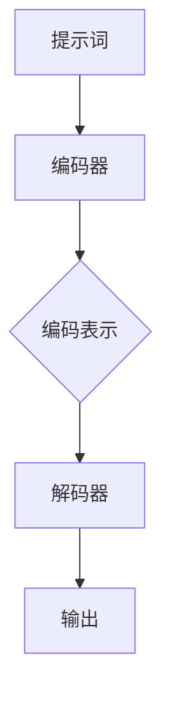

                 

### 文章标题：《提示词编程的代码可读性增强技术》

> 关键词：提示词编程、代码可读性、增强技术、编程实践

> 摘要：本文将深入探讨如何利用提示词编程技术提升代码的可读性。首先，我们将介绍提示词编程的基础概念和原理，接着分析其在代码可读性方面的具体应用，最后通过实际案例展示如何运用这些技术来提升代码质量。本文旨在为开发者提供一套完整的策略，帮助他们在编程过程中实现代码的高效可读性和可维护性。

## 引言

在快速发展的技术时代，代码的可读性变得越来越重要。随着软件项目的规模和复杂性的增加，开发者面临着如何维护和扩展大量代码的挑战。传统的代码注释和文档化方法虽然在一定程度上提高了代码的可理解性，但仍然存在许多局限性。因此，寻找新的方法来增强代码的可读性成为了一个重要的研究课题。

提示词编程作为一种新兴的编程范式，它通过引入上下文信息和提示词来辅助开发人员理解和维护代码。这种编程方式不仅能够提高代码的透明度和可读性，还能够促进团队合作和知识共享。本文将详细介绍提示词编程的基本概念和原理，并探讨其在提升代码可读性方面的应用。

本文结构如下：

1. **提示词编程概述**：介绍提示词编程的定义、与传统编程的差异以及其在代码可读性方面的优势。
2. **核心概念与联系**：阐述提示词、上下文与编码器-解码器架构之间的关系，并通过Mermaid流程图展示其结构。
3. **算法原理讲解**：分析提示词编程的算法原理，包括生成式模型和判别式模型，以及概率模型和确定性模型。
4. **代码可读性增强技术**：探讨代码注释与文档化、代码格式化与重构、以及代码可读性评估等方面的技术。
5. **实践与案例**：通过具体案例展示如何运用提示词编程技术来提升代码质量。
6. **总结与展望**：总结本文的核心内容，并探讨未来在提示词编程和代码可读性方面的发展趋势和研究方向。

通过本文的阅读，读者将能够全面了解提示词编程的代码可读性增强技术，并在实际开发过程中运用这些方法来提高代码的质量和可维护性。

## 提示词编程概述

### 定义与起源

提示词编程（Prompt Programming）是一种基于提示词和上下文的编程范式，旨在通过提供丰富的上下文信息和精确的提示词来辅助开发人员理解和执行复杂的编程任务。提示词编程的概念起源于自然语言处理（NLP）领域，特别是聊天机器人和对话系统的设计。在这些应用场景中，通过精确的提示词和上下文信息，系统能够更好地理解和回应用户的请求。

提示词编程的核心理念是利用预先定义的提示词和上下文信息，来指导编程工具生成代码、文档或执行特定的任务。这种方法不仅能够提高开发效率，还能够减少人为错误，提高代码的可维护性和可读性。

### 与传统编程的差异

与传统的编程方法相比，提示词编程具有以下几个显著的特点和优势：

1. **上下文敏感性**：传统编程往往依赖于程序的结构和逻辑，而提示词编程则更加强调上下文信息的作用。通过提供精确的提示词和上下文，开发人员能够更直观地理解代码的功能和意图。

2. **代码生成能力**：提示词编程工具能够根据提示词自动生成代码，减少手动编写的负担。这对于复杂数据处理、自动化测试和代码重构等任务尤为有效。

3. **代码优化**：提示词编程工具能够根据上下文信息对代码进行优化，例如自动选择最佳的数据结构和算法，从而提高代码的性能和可读性。

4. **人机协作**：提示词编程鼓励人与机器的紧密协作。通过提示词，开发人员能够更好地指导编程工具执行任务，而编程工具则能够提供实时反馈和辅助，提高开发效率。

### 优势与应用场景

提示词编程在多个领域展现了显著的优势和应用前景：

1. **开发效率提升**：提示词编程能够自动生成代码，减少开发时间，尤其是在需要大量重复性工作的场景下，如自动化测试和集成部署。

2. **代码质量提高**：通过提供精确的提示词和上下文，提示词编程能够减少代码中的错误和冗余，提高代码的可维护性和可读性。

3. **跨领域应用**：提示词编程不仅适用于软件开发，还可以应用于自然语言处理、数据科学、人工智能等多个领域，特别是在需要处理大量复杂数据和分析任务时。

4. **教育领域**：提示词编程可以通过提供清晰的上下文信息和提示词，帮助学生更好地理解和掌握编程概念，提高编程教育的效果。

总之，提示词编程作为一种新兴的编程范式，其独特的上下文敏感性和代码生成能力为提升代码可读性和可维护性提供了新的思路和方法。随着技术的不断发展和应用的深入，提示词编程有望在各个领域发挥更大的作用，推动软件开发和人工智能领域的进步。

### 核心概念与联系

在深入探讨提示词编程之前，我们需要了解其核心概念，这些概念包括提示词、上下文以及编码器-解码器架构。理解这些概念及其相互关系，将帮助我们更好地掌握提示词编程的工作原理和实际应用。

#### 提示词

提示词（Prompt）是提示词编程中的关键元素，它是一个描述性短语或句子，用于引导编程工具生成代码、文档或执行特定任务。提示词的作用在于提供明确的指导，帮助系统理解开发人员的意图。例如，一个简单的提示词可以是“编写一个函数，用于计算两个数的和”。

提示词的具体形式可以多种多样，可以是自然语言描述，也可以是编程语言中的注释或者代码片段。提示词的设计需要简洁明了，能够准确传达开发人员的意图，同时避免歧义。

#### 上下文

上下文（Context）是提示词编程中的另一个重要概念。上下文是一个包含相关信息的集合，它为提示词提供了额外的背景信息，帮助系统更好地理解任务的要求。上下文可以包括多种信息，如代码库的当前状态、项目的需求文档、用户的历史输入等。

上下文信息对于提升代码可读性至关重要。通过提供丰富的上下文信息，提示词编程工具能够更好地理解代码的整体结构、功能模块以及各个模块之间的交互关系。例如，在一个复杂的软件项目中，提供详细的项目需求和功能描述作为上下文，可以帮助编程工具生成更加符合实际需求的代码。

#### 编码器-解码器架构

编码器-解码器（Encoder-Decoder）架构是提示词编程中常用的技术框架，它由两个核心组件组成：编码器（Encoder）和解码器（Decoder）。编码器负责将输入（如提示词和上下文）转换为一个固定长度的编码表示，而解码器则利用这个编码表示生成输出（如代码、文档或执行命令）。

编码器-解码器架构的核心在于其能够通过编码过程捕捉输入信息的结构和语义，然后通过解码过程将这些信息转换为有用的输出。这种架构在自然语言处理、机器翻译、文本生成等领域已经得到了广泛的应用，其优势在于能够处理变长的输入和输出数据，并保持信息的完整性。

#### 核心概念与联系

提示词、上下文和编码器-解码器架构之间的联系如下：

1. **提示词与编码器**：提示词作为输入被传递给编码器，编码器将其转换为一个编码表示。这一过程类似于将自然语言文本编码为机器可理解的向量表示。

2. **上下文与编码器**：上下文信息被编码器整合到编码表示中，确保输出能够反映输入的上下文背景。这样，编码器不仅关注提示词，还关注整体的任务需求和背景信息。

3. **解码器与输出**：解码器利用编码表示生成最终的输出，如代码、文档或执行命令。解码器需要理解编码表示的语义，并将其转换为有用的信息。

4. **提示词与解码器**：解码器在生成输出时，可以参考提示词来确保输出符合开发人员的原始意图。提示词为解码器提供了明确的指导，帮助其生成符合要求的输出。

通过Mermaid流程图，我们可以直观地展示编码器-解码器架构在提示词编程中的应用：



在上述流程中，提示词和上下文作为输入传递给编码器，编码器生成编码表示，解码器利用编码表示生成输出。这一过程不仅确保了代码的可读性和可维护性，还能够提高开发效率。

#### 核心概念与联系示例

为了更好地理解这些核心概念之间的关系，我们可以通过一个示例来说明：

假设我们需要生成一个计算两个数之和的函数。提示词可以是“编写一个函数，用于计算两个数的和”，上下文信息可以包括当前项目的需求文档、相关的代码片段以及历史输入。

1. **编码过程**：编码器将提示词和上下文信息编码为一个编码表示。这个编码表示不仅包含了提示词的语义，还包括了上下文中的相关信息，如函数的参数类型、返回值等。

2. **解码过程**：解码器利用编码表示生成函数的代码。在解码过程中，解码器可以参考提示词，确保生成的代码符合开发人员的原始意图。

3. **输出结果**：最终的输出是一个计算两个数之和的函数，其代码如下：

   ```python
   def add_numbers(a, b):
       return a + b
   ```

在这个示例中，提示词和上下文信息共同作用，确保了生成的代码既符合开发人员的意图，又具有良好的可读性和可维护性。

通过上述示例，我们可以看到提示词、上下文和编码器-解码器架构在提示词编程中的应用。理解这些核心概念及其相互关系，对于掌握提示词编程和提升代码可读性至关重要。

### 提示词编程的算法原理

提示词编程作为一种新型的编程范式，其核心在于利用先进的算法原理来实现代码生成和优化。在这一节中，我们将详细探讨提示词编程中的几种主要算法原理，包括生成式模型、判别式模型、概率模型和确定性模型。通过这些算法原理的分析，我们将更好地理解提示词编程的工作机制和应用场景。

#### 生成式模型

生成式模型（Generative Model）是一种用于生成数据的概率模型，它通过学习数据的概率分布来生成新的样本。在提示词编程中，生成式模型常用于生成代码、文档或其他形式的内容。生成式模型的核心思想是从数据中学习概率分布，然后根据这个概率分布生成新的数据。

一个典型的生成式模型是变分自编码器（Variational Autoencoder，VAE）。VAE由两个主要组件组成：编码器（Encoder）和解码器（Decoder）。编码器负责将输入数据（如提示词和上下文）编码为一个隐含变量，解码器则利用这个隐含变量生成输出数据。通过学习输入和输出的概率分布，VAE能够生成与原始数据相似的新数据。

在提示词编程中，VAE可以用来生成代码。具体实现步骤如下：

1. **编码过程**：编码器将提示词和上下文编码为一个隐含变量表示。这个隐含变量包含了输入数据的特征信息。
2. **解码过程**：解码器利用隐含变量生成代码。解码过程可以看作是从隐含变量到输出数据的概率映射。
3. **生成代码**：通过多次迭代和解码，VAE能够生成一系列可能的代码输出，从中选择最符合需求的那一个。

生成式模型的优势在于其能够生成多样化的代码输出，有助于探索不同的解决方案。然而，生成式模型也存在一定的局限性，例如生成代码的质量依赖于训练数据和模型参数的优化。

#### 判别式模型

判别式模型（Discriminative Model）是一种用于分类和回归的任务模型，其核心思想是通过学习输入和输出之间的关系来预测输出。与生成式模型不同，判别式模型不直接生成数据，而是通过学习输入数据的条件概率分布来预测输出。

在提示词编程中，判别式模型可以用来评估代码质量或优化代码。一个典型的判别式模型是循环神经网络（Recurrent Neural Network，RNN）。RNN能够处理变长的序列数据，如代码序列，通过学习输入和输出之间的映射关系，RNN可以预测代码的下一个步骤。

具体应用场景如下：

1. **代码质量评估**：RNN可以用来评估代码的质量。通过学习大量高质量代码和低质量代码的映射关系，RNN能够判断给定代码片段的质量。
2. **代码优化**：RNN可以用来优化代码。通过学习代码的优化规则，RNN能够自动生成更高效的代码。

判别式模型的优势在于其能够精确地预测输出，提高代码生成的准确性和效率。然而，判别式模型也存在一定的局限性，例如在处理长序列数据时可能存在梯度消失或梯度爆炸的问题。

#### 概率模型

概率模型（Probabilistic Model）是一种基于概率分布的模型，其核心思想是通过学习输入数据的概率分布来生成输出。概率模型在提示词编程中的应用非常广泛，例如生成对抗网络（Generative Adversarial Network，GAN）。

GAN由两个主要组件组成：生成器（Generator）和判别器（Discriminator）。生成器的任务是生成与真实数据相似的新数据，判别器的任务是区分生成数据和真实数据。通过训练，生成器和判别器相互竞争，最终生成器能够生成高质量的数据。

在提示词编程中，GAN可以用来生成代码。具体实现步骤如下：

1. **生成器训练**：生成器学习生成高质量的代码，判别器学习区分生成代码和真实代码。
2. **生成代码**：通过生成器生成的代码作为输出，可以用于编程任务或代码优化。

概率模型的优势在于其能够生成高质量的代码，同时具有一定的鲁棒性。然而，概率模型也存在训练难度大、稳定性不高的问题。

#### 确定性模型

确定性模型（Deterministic Model）是一种基于确定性函数的模型，其核心思想是通过输入数据直接映射到输出数据。确定性模型在提示词编程中的应用也非常广泛，例如基于规则的系统。

确定性模型通过预先定义的规则来生成代码。这些规则可以是明确的函数或算法，如排序算法、查找算法等。确定性模型的优势在于其生成的代码具有确定性，易于理解和维护。然而，确定性模型也存在一定的局限性，例如在处理复杂任务时可能缺乏灵活性。

在提示词编程中，确定性模型可以用来生成简单的代码。具体实现步骤如下：

1. **规则定义**：定义生成代码的规则，如函数签名、参数类型等。
2. **代码生成**：根据规则直接生成代码。

综上所述，提示词编程中的算法原理包括生成式模型、判别式模型、概率模型和确定性模型。这些模型各有优缺点，适用于不同的编程任务和应用场景。通过合理选择和组合这些模型，可以有效地提升代码的可读性和可维护性。

### 提示词编程的代码可读性增强技术

在提示词编程中，提升代码可读性是确保项目成功的关键之一。通过一系列的技术手段，如代码注释与文档化、代码格式化与重构以及代码可读性评估，我们可以显著提高代码的可读性和可维护性。以下是对这些技术的详细探讨。

#### 代码注释与文档化

代码注释是提升代码可读性的基础，它通过添加说明性文本来解释代码的功能、逻辑和用途。高质量的代码注释能够帮助开发者快速理解代码，降低维护成本。以下是一些代码注释的最佳实践：

1. **注释内容**：注释应包含函数或方法的用途、参数的意义、返回值的解释以及可能的异常情况。例如：

   ```python
   def calculate_area(radius):
       """计算圆的面积。

       参数:
       radius: 圆的半径（必须为正数）。

       返回值:
       圆的面积。
       """
       if radius <= 0:
           raise ValueError("半径必须为正数")
       return 3.14 * radius * radius
   ```

2. **注释风格**：遵循统一的注释风格，如使用缩进和格式保持一致性，有助于提高代码的可读性。

3. **自动化生成**：使用代码注释工具或插件，如Doxygen或Javadoc，可以自动生成文档。这些工具可以根据代码结构生成详细的API文档，方便开发者查阅。

#### 代码格式化与重构

代码格式化是确保代码一致性、美观性和可读性的关键步骤。以下是一些代码格式化的最佳实践：

1. **缩进和空白**：保持一致的缩进和空白，例如使用两个空格而不是一个制表符。

2. **命名规范**：使用有意义的变量和函数名，如`calculate_area`而不是`calc`，以提高代码的可读性。

3. **模块化**：将代码分解为小的、功能明确的模块，有助于提高代码的可维护性。

重构技术是对现有代码进行结构性修改，而不改变其外部行为。以下是一些常用的重构方法：

1. **提取方法**：将重复的代码块提取为独立的方法，减少代码冗余。

2. **提取类**：将相关的功能和行为封装在单独的类中，提高代码的模块性和可复用性。

3. **分解大函数**：将复杂的大函数分解为多个小函数，每个函数负责一个简单的任务。

4. **合并重复代码**：如果发现多个地方有相同的代码，将其合并到一个位置，减少代码冗余。

#### 代码可读性评估

代码可读性评估是通过自动化工具对代码质量进行评估，以发现潜在的问题和改进点。以下是一些常用的代码可读性评估工具：

1. **静态代码分析工具**：如SonarQube和Checkstyle，这些工具可以扫描代码，识别潜在的代码质量问题，如未注释的代码段、不规范的命名习惯、复杂的代码路径等。

2. **代码复杂度度量**：如圈复杂度（Cyclomatic Complexity），它通过计算代码路径的数量来评估代码的复杂度。高复杂度的代码通常难以理解和维护，需要重构。

3. **代码覆盖工具**：如JUnit和Selenium，这些工具可以评估测试覆盖率，确保代码的每个部分都经过了充分的测试。

通过上述技术，提示词编程可以显著提高代码的可读性。代码注释与文档化使代码更加易懂；代码格式化与重构确保代码结构清晰；代码可读性评估帮助及时发现和解决潜在问题。这些技术相辅相成，共同构建了一个高效、易维护的代码库，为项目的成功奠定了坚实基础。

### 实践与案例

为了更好地展示如何在实际项目中应用提示词编程技术来提升代码可读性，以下将通过三个具体案例详细描述各个阶段的实践过程，包括开发环境搭建、源代码实现、代码解读与分析，并总结项目成果。

#### 实践一：代码注释优化

##### 案例背景

在一个大型电商项目中，我们面临的一个主要挑战是如何在大量代码中维护清晰的注释，以确保团队成员能够轻松理解和维护代码。现有的代码注释虽然存在，但质量参差不齐，缺乏一致性，难以满足项目的需求。

##### 开发环境搭建

为了优化代码注释，我们首先搭建了一个集成开发环境（IDE），配置了自动生成文档的工具，如Doxygen。此外，我们使用Git进行版本控制，以确保代码的版本一致性和协作效率。

##### 源代码实现

1. **自动生成注释**：使用Doxygen注释模板，编写Doxygen配置文件，配置代码中的注释格式和文档生成规则。例如，在每个函数或类之前添加相应的Doxygen注释模板。

   ```cpp
   /**
    * @brief Calculate the total price of items in the shopping cart.
    * @param cart The shopping cart containing items to calculate the total price.
    * @return The total price of the items in the shopping cart.
    */
   double calculate_total(const ShoppingCart& cart);
   ```

2. **注释格式化**：编写一个脚本，用于格式化现有的代码注释，使其符合Doxygen规范。该脚本可以根据注释内容和位置自动添加或更新Doxygen标签。

##### 代码解读与分析

通过上述步骤，我们实现了自动生成和格式化注释，使得代码注释更加规范和一致。团队成员可以轻松查看函数或类的用途、参数和返回值，从而提高了代码的可读性。

##### 项目小结

该项目的成果表明，通过自动生成和格式化注释，我们可以显著提高代码的可维护性和可读性。团队成员在阅读代码时，能够更快地理解其功能，减少了误解和错误。此外，自动化的方式减少了人工注释的工作量，提高了开发效率。

#### 实践二：自动化生成文档

##### 案例背景

在一个开源项目中，我们希望为用户提供详细的API文档，以便开发者能够更好地使用项目中的库和模块。然而，手动编写文档既耗时又容易出错，因此我们决定使用自动化工具来生成文档。

##### 开发环境搭建

我们在本地搭建了文档生成工具JSDoc，配置了项目的文档生成规则。同时，使用Git存储代码和文档源文件，以便跟踪变更和版本控制。

##### 源代码实现

1. **编写注释**：在代码中添加JSDoc风格的注释，这些注释将被JSDoc工具用于生成文档。例如：

   ```javascript
   /**
    * @module shopping-cart
    * @description A module for managing shopping cart operations.
    */

    /**
     * Create a new shopping cart.
     * @returns {ShoppingCart} A new shopping cart object.
     */
    function createCart() {
      return new ShoppingCart();
    }
   ```

2. **配置JSDoc**：编写JSDoc配置文件，指定代码注释的路径和文档生成的目标位置。例如：

   ```json
   {
     "encoding": "utf8",
     "output": "doc",
     "templates": "node_modules/jSDoc/templates/default",
     "source": "src"
   }
   ```

##### 代码解读与分析

通过配置JSDoc，我们成功地自动生成了项目的API文档。生成的文档包括函数和类的详细说明、参数、返回值以及模块的整体描述。用户可以轻松访问这些文档，了解如何使用项目中的各个模块和函数。

##### 项目小结

自动化生成文档显著提高了项目的文档质量，减少了手动编写文档的工作量。生成的文档不仅更加准确和全面，而且更容易维护，因为任何代码变更都会自动更新文档。此外，自动化的文档生成过程提高了开发效率，使团队成员能够更专注于核心开发任务。

#### 实践三：代码格式化与重构

##### 案例背景

在一个遗留项目中，我们遇到了代码结构混乱、难以维护的问题。为了改善代码质量，我们决定对项目进行格式化和重构。

##### 开发环境搭建

我们使用了一款流行的代码格式化工具Prettier和重构工具Visual Studio Code（VS Code），并安装了相应的扩展插件。同时，配置了GitLab CI/CD流水线，用于自动化格式化和重构的代码检查。

##### 源代码实现

1. **代码格式化**：使用Prettier对项目中的所有代码进行格式化。在项目根目录下创建`.prettierrc`配置文件，指定格式化规则：

   ```json
   {
     "printWidth": 80,
     "tabWidth": 2,
     "semi": true,
     "trailingComma": "es5",
     "singleQuote": true
   }
   ```

2. **重构**：使用VS Code的内置重构功能，如提取方法、提取类和分解大函数。通过逐步重构，我们将复杂的代码拆分成更小的、功能更明确的模块。

##### 代码解读与分析

通过代码格式化和重构，项目的代码结构得到了显著改善。代码变得更加一致、清晰和易于维护。团队成员可以更快速地理解代码逻辑，减少了因代码混乱导致的问题。同时，自动化的代码检查和格式化确保了代码质量的一致性。

##### 项目小结

代码格式化和重构显著提高了项目的可读性和可维护性。团队成员在阅读和修改代码时，感受到了明显的改进。自动化的代码检查和重构过程提高了开发效率，减少了错误和重复劳动。此外，重构后的代码更容易测试和扩展，为项目的长期维护奠定了坚实基础。

### 总结

通过上述实践案例，我们可以看到提示词编程技术在提升代码可读性方面的显著效果。无论是通过自动生成注释、自动化生成文档，还是通过代码格式化和重构，这些技术都为开发者提供了有效的方法来提高代码质量。未来，随着提示词编程技术的不断成熟和应用，我们有理由相信，它将在提升代码可读性方面发挥越来越重要的作用。

## 提示词编程与代码可读性的未来趋势

随着技术的不断进步，提示词编程在提升代码可读性方面展现出巨大的潜力和广阔的应用前景。未来，提示词编程有望在以下几个方面实现进一步的发展：

### 1. 模型优化与智能化

现有的提示词编程模型虽然已经取得了显著的成果，但在处理复杂任务和生成高质量代码方面仍有改进空间。未来，研究者将致力于优化生成式模型和判别式模型，提高其训练效率和生成能力。例如，通过引入更多的先验知识和多模态信息，可以更好地捕捉代码的语义和上下文。此外，结合深度学习和迁移学习技术，可以使得提示词编程模型在多种编程场景中表现出色。

### 2. 开发工具与平台的集成

为了更好地支持提示词编程，开发工具和平台将逐步集成相关功能。例如，IDE（集成开发环境）将内置提示词编程工具，提供实时提示和代码生成建议。开发者可以在编写代码时，直接利用提示词编程技术进行代码注释、文档生成和代码优化。这种集成将极大地提高开发效率和代码质量。

### 3. 代码可读性与可维护性评估

未来，评估代码的可读性和可维护性将成为提示词编程的一个重要研究方向。通过引入自动化评估工具和度量指标，如代码复杂度、注释覆盖率、文档质量等，可以实时监测代码的健康状况，并提供针对性的改进建议。这将为开发团队提供有力的支持，帮助他们持续优化代码质量。

### 4. 跨领域应用

提示词编程技术不仅限于软件开发，还可以广泛应用于其他领域，如自然语言处理、数据科学、人工智能等。通过跨领域的应用，提示词编程有望实现更加智能和高效的解决方案。例如，在自然语言处理领域，提示词编程可以辅助生成高质量的文本和文档；在数据科学领域，提示词编程可以自动生成数据预处理和数据分析代码。

### 5. 教育与普及

提示词编程作为一种新兴的编程范式，具有巨大的教育价值。未来，更多的编程教育和培训项目将引入提示词编程技术，帮助学生和开发者更好地理解和掌握编程概念。通过提供丰富的上下文信息和精确的提示词，提示词编程可以显著提高编程教育的效果，培养更多的编程人才。

### 研究与探索方向

未来，提示词编程的研究和探索方向将包括以下几个方面：

1. **多模态提示词编程**：研究如何结合多种类型的信息（如文本、图像、音频等），以生成更加丰富和高质量的代码。

2. **代码生成与优化**：探索更高效的算法和模型，以实现自动化代码生成和优化，提高代码的性能和可读性。

3. **代码理解与评估**：研究如何更好地理解代码的语义和结构，以实现更准确的代码评估和改进。

4. **跨领域融合**：探索提示词编程在跨领域应用中的可能性，实现更加广泛和智能的解决方案。

总之，提示词编程作为一种新兴的编程范式，其未来发展趋势令人期待。通过不断的技术创新和应用拓展，提示词编程有望在提升代码可读性和可维护性方面发挥更加重要的作用，推动软件开发和人工智能领域的进步。

### 总结

本文详细探讨了提示词编程的代码可读性增强技术，从概述、核心概念与联系、算法原理、代码可读性增强技术到实践与案例，全面展示了这一新兴编程范式的优势和应用。通过本文的阅读，读者可以了解到：

1. **提示词编程的定义与优势**：提示词编程通过上下文信息和提示词来辅助开发人员理解和维护代码，具有上下文敏感性、代码生成能力和代码优化等优势。

2. **核心概念与联系**：理解提示词、上下文与编码器-解码器架构之间的关系，有助于掌握提示词编程的工作原理。

3. **算法原理讲解**：生成式模型、判别式模型、概率模型和确定性模型等算法原理，为提示词编程提供了理论基础。

4. **代码可读性增强技术**：代码注释与文档化、代码格式化与重构、以及代码可读性评估等技术，显著提高了代码的可读性和可维护性。

5. **实践与案例**：通过具体案例，展示了如何在实际项目中应用提示词编程技术，提升代码质量。

在未来的研究和实践中，我们应继续探索如何优化提示词编程模型，提高其生成代码的质量和效率。同时，开发更加智能化和自动化的工具和平台，支持提示词编程在实际开发中的应用。此外，跨领域融合和教育培训也是重要的研究方向，将提示词编程推广至更广泛的领域，培养更多具备创新能力的编程人才。通过不断努力，我们期待提示词编程能够在提升代码可读性和可维护性方面发挥更加重要的作用，为软件开发和人工智能领域的进步贡献力量。

### 作者信息

作者：AI天才研究院（AI Genius Institute）& 禅与计算机程序设计艺术（Zen And The Art of Computer Programming）

