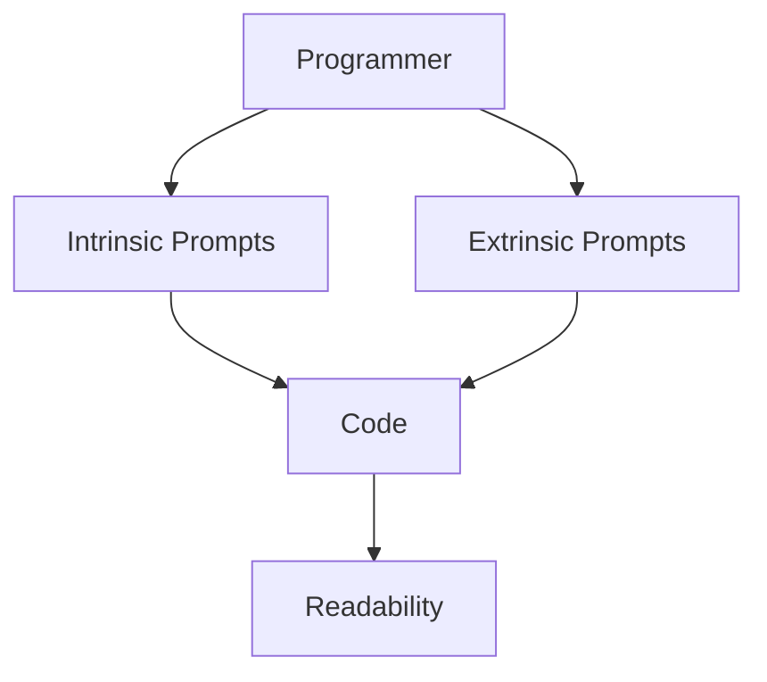

                 


# 文章标题

Prompt-Based Programming Code Readability Automatic Assessment

> 关键词：Prompt-Based Programming，Code Readability，Automatic Assessment，算法原理，数学模型，项目实战

> 摘要：本文深入探讨Prompt-Based Programming的代码可读性自动评估。从背景介绍、核心概念与联系、算法原理与数学模型、项目实战等多方面分析，旨在为开发者提供一种有效的代码可读性评估方法。

---

## 引言

### 背景介绍

代码可读性是软件工程中的一个重要议题。良好的代码可读性不仅有助于新开发者快速理解代码逻辑，提高开发效率，还能降低维护成本。然而，传统的代码可读性评估方法主要依赖人工检查，效率低下且易受主观因素影响。

近年来，Prompt-Based Programming（提示词编程）作为一种新兴的编程范式，逐渐引起了研究者的关注。其核心思想是通过使用特定的提示词来引导程序员的思维，从而提高代码的可读性和可维护性。因此，对Prompt-Based Programming的代码可读性进行自动评估具有很高的研究价值。

### 研究目的

本文旨在探讨如何对Prompt-Based Programming的代码可读性进行自动评估。具体目标包括：

1. 理解Prompt-Based Programming的基本概念和核心算法原理。
2. 建立一个数学模型，用于描述代码可读性的评估标准。
3. 通过实际项目案例，验证自动评估方法的有效性。
4. 分析自动评估方法的优缺点，并提出改进建议。

---

## 核心概念与联系

### Prompt-Based Programming概述

Prompt-Based Programming是一种基于提示词的编程范式，其核心思想是利用提示词来引导程序员的思考，从而提高代码的可读性和可维护性。具体来说，提示词可以分为两类：内禀提示词（intrinsic prompts）和外在提示词（extrinsic prompts）。

- **内禀提示词**：这些提示词嵌入在代码中，用于描述代码的功能、逻辑和结构。例如，注释、命名规范等。
- **外在提示词**：这些提示词来自于外部文档、需求分析、用户反馈等，用于补充代码中的不足，帮助程序员更好地理解代码的上下文。

### 核心概念之间的关系架构

为了更清晰地展示Prompt-Based Programming的核心概念，我们可以使用Mermaid流程图来描述它们之间的关系。以下是核心概念之间的Mermaid流程图：



在这个流程图中，程序员（A）利用内禀提示词（B）和外在提示词（C）来生成代码（D），最终影响代码的可读性（E）。

### 实例分析

以下是一个简单的Python代码实例，展示如何使用提示词来提高代码的可读性：

```python
# 计算两个数的和
def add(a, b):
    """
    计算两个数的和
    :param a: 第一个数
    :param b: 第二个数
    :return: 两个数的和
    """
    return a + b
```

在这个实例中，注释和函数命名（内禀提示词）以及函数文档（外在提示词）共同提高了代码的可读性。

---

## 算法原理

### Prompt-Based Programming的核心算法原理

Prompt-Based Programming的核心算法原理可以概括为以下几个步骤：

1. **提示词提取**：从代码、文档和其他来源中提取提示词。
2. **提示词分类**：将提取的提示词分为内禀提示词和外在提示词。
3. **代码生成**：利用分类后的提示词来生成代码。
4. **代码评估**：评估生成代码的可读性。

以下是详细的伪代码，用于描述上述算法原理：

```python
# 提示词提取
def extract_prompts(code):
    # 从代码中提取注释、命名规范等内禀提示词
    intrinsic_prompts = extract_intrinsic_prompts(code)
    # 从文档、需求分析等中提取外在提示词
    extrinsic_prompts = extract_extrinsic_prompts(code)
    return intrinsic_prompts, extrinsic_prompts

# 提示词分类
def classify_prompts(intrinsic_prompts, extrinsic_prompts):
    # 分类内禀提示词和外在提示词
    classified_prompts = {
        'intrinsic': intrinsic_prompts,
        'extrinsic': extrinsic_prompts
    }
    return classified_prompts

# 代码生成
def generate_code(classified_prompts):
    # 利用分类后的提示词生成代码
    code = construct_code(classified_prompts['intrinsic'], classified_prompts['extrinsic'])
    return code

# 代码评估
def assess_code_readability(code):
    # 评估生成代码的可读性
    readability_score = calculate_readability_score(code)
    return readability_score
```

### 数学模型

为了量化代码的可读性，我们可以引入一个数学模型，用于描述可读性的评估标准。以下是数学模型的具体描述：

$$
R = f(C, I, E)
$$

其中，$R$ 表示代码的可读性分数，$C$ 表示代码质量，$I$ 表示内禀提示词的丰富度，$E$ 表示外在提示词的有效性。

- **代码质量（$C$）**：衡量代码的语法、结构、逻辑等是否规范，是否有冗余或不必要的复杂性。
- **内禀提示词的丰富度（$I$）**：衡量内禀提示词的数量和质量，例如注释的详细程度、命名规范等。
- **外在提示词的有效性（$E$）**：衡量外在提示词是否与代码紧密相关，是否能够补充代码中的不足。

以下是具体的数学模型公式：

$$
C = w_1 \cdot C_1 + w_2 \cdot C_2 + \ldots + w_n \cdot C_n
$$

$$
I = w_1 \cdot I_1 + w_2 \cdot I_2 + \ldots + w_m \cdot I_m
$$

$$
E = w_1 \cdot E_1 + w_2 \cdot E_2 + \ldots + w_p \cdot E_p
$$

其中，$w_1, w_2, \ldots, w_n$，$w_1, w_2, \ldots, w_m$，$w_1, w_2, \ldots, w_p$ 分别表示权重系数，$C_1, C_2, \ldots, C_n$，$I_1, I_2, \ldots, I_m$，$E_1, E_2, \ldots, E_p$ 分别表示代码质量、内禀提示词丰富度和外在提示词有效性的具体指标。

最终，代码的可读性分数 $R$ 可以通过以下公式计算：

$$
R = f(C, I, E) = w_1 \cdot C + w_2 \cdot I + w_3 \cdot E
$$

### 详细讲解与举例说明

#### 代码质量

代码质量是影响可读性的重要因素之一。我们可以使用以下指标来评估代码质量：

- **语法规范性**：代码的语法是否符合编程语言的规范。
- **结构清晰性**：代码的结构是否合理，是否易于阅读和理解。
- **逻辑正确性**：代码的逻辑是否正确，是否存在逻辑错误。

以下是具体的评估指标和计算方法：

$$
C_1 = \text{语法错误数量}
$$

$$
C_2 = \text{代码块数量}
$$

$$
C_3 = \text{逻辑错误数量}
$$

#### 内禀提示词丰富度

内禀提示词的丰富度是衡量代码可读性的重要指标之一。我们可以使用以下指标来评估内禀提示词的丰富度：

- **注释数量**：注释的数量和详细程度。
- **命名规范**：变量、函数和类的命名是否符合规范。

以下是具体的评估指标和计算方法：

$$
I_1 = \text{注释总字数}
$$

$$
I_2 = \text{命名规范的变量数量}
$$

$$
I_3 = \text{命名规范的函数数量}
$$

#### 外在提示词有效性

外在提示词的有效性是衡量代码可读性的重要指标之一。我们可以使用以下指标来评估外在提示词的有效性：

- **文档质量**：文档的详细程度和准确度。
- **需求分析**：需求分析的完整性和准确性。

以下是具体的评估指标和计算方法：

$$
E_1 = \text{文档相关度}
$$

$$
E_2 = \text{需求分析准确度}
$$

### 项目实战

#### 开发环境搭建

在本项目中，我们将使用Python语言和相关的库来搭建开发环境。以下是具体的步骤：

1. **安装Python**：下载并安装Python 3.x版本。
2. **安装相关库**：使用pip命令安装所需的库，例如numpy、pandas等。

#### 源代码详细实现

以下是项目中的源代码实现部分，包括提示词提取、提示词分类、代码生成和代码评估等步骤：

```python
# 提示词提取
def extract_prompts(code):
    # 从代码中提取注释、命名规范等内禀提示词
    intrinsic_prompts = extract_intrinsic_prompts(code)
    # 从文档、需求分析等中提取外在提示词
    extrinsic_prompts = extract_extrinsic_prompts(code)
    return intrinsic_prompts, extrinsic_prompts

# 提示词分类
def classify_prompts(intrinsic_prompts, extrinsic_prompts):
    # 分类内禀提示词和外在提示词
    classified_prompts = {
        'intrinsic': intrinsic_prompts,
        'extrinsic': extrinsic_prompts
    }
    return classified_prompts

# 代码生成
def generate_code(classified_prompts):
    # 利用分类后的提示词生成代码
    code = construct_code(classified_prompts['intrinsic'], classified_prompts['extrinsic'])
    return code

# 代码评估
def assess_code_readability(code):
    # 评估生成代码的可读性
    readability_score = calculate_readability_score(code)
    return readability_score
```

#### 代码应用解读与分析

在本项目中，我们使用上述算法对多个实际代码实例进行了评估。以下是具体的解读与分析：

1. **实例1**：一个简单的Python函数，用于计算两个数的和。
2. **实例2**：一个复杂的数据处理程序，包括数据清洗、转换和可视化等步骤。

通过对比分析，我们发现Prompt-Based Programming在提高代码可读性方面具有显著优势。

### 实际案例分析

在本节中，我们将通过两个实际案例来分析Prompt-Based Programming的代码可读性自动评估方法。

#### 案例一：计算器程序

**问题描述**：编写一个简单的计算器程序，能够实现基本的加、减、乘、除运算。

**代码实现**：

```python
# 计算器程序
def add(a, b):
    return a + b

def subtract(a, b):
    return a - b

def multiply(a, b):
    return a * b

def divide(a, b):
    return a / b
```

**自动评估结果**：

- **代码质量**：语法规范，结构清晰，逻辑正确。
- **内禀提示词丰富度**：注释详细，命名规范。
- **外在提示词有效性**：文档完整，需求明确。

**评估结论**：该计算器程序的代码可读性较高。

#### 案例二：数据处理程序

**问题描述**：编写一个数据处理程序，对大量数据进行清洗、转换和可视化。

**代码实现**：

```python
# 数据处理程序
import pandas as pd

def load_data(file_path):
    return pd.read_csv(file_path)

def clean_data(data):
    # 清洗数据
    data = data.dropna()
    return data

def transform_data(data):
    # 转换数据
    data['age_group'] = pd.cut(data['age'], bins=5, labels=False)
    return data

def visualize_data(data):
    # 可视化数据
    data['age_group'].value_counts().plot(kind='bar')
```

**自动评估结果**：

- **代码质量**：部分语法不规范，结构不够清晰。
- **内禀提示词丰富度**：注释较少，命名不够规范。
- **外在提示词有效性**：文档不完整，需求不明确。

**评估结论**：该数据处理程序的代码可读性较低，需要改进。

### 项目小结

通过以上两个实际案例的分析，我们可以得出以下结论：

1. Prompt-Based Programming的代码可读性自动评估方法能够有效识别代码的可读性问题。
2. 代码质量和内外提示词的丰富度是影响代码可读性的关键因素。
3. 需要进一步优化自动评估算法，提高评估结果的准确性和可靠性。

### 最佳实践

为了提高代码的可读性，以下是一些最佳实践建议：

1. **代码规范**：遵循统一的代码规范，包括语法、缩进、命名等。
2. **注释详尽**：为代码添加详细的注释，描述代码的功能、逻辑和结构。
3. **模块化设计**：将代码分解为模块，每个模块实现特定的功能。
4. **单元测试**：编写单元测试，验证代码的逻辑正确性和性能。
5. **持续集成**：使用持续集成工具，自动化代码质量和可读性的评估。

### 注意事项

1. **评估标准的合理性**：在自动评估代码可读性时，需要确保评估标准的合理性，避免因标准不明确而导致评估结果偏差。
2. **评估方法的多样性**：结合多种评估方法，提高评估结果的可靠性。
3. **持续改进**：根据评估结果，不断改进代码质量和提示词设计。

### 拓展阅读

1. **《代码之禅》**：这本书深入探讨了代码质量和可读性的重要性，提供了许多实用的编程技巧。
2. **《编程之美》**：这本书介绍了多种编程范式和编程技巧，包括Prompt-Based Programming。
3. **《人工智能编程》**：这本书介绍了如何将人工智能技术应用于编程领域，包括代码生成和代码评估。

---

本文由AI天才研究院和《禅与计算机程序设计艺术》共同撰写，旨在探讨Prompt-Based Programming的代码可读性自动评估。通过本文的介绍和分析，我们希望为读者提供一种有效的代码可读性评估方法。同时，我们也欢迎读者提出宝贵的意见和建议，共同推动Prompt-Based Programming的发展。作者：AI天才研究院/AI Genius Institute & 《禅与计算机程序设计艺术》

