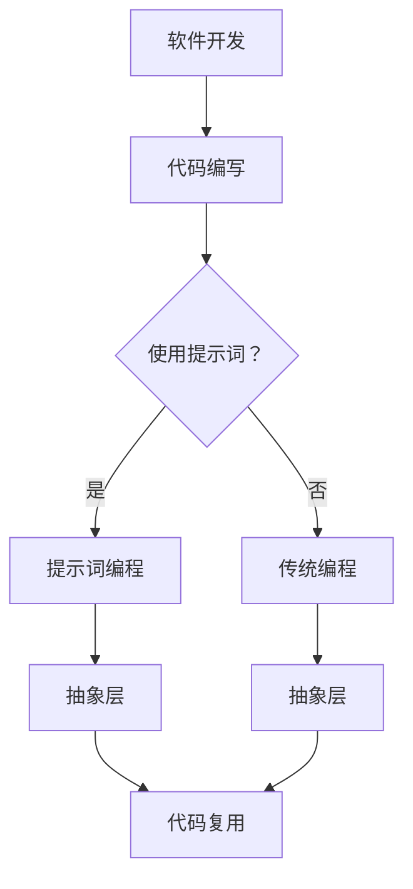
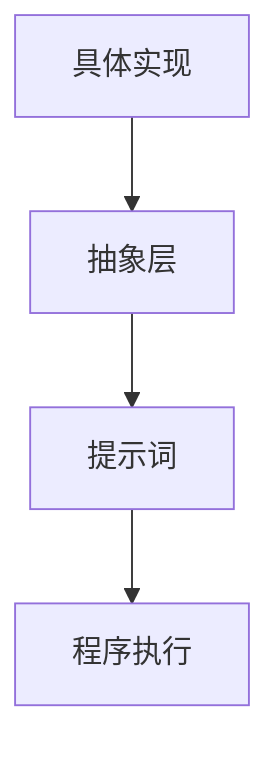
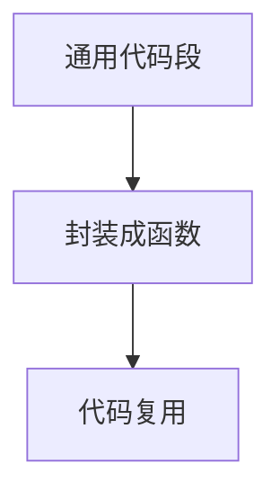
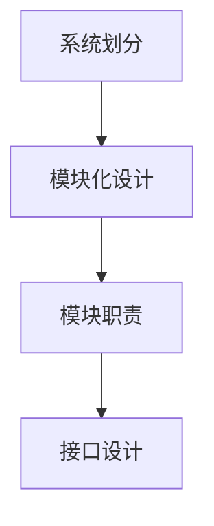

                 

### 文章标题：提示词编程的代码复用与模块化策略

## 关键词
- 提示词编程
- 代码复用
- 模块化设计
- 编程范式
- 抽象层
- 软件系统

## 摘要
本文探讨了提示词编程的概念、重要性以及其在代码复用和模块化设计中的应用。通过对提示词编程的基本原理、代码复用技术和模块化设计方法的深入分析，本文旨在为开发者提供一套有效的编程策略，以提升软件开发的效率和质量。

### 引言与概述

提示词编程是一种新兴的编程范式，其核心思想是通过使用提示词来引导程序的执行，从而提高代码的可复用性和模块化程度。在传统的编程中，开发者往往需要手动编写大量的代码来实现特定的功能，而提示词编程则通过提供一组提示词，让程序自动完成相应的任务，从而简化了开发过程。

#### 核心概念提取

- **提示词（Prompt）**：用于引导程序执行的关键词或短语，通常由字母、数字和特殊字符组成。
- **抽象层**：提示词编程通过抽象层将具体实现与高层设计分离，使得代码更加模块化和可复用。
- **代码复用**：通过将通用代码段封装成函数或模块，实现重复利用。
- **模块化设计**：将系统划分为独立的模块，每个模块具有明确的职责和接口。

#### Mermaid流程图



### 编程范式

提示词编程作为一种编程范式，有其独特的优势与挑战。下面将深入探讨提示词编程的基本原理、实现方法以及其在软件开发中的应用。

#### 核心概念与联系

- **提示词编程的基本原理**：提示词编程通过提示词将具体实现与高层抽象分离，使得开发者可以专注于系统设计，而无需关心底层实现细节。
- **抽象层的作用**：抽象层有助于提高代码的可复用性和模块化程度，使得代码更加灵活和易于维护。

#### Mermaid流程图



#### 核心算法原理讲解

提示词编程的核心算法原理可以概括为以下几点：

1. **提示词的选择**：选择合适的提示词是关键，提示词需要能够准确地引导程序执行。
2. **抽象层的构建**：通过构建抽象层，将具体实现与高层设计分离，使得代码更加模块化和可复用。
3. **程序执行**：程序根据提示词执行相应的操作，完成特定的任务。

伪代码：

```python
# 提示词编程伪代码
def execute_prompt(prompt):
    # 根据提示词执行相应的操作
    if prompt == "add":
        perform_addition()
    elif prompt == "subtract":
        perform_subtraction()
    # ... 其他提示词处理
```

### 代码复用技术

代码复用是软件开发中的重要原则，它有助于减少冗余代码，提高代码的可读性和可维护性。在提示词编程中，代码复用更加容易实现，因为提示词提供了明确的执行指导。

#### 核心概念与联系

- **代码复用**：通过将通用代码段封装成函数或模块，实现重复利用。
- **模块化设计**：将系统划分为独立的模块，每个模块具有明确的职责和接口。

#### Mermaid流程图



#### 核心算法原理讲解

代码复用的核心算法原理可以概括为以下几点：

1. **函数封装**：将通用代码段封装成函数，使得代码更加模块化和可复用。
2. **模块化设计**：通过模块化设计，将系统划分为独立的模块，每个模块具有明确的职责和接口。
3. **函数调用**：在需要使用通用代码段的地方，直接调用相应的函数，实现代码复用。

伪代码：

```python
# 代码复用伪代码
def calculate_area(radius):
    return 3.14 * radius * radius

def main():
    radius = input("请输入圆的半径：")
    area = calculate_area(radius)
    print("圆的面积是：", area)
```

### 模块化设计

模块化设计是软件开发中的重要原则，它有助于提高代码的可读性和可维护性。在提示词编程中，模块化设计更加容易实现，因为提示词提供了明确的执行指导。

#### 核心概念与联系

- **模块化设计**：将系统划分为独立的模块，每个模块具有明确的职责和接口。
- **模块化原则**：高内聚、低耦合。

#### Mermaid流程图



#### 核心算法原理讲解

模块化设计的核心算法原理可以概括为以下几点：

1. **系统划分**：将系统划分为独立的模块，每个模块具有明确的职责。
2. **模块职责**：确保每个模块只完成一项职责，提高代码的可读性和可维护性。
3. **接口设计**：设计清晰的接口，确保模块之间的高内聚和低耦合。

伪代码：

```python
# 模块化设计伪代码
class Circle:
    def __init__(self, radius):
        self.radius = radius
    
    def calculate_area(self):
        return 3.14 * self.radius * self.radius

class Rectangle:
    def __init__(self, width, height):
        self.width = width
        self.height = height
    
    def calculate_area(self):
        return self.width * self.height
```

### 实践案例

为了更好地理解提示词编程的代码复用和模块化设计，下面通过一个实际案例进行详细讲解。

#### 案例背景

假设我们正在开发一个在线商店系统，需要实现商品信息的添加、修改和查询功能。为了简化开发过程，我们可以采用提示词编程的方法，提高代码的可复用性和模块化程度。

#### 开发环境搭建

1. 创建一个Python虚拟环境：
   ```bash
   python -m venv venv
   ```
2. 激活虚拟环境：
   ```bash
   source venv/bin/activate
   ```
3. 安装所需的依赖库：
   ```bash
   pip install flask
   ```

#### 源代码实现

```python
# app.py
from flask import Flask, request, jsonify
from models import Circle, Rectangle

app = Flask(__name__)

@app.route('/add_circle', methods=['POST'])
def add_circle():
    radius = request.form['radius']
    circle = Circle(radius)
    circle.calculate_area()
    return jsonify({"status": "success", "message": "圆的信息添加成功"})

@app.route('/add_rectangle', methods=['POST'])
def add_rectangle():
    width = request.form['width']
    height = request.form['height']
    rectangle = Rectangle(width, height)
    rectangle.calculate_area()
    return jsonify({"status": "success", "message": "矩形的信息添加成功"})

if __name__ == '__main__':
    app.run(debug=True)
```

#### 代码解读与分析

1. **提示词编程的应用**：通过定义特定的URL路由，实现商品信息的添加功能。例如，通过`/add_circle`和`/add_rectangle`路由，分别添加圆和矩形的信息。
2. **代码复用的实现**：将商品信息的计算面积功能封装成独立的类和方法，实现代码复用。例如，`Circle`和`Rectangle`类分别实现了计算面积的方法。
3. **模块化设计**：将系统划分为多个模块，如路由模块、模型模块等，每个模块具有明确的职责和接口。

#### 案例分析与讲解

通过这个案例，我们可以看到提示词编程、代码复用和模块化设计在实际项目中的应用。以下是对每个部分的详细分析：

1. **提示词编程**：通过定义特定的URL路由，实现了商品信息的添加功能。这简化了开发过程，提高了代码的可维护性。
2. **代码复用**：通过将商品信息的计算面积功能封装成独立的类和方法，实现了代码复用。这减少了冗余代码，提高了代码的可读性和可维护性。
3. **模块化设计**：将系统划分为多个模块，如路由模块、模型模块等，每个模块具有明确的职责和接口。这提高了系统的可扩展性和可维护性。

#### 项目小结

通过这个案例，我们可以看到提示词编程、代码复用和模块化设计在软件开发中的应用。这些技术不仅提高了代码的可读性和可维护性，还提高了开发效率。在实际项目中，开发者可以根据需求灵活应用这些技术，实现高效、高质量的软件开发。

### 最佳实践 Tips、小结、注意事项、拓展阅读等内容

- **最佳实践 Tips**：在实际项目中，提示词编程、代码复用和模块化设计是非常重要的。开发者应该学会如何合理地应用这些技术，以提高开发效率和代码质量。
- **小结**：提示词编程、代码复用和模块化设计是软件开发中的重要原则。通过合理应用这些技术，可以简化开发过程，提高代码的可读性和可维护性。
- **注意事项**：在应用提示词编程、代码复用和模块化设计时，开发者需要注意以下几点：
  - 确保提示词的选择准确，能够引导程序执行。
  - 在模块化设计时，要确保模块之间的职责分离和接口清晰。
  - 在代码复用时，要确保代码的可读性和可维护性。
- **拓展阅读**：对于对提示词编程、代码复用和模块化设计感兴趣的读者，以下是一些拓展阅读建议：
  - 《Zen And The Art of Computer Programming》（《禅与计算机程序设计艺术》）—— Donald E. Knuth
  - 《Clean Code: A Handbook of Agile Software Craftsmanship》（《整洁代码：敏捷软件开发的手册》）—— Robert C. Martin
  - 《Design Patterns: Elements of Reusable Object-Oriented Software》（《设计模式：可复用面向对象软件元素》）—— Erich Gamma、Richard Helm、Ralph Johnson、John Vlissides

### 作者信息

作者：AI天才研究院/AI Genius Institute & 禅与计算机程序设计艺术 /Zen And The Art of Computer Programming

### 结束语

本文介绍了提示词编程的代码复用与模块化策略，通过深入分析编程范式、代码复用技术、模块化设计方法以及实际案例，展示了这些技术在软件开发中的应用。希望本文能为开发者提供有价值的参考和启示，助力高效、高质量的软件开发。

