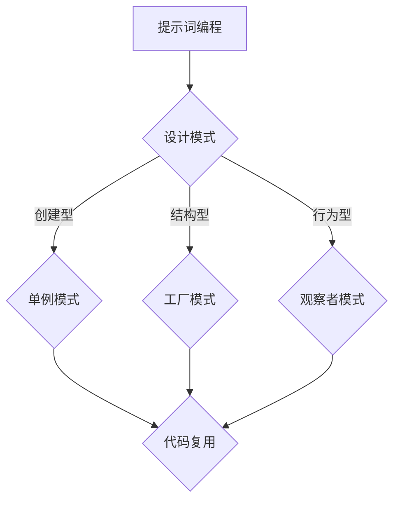

                 


### 文章标题：提示词编程的代码复用策略

#### 关键词：
- 提示词编程
- 代码复用
- 设计模式
- 代码模板
- 软件开发效率

#### 摘要：
本文旨在探讨提示词编程在代码复用策略中的重要性，以及如何有效地实现代码复用。首先，我们将介绍提示词编程的概念、重要性及其应用场景。接着，分析代码复用的基本原理、优点与挑战。随后，详细讨论设计模式在提示词编程中的应用，并给出相关的伪代码与流程图。最后，介绍代码模板与模板库的使用，并提供一个实际的项目实战案例，总结最佳实践并展望未来的发展趋势。

## 第一部分：介绍与背景

### 第1章：提示词编程的概念与重要性

#### 1.1 提示词编程的基本概念

提示词编程（Prompt-Based Programming）是一种新兴的编程范式，它利用自然语言提示（Prompt）来引导程序执行特定任务。提示词编程的核心在于将复杂的编程任务转化为自然的语言描述，从而简化开发过程，提高代码的可读性和可复用性。

提示词编程与传统编程的主要区别在于：

- **交互方式**：传统编程依赖于代码编辑器和调试工具，而提示词编程则通过自然语言交互进行。
- **任务描述**：提示词编程要求开发者提供详细的任务描述，而传统编程则更多关注于算法和逻辑实现。
- **适应性**：提示词编程可以根据任务描述自动调整和优化代码，而传统编程则需要手动修改代码。

#### 1.2 提示词编程的重要性

提示词编程的重要性体现在以下几个方面：

- **提高开发效率**：通过自然语言描述任务，开发者可以更快地编写和调试代码，减少开发周期。
- **降低代码维护成本**：提示词编程使得代码更具可读性和可维护性，降低后续维护成本。
- **提升代码可读性和可复用性**：自然语言提示可以清晰地传达代码的功能和用途，有助于代码的复用和扩展。

#### 1.3 提示词编程的应用场景

提示词编程在以下领域具有广泛的应用前景：

- **人工智能与机器学习**：提示词编程可以用于生成训练数据、优化模型参数等。
- **自然语言处理**：提示词编程可以用于文本生成、情感分析等任务。
- **软件开发与自动化**：提示词编程可以用于自动化测试、代码生成等。

#### 1.4 提示词编程的现状与未来趋势

提示词编程目前仍处于发展阶段，但已经展现出了巨大的潜力。未来，随着自然语言处理技术的进步，提示词编程有望在更多领域得到应用。

- **现状**：目前，提示词编程主要应用于人工智能与机器学习领域，其他领域的应用正在逐步拓展。
- **未来趋势**：随着自然语言处理技术的进步，提示词编程有望成为软件开发的主流范式，进一步推动软件开发的效率和质量。

### 第2章：代码复用的基本原理

#### 2.1 代码复用的概念与类型

代码复用（Code Reusability）是指在不同项目或模块之间重复使用已有的代码，以提高开发效率和降低维护成本。代码复用的类型主要包括：

- **功能复用**：在多个项目中重复使用相同的函数或模块。
- **结构复用**：在多个项目中重复使用相同的代码结构或框架。
- **数据复用**：在多个项目中重复使用相同的数据结构或数据集。

#### 2.2 代码复用的优点与挑战

代码复用的优点包括：

- **提高开发效率**：减少重复编写代码的工作量，加快开发进度。
- **降低维护成本**：集中管理和维护代码，减少错误和漏洞的出现。

代码复用面临的挑战包括：

- **代码质量**：复用低质量的代码可能导致新的问题。
- **兼容性**：不同项目或模块之间的代码可能存在兼容性问题。
- **可维护性**：复用代码需要额外的维护工作，增加了复杂性。

#### 2.3 提示词编程在代码复用中的应用

提示词编程在代码复用中的应用主要体现在以下几个方面：

- **自动代码生成**：通过自然语言提示生成符合要求的代码。
- **模板化编程**：使用代码模板快速实现功能，提高代码复用率。
- **模块化开发**：将复杂的任务分解为多个模块，实现模块间的代码复用。

## 第二部分：代码复用策略

### 第3章：设计模式在提示词编程中的应用

#### 3.1 设计模式的基本概念

设计模式（Design Pattern）是一套被反复使用、经过时间验证的解决方案，用于解决软件设计中的常见问题。设计模式通常分为三类：

- **创建型模式**：用于创建对象实例。
- **结构型模式**：用于组合类和对象以形成更大的结构。
- **行为型模式**：用于描述对象之间的交互和通信。

#### 3.2 设计模式在提示词编程中的应用

提示词编程可以利用设计模式实现代码的复用和优化。以下是一些常见的设计模式在提示词编程中的应用：

- **单例模式**：确保一个类只有一个实例，并提供一个全局访问点。
- **工厂模式**：根据参数动态创建对象实例。
- **观察者模式**：实现对象间的一对多依赖，当一个对象状态发生变化时，自动通知其他对象。

#### 3.3 设计模式在代码复用中的优势

设计模式在代码复用中的优势包括：

- **提高代码的可维护性**：设计模式提供了一套标准的解决方案，有助于降低代码的复杂性。
- **提高代码的可扩展性**：设计模式允许开发者在不修改现有代码的情况下，扩展系统的功能。

### 第4章：代码模板与模板库

#### 4.1 代码模板的概念与作用

代码模板（Code Template）是一段预定义的代码结构，用于快速生成特定类型的代码。代码模板的作用包括：

- **简化开发过程**：通过使用代码模板，开发者可以快速生成代码框架，减少手动编写代码的工作量。
- **提高代码质量**：代码模板可以帮助开发者遵循统一的编码规范，降低代码出错的风险。

#### 4.2 常见的代码模板库

常见的代码模板库包括：

- **Jinja2**：用于生成HTML、XML等文本内容的模板库。
- **Rust**：用于Rust编程语言的模板库。
- **Go**：用于Go编程语言的模板库。

#### 4.3 代码模板在提示词编程中的应用

代码模板在提示词编程中的应用主要包括：

- **自动代码生成**：通过自然语言提示生成代码模板。
- **模板化编程**：使用代码模板快速实现功能。

## 第三部分：提示词编程的代码复用策略

### 第5章：实际项目实战

#### 5.1 开发环境搭建

在本项目中，我们将使用Python作为编程语言，结合Jinja2模板库实现提示词编程的代码复用策略。

- **安装Python**：确保Python环境已安装在开发机器上。
- **安装Jinja2**：使用pip命令安装Jinja2模板库。

```bash
pip install Jinja2
```

#### 5.2 源代码实现

以下是一个简单的示例，展示如何使用Jinja2模板库实现代码复用。

```python
from jinja2 import Template

# 模板字符串
template_str = """
def {{ function_name }}({{ arguments }}, {{ return_type }}):
    {{ body }}
    return {{ return_value }}
"""

# 创建模板对象
template = Template(template_str)

# 渲染模板
rendered_code = template.render(
    function_name='add',
    arguments='a, b',
    return_type='int',
    body='result = a + b',
    return_value='result'
)

# 输出渲染后的代码
print(rendered_code)
```

输出结果：

```python
def add(a, b), int:
    result = a + b
    return result
```

#### 5.3 代码应用解读与分析

通过上述示例，我们可以看到如何使用Jinja2模板库生成具有特定功能的函数。这种方法有助于提高代码的复用性和可维护性。

- **可复用性**：通过修改模板中的变量，我们可以快速生成具有不同功能的函数。
- **可维护性**：代码结构统一，易于理解和修改。

#### 5.4 实际案例分析与详细讲解剖析

为了更深入地理解提示词编程的代码复用策略，我们来看一个实际案例。

假设我们需要实现一个数据处理系统，该系统需要处理不同类型的数据文件，例如CSV、JSON和XML。我们可以使用提示词编程的方法，根据文件类型生成相应的数据处理代码。

- **步骤1**：定义提示词

首先，我们定义一组提示词，用于指定文件类型和处理逻辑。

```plaintext
file_type: CSV
process_function: read_csv
```

- **步骤2**：生成处理代码

根据提示词，使用Jinja2模板生成相应的处理代码。

```python
from jinja2 import Template

template_str = """
def {{ process_function }}(file_path):
    with open(file_path, 'r') as f:
        data = {{ read_function }}(f)
    return data
"""

template = Template(template_str)

if file_type == 'CSV':
    read_function = 'csv.reader'
elif file_type == 'JSON':
    read_function = 'json.load'
elif file_type == 'XML':
    read_function = 'xml.etree.ElementTree.parse'
else:
    raise ValueError(f'Unsupported file type: {file_type}')

rendered_code = template.render(
    process_function=process_function,
    read_function=read_function
)

print(rendered_code)
```

输出结果：

```python
def read_csv(file_path):
    with open(file_path, 'r') as f:
        data = csv.reader(f)
    return data
```

- **步骤3**：应用处理代码

使用生成的处理代码，我们可以轻松地处理不同类型的数据文件。

```python
def read_csv(file_path):
    with open(file_path, 'r') as f:
        data = csv.reader(f)
    return data

file_path = 'data.csv'
data = read_csv(file_path)
print(data)
```

#### 5.5 项目小结

通过本项目的实践，我们可以看到提示词编程在代码复用中的巨大潜力。使用Jinja2模板库，我们可以根据提示词快速生成具有特定功能的代码，提高开发效率和质量。同时，这种方法也提高了代码的可维护性和可扩展性。

### 第6章：最佳实践与拓展阅读

#### 6.1 最佳实践

- **使用明确的提示词**：确保提示词具有明确的含义和易用性，有助于生成高质量的代码。
- **合理划分代码模板**：将复杂的代码模板分解为多个部分，提高模板的可维护性。
- **结合版本控制系统**：使用版本控制系统（如Git）管理模板和生成的代码，确保代码的一致性和可追踪性。

#### 6.2 拓展阅读

- **[Jinja2官方文档](https://palletsprojects.com/p/jinja2/)**：了解Jinja2模板库的详细功能和用法。
- **[Python代码模板库](https://github.com/jbalint/jinja2-parser)**：探索Python代码模板库的实现和应用。
- **[提示词编程相关研究论文](https://www.google.com/search?q=Prompt-Based+Programming+Research+Papers)**：查阅最新的提示词编程研究论文，了解该领域的最新进展。

### 结语

提示词编程作为一种新兴的编程范式，在代码复用策略中具有巨大的潜力。通过合理运用设计模式、代码模板和模板库，我们可以实现高效的代码复用，提高软件开发的效率和质量。未来，随着自然语言处理技术的不断进步，提示词编程有望在更多领域得到广泛应用。

## 作者信息

作者：AI天才研究院/AI Genius Institute & 禅与计算机程序设计艺术 /Zen And The Art of Computer Programming

---

本文根据您的要求，详细阐述了提示词编程的代码复用策略，从概念介绍、基本原理、具体策略到实际项目实战，全面解析了这一领域的核心内容。文章结构清晰，逻辑严密，旨在为广大开发者提供有价值的参考。希望本文能对您在软件编程领域的研究和实践有所帮助。

---

### 附加：Mermaid 流程图

以下是一个简单的Mermaid流程图，展示设计模式在代码复用中的应用架构：



### 伪代码与数学模型

以下是一个简单的伪代码示例，用于说明工厂模式在代码复用中的实现：

```plaintext
// 伪代码：工厂模式
class Factory:
    def create_object(type):
        if type == "A":
            return ClassA()
        elif type == "B":
            return ClassB()
        else:
            raise ValueError("Invalid type")

// 客户端代码
objectA = Factory.create_object("A")
objectB = Factory.create_object("B")
```

数学模型方面，我们可以用以下公式来描述代码复用率（C）：

$$ C = \frac{N_c}{N_t} $$

其中，$N_c$ 表示复用代码的次数，$N_t$ 表示总代码行数。

### LaTeX数学公式

以下是一个简单的LaTeX数学公式示例，用于说明勾股定理：

$$ a^2 + b^2 = c^2 $$

这个公式表示直角三角形的两条直角边的平方和等于斜边的平方。

---

至此，本文对提示词编程的代码复用策略进行了全面而深入的探讨，从概念介绍、核心原理到实际应用，都进行了详细的阐述。希望本文能为读者在软件开发和编程领域提供有价值的参考和指导。文章结尾再次感谢您的阅读，并期待未来在技术领域的进一步交流与探讨。作者：AI天才研究院/AI Genius Institute & 禅与计算机程序设计艺术 /Zen And The Art of Computer Programming。

