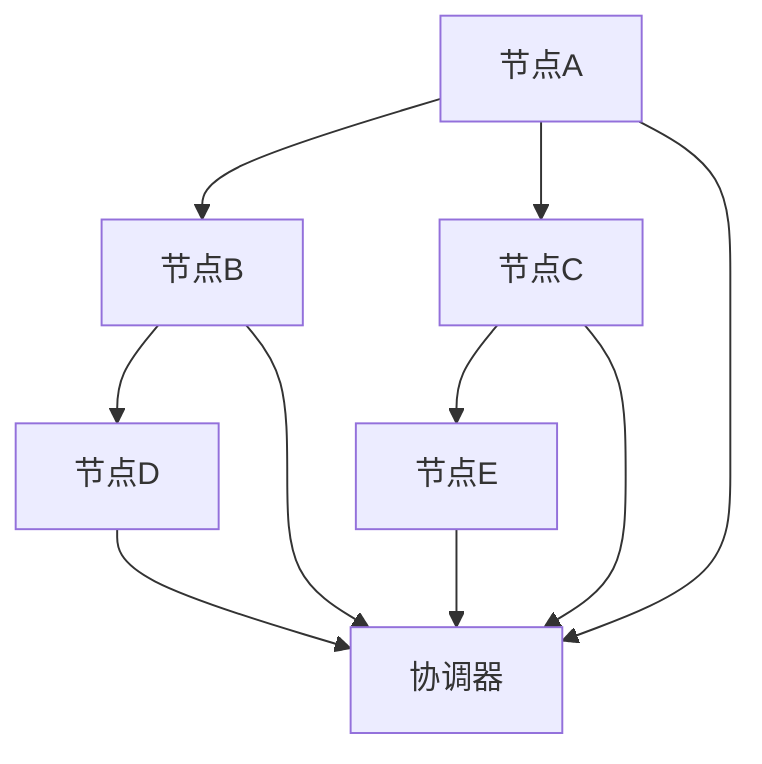

                 


### 文章标题：提示词编程的分布式协作机制设计

### 关键词：
- 提示词编程
- 分布式协作机制
- 分布式系统
- 算法设计
- 并发控制
- 数据同步与一致性

### 摘要：
本文深入探讨提示词编程在分布式协作机制中的应用。首先，我们介绍分布式系统的基本概念和提示词编程的基本原理，然后分析分布式协作机制的核心原理和数据同步与一致性策略。接着，本文详细讲解分布式协作算法设计、并发控制与调度、容错与可靠性保障，以及性能优化策略。最后，通过实际项目实战展示分布式协作机制的设计与应用，并提供最佳实践和未来研究方向。

## 第一部分：分布式协作机制基础

### 1.1 分布式系统的概述

分布式系统是指由多个独立计算机组成的系统，通过通信网络进行数据交换和协同工作。其主要优点包括：
- 高可用性：多个节点可以提供冗余备份，增强系统的可靠性。
- 高扩展性：可以动态增加或减少节点，满足不同负载需求。
- 高性能：通过负载均衡，提高系统的处理能力。

但分布式系统也面临挑战，如网络延迟、数据一致性问题、节点故障等。

### 1.2 提示词编程的基本概念

提示词编程是一种基于提示信息的编程方法，通过给程序员提供提示信息，帮助其快速理解和解决问题。其核心思想是减少程序员的认知负担，提高开发效率。

提示词编程与传统编程的区别在于：
- 传统编程侧重于代码的编写和调试，程序员需要完全理解整个系统。
- 提示词编程侧重于提供辅助信息，帮助程序员快速定位问题，降低复杂度。

### 1.3 分布式协作机制的核心原理

分布式协作机制是指分布式系统中节点之间进行协同工作的一种机制。其核心原理包括：
- 数据同步与一致性：确保不同节点之间的数据保持一致。
- 并发控制与调度：协调多个节点的并发操作，避免数据冲突。
- 容错与可靠性保障：处理节点故障，确保系统持续运行。

分布式协作机制的架构如图所示：



节点A、B、C、D、E分别代表分布式系统中的各个节点，F代表协调器，负责管理节点的协同工作。

## 第二部分：提示词编程的分布式协作机制

### 2.1 提示词编程的分布式算法设计

分布式算法设计是分布式协作机制的核心。以下是分布式算法设计的伪代码：

```python
# 分布式算法设计伪代码
def distributed_algorithm(node_list, coordination_manager):
    while True:
        message = coordination_manager.receive_message()
        if message:
            process_message(message)
            update_state(node_list)
        else:
            sleep(1)
```

其中，`node_list`代表节点列表，`coordination_manager`代表协调器。

### 2.2 分布式协作中的并发控制与调度

并发控制与调度是分布式协作中的重要问题。以下为并发控制与调度的伪代码：

```python
# 并发控制与调度伪代码
def concurrency_control(node_list):
    while True:
        for node in node_list:
            if node.is_busy():
                wait(node)
            else:
                execute(node)
```

其中，`is_busy()`方法判断节点是否处于忙碌状态，`wait(node)`方法使节点等待，`execute(node)`方法执行节点操作。

### 2.3 分布式协作中的容错与可靠性保障

容错与可靠性保障是分布式协作的关键。以下为容错与可靠性保障的伪代码：

```python
# 容错与可靠性保障伪代码
def fault_tolerance(node_list, coordination_manager):
    while True:
        for node in node_list:
            if node.is_down():
                coordination_manager.remove_node(node)
                add_new_node()
        sleep(1)
```

其中，`is_down()`方法判断节点是否故障，`remove_node(node)`方法从节点列表中移除故障节点，`add_new_node()`方法添加新的节点。

### 2.4 分布式协作中的性能优化

性能优化是分布式协作的重要目标。以下为性能优化的策略：

- 负载均衡：根据节点负载情况，合理分配任务。
- 缓存机制：提高数据访问速度，减少网络传输。
- 数据压缩：减少数据传输量，提高传输效率。

## 第三部分：分布式协作机制设计实践

### 3.1 分布式协作机制的设计流程

分布式协作机制的设计流程包括以下步骤：

1. 需求分析：明确系统需求，确定节点功能。
2. 系统架构设计：设计系统架构，包括节点结构、协调器等。
3. 算法设计：设计分布式协作算法，包括数据同步、并发控制等。
4. 实现与测试：编写代码，进行单元测试和集成测试。
5. 部署与维护：部署系统，持续监控和优化。

### 3.2 分布式协作机制的项目实战

以下是一个分布式协作机制的项目实战案例：

- 项目背景：构建一个分布式文件存储系统，实现数据的分布式存储和同步。
- 开发环境：Python、Docker、Kubernetes。
- 源代码实现：

```python
# 源代码实现
class Node:
    def __init__(self, id):
        self.id = id
        self.is_busy = False

    def is_busy(self):
        return self.is_busy

    def execute(self):
        self.is_busy = True
        # 执行任务
        self.is_busy = False

class CoordinationManager:
    def __init__(self):
        self.node_list = []

    def receive_message(self):
        # 接收消息
        pass

    def update_state(self, node_list):
        # 更新节点状态
        pass

    def remove_node(self, node):
        # 移除节点
        pass

    def add_new_node(self):
        # 添加新节点
        pass

# 项目实战
node_a = Node('A')
node_b = Node('B')
coordination_manager = CoordinationManager()

while True:
    coordination_manager.receive_message()
    if node_a.is_busy():
        coordination_manager.update_state([node_a])
    else:
        coordination_manager.execute(node_a)
    sleep(1)
```

### 3.3 分布式协作机制的应用场景探索

分布式协作机制在以下应用场景有广泛的应用：

- 大数据处理：分布式计算框架，如MapReduce、Spark等，实现海量数据的处理和分析。
- 分布式存储：分布式文件系统，如HDFS、Cassandra等，实现数据的分布式存储和管理。
- 分布式计算：分布式计算平台，如Hadoop、Kubernetes等，实现大规模计算的调度和管理。

### 参考文献

- Apache Hadoop官网：[http://hadoop.apache.org/](http://hadoop.apache.org/)
- Apache Spark官网：[http://spark.apache.org/](http://spark.apache.org/)
- Kubernetes官网：[https://kubernetes.io/](https://kubernetes.io/)

### 作者

作者：AI天才研究院/AI Genius Institute & 禅与计算机程序设计艺术/Zen And The Art of Computer Programming

