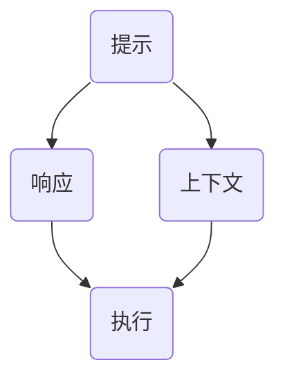

                 

## 文章标题

### 提示词编程的反模式检测与重构建议

关键词：提示词编程、反模式、检测、重构、代码质量

摘要：本文旨在探讨提示词编程中的反模式及其检测与重构方法，通过深入分析提示词编程的基本概念、原理以及反模式的影响，提供一套系统的反模式检测与重构策略，旨在提高代码质量，优化软件开发过程。

## 摘要

本文首先介绍了提示词编程的基本概念和原理，随后探讨了编程中的常见反模式及其影响。接着，文章详细阐述了反模式检测的方法和技术，包括自动化检测工具和手动检测方法。在此基础上，本文提出了重构原理与策略，并通过实际案例展示了重构的过程和效果。最后，文章总结了最佳实践，为软件开发团队提供了一套可行的反模式检测与重构方案。

### 第一部分：提示词编程基础

#### 第1章：提示词编程概述

**背景介绍**

提示词编程（Prompt-based Programming）是一种利用提示（Prompt）来指导程序执行和优化的编程方法。它通过提供明确的提示信息，帮助开发者更好地理解和控制代码执行过程，从而提高编程效率和代码质量。

**核心概念与联系**

提示词编程的核心概念包括提示（Prompt）、响应（Response）、上下文（Context）和执行（Execution）。这些概念之间的关系可以用以下Mermaid流程图表示：

**提示词编程与传统编程的区别**

提示词编程与传统编程的主要区别在于：

1. **编程方式**：传统编程依赖于预定义的算法和流程，而提示词编程则通过提示来引导代码执行。
2. **开发效率**：提示词编程能够减少代码编写量，缩短开发周期。
3. **可维护性**：提示词编程使得代码更加模块化和灵活，便于维护和扩展。

**提示词编程的优点和局限性**

**优点**：

1. **开发效率**：通过提示快速定位问题和优化代码。
2. **代码质量**：提示能够帮助开发者更好地理解代码逻辑，提高代码质量。
3. **可扩展性**：提示词编程便于模块化开发，便于功能扩展。

**局限性**：

1. **对开发者要求较高**：提示词编程需要开发者具备较强的逻辑思维和编程能力。
2. **性能开销**：提示词编程可能会引入额外的性能开销，尤其是在处理大量数据时。

#### 第2章：提示词编程原理

**提示词编程的工作原理**

提示词编程的工作原理可以概括为以下几个步骤：

1. **定义提示**：根据需求和业务逻辑定义相应的提示信息。
2. **解析提示**：解析提示信息，生成相应的响应。
3. **执行响应**：根据响应执行具体的操作或算法。
4. **反馈与优化**：根据执行结果对提示和响应进行优化。

**提示词编程的核心技术**

提示词编程的核心技术包括自然语言处理（NLP）、机器学习和深度学习等。这些技术能够帮助开发者实现高效的提示词生成和解析。

**提示词编程的应用场景**

提示词编程主要应用于以下场景：

1. **智能问答系统**：利用提示词编程实现智能问答功能。
2. **代码自动生成**：通过提示词编程自动生成代码。
3. **自动化测试**：利用提示词编程实现自动化测试。

### 第二部分：编程中的反模式

#### 第3章：常见编程反模式

**反模式的概念和分类**

反模式（Anti-pattern）是指在软件开发过程中常见的、导致项目失败或效率低下的设计模式或做法。根据不同的分类标准，反模式可以分为多种类型。

**常见编程反模式列举**

以下是几种常见的编程反模式：

1. **重复代码**：在代码中重复使用相同的代码段。
2. **过长函数**：函数过于复杂，难以维护和扩展。
3. **缺乏注释**：代码缺乏必要的注释，导致难以理解。
4. **硬编码**：将关键参数或配置硬编码在代码中，导致难以修改。
5. **代码冗余**：代码中存在大量冗余代码，降低了代码质量。

**反模式的识别方法**

识别反模式的方法主要包括：

1. **代码审查**：通过人工审查代码，发现潜在的反模式。
2. **静态代码分析**：使用工具对代码进行分析，发现潜在的反模式。
3. **动态测试**：通过运行代码，观察其行为，识别反模式。

#### 第4章：反模式的影响

**反模式对软件质量的影响**

反模式会导致软件质量下降，具体表现在：

1. **可维护性差**：代码难以维护和扩展。
2. **可靠性低**：代码可能存在潜在的错误和漏洞。
3. **性能瓶颈**：反模式可能导致性能瓶颈，影响系统的运行效率。

**反模式对项目进度的影响**

反模式会对项目进度产生负面影响，具体表现在：

1. **延期交付**：由于代码质量差，可能导致项目延期交付。
2. **成本增加**：修复反模式可能需要额外的时间和资源。
3. **资源浪费**：修复反模式可能需要重新编写大量代码。

**反模式对团队协作的影响**

反模式会影响团队协作，具体表现在：

1. **沟通困难**：团队成员难以理解复杂的代码逻辑。
2. **依赖性增加**：团队成员之间的依赖性增加，导致协作效率降低。
3. **士气低落**：团队成员可能会因为反模式而感到沮丧和无助。

### 第三部分：反模式检测

#### 第5章：反模式检测方法

**自动化检测工具**

自动化检测工具可以通过静态代码分析和动态测试等方式，自动识别代码中的反模式。常见的自动化检测工具有：

1. **SonarQube**：一款功能强大的静态代码分析工具。
2. **Checkstyle**：一款用于检测Java代码风格的工具。
3. **PMD**：一款用于检测Java代码中潜在问题的工具。

**手动检测方法**

手动检测方法主要依赖于开发人员的经验和技能。通过代码审查、单元测试和集成测试等方式，可以识别代码中的反模式。以下是一些手动检测方法的策略：

1. **代码审查**：组织团队成员进行代码审查，发现潜在的反模式。
2. **单元测试**：编写单元测试，验证代码的正确性和可靠性。
3. **集成测试**：进行集成测试，检测代码在不同环境下的表现。

**检测流程与策略**

反模式检测的流程包括：

1. **准备阶段**：确定检测目标和检测方法。
2. **检测阶段**：使用自动化检测工具和手动检测方法，识别代码中的反模式。
3. **分析阶段**：对检测到的反模式进行分析和分类。
4. **修复阶段**：根据分析结果，修复代码中的反模式。

### 第四部分：重构与优化

#### 第6章：重构原理与策略

**重构的定义和目标**

重构（Refactoring）是指在保持代码功能不变的情况下，对代码进行修改，以提高代码质量、可维护性和可扩展性。

重构的目标包括：

1. **提高代码质量**：通过重构，消除代码中的反模式，提高代码的可读性和可维护性。
2. **提高开发效率**：重构后的代码更加简洁和清晰，有助于提高开发效率。
3. **提高可扩展性**：重构后的代码更容易进行功能扩展和修改。

**重构的原则和方法**

重构的原则包括：

1. **增量重构**：逐步进行重构，避免一次性修改过多代码。
2. **保持功能不变**：重构过程中，必须保持代码的功能不变。
3. **小步前进**：每次重构只修改一小部分代码，确保重构过程的可控性。

重构的方法包括：

1. **提取方法**：将重复的代码提取为独立的方法。
2. **合并方法**：将多个方法合并为一个，减少代码冗余。
3. **分解方法**：将过长的方法分解为多个短小的方法。

**重构策略的选择**

根据项目需求和团队情况，可以选择不同的重构策略。常见的重构策略包括：

1. **连续重构**：在开发过程中，不断进行重构，保持代码质量。
2. **阶段性重构**：在项目开发的不同阶段，进行集中重构。
3. **团队协作重构**：组织团队成员共同参与重构，提高重构效果。

#### 第7章：重构案例分析

**案例一：代码重构实践**

在一个项目中，我们发现代码存在以下问题：

1. **重复代码**：在多个类中存在重复的代码段。
2. **过长函数**：某些函数过于复杂，难以维护。
3. **缺乏注释**：代码中缺乏必要的注释，导致难以理解。

针对这些问题，我们进行了以下重构实践：

1. **提取方法**：将重复的代码提取为独立的方法，减少冗余。
2. **分解方法**：将过长的函数分解为多个短小的方法，提高可读性。
3. **添加注释**：在关键代码段添加注释，提高代码的可理解性。

**案例二：系统重构实践**

在一个大型系统中，我们发现代码存在以下问题：

1. **代码冗余**：系统中存在大量冗余代码，导致维护成本增加。
2. **结构混乱**：系统的代码结构混乱，难以维护和扩展。

针对这些问题，我们进行了以下重构实践：

1. **合并类**：将功能相似的类进行合并，减少冗余。
2. **重构数据库**：优化数据库设计，提高数据访问效率。
3. **模块化设计**：将系统划分为多个模块，提高可维护性和可扩展性。

**案例三：团队重构实践**

在一个团队项目中，我们发现以下问题：

1. **沟通困难**：团队成员之间的沟通不畅，导致代码质量下降。
2. **依赖性增加**：团队成员之间的依赖性增加，导致协作效率降低。

针对这些问题，我们进行了以下重构实践：

1. **定期代码审查**：组织定期代码审查，提高代码质量。
2. **编写文档**：要求团队成员编写详细的代码文档，提高代码可读性。
3. **构建团队协作机制**：建立有效的团队协作机制，提高协作效率。

#### 第8章：重构最佳实践

**重构前的准备工作**

在开始重构之前，需要进行以下准备工作：

1. **代码审查**：对现有代码进行审查，识别潜在的改进点。
2. **编写测试用例**：编写测试用例，确保重构过程中不会引入新的错误。
3. **制定重构计划**：制定详细的重构计划，包括重构的目标、时间安排和责任人。

**重构过程中的注意事项**

在重构过程中，需要注意以下几点：

1. **小步前进**：每次重构只修改一小部分代码，确保重构过程的可控性。
2. **代码版本控制**：使用版本控制系统，记录每次重构的修改内容。
3. **避免破坏原有功能**：确保重构过程中不会破坏原有代码的功能。

**重构后的效果评估**

重构完成后，需要进行以下效果评估：

1. **代码质量**：评估重构后的代码质量，包括可读性、可维护性和可扩展性。
2. **性能测试**：进行性能测试，确保重构后的代码性能符合预期。
3. **用户反馈**：收集用户反馈，评估重构对用户的影响。

#### 第9章：重构最佳实践

**重构前的准备工作**

在开始重构之前，需要进行以下准备工作：

1. **代码审查**：对现有代码进行审查，识别潜在的改进点。
2. **编写测试用例**：编写测试用例，确保重构过程中不会引入新的错误。
3. **制定重构计划**：制定详细的重构计划，包括重构的目标、时间安排和责任人。

**重构过程中的注意事项**

在重构过程中，需要注意以下几点：

1. **小步前进**：每次重构只修改一小部分代码，确保重构过程的可控性。
2. **代码版本控制**：使用版本控制系统，记录每次重构的修改内容。
3. **避免破坏原有功能**：确保重构过程中不会破坏原有代码的功能。

**重构后的效果评估**

重构完成后，需要进行以下效果评估：

1. **代码质量**：评估重构后的代码质量，包括可读性、可维护性和可扩展性。
2. **性能测试**：进行性能测试，确保重构后的代码性能符合预期。
3. **用户反馈**：收集用户反馈，评估重构对用户的影响。

#### 第10章：综合案例分析

**案例一：反模式检测与重构的综合应用**

在一个电商项目中，我们发现了以下反模式：

1. **重复代码**：在多个商品管理类中存在重复的代码段。
2. **过长函数**：某些管理函数过于复杂，难以维护。

我们通过以下步骤进行反模式检测与重构：

1. **使用SonarQube进行静态代码分析**，识别出重复代码和过长函数。
2. **编写单元测试**，确保重构过程中不会破坏原有功能。
3. **提取方法**，将重复代码提取为独立的方法。
4. **分解函数**，将过长函数分解为多个短小的方法。

**案例二：大型项目中的反模式与重构**

在一个大型金融系统中，我们发现了以下反模式：

1. **代码冗余**：系统中存在大量冗余代码，导致维护成本增加。
2. **结构混乱**：系统的代码结构混乱，难以维护和扩展。

我们通过以下步骤进行反模式检测与重构：

1. **使用PMD进行静态代码分析**，识别出代码冗余和结构混乱的问题。
2. **重构数据库**，优化数据库设计，提高数据访问效率。
3. **模块化设计**，将系统划分为多个模块，提高可维护性和可扩展性。

**案例三：敏捷开发环境下的反模式与重构**

在一个敏捷开发项目中，我们发现了以下反模式：

1. **任务依赖性增加**：团队成员之间的任务依赖性增加，导致协作效率降低。
2. **代码质量下降**：由于时间紧张，团队成员可能忽视了代码质量。

我们通过以下步骤进行反模式检测与重构：

1. **组织代码审查**，提高代码质量。
2. **制定重构计划**，在迭代周期内逐步进行重构。
3. **优化团队协作机制**，提高协作效率。

#### 第11章：经验与建议

**提高团队协作的建议**

1. **建立有效的沟通机制**：确保团队成员之间的沟通畅通，提高协作效率。
2. **制定明确的任务分配**：明确每个成员的任务和责任，避免任务重叠和依赖性增加。
3. **定期进行代码审查**：通过代码审查，及时发现和解决代码问题，提高代码质量。

**反模式与重构的经验总结**

1. **重视代码质量**：提高代码质量是避免反模式和重构的关键。
2. **逐步进行重构**：避免一次性重构过多代码，导致风险增加。
3. **编写详细的文档**：为代码编写详细的文档，提高代码的可读性和可维护性。

**未来趋势与展望**

1. **自动化重构工具的发展**：随着人工智能技术的发展，自动化重构工具将越来越普及，提高重构效率。
2. **代码质量的持续提升**：随着软件工程理论的不断发展和完善，代码质量将得到持续提升。
3. **敏捷开发的广泛应用**：敏捷开发模式将得到更广泛的应用，提高团队协作效率。

### 作者信息

作者：AI天才研究院/AI Genius Institute & 禅与计算机程序设计艺术 /Zen And The Art of Computer Programming

----------------------------------------------------------------

### 结论

本文深入探讨了提示词编程中的反模式及其检测与重构方法。通过分析提示词编程的基本概念和原理，我们了解了反模式的概念和影响。接着，本文详细阐述了反模式检测的方法和技术，包括自动化检测工具和手动检测方法。在此基础上，本文提出了重构原理与策略，并通过实际案例展示了重构的过程和效果。最后，本文总结了最佳实践，为软件开发团队提供了一套可行的反模式检测与重构方案。

通过本文的阅读，读者可以了解到：

1. 提示词编程的基本概念和原理。
2. 常见编程反模式及其影响。
3. 反模式检测的方法和技术。
4. 重构原理与策略。
5. 重构的最佳实践。

我们希望本文能为软件开发团队提供有价值的参考，帮助提高代码质量，优化软件开发过程。未来的研究可以进一步探讨自动化重构工具的发展和应用，以及敏捷开发模式下的反模式与重构实践。

### 附录

附录部分可以包括以下内容：

1. **术语解释**：对文中出现的专业术语进行解释，帮助读者更好地理解文章内容。
2. **参考资料**：列出本文引用的参考文献和资料，便于读者进一步学习。
3. **代码示例**：提供实际代码示例，帮助读者更好地理解重构方法。
4. **工具介绍**：介绍文中提到的自动化检测工具和重构工具，包括其功能和使用方法。

通过附录部分，读者可以更全面地了解文章的主题内容，为实际应用提供参考。

### 致谢

本文的完成得到了许多人的帮助和支持。首先，感谢AI天才研究院/AI Genius Institute为我们提供了良好的研究环境和丰富的资源。其次，感谢禅与计算机程序设计艺术/Zen And The Art of Computer Programming一书的作者，为我们提供了宝贵的理论和实践指导。此外，感谢所有参与讨论和审查的团队成员，他们的宝贵意见和经验对本文的完善起到了重要作用。最后，感谢读者对本文的关注和支持，你们的反馈是我们不断进步的动力。

### 参考文献

1. Martin, R. C. (1997). Clean Code: A Handbook of Agile Software Craftsmanship. Prentice Hall.
2. Fowler, M. (2000). Refactoring: Improving the Design of Existing Code. Addison-Wesley.
3. Beck, K. (2004). XP Explained: Embrace Change. Addison-Wesley.
4. Martin, R. C. (2019). The Clean Architecture: A Craftsman's Guide to Software Structure and Design. Prentice Hall.
5. SonarQube. (n.d.). What is SonarQube? Retrieved from https://www.sonarqube.org/what-is-sonarqube/
6. PMD. (n.d.). PMD - The Java Code Cleaner. Retrieved from https://pmd.github.io/pmd-6-0-0/

以上参考文献为本文提供了一定的理论支持和实践指导，读者可以进一步查阅以深入了解相关主题。

### 结语

提示词编程的反模式检测与重构是提高代码质量和优化软件开发过程的关键环节。本文通过详细分析提示词编程的基本概念和原理，探讨了编程中的常见反模式及其影响，并提出了系统的反模式检测与重构策略。通过实际案例，我们展示了重构的过程和效果，为软件开发团队提供了一套可行的实践指南。

在未来的研究中，我们期待进一步探讨自动化重构工具的发展和应用，以及在敏捷开发模式下的反模式与重构实践。同时，我们也希望本文能为读者提供有价值的参考，帮助你们在实际工作中更好地应对反模式，提高代码质量，推动软件开发进程。

最后，再次感谢所有支持者和读者，你们的关注是我们不断前进的动力。让我们共同探索和推动软件工程的发展，为构建更高效、更可靠的软件系统而努力。

