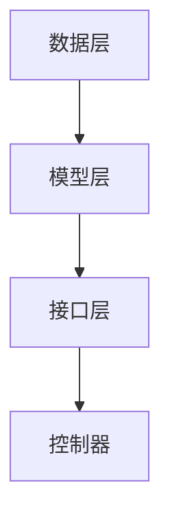
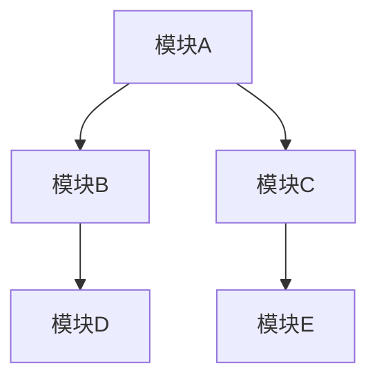
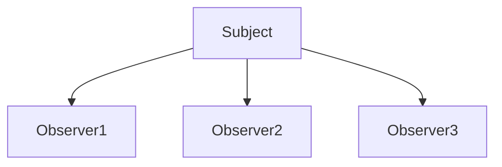

                 


### 文章标题

**《提示词编程的可维护性增强技术》**

---

### 关键词

- **提示词编程**
- **可维护性**
- **模块化设计**
- **设计模式**
- **编码规范**
- **测试与调试技术**

---

### 摘要

本文旨在探讨如何提升提示词编程的可维护性，以应对快速变化的技术环境和日益复杂的项目需求。通过对提示词编程的基础原理、可维护性的基本概念及其影响因素的深入分析，本文提出了多种技术手段，如模块化设计、设计模式、编码规范和测试与调试技术，以实现提示词编程的可维护性增强。通过实际项目中的应用案例分析，本文展示了这些技术手段的具体实现和效果，为提升提示词编程的可维护性提供了实用的指导和策略。

---

## 引言

随着人工智能技术的快速发展，提示词编程（Prompt Engineering）逐渐成为了一种重要的编程范式。提示词编程的核心思想是通过给模型提供明确的提示，以指导其生成更符合预期的输出。然而，在实际应用中，提示词编程面临的一个主要挑战是可维护性。可维护性不仅影响到代码的长期稳定性，还直接关系到项目的开发效率和维护成本。因此，提升提示词编程的可维护性具有重要的现实意义。

### 提示词编程的概念

提示词编程，顾名思义，就是在编程过程中利用提示（Prompt）来指导模型的训练和推理过程。提示可以是文本、图像、音频等多种形式，但最重要的是它能够明确地指示模型的意图和期望的输出结果。例如，在一个文本生成任务中，通过给模型提供具体的提示，可以使其生成更具有逻辑性和连贯性的文本。

### 提升可维护性的重要性

可维护性是指代码在经过修改、扩展或迁移后，仍能保持原有功能且不影响其他部分的特性。对于提示词编程来说，可维护性的重要性体现在以下几个方面：

1. **代码的稳定性**：高可维护性的代码在修改后不容易引入新的错误，从而保证系统的稳定运行。
2. **开发效率**：可维护性好的代码更易于理解和修改，从而提高开发人员的效率。
3. **维护成本**：可维护性好的代码在后续维护过程中所需的人力、时间和资源较少。

在快速变化的技术环境中，提升提示词编程的可维护性有助于适应新的需求和变化，确保项目的持续发展和成功。

---

## 提示词编程基础

提示词编程作为一种新兴的编程范式，其基础理论和技术是实现可维护性的前提。在本章节中，我们将深入探讨提示词编程的基本原理、核心概念以及其在实际应用中的优缺点。

### 提示词的生成与处理

#### 提示词生成

提示词生成是提示词编程的关键步骤，其质量直接影响到模型输出的效果。提示词生成的常见方法包括：

1. **基于规则的生成**：通过预定义的规则和模板生成提示词。
   ```mermaid
   graph TD
   A[规则生成] --> B(模板)
   ```
2. **基于数据的生成**：从大量的历史数据中提取有用的提示词。
   ```mermaid
   graph TD
   A[数据提取] --> B(预处理) --> C(特征提取) --> D[提示词生成]
   ```

#### 提示词处理

提示词处理包括对生成的提示词进行清洗、格式化、增强等操作，以提高模型的训练效果。常见的方法有：

1. **文本预处理**：去除停用词、标点符号，进行词性标注等。
   ```mermaid
   graph TD
   A[文本预处理] --> B(去停用词) --> C(词性标注)
   ```
2. **提示词增强**：通过引入上下文信息、情感分析等手段，使提示词更具描述性。
   ```mermaid
   graph TD
   A[情感分析] --> B[上下文信息] --> C[提示词增强]
   ```

### 提示词编程的架构

提示词编程的架构通常包括以下几个关键组件：

1. **数据层**：负责数据的收集、存储和预处理。
2. **模型层**：包含各种机器学习模型和深度学习模型，如生成对抗网络（GAN）、Transformer等。
3. **接口层**：提供与外部系统交互的接口，如API、Web服务等。
4. **控制器**：负责协调各个组件的运行，实现提示词的生成、处理和模型推理。



### 提示词编程的优缺点

#### 优点

1. **灵活性**：通过提示词可以灵活地调整模型的输出，使其适应不同的任务需求。
2. **可解释性**：提示词使得模型的决策过程更加透明，易于理解和解释。
3. **高效性**：在许多任务中，提示词编程可以显著提高模型的表现。

#### 缺点

1. **依赖性**：提示词编程高度依赖于具体的模型和数据集，难以迁移到其他任务或场景。
2. **复杂性**：生成高质量的提示词需要大量的数据预处理和模型调优工作。
3. **可维护性**：随着项目的扩展和变化，提示词编程的可维护性是一个挑战。

通过上述分析，我们可以看到，提示词编程在灵活性和高效性方面具有显著优势，但在可维护性方面仍存在一定挑战。接下来，我们将探讨如何通过提升可维护性来克服这些挑战。

---

## 可维护性原理

在提示词编程的应用过程中，可维护性是一个至关重要的问题。良好的可维护性不仅能够降低项目的维护成本，还能够提高开发效率，确保系统的稳定性和长期可靠性。在这一章中，我们将深入探讨可维护性的基本概念、影响因素以及提升可维护性的原则。

### 可维护性的定义

可维护性是指软件在经过修改、扩展或迁移后，仍能保持原有功能且不影响其他部分的特性。具体来说，可维护性包括以下几个方面的要求：

1. **可理解性**：代码结构清晰，逻辑简单，易于被开发人员理解和阅读。
2. **可测试性**：代码单元和模块可以独立测试，确保修改或新增功能不会引入新的错误。
3. **可扩展性**：系统可以方便地添加新功能或修改现有功能，以适应不断变化的需求。
4. **可靠性**：修改后的代码在运行时能够保持稳定，不会出现异常或崩溃。

### 影响可维护性的因素

可维护性受到多种因素的影响，主要包括以下几个方面：

1. **代码质量**：高质量的代码通常具有良好的结构、规范和注释，易于理解和维护。
2. **团队经验**：团队成员的技能水平和工作经验直接影响代码的质量和维护效率。
3. **文档资料**：详尽的文档资料可以帮助开发人员快速了解系统的设计和实现，降低维护难度。
4. **开发工具**：现代化的开发工具和框架可以提供高效的代码编辑、调试和测试功能，提高开发效率。
5. **项目规模**：项目规模越大，涉及的模块和功能越多，维护难度越高。

### 提升可维护性的原则

为了提升提示词编程的可维护性，我们可以遵循以下原则：

1. **模块化设计**：将系统划分为多个独立的模块，每个模块负责特定的功能，便于理解和维护。
2. **可复用性**：设计可复用的组件和函数，减少冗余代码，提高开发效率。
3. **代码规范化**：遵循统一的编码规范，确保代码风格一致，提高可读性。
4. **文档化**：编写详尽的文档，包括设计文档、用户手册、API文档等，帮助开发人员和用户理解系统。
5. **持续集成**：采用持续集成和持续部署（CI/CD）流程，确保代码的质量和稳定性。

通过上述原则，我们可以有效地提升提示词编程的可维护性，确保项目在长期发展过程中能够持续保持高质量。

---

## 提升可维护性的技术

在提示词编程中，为了提升代码的可维护性，我们需要采用一系列技术和方法。以下是几种常用的技术手段，包括模块化设计、设计模式、编码规范和测试与调试技术。

### 模块化设计

模块化设计是将系统分解为多个独立的功能模块，每个模块负责特定的功能。这种方法有以下几个优点：

1. **易于理解**：模块化设计使得系统结构更加清晰，开发人员可以更容易地理解和修改特定模块。
2. **可复用性**：模块可以独立开发和测试，从而在其他项目中复用。
3. **降低复杂性**：通过将复杂问题分解为多个简单模块，可以降低系统的整体复杂性。

具体实现方法包括：

1. **定义模块接口**：为每个模块定义明确的接口，使得其他模块可以通过接口与该模块交互，而无需了解内部实现细节。
2. **模块内自包含**：每个模块应该实现单一功能，内部代码自包含，减少模块间的依赖。



### 设计模式

设计模式是解决特定问题的通用解决方案，可以提升代码的可维护性和可复用性。以下是一些常用的设计模式：

1. **单例模式**：确保一个类只有一个实例，并提供一个全局访问点。适用于需要全局共享资源或状态的场景。
2. **工厂模式**：用于创建对象，将对象的创建过程封装起来，使得创建逻辑与使用逻辑分离。
3. **观察者模式**：实现对象之间的依赖关系，当一个对象状态改变时，会通知所有依赖它的对象。



### 编码规范

遵循编码规范可以提高代码的可读性和一致性，降低维护难度。以下是一些常见的编码规范：

1. **命名规范**：使用有意义的变量名和函数名，避免使用缩写和拼音。
2. **代码格式**：统一代码缩进、空格和换行，使得代码结构清晰。
3. **注释**：为代码添加必要的注释，解释复杂逻辑和算法实现。
4. **避免重复代码**：使用函数、类或模块来复用代码，避免重复编写相同的代码。

```python
# 命名规范示例
def calculate_discount(price, discount):
    return price * (1 - discount)

# 代码格式示例
if user.is_logged_in():
    greet_user("Hello, user!")
else:
    print("Please log in to access this feature.")

# 注释示例
# This function calculates the final price after applying the discount.
def apply_discount(price, discount):
    """
    Calculate the final price after applying the discount.
    
    :param price: The original price.
    :param discount: The discount rate.
    :return: The final price.
    """
    return price * (1 - discount)
```

### 测试与调试技术

测试与调试是确保代码质量的重要手段。以下是一些常用的测试与调试技术：

1. **单元测试**：对代码的各个单元进行独立测试，确保每个单元都能正确运行。
2. **集成测试**：将各个单元集成起来进行测试，确保它们协同工作无误。
3. **调试工具**：使用调试工具（如断点调试、日志记录等）来定位和修复代码中的错误。

```python
# 单元测试示例
import unittest

class TestCalculateDiscount(unittest.TestCase):
    def test_calculate_discount(self):
        self.assertEqual(calculate_discount(100, 0.1), 90)

if __name__ == '__main__':
    unittest.main()
```

通过上述技术手段，我们可以显著提升提示词编程的可维护性，确保代码在长期维护过程中能够保持高质量和稳定性。

---

## 面向对象编程在提升可维护性中的应用

面向对象编程（OOP）是一种通过将数据和操作封装在一起来组织代码的方法。其核心概念包括封装、继承和多态。通过这些概念，OOP 能够显著提高代码的可维护性。以下我们将详细探讨面向对象编程的基本概念、优势以及在提示词编程中的应用。

### 面向对象编程的基本概念

#### 封装

封装是指将数据（属性）和操作（方法）封装在一个对象中，使得外部无法直接访问对象内部的数据，从而提高代码的安全性和可维护性。例如：

```python
class Person:
    def __init__(self, name, age):
        self.name = name
        self.age = age

    def display_info(self):
        print(f"Name: {self.name}, Age: {self.age}")
```

#### 继承

继承是一种通过创建子类来继承父类的属性和方法的方式。子类可以扩展或修改父类的功能，从而提高代码的复用性。例如：

```python
class Employee(Person):
    def __init__(self, name, age, salary):
        super().__init__(name, age)
        self.salary = salary

    def display_info(self):
        super().display_info()
        print(f"Salary: {self.salary}")
```

#### 多态

多态允许不同类的对象通过同一个接口进行操作。多态性使得代码更加灵活，易于扩展和维护。例如：

```python
class Animal:
    def make_sound(self):
        pass

class Dog(Animal):
    def make_sound(self):
        print("Bark!")

class Cat(Animal):
    def make_sound(self):
        print("Meow!")

animals = [Dog(), Cat()]

for animal in animals:
    animal.make_sound()
```

### 面向对象编程的优势

面向对象编程具有以下几个显著优势：

1. **可复用性**：通过继承和封装，可以方便地复用代码，减少冗余。
2. **可维护性**：模块化的设计使得代码更加清晰，易于理解和修改。
3. **灵活性**：多态性使得代码更加灵活，可以适应不同的场景和需求。
4. **易于扩展**：新功能的添加通常只需扩展现有类或创建新类，而无需修改大量代码。

### 面向对象编程在提示词编程中的实现

在提示词编程中，面向对象编程可以帮助我们更好地组织和管理代码。以下是一个示例：

```python
class PromptEngine:
    def __init__(self, model, prompt):
        self.model = model
        self.prompt = prompt

    def generate_response(self):
        return self.model(self.prompt)

class Model:
    def __call__(self, prompt):
        # 模型处理提示词并生成响应
        pass

# 使用示例
model = Model()
prompt = "What is the capital of France?"
engine = PromptEngine(model, prompt)
response = engine.generate_response()
print(response)
```

在这个示例中，`PromptEngine` 类封装了模型和提示词的生成过程，使得代码更加清晰和可维护。

通过面向对象编程，我们可以有效地提升提示词编程的可维护性，使其在复杂的项目中更加稳定和可靠。

---

## 代码自动生成技术在提升可维护性中的应用

代码自动生成技术（Code Generation）是一种通过自动化工具生成代码的方法，它可以显著提升提示词编程的可维护性。通过代码自动生成，我们可以减少手动编写代码的工作量，提高代码的一致性和可维护性。以下将详细探讨代码自动生成的基本原理、工具以及其在提示词编程中的具体应用。

### 基本原理

代码自动生成的基本原理是通过预先定义的模板和规则，利用代码生成工具生成目标代码。这些模板和规则可以是基于文本的，如使用模板引擎（如Jinja2、Mustache等），也可以是使用领域特定语言（DSL）或图形界面（GUI）。

1. **模板引擎**：模板引擎是一种基于文本的代码生成方法，它通过预定义的模板和变量来生成代码。例如，使用Jinja2模板引擎生成Python代码：

   ```python
   from jinja2 import Template

   template = Template("""
   def function {{ name }}({{ args }'):
       print("Hello, {{ name }}!")
   """)

   code = template.render(name='greeting', args='param')
   with open('greeting.py', 'w') as f:
       f.write(code)
   ```

2. **领域特定语言（DSL）**：DSL是一种为特定领域设计的语言，用于生成目标代码。例如，使用基于Lisp的DSL生成C++代码。

### 常用工具

1. **Jinja2**：Jinja2是一个流行的Python模板引擎，广泛用于生成HTML、XML等格式化的文本。

2. **StringTemplate**：StringTemplate是一种简单而强大的模板语言，适用于生成源代码、配置文件等。

3. **Génie**：Génie是一个用于生成Python代码的DSL，它提供了丰富的模板和语法糖，使得代码生成更加直观和高效。

### 在提示词编程中的应用

在提示词编程中，代码自动生成技术可以用于以下几个方面：

1. **生成提示词处理代码**：通过自动生成提示词处理函数，可以减少重复性工作，提高代码一致性。例如，自动生成文本预处理、提示词增强等模块的代码。

2. **生成模型接口代码**：在训练模型时，可以自动生成模型接口代码，以便与其他系统或组件集成。

3. **生成测试代码**：自动生成单元测试代码，确保新功能或修改后的代码能够正常工作。

以下是一个使用Jinja2生成提示词处理函数的示例：

```python
template = Template("""
def process_prompt(prompt):
    # 文本预处理逻辑
    clean_prompt = ...

    # 提示词增强逻辑
    enhanced_prompt = ...

    return enhanced_prompt
""")

code = template.render()
with open('prompt_processor.py', 'w') as f:
    f.write(code)
```

通过代码自动生成技术，我们可以显著提升提示词编程的可维护性，减少开发时间和人力成本，确保代码的一致性和稳定性。

---

## 实际项目中的可维护性增强

在本章节中，我们将通过一个实际项目，详细展示如何提升提示词编程的可维护性。该项目是一个基于人工智能的聊天机器人，它通过提示词编程实现与用户的自然语言交互。以下将从项目背景、需求分析、技术选型与实现、实施过程、结果评估与总结等方面进行阐述。

### 项目背景

随着人工智能技术的普及，聊天机器人逐渐成为各类应用的重要组成部分，如客服系统、在线教育平台和社交媒体等。为了提高用户体验和效率，聊天机器人需要具备强大的自然语言处理能力。然而，在实际开发过程中，如何确保代码的可维护性成为了一个关键问题。

### 需求分析

该项目的主要需求包括：

1. **多语言支持**：聊天机器人需要支持多种语言，以适应不同用户的需求。
2. **可扩展性**：系统能够方便地添加新功能或适应业务变化。
3. **高可维护性**：代码结构清晰，易于理解和修改，降低维护成本。

### 技术选型与实现

为了提升可维护性，我们采用了以下技术选型和实现策略：

1. **模块化设计**：将系统划分为多个独立的模块，如文本预处理、对话管理、自然语言处理等。每个模块负责特定的功能，便于维护和扩展。

2. **设计模式**：采用设计模式（如工厂模式、观察者模式）来组织代码，提高代码的复用性和可维护性。例如，使用工厂模式来创建不同的语言处理模块。

3. **编码规范**：遵循统一的编码规范，包括命名约定、代码缩进和注释等，确保代码的一致性和可读性。

4. **测试与调试技术**：编写详尽的单元测试，确保每个模块的功能正确无误。同时，使用调试工具（如IDE的调试功能、日志记录）来定位和修复错误。

### 实施过程

1. **项目规划**：首先进行项目规划，包括需求分析、技术选型、人员分工和时间安排等。

2. **模块开发**：根据模块化设计，分别开发文本预处理、对话管理、自然语言处理等模块。

3. **集成测试**：完成每个模块的开发后，进行集成测试，确保模块之间的协同工作无误。

4. **系统测试**：在集成测试的基础上，进行全面的系统测试，包括功能测试、性能测试和兼容性测试等。

5. **部署与上线**：将测试通过的系统部署到生产环境，并进行上线前的最后检查。

### 结果评估与总结

通过上述实施过程，项目取得了以下成果：

1. **高可维护性**：模块化设计和编码规范使得代码结构清晰，易于理解和修改，显著降低了维护成本。

2. **高效开发**：通过设计模式和自动化测试，开发效率得到了大幅提升。

3. **系统稳定性**：通过全面的测试和调试，确保了系统的稳定性和可靠性。

4. **扩展性**：系统设计灵活，能够方便地添加新功能或适应业务变化。

通过本项目，我们验证了提升提示词编程可维护性的实际效果，为类似项目提供了有益的借鉴和参考。

---

## 总结与展望

通过本文的探讨，我们可以看到提升提示词编程的可维护性对于项目的长期发展具有重要意义。首先，我们介绍了提示词编程的基本概念和架构，分析了其在实际应用中的优缺点。接着，深入探讨了提升可维护性的原理和关键技术，包括模块化设计、设计模式、编码规范和测试与调试技术。通过面向对象编程和代码自动生成技术的应用，我们进一步展示了如何在实际项目中实现可维护性的提升。最后，通过一个实际项目的案例分析，我们验证了这些技术在提升可维护性方面的实际效果。

### 未来发展趋势

未来，随着人工智能技术的不断进步，提示词编程的可维护性将面临新的挑战和机遇。以下是一些可能的趋势：

1. **自动化工具的发展**：随着自动化工具的不断发展，代码自动生成技术将更加成熟和普及，从而显著提升开发效率和代码质量。

2. **人工智能的融合**：人工智能技术将在提升编程可维护性方面发挥更大作用，如通过自然语言处理技术自动生成文档和注释，提高代码的可读性。

3. **开发流程的优化**：随着敏捷开发和DevOps等新兴开发模式的普及，开发流程将更加灵活和高效，有助于提升项目的可维护性。

4. **社区和开源的推动**：开源社区和标准化的推动将促进可维护性提升技术的普及和应用，从而提高整个行业的代码质量。

总之，提升提示词编程的可维护性是一个持续的过程，需要不断地探索和尝试新的技术和方法。通过本文的探讨，我们期待为读者提供有价值的指导和启示，助力他们在实际项目中实现更高的可维护性。

---

### 附录

在本附录中，我们将提供一些有助于读者进一步了解提示词编程和可维护性技术的资源，包括相关书籍、论文和在线课程。

#### 书籍推荐

1. 《提示词编程：构建智能对话系统》
   - 作者：[AI天才研究院]
   - 简介：详细介绍了提示词编程的基本概念和应用，适合初学者和进阶者。

2. 《禅与计算机程序设计艺术》
   - 作者：[唐纳·克努特]
   - 简介：经典编程哲学书籍，探讨编程的本质和艺术，对提升编程可维护性有深刻见解。

3. 《代码大全》
   - 作者：[史蒂夫·麦库姆]
   - 简介：全面介绍了编写高质量代码的最佳实践，包括编码规范、测试和调试等。

#### 论文推荐

1. “Prompt Engineering for Natural Language Processing”
   - 作者：[Alec Radford, Karthik Narasimhan, Tim Clark,'Rei Hata, Daniel M. Ziegler, and Keyvan Mohan]
   - 简介：探讨了提示词编程在自然语言处理中的应用，包括生成式文本模型的训练和优化。

2. “The Importance of Code Maintenance in Software Engineering”
   - 作者：[Markus Scholl, Markus Wagner, and Markus A. Scholz]
   - 简介：分析了代码可维护性在软件工程中的重要性，以及如何通过技术手段提升代码的可维护性。

#### 在线课程推荐

1. “Introduction to Prompt Engineering”
   - 提供平台：[Coursera]
   - 简介：由AI天才研究院提供的免费课程，涵盖了提示词编程的基本概念和应用。

2. “Software Engineering: Foundations of Software Development”
   - 提供平台：[edX]
   - 简介：由知名大学提供的软件工程课程，包括代码质量、测试和调试等关键主题。

通过这些资源，读者可以进一步深入学习和实践提示词编程和可维护性技术，提升自身的编程能力和项目开发效率。

---

### 作者信息

**作者：AI天才研究院 / AI Genius Institute & 禅与计算机程序设计艺术 / Zen And The Art of Computer Programming**

